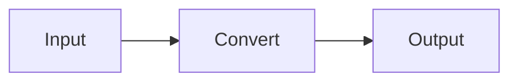
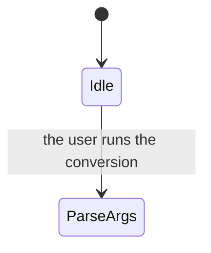

# Figures, math, code, tables and attachments

Loaded by the `strictdoc-md` skill. Read this before you put any of them into
a specification. **The `$` trap and the silent breakages live in
`traps.md`; read that too.**

Everything here was measured on strictdoc 0.27.1.

---

## 2. Writing figures, math, and code

**We measured everything below on strictdoc 0.27.1.** "Passes" means the export
succeeded and produced the HTML we intended.

| Notation | Result | HTML it produces |
|---|---|---|
| a ` ```mermaid ` fence | **passes** | `<pre class="mermaid">` |
| `$E = mc^2$` (inline) | **passes** | `<span class="math notranslate nohighlight">\( ... \)</span>` |
| `$$ ... $$` (block) | **passes** | `<div class="math notranslate nohighlight">\[ ... \]</div>` |
| a ` ```python ` fence | passes but **gets no color** | `<code class="language-python">` |
| a pipe table | **passes** | `<table>` |
| `` | **passes** | `` |
| `[LINK: UID]` | **passes** | `<a href="....html#UID">🔗 title</a>` |
| RST's `.. math::` | **does not pass** | `<p>.. math::</p>` - just a paragraph |
| `[DOCUMENT_FROM_FILE]` | **does not pass** | see 2.6 below |

**StrictDoc bundles MathJax and Mermaid into the output folder** (`_static/mathjax/tex-mml-chtml.js` /
`_static/mermaid/mermaid.min.js`). StrictDoc makes no outside connection. You add nothing to the configuration.

### 2.1 Figures - move a figure past 15 lines into its own document

**This is the only rule.**

| Contents of a ` ```mermaid ` fence | Where it goes |
|---|---|
| **15 lines or fewer** | Write it in the body as it stands |
| **16 lines or more** | Put it in `_assets/fig-*.md` as its own document and send the reader there with `[LINK:]` |

**You count the lines exactly one way.**

- **Do not count** the ` ```mermaid ` line or the closing ` ``` ` line
- **Count the declaration line**, such as `flowchart LR` or `stateDiagram-v2`
- **Do not count blank lines**

The example below is **3 lines** (15 or fewer, so the body is fine).

````markdown

````

**This count matches the query in example 14 of `queries.md` exactly.** The query drops blank
lines as well. You can count by hand, or you can measure with the query after you write the
figure. Both give the same number.

**Even so, do not write toward exactly 15 lines.** A figure always grows later.
**Either keep it clearly small, or move it out without hesitating.**

**We decide by line count because you can judge it without a tool while you write.**
What we really want to control is the burden on the reader, and we measured that as follows.

| Content | tokens |
|---|---:|
| One paragraph of free text | 15-50 |
| A 6-15 line Mermaid figure | 124-179 |
| A 16-24 line Mermaid figure | 110-228 |

**Line count and token count do not track each other cleanly** (one figure runs 114 tokens at
17 lines, another runs 124 tokens at 6 lines). We still take the line count. **When in doubt, move it out.**

We measured what you gain by moving a figure out as well. In this sample:

| What you pull | tokens |
|---|---:|
| The requirement list alone | **91** |
| The large figure alone, named by UID | **334** |
| Every `TEXT` node (figures and math included) | **10,120** |

**As long as you pull requirements, the reader pays not one token for a figure you moved into its own document.**
You name it by UID only when you need it. This is why we cut at 16 lines.

**How to build the separate document** - StrictDoc parses a `.md` file as a document wherever it sits,
so a file inside `_assets/` still needs an H1 and a `**UID**:` line.

````markdown
# Large figure - conversion state machine

**UID**: DOC-FIG-STATE


````

**You do not need a `**Grammar**:` line** (measured). Leave it out and StrictDoc applies the default grammar.
The default grammar also passes when you want to put a requirement node in a figure document.

On the body side you put one link line.

```markdown
We moved the large figure, which covers interruption and cleanup, into its own document -> [LINK: DOC-FIG-STATE]
```

**`.md` gives you no way to pull a figure into the body.** The figure appears only on the separate
page the link points to; StrictDoc does not expand it into the body. StrictDoc also builds the text
of `[LINK:]` from the title of the target, so **you cannot choose that text.**

**★ Rule: give a figure document one shared prefix, in its file name and in its UID.**
StrictDoc does not fix the prefix itself; **each project agrees on its own.**

| | Rule | What this worked example agrees on |
|---|---|---|
| File name | Start it with a prefix that marks it as a figure | **`fig-`** - `_assets/fig-state.md` |
| `**UID**:` | Start it with a prefix that marks it as a figure | **`DOC-FIG-`** - `DOC-FIG-STATE` |

**Only the UID works for a machine.** The audit query (example 14b) decides which figures you
already moved out from the prefix you pass with `--arg figprefix`.
**The file name never enters the JSON, so no query can see it** - the file-name prefix is an
agreement that lets a person spot a figure in a file listing.

**A wrong UID prefix breaks the audit. A wrong file name breaks nothing.**

**When you add a figure to a project that already exists, match the prefix that project uses.**
List the documents with example 1 and you see which UIDs the figure documents carry.
**If the project has no prefix, pick one yourself and write it down in the document that
corresponds to `02-guide-for-human.md`, not in the log in 0.1.**

**Side effect**: `_assets/*.md` shows up in the document list. In this worked example, `DOC-NOTE`
and `DOC-FIG-STATE` are the two. **We accept this** (no way to hide them exists; see below).

**When you move a figure out of the body, fix the free text around it too.** A sentence like
"as the figure below shows" or "in the flow above" dangles the moment the figure disappears.
**Replacing the figure with one link line is not enough.**

**Never exclude a figure document with `exclude_doc_paths`.** The target disappears, so the export
of the side that carries the `[LINK:]` stops (measured).

```text
error: DocumentIndex: the inline link references an object with an UID that does not exist: DOC-FIG-STATE.
```

**This error does not belong to the silent kind.** Even when you want to hide a figure from the list,
you cannot use this method.

### 2.2 Math - only `$` and `$$`

| How you write it | What comes out |
|---|---|
| `$ ... $` | It sits inside the sentence |
| `$$ ... $$` | It becomes a line of its own |

**You cannot use RST's `.. math::`.** Write it and the characters `.. math::` come out as a paragraph.
**The export does not stop, so you notice nothing until you look at the HTML.**

**With `$ ... $` and with `$$ ... $$` alike, the LaTeX inside passes through untouched.** `\bar{T}`,
`\frac{a}{b}`, a `\\` line break, `\begin{aligned}` and `\begin{pmatrix}` all reach MathJax exactly as
you wrote them (measured). **Markdown applies neither escaping nor emphasis inside a formula** -
the `_` in `T_a` never turns into an `<em>`.

**Outside a formula, though, Markdown collapses `\\` into a single `\`** - that is ordinary Markdown
escaping, not a defect.

---

### 2.4 Code - always write the language name

````markdown
```python
def convert(src: str, dst: str) -> None:
    os.replace(tmp, dst)
```
````

The output HTML becomes `<code class="language-python">`, but **StrictDoc carries no syntax
highlighting** (we measured zero pygments spans). **You get no color.
We accept this.**

**Write the language name anyway.** The JSON keeps the language name exactly as you wrote it, so it
gives a later reader the only clue for telling what kind of code this is. G31 in
`queries.md` cannot pick up a fence that carries no language name.

### 2.5 StrictDoc interprets nothing inside a fence

**Mermaid and code behave the same way.** A `[LINK: SW-001]` you write inside a fence does not
become a link; it comes out as plain text. Inside a fence, `$`, `|` and `**` all do nothing.

- To point from a figure to a requirement, **put the link outside the fence**
- Put any string that must escape the `$` trap inside a fence or a code span

**When you want to write ` ``` ` in the body, as a query does, open the fence with four backticks.**
Three backticks close the fence partway through. StrictDoc reads a four-backtick fence correctly too (measured).

### 2.6 Never write `[DOCUMENT_FROM_FILE]`

This is the include notation of `.sdoc`. **It not only fails to work in `.md`, it also breaks
silently depending on how you write it** (measured).

| How you write it | What happens |
|---|---|
| `[DOCUMENT_FROM_FILE]: path` | Markdown reads it as a link reference definition and **drops the whole line** |
| `[DOCUMENT_FROM_FILE]` after you wrote the line above | It resolves to that definition and **becomes a broken link** |
| `[DOCUMENT_FROM_FILE]` on its own | It comes out as plain text |

**The export succeeds in every case.** When you want to split content into its own document, use the `[LINK:]` from 2.1.

### 2.7 Tables

**A pipe table is the only table you get.** RST grid and simple formats do not pass. **You do not have to align the columns.**

```markdown
| symbol | meaning |
|---|---|
| a | alpha |
```

**A table passes even when you drop the pipes at both ends** (measured), but **always write them.**
Drop them and the table-checking query in `queries.md` cannot find the row.

**Alignment markers (`:---` / `:---:` / `---:`) and empty cells pass.**
**You can use `` `code` ``, `**bold**` and `[link](path)` inside a cell** (measured).

**You can put a table in the `STATEMENT` of a requirement.** The JSON holds it exactly as you wrote it,
so you can pull the table out on its own, rewrite it and write it back (example 19).

#### 2.7.1 Three ways to write a table that breaks silently

**The export succeeds in every case. Only the HTML comes out broken.**

| How you write it | What happens |
|---|---|
| **The row holds more cells than the header** | **Markdown throws the extras away.** In `\| this \| row \| is \| long \|`, "long" disappears |
| The row holds fewer cells than the header | Markdown pads with empty cells. The harm is small |
| **An unescaped `\|` inside a cell** | The column splits right there |

**★ A code span does not protect `|`.** It differs from `$` here.

| How you write it | Result |
|---|---|
| `a \| b` (escaped) | **Passes.** The cell shows `a \| b` |
| `` `a \| b` `` (escaped inside a code span as well) | **Passes.** This is the correct way to write it |
| `` `a \| b` `` with the `\` removed | **Splits.** A code span does not protect `\|` |

**A code span protects `$`, yet it does not protect `|`.** Do not confuse the two.

**The JSON keeps a broken row exactly as you wrote it** (measured). **So you can detect it with
example 20 before you look at the HTML. Zero hits is normal.**

**Do not end a cell with `$`** (`traps.md`). **This one alone stops the export.**

### 2.8 Attachments

**StrictDoc copies whatever you put in `_assets/` to the output, whatever its type** (measured).
This mechanism does not serve images alone.

| What you do | How you write it |
|---|---|
| Place an image | `` |
| **Attach something other than an image** | `[description](_assets/x.csv)` - write it as an ordinary link |

We put `.csv`, `.pdf` and `.zip` files in `_assets/` and ran the export: **all four reached the
output, and every link resolved** (measured). **An SVG stays sharp when you zoom in, so make SVG the default for a figure image.**

**★ An attachment breaks silently in two ways. The export reports success.**

| How it breaks | What happens |
|---|---|
| **The file you reference does not exist** | The `` or the `<a>` still comes out. Open it and you get a 404 |
| **You put the file outside `_assets/`** | The file exists, yet StrictDoc **does not copy it**. Open it and you get a 404 |

**The asset folder always carries the name `_assets`.** Create a folder under another name, such as
`attachments/`, and StrictDoc does not scan it (measured; the source writes the name directly as
`find_directories(..., "_assets")`).

**Neither one prints anything in the export log.** So run **example 18** of `queries.md` every time.
**Zero hits is normal.**

- **Never hand `exclude_doc_paths` a folder such as `_assets/**`.**
  StrictDoc passes the same setting to **both** "find the documents" and "find the asset folder",
  so it stops copying the images too. The export reports success, yet the images in the HTML come back as 404

---
