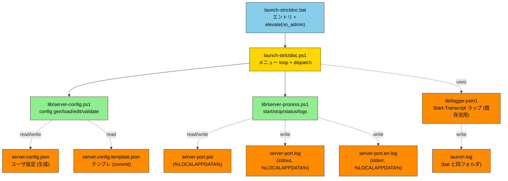
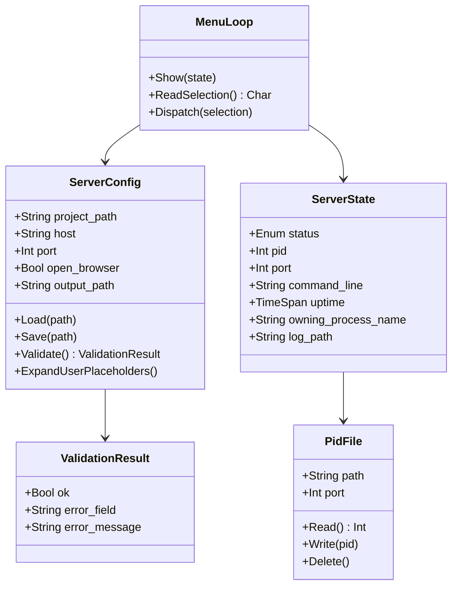
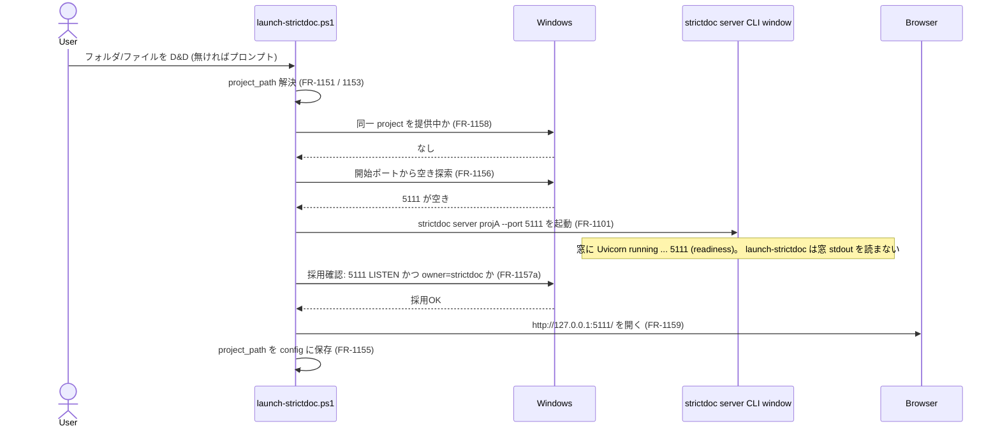
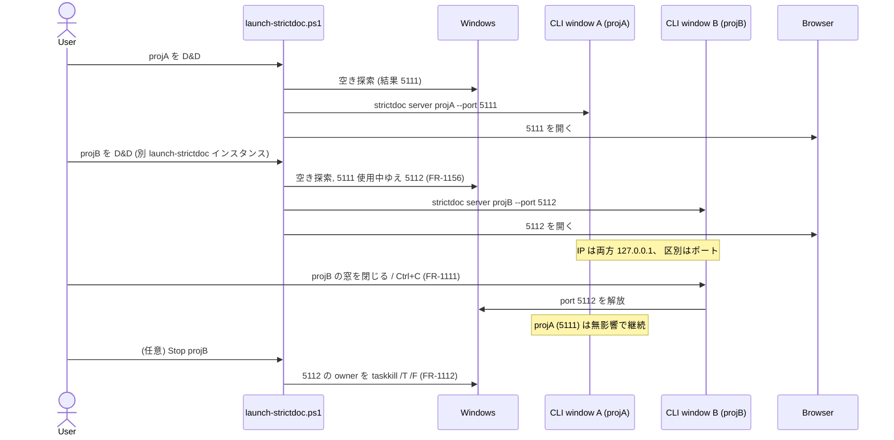
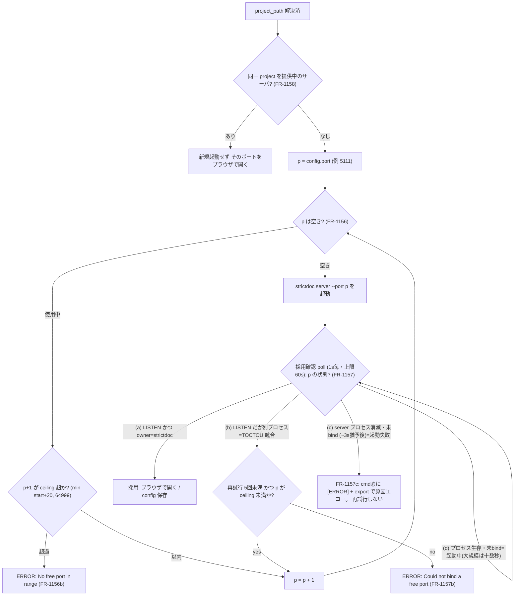
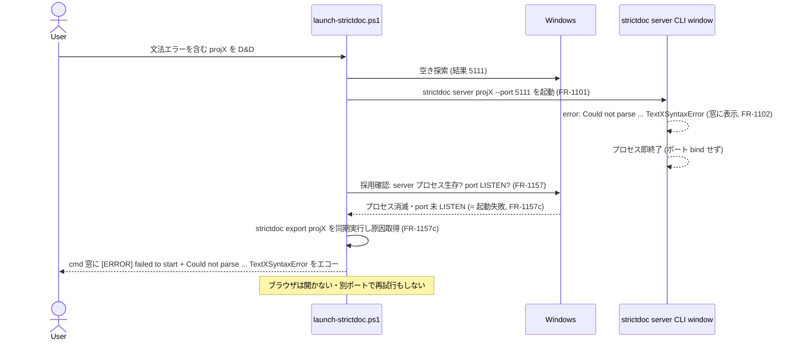

# launch-strictdoc — StrictDoc Server Lifecycle Management 仕様書

| 項目 | 値 |
|---|---|
| 文書名 | launch-strictdoc — StrictDoc Server Lifecycle Management 仕様書 |
| バージョン | v1.2 (D&D/プロンプト入力 + ポート自動割当。 v1.1: 公式委譲 & 可視ウィンドウ方式) |
| テンプレート | ANMS v0.33 |
| ツール名 | **launch-strictdoc** (StrictDocStarter 同梱) |
| エントリ | `launch-strictdoc.bat` (フォルダ/ファイルを D&D または単体起動。 v1.2: 純ランチャ → strictdoc server CLI window + ブラウザ → 終了。 メニュー無し — FR-1121 / ADR-115) |
| 対象 | strictdoc がインストール済み Windows 11 PC |
| 親仕様 | [`docs/setup-spec.md`](setup-spec.md) (StrictDocStarter v1.0) |
| リポジトリ | `https://github.com/GoodRelax/gr-tools/tree/main/StrictDocStarter` |

---

> ## ⚠️ v1.1 改訂サマリ (2026-06-06) — 必読
>
> 調査の結果、 StrictDoc 公式は **サーバ起動 (`strictdoc server` = 可視コンソール、 readiness/error 表示つき)・プロジェクト雛形 (`strictdoc new`)・設定形式 (`strictdoc_config.py`)** を既に提供しており、 **公式に無いのはインストーラのみ**であることが判明した。 そこで本仕様は方針転換する:
>
> - **D-5 スコープ**: StrictDocStarter は「Windows ブートストラップ + ダブルクリック」に集中し、 サーバ起動 / 雛形 / 設定は **公式へ委譲** (再発明しない)。
> - **D-6 可視ウィンドウ方式**: server を **可視コンソール窓**で起動し、 公式の readiness (`Uvicorn running on …`) / error (`Could not parse …`、 即終了) 表示をそのまま使う。 **隠れバックグラウンド + ポート poll + PID file + Start-Transcript ロックは廃止**。
>
> → これにより **§2.1.3-2.1.7 (FR-300/400/500/700 系)、 ADR-104/105/107/110/112、 3.1-3.5 の隠れデーモン前提は Chapter 6 (改訂 v1.1) により supersede される**。 §1-§5 の当該記述 (例: 1.3 Goal 3-4、 1.4 Approach、 1.6 Scope の 4/5 状態管理) は **v1.0 の歴史的記録**として残置し、 実装時は **Chapter 6 が優先**する。 根拠の全量は内部設計ノート (`improvement-items.md`、 本リポジトリには非収録) にある。

## Chapter 1. Foundation

### 1.1 Background

- StrictDoc は `strictdoc server <project-path>` で Web UI を提供 (デフォルト http://127.0.0.1:5111)
- PoC 段階で手動起動/停止を繰り返している → 1-click 化したい
- setup-strictdoc.bat で環境構築済の Windows 11 上で、 「server 起動 → ブラウザで編集 → 停止」 を最短手数で行えるようにする
- 仕様の親は [`docs/setup-spec.md`](setup-spec.md)。 本書は setup の延長サブツール (= launch-strictdoc) の仕様

### 1.2 Issues

- 毎回手動で `strictdoc server` をタイプ (path 入力ミス、 port 衝突確認漏れ)
- バックグラウンド起動方法が定まらず、 ターミナルがブロックされる / ウィンドウが散らかる
- どのプロセスが strictdoc server か特定する手段が乏しく、 終了し損ねが頻発
- 別フォルダで PoC を切り替える際、 古い server を確実に止める手段が必要

### 1.3 Goals

1. **ダブルクリック → メニュー → 1 押し** で start / stop / status / logs / Edit config を選べる (→ **v1.2 改訂 (option C / ADR-115): メニュー廃止・純ランチャ**へ。 D&D / プロンプトで開く文書を決め、 起動 → ブラウザ → 終了。 Stop/Status/Logs は strictdoc server CLI window と再ドロップが担う。 G6-1 / FR-1121)
2. 設定は `server.config.json` 1 ファイルで宣言、 メニューから Edit config で更新可能
3. server プロセスは確実に終了できる (PID file + 本人確認、 取りこぼしなし)
4. メニュー .bat を Ctrl+C で終了しても server は影響なく稼働継続 (daemon-like)

### 1.4 Approach

- **メニュー対話方式** (vs サブコマンド引数方式): ユーザの記憶負荷ゼロ、 ダブルクリック完結
- **`Start-Process -WindowStyle Hidden` + stdout/stderr redirect** でバックグラウンド起動
- **PID file (主) + port-based (fallback) + 本人確認 (CommandLine に "strictdoc")** の 3 段防御で server 特定
- 設定変更は `Edit config` メニュー → 既定エディタ起動 → メニュー戻り時に毎回再ロード + validate
- ログは **launch-strictdoc 操作 (launch.log) と server stdout (server-\<port\>.log) を分離** (SRP)

### 1.5 Tool Inventory (依存)

新規 install ツールなし。 以下が setup-strictdoc.bat 完了済として前提:

| No | ツール | 用途 | 導入元 |
|---|---|---|---|
| 01 | strictdoc | `strictdoc server` の本体 | pip (setup Phase C) |
| 02 | Python | strictdoc 実行基盤 | winget (setup Phase B) |
| 03 | VS Code (任意) | 既定エディタ fallback の `code` | winget (setup Phase A) |
| 04 | PowerShell 5.1+ | スクリプト実行基盤 | Windows 11 標準 |

### 1.6 Scope

**In-scope:**

- Windows 11 + Python + strictdoc 導入済環境
- 1 つの `project_path` / 1 つの `port` での server 管理 (1 メニュー .bat = 1 server)
- start / stop / status / logs / Edit config の 5 メニュー操作
- `server.config.json` による設定宣言
- PID file + port LISTEN による状態管理 (4 状態: RUNNING / STOPPED / STALE_PID_FILE / OTHER_OWNS_PORT)
- 既定ブラウザ自動 open (`config.open_browser`)
- `gather-logs.bat` への log 統合 (server-*.log / launch.log)

**Out-of-scope (v1.0):**

- 複数 server の並行管理 (1 メニュー .bat = 1 server。 並行検証は別フォルダコピーで対応)
- strictdoc TOML config (`--config`) のパススルー
- 認証 / アクセス制御 (strictdoc 自体に機能なし、 127.0.0.1 bind 前提)
- Windows 10 / non-Windows OS
- メニュー UI の TUI / GUI 化 (text のみ)
- log rotation (サイズ閾値)
- proxy 環境対応 (setup と同じく v1.0 対象外)
- CI/automation 用のサブコマンド引数式 (将来追加余地は残す)

### 1.7 Constraints

- Windows 11 + PowerShell 5.1+
- **管理者権限不要** (server 起動は user 権限、 setup と異なり `_lib/elevate.bat no_admin` で call)
- `strictdoc` / `python` が PATH に通っていること (setup-strictdoc.bat 完了済前提)
- スクリプト本体は **ASCII only** (setup-spec.md ADR-008 継承)
- **単一 Windows アカウントのみが本ツールを使用する PC** を前提 (信頼境界 = 単一ユーザ)。 別アカウントや admin による PID file / log file 改ざんは検出しない
- **実装時の変数名規約**: `$pid` は PowerShell の予約自動変数 (現プロセス PID) のため、 server プロセスの PID を保持する変数には `$serverPid` 等を使用すること (Glossary 参照)

### 1.8 Limitations

- 同じ port で別アプリが LISTEN している場合、 launch-strictdoc は start を拒否 → ユーザに config 編集を促す (別 port を提案しない)
- メニュー .bat を Ctrl+C で終了しても server プロセスは生存継続 (= feature、 ただし多重起動の責任はユーザ)
- `%LOCALAPPDATA%\StrictDocStarter\` 配下の PID file が手動削除されると port-based fallback に依存 (動作は OK だが log で警告)
- Python CLI app の特性上、 graceful shutdown 不可 (Stop-Process 即時終了、 -Force fallback)
- CommandLine 本人確認は `Get-CimInstance Win32_Process` に依存。 **WMI 無効化環境では本人確認に失敗し続け Stop が abort される** → 復旧は PID file の手動削除 (`%LOCALAPPDATA%\StrictDocStarter\server-<port>.pid` を delete) → 次回 Stop で port-based fallback。 escape hatch (強制 stop 確認 prompt) は v1.x で再検討
- `Get-NetTCPConnection` で OwningProcess を取得する際、 **別ユーザ / 昇格プロセスが port を占有していると OwningProcess 取得できず `UNKNOWN_OCCUPANT` として表示** される (FR-505)。 PoC「単一ユーザ」 前提下では稀
- PID file の信頼性: 同一ユーザ ACL 下で書込制限はあるが、 admin プロセスが任意 PID を書き込めば誤検出される。 single-user PoC スコープではこの脅威モデルを採用しない

### 1.9 Glossary

| 用語 | 説明 |
|---|---|
| launch-strictdoc | 本仕様の対象ツール |
| StrictDocStarter | 親ツール (setup-strictdoc + launch-strictdoc + gather-logs) |
| メニュー方式 | `.bat` 起動 → 番号選択 → アクション → メニュー戻り、 のループ UI |
| PID file | プロセス ID を 1 行で保存するファイル (一般的 daemon パターン) |
| port-based fallback | PID file 不在時に LISTEN 中の port から OwningProcess を取得して特定する方式 |
| 本人確認 | 停止対象プロセスの CommandLine に "strictdoc" が含まれるか確認 (誤殺防止) |
| 5 状態 | (v1.0) RUNNING / STARTING / STOPPED / STALE_PID_FILE / OTHER_OWNS_PORT。 **v1.1 (FR-1113) で 3 状態 RUNNING / OTHER_OWNS_PORT / STOPPED へ簡素化** (PID file 廃止に伴い STARTING / STALE_PID_FILE を削除) |
| `%LOCALAPPDATA%` | `C:\Users\<user>\AppData\Local` (Windows のユーザローカルキャッシュ領域、 NTFS ACL でユーザ単位アクセス制御) |
| Expand-UserPlaceholders | setup-spec.md FR-208 由来、 `<user>` を `$env:USERNAME` に展開する関数 |
| Expand-PathPlaceholders | 拡張版。 `<user>` (FR-208) + `<starter_root>` (launch-strictdoc.bat のフォルダ絶対パス) の両方を展開。 unzip-and-go で同梱 `samples/` を default project_path に指せるようにする |
| `<starter_root>` | path placeholder。 `launch-strictdoc.bat` のフォルダの絶対パスに展開される。 template の default `project_path` で `<starter_root>\samples\md-basic-en` を使用 |
| samples/ | StrictDocStarter 同梱の StrictDoc サンプルプロジェクト 6 個。 **4 個は「同じ要求を 2 つの記法で持つ対」** — `md-` が Markdown、 `sd-` が `.sdoc` (RST)。 `md-basic-{ja,en}` / `sd-basic-{ja,en}` (最小構成。 写して始める。 **`sd-` は記法対照用なので `md-` より小さい**)。 **`md-basic-en` が初期 default である** (D-9w)。 `md-sovd-automotive-{ja,en}` は要求 122 件の中規模 SOVD 仕様である。 `.sdoc` 版の SOVD は保守の負担が見合わないため削除した (D-9r)。 sovd 系は 00 概要 + 01 ステークホルダ要求 + 02 ユースケース + 03-07 要求/基盤 + 08 設計 + 09 API + 10 テスト仕様 + 11 テスト結果 + `_assets/` の図 8 と覚書 1、 要求→設計→API→テスト仕様→結果の V 字を EARS/L0-L3 + Implements/Satisfies/Verifies/ResultOf でトレース、 ASIL/CAL/Layer/Type custom fields、 共有文法 `sovd-grammar.sgra` (REQUIREMENT/COMPONENT/API/TEST/TEST_RESULT) |
| `$pid` | **PowerShell の予約自動変数** で現プロセス自身の PID を保持。 server プロセスの PID 変数として **使用禁止** (= 自プロセスを stop 対象にしてしまう事故防止)。 `$serverPid` / `$targetPid` 等を使用 |
| MOTW | Mark-of-the-Web。 Web/Zip 経由で取得したファイルに付くゾーン情報、 PowerShell が実行を阻害することがある |
| WMI | Windows Management Instrumentation。 プロセス情報等を取得する Windows の管理基盤 |
| CIM | Common Information Model。 WMI の新世代 API、 PowerShell では `Get-CimInstance` で参照 |
| OwningProcess | `Get-NetTCPConnection` が返すプロパティで、 該当 TCP socket を所有するプロセス PID |
| LISTEN | TCP socket が接続待ち受け状態であること (`Get-NetTCPConnection -State Listen`) |
| EARS | Easy Approach to Requirements Syntax。 Ubiquitous / Event-driven / State-driven / Unwanted-behaviour / Optional の 5 パターンで要求を書く規約 |
| SRP | Single Responsibility Principle。 1 モジュール = 1 つの変更理由 |
| `_lib\elevate.bat no_admin` | setup-spec.md FR-806 の共通ヘルパ、 引数 `no_admin` は UAC 昇格を要求せず MOTW strip + CWD 正規化のみ実行するモード |
| BOM | Byte Order Mark。 UTF-8 ファイル先頭の ``、 PowerShell 5.1 の `ConvertFrom-Json` が誤動作する原因 |
| HasExited | PowerShell `Start-Process -PassThru` が返す Process object のプロパティ、 子プロセス終了済かを判定 |
| `strictdoc server CLI window` | 公式 `strictdoc server` を**前景実行する Windows コンソール窓** (旧称「server 窓 / 可視窓」)。 StrictDoc 公式のサーバ起動バナー (`StrictDoc Web Server vX` / Server URL / Documentation / mailing list) と Uvicorn の `Uvicorn running on …` ログを表示する。 文書ごとに 1 窓。 **窓を閉じる / Ctrl+C でサーバ停止** (FR-1111)。 利用者が操作する UI は別途ブラウザの StrictDoc Web UI。 図中の短縮表記は `CLI window` |
| launch-strictdoc cmd 窓 | `launch-strictdoc.bat`→`.ps1` が動く**ランチャ側**のコンソール窓。 入力解決・ポート割当・起動・起動失敗の原因表示 (FR-1157c) を担う。 上記 `strictdoc server CLI window` とは**別物** |

### 1.10 Notation

- RFC 2119/8174 準拠
- **SHALL / MUST** = 必須
- **SHOULD** = 推奨
- **MAY** = 任意
- EARS の `shall` は SHALL と同義

---

## Chapter 2. Requirements

### 2.1 Functional Requirements

#### 2.1.1 起動・dispatch (FR-100 系)

| ID | パターン | 要求 |
|---|---|---|
| FR-101 | Ubiquitous | `launch-strictdoc.bat` はダブルクリックで起動可能であること |
| FR-102 | Ubiquitous | `launch-strictdoc.bat` は冒頭で `call _lib\elevate.bat no_admin "%~f0" "%*"` を call して MOTW strip + CWD 正規化を行うこと (UAC 昇格は不要、 setup-spec.md FR-806 表に行追加) |
| FR-103 | Ubiquitous | `launch-strictdoc.bat` は `launch-strictdoc.ps1` を `powershell -ExecutionPolicy Bypass -File` で呼び出すこと |
| FR-104 | Ubiquitous | `launch-strictdoc.ps1` は無限ループでメニューを表示し、 ユーザが `Q` を入力するまで継続すること |
| FR-105 | Ubiquitous | 各メニュー操作 (1〜5) 完了後、 メニュー再表示に戻ること (1 回の操作で終了しない) |
| FR-106 | When | `launch-strictdoc.bat` 起動時、 `Start-Transcript` (既存 `lib/logger.psm1` の `Start-OnboardLog -LogPath <launch.log>` を流用) で `launch.log` (bat と同フォルダ) に全実行ログを **append** モードで記録すること |
| FR-107 | If | もし `Q` または Ctrl+C で終了した時、 server が稼働中ならば `[INFO] Server is still running (PID X on port Y). Use 'Stop' next time to terminate it.` を 1 行表示すること |
| FR-108 | Ubiquitous | メニュー入力は **case-insensitive** で判定すること (`q`/`Q`/`r`/`R` 等両方 OK) |
| FR-109 | If | もし不正な選択肢が入力されたら、 `Invalid selection. Choose [1/2/3/4/5/Q].` warn を表示してメニュー再表示すること |
| FR-110 | If | もし `Start-Transcript` (FR-106) が失敗 (= 同一 `launch.log` を別 PowerShell session が既にロック中、 二重起動の兆候) ならば、 `launch-strictdoc.ps1` は `[ERROR] Another launch-strictdoc session appears to be running (cannot lock launch.log). Close it first, then retry.` を表示して即時 abort (exit code 1) すること。 ロック検出は Start-Transcript の `-ErrorAction Stop` + `try/catch` で実装可能 |

#### 2.1.2 設定ファイル管理 (FR-200 系)

| ID | パターン | 要求 |
|---|---|---|
| FR-201 | If | もし `server.config.json` が存在しなければ、 `launch-strictdoc.ps1` は `server.config.template.json` から copy + `<user>` 即時展開で生成すること。 生成時のエンコーディングは **UTF-8 BOM なし** とすること (PowerShell 5.1 の `ConvertFrom-Json` が BOM 付き UTF-8 を `Unexpected character encountered` で reject するため) |
| FR-202 | When | 初回生成直後、 `launch-strictdoc.ps1` は既定エディタを以下の順で fallback して起動すること: (a) `Get-Command code -ErrorAction SilentlyContinue` で `code` 存在確認 → `Start-Process code -ArgumentList '--reuse-window', '<path>' -PassThru` で起動、 (b) 1 秒後に `Process.HasExited == true` かつ exit code != 0 ならば失敗とみなし notepad fallback、 (c) `code` 不在ならば `Start-Process notepad -ArgumentList '<path>'` で起動 |
| FR-203 | When | 初回 config 編集後、 `launch-strictdoc.ps1` は `Press Enter when you have saved the config...` で待機すること (`yes` 入力は不要、 Enter のみ) |
| FR-204 | Ubiquitous | `server.config.json` は JSON 形式 (**UTF-8 BOM なし推奨**、 `_comment_*` プロパティでコメント表現) であること。 読込時は `Get-Content -Raw -Encoding UTF8` 取得後、 先頭 BOM (``) を strip してから `ConvertFrom-Json` に渡すこと (notepad で保存すると BOM が付くケースに対応) |
| FR-205 | Ubiquitous | `server.config.json` は以下のフィールドを含むこと: `project_path` (必須) / `host` / `port` / `open_browser` / `output_path` (任意、 default あり) |
| FR-206 | Ubiquitous | `server.config.json` は `.gitignore` 対象、 **`server.config.template.json` のみ commit** すること |
| FR-207 | Ubiquitous | `server.config.template.json` および `server.config.json` の top-level に `_comment_overview` キーを含めること。 **値は 1 行 ASCII 文字列** で `Required: <fields>. Optional with defaults: <field (default); ...>.` の形式に従うこと (setup-spec.md FR-210 流儀、 機械検証可能) |
| FR-208 | Ubiquitous | `project_path` および `output_path` 内の path placeholder は path 操作 (`Test-Path` / `Join-Path` / `Start-Process` 等) より **先に** `Expand-PathPlaceholders` で展開すること。 サポートする placeholder: (a) `<user>` → `$env:USERNAME` (setup-spec.md FR-208 継承)、 (b) `<starter_root>` → `launch-strictdoc.bat` の置かれているフォルダの絶対パス (unzip-and-go で同梱 samples/ が見つかるようにする)。 **重要**: Initialize-ServerConfig が template を raw text 置換する際、 `_comment_*` フィールド内に置換対象リテラル (`<user>` / `<starter_root>`) を含めてはならない (説明テキストまで誤置換される。 documentation は別の語 (USERNAME / STARTER_ROOT) を使用するか README に書く) |
| FR-209 | Ubiquitous | メニュー loop の **毎回先頭** で `server.config.json` を再ロード + validate すること (in-memory cache 禁止)。 これにより Edit config 後の変更が即反映される |
| FR-210 | Ubiquitous | validation rules: (a) `project_path` 展開後の絶対パスが存在 + ディレクトリ、 (b) `host` は **IPv4 dotted-decimal** (`^\d{1,3}(\.\d{1,3}){3}$`) **または** `localhost` **または** IPv6 literal (`^[0-9a-fA-F:]+$`) のいずれか (※ StrictDoc 本体の `is_valid_host` は任意のホスト名も許容するが、 本ツールは PoC 安全側として IP/localhost に限定)、 (c) `port` は **1025..64999** の整数 (strictdoc は CLI `--port` が `[1024,65000]` inclusive・config 形式が `(1024,65000)` exclusive と経路で差があるため、 両経路で確実に有効な範囲に安全側で限定)、 (d) `open_browser` bool、 (e) `output_path` 任意 (空文字 or 任意文字列、 存在チェックなし) |
| FR-211 | If | もし validation に失敗したら、 メニューヘッダ直下に `[CONFIG ERROR] <field>: <message>` を表示し、 menu `5` (Edit config) と `Q` のみ enabled、 `1`〜`4` は disabled とすること (選択しても `Fix config first (menu 5).` 警告でメニュー戻り) |
| FR-212 | When | menu `5` (Edit config) は FR-202 と同じ fallback ロジック (`Get-Command code` 存在確認 → `Start-Process -PassThru` + HasExited 確認 → notepad fallback) で `server.config.json` を開くこと。 起動は **ブロックしない** (= エディタを閉じる前にメニューに戻る) |
| FR-213 | Ubiquitous | `_comment_*` キーは **表示専用**、 `Invoke-Expression` / `Start-Process` / `&` 等の評価対象としないこと (setup-spec.md FR-213 継承) |

#### 2.1.3 server start (FR-300 系)

| ID | パターン | 要求 |
|---|---|---|
| FR-301 | When | menu `1` (Start) は `Start-Process strictdoc -ArgumentList 'server', $project_path, '--host', $host, '--port', $port [, '--output-path', $output_path] -WindowStyle Hidden -RedirectStandardOutput <stdout_log> -RedirectStandardError <stderr_log>` で server をバックグラウンド起動すること (output_path が空文字なら引数省略)。 **stdout と stderr は別ファイル** に redirect すること (PowerShell 5.1 が同一ファイル指定を reject するため、 FR-702 参照) |
| FR-302 | When | start 直後、 `launch-strictdoc.ps1` は `%LOCALAPPDATA%\StrictDocStarter\server-<port>.pid` にプロセス PID を **改行 1 文字付きで** 書き出すこと (**生成側は trailing newline 必須**、 読み側は FR-704 で trailing newline を許容)。 **pip launcher 対応**: `strictdoc.exe` (pip-generated wrapper) は内部で `python.exe` を child として spawn し、 child が LISTEN socket を所有する Windows 固有の挙動を持つ。 そこで Wait-ForPortListen (FR-303 a) の成功後、 `Get-NetTCPConnection` の OwningProcess が launcher PID と異なり、 かつその PID の CommandLine に "strictdoc" を含むならば、 **PID file を listener PID で上書き更新** すること。 これにより Status (FR-502) の「PID == OwningProcess」 判定が成立する。 launcher の親プロセスは listener 終了とともに自動 exit する想定 |
| FR-303 | When | start 後、 `launch-strictdoc.ps1` は以下の 2 段確認を行うこと: (a) 最大 30 秒 (1 秒間隔) で `Get-NetTCPConnection -LocalPort $port -ErrorAction SilentlyContinue` の LISTEN 確認、 (b) LISTEN 確認後、 さらに最大 **5 秒** (1 秒間隔) で `Invoke-WebRequest -Uri "http://<host>:<port>/" -UseBasicParsing -TimeoutSec 1 -ErrorAction SilentlyContinue` を発行し、 HTTP 応答 (どの status code でも可、 TCP reset でなければ OK) を受信するまで待機すること。 これにより uvicorn 起動準備中の TCP open / HTTP not-ready 窓を回避 |
| FR-304 | If | もし FR-303 (a) が 30 秒 timeout または (b) が 5 秒 timeout になったら、 `[WARN] Timeout waiting for server to be ready. Check Logs (menu 4) for details.` を表示し PID file は **残置** すること (process は生きてる可能性、 status で再確認可能) |
| FR-305 | If | もし start 時に既起動の server が検出されたら (status RUNNING)、 `Already running (PID X on port Y). [R]estart / [O]pen browser / [C]ancel?` の 3 択 prompt を表示し、 `R`/`O`/`C` (case-insensitive) で分岐すること。 `R` = stop → start 連続実行、 `O` = ブラウザ open のみ、 `C` = メニュー戻り |
| FR-306 | If | もし port が strictdoc 以外のプロセスに占有されていたら (status OTHER_OWNS_PORT)、 `Port <port> is occupied by '<process-name>' (PID <pid>). Cannot start. Edit config (menu 5) to use a different port.` を表示して abort すること (別 port を自動提案しない)。 `<process-name>` が取得不可 (= UNKNOWN_OCCUPANT、 FR-505) ならば `<process-name>` 部分を `<unknown owner>` と表示 |
| FR-307 | If | もし `config.open_browser=true` かつ start が成功 (FR-303 (a) + (b) 共に確認済) ならば、 `launch-strictdoc.ps1` は `Start-Process http://<host>:<port>/` で既定ブラウザを起動すること |
| FR-308 | Ubiquitous | ブラウザ open URL の host が `0.0.0.0` **または IPv6 wildcard `::`** の場合は `127.0.0.1` に置換すること (どちらもブラウザで直接 open 不可) |
| FR-309 | Ubiquitous | server stdout の redirect 先は `%LOCALAPPDATA%\StrictDocStarter\server-<port>.log`、 stderr の redirect 先は `%LOCALAPPDATA%\StrictDocStarter\server-<port>.err.log` (start 毎に追記)。 区切り行 `=== Server started <YYYY-MM-DD HH:MM:SS> ===` は **`Start-Process` 呼出の直前** に `Add-Content -Path <stdout_log>` で stdout log のみに 1 行 append すること (race を防ぐため事後ではなく事前) |
| FR-310 | When | `%LOCALAPPDATA%\StrictDocStarter\` ディレクトリは初回 start 時に `New-Item -ItemType Directory -Force` で自動作成すること |
| FR-311 | Ubiquitous | start "success" の定義は **exit code ではなく** **port LISTEN 確認 (FR-303 a) + HTTP 応答確認 (FR-303 b) + プロセス生存** とすること (background プロセスのため exit code は無意味) |
| FR-312 | When | menu `1` (Start) は実行直前に status を probe し、 もし **`STALE_PID_FILE`** または **`STARTING`** (= 30 秒以上前に start したが LISTEN 未確認) ならば、 PID file を自動削除して **`STOPPED` 扱い** で start に進むこと (= 古い start の残骸を自動 cleanup)。 これにより「前回 start が timeout して以来 ずっと Start ボタンが効かない」 詰みを回避 |

#### 2.1.4 server stop (FR-400 系)

| ID | パターン | 要求 |
|---|---|---|
| FR-401 | When | menu `2` (Stop) は PID file (`%LOCALAPPDATA%\StrictDocStarter\server-<port>.pid`) を読み、 PID を取得すること |
| FR-402 | If | もし PID file が存在しなければ、 port-based fallback として `Get-NetTCPConnection -LocalPort $port -ErrorAction SilentlyContinue` の OwningProcess を取得すること |
| FR-403 | Ubiquitous | 停止対象プロセスの **本人確認** として `Get-CimInstance Win32_Process -Filter "ProcessId=$pid"` から CommandLine を取得し、 文字列 "strictdoc" を含むかを確認すること (大文字小文字無視) |
| FR-404 | If | もし本人確認に失敗したら (CommandLine に strictdoc が含まれない)、 `[WARN] PID <pid> is not a strictdoc process (CommandLine: '<cmd>'). Aborting stop.` を表示してプロセスを殺さず abort し、 PID file は残置すること |
| FR-405 | When | 本人確認パス後、 `Stop-Process -Id $pid` (-Force なし) を試行すること |
| FR-406 | When | Stop-Process 後、 最大 **5 秒** (1 秒間隔) で `Get-Process -Id $pid -ErrorAction SilentlyContinue` によりプロセス消滅を待機すること |
| FR-407 | If | もし 5 秒経過しても生存していたら、 `Stop-Process -Id $pid -Force` で強制終了を試行し、 さらに最大 **3 秒** 待機すること |
| FR-408 | If | もし 3 秒経過しても生存していたら、 `[ERROR] Failed to stop PID <pid> even with -Force. Investigate manually.` を表示し PID file は残置すること |
| FR-409 | When | プロセス消滅を確認した後、 PID file を削除すること |
| FR-410 | If | もし stop が成功したら、 `[OK] Server stopped (PID <pid>).` を表示すること |
| FR-411 | If | もし PID file も port LISTEN も無ければ (status STOPPED)、 `[INFO] Server is not running.` を表示してメニューに戻ること |

#### 2.1.5 server status (FR-500 系)

| ID | パターン | 要求 |
|---|---|---|
| FR-501 | Ubiquitous | status は以下の **5 状態** のいずれかを返すこと: `RUNNING` / `STARTING` / `STOPPED` / `STALE_PID_FILE` / `OTHER_OWNS_PORT` |
| FR-502 | Ubiquitous | `RUNNING` 判定: PID file 存在 **かつ** PID プロセス生存 **かつ** CommandLine に "strictdoc" **かつ** 該当 port LISTEN 中 |
| FR-503 | Ubiquitous | `STARTING` 判定: PID file 存在 **かつ** PID プロセス生存 **かつ** CommandLine に "strictdoc" **かつ** port LISTEN まだなし **かつ** プロセス起動から **30 秒以内**。 = start 直後の TCP socket open 待ち窓を表現 (誤って STALE 表示しないため) |
| FR-504 | Ubiquitous | `STOPPED` 判定: PID file 無 **かつ** port LISTEN 無 |
| FR-505 | Ubiquitous | `STALE_PID_FILE` 判定: PID file 存在 だが以下のいずれか: (a) プロセス無、 (b) strictdoc でない、 (c) port LISTEN していない **かつ** プロセス起動から 30 秒超過 (STARTING 範囲外) |
| FR-506 | Ubiquitous | `OTHER_OWNS_PORT` 判定: PID file 無 **かつ** port LISTEN 中 だが本人確認失敗 (= strictdoc でない別アプリが占有)。 `Get-NetTCPConnection` の OwningProcess が取得できない (別ユーザ / 昇格プロセス占有) 場合は **`UNKNOWN_OCCUPANT`** をサブ状態として `Status:` 行に注記表示すること (1.8 Limitations 参照) |
| FR-507 | Ubiquitous | メニューヘッダの `Status:` 行に現在状態を表示すること。 RUNNING 時は PID + uptime を併記 (`[RUNNING] PID X (uptime: hh:mm:ss)`)、 STARTING 時は `[STARTING] PID X (waiting for LISTEN, <elapsed>s/30s)` を表示 |
| FR-508 | When | menu `3` (Status) は再 probe して結果を 1 行 + 詳細 (PID/uptime/log path/port owner 等、 状態に応じて) を表示し、 `Press Enter to return to menu...` で待機すること |
| FR-509 | Ubiquitous | uptime 計算は `(Get-Process -Id $serverPid).StartTime` を基点に算出し、 `hh:mm:ss` 形式で表示すること (24h 超過時は `dd.hh:mm:ss` のように day を prefix)。 変数名は `$pid` (PowerShell 予約自動変数) との衝突を避けるため `$serverPid` を使用 (Glossary 参照) |

#### 2.1.6 logs 表示 (FR-600 系)

| ID | パターン | 要求 |
|---|---|---|
| FR-601 | When | menu `4` (Logs) は `%LOCALAPPDATA%\StrictDocStarter\server-<port>.log` (stdout) の **末尾 50 行** を表示すること。 続いて `server-<port>.err.log` (stderr) が存在しかつ非空ならば、 `--- stderr (last 20 lines) ---` ヘッダ付きで stderr 末尾 20 行も表示すること |
| FR-602 | If | もし stdout log file が存在しなければ、 `[INFO] No log file yet at <path>. Start the server first.` を表示すること (.err.log だけの存在は無視) |
| FR-603 | Ubiquitous | 末尾表示後、 `Press Enter to return to menu...` で待機すること |
| FR-604 | Ubiquitous | log 表示は `Get-Content -Tail 50` (stderr 側は `-Tail 20`) を使用すること (ファイル全読みを禁止、 巨大 log でも O(1) 相当) |

#### 2.1.7 PID file / log file 管理 (FR-700 系)

| ID | パターン | 要求 |
|---|---|---|
| FR-701 | Ubiquitous | PID file パス: `%LOCALAPPDATA%\StrictDocStarter\server-<port>.pid` |
| FR-702 | Ubiquitous | server stdout log パス: `%LOCALAPPDATA%\StrictDocStarter\server-<port>.log`、 server stderr log パス: `%LOCALAPPDATA%\StrictDocStarter\server-<port>.err.log` (FR-301 で別ファイル必須) |
| FR-703 | Ubiquitous | launch-strictdoc 操作ログパス: `<launch-strictdoc.bat と同フォルダ>\launch.log` (Start-Transcript で append、 FR-106) |
| FR-704 | Ubiquitous | PID file の中身は 1 行の整数 (PID)、 trailing newline は **読み側で許容** (生成側は FR-302 で必須)。 PID parse は `[int]::TryParse((Get-Content -Raw -TotalCount 1 $pidFile).Trim(), [ref]$serverPid)` を使用 |
| FR-705 | Ubiquitous | server log の rotation は行わず、 start 毎に区切り行 `=== Server started <YYYY-MM-DD HH:MM:SS> ===` を追記 (FR-309)。 .err.log には区切り行を付けない (stderr は OS / strictdoc 由来でフォーマット制御が難しい、 タイムスタンプは stdout 側のみで十分) |
| FR-706 | Ubiquitous | launch-strictdoc log の rotation は行わず、 起動毎に Start-Transcript の append モードで継続。 起動毎の区切りは Start-Transcript 既定の `**********************` separator を許容 |

#### 2.1.8 メニュー UX (FR-800 系)

| ID | パターン | 要求 |
|---|---|---|
| FR-801 | Ubiquitous | メニューヘッダは以下を含むこと: title + horizontal line (`=` 連続) + `Config:` 絶対パス + `Project:` (展開後 path) + `Host:` + `Port:` + `Status:` 行 |
| FR-802 | Ubiquitous | メニュー本体は 1〜5 + Q の 6 項目、 各項目 1 行で表示。 各項目は `<番号>. <名称> - <短い説明>` 形式 |
| FR-803 | If | もし CONFIG ERROR 状態ならば、 メニュー本体は `5` (Edit config) と `Q` のみ表示すること (1〜4 行を suppress) |
| FR-804 | Ubiquitous | プロンプトは `Select [1/2/3/4/5/Q]: ` (CONFIG ERROR 時は `Select [5/Q]: `) |
| FR-805 | Ubiquitous | アクション完了後はメニュー再表示前に 1 行空けて視認性を保つこと |
| FR-806 | Ubiquitous | メニュー画面は毎回 `Clear-Host` で screen clear してから描画すること (旧出力との混在で誤読を防ぐ) |

#### 2.1.9 エラー処理 / ログ統合 (FR-900 系)

| ID | パターン | 要求 |
|---|---|---|
| FR-901 | Ubiquitous | launch-strictdoc は `setup.log` を読み書きしないこと (setup-strictdoc.bat との独立性確保、 NFR-008) |
| FR-902 | Ubiquitous | (**v1.1 改訂**) 既存 `gather-logs.ps1` は **`<bat フォルダ>\launch.log` (存在時のみ)** を回収対象に追加すること。 ~~`server-*.log` / `*.pid`~~ は **ADR-113 (可視ウィンドウ方式) で生成されなくなったため回収対象外** (窓がログそのもの。 `%LOCALAPPDATA%\StrictDocStarter\` 自体を作らない) |
| FR-903 | Ubiquitous | 外部コマンド (`strictdoc` / `code` / `notepad`) を呼び出す関数は `$ErrorActionPreference = "Continue"` ローカル退避 + `$LASTEXITCODE` 信頼パターン (setup-spec.md FR-311 / ADR-011 流儀) を踏襲すること |
| FR-904 | Ubiquitous | エラー出力タグは `[INFO]` / `[WARN]` / `[ERROR]` / `[OK]` の 4 種に統一すること (setup の流儀踏襲) |
| FR-905 | Ubiquitous | `Get-CimInstance Win32_Process` 呼び出し失敗時 (WMI 無効化、 権限不足、 CommandLine が `$null` 等) は本人確認を「失敗 (= strictdoc でない)」 と判定して安全側に倒すこと (誤殺防止)。 ユーザが詰んだ場合の復旧手段 (PID file 手動削除) は 1.8 Limitations に明記 |

#### 2.1.10 テスト要件 (FR-1000 系)

host テストとして以下を最低限カバーする (詳細手順は §5 Test Strategy)。

| ID | パターン | 要求 |
|---|---|---|
| FR-1001 | Ubiquitous | **正常系**: start → status RUNNING → logs (末尾 50 行表示) → stop → status STOPPED の 5 段階を 1 セッションで通すこと |
| FR-1002 | Ubiquitous | **negative**: port 競合 (別アプリが 5111 を LISTEN している状態で start) で FR-306 警告 + abort を確認 |
| FR-1003 | Ubiquitous | **negative**: PID file 手動削除後の stop が port-based fallback で動くことを確認 (FR-402 / FR-403) |
| FR-1004 | Ubiquitous | **negative**: CONFIG ERROR 状態 (project_path 存在しないディレクトリ) で menu 1〜4 が disabled、 5/Q のみ有効を確認 (FR-211) |
| FR-1005 | Ubiquitous | **negative**: 本人確認失敗ケース (notepad などの非 strictdoc プロセスの PID を server-<port>.pid に書いて stop) で誤殺されないことを確認 (FR-404) |
| FR-1006 | Ubiquitous | **UI**: Edit config (menu 5) でエディタが開き、 ブロックせずメニューに戻ることを確認 (FR-212) |
| FR-1007 | Ubiquitous | **UI**: Q 入力で server 稼働中の警告 (FR-107) が表示されることを確認 |
| FR-1008 | Ubiquitous | **negative**: メニュー二重起動で 2 つ目の session が abort されることを確認 (FR-110) |
| FR-1009 | Ubiquitous | **timing**: STARTING 状態が start 直後に観測可能であることを確認 (FR-503) |
| FR-1010 | Ubiquitous | **正常系**: HTTP probe 完了後にブラウザ open されることを確認 (LISTEN だけでなく HTTP 応答も検証、 FR-303 b) |

### 2.2 Non-Functional Requirements

| ID | カテゴリ | 要求 |
|---|---|---|
| NFR-001 | 応答性 | メニュー表示 → 入力 prompt までの遅延は **初回 5 秒以内、 2 回目以降 1 秒以内** (毎回 config 再ロード + validate + status probe 込み)。 初回が緩いのは Windows の `Get-CimInstance` cold call が 1〜3 秒かかるため (Limitations) |
| NFR-002 | 起動時間 | ⚠️ **v1.1 で撤廃 (§6.7 / ADR-113・FR-1102: 固定タイムアウト無し)。 以下は v1.0 歴史的記録。** Start ボタン → ブラウザ open までは strictdoc 起動時間 + 数秒、 LISTEN 確認 30 秒 + HTTP 応答確認 5 秒の合計 最大 35 秒 (FR-303) |
| NFR-003 | 停止時間 | ⚠️ **v1.1 で撤廃 (§6.7 / FR-1112: 窓閉じは即時)。 以下は v1.0 歴史的記録。** Stop ボタン → プロセス消滅までは 正常時 5 秒以内、 -Force fallback 含めて最大 8 秒 (FR-406 + FR-407) |
| NFR-004 | 文字 | 全ログは **UTF-8 / 文字化けなし** |
| NFR-005 | 文字コード | スクリプト本体 **および console 出力メッセージ** は **ASCII only** (setup-spec.md NFR-006 / ADR-008 継承)。 仕様書 (本書) と config の `_comment_*` 値は ASCII の範囲で英語表記 |
| NFR-006 | 配置 | 任意フォルダから実行可能 (CWD 非依存、 setup-spec.md NFR-005 継承) |
| NFR-007 | 互換 | `server.config.json` は標準 JSON パーサで読めること (拡張記法なし、 `_comment_*` のみ慣習)。 PowerShell 5.1 の `ConvertFrom-Json` を前提に BOM strip を FR-204 で要求 |
| NFR-008 | 独立性 | launch-strictdoc は setup-strictdoc が生成する `setup.log` / `setup.config.json` / `env-report.json` を読まない / 書かないこと (= 独立稼働) |
| NFR-009 | 機密 | パスワード / PAT / トークンを `server.config.json` および log file に保存しないこと (strictdoc 自体が認証機能なし、 そもそも該当情報なし) |
| NFR-010 | 可搬性 | `.bat` / `.ps1` / `.psm1` / `.js` / `.json` / `.py` / `.sgra` / `.svg` は、 **コメントと利用者向けメッセージを含め英語 ASCII のみ**で記述すること。 多言語化の対象は**利用者が編集する `.sdoc` / `.md` に限る** (仕様書・README 等の `.md` は文書であり対象外)。 理由: 本ランチャの動作環境のコンソールは cp932 であり、 非 ASCII の出力やソースは文字化け・encoding 依存の不具合を招く (§7 環境メモの `print` 落ちが実例)。 CI 相当の確認として、 上記拡張子を再帰走査し非 ASCII 文字を報告するスクリプトを検証パスに含めること (`.git/` `.venv/` `venv/` `__pycache__/` `exported-json/` `node_modules/` `output/` `temp/` は除外)。 **ランチャが自動生成するローカル設定 (`server.config.json` / `setup.config.json`) も走査対象から外すこと。** これらの中身は人が書いたソースではなく利用者データである — ランチャは起動が成功するたびに利用者が選んだフォルダの絶対パスを `project_path` へ書き戻す (FR-1155) ため、 利用者が日本語名のフォルダを開けばこの門番は必ず赤くなり、 門番の赤が常態になれば本物の違反を見落とす。 どちらも gitignore 済みで公開しない。 非 ASCII のパスを許す根拠は FR-1167 (`project_title` は利用者に見せる文字列であり本要求の対象外) と同じである。 **commit する `*.template.json` は走査対象のまま残すこと** — テンプレートは人が書くファイルであり、 本要求が守る対象そのものである |

---

## Chapter 3. Architecture

### 3.1 Architecture Concept

**Layered + Menu Loop + Adapter**。 setup-strictdoc と同じ層構成 (Framework: .bat / Use case: dispatcher .ps1 / Adapter: lib/*.ps1 / Entity: config.json + log files)。 differences from setup:

- Use case 層は **メニュー loop** (vs setup の `auto` Phase オーケストレーション)
- Adapter 層は **`server-config.ps1` + `server-process.ps1`** の 2 ファイル (SRP: config 管理 と server lifecycle が別 concern)
- Entity 層に **PID file** を新規追加 (server プロセス特定のキー)

### 3.2 Components



### 3.3 File Structure

```text
StrictDocStarter/
├── setup-strictdoc.bat                  # (既存) 環境構築 launcher
├── setup-strictdoc.ps1                  # (既存)
├── launch-strictdoc.bat                 # (新規) サーバ管理 launcher
├── launch-strictdoc.ps1                 # (新規) メニュー loop + dispatch
├── gather-logs.bat                      # (既存)
├── gather-logs.ps1                      # (既存、 改修: server-*.log / *.pid / launch.log 回収)
├── change-color-mode.bat                # (D-10) 色モード切替の入口。 no_admin で elevate を call
├── change-color-mode.ps1                # (D-10) server.config.json の color_mode を書く (FR-1162)
├── assets/                              # (D-10) 同梱アセット
│   └── theme-dark.css                   # (FR-1162) ダーク配色の規則本体。 3 モードはここから生成
├── tools/                               # (D-10) 検証用スクリプト
│   ├── ascii-audit.py                   # (NFR-010) コード / 設定に非 ASCII が無いことを確認
│   ├── verify-jq.py                     # 文書に載っている jq が今も動くことを確認
│   ├── check-jq-output.py               # 文書に貼ってある jq の出力が今も正しいことを確認
│   ├── check-references.py              # (D-9u) 見出しの引用・[LINK:]・ファイル名が解決することを確認
│   ├── check-symmetry.py                # (D-9u) ja / en 対の文書・ノード・辺が一致することを確認
│   ├── check-numbers.py                 # (D-9u) 出力の隣の地の文の件数と、 比にすべき絶対値を確認
│   ├── run-query-fixture.py             # (D-9u) 全クエリが 1 行以上返すことを投入用データで確認
│   ├── check-skill-sync.py              # (D-9v) 同梱スキルが実例と歩調を合わせていることを確認
│   ├── query-fixture-defects.md         # (D-9u) 上記が植える欠陥の見本
│   ├── capture-manual-ja.py             # 手引きの画面写真を撮り直す
│   └── capture-manual-en.py             # 同上 (英語版。 27 枚)
├── _lib/
│   └── elevate.bat                      # (既存) no_admin で launch-strictdoc / change-color-mode が call
├── lib/
│   ├── check.ps1                        # (既存、 影響なし)
│   ├── config.ps1                       # (既存、 影響なし)
│   ├── install.ps1                      # (既存、 影響なし)
│   ├── clone.ps1                        # (既存、 影響なし)
│   ├── auto.ps1                         # (既存、 影響なし)
│   ├── proxy.ps1                        # (既存、 影響なし)
│   ├── logger.psm1                      # (既存、 launch-strictdoc も流用)
│   ├── server-config.ps1                # (新規) config gen/load/edit/validate
│   └── server-process.ps1               # (新規) start/stop/status/logs
├── setup.config.template.json           # (既存)
├── setup.config.json                    # (既存、 gitignore)
├── server.config.template.json          # (新規、 commit、 default project_path = <starter_root>\samples\md-basic-en)
├── server.config.json                   # (新規、 gitignore)
├── samples/                             # (新規、 commit) 同梱サンプル
│   ├── sd-basic-ja/                     # (D-9h) .sdoc の基本。 丸ごと写して始める用
│   │   ├── 00-guide-for-human.sdoc      # 目的 (UID なしの地の文) + 基本/添付/表/出力の入れ子セクション
│   │   ├── 01-upper.sdoc                # 上位要求 SYS-001..003 (EARS)。 EARS の章を持つ
│   │   ├── 02-lower.sdoc                # 下位要求 SW-001..004 (Parent → SYS-)
│   │   ├── 03-tests.sdoc                # TEST_CASE TC-001..004 (Gherkin。 Parent + ROLE Verifies → SW-)
│   │   ├── 04-review.sdoc               # (D-9j) レビューの進め方。 指摘は要求の REVIEW_* に書く
│   │   ├── 05-markdown.sdoc             # OPTIONS: MARKUP: Markdown を宣言した唯一の文書 (パイプ表)
│   │   ├── basic.sgra                   # 共有文法。 全文書が IMPORT_FROM_FILE で参照
│   │   ├── _assets/                     # fig-flow.sdoc (Mermaid 断片) / note.md (LINK 先) / flow.svg
│   │   └── strictdoc_config.py          # (D-8) project_path 直下 (D-1/FR-1141)。 左ツールバー 3 画面 (FR-1146)
│   ├── md-basic-ja/                     # (D-9h) 同内容を全部 .md で。 sd-basic-ja と UID 共通
│   │   ├── 00-ai-guide.md           # AI 向けの圧縮版。 exclude_doc_paths で文書からは除外
│   │   ├── 02-guide-for-human.md 〜 10-cowork-with-claude.md  # sd-basic-ja と同じ仕様書 + .md 固有の手引き
│   │   ├── basic.sgra                   # sd-basic-ja と同一内容
│   │   ├── _assets/                     # note.md (LINK 先) / flow.svg。 Mermaid は本文へ直書き
│   │   └── strictdoc_config.py          # sd-basic-ja と project_title 以外同一
│   ├── sd-basic-en/ md-basic-en/        # (D-9i/j) 上記 2 つの英語版。 07/08 の手引きは日本語版のみ
│                                        # (D-9w) md-basic-en が **初期 default**
│   ├── md-sovd-automotive-ja/           # (D-9k) SOVD の実仕様を全部 .md で
│   │   ├── 00-overview.md 〜 11-test-results.md  # 12 文書
│   │   ├── sovd-grammar.sgra            # TITLE を組み込みメタ欄の後ろへ、 LEVEL を TEST_LEVEL へ
│   │   ├── _assets/                     # 別文書にした Mermaid 8 件 (fig-*.md) / 構成図 png,svg,drawio / note-md-to-sdoc.md
│   │   └── strictdoc_config.py
│   ├── md-sovd-automotive-en/           # (D-9k) 同上の英語版
│   │   └── (md-sovd-automotive-ja と同じ構成。 ノード数も 1 件残らず一致)
│                                        # (D-9l) sovd-automotive-{ja,en} (.sdoc の原本) は削除した。
│                                        # (D-9r) sd-sovd-automotive-{ja,en} も削除した。 保守の負担が
│                                        #        記法対照の値打ちに見合わない。
│                                        # (D-9s) sdoc-patterns も削除した。 .sdoc の対照は
│                                        #        sd-basic-{ja,en} が担う
├── setup.log                            # (既存、 gitignore)
├── launch.log                           # (新規、 gitignore)
├── env-report.json                      # (既存、 gitignore)
└── docs/
    ├── setup-spec.md                    # (既存)
    └── serve-spec.md                    # (新規、 本書)

%LOCALAPPDATA%\StrictDocStarter\         # (新規 dir、 launch-strictdoc 初回 start 時に作成)
├── server-<port>.pid                    # (新規、 launch-strictdoc が生成)
├── server-<port>.log                    # (新規、 stdout)
└── server-<port>.err.log                # (新規、 stderr)
```

### 3.4 Domain Model



`ServerState.status` enum (v1.0): `RUNNING` / `STOPPED` / `STALE_PID_FILE` / `OTHER_OWNS_PORT` (FR-501)。 **v1.1 (FR-1113) では 3 状態 `RUNNING` / `OTHER_OWNS_PORT` / `STOPPED` へ簡素化** (PID file 廃止)。

### 3.5 Behavior

> 現行の挙動図 (可視ウィンドウ + ポート管理) は **§6.10.8** を参照。 v1.0 の隠れデーモン方式 Start / Stop / メニュー シーケンス図は削除した (`Start-Process` をアクター化していた・ Start 図と Stop 図で登場要素が不揃いだった旧図)。

### 3.6 Decisions

#### ADR-101: バッチファイル名 = launch-strictdoc.bat

- **Status**: v1.0 は `manage-strictdoc.bat` を採用。 **v1.2 で `launch-strictdoc.bat` へ改名** (ADR-115 / option C で純ランチャ化し Stop/Status/Logs/メニューを廃止 → もはや「管理 (manage)」しないため)。
- **Context**: 候補比較 (serve-strictdoc / strictdoc-server / start-strictdoc / launch-strictdoc / control-strictdoc / strictdoc-ctl 等)。 評価軸: (a) setup-strictdoc.bat との命名対称性、 (b) 実態の含意、 (c) 短さ、 (d) 既存 `strictdoc server` CLI との衝突有無、 (e) 英語自然さ。 v1.0 は 5 メニューで lifecycle を「管理」する想定だったため `manage`。 v1.2 で D&D → 起動 → ブラウザ → 終了の一時ランチャに変わった。
- **Decision**: `launch-strictdoc.bat` / `.ps1`。 動詞 `launch` が「strictdoc server CLI window + ブラウザを起動する」実態を表す。 `setup-strictdoc` と動詞 prefix で対称。 `start-` は `strictdoc server` 内部の start と語が被るため不採用。
- **Consequences**: ファイル一覧で `setup-strictdoc.bat` と並んだ時、 動詞対比 (setup = 導入 vs launch = 起動) が自然に伝わる。 旧名 `manage-strictdoc` は全廃 (本仕様内の参照も改名済)。

#### ADR-102: メニュー対話方式 (vs サブコマンド引数方式)

- **Status**: Accepted (v1.0)。 **v1.1 で一部 superseded by FR-1121 (D-7)**: 可視ウィンドウ方式採用後は最小メニューに、 **さらに v1.2 (ADR-115 option C) でメニュー廃止・純ランチャに決定**。 旧「5 メニュー対話 (start/stop/status/logs/edit)」前提は撤回
- **Context**: `launch-strictdoc.bat start <path>` 等のサブコマンド引数式と、 `launch-strictdoc.bat` ダブルクリック → メニュー番号選択式の 2 案を比較
- **Decision**: メニュー対話方式。 1〜5 番号 + Q で全操作
- **Consequences**: ダブルクリック完結。 CI/automation には不向きだが v1.0 スコープ外。 将来サブコマンド引数式を追加するなら互換性ありで拡張可

#### ADR-103: 1 ポート専用 (vs マルチサーバ管理) — YAGNI

> **v1.2 で緩和**: ADR-114 (ポート自動割当) が本 ADR を supersede。 複数文書の同時提供を許可する (§6.10 参照)。

- **Status**: Accepted
- **Context**: 「複数 PoC を並行検証したい」 ニーズに対し、 (i) 1 ポート専用 / (ii) ポート切替 / (iii) マルチサーバ一覧管理 の 3 案
- **Decision**: 1 ポート専用 (v1.0)。 並行検証は「StrictDocStarter フォルダを別場所にコピーして config 分離」 で対応
- **Consequences**: メニュー UI が劇的にシンプル化。 PID file 命名は `server-<port>.pid` で port suffix を残し将来 (iii) 化への拡張余地保持

#### ADR-104: PID file 主 + port-based fallback + 本人確認 (vs プロセス名検索)

- **Status**: Accepted
- **Context**: 停止対象 server プロセスの特定方式 3 案 (PID file / port-based / プロセス名検索)
- **Decision**: PID file を主、 PID file 不在時のみ port-based fallback、 さらに殺す前に本人確認 (CommandLine に "strictdoc" 含む) を必須化
- **Consequences**: 3 段防御 (PID file → port → 本人確認)。 PID file 削除/破損や別アプリ port 占有でも誤殺を防ぐ。 `Get-Process strictdoc` 全停止案は不採用 (他フォルダの launch-strictdoc が動かす strictdoc を巻き込むため)

#### ADR-105: Start-Process Hidden + log redirect (vs Start-Job / 別ターミナル)

- **Status**: Accepted
- **Context**: バックグラウンド起動方式 3 案
- **Decision**: `Start-Process -WindowStyle Hidden -RedirectStandardOutput/-Error` で独立プロセス起動
- **Consequences**: メニュー .bat を Ctrl+C しても server は動き続ける (feature: 後で再起動して stop 可能)。 出力は log file へ。 リアルタイム閲覧したい時は menu 4 Logs で末尾 50 行を tail。 Start-Job は親 PS セッション終了で死ぬので daemon に不向き、 別ターミナルは画面が散らかる

#### ADR-106: %LOCALAPPDATA% に PID/log 配置 (vs カレント or %TEMP%)

- **Status**: Accepted
- **Context**: PID file / log file の配置先
- **Decision**: `%LOCALAPPDATA%\StrictDocStarter\` 配下に統一
- **Consequences**: OneDrive 同期から除外 (本来 OneDrive にあるべき情報ではない、 sync 負荷も減る)。 ユーザローカル state として自然。 `%TEMP%` は OS 自動削除リスク、 カレントは OneDrive 配下になる可能性ありで両方不適

#### ADR-107: launch-strictdoc 操作ログと server stdout を分離 (SRP) + launch.log は bat 同フォルダ配置

- **Status**: Accepted
- **Context**: 1 つの log にまとめる vs 分離する。 launch.log の配置先を `%LOCALAPPDATA%` (server log と統一) vs bat 同フォルダ (= リポジトリ root、 OneDrive 配下になる可能性あり) で検討
- **Decision**: `launch.log` (メニュー操作 / 判断トレース) と `server-<port>.log` (strictdoc 出力) を分離。 `launch.log` は **bat と同フォルダ** に配置 (理由: ユーザが障害時にすぐ見つけられる、 `setup.log` と並んで「StrictDocStarter family の log」 という家族感を出す)。 `.gitignore` で commit を防ぐ
- **Consequences**: SRP 遵守 (変更理由が異なる: launch-strictdoc 操作 UX 変更 vs strictdoc アプリ出力)、 trouble shooting で「どっち見るべきか」 が明確 (launch-strictdoc 起動失敗なら launch.log、 server アプリ失敗なら server-<port>.log)。 launch.log は OneDrive 同期下に置かれる可能性あり (デスクトップ展開時) だが、 size は数 KB〜数十 KB なので sync 負荷は無視可能

#### ADR-108: 初回 config 編集後の確認は Enter のみ (vs yes 入力)

- **Status**: Accepted
- **Context**: setup-strictdoc.bat の config フローは「edit → `yes` 入力で確定」 だが、 launch-strictdoc の config は daily-use で頻繁に編集する可能性あり、 yes は煩雑
- **Decision**: 初回 config 編集後は `Press Enter when you have saved the config...` で Enter のみで先進む
- **Consequences**: setup と異なる UX。 setup は重大な install 操作の前の最終確認 (yes 必須が妥当)、 launch-strictdoc の config 確定はミスっても server 起動失敗で巻き戻し容易 → リスク低くて Enter のみで妥当

#### ADR-109: stop 時の本人確認 = CommandLine に "strictdoc" 含むか

- **Status**: Accepted
- **Context**: 停止対象プロセスが本当に strictdoc であることをどう確認するか。 (a) `(Get-Process).Path` で strictdoc.exe 確認、 (b) `(Get-Process).Path` で python.exe 確認、 (c) `Get-CimInstance Win32_Process` の CommandLine に "strictdoc" 文字列含むか
- **Decision**: (c) CommandLine 文字列 match
- **Consequences**: strictdoc が `strictdoc.exe` 直接 / `python.exe -m strictdoc` 両ケースに対応 (どちらも CommandLine に "strictdoc" は含まれる)。 (a)/(b) は実装の違いで誤判定の余地あり。 WMI 無効化された特殊環境では FR-905 で安全側 (= 殺さない) に倒す

#### ADR-110: stop 方式 = Stop-Process + 5 秒 wait + -Force fallback (graceful 不要)

- **Status**: Accepted
- **Context**: graceful shutdown を試行すべきか
- **Decision**: Windows + Python CLI app の制約上、 SIGTERM 等の graceful シグナルを strictdoc は受けない。 WM_CLOSE も console app には届かない。 → `Stop-Process` (内部 TerminateProcess) で即時終了が事実上の最善
- **Consequences**: 5 秒 wait + -Force fallback で確実性確保。 graceful 不要は Windows コンソール app の一般的特性、 strictdoc 仕様変更なき限り維持

#### ADR-111: メニュー画面は毎回 Clear-Host

- **Status**: Accepted
- **Context**: メニュー再描画前に screen clear するかどうか。 (a) Clear-Host で常にクリーンな画面 / (b) アクション出力を上に残し、 メニューを下に再描画 (scroll back)
- **Decision**: (a) `Clear-Host`。 ヘッダの Status 行を最新で見せるのが第一目的。 過去のアクション出力は `launch.log` で永続化されているため、 ターミナル上でのスクロールバック必要性は低い
- **Consequences**: 画面が毎回リセットされる。 アクション直後の出力 (e.g. `[OK] Server started.`) はメニュー再描画前に user が読むタイミングを取らせる必要あり (FR-805 で「アクション完了後 1 行空ける」 + 必要なら `Press Enter to return...` で待機)

#### ADR-112: 二重起動検出は Start-Transcript ロック失敗検出で行う

- **Status**: Accepted
- **Context**: メニュー .bat の二重起動を許すと、 同じ PID file を巡って Start / Stop が競合する。 検出方式は (a) lock file (`launch.lock`) 専用、 (b) `Start-Transcript` のファイルロック失敗を流用、 (c) 検出しない (undefined behavior)
- **Decision**: (b) `Start-Transcript` のファイルロック失敗を流用 (FR-110)。 既に `launch.log` を append オープンしている session があれば 2 つ目の Start-Transcript は失敗 (Windows のファイル共有モードによる)、 これを catch して abort
- **Consequences**: 専用 lock file を作らないので追加 file が増えない。 lock の解放は session 終了時の Stop-Transcript で自動。 制約: Start-Transcript の Windows 上の共有モード挙動に依存 (`-Force` を付けると共有許可される可能性があるため、 FR-110 では `-Force` を使わない方針)

#### ADR-113: 隠れデーモン → 可視ウィンドウ方式へ転換 (v1.1)

- **Status**: Accepted (v1.1)。 **supersedes ADR-104 / ADR-105 / ADR-107 / ADR-110 / ADR-112**、 および FR-107 / FR-110 / FR-301..312 / FR-401..411 / FR-501..509 / FR-601..604 / FR-701..706 / NFR-002 / NFR-003
- **Context**: v1.0 は server を `-WindowStyle Hidden` でバックグラウンド起動し、 PID file + port poll + 本人確認 + Start-Transcript ロックで lifecycle を自作していた。 これにより (a) 文法エラー時にポート poll が最大 30 秒待ち切ってから失敗、 (b) 大規模文書で固定 30 秒タイムアウトの誤判定、 (c) 実 listener が `python.exe` で「strictdoc」プロセス名検索に出ない、 (d) `launch.log` を Start-Transcript で排他ロックするため OneDrive/SharePoint 同期と競合し誤「別セッション動作中」で起動不能、 という 4 問題が発生 (improvement-items #1-#3, S-2)。 一方、 公式 `strictdoc server` は **foreground のコンソール**に readiness (`Uvicorn running on http://<host>:<port>` / `Application startup complete.`) と error (`error: Could not parse … TextXSyntaxError`、 出力後 **即終了**) を出している (実機確認済)
- **Decision**: server を **可視コンソール窓**で起動し、 公式コンソールの readiness/error 表示をそのまま使う。 ポート poll / 固定タイムアウト / PID file / 子 PID 追跡 / Start-Transcript 二重起動ロック / stdout-stderr redirect を **すべて廃止**。 Stop = 窓を閉じる or Ctrl+C (or ポート所有プロセス kill)。 二重起動検出 = **ポート使用中チェック** (port LISTEN していれば既起動)。 詳細要求は Chapter 6 (FR-1100 系)
- **Consequences**: (a)-(d) がすべて解消。 自作 lifecycle コードが大幅減。 失うのは「隠れバックグラウンド + 統合メニューで Stop/Status/Logs」 だが、 可視窓では Status=窓の有無 / Logs=窓そのもの / Stop=窓を閉じる で代替できる。 制約: server を止めるには窓を閉じる操作が要る (メニューからの遠隔 Stop は任意機能 FR-1112 へ降格)

---

## Chapter 4. Specification

> ⚠️ **v1.1 supersession**: §4.1 の server-lifecycle 系シナリオ (SC-101..SC-601、 start/stop/status/logs/Quit) は **ADR-113 / Chapter 6 (FR-1100 系) により supersede**。 PID file・port poll・30 秒タイムアウト・5 状態・Logs メニュー・daemon 継続を前提とする Then 句は v1.0 の歴史的記録。 可視ウィンドウ方式の最小シナリオは **§6.9** を参照。 **§4.2 Configuration (config schema) は有効**。

### 4.1 Scenarios (Gherkin)

```gherkin
Feature: launch-strictdoc - StrictDoc Server Lifecycle Management

  Background:
    Given strictdoc がインストール済 (setup-strictdoc.bat 完了)
    And Windows 11 + PowerShell 5.1+

  Rule: 初回起動とメニュー (FR-101..109, FR-201..212)

    Scenario: SC-001 初回起動 = config 自動生成 + Edit + メニュー表示 (traces: FR-101, FR-201, FR-202, FR-203)
      Given server.config.json が存在しない
      When ユーザが launch-strictdoc.bat をダブルクリックする
      Then server.config.json が template から生成される
      And 既定エディタが起動して server.config.json を開く
      And launch-strictdoc は "Press Enter when you have saved the config..." で待機する
      And ユーザが Enter を押すと config が再ロード + validate される
      And validation OK ならメニューが表示される

    Scenario: SC-002 メニュー表示 = ヘッダ情報 + 6 項目 (traces: FR-801, FR-802, FR-104, FR-105)
      Given config が valid
      When メニューが表示される
      Then ヘッダに Config / Project / Host / Port / Status が表示される
      And 本体に 1〜5 + Q の 6 項目が表示される
      And ユーザが選択 → アクション → メニュー再表示 のループが続く

    Scenario: SC-003 不正入力 (traces: FR-108, FR-109)
      Given メニュー表示中
      When ユーザが "9" を入力する
      Then "Invalid selection. Choose [1/2/3/4/5/Q]." 警告が表示される
      And メニューが再表示される

  Rule: server start (FR-301..311)

    Scenario: SC-101 STOPPED 状態から start (traces: FR-301, FR-302, FR-303, FR-307, FR-309)
      Given Status が STOPPED
      When ユーザが 1 (Start) を選択する
      Then 区切り行 "=== Server started ... ===" が server-<port>.log に append される (FR-309)
      And strictdoc server がバックグラウンドで起動される (FR-301、 stdout/stderr 別 file)
      And server-<port>.pid が改行付きで書き出される (FR-302)
      And 30 秒以内に port LISTEN が確認される (FR-303 a)
      And さらに 5 秒以内に HTTP 応答が確認される (FR-303 b)
      And open_browser=true なら既定ブラウザで http://<host>:<port>/ が開く (FR-307)
      And メニューに戻り Status が [RUNNING] に更新される

    Scenario: SC-106 START 中 (STARTING 状態) で再 probe (traces: FR-503, FR-507)
      Given Start 実行直後 で TCP LISTEN まだなし (10 秒経過)
      When status を probe する
      Then STARTING を返す
      And ヘッダに "[STARTING] PID X (waiting for LISTEN, 10s/30s)" が表示される

    Scenario: SC-107 STARTING 30 秒超過 = STALE 遷移 (traces: FR-503, FR-505)
      Given Start 実行から 31 秒経過 で TCP LISTEN まだなし
      When status を probe する
      Then STALE_PID_FILE を返す

    Scenario: SC-108 STALE/STARTING 状態からの自動 cleanup Start (traces: FR-312)
      Given Status が STALE_PID_FILE (前回 start が timeout 残骸)
      When ユーザが 1 (Start) を選択する
      Then 古い PID file が自動削除される
      And STOPPED 扱いで通常 Start パスに進む

    Scenario: SC-109 メニュー二重起動の検出と abort (traces: FR-110, ADR-112)
      Given launch-strictdoc.bat が既に 1 session 動作中 (launch.log を Start-Transcript でロック中)
      When ユーザが もう 1 つの launch-strictdoc.bat を起動する
      Then 2 つ目の session で Start-Transcript が失敗する
      And "[ERROR] Another launch-strictdoc session appears to be running (cannot lock launch.log). Close it first, then retry." が表示される
      And 2 つ目の session は exit code 1 で終了する

    Scenario: SC-102 既起動状態で start (traces: FR-305)
      Given Status が RUNNING
      When ユーザが 1 (Start) を選択する
      Then "Already running (PID X on port Y). [R]estart / [O]pen browser / [C]ancel?" が表示される
      And R 選択で stop → start が連続実行される
      And O 選択でブラウザのみ open される
      And C 選択でメニューに戻る

    Scenario: SC-103 port 競合 (別アプリ占有) (traces: FR-306)
      Given 別アプリが port 5111 を LISTEN している
      When ユーザが 1 (Start) を選択する
      Then "Port 5111 is occupied by '<process>' (PID Y). Cannot start. Edit config (menu 5) to use a different port." 警告が表示される
      And メニューに戻る

    Scenario: SC-104 起動 timeout (traces: FR-303, FR-304)
      Given strictdoc が 30 秒以内に LISTEN しない
      When ユーザが 1 (Start) を選択する
      Then "[WARN] Timeout waiting for server to listen. Check Logs (menu 4) for details." 警告が表示される
      And PID file は残置される (process は生きてる可能性)

    Scenario: SC-105 host=0.0.0.0 でブラウザ open (traces: FR-307, FR-308)
      Given config.host = "0.0.0.0" かつ config.open_browser = true
      When ユーザが 1 (Start) を選択する
      Then Start-Process http://127.0.0.1:<port>/ で既定ブラウザが開く (0.0.0.0 ではなく 127.0.0.1)

  Rule: server stop (FR-401..411)

    Scenario: SC-201 RUNNING 状態から stop (traces: FR-401, FR-403, FR-405, FR-406, FR-409, FR-410)
      Given Status が RUNNING (PID file あり)
      When ユーザが 2 (Stop) を選択する
      Then PID file から PID を取得する
      And CommandLine に "strictdoc" を含むことを確認する
      And Stop-Process を試行する
      And 5 秒以内にプロセス消滅が確認される
      And PID file が削除される
      And "[OK] Server stopped (PID X)." が表示される
      And メニューに戻り Status が [STOPPED] に更新される

    Scenario: SC-202 PID file 不在で port-based fallback (traces: FR-402, FR-403)
      Given PID file が手動削除済 だが port LISTEN している strictdoc プロセスは存在
      When ユーザが 2 (Stop) を選択する
      Then port-based fallback で OwningProcess を取得する
      And 本人確認 (CommandLine に "strictdoc") をパスする
      And 通常 stop パスで停止される

    Scenario: SC-203 本人確認失敗 (traces: FR-403, FR-404)
      Given PID file の PID が strictdoc 以外のプロセス (PID 再利用 等)
      When ユーザが 2 (Stop) を選択する
      Then "[WARN] PID X is not a strictdoc process (CommandLine: '...'). Aborting stop." 警告が表示される
      And プロセスは殺さず PID file は残置される

    Scenario: SC-204 graceful 失敗 → -Force fallback (traces: FR-407, FR-408)
      Given Stop-Process 後も 5 秒以内に消えない
      When stop 処理続行
      Then -Force で再試行される
      And 3 秒以内に消えれば成功
      And 消えなければ "[ERROR] Failed to stop PID X even with -Force." が表示される

    Scenario: SC-205 STOPPED 状態で stop (traces: FR-411)
      Given Status が STOPPED
      When ユーザが 2 (Stop) を選択する
      Then "[INFO] Server is not running." が表示される
      And メニューに戻る

  Rule: status (FR-501..508)

    Scenario: SC-301 RUNNING 判定 (traces: FR-502)
      Given PID file あり + PID プロセス生存 + CommandLine "strictdoc" + port LISTEN
      When status を probe する
      Then RUNNING を返す

    Scenario: SC-302 STOPPED 判定 (traces: FR-504)
      Given PID file 無 + port LISTEN 無
      When status を probe する
      Then STOPPED を返す

    Scenario: SC-303 STALE_PID_FILE 判定 (traces: FR-505)
      Given PID file あり、 だが PID プロセスが既に消滅 (かつ start から 30 秒超過)
      When status を probe する
      Then STALE_PID_FILE を返す

    Scenario: SC-304 OTHER_OWNS_PORT 判定 (traces: FR-506)
      Given PID file 無 + 別アプリ (notepad 等) が同 port を LISTEN
      When status を probe する
      Then OTHER_OWNS_PORT を返す

    Scenario: SC-306 UNKNOWN_OCCUPANT (別ユーザ昇格プロセス) (traces: FR-506)
      Given PID file 無 + 別ユーザ / 昇格プロセスが同 port を LISTEN (OwningProcess 取得不可)
      When status を probe する
      Then OTHER_OWNS_PORT (UNKNOWN_OCCUPANT) を返す
      And ヘッダに "[OTHER_OWNS_PORT] port X is in use by <unknown owner>" が表示される

    Scenario: SC-305 RUNNING で uptime 表示 (traces: FR-507, FR-509)
      Given Status が RUNNING (PID X)
      When ヘッダを表示する
      Then "Status: [RUNNING] PID X (uptime: hh:mm:ss)" 形式で表示される
      And uptime は (Get-Process -Id $serverPid).StartTime から算出される

  Rule: logs (FR-601..604)

    Scenario: SC-401 末尾 50 行表示 (traces: FR-601, FR-603, FR-604)
      Given server-<port>.log に 100 行以上のログが蓄積
      When ユーザが 4 (Logs) を選択する
      Then 末尾 50 行が表示される (Get-Content -Tail 50)
      And "Press Enter to return to menu..." で待機される
      And Enter でメニューに戻る

    Scenario: SC-402 log 未生成 (traces: FR-602)
      Given server-<port>.log が存在しない (server 未起動)
      When ユーザが 4 (Logs) を選択する
      Then "[INFO] No log file yet at <path>. Start the server first." が表示される

  Rule: Edit config + validation (FR-211, FR-212)

    Scenario: SC-501 Edit config メニュー (traces: FR-212)
      Given メニュー表示中
      When ユーザが 5 (Edit config) を選択する
      Then 既定エディタ (code → notepad fallback) で server.config.json が開く
      And エディタはブロックせず即メニューに戻る
      And ユーザがエディタで保存後、 メニューで他項目を選ぶと config が再ロード + validate される

    Scenario: SC-502 CONFIG ERROR 状態 (traces: FR-211, FR-803)
      Given project_path が存在しないディレクトリ
      When メニューが再表示される
      Then ヘッダ直下に "[CONFIG ERROR] project_path does not exist..." が表示される
      And メニュー本体は 5 (Edit config) と Q のみ enabled
      And 1〜4 を選択しても "Fix config first (menu 5)." 警告でメニューに戻る

  Rule: 終了時の警告 (FR-107)

    Scenario: SC-601 Q 入力時に server 稼働中 (traces: FR-107)
      Given Status が RUNNING
      When ユーザが Q を入力する
      Then "[INFO] Server is still running (PID X on port Y). Use 'Stop' next time to terminate it." が 1 行表示される
      And メニューが終了する (server プロセスは生存継続)
```

**Result:** SKIP (実装前)
**Remark:** Phase 1 実施時に各シナリオを host で実行・結果記録 (§5 Test Strategy 参照)

### 4.2 Configuration (JSON スキーマ)

> ⚠️ **v1.2 supersession**: `project_path` は**任意** (D&D / プロンプト入力が優先され、 確定後に最終使用として保存される)、 `port` は**開始ポート** (実 bind は本値以上で最初に空くポート)。 §6.10.4 が本節の当該記述 (project_path 必須 / port 固定) を supersede する。

**`server.config.template.json`:**

```jsonc
{
  "_comment_root": "launch-strictdoc server configuration. Edit this file via menu 5 (Edit config).",
  "_comment_overview": "project_path is OPTIONAL (last-used default; primary input = drag a folder/file onto launch-strictdoc.bat, or the startup prompt -- serve-spec 6.10). Optional with defaults: host (127.0.0.1); port (5111 = START port, actual = first free >= it); open_browser (true); output_path (empty=strictdoc default).",

  "_comment_project_path": "Default/last-used StrictDoc project root. Overridden by a folder/file dropped on launch-strictdoc.bat (file -> its parent) or the startup prompt; the chosen folder is saved back here (FR-1150..1155). <starter_root> -> the .bat's folder; <user> -> $env:USERNAME (FR-208).",
  "project_path": "<starter_root>\\samples\\md-basic-en",

  "_comment_host": "Server bind host. Allowed: IPv4 dotted-decimal (e.g. 127.0.0.1, 0.0.0.0), 'localhost', or IPv6 literal (e.g. ::, ::1). 127.0.0.1 = local only (recommended). 0.0.0.0 and :: = LAN exposed (browser open auto-translates to 127.0.0.1).",
  "host": "127.0.0.1",

  "_comment_port": "START port (1024..65535). Default 5111. Actual bind port = first free port >= this; additional documents auto-pick the next free port (FR-1156), so multiple docs run at once on 127.0.0.1 with different ports.",
  "port": 5111,

  "_comment_open_browser": "Auto-open default browser to http://<host>:<port>/ after Start succeeds. true|false.",
  "open_browser": true,

  "_comment_output_path": "strictdoc --output-path. Leave empty to use strictdoc default (<project>/output). <user> placeholder supported.",
  "output_path": ""
}
```

**validation rules** (FR-210):

| field | rule | error message format |
|---|---|---|
| `project_path` | 展開後の絶対パスが存在 + ディレクトリ | `project_path does not exist or is not a directory: <expanded path>` |
| `host` | IPv4 dotted-decimal `^\d{1,3}(\.\d{1,3}){3}$` / `localhost` / IPv6 literal `^[0-9a-fA-F:]+$` のいずれか (StrictDoc 自体は任意ホスト名も許容。 本ツールは安全側に限定) | `host must be IPv4, localhost, or IPv6 literal (got: <value>)` |
| `port` | **1025..64999** の整数 (strictdoc の CLI `[1024,65000]` inclusive と config `(1024,65000)` exclusive の両経路で確実に有効な範囲に安全側限定) | `port must be an integer in 1025..64999 (got: <value>)` |
| `open_browser` | bool | `open_browser must be true or false (got: <value>)` |
| `output_path` | 空文字 or 任意文字列 | (warn のみ、 fatal にしない) |

---

## Chapter 5. Test Strategy

> ⚠️ **v1.1 supersession**: T1-T10 と §5.3 Pass Criteria は **ADR-113 / Chapter 6 により supersede** (PID file / 30 秒タイムアウト / STARTING / HTTP probe / Start-Transcript 二重起動 / `*.pid`・`server-*.log` 依存)。 可視ウィンドウ方式の host テストは **§6.9** を参照。

### 5.1 Test Scope

v1.0 では **host 手動テスト** (VM テスト不要、 strictdoc は host にもインストール済み) で正常系 + negative ケースをカバーする。 自動テストランナー (setup-strictdoc の `vm-tests/run-tests.bat` 相当) は v1.x で再検討。

### 5.2 Test Scenarios

`FR-1001` 〜 `FR-1007` を host で実施。 各シナリオで PASS / FAIL / SKIP を記録、 違和感のある挙動は手動メモ。

| # | シナリオ | 手順概要 | 期待 | traces |
|---|---|---|---|---|
| T1 | 正常系 5 段階 | (1) start → (2) status → (3) logs → (4) stop → (5) status | RUNNING → STOPPED まで完走、 各 log 出力 | FR-1001, SC-101, SC-201, SC-205, SC-301, SC-302, SC-401 |
| T2 | port 競合 | 別アプリ (e.g. `python -m http.server 5111`) で 5111 占有 → launch-strictdoc で 1 (Start) | FR-306 warn + abort | FR-1002, SC-103 |
| T3 | PID file 手動削除 + stop | start → server-<port>.pid を手で del → 2 (Stop) | port-based fallback で stop 成功 | FR-1003, SC-202 |
| T4 | CONFIG ERROR | project_path を存在しないパスに編集 → メニュー再表示 | [CONFIG ERROR] + 1〜4 disabled、 5/Q のみ | FR-1004, SC-502 |
| T5 | 本人確認失敗 (誤殺防止) | server-<port>.pid に notepad の PID を手書き → 2 (Stop) | FR-404 warn、 notepad は生存 | FR-1005, SC-203 |
| T6 | Edit config UX | 5 (Edit config) → エディタ起動 → 保存 → メニュー戻り → 変更反映確認 | エディタ open、 メニュー non-blocking | FR-1006, SC-501 |
| T7 | Quit 警告 | start → Q | [INFO] Server is still running... 表示 + メニュー終了、 server 継続 | FR-1007, SC-601 |
| T8 | 二重起動検出 | 1 つ目の launch-strictdoc を起動したまま、 2 つ目を起動 | 2 つ目で [ERROR] Another launch-strictdoc session... 表示 + exit 1 | FR-110, SC-109 |
| T9 | STARTING 状態確認 | start 直後、 LISTEN 確認前に 3 (Status) 即押し | [STARTING] PID X (waiting for LISTEN, Ns/30s) 表示 | FR-503, SC-106 |
| T10 | HTTP 応答確認 | start → ブラウザ open される瞬間に curl で同 URL を叩く | LISTEN 後にも HTTP 200 系応答が返る (ERR_EMPTY_RESPONSE が出ない) | FR-303 (b) |

### 5.3 Pass Criteria

- T1〜T7 全 PASS (FAIL は v1.0 リリースブロッカー)
- 各シナリオの所要時間が NFR-001 / NFR-002 / NFR-003 範囲内
- launch.log と server-<port>.log の両方に期待される行が記録される
- gather-logs.bat 拡張で launch.log + server-*.log + *.pid が ZIP に含まれる

### 5.4 Out-of-Scope (本仕様の test)

- 自動テストランナー (Pester / run-tests.bat 相当) → v1.x
- proxy 環境下の挙動 (setup と同じく v1.0 対象外)
- VM テスト (host で完結する規模)
- 性能テスト (NFR-001..003 は spot check で OK)

---

## Chapter 6. 改訂 v1.1 — 公式委譲 & 可視ウィンドウ方式

> 本章は v1.1 の **authoritative** な要求。 §2-§5 の server-lifecycle 記述と矛盾する場合、 **本章が優先**する。 根拠: 内部設計ノート (`improvement-items.md`、 非収録) の D-1..D-6 / S-1..S-5 / O-1..O-6。 supersede 対象は §6.7 一覧を参照。

### 6.1 方針 (Goals 改訂)

- **G6-1**: StrictDocStarter のコア価値を **① Windows ブートストラップ ② ドメイン教材サンプル ③ Windows 配慮 (プロキシ/MOTW/ブラウザ自動) ④ 薄いランチャ** に限定する。 サーバ起動・プロジェクト雛形・設定形式・readiness/error 表示は **公式に委譲**し再発明しない (D-5)。 → 1.3 Goal 1 (5 メニュー) は FR-1121 で薄いランチャ (メニュー無し・ v1.2 option C / ADR-115) に改訂、 Goal 3-4 (PID 本人確認 / daemon-like) は撤回。
- **G6-2**: server は **可視コンソール窓** (本仕様の用語: **`strictdoc server CLI window`**。 §1.9) で起動し、 ユーザが公式の readiness/error をその窓で直接視認できること (D-6)。

### 6.2 server start (FR-1100 系) — FR-301..312 を supersede

| ID | パターン | 要求 |
|---|---|---|
| FR-1101 | When | 起動アクションは `strictdoc server <project_path> --host <host> --port <port> [--output-path <output_path>]` を **独立した可視コンソール窓** (= strictdoc server CLI window) で起動すること。 **既定方式は `Start-Process -FilePath <strictdoc.exe 絶対パス> -ArgumentList @('server', <quoted path>, '--host', <host>, '--port', <port>)`**: コンソールアプリを `-NoNewWindow` / `-WindowStyle Hidden` 無しで起動すると**新規可視窓が開く**(実機検証済)。 **`cmd /c start "<title>" …` 方式は採らない** — その引用済みコマンド行を `Start-Process -ArgumentList` に渡すと PowerShell が再引用し cmd パーサを壊す (タイトルの括弧で cmd 構文エラー) ため。 ⇒ 窓タイトルは既定 (各窓は内部の StrictDoc バナー `Server URL: http://<host>:<port>/` で識別)。 引数 (空白/日本語を含むパス) は `Quote-ArgIfNeeded` で個別に引用 (FR-1133)。 **stdout/stderr の redirect は行わない** (窓がログそのもの) |
| FR-1102 | Ubiquitous | **PID file を作らない / port poll をしない / 固定タイムアウトを設けない**こと。 起動成否はユーザが窓で視認する: 成功は公式の `Uvicorn running on http://<host>:<port>` / `Application startup complete.` 行、 失敗 (文法エラー等) は `error: Could not parse … TextXSyntaxError` 行 + プロセス即終了 |
| FR-1103 | If | もし `config.open_browser=true` ならば、 server 窓を起動した後に `Start-Process http://<host>:<port>/` で既定ブラウザを開くこと (host が `0.0.0.0`/`::` なら `127.0.0.1` に置換、 旧 FR-308 を踏襲)。 server の準備完了を待たずに開いてよい (ブラウザ側 reload で吸収。 大規模初回は数秒〜十数秒かかる旨を README に記載) |
| FR-1104 | If | 二重起動検出は **ポート使用中チェック**で行うこと: 起動前に `Get-NetTCPConnection -LocalPort <port> -State Listen` が存在すれば「既に起動中」とみなし、 `[INFO] Server already running on port <port>. Opening browser…` としてブラウザを開くだけに留める (新規 server を起動しない)。 Start-Transcript ロック (旧 FR-110 / ADR-112) は使わない |
| FR-1105 | Ubiquitous | strictdoc の解決は `Resolve-StrictDocExecutable` で絶対パス化すること。 未導入なら `[ERROR] strictdoc not found. Run setup-strictdoc.bat first.` で abort |
| FR-1106 | Ubiquitous | **起動コマンドに `--watch` を付けること** (strictdoc 0.27.1 で確認)。 ランチャの目的は「編集して見る」ことであり、 **ディスク上の変更にブラウザが追従しなければならない**。 付けない場合、 VS Code 等で `.sdoc` を直しても手動リロードまで反映されない。 **StrictDoc の Web UI 内での編集は `--watch` 無しでも反映される**ため、 この差は見落とされやすい。 **どちらの経路でもサーバを止める必要は無い。** |

### 6.3 server stop / status (FR-1110 系) — FR-401..411 / FR-501..509 を supersede

| ID | パターン | 要求 |
|---|---|---|
| FR-1111 | Ubiquitous | **正規の停止手段は「strictdoc server CLI window を閉じる or Ctrl+C」**とすること (1 窓 = 1 文書)。 README にその旨を明示 (メニューは持たない = FR-1121) |
| FR-1112 | Optional | (**option C: メニュー廃止のため標準では遠隔 Stop を提供しない。 停止は FR-1111 = 窓を閉じる**。 将来 `--stop <port>` 等の任意 CLI フラグとして) 遠隔 Stop を提供する場合は **ポート所有プロセス基準**で停止すること: `Get-NetTCPConnection -LocalPort <port> -State Listen` の OwningProcess (= 実 listener の `python.exe`) を取得し、 `taskkill /PID <pid> /T /F` (プロセスツリーごと) で停止すること。 PID file は使わない。 **本人確認**: OwningProcess の CommandLine に "strictdoc" を含めば即実行。 含まない場合 (pip launcher 経由で `python.exe` の CommandLine に "strictdoc" が出ないケースあり) は、 親プロセス (`strictdoc.exe` ランチャ) の CommandLine を辿るか、 それも不可なら **ユーザに `Stop port <port> owned by <process> (PID <pid>)? [y/N]` と確認**してから実行すること (旧 FR-905 安全側判定の趣旨を維持しつつ「止められない」も回避) |
| FR-1113 | Ubiquitous | status は **ポート基準の 3 状態**に簡素化すること: `RUNNING` (port LISTEN かつ owner の CommandLine に "strictdoc") / `OTHER_OWNS_PORT` (LISTEN だが strictdoc でない) / `STOPPED` (LISTEN 無)。 旧 `STARTING` / `STALE_PID_FILE` は PID file 廃止に伴い不要 |
| FR-1114 | Ubiquitous | Status 表示時、 RUNNING なら **実 listener (`python.exe`) の PID** と「`strictdoc.exe` ランチャ → `python.exe` listener (ポート所有)」の関係を 1 行注記すること (Task Manager で「strictdoc」名検索では listener が出ない旨、 improvement-items #3) |

### 6.4 起動 UX / ランチャ (FR-1120 系)

| ID | パターン | 要求 |
|---|---|---|
| FR-1121 | Ubiquitous | (**v1.2 決定 D-7 / ADR-115 option C**) UI は **メニューを持たない一時ランチャ**とすること: `launch-strictdoc.bat` 起動 → project_path を **D&D (FR-1150 系)** または **単体起動時プロンプト (FR-1153)** で解決 → 重複確認 (FR-1158) → 空きポート (FR-1156) → **strictdoc server CLI window** 起動 (FR-1101) → ブラウザ (FR-1159) → 最終使用保存 (FR-1155) を行い、 **成功時はそのまま終了**する。 永続 UI は strictdoc server CLI window が担う (状態=窓の有無 / ログ=窓 / 停止=窓を閉じる FR-1111)。 **Start/Stop/Status/Logs/常駐メニューは持たない**。 **再オープン=同一文書を再ドロップ** (FR-1158 がブラウザのみ再オープン)、 **設定変更=`server.config.json` を直接編集**。 起動失敗時のみ原因を表示 (FR-1157c) して pause→終了。 初回は config scaffold (FR-1142) |
| FR-1122 | Ubiquitous | `launch.log` の **Start-Transcript 排他ロックによる二重起動検出 (旧 FR-110/ADR-112) は廃止**すること。 launch-strictdoc 操作ログが必要なら追記専用で残してよいが、 **ロック目的では使わない**。 → これにより OneDrive/SharePoint 同期との競合 (S-2 根本原因) が解消する |

### 6.5 OneDrive / 空白 / 日本語パス対応 (FR-1130 系) — S-2

| ID | パターン | 要求 |
|---|---|---|
| FR-1131 | Ubiquitous | S-2 の根本原因 (`launch.log` の Start-Transcript ロック × 同期) は FR-1122 (ロック廃止) で解消済とすること |
| FR-1132 | If | もし `launch-strictdoc.bat` の配置パスが OneDrive/SharePoint 同期配下、 または空白・非ASCII (日本語等) を含むならば、 起動時に `[WARN] Running from a synced/space/non-ASCII path. A local path like C:\StrictDocStarter is recommended.` を表示すること (起動は継続)。 検出は `$env:OneDrive` 配下判定 + パス文字種判定 |
| FR-1133 | Ubiquitous | `.bat`/`.ps1` 内のパス引数は空白・日本語を含んでも壊れないよう、 `%*` 等の引用と `Start-Process`/`cmd /c start` 引数の事前引用 (setup-spec FR-807 の delayed expansion を含む) を総点検すること |
| FR-1134 | Optional | OneDrive Files On-Demand で `lib\*.ps1` がプレースホルダ化し dot-source が失敗する場合に備え、 起動時に `lib\` 配下の存在チェックを行い、 欠落時は `[WARN]` で「OneDrive のファイルをダウンロード (常にこのデバイスに保持) してください」 を案内すること |

### 6.6 strictdoc_config.py の scaffold (FR-1140 系) — D-1/D-3

| ID | パターン | 要求 |
|---|---|---|
| FR-1141 | Ubiquitous | `strictdoc_config.py` は **`project_path` 直下**に置くこと (StrictDoc は入力フォルダ直下の設定のみ読み、 親を遡らない。 D-1) |
| FR-1142 | When | server 起動の **前**に、 `<project_path>\strictdoc_config.py` が **無ければ** scaffold すること。 **有れば触らない** (毎回上書き・確認プロンプトはしない。 既存 `Initialize-ServerConfig` の if-missing 流儀) |
| FR-1143 | Ubiquitous | scaffold の元は **公式 `strictdoc new` の出力に準拠**すること (自前テンプレをゼロから作らない。 D-3)。 bundled samples 用には `MERMAID`/`MATHJAX` を有効化した config を用意 (`strictdoc new` の生成物は MERMAID を含まないため追記)。 新規プロジェクト作成は公式 `strictdoc new <path>` を案内 |
| FR-1144 | If | scaffold のコピーに失敗 (権限/読み取り専用/外部パス) した場合は **非致命**とし、 `[WARN]` 表示のうえ server 起動を継続すること |
| FR-1145 | If | `project_path` に legacy `strictdoc.toml` が既存の場合、 `.py` を置くと StrictDoc が `.py` を優先する旨を `[WARN]` で通知し、 scaffold を skip すること (上書き衝突回避) |
| FR-1146 | Ubiquitous | scaffold する `strictdoc_config.py` の `project_features` には、 **左ツールバーのアイコンを生む 3 画面** `PROJECT_STATISTICS_SCREEN` / `TRACEABILITY_MATRIX_SCREEN` / `TREE_MAP_SCREEN` を含めること。 アイコン列を組み立てるのは `export/html/templates/_shared/nav.jinja.html` の 1 ファイルのみで、 そこに現れるのは index (常時) / 上記 3 つ / `REQUIREMENT_TO_SOURCE_TRACEABILITY` / **server 実行時のみ**の `SEARCH`・`DIFF` である。 `TABLE_SCREEN` / `TRACEABILITY_SCREEN` / `DEEP_TRACEABILITY_SCREEN` は文書上部の VIEWS ドロップダウンにしか出ないため、 既定の 4 つだけでは左のアイコンは 1 つも増えない (strictdoc 0.27.1 実測: scaffold 生成 config で static export が 1 → 4 個、 `strictdoc server` が 2 → 5 個 〔`search` を含む〕)。 `MATHJAX` / `MERMAID` は列挙しないこと (0.27 で既定有効、 列挙すると DEPRECATION 警告)。 **本項は FR-1143 の「bundled samples 用には `MERMAID`/`MATHJAX` を有効化した config を用意」を supersede する** (0.23.x 前提時の記述) |
| FR-1167 | Ubiquitous | scaffold する `strictdoc_config.py` の `project_title` は、 **固定文字列ではなく配信対象フォルダの名前**とすること。 **起点となった実害**: 生成される値が `project_title="StrictDoc Project"` の固定文字列だったため、 (a) 複数プロジェクトを同時に開くと**全部のタブが同じ題名**になって区別が付かず、 (b) 利用者が設定ファイルを消すと**識別情報が完全に失われた** (実測: `samples/md-basic-ja/strictdoc_config.py` を削除して launch すると題名が `Markdown basics, Japanese (StrictDocStarter sample)` から `StrictDoc Project` に変わる)。 **フォルダ名を選ぶ根拠**は、 strictdoc 自身が出力先のサブフォルダ名にフォルダ名を使っている (`output/strictdoc/html/<フォルダ名>/`) こと — **strictdoc が既にプロジェクト識別子として採用している値**であり、 ランチャが新しい規則を発明するわけではない。 **各文書の H1 を使わない**のは、 代表を選ぶ規則が作れないためである (実測 2026-08-08: `samples/md-basic-ja` の H1 は `Markdown 形式の StrictDoc 仕様書 — AI 向け手引き` / `jq クエリ集 — AI 向け` / `まずこれを読む` / `上位要求` / `下位要求` / `テストケース` / `レビューの進め方` / `ブラウザ操作の手引き` / `Claude と組んで書く` の 9 個で、 **どれも代表とは言えない**。 `00-` 始まりという決め打ちは利用者のファイル名が `overview.md` なら破綻する)。 `README.md` も有無が不定で使えない。 **既定値の実測 (0.27.1)**: `ProjectConfig.__init__` の必須引数は `self` のみで `project_title: str = ProjectConfigDefault.DEFAULT_PROJECT_TITLE` と宣言されており、 `project_title` を書かない設定で export しても `exit=0 errors=0` で**エラーも警告も出ず黙って `Untitled Project`** になる。 したがって **「設定ファイルが無い」「設定はあるが未記載」「`project_title="Untitled Project"` と明記」の 3 状態は strictdoc 側から区別が付かず**、 「定義が無い」を検出できるのはランチャだけである。 **判定規則**: `.py` に文字列 `project_title` が現れれば「定義あり」とし、 **値は見ずに触らない** (意図して既定値を書いた人を尊重する。 単純で誤検出しない)。 **題名の作り方**: フォルダ名を Python 文字列に埋め込むため `\` と `"` をエスケープし、 制御文字は落とすこと。 **`"` は Windows のファイル名に使えない (実測: `New-Item` が `ArgumentException`)** ため実際には現れないが、 壊れた `.py` は strictdoc の起動そのものを止めるので防御として残す。 **非 ASCII は許可する** — `project_title` は利用者に見せる文字列であり NFR-010 (コードは英語 ASCII) の対象外である。 生成物は UTF-8 BOM なしで書き、 strictdoc は `import_from_path` の通常の import 機構で読むため日本語題名がそのまま通る (実測: フォルダ名 `要求仕様書` → `create_config().project_title` が `'要求仕様書'` として読み込まれる)。 `tools/ascii-audit.py` は `*.py` を走査するが、 対象はリポジトリ内のファイルのみで、 同梱サンプル 5 つはすべて ASCII 名かつ**自前の設定を持つ**ため生成対象にならない。 **ドライブルート等でフォルダ名が取れない場合は `StrictDoc Project` に退避すること** (FR-1151c が事前に弾くが、 空題名は書かない)。 このとき **`Split-Path -Leaf` も `GetFullPath` も使ってはならない** — 裸の `C:` を**そのドライブのカレントディレクトリ**として解決し、 利用者が指していないフォルダの名前を題名にしてしまう (実測: 作業ディレクトリがリポジトリのとき `Split-Path -Leaf 'C:'` は `StrictDocStarter` を返した)。 FR-1151c と同じ順序で、 生の文字列を先に判定すること |
| FR-1147 | Ubiquitous | scaffold には `DIFF` と `REQUIREMENT_TO_SOURCE_TRACEABILITY` を **含めない**こと。 (a) `DIFF` はランチャ経由なら (常に `strictdoc server` のため) アイコンが出るが、 revision の解決も比較用リポジトリの複製も **server プロセスの CWD** を起点にする (`server/routers/other_router.py` が `GitClient(".")` を生成し、 `features/diff_and_changelog/git_client.py` の `create_repo_from_local_copy` は `os.getcwd()` 直下の `.git` を assert する)。 一方ランチャは CWD を StrictDocStarter ルートへ正規化する (`_lib\elevate.bat` の CWD normalize) ため、 押すとエラーになるか **別リポジトリの差分**を見せる。 **0.27.1 実測: 非 Git ディレクトリから起動した server では全 revision が HTTP 422、 StrictDocStarter (Git 管理下) から起動した server では StrictDocStarter 側の revision が解決してしまう** (配信対象は無関係の scratch プロジェクト)。 (b) `REQUIREMENT_TO_SOURCE_TRACEABILITY` は `include_source_paths` と対でなければ空の Source coverage 画面を足すだけであり、 scaffold 対象の新規プロジェクトには通常ソースが無い |

### 6.7 supersession 一覧

| v1.0 (supersede) | v1.1 置換 | 備考 |
|---|---|---|
| FR-301..312 (Hidden 起動 + PID + port poll + timeout) | FR-1101..1105 | 可視窓 + 公式 readiness |
| FR-401..411 (PID file 基準 Stop) | FR-1111..1112 | 窓閉じ / ポート基準 |
| FR-501..509 (5 状態 / PID 基準) + Glossary「5 状態」+ Domain Model「4 状態」(3.4) | FR-1113..1114 の **3 状態** (RUNNING / OTHER_OWNS_PORT / STOPPED) | ポート基準。 v1.0 内の 4/5 表記不整合も解消 |
| FR-601..604 (Logs メニュー) | (窓がログ) | Logs メニュー不要化 |
| FR-701..706 (PID/log file 管理) | (大半廃止) | redirect/PID 廃止、 launch.log は任意 |
| FR-110 (二重起動 = transcript ロック) | FR-1104 / FR-1122 | ポートチェック |
| FR-107 (Quit 時 daemon 継続警告) | (不要) | 窓を閉じれば停止 |
| ADR-104/105/107/110/112 | ADR-113 | |
| 3.1-3.5 (隠れデーモン architecture/sequence/domain) | 6.1-6.6 | PID file entity / Start/Stop シーケンス改訂 |
| FR-307/308 (ブラウザ open + `0.0.0.0`/`::` 置換) | FR-1103 へ吸収 | |
| §2.1.10 FR-1001..FR-1010 (daemon host tests: 5 段階 / PID fallback / STARTING / HTTP probe / 二重起動) | §6.9 TV1-TV9 / FR-1100 系 | テスト正規要求も可視ウィンドウへ差替 |
| §1.3 Goal 1/3/4・§1.6 In-scope (5 メニュー / PID file 状態管理 / Logs 統合) | FR-1121 / FR-1113 / FR-1102 | Chapter 1 のメニュー・状態管理記述 |
| §4 Chapter 4 SC-101..SC-601 (Gherkin、 server-lifecycle 系の全シナリオ) | FR-1100 系 / §6.9 | 旧 daemon シナリオ。 可視ウィンドウ最小シナリオ (§6.9) へ差替 |
| §5 Chapter 5 T1-T10 / §5.3 Pass Criteria | FR-1100 系 / §6.9 | テスト全面改訂 (§6.9)。 Pass Criteria の `*.pid`/`server-*.log` 依存は削除 |
| NFR-002 (最大 35 秒 timeout) | (撤廃) | 固定タイムアウト無し、 公式 readiness 行で判定 |
| NFR-003 (停止 5-8 秒) | FR-1112 準拠 | 窓閉じは即時 |

> **未 supersede で有効に残るもの**: FR-101..106 / FR-108..109 (起動/dispatch, elevate, メニューloop。 ただし **FR-107 と FR-110 は除く**)、 FR-200 系 (config gen/load/validate, placeholders)、 FR-901 (setup.log 不読) / FR-903 (外部コマンド EAP=Continue + LASTEXITCODE) / FR-904 (エラータグ) / FR-905 安全側判定 (FR-1112 に継承)、 NFR-001/004/005/006/007/008/009。 §4.2 Configuration (config schema) も有効。 (FR-902 は前述のとおり更新済。)
>
> **本改訂で更新済 (下流へ伝播)**: **FR-902 本文 / Appendix A.3 (gather-logs)** は v1.1 では `*.pid` / `server-*.log` が生成されないため、 回収対象を「`launch.log` (存在時のみ)」へ更新済 (本改訂で両方修正)。

### 6.8 サンプル / バージョン / その他 (S-1, S-3, S-4, O-* への参照)

- **S-1 サンプル (D-9 決定)**: `samples/sovd-automotive/` に `05-notation-rst.sdoc` (RST raw html の Mermaid + 数式 `.. math::` + 図 `.. image::`、 全版で有効) / `06-notation-markdown.sdoc` (表 / コードハイライト / 画像 + **0.23.0+ なら ` ```mermaid ` フェンス**、 `MARKUP: Markdown`) を追加。 `samples/sovd-automotive/_assets/` 新設。 **hello-strictdoc は最小 (01-hello + 02-design) に戻し、 `03-try.sdoc` を削除、 `04-mermaid.sdoc` を削除して Mermaid デモを上記 `05-notation-rst.sdoc` へ昇格** (hello=最小テンプレ / sovd=ドメイン教材)。 公式 `strictdoc new` の generic skeleton と差別化。 **Mermaid 記法は版依存**: RST raw html は全版で有効、 **Markdown の ` ```mermaid ` フェンスは 0.23.0+ で MERMAID 有効時に正式レンダリング** (公式 0.23.0 リリースノート#8)。 latest 既定 (D-4=0.23.x) なので 06 はフェンス記法を主に使える。 導入版を O-4 smoke test で検証。 **【Phase 1 実装済 (2026-06-06, strictdoc 0.23.1)】`05-notation-rst.sdoc` / `06-notation-markdown.sdoc` と `_assets/`(drawio 編集ソース → svg + png) を作成し export 検証済 (05: `class="mermaid"`×2 + math + SVG=`<object type="image/svg+xml">`、 06: ```mermaid フェンス×1〔`language-mermaid` 化せず〕 + 表 + コードハイライト + PNG=``)。 hello-strictdoc は 01/02 に最小化 (03-try/04-mermaid 削除、 01 の壊れた markdown 画像参照を除去)。 D-8 の config は各 `project_path` 直下 (`samples/sovd-automotive/strictdoc_config.py` / `samples/hello-strictdoc/strictdoc_config.py`) に配置。 旧 `samples/strictdoc_config.py` は親フォルダにあり default project_path=`samples/sovd-automotive` からは読まれない (D-1/FR-1141) ため撤去。**

> **【D-9 改訂 (2026-08-04)】`samples/hello-strictdoc/` を廃止し、 `samples/sdoc-patterns/` に統合した。**
> 上記の「hello=最小テンプレ / sovd=ドメイン教材」という切り分け自体は維持する。 **変えたのは
> 最小テンプレの置き場所だけである** — `sdoc-patterns/00-hello.sdoc` (要求 3 件、 カスタム文法なし)
> がその役目を負う。
>
> **理由:** 「写して始める最小の例」と「書き方を引く型集」は、 別フォルダに置くほどの距離が無い。
> 利用者は最小の例から始めて、 そのまま隣の文書へ読み進む。 2 フォルダに分けると、
> `hello-strictdoc` を開いた人は型集の存在に気づかない。
>
> **統合にあたっての制約:** `sdoc-patterns` の先頭には**カスタム文法を使わない文書を必ず置く**こと。
> `.sgra` が最初に現れた時点で「写して始める」用途に使えなくなるためである。
>
> **同時に、 全サンプルの `strictdoc_config.py` から `MATHJAX` / `MERMAID` の列挙を外した。**
> 同梱サンプルは **strictdoc 0.27 以降を前提**とし、 0.27 では両者が既定で有効かつ列挙すると
> DEPRECATION 警告が出る (FR-332)。 **上の「Mermaid 記法は版依存」の記述は 0.23.x を既定と
> していた当時のものであり、 前提が 0.27+ に移った現在は `strictdoc_config.py` 側の指定が
> 不要になっている。** RST raw html と Markdown フェンスの双方が使える点は変わらない。
>
> **【左ツールバー (2026-08-05)】全サンプルと scaffold に `PROJECT_STATISTICS_SCREEN` /
> `TRACEABILITY_MATRIX_SCREEN` / `TREE_MAP_SCREEN` を追加した (FR-1146)。 これで static export の
> アイコンは `sdoc-patterns` が 5 個 (index / project_information / traceability-matrix /
> source_coverage / tree_map)、 `sovd-automotive-{ja,en}` が 4 個 (source_coverage を除く) となる。
> **`sovd-automotive-*` に `REQUIREMENT_TO_SOURCE_TRACEABILITY` は足さない** — ソースファイルも
> `include_source_paths` も無く、 空の Source coverage 画面が増えるだけだからである。 `DIFF` は
> 全体で不採用 (FR-1147)。 **ランチャ経由 (= `strictdoc server`) では上記に `search` が加わる**ため、
> scaffold した新規プロジェクトと `sovd-automotive-*` が 5 個、 `sdoc-patterns` が 6 個となる。
> (strictdoc 0.27.1 実測、 2026-08-05。)**
- **D-9h basic サンプル 2 種 (2026-08-06)**: `samples/sd-basic-ja/` と `samples/md-basic-ja/` を新設した。 **「写して始める最小の例」の役目を `sdoc-patterns/00-hello.sdoc` から引き取るものである** (D-9 改の切り分けを更新)。 `00-hello.sdoc` は要求 3 件の単一文書であり、 **要求仕様書として成り立つ形 — 上位要求 → 下位要求 → テストケース → レビュー指摘が別ファイルに分かれて繋がっている形 — を示せていなかった**。 basic 2 種はそこを埋める。
  - **文書構成 (両者共通)**: `01-guide-for-human` (目的を UID なしの地の文で書き、 基本/添付/表/出力の 4 章を入れ子セクションで持つ) + `02-upper` (SYS-001..003) + `03-lower` (SW-001..004、 Parent → SYS-) + `04-tests` (TEST_CASE TC-001..004、 ROLE `Verifies`) + `05-review` (FINDING RV-001..002、 ROLE `Reviews`)。 **UID は 2 サンプルで共通**にし、 同じ仕様書の 2 表記として直接見比べられるようにした。 **番号は 01 から始まる** — `00` は AI 向けの手引き (`md-basic-ja/00-ai-guide.md`) の枠であり、 `sd-basic-ja` 側は今のところ空けてある。
  - **共有文法 `basic.sgra`**: `SECTION` / `REQUIREMENT` / `TEST_CASE` / `FINDING` の 4 型。 レビュー指摘の `SEVERITY` / `RESOLUTION` を `SingleChoice` で固定することが、 **文法ファイルを置く動機そのもの**として `05-review` に書いてある。 **個別文書へのフィールド追加は行わない** (文書ごとに形が変わり管理できないため)。
  - **`.md` 側で実測確認した事項 (0.27.1)**: 文書をまたぐ `Parent` 解決、 `**Type**: TEST_CASE` によるカスタムノード型、 `**Role**: Verifies`、 カスタムフィールド `**GIVEN**:` / `**WHEN**:` / `**THEN**:` / `**TEST_RESULT**:`、 上位→下位→テストの連鎖が DEEP-TRACE 1 画面に出ること、 `[LINK:]` が `_assets/*.md` へ解決すること、 Mermaid フェンス / パイプ表 / ``。 **すべて `.sdoc` と同一の結果**になる。
  - **`TYPE` という名前のフィールドについて (2026-08-08 に訂正)**: 当初「作ってはならない」と書いたが、**これは誤りである。** `.md` の reader が予約しているのは `Type` という綴りだけで、`backend/markdown/reader.py` は `field_.name == "Type"` と**完全一致・大文字小文字を区別して**比べる。したがって `**TYPE**:` と大文字で書けば通常のフィールドとして通り、同じノードに `**Type**: COMPONENT` を併記することもできる (0.27.1 で実測)。**単一行のカスタムフィールドなので、宣言は `TITLE` の後ろに置く** — `TITLE` は `.md` では見出しから来るため、`TITLE` より前に宣言すると `Wrong field order` で止まる。**`sovd-grammar.sgra` は `TYPE` フィールドを名前のまま `.md` へ移せる。**
  - **フィールド名の大文字小文字は非対称**: `Statement` / `Title` / `Status` / `Rationale` / `Comment` / `Level` / `Tags` / `Prefix` の 8 語のみ別名変換され (`reader.py` の `default_grammar_field_aliases`、 **カスタム文法でも無条件に適用される**)、 それ以外は文法どおりの綴りが必要。
  - **`project_features` は 7 つ**。 公式サイトが有効にしているもののうち 4 つを外した: `DIFF` (FR-1147)、 `REQUIREMENT_TO_SOURCE_TRACEABILITY` (ソースファイルが無く空画面になる)、 `HTML2PDF` (export 毎に約 +3 秒、 かつ実 PDF 生成に chromedriver が要る)、 `NESTOR` (0.27.1 では `ProjectFeature.NESTOR` の参照が 0 件で休眠)。 **除外理由は各 `strictdoc_config.py` のコメントに実測値付きで残してある。**
- **D-9i md-basic-ja のレビュー方式を要求のフィールドへ変更 (2026-08-08)**: `md-basic-ja` だけ、 レビュー結果を独立ノード (`FINDING` + `ROLE: Reviews`) で持つのをやめ、 **`REQUIREMENT` の項目 `REVIEW_STATUS` / `REVIEW_COMMENT` / `REVIEW_ACTION` に移した**。 `FINDING` 型と `08-review.md` の指摘ノードは削除し、 `08-review.md` は「レビューの進め方」を伝える文書に役割を変えた。 **`sd-basic-ja` は従来のまま**であり、 D-9h の「両者共通」はこの時点で成り立たない。 **変更の動機は表示である** (実測): 別ノードで結ぶと要求の側には「指摘が在る」ことしか出ず、 未対応か対応済みかは指摘を開くまで分からない。 要求の項目にすると Document / Table / Traceability の 3 ビューすべてに出て、 **Table ビューは列の取捨選択と並べ替えができる**ため「未対応だけを並べる」がその場で終わる。 **捨てたもの**: 1 要求に指摘を複数持てない、 指摘ごとの UID と履歴が無い、 プロジェクト全体のトレーサビリティ行列に出ない。 **`REVIEW_STATUS` は `SingleChoice(NotReviewed, NoFinding, Open, Fixed, WontFix)` の `REQUIRED: True`** とした — 欄の欠落に意味を持たせると書き忘れと区別が付かないため、 `NotReviewed` を明示的な値として置いている。 `Rejected` を避けたのは、 指摘そのものを退けたと読めるためである。 **`.md` 側の 2 つの制約 (実測)**: 文法の `FIELDS` の順と `.md` の記述順が食い違うと `Wrong field order for requirement` で止まる。 段落型のカスタム項目は文法どおりの綴りが要り、 `**Review_comment**:` は `Invalid requirement field` で落ちる。 **`audit.sh` に 5 つめの検査 `review comment missing`** (状態が `Open` / `Fixed` / `WontFix` なのに `REVIEW_COMMENT` が空) を追加した。 **`samples/md-basic-en` と同梱スキルは未追随** — スキルの実例は `md-basic-en` に対する実測値であり、 日本語版に合わせて書き換えると実測でなくなるため、 別の作業単位で扱う。
- **D-9j basic 4 サンプルとスキルの再統一 (2026-08-08)**: D-9i で `md-basic-ja` だけに入れたレビュー方式を、 `md-basic-en` / `sd-basic-ja` / `sd-basic-en` と同梱スキルへ広げ、 **4 つの basic サンプルが再び同じ文法・同じ UID・同じ要求文面を持つ状態へ戻した**。 D-9i の「両者共通が成り立たない」はここで解消する。 **併せて入れた変更**: 要求を EARS 化 (`0*-upper` に EARS の章を新設)、 テストケースを Gherkin 化 (`GIVEN` / `WHEN` / `THEN` / `TEST_RESULT` / `ISSUE_KEY` / `TEST_REMARK`)、 `FINDING` 型と `EXPECTED` の削除、 文書題名から `基本 - ` / `Basics - ` の削除。 **`sd-basic-*` のファイル番号を `01` 始まりから `00` 始まりへ付け直した** — D-9h が `00` を空けた理由は「AI 向けの手引きの枠」だったが、 `sd-basic-*` に AI 連携の話を入れないと決めたため、 その枠は永久に埋まらない。 **`.md` と `.sdoc` で 1 件だけ差が残る**: `05-markdown.sdoc` は `MARKUP: Markdown` を宣言できる `.sdoc` にしか置けず、 その中の `SW-005` は `.md` 側に対応が無い。 両サンプルの手引きにその旨を明記した。 **`audit.sh` に入れた変更 3 つ (すべて実測で見つけた欠陥)**: (a) 英語用の文面検査を追加し、 日本語のパターンと互いに逆の言語門を付けた (日本語文字を含む文だけ / 含まない文だけ)。 (b) `trailing dollar` が **1 件も発火していなかった** — StrictDoc が元ファイルの CRLF を `STATEMENT` に残すため、 各行が CR で終わり、 末尾を見る `" *$"` が決して一致しない。 `map(rtrimstr("\r"))` を足して直し、 同じクエリを載せている 5 ファイルも直した。 (c) `negative` の 2 語パターンが空白をまたげず、 **`.sdoc` の折り返しで `shall` と `not` の間に改行が入ると発火しなかった** — `shall\s+not` へ直し、 4 サンプルの出力が完全に一致することを確認した。 **`tools/check-jq-output.py` を新設** — `verify-jq.py` は「動くか」しか見ないため、 **貼ってある出力が今も正しいか**を突き合わせる道具を足した。 意図的な抜粋と省略は正常扱いにし、 「(16 more lines)」の数字は実際の残り行数と照合する。 これで 25 箇所の古い出力を見つけた。 **`.sdoc` の RST 表で測った罠 2 つ**: 表を組むのは docutils であり、 東アジア文字幅が「曖昧」の文字 (`○` など) を **1 桁**と数える — 等幅フォントの見た目で揃えると 1 桁ずつずれ、 `Malformed table` で **HTML だけが落ちる** (JSON は通る)。 simple 形式では先頭列が空の行が「前の行の続き」になる (見出し行だけを空にするのは通る、 実測)。
- **D-9k `md-sovd-automotive-ja` / `-en` の新設 (2026-08-08)**: `samples/sovd-automotive-ja` と `-en` (`.sdoc`) を**編集せず**、 同じ仕様を全部 `.md` で書いた一式 `samples/md-sovd-automotive-ja` を新設した。 **要求 122 / 部品 17 / API 10 / テスト 75 / 結果 75 はすべて原本と同数**である。 **写さなかったのは `90-appendix-notation.sdoc` だけ** — RST と Markdown の記法を並べて見せる教材であり、 全部 `.md` の一式では意味を失ううえ、 「書き方は `md-basic-ja` とスキルが持つ」という方針に反する。 **変換は StrictDoc 自身の `--formats=markdown` に行わせ、 本文に残る RST のディレクティブ 5 種 (raw-html Mermaid 16 / list-table 15 / math 9 / image 4 / code-block 77) を Markdown へ書き換えた。** **文法に必要だった変更は 2 つ (どちらも実測で判明)**: (a) `.md` は `TITLE` を見出しから取って自分で差し込むため、 **文法でも `TITLE` を組み込みメタ欄 (`MID`/`UID`/`LEVEL`/`STATUS`/`TAGS`) の後ろ・独自欄すべての前に宣言する** (SOVD は `UID` 以外のメタ欄を持たないので結果として `UID` の直後) (`REQUIREMENT` と `API` が該当)。 崩すと `Wrong field order` で止まる。 (b) **`LEVEL` は使えない** — StrictDoc 組み込みの `Level` と衝突し、 **export は成功したまま目次の番号 `_TOC` がその値で上書きされる**。 テストの水準を `TEST_LEVEL` へ改名した。 `COMMENT` や `PRIORITY` は同じ組み込み語でも衝突しない。 **原本には無かったものを 2 つ足した**: 全 12 文書に文書 UID (`DOC-SOVD-*`。 原本は 1 つも持たず `[LINK:]` の宛先になれなかった)、 および 16 行超の Mermaid 8 件を `_assets/fig-*.md` へ出して `[LINK:]` で繋ぐ形。 **要求文 17 件を日本語 EARS へ直した** — `ears-order` 11 件と `ears-shape` 12 件が消え、 残る `wording candidates` は `passive` 14 と `negative` 10 だけになった (この 2 つは 0 にしてはならない)。 **監査は 2 文書を除いて回す**: `DOC-SOVD-NOTE-MD2SDOC` (記法の説明) と `DOC-SOVD-USECASES` (ユースケースは要求文ではない)。 **英語版は同じ手順を `samples/sovd-automotive-en` に当てて作った** — 英訳は既に存在するので訳し直していない (「翻訳は 1 回だけ払う」)。 **両者はノード数が 1 件も違わない** (DOCUMENT 21 / REQUIREMENT 122 / COMPONENT 17 / API 10 / TEST 75 / TEST_RESULT 75 / SECTION 56 / TEXT 47)。 原本の DOCUMENT 13 → 21 は文書 UID を持つ図 8 件と覚書 1 件を足したためで、 TEXT 64 → 47 は `--formats=markdown` が 1 つの章の中の連続する `[TEXT]` をまとめるためである (トレース対象のノード数は変わらない)。 **`audit.sh` の英語 `ears-order` を 1 文ずつ判定する形に直した** — 2 文目が正当に `If` で始まる要求で 1 文目が誤検出されていた (実測 3 件)。 日本語側は `[^。]*` で元から 1 文に収まっている。
- **D-9l `sd-sovd-automotive-ja` / `-en` の新設と原本 2 つの削除 (2026-08-08)**: D-9k で作った `md-sovd-automotive-*` と**同じ中身を `.sdoc` (RST) で持つ一式**を新設し、 `.sdoc` の原本 `samples/sovd-automotive-ja` / `-en` を削除した。 **これで同梱サンプルはすべて「同じ中身を 2 つの 記法で持つ対」になり、 残る差は本文の記法だけになる** (利用者の方針: 「md- と sd- が極力同一に することである。 これにより、 RST と MD の書き方の違いを比較できる」)。 **作り方は変換ではない。** `--formats=sdoc` の出力は StrictDoc 自身が読み戻せず、 理由を 3 つ 測った: (a) 文法ファイルが複製されない、 (b) リンクの書き方を引用している文書はその引用が実リンクに 変わる、 (c) **`.md` で折り返して書いた値を `>>>` / `<<<` で囲わずに書き出すため、 続きの行が フィールド名として読まれる** (この 3 つめは前の引き継ぎに無く、 該当箇所が 100 を超えるので手では 直せない)。 加えて変換は本文の記法を書き換えないので、 Markdown のフェンスがそのまま `.sdoc` の中へ 入るだけで RST にはならない。 **そこで RST 版を既に持つ原本を出発点にし、 `.md` 側で加えた中身の 差分だけを当てた**: 文法を `md-` 側と同一に (`TITLE` を組み込みメタ欄の後ろ・独自欄の前へ、 `LEVEL` → `TEST_LEVEL`。 `REQUIREMENT` と `API` の 132 ノードで `TITLE` の行を移動)、 要求文の書き直し (ja 19 件 / en 5 件)、 文書 UID 12 個、 `90-appendix-notation.sdoc` の削除、 15 行超の Mermaid 8 件を `_assets/fig-*.sdoc` へ 出して `[LINK:]` で繋ぐ形 (**`[DOCUMENT_FROM_FILE]` は使わない** — `.md` に相当物が無く、 使うと 文書数が 21 対 13 に割れて「記法だけの差」でなくなる。 取り込みの実例は `sd-basic-*` が持つ)、 覚書 `_assets/note-md-to-sdoc.sdoc` の追加。 **実測: UID 集合は md/sd で完全一致 (320 件)、 食い違うのはテスト 75 件の Gherkin の書き方 (コードフェンス 対 `.. code-block:: gherkin`) と 覚書の題名だけである。** 監査も 4 サンプルで完全に一致する (5 検査 0 件 + `wording candidates` ja 23 / en 29、 UID も判定も一致)。 **`md-sovd-automotive-*` の欠陥を 1 件直した**: `.md` はノードの最後のフィールドの後ろに置いた段落を その値の続きとして読むため、 `ARCH-C-004/006/009/013` の `MODULE` にグループ見出しが吸われていた (両言語 8 ノード)。 `---` も HTML コメントも区切りにならず、 **止められるのは次の見出しだけ**なので、 見出し的な段落を節へ格上げして直した (`SECTION` 56 → 61)。 **`audit.sh` の欠陥を 2 件直した**: `attachment not published` が `.. image::` を、 `oversized inline figure` が `.. raw:: html` + `<pre class="mermaid">` を見ておらず、 **`.sdoc` の一式では両方とも 0 件を返していた** (壊した複製で確認)。 どちらも行頭に固定した形で足した — 緩く書くと記法を説明している地の文に誤反応する (実測: 存在しない 46 行の図を報告した)。 **既定プロジェクトを `md-sovd-automotive-ja` へ移した** (`server.config.template.json` / `launch-strictdoc.ps1` / FR-1153 / §3.3)。
- **D-9m `md-basic-ja` にシステム構成とユースケースを追加 (2026-08-08)**: 上位要求の前に `03-architecture.md` (`DOC-ARCH`) と `04-usecases.md` (`DOC-USECASES`) を新設し、 既存の `03-upper` 以降を `05-upper` 〜 `10-cowork-with-claude` へ付け直した (**波及 13 ファイル / 49 行**)。 **上位要求 `SYS-001..003` は 1 文字も変えず、 要求も 1 件も足していない** — 新しい 2 文書は既存の要求を**満たす側**として書いてある。 **ユースケースは Cockburn 形式で 1 件**: `UC-001` (`UC_LEVEL: UserGoal`、 海面レベル)。 **当初は凧レベルの `UC-001` を重ねて 2 件にしたが、 畳んだ** — 凧の手順は 「ファイルを決める / 本ツールで変換する / 出来たファイルを使う」で、 本ツールが担うのは真ん中だけであり、 **残る 2 つは要求にならない。 凧は海面の言い換えにしかならず、 段を 1 つ増やす価値が無かった** (利用者の指摘)。 `UC_LEVEL` は 1 件でも欄のまま残した — **後から凧や魚を混ぜて足されたときに気づけなくなる**ためである。 **★ 向きは「ユースケースが要求の親」である** — 最初 `UC --Parent--> SYS` と張ったが、 **論理が通っていなかった**: (a) 凧レベルの UC は自分で「範囲: 利用者の作業全体。 本ツールはその一部を担う」と宣言しているのに `SYS-001` (範囲=本ツール) の子になっており、 **部分が全体の親**になっていた、 (b) 本文は凧が海面を含むと 2 回書いているのに関係が 1 本も無く、 機械からは兄弟に見えた、 (c) `08-review.md` の「ユースケースは要求より上流にある」という記述とグラフが正反対だった、 (d) `UC-*` が葉のままで何も検証していなかった。 **決め手は中身である** — 上位要求は `UC-001` の筋道からそのまま出ている (主成功シナリオ手順 4 → `SYS-001`、 拡張 2a → `SYS-002`、 拡張 3a → `SYS-003`、 拡張 4a → `SW-004`)。 **拡張こそが望ましくない挙動型の要求を生む。** 規格の側も同じ向きで、 ISO/IEC/IEEE 29148 はユースケースを利害関係者要求の表現技法とし、 システム要求はそこから導出されるものとして扱う。 **したがって `SYS-001/002/003 --Parent--> UC-001` とし、 根は `UC-001` 1 つ、 葉はテスト 4 件だけになった。** **`md-sovd-automotive-*` が逆向きなのは、 あちらが `01-stakeholder-requirements` という利害関係者要求の層をユースケースの上に持つためである** — `md-basic` にはその層が無く、 最上位がシステム要求なので、 同じ道具が線の反対側に落ちる。 この違いは読み比べる人が混乱するので `04-usecases.md` に明記した。 **検証は既存のテスト 4 件に `Verifies` を `UC-001` へも張って閉じた** — `TC-001..004` の `GIVEN`/`WHEN`/`THEN` はどれも「利用者が本ツールを実行する」という受入の高さで書いてあり、 `UC-001` の 4 本の筋道と 1 対 1 で並ぶ。 テストは 1 件も増やしていない。 **`06-lower.md` の「上位要求の側には何も書かない」という規則は「常に子の側が書く」へ言い直した** — 上位要求が `Relations` を持つのは、 それが `UC-001` の子だからである。 **文法に `USE_CASE` 型を足した** (`basic.sgra`。 4 サンプルとも同一に保つが、 使うのは `md-basic-ja` だけ)。 **欄は `UID` / `TITLE` / `UC_LEVEL` / `REVIEW_STATUS` / `STATEMENT` / `REVIEW_COMMENT` / `REVIEW_ACTION` の 7 つに絞り、 範囲・主アクター・利害関係者・事前条件・保証・契機・主成功シナリオ・拡張は全部本文に書いた** — 判定基準は「後から名前で引きたいなら 欄にする」であり、 `UC_LEVEL` だけが閉じた語彙で `SingleChoice` が綴りを守れる。 **主アクターを欄にしないのは二重管理を避けるためである** (利用者の判断)。 **★ `REQUIREMENT` を流用しなかったのが効いた** — `audit.sh` の `wording candidates` は `_NODE_TYPE == "REQUIREMENT"` だけを見るので、 **除外 UID を 1 つも増やさずに済んだ**。 SOVD は use case を `REQUIREMENT` にしたため `DOC-SOVD-USECASES` を文書ごと除外している。 **レビューは要求だけでなくユースケースにも掛ける** (利用者の指示)。 ユースケースの段階で 見落とすと下流が全部巻き添えになるためで、 見つかる欠けの 2 型 — 範囲が広すぎると機能が足りない — を置いた。 **前者は `UC-001` の「範囲 (Scope)」の段落で本ツールの外側を明示的に線引きし、 後者は `UC-001` の指摘 (`Open`) で見せている。** **その指摘は `SYS-003` の未解決の指摘と同じ穴を指しており、 上流と下流の両方から 同じ欠けが見える例になっている。** `audit.sh` の `review comment missing` は `REVIEW_STATUS` を持つ全ノードを見るので、 検査側の変更は要らなかった (壊した複製で `DOC-USECASES UC-001 Open` が発火することを確認)。 **★ 節点には骨格だけを書く。** `UC-001` の本文は当初 39 行あったが、 **節点の本文はトレーサビリティの画面にそのまま出るので、 要求の木が読めなくなる** (利用者の指摘)。 **主アクター・範囲・主成功シナリオ・拡張の 4 つだけに削り、19 行にした。** Cockburn の完全形が持つ事前条件・最低保証・成功時の保証・契機・利害関係者は書かない — **必要になった項目を、 必要になってから足す方針を本文に明記した。** 書き方の解説は文書の冒頭に置いてあるので、 節点側に重複させない。 **実測で新しい癖を 3 つ見つけた**: (a) `.md` の本文に `**Trigger**:` のような**英字だけの 太字 + コロン**を書くとフィールドと解釈され `Invalid requirement field` で止まる (`**契機 (Trigger)**:` と非 ASCII を混ぜれば地の文のまま通る)、 (b) `**Relations**:` を メタ欄の直後に置くなら**空行を挟めない** (`Statement` の後ろに置く場合は挟んでよい)、 (c) **`TITLE` の位置の規則が従来の記述より厳密だった** — 「`UID` の直後」ではなく **「組み込みメタ欄 `MID`/`UID`/`LEVEL`/`STATUS`/`TAGS` の後ろ、 独自欄すべての前」**である (`UID, STATUS, TITLE` は通り `UID, TITLE, STATUS` は止まる。 実測)。 D-9k / D-9l と 4 つの覚書に書いた「`UID` の直後」を訂正した。 **文書数 11 → 13、 ノード型に `USE_CASE` が加わったため、 貼ってある実測値 3 箇所と 地の文の件数を測り直した** (`check-jq-output` は STALE 0)。 `00-ai-guide.md` と スキルの `references/authoring.md` に貼ってある文法の写しも `basic.sgra` へ同期した。
- **D-9n `md-basic-ja` の太字を基準まで絞り、 `check-jq-output.py` の盲点を塞いだ (2026-08-08)**: **太字を 801 対から 130 対へ減らした** (11 ファイル、 本文の差分は `**` の増減だけで、 文字は 1 つも足していない。 唯一の例外は `05-upper.md` の EARS 表で、 `**shall**` `**WHEN**` などの定型語を**コード印へ移した** — 同じ表の `` `<system>` `` と同じ扱いになり、 地の文が既にコード印で書いていた形と揃う)。 **基準は「読み飛ばすと後で損をする」文だけである** (利用者の決定)。 損は 3 種類に限る: 黙って壊れる (`LEVEL` で目次の番号が壊れる / `--filter-nodes` が全件返す / 添付が 404 になる)、 原因が読み取れずに止まる (`$` の罠の `string index out of range` / 並列時の `StrictDocSemanticError`)、 禁止 (`--included-documents` を付けない / 個別の文書に欄を足さない / フォルダごと除外しない)。 **置き場所の規則は 3 つ**: 1 段落に 1 つまで、 **一覧・番号付き一覧・表のセルの中では使わない** (構造が既に区切っているため)、 章の結論だけは例外として 1 章に 1 つ許す。 **説明・理由・言い換え・感想には付けない** (「覚えるしかない」「非対称がある」など)。 **配置規則は例示より優先する** — 基準の例に挙がっている `--included-documents` や `LEVEL` の話も、 それが一覧の項目や表のセルに載っているなら太字にしない。 **残した太字は機械で確かめられる**: 11 ファイルとも「1 段落に 2 つ以上」「一覧・表の中」が 0 件である。 **`04-usecases.md` の `**主アクター (Primary Actor)**:` など 4 つの節点内ラベルと、 `10-cowork-with-claude.md` の `**AI が裏でやること。**` / `**人が決めること。**` / `**後で確かめること。**` の 14 個は残した** — どちらも本文の骨格であって強調ではなく、 前者は「英字だけの太字 + コロンはフィールドと解釈される」ため日本語を混ぜてある実例そのものである。 **道具を書くときに 3 つ踏んだ** (どれも実測): (a) 太字は行をまたぐので単行の正規表現では取り逃す、 (b) インライン コードの照合を行内に閉じないと、 釣り合わない `` ` `` 1 個で以降の対応が反転して**フェンスの内と外が入れ替わる**、 (c) `` ` ```` ` `` のように長い記号を包む書き方があるため、 閉じ記号は**同じ長さで厳密に**照合する必要がある。 **`tools/check-jq-output.py` の `excerpt` に上限を入れた** (`EXCERPT_MAX_SHARE = 0.5`)。 **古くなった全文の貼り付けは新しい出力の部分列になる**ため、 部分列判定だけでは「意図して選んだ行」と「貼り直していない行」を見分けられず、 **A1 の一覧が 13 文書に増えたのに 11 文書のまま通っていた**。 **境目は実測から決めた** — この一式の意図的な抜粋は実出力の 10 〜 30 % であり、 見逃した事例は 85 % だったので、 その間の丸い数である半分を採った。 半分を超えたい書き手には**全部貼るか省略行 (`(16 more lines)`) を使う**道がある (省略の数字は元から検算している)。 **負のテストを先に書いた** (利用者の方針): `01-ai-queries.md` の A1 を 3 / 6 / 7 / 11 / 12 行に削った複製を作り、 修正前は 12 行でも `excerpt` を返すこと、 修正後は 7 行以上で `STALE` になり 6 行以下は `excerpt` のままであることを確かめた。 **正当な抜粋 4 件と省略 6 件は 1 件も落ちていない** (両サンプルとスキルで `STALE` 0)。
- **D-9o `UC-001` を主成功シナリオだけに削り、 Cockburn の完全形を書き方の章へ移した (2026-08-08)**: **節点の本文は主成功シナリオの 5 行だけになった** (利用者の指示)。 D-9m は「主アクター・範囲・主成功シナリオ・拡張の 4 つ」まで削って 19 行にしていたが、 **その理由 (節点の本文はトレーサビリティの画面にそのまま出る) を最後まで通すと、 残るのは筋道そのものだけである。** **消したのではなく移した**: 拡張は「ユースケースは要求の上に置く」の対応表へ (**出てきた要求と同じ行で読める形になり、 「拡張こそが要求を生む」という主張が表 1 つで見える**)、 範囲は「書き方 - Cockburn 形式」の地の文へ。 **「書き方 - Cockburn 形式」に完全形 (fully dressed) の 11 項目をコードブロックで載せた** — 題名・範囲・水準・主アクター・利害関係者と関心事・事前条件・最低保証・成功時の保証・契機・主成功シナリオ・拡張を、 `.md` の節点としてそのまま写せる形で書いてある。 **その直後に、 完全形が `**範囲 (Scope)**:` と日本語を混ぜている理由を置いた** — 英字だけの太字にコロンを続けると StrictDoc がフィールドの宣言と解釈して止まるためで、 この実例は節点から消えたので雛形の側で見せる。 **SOVD との向きの対比は削除した** — `md-sovd-automotive-*` を同じ向き (ユースケース → システム要求) へ直す予定があり、 直った時点で嘘になるためである (利用者の判断)。 一般則「`Parent` は常に具体から抽象へ向く」だけを残した。 **D-9m の「この違いは `04-usecases.md` に明記した」は本記録が置き換える。** **波及した参照 2 つ**: `08-review.md` の「範囲が広すぎる」の行が `UC-001` の段落ではなく `04-usecases.md` の章を指すようにした。 `07-tests.md` の `拡張 2a` / `3a` / `4a` は対応表が定義を持つので文言を変えていない。 **貼ってある実測値を測り直した**: G27 の `DOC-USECASES 3.1` が `表` → `コード,表` (章にコードブロックが増えたため)、 G31 の `text` フェンスが 72 → 73、 `02-guide-for-human.md` のバイト表 4 値と比 3 値、 `00-ai-guide.md` のトークン 4 箇所 (11,000 / 206,000 / 60,000 / 10,700)。 **★ トークンとバイトは 41b88fb の時点で既にずれていた** (`index.json` は 204,000 と書いてあったが実測 207,824)。 **この 2 種類の数字は自己言及なので 1 回では収束しない** — 数字を書き換えると `.md` が変わり、 `.md` が変われば JSON の大きさも変わる。 **桁数を変えない値に落ち着くまで 3 回測った。**
- **D-9p `md-basic-ja` に敵対的レビュー 4 体を掛けて直した (2026-08-08)**: **観点を分けた 4 体に読ませ、 編集を禁じて報告だけさせた** — AI 向けの手引きとして成り立つか / 初見の人間が学べるか / 事実の裏取りと文書間の整合 / 道具の手引きと構成。 **約 58 件のうち、 重大なものは全部こちらで測り直してから直した。** **★ 報告を鵜呑みにしてはならない — 重大度「高」の 2 件は誤報だった**: (a) 「G37 のバックスラッシュ 4 本は誤検出 40 行を返す」は `-f` でもインラインでも 0 件 (報告者は `bash -c "..."` 経由で走らせたと思われ、 それは本文が警告している経路そのものである)、 (b) 「`UID` と `STATUS` を入れ替えると止まる」は通った。 **ただし (b) は別の形で本当に間違っていた** — `UC_LEVEL` と `REVIEW_STATUS` のように**文法が宣言した独自の単一行欄どうし**を入れ替えると `Wrong field order` で止まる。 **D-9i 以来「メタの塊の中の単一行の項目は順を入れ替えても通る」と書いてきたが、 これは組み込み欄だけの話である**ため `07-tests.md` と `08-review.md` を実測どおりに直した。 **直した事実の誤り**: `01` G29 の「全 17 行」(実測 13 行)、 `10` の未対応一覧「2 行」(`UC-001` が増えて 3 行)、 `02` の流れ図と `_assets/flow.svg` の順序と UID (変換 → 同名確認 → 書き出す(SW-004) を、 同名確認 → 変換して書き出す(SW-001) へ。 `06` と `UC-001` に揃えた)、 `02` の「10 の文書が `basic.sgra` を読む」(実測 9)、 `00` の文書メタ (`ROOT` は消え `GRAMMAR` が残る)、 `00`/`02` の連続空行の規則 (「見出しの直後」ではなくどこでも。 フェンスと引用の中を除く)、 `03` の構成表 (書き出し部は `SYS-001` も担う)、 `09` の文法編集 (**取り込んだ文法は編集できない** — 写真の実物がその断りだった)、 `09` の `--watch` (**ランチャは常に付ける**。 `lib/server-process.ps1:360`)、 `10` の Gherkin 表 (「3 項目」だが表は 7 行で `UID` が抜けていた)。 **★ 出力先の規則が 3 通りに割れていたのを実測で 1 つにした** — `00-ai-guide.md` は「仕様書のフォルダの外にすること」、 `09-browser-guide.md` は「第 1 階層を `output` に」、 スキルの `SKILL.md` は「中に置いてよい」と書いていた。 **実測: json と html は名前を問わず中に置いても壊れず、 `--formats=sdoc` だけが次回の入力として拾われて止まる。** サーバの `output` 予約名 (D-10) はサーバ側の別規則である。 3 箇所ともその区別を書く形に揃え、 **スキルは 2 つの複製とも直した**。 **埋めた欠落**: `02` に「自分の一式を作る」の章 (写したあと何を消し何を書き換えるか。 目的の「人間が自分の仕様書を書き始める」に直結する)、 `00` の「本書 1 つで足りる」の限定 (**書く分には足りるが、 書いたあとの検査は `01` のクエリが要る**)、 用語の初出の説明 (トレーサビリティ / Gherkin / EARS / `audit.sh` / `negative`)、 `09` の URL と止め方と「空の文書には起点になる節点が無い」、 `00` の雛形に `Role` 無しの `**Relations**:`、 停止する規則の表に `**Type**: SECTION` の書き忘れ。 **`SYS-003` と `UC-001` の未解決の指摘を差し替えた** — 「同名のファイルがあったとき中断か別名か」は子の `SW-003` が既に「異常終了する」と答えており、 `Open` のまま置く理由が無かった。 **本当に決まっていない論点 (拒んだときに利用者へ何を知らせるか) へ移した。** **畳んだ重複**: `06` の関係の説明 / `07` の落とし穴 3 つ / `09` の図の行数 / `00` の 1.1 の規則一覧 / `00` と `02` のトークン論拠 / `08` の二度書き / `10` の英訳作業の内訳。 **写真は古いままにする (利用者の判断)** — 撮り直さず、 `09` の冒頭に**写真が `03`/`04` を足す前のものである**と明記した。 **自己言及の数値は 3 巡して収束させた** (バイト 4 値・トークン 4 箇所)。
- **D-9q `md-basic-ja` の導出順を直し、 `audit.sh` の添付検査を全文書へ広げた (2026-08-08)**: **`03-architecture.md` を `05-architecture.md` へ移した** (利用者の判断)。 `04-usecases.md` → `03-usecases.md`、 `05-upper.md` → `04-upper.md` と合わせて 3 ファイルを改名し、 ユースケース → 上位要求 → システム構成 → 下位要求 → テストの導出順に並べた。 **D-9p が足した「先へ進んで戻ってきてよい」の 1 行は、 前提が消えたので削除した。** 波及は 9 文書 + `strictdoc-quirks.tsv` 2 枚 + `_assets/note.md` + 投入用データの道具で、 **順序に依存する 5 箇所** (`00` の構成表・`02` の一覧・`02` の「自分の一式を作る」の範囲・`01` の A1 と G27 の貼付) は機械置換のあとに手で直した。 **★ 置換の道具が 13 ファイルの CRLF を LF に潰した** — `read_text` が universal newlines で CRLF を畳み、 `write_text(newline="")` がそのまま書いたためである。 `.gitattributes` が `* text=auto` なので git の差分には出ず、 **`.md` 一式のバイト数が 4,048 減ったことで気づいた** (1 行 1 バイト × 4,048 行)。 バイト表を測る前に戻した。 **★ `00-ai-guide.md` の手書き章番号を全部落とした** — 番号体系が 3 つあり (手書き `0.`/`1.`/`2.`/`3.`、 JSON の `_TOC` `3`/`4`/`5`/`6`、 HTML の表示 `2`/`3`/`4`/`5`)、 目次に `3. 1. 仕様書を書く` のような二重番号が出ていた。 しかも章 1 と章 3 は **番号付きと無番号の節が混在**しており、 `1.1` が 3 番目、 `3.1` が 6 番目の節だった。 **参照 20 箇所を題名で指す形へ書き換えた** (`00` に 18 箇所、 `08` と `09` に 1 箇所ずつ)。 `00` 自身が「場所は `_TOC` と章タイトルで示す」と教えており、 **生の `.md` を読む AI にとっても題名なら grep できる。** 同じ二重番号が `10-cowork-with-claude.md` の `### 1.` 〜 `### 5.` にも あったので落とした (誰も番号で参照していないことを確かめた)。 `SKILL.md` の `## 6.` は StrictDoc の文書ではないので残した。 **見出しと本文の不一致を全数検査した** — カタカナ語とコード印だけを見出しから取り出し、 節と下位節の本文に出るかを測る形にした (見出し全体を 1 語として照合すると日本語には語境界が無いので全件が偽陽性になる)。 **真の不一致は `### 文とタグ` の 1 件だけで、 本文は「タグ」を 1 度も使っていない。** `.md` は「見出しとフィールド」、 `.sdoc` は「ブロックとフィールド」へ直した (ja/en 4 サンプル)。 **`sd-basic` を「記法を見比べるための最小構成」と明記した** (利用者の判断)。 **「文法も UID も要求の文面も同じである」は成り立たなくなっていた** — 実測では `basic.sgra` と `SYS-001`〜`SW-004` / `TC-001`〜`TC-004` は同一だが、 `md-basic-ja` は解説 6 文書と `UC-001` を、 `sd-basic-ja` は `SW-005` を余分に持つ。 **差があることを決定として書き、 「あちらにはまだ無い」という将来を含んだ言い方を消した** (4 箇所)。 **`09` の新規文書名の例 `09-example.md` は既存と衝突していた** ので `11-example.md` にし、 「既にある最大の番号の次」という 本文の規則を例自身が満たす形にした。 **`02` の受動態を 5 箇所直した** (`解釈され続ける` は行末で切れており、 段落を連結しないと正規表現が取り逃す)。 主語は「StrictDoc か書き手か」が曖昧な 4 箇所にだけ足した — **読者への指示文にまで主語を入れると日本語が壊れる。** `04-upper.md` の EARS テンプレート 5 行が読点のあとに半角空白を 置いておらず、 **そこから書いた要求文の側は置いていた**ので揃えた。 **★ `audit.sh` の `attachment not published` から `$SKIP` を外した** (利用者の判断)。 D-9p 以降フェンスと行内コードを先に落としているので、 記法を説明する文書を除外する必要が 無くなっていた。 **除外していたせいで `md-basic-ja` の写真 27 枚を 1 枚も検査しておらず、 実測で検査対象は 1 件だった。 外して 29 件になった。** **負のテストで証明した** — 除外対象だった `DOC-BROWSER` に存在しない画像への参照を植えたところ、 **旧は 0 件で見逃し、 新は 1 件で捕まえた。** 9 サンプルすべてで `attachment not published` 0 件を確認し、 スキルの 2 複製と `10-cowork-with-claude.md` の説明も直した。 **★ G27 の「129 行 / 117 行」は HEAD 時点で既に腐っていた** — 原本を `git archive` で取り出して測っても 127 行 / 115 行で、 私の編集による差ではなかった。 **地の文の数字が腐った 4 件目である。** **自己言及の数値はバイト表 4 値を 2 度測り直し** (改名の後と `02` 加筆の後)、 **どちらも 1 巡で収束した** — 置き換えた数字の 桁数が変わらなければ `.md` の大きさも変わらないためである。 トークンは `全 TEXT ノード` だけが 61,426 → 61,765 と動き、 **丸めの規則 (四捨五入) に従って 約 61,000 → 約 62,000 とした。** **`00` の `要求の一覧だけ 91 tokens` と `大きい図だけ 334 tokens` は再現できなかった** (こちらの測り方では 97 / 338)。 要求も図も触っていないので腐ってはいないが、 **元の測定に使ったクエリの形が残っていないため検算できない。**
- **D-9r SOVD をユースケース起点へ直し、 `.sdoc` 版の SOVD を削除した (2026-08-08)**: **`md-sovd-automotive-ja` はユースケースを要求の子にしていた** — `UC-001 --Parent--> AUTH-L0-001` の向きで、 `md-basic-ja` (D-9m) の `SYS-001 --Parent--> UC-001` と正反対だった。 **同じ規格を根拠に 2 つのサンプルが逆を主張していた**: SOVD 側は「IEEE 29148 / A-SPICE … UC → 要求 (実現)」、 `md-basic` 側は「29148 はユースケースを利害関係者要求の表現技法とし、 システム要求はそこから導出される」。 **29148 の扱いは後者である** (9.4 が利害関係者要求の表現技法として挙げ、 システム要求はそこから変換する)。 **★ 実測で 4 つの欠陥が出た**: (a) `UC` もその親も `LAYER: L0_Stakeholder` で、 `Parent` が層をまたいでおらず導出を表していない、 (b) `00-overview.md` は「ユースケース (02) → 要求 (03-07)」と書いているのに UC は `01` の要求の子で `03-07` とは線が 1 本も無い、 (c) `UC-000` と `SYS-L0-001` の**題名が完全に一致**し、 `UC-001`〜`UC-004` は `*-L0-000` (「認証・認可ドメイン」などの束ね要求) の言い換えだった、 (d) `AUTH-L3-003` が親を持たず**根が 2 つ**あった (他の制約・制限 19 件はすべて親を持つので設計ではなく抜けである)。 **案を 3 つ出して利用者が選んだ** — 最小 (線 9 本)、 **重複を畳む (採用)**、 `LAYER` まで直す (UID が 112 件変わるので推さなかった)。 **採った形**: `*-L0-000` の 4 ノードを削除し、 その子 23 件を `UC-001`〜`UC-004` の子へ張り替えた。 **さらに利用者の指示で `UC-000` (凧レベル) も畳んだ** — 「UC-000 と UC-001 の内容がほぼ同じ。 1 段階にしろ。 海の段階だけにしろ」。 **D-9m が `md-basic-ja` で凧レベルの UC を畳んだのと同じ判断である** (凧は海面の言い換えにしかならない)。 **消したのではなく移した** — `UC-000` の主成功シナリオ 6 手順は 4 件がどうつながるかの筋だったので `02-usecases.md` の地の文にし、 **「凧レベルを置かない」という決定そのものを本文に書いた**。 `SYS-L0-001` の題名は他のドメイン要求と同じ「〜の提供」型へ直して `UC` と書き分けた。 `AUTH-L3-003` には `AUTH-L2-002` / `AUTH-L2-006` を親として足した (その 2 つは `AUTH-L3-001` / `AUTH-L3-002` の親であり、 この制約は両ユニットに掛かる。 多親は `AUTH-L1-011` が既に使っている形である)。 **結果: ノード 299 → 294、 `Parent` 線 339 → 336、 根は `SYS-L0-001` の 1 つに収束した。** **★ ユースケース図は元から `UC-001`〜`UC-004` しか描いていなかった** — 図の側が先に正しく、 `UC-000` は本文にだけ居た。 UID も全部 `001` 始まりに揃った。 **作業は複製フォルダ `md-sovd-automotive-ja-uc` の上で行い、 承認を受けてから正版へ反映した** (利用者の指示)。 **★ `.sdoc` 版の SOVD 2 つを削除した** (`sd-sovd-automotive-{ja,en}`、 追跡 54 ファイル。 利用者の判断: 「メンテが大変だから」)。 D-9l が「同じ中身を 2 つの記法で持つ対」を作ったが、 **要求 122 件・21 文書を 2 記法で保守する負担が記法対照の値打ちに見合わなかった**。 `.sdoc` の対照は `sd-basic-{ja,en}` と `sdoc-patterns` が担う。 **削除で嘘になる記述を 12 箇所直した**: `README.md` の一覧 4 行、 `server.config{,.template}.json` の同梱サンプル一覧、 本書の構成表と木、 `vm-tests/vm-test-checklist.md` の手順 C / D と注記。 **★ 実測値の引用 4 箇所は測り直した** — 消えるサンプルで測った値は再現できなくなるためである。 `docs/03-sdoc-json-queries.md` のバイト表とクエリ表は `sd-basic-ja` で測り直し (JSON は `.sdoc` の **3.49 倍**、 `jq -c` で **1.34 倍**。 旧値は sd-sovd の 2.87 / 1.24)、 `docs/02-sdoc-authoring.md` と `sdoc-patterns/03-figures.sdoc` の「図は JSON のごく一部」は **`md-sovd-automotive-ja` で測り直した** (Mermaid 15 ブロック = 8,807 / 623,085 バイト = **1.4 %**。 `sd-basic-ja` は Mermaid が 1 件しか無く測れない)。 **同梱サンプルは 9 個から 7 個になった。** **`md-sovd-automotive-en` にも同じ張り替えを当てた** — 構造の変更は UID で書けるので言語に依らず、 本文だけを英語で書き直した。 **実測で ja と en のグラフが完全に一致することを確かめた** (ノード 294 件・`Parent` 線 336 本・UID 集合・辺集合のすべて)。 `strictdoc-quirks.tsv` の 2 行は消えたフォルダを `where` に持つが、 **「追記だけする。 既にある行を書き換えたり消したりしない」の規則があるので残した。**
- **D-9s `sdoc-patterns` を削除した (2026-08-09)**: 利用者の判断。 **同梱サンプルは 7 個から 6 個になった。** D-9 改が `hello-strictdoc` を畳んで作った「書き方の型」だが、 D-9h で「写して始める最小の例」の役目が `md-basic-{ja,en}` / `sd-basic-{ja,en}` へ移ったあと、 残っていた固有の値打ちは**カスタムノード型 `FINDING` と独自フィールド `REVISION` の実演だけ**だった (実測: `patterns.sgra` が唯一の定義元)。 **削除で嘘になる記述を 13 ファイル分直した** — `README.md` の一覧 2 行とクエリ本数、 `server.config{,.template}.json`、 `lib/server-config.ps1` の注記、 本書の構成表と木、 `vm-tests/vm-test-checklist.md` の手順、 `strictdoc_config.py` 4 本の注記。 **★ このサンプルを前提に書かれた `docs/02-sdoc-authoring.md` と `docs/03-sdoc-json-queries.md` は残し、 `sd-basic-ja` へ張り替えた** (利用者の判断)。 `03` は本文の出力がすべて `PAT-*` / `FND-*` だったので、 **クエリ 5 本を `sd-basic-ja` に対して走らせ直して貼り替えた**。 **`FINDING` / `REVISION` に依存する Q6 / Q7 は落とし** (どの現存サンプルでも出力 0 件)、 Node.js の例も Q5 相当へ差し替えた。 同梱クエリは `samples/sdoc-patterns/queries/` から **`docs/queries/` へ移した** — `sd-basic-*` へ置くと `exclude_doc_paths` の追加が要り、 ja だけ構成が増えて en と非対称になり、 「記法対照用の最小構成」という位置づけを崩すためである。 `q1` は章題を `--arg sec` で受け取る形にして ASCII を保った。 **★ `--included-documents` の実測値も測り直した** — 旧記述の「同じ UID が 2 か所に現れる (5,174 → 9,624 バイト)」は `sdoc-patterns` で測った値で、 **`sd-basic-ja` でも `md-sovd-automotive-ja` でも UID の重複は 0 件、 増加は約 3 % にとどまる**。 取り込む文書が UID を持つ場合に限る話として書き直した。 **バイト表は比へ移した** — 行末が CRLF か LF かでバイト数が動き、 読者の手元で再現できないためである。
- **D-9t 図を外だしする基準を行数から「横に並ぶ数」へ変えた (2026-08-09)**: 利用者の判断。 **旧規則「Mermaid フェンスの中身が 16 行以上なら別文書」をやめ、 目安「シーケンス図はライフライン 5 つ以上、 クラス図はクラス 5 つ以上、 フローチャートは目安を置かない」にした。** 目的は 1 つだけで、 大きい図が本文の流れを分断するのを防ぐことである。 **★ 行数が描画の大きさを予測しないことを実測した** (Chrome 151 / 窓 1280 px、 本文段は 520 px): `md-basic-ja` の `06-lower.md` の流れ図は 8 行で自然幅 1430 px、 段に入れると 36 %。 **同じ 8 行**の `05-architecture.md` のやりとりの図は 744 px で 70 %。 19 行の `_assets/fig-state.md` は 885 px で 59 %。 **行数は大小の順序すら保っていない。** 英語版でも同じ形が出る (1608 px / 32 %、 868 px / 60 %、 1118 px / 47 %) が、 **英文のほうが幅が広いので数値は言語ごとに違い、 各言語の本文には その言語で測った値を書いた。** **フローチャートに目安を置かないのも決定である** — `md-sovd-automotive-ja` の `fig-usecase-map.md` と `fig-arch-context.md` は**どちらも `flowchart LR` でノード 9 個**だが、 自然な幅は 520 px と 1438 px で 3 倍近く違う。 役者と使い方を 2 列に並べただけの前者は 520 px の段にそのまま収まり、 5 段の連なりを持つ後者は 36 % に縮む。 **幅を決めるのはいちばん長い連なりであって、 数えられる量では予測できない。** **英語版の同じ 2 枚は 554 px と 1438 px で、 前者は 94 % になる** — ノード数も向きも同じでも言語で幅が動くので、 本文には百分率ではなく自然な幅を主として書いた。 **★ 別文書にしても図は 1 px も大きくならない** — 本文段の幅は窓の幅で動くが (1024 px → 367 px、 1280 px → 520 px、 1600 px → 712 px、 1920 px → 836 px)、 **本文の文書と図だけの文書とで段幅は同じである** (4 つの窓幅すべてで一致)。 別文書にして買えるのは本文が途切れないことだけであり、 図が読めないなら図そのものを 細くするしかない。 **この但し書きを両言語の本文に入れた** — 入れないと「分けたのに小さいままだ」と次の人が悩む。 **図は 1 枚も動かさなかった** — 新しい目安なら現状の配置が全部正当化でき、 `md-basic` は目安超え 0 件、 `md-sovd` の目安超え 3 件 (ライフライン 8 / クラス 6 / クラス 5) はすべて既に `_assets/` にある。 **`audit.sh` の `oversized inline figure` 検査は削除した** (利用者の判断。 非 FAIL の報告欄にする案と比べて選んだ)。 **検査は 5 → 4 になった。 目安を道具が強制したら、 それは目安ではない。** **G29 は「判定」から「計測」へ変えた** — 図の種類とライフライン数とクラス数を報告するだけにした。 **`participant` も `actor` も宣言しないシーケンス図をこのクエリは数えられない** (Mermaid は矢印だけから ライフラインを起こせるが、 JSON の文字列からはその推論ができない)。 その断りを本文に書いた。 **`md-basic` にはシーケンス図もクラス図も 1 枚も無く、 G29 の出力が全行 0 になって教材にならなかった**ので、 `05-architecture.md` にライフライン 3 本のシーケンス図を 1 枚足した (目安内なので「本文に置く」実例を兼ねる)。 **波及**: 節と TEXT が ja/en とも 1 つずつ増え (`SECTION` ja 146 → 147 / en 142 → 143)、 貼り付けてある 集計の出力が動いた — A2 の件数、 G27 の抜粋と地の文、 G29 と `00` の例 14 の出力である。 **★ G29 の出力は自己参照で収束が要る** — クエリ本文の ` ```mermaid ` を出力自身が拾うためである。 **前回の収束スクリプトが誤報したのは、 G29 節に `` ```text `` ブロックが複数あり、 検査側とは違うブロックを 掴んでいたためだった。** 今回は `check-jq-output.py` と同じ規則 (クエリの直後のブロック) で拾い、 **ja / en とも 1 巡で収束した。** **★ `01-ai-queries.md` (en) の G27 の地の文は HEAD 時点で既に腐っていた** — 「9 rows out of 91」「four explanatory documents take up 84」「the specification itself produces only 7 rows」と書いてあったが、 `git archive 220b238` で取り出して測ると **125 行 / 6 文書で 113 行 / 仕様書本体 12 行**だった。 スキルの `queries.md` の同じ節は 125 / 113 / 12 と正しく、 **サンプル側だけが取り残されていた。** **地の文の数字が腐った 5 件目である。** 現在値の 126 / 113 / 13 へ直した。 **外だしの利得を語るトークン比の表は残した** — 今も本当だが、 目的ではなく副次的な利得として書き直した。 **`notation.md` に残っていた絶対値** (要求一覧 91 / 大きい図 334 / 全 `TEXT` 10,120 tokens) **は比へ移した** — サンプル本体が比へ移った際に取り残されていたものである。 **`md-sovd` の「この図は 15 行を超えるので別文書にしてある」も書き換えた** (ja / en 各 8 文、 計 16 文。 引き継ぎ原稿は 18 文としていたが実測 16 文である)。 **太字は家の規則どおり基準値へ戻した** (ja 131 / en 124) — 新しい規則文で 1 つ増えた分は、 規則が消えた `06-lower.md` の 1 つを落として相殺した。
- **D-9u 検証の道具を 4 つ足した (2026-08-09)**: 引き継ぎが残していた「検証の追加」を片づけた。 **`check-references.py`** — 見出しの引用・`[LINK:]`・本文に書いたファイル名が解決するかを見る。 **見出しの改名だけは類似度では拾えないと実測で分かった** — 大きく書き換えた見出しは古い参照と 0.69 しか似ておらず、 一方で普通の地の文がどれかの見出しと 0.71 似るので、 **しきい値が存在しない**。 そこで **`--since <リビジョン>` を足した** — その時点にあって今無い見出しがまだ引用されていれば、 それは追従漏れである。 これは完全に正確である。 **見出しは必ず原本から取る** — export した JSON から取ると、 改名前の JSON が古い見出しを抱えていて検査が黙る (壊した複製で実測)。 **`check-symmetry.py`** — ja / en 対の文書 UID・ノード UID・辺集合の一致を見る。 **節と TEXT の総数は一致を求めない** — 英文と和文で段落の切り方が違い、 md-basic は元から 4 つずつ違う (実測)。 片方にしか無い文書だけを FAIL にする。 **`check-numbers.py`** — 貼ってある出力の隣の地の文が主張する「全 N 行」を実際の行数と照合する。 **部分和は検査しない** — 文書が十数あれば部分和はほぼ全ての値に到達し、 検査が空になるためである。 同じ道具がバイト数と丸めていないトークン数も報告する。 **`run-query-fixture.py`** — 全クエリにヒットする投入用データを組み、 1 つの JSON にして全クエリを引く。 **動くが 0 行しか返さないクエリはこれでしか見つからない** — `verify-jq.py` は「動くか」だけ、 `check-jq-output.py` は「貼ってある出力が合うか」だけを見る。 実測: ja 37 本 / en 35 本 / スキル 62 本 が全部 1 行以上を返す。 **宛先の無い関係を引くクエリ 1 本だけは 0 行が正常である** (StrictDoc が export を拒むので投入用データに置けない)。 理由を付けて道具の中に記録した。 **4 つとも負のテストを通した** (家の規則)。 **この道具が見つけた既存の欠陥 4 件**: (a) en `01-ai-queries.md` が見出しを旧名で引用していた (「What to replace ...」。 実際は「What to substitute ...」)、 (b) ja `00-ai-guide.md` の「G27 の出力 127 行」が実測 128 行、 (c) en `00-ai-guide.md` の「125 lines」が実測 126 行、 (d) **`02-guide-for-human.md` のバイト表が ja / en とも腐っていた** — en は `.md` 一式を 143,587 バイトと書いていたが実測 212,287 バイト (+48 %) であり、 D-9s が他の文書で比へ移したときに取り残されていた。 **両方とも比へ移した。** **(b) の種類は道具では拾えない** — 地の文がクエリと別のファイルにあるためで、 手での総ざらいで見つけた。 道具の限界として docstring に明記してある。
- **D-9v スキルを実例に合わせ、 ずれを道具で固めた (2026-08-09)**: 利用者の作業順 5 番目「スキル化」の残り。 **先に差分を測ったところ、 スキルは既に実例と歩調が合っていた** — jq クエリは **46 対 46 で欠けゼロ**、 export を止める規則の表も 9 行が完全一致、 実例のコード印でスキルに無いものは 19 個だけで、 そのほとんどがファイル名である。 **内容の移植ではなく、 不整合 3 件の修正と、 今後ずれないための道具が残りだった。** **直した 3 件**: (a) `traps.md` の見出しが `### `traps.md` ★ The `$` trap ...` と壊れており、 直前に `---` が 2 連続していた — `2.3` として番号を戻した。 (b) `notation.md` が 2.2 の次に 2.4 を置いており、 **2.3 が空番に見えていた** — 実体は `traps.md` にあるので、 そう書いた節を置いた。 (c) `README.md` の「37 jq queries」は実測 46 で腐っていた — **数え方が一意に決まらない (番号付きの例 13 / G 節 9 / 生の jq 46)** ため、 数値をやめて「手引きが教えるクエリ全部」とした。 **`tools/check-skill-sync.py` を新設した** — (1) 実例の jq が全部スキルにあるか、 (2) export を止める規則の表が一致するか、 (3) **`claude-skills` と `.claude` の 2 複製が一致するか**。 **(3) はこれまで毎回手で `diff -r` していた手順であり、 引き継ぎの毎回の項目だった。** **地の文は見ない** — スキルは複写ではなく蒸留であり、 違うのが正しいためである。 **負のテストを通した** — 3 つの検査とも壊した複製で発火した。 **新設直後に本物のずれを 1 件捕まえている** — (a)(b) を公開側だけに当てて作業台へ写し忘れていたのを指摘した。
- **D-9w 既定サンプルを `md-basic-en` へ移し、 md- の 4 文書を GitHub Pages で公開した (2026-08-09)**: 利用者の判断。 **D-9l が置いた `md-sovd-automotive-ja` をやめ、 `samples/md-basic-en` を初期 default にした。** 狙いは 2 つある。 初回起動で最初に見えるものを「写して始める最小の一式」にすること、 および既定を英語にして日本語を読まない利用者が最初の 1 回で止まらないようにすることである。 **触った箇所は 6 ファイル 19 箇所である** — `launch-strictdoc.ps1` の `$SampleDefault`、 `server.config.template.json` の `project_path` と説明文、 本書の用語表 2 行・構成表・構成木・§4.2 の config 例・FR-1153・§6.10.4、 `README.md` の英日それぞれのクイックスタート・サンプル表・誘導文、 `vm-tests/vm-test-checklist.md` の SC-017 表と手順 10 と期待結果。 **引き継ぎ原稿は 8 箇所としていたが、 実測は 19 である** — 原稿は本書の用語表と構成木、 `README.md` の日本語側とクイックスタート、 `vm-tests` を数えていなかった。 **過去の D 記録は 1 文字も書き換えていない** — D-9l と D-9b は「その時点で `md-sovd-automotive-ja` を既定にした」という事実の記録であり、 いま既定が動いてもその記述は嘘にならないためである。 **誘導は `README.md` だけに置いた** (利用者の判断)。 起動プロンプトは既定の表示だけを変え、 「本格的な例は `md-sovd-automotive-en`」という案内をサンプル表の直後に英日で書いた。 **★ `vm-tests/vm-test-checklist.md` の SC-017 に欠陥を 2 件見つけて直した。** (a) 手順 C は「**B** と同じ要求文 (`SYS-001` 〜 `SW-004` / `TC-001` 〜 `TC-004`)」と書いていたが、 **当時の B は `md-sovd-automotive-ja` であり `SYS-` / `SW-` / `TC-` の UID を 1 つも持たない** (実測 0 件。 持つのは `md-basic-*` と `sd-basic-*` だけである)。 指すべきは A だった。 表を既定が先頭に来る順へ並べ替え、 C の指す B が `md-basic-ja` になるようにした。 (b) 手順は 4 つあるのに本文 2 箇所が「3 サンプル」と書いていた。 `md-basic-en` を足して **5 サンプル**へ直した。 **★ `try-json-query-ja.bat` は 7 手順のうち 3 手順が 0 件しか返していなかった。** 英語版を作る前に実測して分かった。 **`jq-samples/01-open-findings-en.jq` と `03-findings-json.jq` は `._NODE_TYPE == "FINDING"` を選んでいたが、 `FINDING` を宣言していたのは D-9s が削除した `patterns.sgra` だけである。** 現存するどのサンプルも宣言していないので、 手順 2 / 3 / 6 は**エラーも警告も出さないまま空**を返していた。 `01` の注釈は「`basic.sgra` が宣言している」と書いていたが、 これは嘘である (実測: `basic.sgra` に `FINDING` は 1 度も現れない)。 **同梱サンプルはレビュー指摘を専用ノードではなく要求そのものの `REVIEW_STATUS` 欄に持たせている**ので、 2 本ともその欄を引く形へ直した。 直したあとは ja / en とも `01` が 2 行、 `03` が 8 ノードを返す。 `jq-samples/README.md` の同じ嘘と、 `lesson-ja/03-inline-en.txt` の PowerShell 失敗例 (`FINDING/0 is not defined`) も直した。 **`run-query-fixture.py` がこれを捕まえられないのは、 この道具が文書の中のクエリしか見ず `jq-samples/` を見ないためである。** **★ クエリ本数「7」が 3 箇所で腐っていた。** `docs/03-sdoc-json-queries.md` は D-9s で Q6 / Q7 を落として 5 本になったが、 そのとき直したのは英語 README だけだった。 `README.md` の日本語側・`jq-samples/README.md`・`jq-samples/lesson-ja/99-end.txt` の 3 つが 7 のまま残っていた。 **英日 2 部構成の README は、 片方だけ直すと必ずもう片方が腐る。** **`claude-skills/README.md` の `audit.sh` の説明も直した** — 「the five checks」と書いていたが、 D-9t が検査を 5 から 4 へ減らしている。 同じファイルの別の行は「four failures」と正しく書いており、 **1 つのファイルの中で数が食い違っていた**。 `check-skill-sync.py` がこれを見ないのは、 比較の対象が `claude-skills/strictdoc-md/` の中だけで、 その外にある `claude-skills/README.md` を含まないためである。 **`try-json-query-en.bat` を新設した** (利用者の判断)。 既定が英語サンプルへ移るのに `.bat` が ja だけ、 という非対称を残さないためである。 **説明文は `jq-samples/lesson-en/*.txt` へ置いて `type` で表示する** — 英語なら `.bat` に直接書けるが、 日本語版と同じ形にしておけば片方の変更がもう片方でも目に付く。 手順 4 と 5 は英語では文字コードの罠が起きないので、 **「ASCII なら 2 経路は一致する。 罠は語が ASCII でなくなった日に来る」という対照として書き直した**。 **★ GitHub Pages で md- の 4 文書を公開する仕組みを足した** (利用者の判断: 6 つのうち md- の 4 つ)。 **`.github/workflows/publish-samples.yml` が runner 上で組み立て、 `actions/deploy-pages` へ渡す。** 生成物をコミットする方式は採らなかった — `output/` は `.gitignore` 済みであり、 その方針を反転させると再構築のたびに約 150 MB が履歴へ積まれるためである。 **`samples/` を 1 プロジェクトとして書き出してはならない** — ja と en は UID を共有しており (`DOC-UPPER` / `SYS-001` ...)、 StrictDoc は重複を拒んで export ごと止まる。 **プロジェクトごとに 1 回ずつ書き出す。** **入口ページは手で書いた** (`.github/pages/index.html`) — StrictDoc は 1 プロジェクト 1 出力なので、 4 つを束ねる索引は StrictDoc からは出てこない。 **`_static` が出力ごとに複製されるのは許容した** (合計 47 MB)。 共有すると全ページの相対リンクを書き換えることになり、 **その相対リンクこそが `/StrictDocStarter/` のようなサブパス配信を成立させているもの**だからである。 **実測: 全体 146 MB (`md-basic` が各 26 MB、 `md-sovd-automotive` が各 47〜48 MB)。 引き継ぎ原稿の見積り「1 プロジェクト 26 MB」は sovd を小さく見ていた。** **公開前に site を手元で組んで検査した** — 289 ページ・相対リンク 19,504 本がすべて解決し、 HTTP で配ったときの状態符号も入口・4 プロジェクト・写真 27 枚すべて 200、 存在しない道は 404 だった。 **`audit.sh` の `attachment not published` はローカル出力しか見ず `<a href>` も辿らないので、 この検査は別に要る。** **strictdoc は `==0.27.1` に固定した** — 本文の実測値がすべてその版のものであり、 README もその版を検証済みとして記録しているためである。 **★ Pages はまだ有効になっていない** (API が 404)。 **利用者が Settings → Pages → Source: GitHub Actions に切り替えるまで deploy 段は失敗する。** `README.md` の英日両方に公開 URL を載せたので、 有効化までの間はその 1 本だけが繋がらない。 **★ `run-query-fixture.py` が英語の文書に対して嘘の FAIL を出していた。** 検証を 1 巡したときに見つけた。 **この道具は投入用データを `samples/md-basic-ja` から組む決め打ちだった**ので、 英語の文書を渡すと `01-ai-queries.md` の B7 / B8 (「convert」「check」という語を探す 2 本) が正しく 0 件を返し、 それが「死んだクエリ」として報告されていた。 **`claude-skills/strictdoc-md/references/queries.md` でも同じことが起きる** — スキルは英語で書いてあり、 `claude-skills/README.md` は `samples/md-basic-en` を実測の相手として記録している。 **HEAD でも同じ FAIL が出ることを確かめた** (道具の変更を stash して実測)。 D-9u の「スキル 62 本が全部 1 行以上を返す」は `--sample` を明示して測った値である。 **既定を「文書が入っているフォルダ」から決める形へ直し**、 そのフォルダが投入用データ一式を持たないときの落とし先を `samples/md-basic-en` にした — スキルのような、 どのサンプルにも属さない英語の文書がそこへ来るためである。 **負のテストを通した**: 言語をわざと取り違えて渡すと ja / en どちらの向きでも FAIL する。 **引き継ぎ原稿の検証手順は `run-query-fixture` を ja の 1 本にしか掛けておらず、 この欠陥は前回の一巡をすり抜けていた。** **`check-skill-sync.py` は本作業の間ずっと FAIL のままである。 ただし原因はリポジトリではない** — 作業台の複製 `.claude/skills/strictdoc-md/references/traps.md` (`.gitignore` 済み) が LF に潰れており、 公開側の `claude-skills/strictdoc-md/references/traps.md` は CRLF のままである。 **中身の文字は 1 字も違わない** (実測: 両方とも 145 行で、 差は 145 個の `\r` だけである)。 導入時の複写が行末を潰したものなので、 **リポジトリ側を書き換えて釣り合わせてはならない。** 作業台へ写し直せば消える。 **★ 最後に `README.md` を英日 2 ファイルへ割った** (利用者の判断: 「README が長くなった」)。 **1 ファイル 595 行の英日 2 部構成をやめ、 `README.md` (英語 296 行) と `README-ja.md` (日本語 302 行) にした。** 双方の冒頭から相手を指す。 **割る前に 2 つ確かめた**: (a) 日本語側にページ内アンカー (`](#...)`) は 1 本も無く、 節の参照はすべて「下記「〜」参照」という地の文である (英語側の `#what-setup-installs` / `#opening-your-documents` は英語側に閉じている)、 (b) 日本語側の相対リンク 20 本はすべてリポジトリ根からの相対であり、 `README-ja.md` を根に置く限り 1 本も壊れない。 **境目は行番号ではなく `# 日本語 (Japanese)` の見出しを探して決めた** — 行番号で切ると、 次に本文が伸びたとき静かにずれるためである。 **`docs/setup-spec.md` の言語方針表も直した** — 「`README.md` (リポジトリトップ) | 日本語 OK (英語併記可)」は分割で嘘になるので、 `README.md` を英語、 `README-ja.md` を日本語と書き分けた。 **節の構成は 2 ファイルで同じままである** (英語 13 節 / 日本語 13 節)。 **片方だけ直すと必ずもう片方が腐るという性質は、 ファイルを割っても変わらない。** **★ さらに `README.md` を「入口」だけに絞った** (利用者の判断: 「StrictDocStarter がなんで、 どうやって使えるのか、 の情報があればいい。 過剰な情報はノイズとストレスのもと」)。 **狙いを 1 つに決めた** — 初見者が README を開き、 誰にも教わらずに迷わず StrictDoc を使い始められること。 それに寄与しない節はすべて `docs/04-starter-guide.md` (英語) と `docs/04-starter-guide-ja.md` (日本語) へ出した。 **実測: `README.md` 295 行 → 65 行、 `README-ja.md` 301 行 → 64 行、 別紙は 250 行 / 258 行である。** 出したのは 9 節 (同梱物・setup が導入するもの・ドキュメントを開く・同梱サンプル・スキル・検査の道具・バージョン 2 節・動作要件)。 **別紙は英日の対で作った** (利用者の判断)。 **既存の `docs/` 3 本はすべて日本語であり、 英語話者が読める詳細は README の英語側しか無かった** — 日本語 1 本にすると英語話者の情報だけが消えるためである。 **翻訳は 1 円も払っていない** — 英日の節は元から対で書いてあったので、 そのまま移しただけである。 **★ ZIP の直リンクをクイックスタートへ入れた** (利用者の指示)。 **実測して分かった落とし穴を 1 つ本文に書いた** — `archive/refs/heads/main.zip` を展開すると、 フォルダ名は `StrictDocStarter` ではなく **`StrictDocStarter-main`** になる (GitHub が付ける)。 旧 README は「`StrictDocStarter` フォルダを PC にコピー」と書いており、 **初見者はここで必ず一度手が止まる。** ZIP は 9.3 MB である。 **★ 節を `docs/` 配下へ移したので相対リンクが 1 段ずれた** — 移した直後に検査したところ **28 本が壊れていた** (`tools/*.py` 12 本、 `claude-skills/` 2 本、 `docs/02-sdoc-authoring.md` 2 本 × 2 言語)。 `docs/x` は `x` へ、 それ以外は `../` を前置して直した。 **移動で嘘になる記述を 8 箇所直した**: `docs/01-environment.md` の 2 箇所、 `lib/install.ps1` の注釈と `upgrade` の出力行、 `setup.config.template.json` と本仕様書が引用する同じ JSON 文言、 `docs/setup-spec.md` の構成表・言語方針表・FR-332。 **FR-332 は要求である** — 「動作確認済みの版を `README.md` に明記」が分割で嘘になるので、 宛先を別紙へ書き換えた。 **★ `docs/01-environment.md` の「`../README.md` のトラブルシュート節」は分割前から嘘だった** — `README.md` にトラブルシュートという節は 1 度も存在しない (`git show 1ca6632:README.md` で確認)。 実体は `01-environment.md` 自身の直上にある表であり、 参照そのものを落とした。 **リンクは全 md 9 ファイル 61 本を検査して 0 件破損である** — 見出しアンカーは GitHub の規則 (小文字化・空白をハイフン・記号を落とす・**非 ASCII は残す**) で照合した。 日本語の見出しを持つアンカー (`#プロキシ環境の場合`) はこの規則でないと誤検出する。 **★ 配布物を 11.10 MB から 5.07 MB へ落とした** (利用者の指示: 「なんで 9 MB もあるんだ。 無駄なもんが入ってないか」)。 **まず疑いを実測で否定した** — キャッシュも生成物も HTML も、 追跡ファイルには 1 件も無い (`__pycache__` / `output/` / `.log` / `_static` / `.html` すべて 0)。 **11.1 MB の 75 % は画像である** (PNG 56 枚で 8.29 MB)。 **本当に無駄だったものが 2 つあった。** (a) **`sovd-architecture.png` が ja / en とも参照 0 件だった** — 本文が読むのは `.svg` だけである (計 849 KB)。 削除した。 (b) **`sovd-architecture.svg` は中身の 93 % がゴミだった** — 元の `.drawio` は 6 KB で箱と線とラベルだけ、 埋め込み画像は 0 個なのに、 SVG には PNG が 23 枚入っていた。 **正体は `2264x106 px` のような横長の帯、 すなわち drawio が文字をラスタライズした画像である。** `--embed-svg-fonts` の既定が `true` だったためで、 `false` で出し直すと **423 KB が 29.7 KB になった (93 % 減)**。 **寸法と viewBox は完全一致し、 描画差はアンチエイリアスの範囲である** (画素の 93.2 % が完全一致、 99.4 % が 8 階調以内、 最大 21/255、 レイアウトのずれ無し)。 参照フォントは `Helvetica` だけで日本語文字を含まないため、 埋め込みをやめても環境依存の崩れは起きない。 **副次的に、 図のラベルが選択・検索・翻訳できるようになった。** **★ ブラウザ操作の写真 54 枚は可逆では 1 バイトも縮まなかった** (PIL の `optimize=True` で 0.0 %)。 既に最適化済みである。 **そこで利用者の承認を得て 256 色へ落とした** — 「減色はサンプルを 1 つ見せろ」という指示に従い、 **最も色数の多い 1 枚 (15,677 色) の等倍比較を見せてから実行した**。 **7.46 MB が 3.03 MB になった (59.4 % 減)。** **実測した劣化の最悪値は `browser-20-grammar.png` の最大差 60/255 であり、 見せたサンプルの 50/255 より悪かったので、 実行後にその 1 枚も見せた。** 54 枚を通して完全一致は最低 94.2 %、 8 階調以内は 99.7 % 以上である。 **非可逆だが復元手段はある** — 原本は `c1194d4` などにコミット済みで `git checkout` で戻せるほか、 `tools/capture-manual-{ja,en}.py` で撮り直せる。 **検証**: export は ja / en とも通り、 **出力へ届いた写真は 27 枚ずつで 54 枚すべてが復号でき**、 `audit.sh` の `attachment not published` は 0 件、 `check-references` / `check-symmetry` / `check-numbers` / `ascii-audit` はすべて PASS、 太字も 130 / 124 のままである。 **`README.md` の「約 9 MB」は嘘になるので「約 4 MB」へ直した** — 追跡ファイルから ZIP を組んで **3.66 MB** と実測した値を、 家の規則どおり有効数字 1 桁へ丸めたものである。 **★ Pages の入口ページを作り直し、 公開対象を 6 サンプルへ広げた** (利用者の判断: 「サンプルは日英とも 3 種ずつにリンク」)。 **md- の 4 つに `sd-basic-{ja,en}` を足して 6 つにした。** **入口は `index.html` (英語) と `index-ja.html` (日本語) の 2 ファイルにし、 右上から相手を指す。** `README.md` / `README-ja.md` と同じ形である。 **★ 一度は JavaScript で 1 ページに畳む案を作ったが、 やめた。** 片方の言語だけ表示すれば縦に詰め込む必要が無くなる、 という理屈は正しかったが、 **利用者へ見せた経路が静的スナップショットで JS を実行せず、 切り替えが出ない状態を見せてしまった**。 動くことを見せられない案は採るべきではない。 静的 2 ファイルなら、 渡したものがそのまま本番の見た目になる。 `<script>` は 0 個である。 **★ 「どれを開けばいいんだ」という指摘で、 入口の役目を取り違えていたことが分かった。** 3 つを等価に並べただけでは選べない。 1 つ目に「まずこれを開く」の印と縦線を付け、 **残り 2 つの説明を「何が書いてあるか」から「いつ開くか」へ書き換えた**。 並びも用途順にした。 **★ サンプルの表示名を「Markdown の基本」から「StrictDoc の基本 (`.md` 版)」へ変えた** (利用者の指摘)。 **前者は Markdown 記法の入門書と誤解される。** 読者が知りたいのは StrictDoc の書き方であって Markdown の書き方ではない。 **★ 本文は公式の言葉に合わせた** (利用者の指示)。 公式 README のタグラインは "Open-source software for technical documentation and requirements management." である。 **私が最初に書いた「要求をプレーンテキストのファイルで扱うツールです。 差分もレビューも追跡もできます」は裏を取らずに書いたもので、 誤りだった。** **★ ここで 2 度続けて事実確認を怠った。** 1 度目が上の一文である。 2 度目は、 指摘を受けて `strictdoc --help` だけを見て **「diff 機能は無い」と断言した**ことである。 **実機の `ProjectFeature` を列挙すると `DIFF` は存在する** (`TABLE_SCREEN` / `TRACEABILITY_SCREEN` / `DEEP_TRACEABILITY_SCREEN` / `MATHJAX` / `SEARCH` / `HTML2PDF` / `REQIF` / **`DIFF`** / `PROJECT_STATISTICS_SCREEN` / `TREE_MAP_SCREEN` / `TRACEABILITY_MATRIX_SCREEN` / `REQUIREMENT_TO_SOURCE_TRACEABILITY` / `SOURCE_FILE_LANGUAGE_PARSERS` / `MERMAID` / `NESTOR` / `ALL_FEATURES` の 16 個)。 **CLI のサブコマンドに無いだけで、 サーバー実行時の画面としてはある** (Git のリビジョン間を比較する。 `md-sovd-automotive-*/strictdoc_config.py` が、 サーバー限定であることと、 配信フォルダではなくサーバープロセスの作業ディレクトリを見ることを理由に、 意図して外している旨を既に書いていた)。 **機能の有無は `--help` ではなく `ProjectFeature` の列挙で確かめること。** **一方「レビュー機能」は 16 個のどれでもない** — サンプルの `REVIEW_STATUS` は `basic.sgra` が定義した独自フィールドであり、 StrictDoc の機能ではない。 **★ 最終的な本文は利用者が書いた** — 「要求仕様から実装仕様、 テストケース、 テスト結果まで、 ツリー形式やテーブル形式でトレーサビリティを可視化・管理できます」。 **実測と合っている** (`TREE_MAP_SCREEN` / `TABLE_SCREEN` / `TRACEABILITY_MATRIX_SCREEN` が実在し、 V 字は `md-sovd-automotive` が `Implements` / `Satisfies` / `Verifies` / `ResultOf` で実装済み)。 **長音だけ直した** — 「トレーサビリティー」ではなく「トレーサビリティ」である (リポジトリ内 20 件がすべて長音なし)。 **フッターから「サンプルを変更するたびに作り直します」を外した** (利用者の判断: 「次いつ書くか分からないので、 約束できん」)。 仕組みとしては push のたびに走るが、 **読者への約束として書く必要は無い。** 仕組みの説明は `docs/04-starter-guide{,-ja}.md` に残した。 **★ `.sdoc` の説明にバージョン履歴を書かない決定をした。** 利用者は「StrictDoc は Ver0.xxx から `.md` のサポートを開始しました」を入れる案を出したが、 **実測すると `.md` 対応は 0.19.0 (2026-03-15) の "first stage" として始まり、 0.22 / 0.23 / 0.24 / 0.25 / 0.27 と段階的に広がっている**。 「0.19.0 から使える」と 1 行で書くと当時の対応範囲を偽ることになり、 正確に書けば 3 行かかる。 **入口の仕事は「どれを開くか決めさせること」であり、 履歴は決定に寄与しない。** 記法の詳細は `docs/02-sdoc-authoring.md` が担う。 **検証**: 6 サンプルとも export が通り、 **サイト 176 MB / 354 ページ / 相対リンク 21,924 本がすべて解決**、 HTTP では入口 2 枚・6 プロジェクト・内部の代表ページがすべて 200、 存在しない道は 404 だった。 **入口 2 枚が張る 6 本のリンク先が実在するかを、 ワークフローの検証段にも組み込んだ** — 入口が 404 を指していたら、 訪問者は最初の 1 枚で行き止まりになるためである。 `sd-basic` の追加でサイトは 146 MB から 176 MB になった (`sd-basic` は 1 つ 18 MB。 うち `_static` が大半である)。 **★ 利用者が Pages を有効化し、 公開が通った (2026-08-09、 run 31314894542)。** 直前 2 回の失敗は **build は成功し `actions/deploy-pages@v4` だけが落ちていた** — 原因は Pages 未有効化だけで、 ワークフロー自体に欠陥は無かった。 **本番で実測した**: 入口 2 枚・6 プロジェクト・`tree_map` / `traceability_matrix` / `project_statistics`・減色した写真・作り直した SVG がすべて 200、 存在しない道は 404。 入口の中身も `<script>` 0 個、 切り替えは `English | Japanese`、 バッジは `Open this one first` で意図どおりだった。 **★ 利用者目線で全体を見直し、 4 件直した。** (a) **`gather-logs.ps1` の最後の案内が VM 検証の名残だった** — 「select the ZIP in Explorer and Ctrl+C to copy to **host clipboard**」は Hyper-V へ持ち出す手順の文言で、 一般の利用者には意味が通らない。 **`README` を「issue に添付」から「Claude Code に読ませて原因を調べさせる」へ変えた** (利用者の判断: 「issue に添付されても困る」) のに、 道具の側が古い案内のままでは矛盾する。 頼み方の例まで出す形へ書き直した。 **`vm-tests/gather-test-logs.bat` とは別物であることを確かめてから触っている** (VM の手順が依存しているのは後者である)。 (b) **診断 ZIP には PC 名・ユーザー名・フォルダの場所が入る** (`setup.config.json` / `server.config.json` / `diagnostics.txt`)。 **公開の場へ貼る前に中身を読むよう、 道具の出力と README の両方に書いた。** ローカルの AI に読ませる形はこの点でも理に適う。 (c) **`README` から `try-json-query-*.bat` へ辿れなかった** — ルートに `.bat` が 6 本あるのに 2 本が README に出てこず、 利用者はフォルダの中で見つけて戸惑う。 「次に読むもの」の表へ 1 行足した。 (d) **配布物から `vm-tests/` と `.github/` を外した** (`.gitattributes` の `export-ignore`)。 **ZIP を自前で作る必要は無い** (利用者の指摘: 「GitHub が勝手に zip を作ってくれる」) — `export-ignore` は `git archive` にだけ効き、 GitHub が `/archive/refs/heads/main.zip` で配るのがまさにそれである。 **実測: ルート項目 27 → 25、 281 エントリ、 3.65 MB。** **`tools/` `docs/` `claude-skills/` は意図して残した** — README がこの 3 つへリンクしており、 リンクを辿った読者が配布物の中に見つけられなければならないためである。 **★ 調べたが直さなかったものも記録する。** 削除済みサンプル (`hello-strictdoc` / `sdoc-patterns` / `sd-sovd-*`) への参照が 12 件あるが、 **すべて意図的な歴史の記録である** — `strictdoc-quirks.tsv` は「追記だけする」規則、 `docs/02` は削除理由の説明、 `tools/check-references.py` は除外一覧。 `server.config.template.json` のサンプル一覧は 6 件を正しく列挙しており、 `docs/01-environment.md` の Phase 1 は自分でファイルを作る手順なので消えたサンプルに依存していない。 **`README` の「約 4 MB」も push 後の実物を落として 3.67 MB と確かめた** (有効数字 1 桁で正しい)。 **★ 最後にスキルを作業台へ取り込み、 `check-skill-sync.py` が初めて PASS した** (利用者の指示)。 **直したのは `.claude/skills/strictdoc-md/` の側だけで、 リポジトリは 1 バイトも触っていない** (`git status claude-skills/` は 0 件)。 差は `references/traps.md` の 1 件のみで、 **本文は完全に同一、 違いは 145 個の `\r` だけだった**。 バイト単位で写し直し、 6 ファイルすべてが byte-identical・全行 CRLF・素の LF 0 になった。 **公開側を作業台に合わせて書き換えてはならない** — それは壊れた複製にリポジトリを合わせる行為であり、 `* text=auto` のせいで `git diff` にも出ない。
- **D-10 出力先・色モード・scaffold 世代更新 (2026-08-06)**: FR-1160..1163 と NFR-010 を追加した。 起点は「複数プロジェクトを同時に開くとプロジェクトインデックスが混ざる」という実害で、 原因は strictdoc のサーバ既定出力が**相対パス `./output/server`** であり CWD 基準で解決されることだった (FR-1160)。 出力先を配信対象フォルダ配下へ移すにあたり、 **第 1 階層を `output` 以外にできない**ことが実測で判明している — `output` は StrictDoc が名前で無条件に除外する予約名であり、 他の名前だと 2 回目の起動で自身の出力を再走査して重複 UID で停止する。 色モード (FR-1162) と scaffold 世代更新 (FR-1163) は**同じ 1 ファイル `strictdoc_config.py` を書き換える必要がある**という共通の制約を持つため、 判定を FR-1163 に一本化した。 **FR-1142 の「既存を上書きしない」は撤回しない** — 保証の対象を「利用者が書いたファイル」と明確化し、 ランチャ自身が書いた**手つかずの**ファイルに限りハッシュ照合と同意を条件に更新可能とした。 これは「旧 starter で scaffold した利用者に新機能が永久に届かない」という指摘への回答である。
- **D-11 プロジェクト題名 (2026-08-07)**: FR-1167 / FR-1168 を追加し、 scaffold の `project_title` を固定文字列から**配信対象フォルダ名**へ変えた。 利用者の指示は「`project_title` の定義が無い場合はフォルダ名にする。 定義があれば触らない」であり、 これを素直に実装すると**人が書いた `.py` に黙って行を足す**ため FR-1163 と衝突する。 そこで**状況を 3 つに割った** (無い/我々の手つかず/人が書いた) のが FR-1168 である。 **設計上の副作用を 1 つ引き受けている**: 題名がプロジェクトごとに変わるため FR-1163 のハッシュ照合が成り立たなくなり、 照合を「題名を伏せた世代ハッシュ」に変えた。 これは損ではなく得で、 strictdoc がブラウザからの題名変更でこの値だけを書き換える (0.21.1+) ため、 **題名を変えただけの利用者にも世代更新が届き続ける**ようになった。 **限界は利用者に伝え済み**: `sdoc` や `docs` のような一般名のフォルダでは題名もそうなる。 美しくはないが `StrictDoc Project` が並ぶよりは「どれか」が分かり、 整えたい人は 1 行書き換えればその瞬間から「その人の設定」になる (FR-1163 (c))。 **同梱サンプル 5 つは影響を受けない** — すべて `project_title` を持つ専用設定であり、 実測でも 5 つとも問われず `git status` が clean のままだった。 なお本件の調査中に、 **`--watch` 実行中に `strictdoc_config.py` を書き換えてもサーバは落ちないが、 題名は起動時に読んだ値のまま**であることを実測した (設定の再読込は行われない)。
- **D-12 入力ファイルの文字コードと改行 (2026-08-10)**: FR-1169 / FR-1170 を追加し、 ランチャが起動前に配信対象フォルダの入力ファイルを検査するようにした。 **2 つを別の要求に割ったのは、 重さも扱いも違うためである。** 文字コードは **export を確実に止める**うえに strictdoc 自身のエラーが**ファイル名を出さない**ので、 拒否されても毎回告げる。 改行は **export を止めない**が、 `.md` に限り **CR が欄の値に残って JSON export に混入する** ため、 一度だけ問い、 拒否は記録して二度と問わない。 **後者を記録するのは、 Windows では CRLF が常態であり、 起動のたびに数十件の書き換えを問えば「読まずに Yes」を教育してしまうからである** — 本ランチャが利用者の**原稿**を書き換えるのはこの 2 項が初めてであり (従来は `strictdoc_config.py` のみ)、 同意の質を落とすわけにはいかない。 **文字コードの推測は禁じた**: 「UTF-8 で読めない」は決定的に判定できるが「cp932 である」は判定できない。 BOM で確定する UTF-16 と、 ANSI コードページで往復一致するものだけを候補とし、 それ以外は名前を出して触らない。 **誤変換は文字を永久に壊し、 export の失敗は復旧できる**という非対称性に従った。 **改行の対象を `.md` に限った根拠は実測である** — `.sdoc` / `.sgra` を CRLF に強制しても JSON の復帰文字は 0 個で、 リーダが `newline=""` を使う `.md` だけが 4265 個を持ち込んだ。 なお **「Windows で編集すると CRLF になる」は起きない** ことも実測した (エディタは既存ファイルの改行を引き継ぐ)。 CRLF になるのは新規作成のときだけであり、 本項が効くのもそこである。
- **D-9b サンプル品質リライト (S-1 の後継、 2026-06-06)**: 上記 Phase 1 の `05/06` 記法デモ文書は「仕様書として不自然」 (ツール解説と要求が混在) のため**廃止**し、 ANMS テンプレート準拠の自然な仕様書へ全面リライトした。 (a) 遠隔診断の背景ストーリーを起点に前付け `00-overview.sdoc` (目的/範囲/用語/参照規格/表記規約/構成図/改訂履歴) を新設、 (b) 要求文を **EARS 化**・単一要求化・受入基準 (VERIFICATION 欄) 付与、 (c) **ASIL (安全) と CAL (セキュリティ) を分離** (00-overview §6.3)、 (d) 図/数式を本来の要求文書へ統合 (認証シーケンス→01、 SOVD↔UDS→02、 DTC ガード→03、 OTA 状態機械→04、 構成図→00)、 (e) 旧 05/06 の記法カバレッジは付録 `90-appendix-notation.sdoc` (Markdown マークアップで RST/Markdown 両記法を実演) に集約、 (f) 共有文法を `sovd-grammar.sgra` に切り出し全 .sdoc が `IMPORT_FROM_FILE` で参照 (ボイラープレート削減・整合保証)。 セクションは 0.23.1 で廃止された `[SECTION]` の後継 `[[SECTION]]` (`IS_COMPOSITE: True`) を使用。 strictdoc 0.23.1 で export クリーン・全図/数式/表/トレース描画確認済。 **その後、 同一構成のまま日本語版 `samples/sovd-automotive-ja/` と英語版 `samples/sovd-automotive-en/` の 2 言語へ分離。 既定は `-ja` (server.config.template.json / §3.3 / §6.10.4 と整合)。**
- **S-3 / S-4 / O-1 / O-5**: setup 側の責務。 [`setup-spec.md`](setup-spec.md) の改訂 (strictdoc.version, uninstall, chromedriver, install phase 完成) を参照
- **O-2**: `.gitignore` に `__pycache__/` `*.pyc` を追加 (strictdoc_config.py 読込の副生成物)

### 6.9 可視ウィンドウ方式の最小シナリオ / テスト (§4 SC-xxx・§5 T1-T10 を置換)

**Gherkin (可視ウィンドウ)**:

```gherkin
  Rule: 可視ウィンドウ方式 (FR-1101..1145)
    Scenario: SC-V01 STOPPED から起動 (traces: FR-1101, FR-1102, FR-1103)
      Given port が未 LISTEN
      When 起動アクションを実行する
      Then 独立コンソール窓が開き strictdoc server が前面で動く
      And 窓に "Uvicorn running on http://<host>:<port>" が表示される
      And open_browser=true なら既定ブラウザが開く

    Scenario: SC-V02 文法エラーで即失敗 (traces: FR-1102)
      Given project_path に文法エラーの .sdoc がある
      When 起動アクションを実行する
      Then 窓に "error: Could not parse ... TextXSyntaxError" が出て process が即終了する
      And ユーザはタイムアウトを待たず原因を視認できる

    Scenario: SC-V03 既起動で再起動抑止 (traces: FR-1104)
      Given port が既に strictdoc で LISTEN
      When 起動アクションを実行する
      Then 新規 server は起動せず "[INFO] Server already running ..." + ブラウザ open のみ

    Scenario: SC-V04 停止 = 窓を閉じる (traces: FR-1111)
      Given server 窓が動作中
      When ユーザが窓を閉じる (or Ctrl+C)
      Then server が停止し port が解放される

    Scenario: SC-V05 同期/空白/日本語パス警告 (traces: FR-1132)
      Given launch-strictdoc.bat が OneDrive 配下 or 空白/日本語パスにある
      When 起動する
      Then "[WARN] Running from a synced/space/non-ASCII path ..." 表示 (起動は継続)

    Scenario: SC-V06 strictdoc_config.py scaffold (traces: FR-1142, FR-1144)
      Given project_path に strictdoc_config.py が無い
      When 起動する
      Then strictdoc new 準拠の config が project_path 直下に生成される
      And 既存があれば触らない / コピー失敗は WARN で起動継続
```

**Host テスト (T1-T10 を置換)**:

| # | シナリオ | 期待 | traces |
|---|---|---|---|
| TV1 | 正常起動 | 窓に Uvicorn 行 + ブラウザ open | FR-1101, FR-1103, SC-V01 |
| TV2 | 文法エラー即失敗 | 窓に Could not parse + 即終了 (タイムアウト無し) | FR-1102, SC-V02 |
| TV3 | 既起動で再起動抑止 | 新規起動せずブラウザのみ | FR-1104, SC-V03 |
| TV4 | 窓を閉じて停止 | port 解放 | FR-1111, SC-V04 |
| TV5 | 任意 Stop (実装時) | ポート所有 python.exe をツリー停止 (本人確認/確認 prompt) | FR-1112 |
| TV6 | Status 表示 | RUNNING + listener python.exe PID 注記 | FR-1113, FR-1114 |
| TV7 | 同期/空白/日本語パス警告 | WARN 表示 + 起動継続 | FR-1132, SC-V05 |
| TV8 | config scaffold (if-missing) | strictdoc new 準拠 config 生成、 既存は不変 | FR-1142..1145, SC-V06 |
| TV9 | 大規模初回 (キャッシュ無) | 数秒〜十数秒で Uvicorn 行 (固定タイムアウトで誤失敗しない) | FR-1102 |

**Pass Criteria (§5.3 を置換)**: TV1-TV4 / TV7 / TV8 全 PASS。 `*.pid` / `server-*.log` への依存は無い (生成しない)。 TV5/TV6 は遠隔 Stop/Status を実装する場合のみ。

---

## Chapter 6.10. 改訂 v1.2 — プロジェクト入力 (D&D / プロンプト) + ポート自動割当 (FR-1150 系)

> 本節は v1.2 の **authoritative** な要求。 開く文書 (project_path) の指定を、 従来の「`server.config.json` を毎回編集」から「`.bat` へのフォルダ / ファイルの **ドラッグ&ドロップ**」または「単体起動時の **プロンプト**」へ変更し、 複数文書の同時提供を **ポート自動割当**で可能にする。 §4.2 / ADR-103 / FR-1104 への影響は §6.10.5 を参照。

### 6.10.1 方針 (Goals)

- **G-V2-1**: 開く文書の選択を **D&D 主体**にする。 `server.config.json` の手編集を必須にしない (`project_path` は任意・最終使用の既定値へ降格)。
- **G-V2-2**: 複数文書を同時に開けること。 **IP は config の host (既定 127.0.0.1) のまま固定**、 区別は**ポート**で行い、 ポートは**自動割当**する (ユーザは手動でポートを変えない)。
- **G-V2-3**: **ポート衝突を起こさない**・**同一文書のサーバを重複起動しない**こと。

### 6.10.2 入力解決 (FR-1150 系)

> 本節の起動経路は v1.1 の **FR-1101 (可視窓起動・ FR-1133 のパス引用) / FR-1105 (strictdoc 実行ファイル解決・未導入なら abort)** を継承する。 v1.2 の差分は project_path の入力源 (D&D / プロンプト) と採用ポートの決定 (§6.10.3) のみ。 **なお FR-1102 の「ポート poll / 固定タイムアウトを設けない」原則は、 FR-1157 の *ポート採用確認 probe* (1s 間隔・成功/失敗は即判定・最悪 60s 非致命上限の限定 probe) に限り narrow される** — 公式 readiness / error の固定ポーリング (旧 30s) を復活させるものではない (§6.10.5 supersession 参照)。

| ID | パターン | 要求 |
|---|---|---|
| FR-1150 | When | `launch-strictdoc.bat` にフォルダまたはファイルがドロップされたとき、 そのパス群を `launch-strictdoc.ps1` へ引数転送すること (既存の `%*` 転送・ no_admin で UAC 再起動なし)。 引用は FR-1133 を適用し、 空白 / 非 ASCII / `&` 等を含むパスでも壊れないこと。 |
| FR-1150b | If | もし引数 0 個 (ドロップ無し) で起動されたら、 `launch-strictdoc.ps1` はこれを受理し FR-1153 のプロンプトへ進むこと。 |
| FR-1151 | When | ドロップ項目が **(a) ディレクトリ** (`Test-Path -PathType Container` が真) のとき project_path = そのディレクトリ。 **(b) ファイル**のとき project_path = その親ディレクトリ (`Split-Path -Parent`)。 **(c)** 解決結果がドライブ直下 (例 `C:\`) または UNC 共有ルート (`\\server\share`) になる場合は FR-1154a のエラー扱いとし、 ドライブ / 共有全体の走査を防ぐこと (UNC 下の通常フォルダ `\\server\share\proj` は可)。 **(d)** `.lnk` ショートカットは解決対象外とし `[WARN] Shortcuts (.lnk) are not supported; drop the actual folder/file` を表示してスキップ (FR-1153 のプロンプトへ)。 |
| FR-1152 | If | もし複数項目がドロップされたら、 **先頭 1 項目**のみを採用し、 `[WARN] Multiple items dropped; using the first: <path>` を表示すること。 |
| FR-1153 | If | もし引数 0 個 (ドロップ無し) ならば、 `Enter folder path (or Q to quit) [default: <default>]: ` のプロンプトでフォルダ入力を求めること。 (a) **空入力 (Enter のみ) → `<default>` を採用**。 (b) `<default>` は config.project_path が有効ならそれ、 無効 / 空なら同梱サンプル `<starter_root>\samples\md-basic-en` (同梱されており常に存在 = Enter は安全な脱出口)。 (c) **`Q` / `q` 入力 → 中断**し `[INFO] Cancelled.` を表示して exit すること (無効パス再プロンプトの無限ループ脱出口)。 |
| FR-1154 | If | (a) もし解決 project_path が無効 (展開後の絶対パスが存在しない / ディレクトリでない / ドライブ・共有ルート) ならば `[ERROR] <path> does not exist or is not a usable project folder` を表示し FR-1153 のプロンプトへ戻ること。 (b) もしディレクトリに `*.sdoc` が 1 つも無ければ `[WARN] No .sdoc files found under <path>` を表示し**起動は継続** (strictdoc は空プロジェクトとして空インデックスを表示。 FR-1142 の scaffold は `.sdoc` 有無に依らず実行)。 (c) 同期 / 空白 / 非 ASCII パスは FR-1132 の警告を適用すること。 |
| FR-1155 | When | project_path が確定したとき: (a) その絶対パスを `server.config.json` の `project_path` へ保存すること (最終使用 = 次回単体起動の既定。 UTF-8 BOM なし・ FR-204 流儀)。 (b) `host` / `port` / `open_browser` / `output_path` は変更しないこと。 (c) 保存失敗 (読み取り専用 / ロック等) は非致命とし `[WARN] Could not save last-used path: <reason>` 表示のうえ続行すること (FR-1144 流儀)。 |

### 6.10.3 ポート自動割当・重複起動防止 (FR-1156 系)

| ID | パターン | 要求 |
|---|---|---|
| FR-1156 | When | server 起動時、 `server.config.json` の `port` を**開始ポート** `start` とし、 `start` から **`ceiling = min(start + 20, 64999)`** まで +1 ずつ `Get-NetTCPConnection -LocalPort <p> -State Listen` が**存在しない**最初のポートを**候補ポート**として選定すること。 host は変更しないこと (IP は config の host のまま)。 |
| FR-1156b | If | もし `start..ceiling` に空きポートが 1 つも無ければ、 `[ERROR] No free port in range <start>..<ceiling>` を表示し abort すること。 |
| FR-1157 | When | 候補ポートで起動後、 **採用確認**を 1 秒間隔でポーリングすること (FR-1102 を §6.10.2/§6.10.5 で narrow した採用確認専用 probe。 **固定 8 秒タイムアウトは設けず**、 下記の確定シグナルで分岐する。 安全弁の上限のみ 60 秒)。 各反復で: **(a)** 候補ポートが LISTEN かつ owner の CommandLine に `strictdoc` を含む → **採用** (FR-1159)。 **(b)** 候補ポートが LISTEN だが strictdoc 以外が所有 (= 選定と bind の間に他プロセスが取得した TOCTOU 競合) → `候補+1` から FR-1156 を継続し次の空きで**再試行** (最大 5 回 または `ceiling` のいずれか早い方。 全滅時 `[ERROR] Could not bind a free port near <start> (tried N ports)`)。 **(c)** 起動した server プロセス (この project_path / `--port p` を提供する strictdoc。 `Get-CimInstance` の CommandLine 解析で判定。 **一度生存を確認後に消滅すれば即失敗**、 まだ未出現なら spawn 猶予 ~12 秒 (strictdoc.exe→python のコールド起動を考慮) 経過で失敗扱い) が **bind せず消滅** (= 大半は .sdoc 文法エラー。 strictdoc 未導入は FR-1105 が起動前に abort 済のため該当しない) → **再試行せず FR-1157c** へ。 **(d)** server プロセスは**生存中だが未 bind** (= 起動中。 大規模初回は数秒〜十数秒かかる) → 次反復へ待機継続 (**これにより valid な大規模プロジェクトを false 失敗にしない**)。 60 秒上限到達時は `[WARN] Server still starting on port <p>; check the server window.` とし **hard fail しない**。 (b) はツール同士 (同時 2 ドロップ) の競合にも適用される。 |
| FR-1157c | When | FR-1157(c) の起動失敗時: server 窓は parse error で即閉じることがあるため、 **launch-strictdoc の cmd 窓 (バッチ画面) を確実な表示先**とすること: (i) `[ERROR] StrictDoc server failed to start on port <p> (it exited before binding).` を表示、 (ii) 原因可視化のため `strictdoc export <project_path> --output-dir <一時 dir>` を**同期実行** (.sdoc 文法エラーは export の parse 段階で**即失敗**するため遅くない) し、 出力の `error: Could not parse ... TextXSyntaxError` 行を cmd 窓へエコー、 (iii) 一時 dir を削除し `Fix the .sdoc and re-drop the folder.` を表示すること。 export が parse 以外の理由で失敗した場合はその出力をそのままエコーし **原因を断定しない**。 ブラウザは開かない。 |
| FR-1158 | If | もし起動前の時点で、 解決 project_path と**同一ディレクトリ**を既に提供中の strictdoc サーバが在れば、 **新規起動せず**そのサーバの URL (`http://<host>:<its-port>/`) をブラウザで開くに留め `[INFO] Already serving <path> on port <p>. Opening browser...` を表示すること。 稼働サーバ列挙は `Get-CimInstance Win32_Process` で CommandLine に `strictdoc` と `server` を含むプロセスを抽出し、 served path と `--port` を解析。 パス比較は両辺を `[System.IO.Path]::GetFullPath` 正規化・末尾区切り除去・大小無視で行う。 (a) **served path 引数が相対 / 解析不能**で正規化できないときは「一致なし」とみなし新規起動に進む (誤再利用を回避)。 (b) **複数一致**時は最小ポートの URL を開く。 (c) WMI 利用不可等で列挙失敗時は安全側として新規起動に進む (FR-1112 の安全側判定に準拠。 = 同一文書の二重 tab が出るが機能上の害はない)。 |
| FR-1159 | Where | open_browser=true のとき、 ブラウザ open は **FR-1103 の手順**に従い、 **実際に採用したポート** (FR-1156 / 1157) を対象に行うこと (host=`0.0.0.0`/`::` の `127.0.0.1` 置換も FR-1103 に従う)。 |
| FR-1160 | Ubiquitous | `output_path` が空のとき、 `--output-path <specified folder>\output\strictdoc` を渡すこと (`<specified folder>` = D&D / プロンプトで解決した配信対象フォルダ)。 **従来は `--output-path` を渡しておらず**、 strictdoc 既定の**相対**パス `./output/server` (`core/project_config.py:594-595`) が**サーバプロセスの CWD 基準**で解決されていた。 ランチャは CWD を StrictDocStarter ルートへ正規化する (`_lib\elevate.bat`) ため、 **全プロジェクトの出力が `<starter_root>\output\server` に集約され**、 `html\index.html` / `project_statistics.html` / `traceability_matrix.html` / `tree_map.html` を共有していた。 **0.27.1 実測の実害**: `md-basic-ja` を 5111、 `sd-basic-ja` を 5112 で同時起動すると後発が共有 `index.html` を上書きし、 **5111 のプロジェクトインデックスが sd-basic-ja のタイトルと文書一覧を表示する**。 文書ページと統計画面は各サーバが正しく返すため被害はインデックスに限られるが、 最初に開く画面である。 `--output-path` を明示した同構成では両者とも正しいインデックスを返すことを実測確認済み。 **配置は `<specified folder>` 配下とし、 第 1 階層は `output` でなければならない**: (a) StrictDoc は配信対象フォルダ直下の `output` という名前のディレクトリを文書スキャンから**無条件に除外**する (実測: 出力先を別フォルダに指定しても `<specified>\output\**\*.md` は publish されず、 同一ファイルを `<specified>\build\**` に置くと publish される)。 (b) `output` 以外の名前を配信対象フォルダ内に使うと、 **2 回目の起動で**出力先へ複製された `_assets\*.sdoc` を再走査し `OneToOneDictionary: Cannot create a link because lhs_node already exists: <UID>` で停止する (実測)。 第 2 階層を `server` ではなく **`strictdoc`** とするのは、 利用者が既に `output\server` を使っている可能性を避けるためである (利用者の `output\<other>\` と共存し 3 回連続実行で無害であることを実測)。 **`<specified folder>` の外 (例 `<parent>\<name>-output`) には置かない** — 親の書き込み権限・別リポジトリの可能性・`.gitignore` の適用範囲が保証できず、 (a) の除外も効かないためである。 `output_path` に明示値がある場合は従来どおりそちらを優先する |
| FR-1161 | If | もし FR-1160 の出力先が Git の無視対象でないなら、 追記すべき内容を `[WARN]` で表示すること。 **ランチャは `.gitignore` を作成も編集もしない** (追記は利用者が行う)。 判定は git に委ねる: (a) `git -C <specified folder> rev-parse --show-toplevel` が非ゼロ終了 → Git 作業ツリーではない → **何も表示しない**。 (b) `git -C <specified folder> check-ignore -q -- <specified folder>/output/strictdoc/` が 0 → 既に無視対象 → **何も表示しない**。 **問い合わせるパスには末尾スラッシュを付けること** — 初回起動時点で出力フォルダはまだ存在せず、 スラッシュが無いと git はパスをファイルとして扱うため、 `/docs/spec/output/strictdoc/` のような**ディレクトリ限定パターンに一致せず**、 既に正しく設定した利用者に警告してしまう。 末尾スラッシュを付けるとディレクトリとして扱われ、 `output/` / `/docs/spec/output/` / `/docs/spec/output/strictdoc` / `/docs/spec/output/strictdoc/` のいずれの書き方でも一致することを実測確認済み。 (c) 1 → 未設定 → 表示する。 (d) その他 → 判定不能 → **何も表示しない**。 自前で `.gitignore` を解析しないのは、 入れ子 `.gitignore` / `!` 否定 / `.git\info\exclude` / `core.excludesFile` を再現できないためである。 `rev-parse --show-toplevel` は submodule / worktree でも正しいルートを返すが、 **出力がスラッシュ区切り**なので相対パス生成前に区切り文字を揃えること。 git は `lib\auto.ps1` Phase B が `[REQUIRED]` として導入済みであり新規依存ではない。 表示は repo root の `.gitignore` のフルパスと、 そこからの相対で `/…/output/strictdoc/` の 1 行。 **原則は「判定できなければ黙る」** — 誤った案内は無案内より害が大きい。 **注記**: ここで案内する repo root の `.gitignore` と、 **StrictDoc 自身が読む `<specified folder>\.gitignore`** (`core/project_config.py:799-815` が全パターンを `exclude_doc_paths` / `exclude_source_paths` へ追加。 `!` 否定行は読み飛ばす) は**別のファイルであり別の目的**である。 FR-1160 の出力先は名前で除外されるため実害はないが、 両者を混同しないこと |
| FR-1162 | Ubiquitous | `server.config.json` に `color_mode` (`auto` \| `light` \| `dark`、 既定 `auto`) を持ち、 専用の `change-color-mode.bat` が**本フィールドを書き換えて終了する**こと。 **`launch-strictdoc.bat` は色に関する問いを出さない** (FR-1121 の「メニューを持たない」方針。 FR-1156 により複数文書を同時に開くため、 起動毎の問いは常用経路を損なう)。 実現手段は `custom_css_path` (strictdoc **0.27.1 で追加**。 公式 user guide "Path to custom CSS")。 `base.jinja.html` が strictdoc 自身の 10 枚の**後**に読み込むため `:root` 変数を上書きできる。 `light` は `custom_css_path` を**設定しない** (strictdoc 既定がライトのため 0 コスト)、 `auto` は `@media (prefers-color-scheme: dark)` で囲んだ CSS、 `dark` は囲みのない CSS を指す (両方向を実測確認済み)。 **`custom_css_path` の値は `strictdoc-theme.css` に固定し、 モードの差は CSS の中身に持たせること。** プロジェクトごとに異なるパスを書くと scaffold 本文がプロジェクトごとに変わり、 **FR-1163 のハッシュ照合が成立しなくなる**ためである。 この分担により、 色の変更で `strictdoc_config.py` を書き換える必要が無くなり、 書き換えるのは CSS だけになる。 実体は starter の `assets\theme-dark.css` を元にランチャが起動毎に生成する (`light` は規則を含まないファイル、 `auto` は `@media` で囲んだもの、 `dark` は素のもの)。 **`light` でも空のファイルを必ず書くこと** — `custom_css_path` が指すファイルが存在しないと `ValueError` で**サーバが起動しない**。 生成物には目印を入れ、 利用者が自分の CSS に差し替えた場合は上書きしないこと。 **同梱サンプルは全て `custom_css_path` を宣言し、 `strictdoc-theme.css` の `auto` 版を同梱すること。** サンプルは自前の `strictdoc_config.py` を持つため FR-1163 の「利用者が書いた設定は触らない」分岐に落ち、 **宣言が無いと色モードが一切効かない** (実装当初これを見落とし、 同梱サンプルで機能が使えない状態になっていた)。 CSS を同梱するのは、 ランチャを介さない `strictdoc export` でも動くようにするためである — 宣言だけしてファイルが無いと `ValueError` で停止する。 **`custom_css_path` は相対パスでなければならない** (`core/project_config.py:755` が `assert not os.path.isabs`。 絶対パスは素の `AssertionError` で停止する)。 解決基準は `<specified folder>` (`get_project_root_path()` = `input_paths[0]`) であり、 `..` で starter 側を指せることを実測確認済みだが、 **別ドライブでは到達できない**ため、 その場合は CSS を `<specified folder>` へ複製すること。 `strictdoc_config.py` への反映可否は FR-1163 の分岐に従う。 `change-color-mode.bat` は**制限の告知**を表示すること: 本文は暗転するが、 小さな UI 部品 (`a.action_button` 等) と **Mermaid 図はライトのまま残る** (`templates/screens/document/document/index.jinja` の `mermaid.initialize` が theme を渡さない)。 詳細の参照先は https://strictdoc.readthedocs.io/ の "Path to custom CSS" |
| FR-1166 | Ubiquitous | ポートを掴んでいるプロセスの採用可否は、 **「コマンドラインに `strictdoc` という語が含まれるか」で判定してはならない。** **StrictDocStarter のインストール先のパスは必ずこの語を含む**ため、 そのフォルダから起動された無関係なプロセス (PowerShell スクリプト、 ファイルを開いたエディタ、 Python 等) がすべて該当してしまう。 その結果、 たまたま当該ポートを掴んでいた別プログラムを我々のサーバとして採用し、 **他人が配信しているページをブラウザで開く**。 **実測**: `StrictDocStarter\listener-probe.ps1` を実行する PowerShell がポートを LISTEN した状態で、 旧判定は `True` (誤って採用)、 新判定は `False`。 判定は次の 4 条件を**すべて**満たすこととする: (a) コマンドラインに **`strictdoc.exe`** が含まれる (語ではなく実行ファイル名。 LISTEN しているのは `strictdoc.exe` を起動した `python.exe` なので、 いずれの形でも含まれる)。 (b) `server` サブコマンドである (export / manage は採用対象ではない)。 (c) `--port` が**要求したポートと一致**する。 (d) **配信対象フォルダが起動を依頼したフォルダと一致**する — これが無いと、 選定と bind の間に別プロジェクトの strictdoc サーバが同じポートを取った場合 (FR-1157b の TOCTOU) にそれを採用し、 **無関係な文書がブラウザに出る**。 いずれかが判定不能な場合 (CIM 失敗 / コマンドライン空 / パス解析不能) は **`False` を返すこと** — 安全側は「採用しない」であり、 呼出側は FR-1157b の再試行へ回る。 配信対象パスの取り出しは FR-1158 と同一の実装を共有し、 解析不能時は `$null` を返して「一致なし」として扱うこと (FR-1158a と同じ規約) |
| FR-1165 | When | サーバ起動前に、 出力先配下の **ReadOnly 属性を再帰的に解除**すること。 落とした件数が 1 以上なら `[INFO]` で 1 行報告する。 **FR-1160 の回帰への対処である。** 出力先をプロジェクト配下へ移した結果、 プロジェクトが **OneDrive / Dropbox 等の同期フォルダにある場合に出力先も同期対象**になり、 これらのクライアントが配下を `ReadOnly` かつ再解析ポイント (クラウド プレースホルダ) にする。 strictdoc は起動時に Jinja キャッシュを `shutil.rmtree` で消すが、 **`_rmtree_unsafe` は ReadOnly ディレクトリを削除できず `[WinError 5]` で停止する** (`shutil.py:617`)。 しかも**キャッシュが中途半端に消えた状態が残る**ため、 以後の起動は `list index out of range` (`export/html/html_templates.py:151`, `reset_jinja_environment_if_outdated()`) で失敗し続け、 **フォルダを手で消すまで復旧しない**。 **実測 (本件の一次資料)**: 出力先配下 27/27 ディレクトリが ReadOnly の状態で 4 回中 4 回失敗。 出力先を削除すると 3 回中 3 回成功。 457 件を意図的に ReadOnly にすると失敗し、 本 FR の解除処理を通すと成功。 **診断 export が成功するのは出力先が `%TEMP%` で同期対象外だからであり、 「文書は正常なのにサーバだけ起動しない」という紛らわしい症状になる** (FR-1157c のメッセージはこの場合に文書のせいにしないこと)。 あわせて、 起動失敗時には `<output>\_cache` を削除して次回の再構築に委ねること — 中途半端なキャッシュからの自力復旧手段が strictdoc 側に無いためである。 削除するのはキャッシュのみで、 利用者のファイルには触れない |
| FR-1164 | When | サーバ起動前に、 出力先 `<output>\html\<プロジェクトフォルダ名>\` から**原稿が存在しなくなった `.html` を削除**すること。 **実測 (0.27.1)**: 文書 A / B / C を export したあと `docC.sdoc` を削除して再 export しても、 `docC.html` / `docC-TRACE.html` / `docC-DEEP-TRACE.html` / `docC-TABLE.html` の 4 個が**残り続ける**。 JSON は毎回全体を書き直すため `REQ-C` は消え、 `index.html` にもリンクは出ず、 **サーバ経由の `/`<proj>`/docC.html` は 404** になる。 したがって実害は (a) 出力フォルダを静的サイトとして公開したとき、 (b) ファイルを直接開いたとき、 の 2 つに限られるが、 版を重ねるほど残骸が積む。 **全消しは採らない** — キャッシュを失うと再構築に時間がかかり (`sovd-automotive-ja` 実測: cold 12.6 s / warm 7.4 s、 **+5.2 s = 41%**)、 かつ FR-1160 により `output\` は利用者の成果物と同居しうるため、 巻き込み削除の危険がある。 **削除対象は「原稿が無い生成物」のみ**とし、 次を守ること: (a) `_cache` には触れない。 (b) `<output>\html\` 直下の `index.html` / `project_statistics.html` / `traceability_matrix.html` / `tree_map.html` は**プロジェクト横断の生成物なので対象外**。 (c) `_static` は対象外。 (d) **削除するのは `.html` のみ** — `_assets\` へ複製された原稿や画像は判定材料が無いため残す (既知の限界)。 (e) 期待される名前は、 配信対象フォルダ配下の `.sdoc` / `.md` の相対パスの拡張子を `.html` に替えたものとし、 `-TRACE` / `-DEEP-TRACEABILITY` 相当の派生 (`-TRACE` / `-DEEP-TRACE` / `-TABLE`) も同じ原稿に属するものとして扱う。 (f) **確認は求めない** — 消すのは原稿の無い生成物だけであり利用者の入力物ではない。 ただし**黙って消さず削除件数を `[INFO]` で 1 行報告**すること。 (g) 出力先がまだ存在しない初回起動では何もしない |
| FR-1168 | If | もし `<specified folder>\strictdoc_config.py` が **FR-1163 (a)/(c) の「利用者のファイル」に該当し、 かつ `project_title` を全く設定していない**なら、 **変更前後を示して同意を求め、 同意が得られた場合に限り 1 行だけ追記**すること。 FR-1167 の「無ければフォルダ名にする」を素直に実装すると**人が手で書いた `.py` に黙って行を足す**ことになり FR-1163 の保証を破るため、 状況を 3 つに分ける: (i) **設定ファイルが無い** → scaffold 生成 (同意不要。 新規作成なので誰の作業も失われない)、 (ii) **ランチャが書いた手つかずの設定** → FR-1163 の世代更新フローに乗せる (同意要)、 (iii) **人が書いた設定で `project_title` が無い** → 本項 (同意要)。 **問う価値は識別性だけではない**: この行が無いと strictdoc は題名を黙って `Untitled Project` にするうえ、 **strictdoc 自身のプロジェクト題名変更ボタンも動かない** — `server/routers/main_router.py` の `save_project_title` は既存の値を正規表現で置換する実装であり、 置換対象が無いと `Renaming project title is not supported when a title is not already configured to a previous value` を **HTTP 400** で返す (0.21.1 以降)。 **書き込みの条件**: 挿入位置は **`ProjectConfig(` が行末で終わる行の直後**に限ること。 `ProjectConfig(project_title=..., ...)` のように 1 行で書かれている場合は挿入すると括弧の外に落ちて `.py` が壊れるため、 **書かずに追記すべき行を `[INFO]` で示すに留める** — 触ってはならないファイルで当て推量をしない。 字下げは**呼び出し内に既に在る最初の引数の字下げを複写**すること (空白/タブ/桁数を問わずその設定の書き方に合う)。 書き込み時は FR-1163 と同じく `strictdoc_config.py.bak-<yyyyMMdd-HHmmss>` へ退避すること。 **問いは `[y/N]` のような非対称な既定を持たせず、 答えを 2 つに絞ること** — `yes` と打てば追記、 **Enter を押しただけ (および他の何を打っても) 触らない**。 **書き込む先はランチャの持ち物ではないファイルであり、 Enter が押されただけで触ってよい相手ではない**ため、 追記は `yes`/`y` を打った場合に限ること。 **「二度と聞かない」という第 3 の選択肢は設けないこと。** 問いを止めたい利用者は **`project_title` を自分で 1 行書けばよく**、 FR-1167 の判定規則は値を読まずにそのファイルを触らなくなるためである (`project_title="Untitled Project"` と書いても止まる)。 したがって拒否を記録する設定項目は不要であり、 **持たせてはならない** — 同じ逃げ道を二重に用意することになる。 **断られたときは、 その逃げ道を画面に出すこと** (「題名を自分で決めたいなら `ProjectConfig(...)` の中に `project_title` の行を入れれば、 以後は問われない」と、 貼れる 1 行を添えて示す)。 非対話セッションでは**書かないこと**。 **`project_title` が既に在る設定には何も問わない** (FR-1167 の判定規則。 `project_title="Untitled Project"` と明記された設定を含む) |
| FR-1163 | If | もし `<specified folder>\strictdoc_config.py` が既に在るなら、 **内容を判定して**分岐すること。 FR-1142 の「既存を上書きしない」は**利用者が書いたファイルに対する保証**として維持し、 **ランチャ自身が書いた手つかずのファイルに限り、 同意を得て世代更新できる**ものとする。 判定: (a) 先頭行が `# StrictDoc project configuration scaffolded by StrictDocStarter (launch-strictdoc).` でない → 利用者作 (`strictdoc new` 由来を含む) → **書かない**。 追記すべき行のみ `[INFO]` で表示。 (b) 目印が在り、 本文の SHA-256 が**既知の旧 scaffold 本文と一致** → 手つかず → 追加される機能を列挙して `y/N` (既定 Enter=yes) を問い、 同意時は `strictdoc_config.py.bak-<yyyyMMdd-HHmmss>` へ退避してから現行版を書く。 (c) 目印は在るが一致しない → **利用者が編集済み** → 書かない。 (a) と同じ表示。 **ハッシュ照合を用いるのは、 目印のみで上書きすると利用者の編集を失うためである** (差分マージは行わない)。 既知の旧本文は履歴上 3 種 (`500a913` / `da19bcb` / `0881b6a`) で、 いずれも `project_features` が 4 個 (`TABLE_SCREEN` / `TRACEABILITY_SCREEN` / `DEEP_TRACEABILITY_SCREEN` / `SEARCH`) のため**左ツールバーのアイコンがサーバ実行時 2 個** (index + search) に留まる。 現行版は 7 個で **5 個**になる (FR-1146)。 今後の世代判別のため scaffold 本文に `# StrictDocStarter scaffold version: <n>` を含めること。 **拒否された場合はプロジェクトパス単位で `server.config.json` に記録し、 同一版について再度問わないこと。** FR-1162 の `custom_css_path` 注入も本 FR の分岐に従う (書けないプロジェクトでは追記すべき行の表示に留める)。 **旧 `launch-strictdoc.bat` を使い続ける利用者には本機能自体が届かない** — README とリリースノートで告知する。 **【FR-1167 による改訂】ハッシュは `project_title` の値を伏せて取ること** (以下「世代ハッシュ」)。 世代 4 以降は題名がフォルダごとに違うため、 ファイルをそのまま流すと**フォルダの数だけ digest ができ**、 「これは我々が書いた本文か」を二度と判定できなくなる。 伏せることには**もう一つの効き目**がある: strictdoc 自身がブラウザからの題名変更でこの値だけを書き換えるため (FR-1168 参照)、 **題名を変えただけのファイルを「利用者が編集済み」と切り捨てずに済み**、 世代更新を提案し続けられる。 世代 1〜3 は固定題名だったので記録済みの digest はファイルそのままのもので足り、 判定は**両方を引く**こと。 **世代更新時、 利用者が選んだ題名は保持すること** — 置き換えてよいのは誰も選んでいない `StrictDoc Project` (世代 1〜3 の固定値) と `Untitled Project` (strictdoc の既定値) の 2 つだけで、 それ以外は人が決めた題名として残す。 変更内容の提示には**題名の変更も 1 行で含める**こと |
| FR-1169 | When | サーバ起動前に、 配信対象フォルダ配下の `.md` / `.sdoc` / `.sgra` を **UTF-8 として読めるか**検査し、 読めないファイルが在れば**名指しで報告**すること (`output\` と `__pycache__\` は除外)。 **UTF-8 は strictdoc の推奨ではなく唯一の入力形式である** — `backend/markdown/reader.py:240` と `grammar_reader.py:219` と `helpers/file_system.py:87` がいずれも `encoding="utf-8-sig"` で開き、 **フォールバックを持たない**。 `utf-8-sig` なので **BOM は許容され剥がされる** (実測 0.27.1: BOM + CRLF の `.md` を置いた export は成功)。 **報告が要る理由は、 strictdoc 自身のエラーがファイル名を出さないことである** (実測: 日本語 Windows のエディタが既定で作る cp932 の `.md` を 1 枚置くと、 export 全体が `error: 'utf-8' codec can't decode byte 0x82 in position 2: invalid start byte` で停止し、 **どのファイルかを一切示さない**)。 **変換の同意を求めてよいが、 文字コードを推測してはならない**: 対象は **UTF-8 デコードに失敗したファイルに限る** (これは決定的に判定できる)。 変換先の推定は (a) **BOM で確定する UTF-16** (`FF FE` / `FE FF`)、 (b) **システム ANSI コードページでデコードでき、 かつ再エンコードして元のバイト列に一致するもの**、 の 2 つだけを候補とし、 **どちらにも当てはまらなければ名前を出して手を触れないこと**。 **(b) の往復一致だけでは足りない (負のテストで判明)**: cp932 は**テキストとして書かれることのないバイトにも写像を持つ** —— 実測で `0x80` → **U+0080 (C1 制御文字)**、 `0xA0` / `0xFD` / `0xFE` / `0xFF` → **U+F8F0..U+F8F3 (私用領域)** となり、 **いずれも元のバイトへ戻るため往復一致は成立してしまう**。 その結果、 テキストですらないファイルを「cp932 である」と判定して壊しうる。 したがって**デコード結果の文字も検査すること**: タブ (`09`) / 改行 (`0A` `0D`) / 改頁 (`0C`) 以外の C0 制御文字、 `7F`、 **C1 制御文字 (`U+0080`〜`U+009F`)**、 **私用領域 (`U+E000`〜`U+F8FF`)** のいずれかが現れたら**推定を捨てること**。 まともな原稿にこれらは現れない。 **誤変換は文字を永久に壊すが、 export の失敗は復旧できる** — 壊れない側に倒す。 書き込む場合は **全ファイル名をプロンプトに列挙**し (「3 件」では足りない)、 `<name>.bak-<yyyyMMdd-HHmmss>` へ退避してから **UTF-8 (BOM なし)** で書くこと。 既定は **No**。 非対話セッションでは**書かないこと**。 **断られてもサーバは起動すること** — ただし「この export はこのファイルで止まる」と名指しで告げること。 **拒否を記録する設定項目は設けないこと** — これは export を確実に止める欠陥であり、 黙るべきではない (FR-1168 と同じ理由で、 逃げ道は「利用者が自分で UTF-8 に直す」ことである) |
| FR-1170 | When | サーバ起動前に、 配信対象フォルダ配下の **`.md` に限り** CRLF を含むものを検査し、 在れば **LF への統一の同意を求める**こと。 **`.sdoc` と `.sgra` は対象外** — リーダが違い、 CRLF でも害が無い (実測: `sd-basic-en` の `.sdoc` / `.sgra` だけを CRLF に強制し `.md` を LF のままにした export は、 STATEMENT 40 欄に復帰文字 **0 個**)。 **`.md` だけが害を持つ根拠**: `backend/markdown/reader.py:240` は `newline=""` で開くため**改行を変換せずに読み込み、 CR が欄の値の中に残る** (実測: 同じ 13 ファイルを CRLF にすると STATEMENT 152 欄に復帰文字 **4265 個**、 LF なら **0 個**)。 **これは整形器の都合ではなくデータの質の問題である** — 混入した CR は JSON export に残り、 以後すべてのクエリがそれを剥がす羽目になる。 実例として `claude-skills/strictdoc-md/scripts/audit.sh` の検査 1 は `map(rtrimstr("\r"))` を持ち、 「これが無いと、 HTML export が死んでいる文書に対して検査が 0 件を報告した (実測)」と自ら記している。 **CRLF は export を止めない**ので、 **本項がサーバの起動を妨げてはならない**。 書き込みは FR-1169 と同じ作法 (全ファイル名の列挙・`.bak-<yyyyMMdd-HHmmss>` への退避・既定 No・非対話では書かない)。 **拒否はプロジェクトパス単位で `server.config.json` に記録し、 再度問わないこと** — Windows では `.md` が CRLF であることが常態であり、 **起動のたびに数十件の書き換えを問えば「読まずに Yes を押す習慣」を教育することになる**。 原稿を書き換える道具にとってそれは最悪の習慣であり、 FR-1163 の `config_upgrade_declined` と同じ扱いにする。 **同意された場合も記録はしない** — 利用者が新しいファイルを足せば再び CRLF が現れ、 そのときは改めて問うのが正しい。 **改行の統一は「新規に作った `.md`」でしか必要にならない** (実測: エディタは既存ファイルの改行を検出して引き継ぐため、 LF で配ったファイルを開いて保存しても LF のままである。 CRLF になるのは新規作成のときだけ) |

> **Limitations (設計上の限界)**: (1) FR-1158 の重複検出は CommandLine 解析依存 (FR-1112 と同じく WMI 無効環境で失敗しうる) → 失敗時は新規起動 (二重 tab は許容)。 (2) `.lnk` ショートカットのドロップは非対応 (FR-1151d で警告スキップ)。 (3) ドライブ直下 / UNC 共有ルートのドロップは拒否 (FR-1151c)。 UNC 下の通常フォルダ (`\\server\share\proj`) は対応。 (4) **同時 2 ドロップの競合**: 2 つの launch-strictdoc インスタンスが同時に同じ候補ポートを掴む競合は FR-1157 の re-probe + 再試行で吸収する。 FR-1158 の重複抑止は同時実行下では best-effort (両者が相手を検出できず同一文書を二重に開く可能性) とする。 (5) `ceiling` を超える同時起動は想定しない (PoC スコープ)。 (6) **OTHER_OWNS_PORT** (開始ポートを strictdoc 以外が占有): FR-1156 が次の空きポートへ自動退避するため、 旧 FR-306/FR-1104 のような占有エラー通知は出さない (意図的)。 (7) **一般名のフォルダでは題名も一般名になる** (FR-1167): `sdoc` や `docs` というフォルダなら題名も `sdoc` になる。 `StrictDoc Project` が並ぶよりは区別が付き、 整えたい人は 1 行書き換えれば済むため、 意図的に受け入れている。

> **今後の検討 (未着手)**: `dir_for_sdoc_cache` の既定は `output/_cache` であり**設定で変更できる**。 FR-1165 (同期フォルダがキャッシュを ReadOnly にする問題) を、 属性を落として回避するのではなく**キャッシュ自体を同期対象外へ逃がす**という別解があり得る。 FR-1165 で実害は消えているため急がない。 **未確認**: 相対パスしか受け付けないのか、 絶対パスも通るのかは測っていない。

### 6.10.4 config スキーマ差分 (§4.2 を改訂)

- `project_path`: **任意 (optional)**。 D&D / プロンプトで与えられた値が優先され、 確定後に最終使用として本フィールドへ保存される (FR-1155)。 初期テンプレートでは同梱サンプル (`<starter_root>\samples\md-basic-en`) を既定として保持する。
- `port`: **開始ポート (start port)**。 実 bind ポートは本値以上で最初に空いているポート (FR-1156)。
- `host` / `open_browser`: 不変。
- `output_path`: **意味を変更 (FR-1160)**。 空のときの既定が「strictdoc 既定 (= サーバプロセスの CWD 直下 `output\server`)」から **`<specified folder>\output\strictdoc`** になる。 明示値がある場合の扱いは不変。
- `color_mode`: **新規 (FR-1162)**。 `auto` (既定) | `light` | `dark`。 `change-color-mode.bat` が書き換える。 `launch-strictdoc.bat` は読むだけで問わない。
- `config_upgrade_declined`: **新規 (FR-1163)**。 scaffold 世代更新を拒否したプロジェクトを記録する map (キー = 正規化した project path、 値 = 拒否した scaffold version)。 同一版について再度問わないためのもので、 利用者が手で消せば再度問われる。
- `line_endings_declined`: **新規 (FR-1170)**。 `.md` の LF 統一を拒否したプロジェクトを記録する集合 (キー = 正規化した project path)。 `config_upgrade_declined` と同じ扱いで、 利用者が手で消せば再度問われる。 **FR-1169 (文字コード) はこれを持たない** — あちらは export を確実に止める欠陥であり、 黙ってはならない。
- **FR-1168 は設定項目を追加しない。** 題名追記の拒否を記録するフィールドを一度は検討したが、 **`project_title` を 1 行書けば FR-1167 が値を読まずに触らなくなる**ため、 問いを止める手段は既に利用者の手にある。 設定項目を足すのは同じ逃げ道の二重化であり、 採らない。

### 6.10.5 ADR-114 / supersession

#### ADR-114: D&D / プロンプト入力 + ポート自動割当 (ADR-103 を緩和)

- **Status**: Accepted (v1.2)。 **supersedes** ADR-103 (1 ポート専用) の一部 および FR-1104 (二重起動 = ポート使用中チェック → ブラウザのみ)。
- **Context**: v1.1 までは 1 launch-strictdoc = 1 固定ポート (5111) = 1 文書で、 別文書を開くにはフォルダコピー or config 編集が必要だった (ADR-103)。 ユーザ要望は「`.bat` にフォルダ / ファイルを D&D で開く」「複数文書を同時に開く」。
- **Decision**: project_path は D&D / プロンプトで与え (FR-1150..1155)、 ポートは `config.port` を起点に**自動割当** (FR-1156 / 1157)。 二重起動は「同一 project_path のサーバが稼働中か」で判定し、 同一なら再オープンのみ (FR-1158)。 IP は固定 (config の host)、 区別はポートで行う。
- **Consequences**: 複数文書の同時提供が可能。 「ポート使用中 = 既起動」 という旧 FR-1104 の前提は成立しなくなる (別文書なら別ポートで起動するため) → FR-1156 / 1158 が置換。 CommandLine 解析依存の限界あり (上記 Limitations)。

**Trade study — 採用確認 re-probe (FR-1157) の要否 (DA表)**

| 評価基準 (重み) | A: re-probe あり【採用】 | B: re-probe なし (純 v1.1) |
|---|---|---|
| ポート衝突回避・同時複数 (高, **G-V2-3 必須**) | ◎ 競合検出 → 次ポート再試行 | ✗ 同時 2 ドロップの同一 port 衝突を検出不能 |
| 重複起動回避 (高, **G-V2-3 必須**) | ◎ | △ |
| 文書エラー時 UX (中) | ◎ cmd にエラー表示・壊れ tab 無し | ✗ 接続拒否 tab・原因不明 |
| 採用ポートで開く正しさ (中) | ◎ 確認後に開く | △ 決め打ち (競合時ズレ) |
| 実装の単純さ (中) | △ probe + 3 分岐 | ◎ 最小 |
| FR-1102 no-poll 純度 (低) | △ 限定 poll を narrow 復活 | ◎ 完全準拠 |
| 起動レイテンシ (低) | ○ 成功/失敗(消滅)とも即判定・大規模 valid は十数秒待機 / 最悪 60s 安全弁 | ◎ 即時 |

→ **A (re-probe あり) を採用**。 根拠: ユーザ必須要件 **G-V2-3 (ポート衝突なし・重複起動なし)** は、 同時 2 ドロップ競合を検出する手段を持たない **B では満たせない**ため決定的。 A の代償 (複雑さ・ FR-1102 純度低下) は、 (i) probe は LISTEN / プロセス消滅で**即判定** (最悪 60s 安全弁で bounded)、 (ii) FR-1102 は §6.10.5 で narrow 済、 (iii) 文書エラー時 UX も A が明確に優位、 により許容範囲。 単一文書・競合無し時は probe が即 (LISTEN 検知) 完了するため通常の体感差は小さい。

| v1.1 (supersede) | v1.2 置換 | 備考 |
|---|---|---|
| FR-1104 (二重起動 = ポート使用中 → ブラウザのみ) | FR-1156 (別文書は別ポートで起動) + FR-1158 (同一文書のみ再オープン) | "ポート使用中 = 既起動" の前提を廃止 |
| ADR-103 (1 ポート専用) | ADR-114 (ポート自動割当で複数同時) | |
| §4.2 `project_path` 必須 / `port` 固定 | §6.10.4 (`project_path` 任意・最終使用 / `port` 開始ポート) | |
| FR-1102 (port poll / 固定タイムアウトを設けない) | FR-1157 が「ポート採用確認 probe」に限り narrow | 採用確認は 1s 間隔・成功/失敗とも即判定・60s 非致命上限の限定 probe。 公式 readiness/error の固定ポーリング廃止は維持 |
| §3.4 Domain Model (single server / PidFile entity) | v1.2: N-servers-by-port、 PID file entity 廃止 | §6.7 で §3.x は既に historical |

#### ADR-115: launch-strictdoc は純ランチャ (メニュー廃止) — option C

- **Status**: Accepted (v1.2)。 **supersedes** FR-1121 の「最小メニュー」(v1.1 D-7)。
- **Context**: D&D + 可視ウィンドウ方式では永続 UI (状態 / ログ / 停止) を **strictdoc server CLI window** が担う。 launch-strictdoc に常駐メニューを置くと責務が重複し、 文書ごとに窓が 2 枚になる。
- **Decision**: launch-strictdoc を **メニュー無しの一時ランチャ**とする (FR-1121)。 フロー: 入力解決 (FR-1150/1153) → 重複確認 (FR-1158) → 空きポート (FR-1156) → CLI window 起動 (FR-1101) → ブラウザ (FR-1159) → 最終使用保存 (FR-1155) → 成功で終了。 「1 窓 = 1 文書 / 閉じる = 停止」。 再オープン = 再ドロップ (FR-1158)、 設定 = config 直接編集。
- **採否根拠 (DA)**: A (自動起動+最小メニュー) / B (メニュー先) / C (純ランチャ) を **ユーザー視点 (U1 drop-and-go, U2 複数文書, U3 停止明快, U4 発見性, U5 窓の散らからなさ, U6 エラー視認, U7 アプリらしさ) と実装視点 (I1 複雑度, I2 spec 整合, I3 状態管理, I4 テスト容易性)** で比較。 C が U1/U2/U3/U5/U7/I1/I3/I4 で優位、 弱点の U4 は FR-1158 (再ドロップ=再オープン) が吸収。 実機で「窓を閉じる=停止」も確認のうえ **C を採用**。
- **Consequences**: 最小・最単純。 遠隔 Stop は FR-1112 の任意 CLI へ降格。

### 6.10.6 シナリオ (Gherkin)

```gherkin
  Rule: D&D / プロンプト入力 + ポート自動割当 (FR-1150..1159)
    Scenario: SC-V07 フォルダ D&D (traces: FR-1150, FR-1151a, FR-1156, FR-1159)
      Given port 5111 が未使用
      When ユーザが launch-strictdoc.bat にフォルダ C:\docs\projA をドロップする
      Then project_path = C:\docs\projA で strictdoc server が起動する
      And 採用ポート 5111 でブラウザが開く
      But 他のポートでは起動しない

    Scenario: SC-V08 ファイル D&D は親フォルダ (traces: FR-1151b)
      When ユーザが launch-strictdoc.bat にファイル C:\docs\projA\01.sdoc をドロップする
      Then project_path = C:\docs\projA (親フォルダ) で起動する

    Scenario: SC-V09 単体起動はプロンプト + 既定 Enter (traces: FR-1150b, FR-1153)
      Given server.config.json の project_path が有効
      When ユーザが launch-strictdoc.bat をドロップ無しで起動し Enter のみ押す
      Then 既定 (config の project_path) で起動する

    Scenario: SC-V10 複数文書 = 別ポート自動割当 (traces: FR-1156)
      Given projA が port 5111 で稼働中
      When ユーザが launch-strictdoc.bat にフォルダ projB をドロップする
      Then projB は port 5112 (次の空き) で起動する
      And IP は両方 127.0.0.1
      But port 5111 は再利用されない (projA を奪わない)

    Scenario: SC-V11 同一文書の重複起動抑止 (traces: FR-1158)
      Given projA が port 5111 で稼働中
      When ユーザが launch-strictdoc.bat にフォルダ projA を再度ドロップする
      Then port 5111 のブラウザが再オープンされる
      But 新規サーバプロセスは起動されない

    Scenario: SC-V12 無効パスは再プロンプト、 Q で中断 (traces: FR-1154a, FR-1153c)
      Given 単体起動
      When ユーザが存在しないパスを入力する
      Then [ERROR] が表示され、 再度フォルダ入力を求められる
      And ユーザが Q を入力すると [INFO] Cancelled. で終了する

    Scenario: SC-V13 複数項目ドロップは先頭採用 (traces: FR-1152)
      When ユーザが projA と projB を同時にドロップする
      Then [WARN] Multiple items dropped が表示され projA (先頭) で起動する
      But projB のサーバは起動されない

    Scenario: SC-V14 確定パスの最終使用保存 (traces: FR-1155)
      When ユーザが projA をドロップして起動する
      Then server.config.json の project_path が projA に保存される
      And 次回ドロップ無し起動の既定が projA になる
      But host / port / open_browser / output_path は変更されない

    Scenario: SC-V15 保存失敗は非致命 (traces: FR-1155c)
      Given server.config.json が読み取り専用
      When ユーザが projA をドロップして起動する
      Then [WARN] Could not save last-used path が表示される
      But サーバ起動は継続する

    Scenario: SC-V16 ポート採用の競合 → 次ポートで再試行 (traces: FR-1157)
      Given 候補ポート 5111 が re-probe 確認前に他プロセスに奪われる
      When 起動アクションを実行する
      Then 5112 (次の空き) で再試行され起動する

    Scenario: SC-V17 .sdoc 無しフォルダは警告して起動 (traces: FR-1154b)
      When ユーザが .sdoc を含まないフォルダをドロップする
      Then [WARN] No .sdoc files found が表示される
      But サーバは空プロジェクトとして起動する

    Scenario: SC-V18 .lnk ショートカットは非対応 (traces: FR-1151d)
      When ユーザが .lnk ショートカットをドロップする
      Then [WARN] Shortcuts (.lnk) are not supported が表示される
      And フォルダ入力プロンプト (FR-1153) へ進む
      But ショートカット先では起動しない

    Scenario: SC-V19 文書エラーでサーバ起動不可 (traces: FR-1157c, FR-1102)
      Given project_path に文法エラーの .sdoc がある
      When フォルダを D&D して起動する
      Then strictdoc server CLI window に error: Could not parse ... TextXSyntaxError が出てプロセスが即終了する
      And launch-strictdoc は server プロセスが bind せず消滅したことを検出する (FR-1157c)
      And cmd 窓に [ERROR] failed to start と Could not parse ... TextXSyntaxError がエコーされる
      But 別ポートでの再試行は行われない (ポート競合ではないため)
      But ブラウザは開かない

    Scenario: SC-V20 ドライブ直下/共有ルートは拒否 (traces: FR-1151c)
      When ユーザが C:\ (ドライブ直下) または \\server\share (共有ルート) をドロップする
      Then [ERROR] が表示され FR-1153 のプロンプトへ戻る
      But ドライブ/共有全体は走査されない
```

### 6.10.7 Host テスト (TV10-TV22)

| # | シナリオ | 期待 | traces |
|---|---|---|---|
| TV10 | フォルダ D&D | 当該フォルダが採用ポートで開く・他ポートで起動しない | FR-1150 / 1151a / 1156, SC-V07 |
| TV11 | ファイル D&D | 親フォルダで開く | FR-1151b, SC-V08 |
| TV12 | 単体起動 + Enter | 既定で開く | FR-1150b / 1153, SC-V09 |
| TV13 | 複数文書同時 | projA=5111 / projB=5112、 両方 host=127.0.0.1、 5111 再利用なし | FR-1156, SC-V10 |
| TV14 | 同一文書再ドロップ | 新規起動なし・ブラウザ再オープンのみ | FR-1158, SC-V11 |
| TV15 | 無効パス入力 → Q | [ERROR] + 再プロンプト、 Q で Cancelled 終了 | FR-1154a / 1153c, SC-V12 |
| TV16 | 複数項目ドロップ | [WARN] + 先頭のみ起動 | FR-1152, SC-V13 |
| TV17 | 最終使用保存 | config.project_path 更新・他フィールド不変・次回既定化 | FR-1155, SC-V14 |
| TV18 | config 読取専用で保存失敗 | [WARN] + 起動継続 | FR-1155c, SC-V15 |
| TV19 | ポート競合再試行 | 候補が奪われたら次ポートで起動 (全滅で [ERROR]) | FR-1157, SC-V16 |
| TV20 | .sdoc 無し / ドライブ直下 | 無し= [WARN] + 空起動、 ドライブ直下= [ERROR] 拒否 | FR-1154b / 1151c, SC-V17 / SC-V20 |
| TV21 | .lnk ショートカット D&D | [WARN] skipped → プロンプトへ・ショートカット先で起動しない | FR-1151d, SC-V18 |
| TV22 | 文書エラーで起動不可 | launch-strictdoc cmd 窓に [ERROR] + Could not parse エコー・ブラウザ無し・別ポート再試行なし | FR-1157c / FR-1102, SC-V19 |

**Pass Criteria**: TV10-TV18 / TV20-TV22 全 PASS。 特に **TV13 (ポート衝突なし)**・**TV14 (重複起動なし)**・**TV17 (他フィールド不変)**・**TV22 (文書エラーで誤再試行しない)** を必須とする。 TV19 (競合再試行) と FR-1156b (ポート枯渇)・FR-1157 の 60s 安全弁は再現困難のため best-effort で確認 (専用シナリオ / host テストなし)。

### 6.10.8 Behavior — 可視ウィンドウ + ポート管理 (v1.2。 §3.5 の v1.0 図を置換)

> **登場アクターを統一**: `User` / `launch-strictdoc.ps1` (= ランチャ + `lib/server-process.ps1`) / `Windows` (port/process 表: `Get-NetTCPConnection` / `Get-CimInstance` / `taskkill`) / `strictdoc server CLI window` (図中 `strictdoc server CLI window` / `CLI window`。 §1.9 Glossary 参照。 公式 `strictdoc server` を前景実行する可視コンソール窓。 文書ごとに 1 窓) / `Browser`。 `Start-Process` / `cmd /c start` 等のコマンドレットはアクターではなく**メッセージ (操作)** として描く (§3.5 の旧 `Start-Process` ライフラインは廃止)。

#### (1) 起動 — 単一文書・ポート自動割当 (FR-1150..1159)



#### (2) 複数文書を別ポートで閲覧し、 一部を停止 (FR-1156 / 1111 / 1112)



#### (3) ポート選定ロジックの考え方 (FR-1156 / 1157 / 1158)



#### (4) 文書にエラーがあり起動できない (FR-1102 / 1157c)



---

## Appendix A. 親仕様 (setup-spec.md) との関連

### A.1 setup-spec.md 既存 FR で本仕様が依存するもの

| 既存 FR | 内容 | 本仕様での扱い |
|---|---|---|
| FR-208 | `<user>` placeholder 展開 (`Expand-UserPlaceholders`) | 本仕様 FR-208 で継承、 同関数を流用 |
| FR-210 | `_comment_inventory` 1 行形式 | 本仕様 FR-207 で `_comment_overview` として類似形式採用 |
| FR-213 | `_comment_*` は評価対象としない | 本仕様 FR-213 で継承 |
| FR-311 | EAP=Continue + LASTEXITCODE パターン | 本仕様 FR-903 で継承 |
| FR-806 | `_lib/elevate.bat` 共通化 | 本仕様 FR-102 で launch-strictdoc.bat の `no_admin` call を表に追加 |
| ADR-008 | スクリプト本体は ASCII only | 本仕様 NFR-005 で継承 |
| ADR-011 | EAP=Continue + LASTEXITCODE | 本仕様 FR-903 / ADR で言及済 |
| ADR-013 | install 関数の二段防御 | 本仕様 FR-311 で start 成功判定の二段 (exit code 不使用 + LISTEN 確認 + プロセス生存) に流儀踏襲 |
| logger.psm1 | Start-Transcript ラップ | 本仕様 FR-106 で launch.log への Start-Transcript に流用。 **既に `Start-OnboardLog -LogPath <path>` 形式で引数化済** (logger.psm1 v1.0 確認済) のため launch-strictdoc 側からそのまま `Start-OnboardLog -LogPath "<launch.log path>"` で呼べる。 **logger.psm1 の改修は不要** |

### A.2 setup-spec.md 既存 FR-806 の表に追加すべき行

setup-spec.md FR-806 の `_lib/elevate.bat` 呼出規約表へ以下を追加すること。 **(setup-spec.md v1.1 で反映済み — 下記 2 行を FR-806 表に追加済)**:

| .bat | 呼出 |
|---|---|
| `StrictDocStarter/launch-strictdoc.bat` | `call _lib\elevate.bat no_admin` |
| `StrictDocStarter/uninstall-strictdoc.bat` | `call _lib\elevate.bat need_admin` (setup-spec §7.2 FR-340) |

### A.3 setup-spec.md 既存 FR-501 / gather-logs への影響

setup-spec.md `gather-logs.ps1` (`docs/setup-spec.md` には明示的 FR なし、 README.md に記述あり) を改修して以下を収集対象に追加 (本仕様 FR-902):

- `<bat フォルダ>\launch.log` (存在時のみ)

> **v1.1 (ADR-113)**: `%LOCALAPPDATA%\StrictDocStarter\*.log` / `*.pid` は可視ウィンドウ方式で生成されなくなったため **回収対象から除外**。 `%LOCALAPPDATA%\StrictDocStarter\` ディレクトリ自体も作らない。
