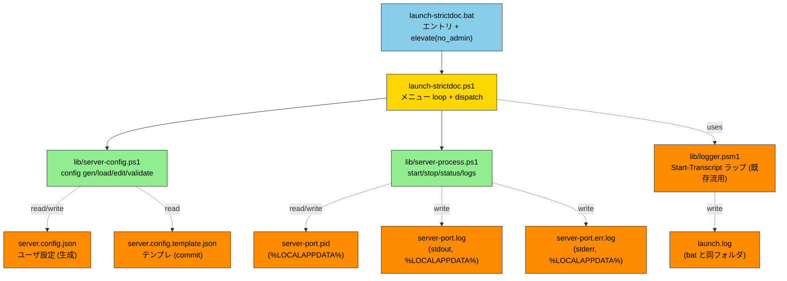
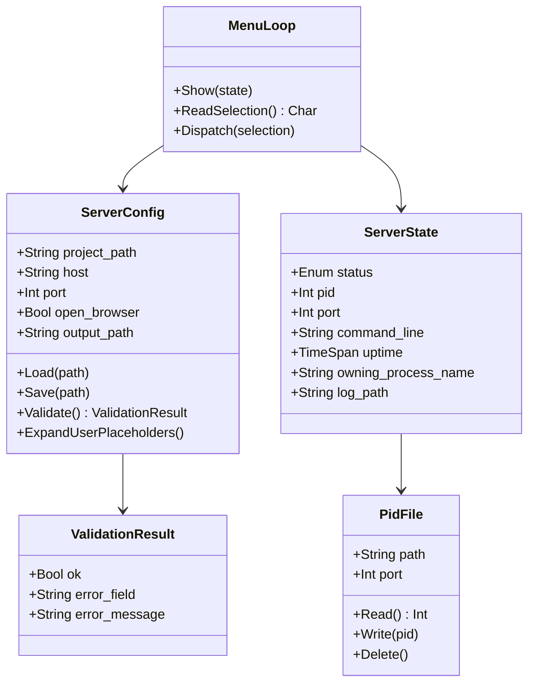
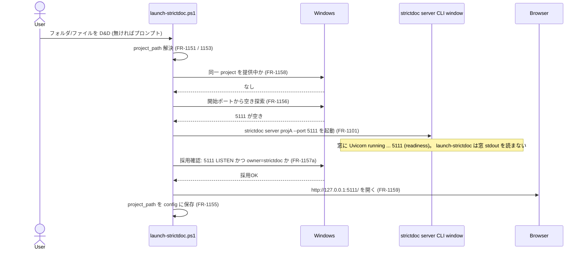
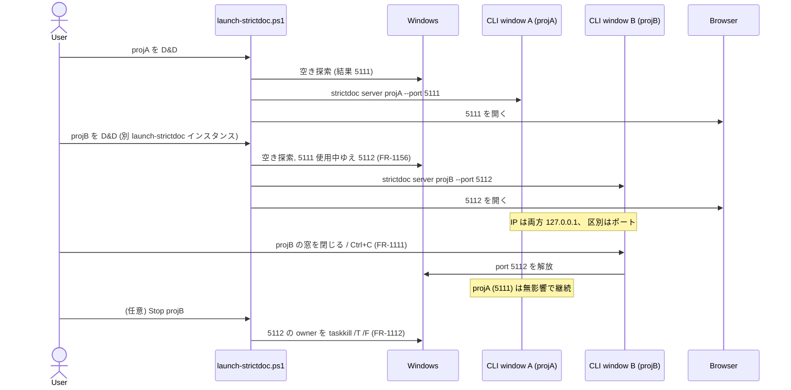
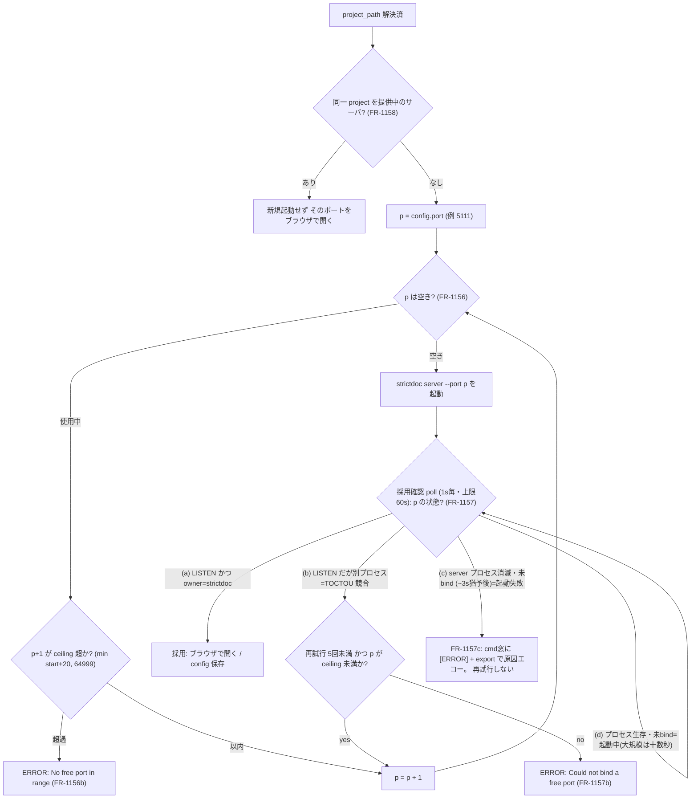
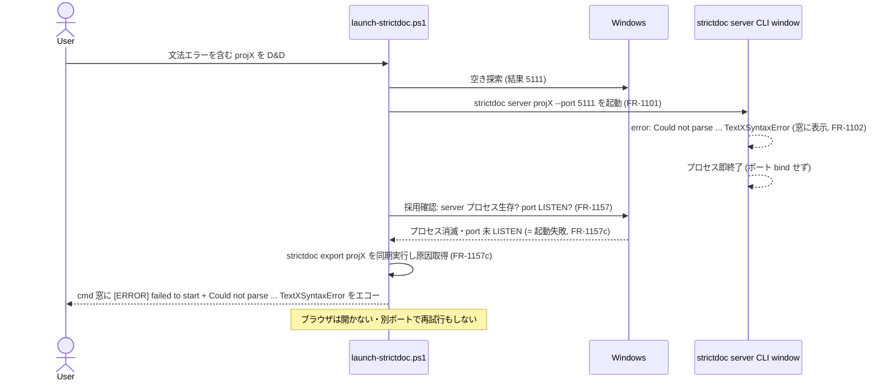

# launch-strictdoc — StrictDoc Server Lifecycle Management 仕様書

| 項目 | 値 |
|---|---|
| 文書名 | launch-strictdoc — StrictDoc Server Lifecycle Management 仕様書 |
| バージョン | v1.2 (D&D/プロンプト入力 + ポート自動割当。 v1.1: 公式委譲 & 可視ウィンドウ方式) |
| テンプレート | ANMS v0.33 |
| ツール名 | **launch-strictdoc** (StrictDocStarter 同梱) |
| エントリ | `launch-strictdoc.bat` (フォルダ/ファイルを D&D または単体起動。 v1.2: 純ランチャ → strictdoc server CLI window + ブラウザ → 終了。 メニュー無し — FR-1121 / ADR-115) |
| 対象 | strictdoc がインストール済み Windows 11 PC |
| 親仕様 | [`docs/setup-spec.md`](setup-spec.md) (StrictDocStarter v1.0) |
| リポジトリ | `https://github.com/GoodRelax/gr-tools/tree/main/StrictDocStarter` |

---

> ## ⚠️ v1.1 改訂サマリ (2026-06-06) — 必読
>
> 調査の結果、 StrictDoc 公式は **サーバ起動 (`strictdoc server` = 可視コンソール、 readiness/error 表示つき)・プロジェクト雛形 (`strictdoc new`)・設定形式 (`strictdoc_config.py`)** を既に提供しており、 **公式に無いのはインストーラのみ**であることが判明した。 そこで本仕様は方針転換する:
>
> - **D-5 スコープ**: StrictDocStarter は「Windows ブートストラップ + ダブルクリック」に集中し、 サーバ起動 / 雛形 / 設定は **公式へ委譲** (再発明しない)。
> - **D-6 可視ウィンドウ方式**: server を **可視コンソール窓**で起動し、 公式の readiness (`Uvicorn running on …`) / error (`Could not parse …`、 即終了) 表示をそのまま使う。 **隠れバックグラウンド + ポート poll + PID file + Start-Transcript ロックは廃止**。
>
> → これにより **§2.1.3-2.1.7 (FR-300/400/500/700 系)、 ADR-104/105/107/110/112、 3.1-3.5 の隠れデーモン前提は Chapter 6 (改訂 v1.1) により supersede される**。 §1-§5 の当該記述 (例: 1.3 Goal 3-4、 1.4 Approach、 1.6 Scope の 4/5 状態管理) は **v1.0 の歴史的記録**として残置し、 実装時は **Chapter 6 が優先**する。 根拠の全量は内部設計ノート (`improvement-items.md`、 本リポジトリには非収録) にある。

## Chapter 1. Foundation

### 1.1 Background

- StrictDoc は `strictdoc server <project-path>` で Web UI を提供 (デフォルト http://127.0.0.1:5111)
- PoC 段階で手動起動/停止を繰り返している → 1-click 化したい
- setup-strictdoc.bat で環境構築済の Windows 11 上で、 「server 起動 → ブラウザで編集 → 停止」 を最短手数で行えるようにする
- 仕様の親は [`docs/setup-spec.md`](setup-spec.md)。 本書は setup の延長サブツール (= launch-strictdoc) の仕様

### 1.2 Issues

- 毎回手動で `strictdoc server` をタイプ (path 入力ミス、 port 衝突確認漏れ)
- バックグラウンド起動方法が定まらず、 ターミナルがブロックされる / ウィンドウが散らかる
- どのプロセスが strictdoc server か特定する手段が乏しく、 終了し損ねが頻発
- 別フォルダで PoC を切り替える際、 古い server を確実に止める手段が必要

### 1.3 Goals

1. **ダブルクリック → メニュー → 1 押し** で start / stop / status / logs / Edit config を選べる (→ **v1.2 改訂 (option C / ADR-115): メニュー廃止・純ランチャ**へ。 D&D / プロンプトで開く文書を決め、 起動 → ブラウザ → 終了。 Stop/Status/Logs は strictdoc server CLI window と再ドロップが担う。 G6-1 / FR-1121)
2. 設定は `server.config.json` 1 ファイルで宣言、 メニューから Edit config で更新可能
3. server プロセスは確実に終了できる (PID file + 本人確認、 取りこぼしなし)
4. メニュー .bat を Ctrl+C で終了しても server は影響なく稼働継続 (daemon-like)

### 1.4 Approach

- **メニュー対話方式** (vs サブコマンド引数方式): ユーザの記憶負荷ゼロ、 ダブルクリック完結
- **`Start-Process -WindowStyle Hidden` + stdout/stderr redirect** でバックグラウンド起動
- **PID file (主) + port-based (fallback) + 本人確認 (CommandLine に "strictdoc")** の 3 段防御で server 特定
- 設定変更は `Edit config` メニュー → 既定エディタ起動 → メニュー戻り時に毎回再ロード + validate
- ログは **launch-strictdoc 操作 (launch.log) と server stdout (server-\<port\>.log) を分離** (SRP)

### 1.5 Tool Inventory (依存)

新規 install ツールなし。 以下が setup-strictdoc.bat 完了済として前提:

| No | ツール | 用途 | 導入元 |
|---|---|---|---|
| 01 | strictdoc | `strictdoc server` の本体 | pip (setup Phase C) |
| 02 | Python | strictdoc 実行基盤 | winget (setup Phase B) |
| 03 | VS Code (任意) | 既定エディタ fallback の `code` | winget (setup Phase A) |
| 04 | PowerShell 5.1+ | スクリプト実行基盤 | Windows 11 標準 |

### 1.6 Scope

**In-scope:**

- Windows 11 + Python + strictdoc 導入済環境
- 1 つの `project_path` / 1 つの `port` での server 管理 (1 メニュー .bat = 1 server)
- start / stop / status / logs / Edit config の 5 メニュー操作
- `server.config.json` による設定宣言
- PID file + port LISTEN による状態管理 (4 状態: RUNNING / STOPPED / STALE_PID_FILE / OTHER_OWNS_PORT)
- 既定ブラウザ自動 open (`config.open_browser`)
- `gather-logs.bat` への log 統合 (server-*.log / launch.log)

**Out-of-scope (v1.0):**

- 複数 server の並行管理 (1 メニュー .bat = 1 server。 並行検証は別フォルダコピーで対応)
- strictdoc TOML config (`--config`) のパススルー
- 認証 / アクセス制御 (strictdoc 自体に機能なし、 127.0.0.1 bind 前提)
- Windows 10 / non-Windows OS
- メニュー UI の TUI / GUI 化 (text のみ)
- log rotation (サイズ閾値)
- proxy 環境対応 (setup と同じく v1.0 対象外)
- CI/automation 用のサブコマンド引数式 (将来追加余地は残す)

### 1.7 Constraints

- Windows 11 + PowerShell 5.1+
- **管理者権限不要** (server 起動は user 権限、 setup と異なり `_lib/elevate.bat no_admin` で call)
- `strictdoc` / `python` が PATH に通っていること (setup-strictdoc.bat 完了済前提)
- スクリプト本体は **ASCII only** (setup-spec.md ADR-008 継承)
- **単一 Windows アカウントのみが本ツールを使用する PC** を前提 (信頼境界 = 単一ユーザ)。 別アカウントや admin による PID file / log file 改ざんは検出しない
- **実装時の変数名規約**: `$pid` は PowerShell の予約自動変数 (現プロセス PID) のため、 server プロセスの PID を保持する変数には `$serverPid` 等を使用すること (Glossary 参照)

### 1.8 Limitations

- 同じ port で別アプリが LISTEN している場合、 launch-strictdoc は start を拒否 → ユーザに config 編集を促す (別 port を提案しない)
- メニュー .bat を Ctrl+C で終了しても server プロセスは生存継続 (= feature、 ただし多重起動の責任はユーザ)
- `%LOCALAPPDATA%\StrictDocStarter\` 配下の PID file が手動削除されると port-based fallback に依存 (動作は OK だが log で警告)
- Python CLI app の特性上、 graceful shutdown 不可 (Stop-Process 即時終了、 -Force fallback)
- CommandLine 本人確認は `Get-CimInstance Win32_Process` に依存。 **WMI 無効化環境では本人確認に失敗し続け Stop が abort される** → 復旧は PID file の手動削除 (`%LOCALAPPDATA%\StrictDocStarter\server-<port>.pid` を delete) → 次回 Stop で port-based fallback。 escape hatch (強制 stop 確認 prompt) は v1.x で再検討
- `Get-NetTCPConnection` で OwningProcess を取得する際、 **別ユーザ / 昇格プロセスが port を占有していると OwningProcess 取得できず `UNKNOWN_OCCUPANT` として表示** される (FR-505)。 PoC「単一ユーザ」 前提下では稀
- PID file の信頼性: 同一ユーザ ACL 下で書込制限はあるが、 admin プロセスが任意 PID を書き込めば誤検出される。 single-user PoC スコープではこの脅威モデルを採用しない

### 1.9 Glossary

| 用語 | 説明 |
|---|---|
| launch-strictdoc | 本仕様の対象ツール |
| StrictDocStarter | 親ツール (setup-strictdoc + launch-strictdoc + gather-logs) |
| メニュー方式 | `.bat` 起動 → 番号選択 → アクション → メニュー戻り、 のループ UI |
| PID file | プロセス ID を 1 行で保存するファイル (一般的 daemon パターン) |
| port-based fallback | PID file 不在時に LISTEN 中の port から OwningProcess を取得して特定する方式 |
| 本人確認 | 停止対象プロセスの CommandLine に "strictdoc" が含まれるか確認 (誤殺防止) |
| 5 状態 | (v1.0) RUNNING / STARTING / STOPPED / STALE_PID_FILE / OTHER_OWNS_PORT。 **v1.1 (FR-1113) で 3 状態 RUNNING / OTHER_OWNS_PORT / STOPPED へ簡素化** (PID file 廃止に伴い STARTING / STALE_PID_FILE を削除) |
| `%LOCALAPPDATA%` | `C:\Users\<user>\AppData\Local` (Windows のユーザローカルキャッシュ領域、 NTFS ACL でユーザ単位アクセス制御) |
| Expand-UserPlaceholders | setup-spec.md FR-208 由来、 `<user>` を `$env:USERNAME` に展開する関数 |
| Expand-PathPlaceholders | 拡張版。 `<user>` (FR-208) + `<starter_root>` (launch-strictdoc.bat のフォルダ絶対パス) の両方を展開。 unzip-and-go で同梱 `samples/` を default project_path に指せるようにする |
| `<starter_root>` | path placeholder。 `launch-strictdoc.bat` のフォルダの絶対パスに展開される。 template の default `project_path` で `<starter_root>\samples\sovd-automotive-ja` を使用 |
| samples/ | StrictDocStarter 同梱の StrictDoc サンプルプロジェクト 3 個。 `samples/sdoc-patterns/` (書き方の型。 `00-hello.sdoc` が編集用テンプレ)、 `samples/sovd-automotive-ja/` (~105 reqs、 中規模、 **初期 default**) と同構成の英語版 `samples/sovd-automotive-en/`。 sovd 系は 00 概要 + 01-05 要求/基盤 + 06 設計 + 07 API + 08 テスト仕様 + 09 テスト結果 + 90 付録、 要求→設計→API→テスト仕様→結果の V 字を EARS/L0-L3 + Implements/Satisfies/Verifies/ResultOf でトレース、 ASIL/CAL/Layer/Type custom fields、 共有文法 `sovd-grammar.sgra` (REQUIREMENT/COMPONENT/API/TEST/TEST_RESULT)) |
| `$pid` | **PowerShell の予約自動変数** で現プロセス自身の PID を保持。 server プロセスの PID 変数として **使用禁止** (= 自プロセスを stop 対象にしてしまう事故防止)。 `$serverPid` / `$targetPid` 等を使用 |
| MOTW | Mark-of-the-Web。 Web/Zip 経由で取得したファイルに付くゾーン情報、 PowerShell が実行を阻害することがある |
| WMI | Windows Management Instrumentation。 プロセス情報等を取得する Windows の管理基盤 |
| CIM | Common Information Model。 WMI の新世代 API、 PowerShell では `Get-CimInstance` で参照 |
| OwningProcess | `Get-NetTCPConnection` が返すプロパティで、 該当 TCP socket を所有するプロセス PID |
| LISTEN | TCP socket が接続待ち受け状態であること (`Get-NetTCPConnection -State Listen`) |
| EARS | Easy Approach to Requirements Syntax。 Ubiquitous / Event-driven / State-driven / Unwanted-behaviour / Optional の 5 パターンで要求を書く規約 |
| SRP | Single Responsibility Principle。 1 モジュール = 1 つの変更理由 |
| `_lib\elevate.bat no_admin` | setup-spec.md FR-806 の共通ヘルパ、 引数 `no_admin` は UAC 昇格を要求せず MOTW strip + CWD 正規化のみ実行するモード |
| BOM | Byte Order Mark。 UTF-8 ファイル先頭の ``、 PowerShell 5.1 の `ConvertFrom-Json` が誤動作する原因 |
| HasExited | PowerShell `Start-Process -PassThru` が返す Process object のプロパティ、 子プロセス終了済かを判定 |
| `strictdoc server CLI window` | 公式 `strictdoc server` を**前景実行する Windows コンソール窓** (旧称「server 窓 / 可視窓」)。 StrictDoc 公式のサーバ起動バナー (`StrictDoc Web Server vX` / Server URL / Documentation / mailing list) と Uvicorn の `Uvicorn running on …` ログを表示する。 文書ごとに 1 窓。 **窓を閉じる / Ctrl+C でサーバ停止** (FR-1111)。 利用者が操作する UI は別途ブラウザの StrictDoc Web UI。 図中の短縮表記は `CLI window` |
| launch-strictdoc cmd 窓 | `launch-strictdoc.bat`→`.ps1` が動く**ランチャ側**のコンソール窓。 入力解決・ポート割当・起動・起動失敗の原因表示 (FR-1157c) を担う。 上記 `strictdoc server CLI window` とは**別物** |

### 1.10 Notation

- RFC 2119/8174 準拠
- **SHALL / MUST** = 必須
- **SHOULD** = 推奨
- **MAY** = 任意
- EARS の `shall` は SHALL と同義

---

## Chapter 2. Requirements

### 2.1 Functional Requirements

#### 2.1.1 起動・dispatch (FR-100 系)

| ID | パターン | 要求 |
|---|---|---|
| FR-101 | Ubiquitous | `launch-strictdoc.bat` はダブルクリックで起動可能であること |
| FR-102 | Ubiquitous | `launch-strictdoc.bat` は冒頭で `call _lib\elevate.bat no_admin "%~f0" "%*"` を call して MOTW strip + CWD 正規化を行うこと (UAC 昇格は不要、 setup-spec.md FR-806 表に行追加) |
| FR-103 | Ubiquitous | `launch-strictdoc.bat` は `launch-strictdoc.ps1` を `powershell -ExecutionPolicy Bypass -File` で呼び出すこと |
| FR-104 | Ubiquitous | `launch-strictdoc.ps1` は無限ループでメニューを表示し、 ユーザが `Q` を入力するまで継続すること |
| FR-105 | Ubiquitous | 各メニュー操作 (1〜5) 完了後、 メニュー再表示に戻ること (1 回の操作で終了しない) |
| FR-106 | When | `launch-strictdoc.bat` 起動時、 `Start-Transcript` (既存 `lib/logger.psm1` の `Start-OnboardLog -LogPath <launch.log>` を流用) で `launch.log` (bat と同フォルダ) に全実行ログを **append** モードで記録すること |
| FR-107 | If | もし `Q` または Ctrl+C で終了した時、 server が稼働中ならば `[INFO] Server is still running (PID X on port Y). Use 'Stop' next time to terminate it.` を 1 行表示すること |
| FR-108 | Ubiquitous | メニュー入力は **case-insensitive** で判定すること (`q`/`Q`/`r`/`R` 等両方 OK) |
| FR-109 | If | もし不正な選択肢が入力されたら、 `Invalid selection. Choose [1/2/3/4/5/Q].` warn を表示してメニュー再表示すること |
| FR-110 | If | もし `Start-Transcript` (FR-106) が失敗 (= 同一 `launch.log` を別 PowerShell session が既にロック中、 二重起動の兆候) ならば、 `launch-strictdoc.ps1` は `[ERROR] Another launch-strictdoc session appears to be running (cannot lock launch.log). Close it first, then retry.` を表示して即時 abort (exit code 1) すること。 ロック検出は Start-Transcript の `-ErrorAction Stop` + `try/catch` で実装可能 |

#### 2.1.2 設定ファイル管理 (FR-200 系)

| ID | パターン | 要求 |
|---|---|---|
| FR-201 | If | もし `server.config.json` が存在しなければ、 `launch-strictdoc.ps1` は `server.config.template.json` から copy + `<user>` 即時展開で生成すること。 生成時のエンコーディングは **UTF-8 BOM なし** とすること (PowerShell 5.1 の `ConvertFrom-Json` が BOM 付き UTF-8 を `Unexpected character encountered` で reject するため) |
| FR-202 | When | 初回生成直後、 `launch-strictdoc.ps1` は既定エディタを以下の順で fallback して起動すること: (a) `Get-Command code -ErrorAction SilentlyContinue` で `code` 存在確認 → `Start-Process code -ArgumentList '--reuse-window', '<path>' -PassThru` で起動、 (b) 1 秒後に `Process.HasExited == true` かつ exit code != 0 ならば失敗とみなし notepad fallback、 (c) `code` 不在ならば `Start-Process notepad -ArgumentList '<path>'` で起動 |
| FR-203 | When | 初回 config 編集後、 `launch-strictdoc.ps1` は `Press Enter when you have saved the config...` で待機すること (`yes` 入力は不要、 Enter のみ) |
| FR-204 | Ubiquitous | `server.config.json` は JSON 形式 (**UTF-8 BOM なし推奨**、 `_comment_*` プロパティでコメント表現) であること。 読込時は `Get-Content -Raw -Encoding UTF8` 取得後、 先頭 BOM (``) を strip してから `ConvertFrom-Json` に渡すこと (notepad で保存すると BOM が付くケースに対応) |
| FR-205 | Ubiquitous | `server.config.json` は以下のフィールドを含むこと: `project_path` (必須) / `host` / `port` / `open_browser` / `output_path` (任意、 default あり) |
| FR-206 | Ubiquitous | `server.config.json` は `.gitignore` 対象、 **`server.config.template.json` のみ commit** すること |
| FR-207 | Ubiquitous | `server.config.template.json` および `server.config.json` の top-level に `_comment_overview` キーを含めること。 **値は 1 行 ASCII 文字列** で `Required: <fields>. Optional with defaults: <field (default); ...>.` の形式に従うこと (setup-spec.md FR-210 流儀、 機械検証可能) |
| FR-208 | Ubiquitous | `project_path` および `output_path` 内の path placeholder は path 操作 (`Test-Path` / `Join-Path` / `Start-Process` 等) より **先に** `Expand-PathPlaceholders` で展開すること。 サポートする placeholder: (a) `<user>` → `$env:USERNAME` (setup-spec.md FR-208 継承)、 (b) `<starter_root>` → `launch-strictdoc.bat` の置かれているフォルダの絶対パス (unzip-and-go で同梱 samples/ が見つかるようにする)。 **重要**: Initialize-ServerConfig が template を raw text 置換する際、 `_comment_*` フィールド内に置換対象リテラル (`<user>` / `<starter_root>`) を含めてはならない (説明テキストまで誤置換される。 documentation は別の語 (USERNAME / STARTER_ROOT) を使用するか README に書く) |
| FR-209 | Ubiquitous | メニュー loop の **毎回先頭** で `server.config.json` を再ロード + validate すること (in-memory cache 禁止)。 これにより Edit config 後の変更が即反映される |
| FR-210 | Ubiquitous | validation rules: (a) `project_path` 展開後の絶対パスが存在 + ディレクトリ、 (b) `host` は **IPv4 dotted-decimal** (`^\d{1,3}(\.\d{1,3}){3}$`) **または** `localhost` **または** IPv6 literal (`^[0-9a-fA-F:]+$`) のいずれか (※ StrictDoc 本体の `is_valid_host` は任意のホスト名も許容するが、 本ツールは PoC 安全側として IP/localhost に限定)、 (c) `port` は **1025..64999** の整数 (strictdoc は CLI `--port` が `[1024,65000]` inclusive・config 形式が `(1024,65000)` exclusive と経路で差があるため、 両経路で確実に有効な範囲に安全側で限定)、 (d) `open_browser` bool、 (e) `output_path` 任意 (空文字 or 任意文字列、 存在チェックなし) |
| FR-211 | If | もし validation に失敗したら、 メニューヘッダ直下に `[CONFIG ERROR] <field>: <message>` を表示し、 menu `5` (Edit config) と `Q` のみ enabled、 `1`〜`4` は disabled とすること (選択しても `Fix config first (menu 5).` 警告でメニュー戻り) |
| FR-212 | When | menu `5` (Edit config) は FR-202 と同じ fallback ロジック (`Get-Command code` 存在確認 → `Start-Process -PassThru` + HasExited 確認 → notepad fallback) で `server.config.json` を開くこと。 起動は **ブロックしない** (= エディタを閉じる前にメニューに戻る) |
| FR-213 | Ubiquitous | `_comment_*` キーは **表示専用**、 `Invoke-Expression` / `Start-Process` / `&` 等の評価対象としないこと (setup-spec.md FR-213 継承) |

#### 2.1.3 server start (FR-300 系)

| ID | パターン | 要求 |
|---|---|---|
| FR-301 | When | menu `1` (Start) は `Start-Process strictdoc -ArgumentList 'server', $project_path, '--host', $host, '--port', $port [, '--output-path', $output_path] -WindowStyle Hidden -RedirectStandardOutput <stdout_log> -RedirectStandardError <stderr_log>` で server をバックグラウンド起動すること (output_path が空文字なら引数省略)。 **stdout と stderr は別ファイル** に redirect すること (PowerShell 5.1 が同一ファイル指定を reject するため、 FR-702 参照) |
| FR-302 | When | start 直後、 `launch-strictdoc.ps1` は `%LOCALAPPDATA%\StrictDocStarter\server-<port>.pid` にプロセス PID を **改行 1 文字付きで** 書き出すこと (**生成側は trailing newline 必須**、 読み側は FR-704 で trailing newline を許容)。 **pip launcher 対応**: `strictdoc.exe` (pip-generated wrapper) は内部で `python.exe` を child として spawn し、 child が LISTEN socket を所有する Windows 固有の挙動を持つ。 そこで Wait-ForPortListen (FR-303 a) の成功後、 `Get-NetTCPConnection` の OwningProcess が launcher PID と異なり、 かつその PID の CommandLine に "strictdoc" を含むならば、 **PID file を listener PID で上書き更新** すること。 これにより Status (FR-502) の「PID == OwningProcess」 判定が成立する。 launcher の親プロセスは listener 終了とともに自動 exit する想定 |
| FR-303 | When | start 後、 `launch-strictdoc.ps1` は以下の 2 段確認を行うこと: (a) 最大 30 秒 (1 秒間隔) で `Get-NetTCPConnection -LocalPort $port -ErrorAction SilentlyContinue` の LISTEN 確認、 (b) LISTEN 確認後、 さらに最大 **5 秒** (1 秒間隔) で `Invoke-WebRequest -Uri "http://<host>:<port>/" -UseBasicParsing -TimeoutSec 1 -ErrorAction SilentlyContinue` を発行し、 HTTP 応答 (どの status code でも可、 TCP reset でなければ OK) を受信するまで待機すること。 これにより uvicorn 起動準備中の TCP open / HTTP not-ready 窓を回避 |
| FR-304 | If | もし FR-303 (a) が 30 秒 timeout または (b) が 5 秒 timeout になったら、 `[WARN] Timeout waiting for server to be ready. Check Logs (menu 4) for details.` を表示し PID file は **残置** すること (process は生きてる可能性、 status で再確認可能) |
| FR-305 | If | もし start 時に既起動の server が検出されたら (status RUNNING)、 `Already running (PID X on port Y). [R]estart / [O]pen browser / [C]ancel?` の 3 択 prompt を表示し、 `R`/`O`/`C` (case-insensitive) で分岐すること。 `R` = stop → start 連続実行、 `O` = ブラウザ open のみ、 `C` = メニュー戻り |
| FR-306 | If | もし port が strictdoc 以外のプロセスに占有されていたら (status OTHER_OWNS_PORT)、 `Port <port> is occupied by '<process-name>' (PID <pid>). Cannot start. Edit config (menu 5) to use a different port.` を表示して abort すること (別 port を自動提案しない)。 `<process-name>` が取得不可 (= UNKNOWN_OCCUPANT、 FR-505) ならば `<process-name>` 部分を `<unknown owner>` と表示 |
| FR-307 | If | もし `config.open_browser=true` かつ start が成功 (FR-303 (a) + (b) 共に確認済) ならば、 `launch-strictdoc.ps1` は `Start-Process http://<host>:<port>/` で既定ブラウザを起動すること |
| FR-308 | Ubiquitous | ブラウザ open URL の host が `0.0.0.0` **または IPv6 wildcard `::`** の場合は `127.0.0.1` に置換すること (どちらもブラウザで直接 open 不可) |
| FR-309 | Ubiquitous | server stdout の redirect 先は `%LOCALAPPDATA%\StrictDocStarter\server-<port>.log`、 stderr の redirect 先は `%LOCALAPPDATA%\StrictDocStarter\server-<port>.err.log` (start 毎に追記)。 区切り行 `=== Server started <YYYY-MM-DD HH:MM:SS> ===` は **`Start-Process` 呼出の直前** に `Add-Content -Path <stdout_log>` で stdout log のみに 1 行 append すること (race を防ぐため事後ではなく事前) |
| FR-310 | When | `%LOCALAPPDATA%\StrictDocStarter\` ディレクトリは初回 start 時に `New-Item -ItemType Directory -Force` で自動作成すること |
| FR-311 | Ubiquitous | start "success" の定義は **exit code ではなく** **port LISTEN 確認 (FR-303 a) + HTTP 応答確認 (FR-303 b) + プロセス生存** とすること (background プロセスのため exit code は無意味) |
| FR-312 | When | menu `1` (Start) は実行直前に status を probe し、 もし **`STALE_PID_FILE`** または **`STARTING`** (= 30 秒以上前に start したが LISTEN 未確認) ならば、 PID file を自動削除して **`STOPPED` 扱い** で start に進むこと (= 古い start の残骸を自動 cleanup)。 これにより「前回 start が timeout して以来 ずっと Start ボタンが効かない」 詰みを回避 |

#### 2.1.4 server stop (FR-400 系)

| ID | パターン | 要求 |
|---|---|---|
| FR-401 | When | menu `2` (Stop) は PID file (`%LOCALAPPDATA%\StrictDocStarter\server-<port>.pid`) を読み、 PID を取得すること |
| FR-402 | If | もし PID file が存在しなければ、 port-based fallback として `Get-NetTCPConnection -LocalPort $port -ErrorAction SilentlyContinue` の OwningProcess を取得すること |
| FR-403 | Ubiquitous | 停止対象プロセスの **本人確認** として `Get-CimInstance Win32_Process -Filter "ProcessId=$pid"` から CommandLine を取得し、 文字列 "strictdoc" を含むかを確認すること (大文字小文字無視) |
| FR-404 | If | もし本人確認に失敗したら (CommandLine に strictdoc が含まれない)、 `[WARN] PID <pid> is not a strictdoc process (CommandLine: '<cmd>'). Aborting stop.` を表示してプロセスを殺さず abort し、 PID file は残置すること |
| FR-405 | When | 本人確認パス後、 `Stop-Process -Id $pid` (-Force なし) を試行すること |
| FR-406 | When | Stop-Process 後、 最大 **5 秒** (1 秒間隔) で `Get-Process -Id $pid -ErrorAction SilentlyContinue` によりプロセス消滅を待機すること |
| FR-407 | If | もし 5 秒経過しても生存していたら、 `Stop-Process -Id $pid -Force` で強制終了を試行し、 さらに最大 **3 秒** 待機すること |
| FR-408 | If | もし 3 秒経過しても生存していたら、 `[ERROR] Failed to stop PID <pid> even with -Force. Investigate manually.` を表示し PID file は残置すること |
| FR-409 | When | プロセス消滅を確認した後、 PID file を削除すること |
| FR-410 | If | もし stop が成功したら、 `[OK] Server stopped (PID <pid>).` を表示すること |
| FR-411 | If | もし PID file も port LISTEN も無ければ (status STOPPED)、 `[INFO] Server is not running.` を表示してメニューに戻ること |

#### 2.1.5 server status (FR-500 系)

| ID | パターン | 要求 |
|---|---|---|
| FR-501 | Ubiquitous | status は以下の **5 状態** のいずれかを返すこと: `RUNNING` / `STARTING` / `STOPPED` / `STALE_PID_FILE` / `OTHER_OWNS_PORT` |
| FR-502 | Ubiquitous | `RUNNING` 判定: PID file 存在 **かつ** PID プロセス生存 **かつ** CommandLine に "strictdoc" **かつ** 該当 port LISTEN 中 |
| FR-503 | Ubiquitous | `STARTING` 判定: PID file 存在 **かつ** PID プロセス生存 **かつ** CommandLine に "strictdoc" **かつ** port LISTEN まだなし **かつ** プロセス起動から **30 秒以内**。 = start 直後の TCP socket open 待ち窓を表現 (誤って STALE 表示しないため) |
| FR-504 | Ubiquitous | `STOPPED` 判定: PID file 無 **かつ** port LISTEN 無 |
| FR-505 | Ubiquitous | `STALE_PID_FILE` 判定: PID file 存在 だが以下のいずれか: (a) プロセス無、 (b) strictdoc でない、 (c) port LISTEN していない **かつ** プロセス起動から 30 秒超過 (STARTING 範囲外) |
| FR-506 | Ubiquitous | `OTHER_OWNS_PORT` 判定: PID file 無 **かつ** port LISTEN 中 だが本人確認失敗 (= strictdoc でない別アプリが占有)。 `Get-NetTCPConnection` の OwningProcess が取得できない (別ユーザ / 昇格プロセス占有) 場合は **`UNKNOWN_OCCUPANT`** をサブ状態として `Status:` 行に注記表示すること (1.8 Limitations 参照) |
| FR-507 | Ubiquitous | メニューヘッダの `Status:` 行に現在状態を表示すること。 RUNNING 時は PID + uptime を併記 (`[RUNNING] PID X (uptime: hh:mm:ss)`)、 STARTING 時は `[STARTING] PID X (waiting for LISTEN, <elapsed>s/30s)` を表示 |
| FR-508 | When | menu `3` (Status) は再 probe して結果を 1 行 + 詳細 (PID/uptime/log path/port owner 等、 状態に応じて) を表示し、 `Press Enter to return to menu...` で待機すること |
| FR-509 | Ubiquitous | uptime 計算は `(Get-Process -Id $serverPid).StartTime` を基点に算出し、 `hh:mm:ss` 形式で表示すること (24h 超過時は `dd.hh:mm:ss` のように day を prefix)。 変数名は `$pid` (PowerShell 予約自動変数) との衝突を避けるため `$serverPid` を使用 (Glossary 参照) |

#### 2.1.6 logs 表示 (FR-600 系)

| ID | パターン | 要求 |
|---|---|---|
| FR-601 | When | menu `4` (Logs) は `%LOCALAPPDATA%\StrictDocStarter\server-<port>.log` (stdout) の **末尾 50 行** を表示すること。 続いて `server-<port>.err.log` (stderr) が存在しかつ非空ならば、 `--- stderr (last 20 lines) ---` ヘッダ付きで stderr 末尾 20 行も表示すること |
| FR-602 | If | もし stdout log file が存在しなければ、 `[INFO] No log file yet at <path>. Start the server first.` を表示すること (.err.log だけの存在は無視) |
| FR-603 | Ubiquitous | 末尾表示後、 `Press Enter to return to menu...` で待機すること |
| FR-604 | Ubiquitous | log 表示は `Get-Content -Tail 50` (stderr 側は `-Tail 20`) を使用すること (ファイル全読みを禁止、 巨大 log でも O(1) 相当) |

#### 2.1.7 PID file / log file 管理 (FR-700 系)

| ID | パターン | 要求 |
|---|---|---|
| FR-701 | Ubiquitous | PID file パス: `%LOCALAPPDATA%\StrictDocStarter\server-<port>.pid` |
| FR-702 | Ubiquitous | server stdout log パス: `%LOCALAPPDATA%\StrictDocStarter\server-<port>.log`、 server stderr log パス: `%LOCALAPPDATA%\StrictDocStarter\server-<port>.err.log` (FR-301 で別ファイル必須) |
| FR-703 | Ubiquitous | launch-strictdoc 操作ログパス: `<launch-strictdoc.bat と同フォルダ>\launch.log` (Start-Transcript で append、 FR-106) |
| FR-704 | Ubiquitous | PID file の中身は 1 行の整数 (PID)、 trailing newline は **読み側で許容** (生成側は FR-302 で必須)。 PID parse は `[int]::TryParse((Get-Content -Raw -TotalCount 1 $pidFile).Trim(), [ref]$serverPid)` を使用 |
| FR-705 | Ubiquitous | server log の rotation は行わず、 start 毎に区切り行 `=== Server started <YYYY-MM-DD HH:MM:SS> ===` を追記 (FR-309)。 .err.log には区切り行を付けない (stderr は OS / strictdoc 由来でフォーマット制御が難しい、 タイムスタンプは stdout 側のみで十分) |
| FR-706 | Ubiquitous | launch-strictdoc log の rotation は行わず、 起動毎に Start-Transcript の append モードで継続。 起動毎の区切りは Start-Transcript 既定の `**********************` separator を許容 |

#### 2.1.8 メニュー UX (FR-800 系)

| ID | パターン | 要求 |
|---|---|---|
| FR-801 | Ubiquitous | メニューヘッダは以下を含むこと: title + horizontal line (`=` 連続) + `Config:` 絶対パス + `Project:` (展開後 path) + `Host:` + `Port:` + `Status:` 行 |
| FR-802 | Ubiquitous | メニュー本体は 1〜5 + Q の 6 項目、 各項目 1 行で表示。 各項目は `<番号>. <名称> - <短い説明>` 形式 |
| FR-803 | If | もし CONFIG ERROR 状態ならば、 メニュー本体は `5` (Edit config) と `Q` のみ表示すること (1〜4 行を suppress) |
| FR-804 | Ubiquitous | プロンプトは `Select [1/2/3/4/5/Q]: ` (CONFIG ERROR 時は `Select [5/Q]: `) |
| FR-805 | Ubiquitous | アクション完了後はメニュー再表示前に 1 行空けて視認性を保つこと |
| FR-806 | Ubiquitous | メニュー画面は毎回 `Clear-Host` で screen clear してから描画すること (旧出力との混在で誤読を防ぐ) |

#### 2.1.9 エラー処理 / ログ統合 (FR-900 系)

| ID | パターン | 要求 |
|---|---|---|
| FR-901 | Ubiquitous | launch-strictdoc は `setup.log` を読み書きしないこと (setup-strictdoc.bat との独立性確保、 NFR-008) |
| FR-902 | Ubiquitous | (**v1.1 改訂**) 既存 `gather-logs.ps1` は **`<bat フォルダ>\launch.log` (存在時のみ)** を回収対象に追加すること。 ~~`server-*.log` / `*.pid`~~ は **ADR-113 (可視ウィンドウ方式) で生成されなくなったため回収対象外** (窓がログそのもの。 `%LOCALAPPDATA%\StrictDocStarter\` 自体を作らない) |
| FR-903 | Ubiquitous | 外部コマンド (`strictdoc` / `code` / `notepad`) を呼び出す関数は `$ErrorActionPreference = "Continue"` ローカル退避 + `$LASTEXITCODE` 信頼パターン (setup-spec.md FR-311 / ADR-011 流儀) を踏襲すること |
| FR-904 | Ubiquitous | エラー出力タグは `[INFO]` / `[WARN]` / `[ERROR]` / `[OK]` の 4 種に統一すること (setup の流儀踏襲) |
| FR-905 | Ubiquitous | `Get-CimInstance Win32_Process` 呼び出し失敗時 (WMI 無効化、 権限不足、 CommandLine が `$null` 等) は本人確認を「失敗 (= strictdoc でない)」 と判定して安全側に倒すこと (誤殺防止)。 ユーザが詰んだ場合の復旧手段 (PID file 手動削除) は 1.8 Limitations に明記 |

#### 2.1.10 テスト要件 (FR-1000 系)

host テストとして以下を最低限カバーする (詳細手順は §5 Test Strategy)。

| ID | パターン | 要求 |
|---|---|---|
| FR-1001 | Ubiquitous | **正常系**: start → status RUNNING → logs (末尾 50 行表示) → stop → status STOPPED の 5 段階を 1 セッションで通すこと |
| FR-1002 | Ubiquitous | **negative**: port 競合 (別アプリが 5111 を LISTEN している状態で start) で FR-306 警告 + abort を確認 |
| FR-1003 | Ubiquitous | **negative**: PID file 手動削除後の stop が port-based fallback で動くことを確認 (FR-402 / FR-403) |
| FR-1004 | Ubiquitous | **negative**: CONFIG ERROR 状態 (project_path 存在しないディレクトリ) で menu 1〜4 が disabled、 5/Q のみ有効を確認 (FR-211) |
| FR-1005 | Ubiquitous | **negative**: 本人確認失敗ケース (notepad などの非 strictdoc プロセスの PID を server-<port>.pid に書いて stop) で誤殺されないことを確認 (FR-404) |
| FR-1006 | Ubiquitous | **UI**: Edit config (menu 5) でエディタが開き、 ブロックせずメニューに戻ることを確認 (FR-212) |
| FR-1007 | Ubiquitous | **UI**: Q 入力で server 稼働中の警告 (FR-107) が表示されることを確認 |
| FR-1008 | Ubiquitous | **negative**: メニュー二重起動で 2 つ目の session が abort されることを確認 (FR-110) |
| FR-1009 | Ubiquitous | **timing**: STARTING 状態が start 直後に観測可能であることを確認 (FR-503) |
| FR-1010 | Ubiquitous | **正常系**: HTTP probe 完了後にブラウザ open されることを確認 (LISTEN だけでなく HTTP 応答も検証、 FR-303 b) |

### 2.2 Non-Functional Requirements

| ID | カテゴリ | 要求 |
|---|---|---|
| NFR-001 | 応答性 | メニュー表示 → 入力 prompt までの遅延は **初回 5 秒以内、 2 回目以降 1 秒以内** (毎回 config 再ロード + validate + status probe 込み)。 初回が緩いのは Windows の `Get-CimInstance` cold call が 1〜3 秒かかるため (Limitations) |
| NFR-002 | 起動時間 | ⚠️ **v1.1 で撤廃 (§6.7 / ADR-113・FR-1102: 固定タイムアウト無し)。 以下は v1.0 歴史的記録。** Start ボタン → ブラウザ open までは strictdoc 起動時間 + 数秒、 LISTEN 確認 30 秒 + HTTP 応答確認 5 秒の合計 最大 35 秒 (FR-303) |
| NFR-003 | 停止時間 | ⚠️ **v1.1 で撤廃 (§6.7 / FR-1112: 窓閉じは即時)。 以下は v1.0 歴史的記録。** Stop ボタン → プロセス消滅までは 正常時 5 秒以内、 -Force fallback 含めて最大 8 秒 (FR-406 + FR-407) |
| NFR-004 | 文字 | 全ログは **UTF-8 / 文字化けなし** |
| NFR-005 | 文字コード | スクリプト本体 **および console 出力メッセージ** は **ASCII only** (setup-spec.md NFR-006 / ADR-008 継承)。 仕様書 (本書) と config の `_comment_*` 値は ASCII の範囲で英語表記 |
| NFR-006 | 配置 | 任意フォルダから実行可能 (CWD 非依存、 setup-spec.md NFR-005 継承) |
| NFR-007 | 互換 | `server.config.json` は標準 JSON パーサで読めること (拡張記法なし、 `_comment_*` のみ慣習)。 PowerShell 5.1 の `ConvertFrom-Json` を前提に BOM strip を FR-204 で要求 |
| NFR-008 | 独立性 | launch-strictdoc は setup-strictdoc が生成する `setup.log` / `setup.config.json` / `env-report.json` を読まない / 書かないこと (= 独立稼働) |
| NFR-009 | 機密 | パスワード / PAT / トークンを `server.config.json` および log file に保存しないこと (strictdoc 自体が認証機能なし、 そもそも該当情報なし) |
| NFR-010 | 可搬性 | `.bat` / `.ps1` / `.psm1` / `.js` / `.json` / `.py` / `.sgra` / `.svg` は、 **コメントと利用者向けメッセージを含め英語 ASCII のみ**で記述すること。 多言語化の対象は**利用者が編集する `.sdoc` / `.md` に限る** (仕様書・README 等の `.md` は文書であり対象外)。 理由: 本ランチャの動作環境のコンソールは cp932 であり、 非 ASCII の出力やソースは文字化け・encoding 依存の不具合を招く (§7 環境メモの `print` 落ちが実例)。 CI 相当の確認として、 上記拡張子を再帰走査し非 ASCII 文字を報告するスクリプトを検証パスに含めること (`output/` `temp/` `__pycache__/` `.git/` は除外) |

---

## Chapter 3. Architecture

### 3.1 Architecture Concept

**Layered + Menu Loop + Adapter**。 setup-strictdoc と同じ層構成 (Framework: .bat / Use case: dispatcher .ps1 / Adapter: lib/*.ps1 / Entity: config.json + log files)。 differences from setup:

- Use case 層は **メニュー loop** (vs setup の `auto` Phase オーケストレーション)
- Adapter 層は **`server-config.ps1` + `server-process.ps1`** の 2 ファイル (SRP: config 管理 と server lifecycle が別 concern)
- Entity 層に **PID file** を新規追加 (server プロセス特定のキー)

### 3.2 Components



### 3.3 File Structure

```text
StrictDocStarter/
├── setup-strictdoc.bat                  # (既存) 環境構築 launcher
├── setup-strictdoc.ps1                  # (既存)
├── launch-strictdoc.bat                 # (新規) サーバ管理 launcher
├── launch-strictdoc.ps1                 # (新規) メニュー loop + dispatch
├── gather-logs.bat                      # (既存)
├── gather-logs.ps1                      # (既存、 改修: server-*.log / *.pid / launch.log 回収)
├── change-color-mode.bat                # (D-10) 色モード切替の入口。 no_admin で elevate を call
├── change-color-mode.ps1                # (D-10) server.config.json の color_mode を書く (FR-1162)
├── assets/                              # (D-10) 同梱アセット
│   └── theme-dark.css                   # (FR-1162) ダーク配色の規則本体。 3 モードはここから生成
├── tools/                               # (D-10) 検証用スクリプト
│   └── ascii-audit.py                   # (NFR-010) コード / 設定に非 ASCII が無いことを確認
├── _lib/
│   └── elevate.bat                      # (既存) no_admin で launch-strictdoc / change-color-mode が call
├── lib/
│   ├── check.ps1                        # (既存、 影響なし)
│   ├── config.ps1                       # (既存、 影響なし)
│   ├── install.ps1                      # (既存、 影響なし)
│   ├── clone.ps1                        # (既存、 影響なし)
│   ├── auto.ps1                         # (既存、 影響なし)
│   ├── proxy.ps1                        # (既存、 影響なし)
│   ├── logger.psm1                      # (既存、 launch-strictdoc も流用)
│   ├── server-config.ps1                # (新規) config gen/load/edit/validate
│   └── server-process.ps1               # (新規) start/stop/status/logs
├── setup.config.template.json           # (既存)
├── setup.config.json                    # (既存、 gitignore)
├── server.config.template.json          # (新規、 commit、 default project_path = <starter_root>\samples\sovd-automotive-ja)
├── server.config.json                   # (新規、 gitignore)
├── samples/                             # (新規、 commit) 同梱サンプル
│   ├── sd-basic-ja/                     # (D-9h) .sdoc の基本。 丸ごと写して始める用
│   │   ├── 00-guide.sdoc                # 目的 (UID なしの地の文) + 基本/添付/表/出力の入れ子セクション
│   │   ├── 01-upper.sdoc                # 上位要求 SYS-001..003
│   │   ├── 02-lower.sdoc                # 下位要求 SW-001..004 (Parent → SYS-)
│   │   ├── 03-tests.sdoc                # TEST_CASE TC-001..004 (Parent + ROLE Verifies → SW-)
│   │   ├── 04-review.sdoc               # FINDING RV-001..002 (Parent + ROLE Reviews)。 .sgra の存在理由
│   │   ├── 05-markdown.sdoc             # OPTIONS: MARKUP: Markdown を宣言した唯一の文書 (パイプ表)
│   │   ├── basic.sgra                   # 共有文法。 全文書が IMPORT_FROM_FILE で参照
│   │   ├── _assets/                     # fig-flow.sdoc (Mermaid 断片) / note.md (LINK 先) / flow.svg
│   │   └── strictdoc_config.py          # (D-8) project_path 直下 (D-1/FR-1141)。 左ツールバー 3 画面 (FR-1146)
│   ├── md-basic-ja/                     # (D-9h) 同内容を全部 .md で。 sd-basic-ja と UID 共通
│   │   ├── 00-guide.md 〜 04-review.md  # sd-basic-ja と同じ章立て (05 は .md では不要)
│   │   ├── basic.sgra                   # sd-basic-ja と同一内容
│   │   ├── _assets/                     # note.md (LINK 先) / flow.svg。 Mermaid は本文へ直書き
│   │   └── strictdoc_config.py          # sd-basic-ja と project_title 以外同一
│   ├── sdoc-patterns/                   # 書き方の型。 00-hello.sdoc が編集用テンプレ (D-9 改)
│   │   ├── 00-hello.sdoc                # 要求 3 件、 カスタム文法なし。 写して始める用
│   │   ├── 01-requirements.sdoc 〜 05-outputs.sdoc
│   │   ├── patterns.sgra / _assets/ / queries/
│   │   └── strictdoc_config.py          # (D-8) project_path 直下 (D-1/FR-1141)。 MERMAID/MATHJAX は列挙しない (0.27 既定)、 左ツールバー 3 画面 + Source coverage (FR-1146)
│   ├── sovd-automotive-en/             # 英語版 (sovd-automotive-ja と同構成)
│   └── sovd-automotive-ja/              # 初期 default、 ASIL/CAL/Layer/Type custom fields、 SOVD 教材
│       ├── sovd-grammar.sgra            # (D-9b) 共有要求文法。 全 .sdoc が IMPORT_FROM_FILE で参照
│       ├── 00-overview.sdoc             # (D-9b) 前付け: 背景ストーリー/範囲/用語/参照規格/表記規約/構成図
│       ├── 01-stakeholder-requirements.sdoc  # (D-9f) ステークホルダ要求 (最上位 SYS-L0-001 + 各 L0、 EARS)
│       ├── 02-usecases.sdoc            # (D-9g) ユースケース (アクター/UC図/UC-000〜004、 UC→要求 / UC←受入AT)
│       ├── 03-auth.sdoc                 # 認証・認可 (OAuth2/JWT/TLS/RBAC)、 EARS/L1-L3
│       ├── 04-data-access.sdoc          # 車両データ識別 (DID) / 読取
│       ├── 05-dtc-diagnostics.sdoc      # DTC / フリーズフレーム
│       ├── 06-sw-update.sdoc            # OTA / 署名検証 / rollback
│       ├── 07-common-platform.sdoc      # (D-9c) 共通基盤: 機能横断の共有ユニット (PLAT-、 収束 N→1)
│       ├── 08-architecture.sdoc         # (D-9d) システム設計: コンポーネント/クラス/モジュール/ADR (Implements)
│       ├── 09-api.sdoc                  # (D-9d) HTTP API 契約 (連携相手向け、 Satisfies)
│       ├── 10-test-spec.sdoc            # (D-9d) テスト仕様: 単体/結合/システム/受入 (Verifies)
│       ├── 11-test-results.sdoc         # (D-9d) テスト結果: 実行記録 (仕様と分離、 ResultOf)
│       ├── 90-appendix-notation.sdoc    # (D-9b) 付録: 表記・記法リファレンス (旧 05/06 を統合)
│       ├── _assets/                     # 図素材: sovd-architecture.drawio (編集ソース) + .svg + .png
│       └── strictdoc_config.py          # (D-8) project_path 直下 (D-1/FR-1141)。 左ツールバー 3 画面を有効化 (FR-1146)
├── setup.log                            # (既存、 gitignore)
├── launch.log                           # (新規、 gitignore)
├── env-report.json                      # (既存、 gitignore)
└── docs/
    ├── setup-spec.md                    # (既存)
    └── serve-spec.md                    # (新規、 本書)

%LOCALAPPDATA%\StrictDocStarter\         # (新規 dir、 launch-strictdoc 初回 start 時に作成)
├── server-<port>.pid                    # (新規、 launch-strictdoc が生成)
├── server-<port>.log                    # (新規、 stdout)
└── server-<port>.err.log                # (新規、 stderr)
```

### 3.4 Domain Model



`ServerState.status` enum (v1.0): `RUNNING` / `STOPPED` / `STALE_PID_FILE` / `OTHER_OWNS_PORT` (FR-501)。 **v1.1 (FR-1113) では 3 状態 `RUNNING` / `OTHER_OWNS_PORT` / `STOPPED` へ簡素化** (PID file 廃止)。

### 3.5 Behavior

> 現行の挙動図 (可視ウィンドウ + ポート管理) は **§6.10.8** を参照。 v1.0 の隠れデーモン方式 Start / Stop / メニュー シーケンス図は削除した (`Start-Process` をアクター化していた・ Start 図と Stop 図で登場要素が不揃いだった旧図)。

### 3.6 Decisions

#### ADR-101: バッチファイル名 = launch-strictdoc.bat

- **Status**: v1.0 は `manage-strictdoc.bat` を採用。 **v1.2 で `launch-strictdoc.bat` へ改名** (ADR-115 / option C で純ランチャ化し Stop/Status/Logs/メニューを廃止 → もはや「管理 (manage)」しないため)。
- **Context**: 候補比較 (serve-strictdoc / strictdoc-server / start-strictdoc / launch-strictdoc / control-strictdoc / strictdoc-ctl 等)。 評価軸: (a) setup-strictdoc.bat との命名対称性、 (b) 実態の含意、 (c) 短さ、 (d) 既存 `strictdoc server` CLI との衝突有無、 (e) 英語自然さ。 v1.0 は 5 メニューで lifecycle を「管理」する想定だったため `manage`。 v1.2 で D&D → 起動 → ブラウザ → 終了の一時ランチャに変わった。
- **Decision**: `launch-strictdoc.bat` / `.ps1`。 動詞 `launch` が「strictdoc server CLI window + ブラウザを起動する」実態を表す。 `setup-strictdoc` と動詞 prefix で対称。 `start-` は `strictdoc server` 内部の start と語が被るため不採用。
- **Consequences**: ファイル一覧で `setup-strictdoc.bat` と並んだ時、 動詞対比 (setup = 導入 vs launch = 起動) が自然に伝わる。 旧名 `manage-strictdoc` は全廃 (本仕様内の参照も改名済)。

#### ADR-102: メニュー対話方式 (vs サブコマンド引数方式)

- **Status**: Accepted (v1.0)。 **v1.1 で一部 superseded by FR-1121 (D-7)**: 可視ウィンドウ方式採用後は最小メニューに、 **さらに v1.2 (ADR-115 option C) でメニュー廃止・純ランチャに決定**。 旧「5 メニュー対話 (start/stop/status/logs/edit)」前提は撤回
- **Context**: `launch-strictdoc.bat start <path>` 等のサブコマンド引数式と、 `launch-strictdoc.bat` ダブルクリック → メニュー番号選択式の 2 案を比較
- **Decision**: メニュー対話方式。 1〜5 番号 + Q で全操作
- **Consequences**: ダブルクリック完結。 CI/automation には不向きだが v1.0 スコープ外。 将来サブコマンド引数式を追加するなら互換性ありで拡張可

#### ADR-103: 1 ポート専用 (vs マルチサーバ管理) — YAGNI

> **v1.2 で緩和**: ADR-114 (ポート自動割当) が本 ADR を supersede。 複数文書の同時提供を許可する (§6.10 参照)。

- **Status**: Accepted
- **Context**: 「複数 PoC を並行検証したい」 ニーズに対し、 (i) 1 ポート専用 / (ii) ポート切替 / (iii) マルチサーバ一覧管理 の 3 案
- **Decision**: 1 ポート専用 (v1.0)。 並行検証は「StrictDocStarter フォルダを別場所にコピーして config 分離」 で対応
- **Consequences**: メニュー UI が劇的にシンプル化。 PID file 命名は `server-<port>.pid` で port suffix を残し将来 (iii) 化への拡張余地保持

#### ADR-104: PID file 主 + port-based fallback + 本人確認 (vs プロセス名検索)

- **Status**: Accepted
- **Context**: 停止対象 server プロセスの特定方式 3 案 (PID file / port-based / プロセス名検索)
- **Decision**: PID file を主、 PID file 不在時のみ port-based fallback、 さらに殺す前に本人確認 (CommandLine に "strictdoc" 含む) を必須化
- **Consequences**: 3 段防御 (PID file → port → 本人確認)。 PID file 削除/破損や別アプリ port 占有でも誤殺を防ぐ。 `Get-Process strictdoc` 全停止案は不採用 (他フォルダの launch-strictdoc が動かす strictdoc を巻き込むため)

#### ADR-105: Start-Process Hidden + log redirect (vs Start-Job / 別ターミナル)

- **Status**: Accepted
- **Context**: バックグラウンド起動方式 3 案
- **Decision**: `Start-Process -WindowStyle Hidden -RedirectStandardOutput/-Error` で独立プロセス起動
- **Consequences**: メニュー .bat を Ctrl+C しても server は動き続ける (feature: 後で再起動して stop 可能)。 出力は log file へ。 リアルタイム閲覧したい時は menu 4 Logs で末尾 50 行を tail。 Start-Job は親 PS セッション終了で死ぬので daemon に不向き、 別ターミナルは画面が散らかる

#### ADR-106: %LOCALAPPDATA% に PID/log 配置 (vs カレント or %TEMP%)

- **Status**: Accepted
- **Context**: PID file / log file の配置先
- **Decision**: `%LOCALAPPDATA%\StrictDocStarter\` 配下に統一
- **Consequences**: OneDrive 同期から除外 (本来 OneDrive にあるべき情報ではない、 sync 負荷も減る)。 ユーザローカル state として自然。 `%TEMP%` は OS 自動削除リスク、 カレントは OneDrive 配下になる可能性ありで両方不適

#### ADR-107: launch-strictdoc 操作ログと server stdout を分離 (SRP) + launch.log は bat 同フォルダ配置

- **Status**: Accepted
- **Context**: 1 つの log にまとめる vs 分離する。 launch.log の配置先を `%LOCALAPPDATA%` (server log と統一) vs bat 同フォルダ (= リポジトリ root、 OneDrive 配下になる可能性あり) で検討
- **Decision**: `launch.log` (メニュー操作 / 判断トレース) と `server-<port>.log` (strictdoc 出力) を分離。 `launch.log` は **bat と同フォルダ** に配置 (理由: ユーザが障害時にすぐ見つけられる、 `setup.log` と並んで「StrictDocStarter family の log」 という家族感を出す)。 `.gitignore` で commit を防ぐ
- **Consequences**: SRP 遵守 (変更理由が異なる: launch-strictdoc 操作 UX 変更 vs strictdoc アプリ出力)、 trouble shooting で「どっち見るべきか」 が明確 (launch-strictdoc 起動失敗なら launch.log、 server アプリ失敗なら server-<port>.log)。 launch.log は OneDrive 同期下に置かれる可能性あり (デスクトップ展開時) だが、 size は数 KB〜数十 KB なので sync 負荷は無視可能

#### ADR-108: 初回 config 編集後の確認は Enter のみ (vs yes 入力)

- **Status**: Accepted
- **Context**: setup-strictdoc.bat の config フローは「edit → `yes` 入力で確定」 だが、 launch-strictdoc の config は daily-use で頻繁に編集する可能性あり、 yes は煩雑
- **Decision**: 初回 config 編集後は `Press Enter when you have saved the config...` で Enter のみで先進む
- **Consequences**: setup と異なる UX。 setup は重大な install 操作の前の最終確認 (yes 必須が妥当)、 launch-strictdoc の config 確定はミスっても server 起動失敗で巻き戻し容易 → リスク低くて Enter のみで妥当

#### ADR-109: stop 時の本人確認 = CommandLine に "strictdoc" 含むか

- **Status**: Accepted
- **Context**: 停止対象プロセスが本当に strictdoc であることをどう確認するか。 (a) `(Get-Process).Path` で strictdoc.exe 確認、 (b) `(Get-Process).Path` で python.exe 確認、 (c) `Get-CimInstance Win32_Process` の CommandLine に "strictdoc" 文字列含むか
- **Decision**: (c) CommandLine 文字列 match
- **Consequences**: strictdoc が `strictdoc.exe` 直接 / `python.exe -m strictdoc` 両ケースに対応 (どちらも CommandLine に "strictdoc" は含まれる)。 (a)/(b) は実装の違いで誤判定の余地あり。 WMI 無効化された特殊環境では FR-905 で安全側 (= 殺さない) に倒す

#### ADR-110: stop 方式 = Stop-Process + 5 秒 wait + -Force fallback (graceful 不要)

- **Status**: Accepted
- **Context**: graceful shutdown を試行すべきか
- **Decision**: Windows + Python CLI app の制約上、 SIGTERM 等の graceful シグナルを strictdoc は受けない。 WM_CLOSE も console app には届かない。 → `Stop-Process` (内部 TerminateProcess) で即時終了が事実上の最善
- **Consequences**: 5 秒 wait + -Force fallback で確実性確保。 graceful 不要は Windows コンソール app の一般的特性、 strictdoc 仕様変更なき限り維持

#### ADR-111: メニュー画面は毎回 Clear-Host

- **Status**: Accepted
- **Context**: メニュー再描画前に screen clear するかどうか。 (a) Clear-Host で常にクリーンな画面 / (b) アクション出力を上に残し、 メニューを下に再描画 (scroll back)
- **Decision**: (a) `Clear-Host`。 ヘッダの Status 行を最新で見せるのが第一目的。 過去のアクション出力は `launch.log` で永続化されているため、 ターミナル上でのスクロールバック必要性は低い
- **Consequences**: 画面が毎回リセットされる。 アクション直後の出力 (e.g. `[OK] Server started.`) はメニュー再描画前に user が読むタイミングを取らせる必要あり (FR-805 で「アクション完了後 1 行空ける」 + 必要なら `Press Enter to return...` で待機)

#### ADR-112: 二重起動検出は Start-Transcript ロック失敗検出で行う

- **Status**: Accepted
- **Context**: メニュー .bat の二重起動を許すと、 同じ PID file を巡って Start / Stop が競合する。 検出方式は (a) lock file (`launch.lock`) 専用、 (b) `Start-Transcript` のファイルロック失敗を流用、 (c) 検出しない (undefined behavior)
- **Decision**: (b) `Start-Transcript` のファイルロック失敗を流用 (FR-110)。 既に `launch.log` を append オープンしている session があれば 2 つ目の Start-Transcript は失敗 (Windows のファイル共有モードによる)、 これを catch して abort
- **Consequences**: 専用 lock file を作らないので追加 file が増えない。 lock の解放は session 終了時の Stop-Transcript で自動。 制約: Start-Transcript の Windows 上の共有モード挙動に依存 (`-Force` を付けると共有許可される可能性があるため、 FR-110 では `-Force` を使わない方針)

#### ADR-113: 隠れデーモン → 可視ウィンドウ方式へ転換 (v1.1)

- **Status**: Accepted (v1.1)。 **supersedes ADR-104 / ADR-105 / ADR-107 / ADR-110 / ADR-112**、 および FR-107 / FR-110 / FR-301..312 / FR-401..411 / FR-501..509 / FR-601..604 / FR-701..706 / NFR-002 / NFR-003
- **Context**: v1.0 は server を `-WindowStyle Hidden` でバックグラウンド起動し、 PID file + port poll + 本人確認 + Start-Transcript ロックで lifecycle を自作していた。 これにより (a) 文法エラー時にポート poll が最大 30 秒待ち切ってから失敗、 (b) 大規模文書で固定 30 秒タイムアウトの誤判定、 (c) 実 listener が `python.exe` で「strictdoc」プロセス名検索に出ない、 (d) `launch.log` を Start-Transcript で排他ロックするため OneDrive/SharePoint 同期と競合し誤「別セッション動作中」で起動不能、 という 4 問題が発生 (improvement-items #1-#3, S-2)。 一方、 公式 `strictdoc server` は **foreground のコンソール**に readiness (`Uvicorn running on http://<host>:<port>` / `Application startup complete.`) と error (`error: Could not parse … TextXSyntaxError`、 出力後 **即終了**) を出している (実機確認済)
- **Decision**: server を **可視コンソール窓**で起動し、 公式コンソールの readiness/error 表示をそのまま使う。 ポート poll / 固定タイムアウト / PID file / 子 PID 追跡 / Start-Transcript 二重起動ロック / stdout-stderr redirect を **すべて廃止**。 Stop = 窓を閉じる or Ctrl+C (or ポート所有プロセス kill)。 二重起動検出 = **ポート使用中チェック** (port LISTEN していれば既起動)。 詳細要求は Chapter 6 (FR-1100 系)
- **Consequences**: (a)-(d) がすべて解消。 自作 lifecycle コードが大幅減。 失うのは「隠れバックグラウンド + 統合メニューで Stop/Status/Logs」 だが、 可視窓では Status=窓の有無 / Logs=窓そのもの / Stop=窓を閉じる で代替できる。 制約: server を止めるには窓を閉じる操作が要る (メニューからの遠隔 Stop は任意機能 FR-1112 へ降格)

---

## Chapter 4. Specification

> ⚠️ **v1.1 supersession**: §4.1 の server-lifecycle 系シナリオ (SC-101..SC-601、 start/stop/status/logs/Quit) は **ADR-113 / Chapter 6 (FR-1100 系) により supersede**。 PID file・port poll・30 秒タイムアウト・5 状態・Logs メニュー・daemon 継続を前提とする Then 句は v1.0 の歴史的記録。 可視ウィンドウ方式の最小シナリオは **§6.9** を参照。 **§4.2 Configuration (config schema) は有効**。

### 4.1 Scenarios (Gherkin)

```gherkin
Feature: launch-strictdoc - StrictDoc Server Lifecycle Management

  Background:
    Given strictdoc がインストール済 (setup-strictdoc.bat 完了)
    And Windows 11 + PowerShell 5.1+

  Rule: 初回起動とメニュー (FR-101..109, FR-201..212)

    Scenario: SC-001 初回起動 = config 自動生成 + Edit + メニュー表示 (traces: FR-101, FR-201, FR-202, FR-203)
      Given server.config.json が存在しない
      When ユーザが launch-strictdoc.bat をダブルクリックする
      Then server.config.json が template から生成される
      And 既定エディタが起動して server.config.json を開く
      And launch-strictdoc は "Press Enter when you have saved the config..." で待機する
      And ユーザが Enter を押すと config が再ロード + validate される
      And validation OK ならメニューが表示される

    Scenario: SC-002 メニュー表示 = ヘッダ情報 + 6 項目 (traces: FR-801, FR-802, FR-104, FR-105)
      Given config が valid
      When メニューが表示される
      Then ヘッダに Config / Project / Host / Port / Status が表示される
      And 本体に 1〜5 + Q の 6 項目が表示される
      And ユーザが選択 → アクション → メニュー再表示 のループが続く

    Scenario: SC-003 不正入力 (traces: FR-108, FR-109)
      Given メニュー表示中
      When ユーザが "9" を入力する
      Then "Invalid selection. Choose [1/2/3/4/5/Q]." 警告が表示される
      And メニューが再表示される

  Rule: server start (FR-301..311)

    Scenario: SC-101 STOPPED 状態から start (traces: FR-301, FR-302, FR-303, FR-307, FR-309)
      Given Status が STOPPED
      When ユーザが 1 (Start) を選択する
      Then 区切り行 "=== Server started ... ===" が server-<port>.log に append される (FR-309)
      And strictdoc server がバックグラウンドで起動される (FR-301、 stdout/stderr 別 file)
      And server-<port>.pid が改行付きで書き出される (FR-302)
      And 30 秒以内に port LISTEN が確認される (FR-303 a)
      And さらに 5 秒以内に HTTP 応答が確認される (FR-303 b)
      And open_browser=true なら既定ブラウザで http://<host>:<port>/ が開く (FR-307)
      And メニューに戻り Status が [RUNNING] に更新される

    Scenario: SC-106 START 中 (STARTING 状態) で再 probe (traces: FR-503, FR-507)
      Given Start 実行直後 で TCP LISTEN まだなし (10 秒経過)
      When status を probe する
      Then STARTING を返す
      And ヘッダに "[STARTING] PID X (waiting for LISTEN, 10s/30s)" が表示される

    Scenario: SC-107 STARTING 30 秒超過 = STALE 遷移 (traces: FR-503, FR-505)
      Given Start 実行から 31 秒経過 で TCP LISTEN まだなし
      When status を probe する
      Then STALE_PID_FILE を返す

    Scenario: SC-108 STALE/STARTING 状態からの自動 cleanup Start (traces: FR-312)
      Given Status が STALE_PID_FILE (前回 start が timeout 残骸)
      When ユーザが 1 (Start) を選択する
      Then 古い PID file が自動削除される
      And STOPPED 扱いで通常 Start パスに進む

    Scenario: SC-109 メニュー二重起動の検出と abort (traces: FR-110, ADR-112)
      Given launch-strictdoc.bat が既に 1 session 動作中 (launch.log を Start-Transcript でロック中)
      When ユーザが もう 1 つの launch-strictdoc.bat を起動する
      Then 2 つ目の session で Start-Transcript が失敗する
      And "[ERROR] Another launch-strictdoc session appears to be running (cannot lock launch.log). Close it first, then retry." が表示される
      And 2 つ目の session は exit code 1 で終了する

    Scenario: SC-102 既起動状態で start (traces: FR-305)
      Given Status が RUNNING
      When ユーザが 1 (Start) を選択する
      Then "Already running (PID X on port Y). [R]estart / [O]pen browser / [C]ancel?" が表示される
      And R 選択で stop → start が連続実行される
      And O 選択でブラウザのみ open される
      And C 選択でメニューに戻る

    Scenario: SC-103 port 競合 (別アプリ占有) (traces: FR-306)
      Given 別アプリが port 5111 を LISTEN している
      When ユーザが 1 (Start) を選択する
      Then "Port 5111 is occupied by '<process>' (PID Y). Cannot start. Edit config (menu 5) to use a different port." 警告が表示される
      And メニューに戻る

    Scenario: SC-104 起動 timeout (traces: FR-303, FR-304)
      Given strictdoc が 30 秒以内に LISTEN しない
      When ユーザが 1 (Start) を選択する
      Then "[WARN] Timeout waiting for server to listen. Check Logs (menu 4) for details." 警告が表示される
      And PID file は残置される (process は生きてる可能性)

    Scenario: SC-105 host=0.0.0.0 でブラウザ open (traces: FR-307, FR-308)
      Given config.host = "0.0.0.0" かつ config.open_browser = true
      When ユーザが 1 (Start) を選択する
      Then Start-Process http://127.0.0.1:<port>/ で既定ブラウザが開く (0.0.0.0 ではなく 127.0.0.1)

  Rule: server stop (FR-401..411)

    Scenario: SC-201 RUNNING 状態から stop (traces: FR-401, FR-403, FR-405, FR-406, FR-409, FR-410)
      Given Status が RUNNING (PID file あり)
      When ユーザが 2 (Stop) を選択する
      Then PID file から PID を取得する
      And CommandLine に "strictdoc" を含むことを確認する
      And Stop-Process を試行する
      And 5 秒以内にプロセス消滅が確認される
      And PID file が削除される
      And "[OK] Server stopped (PID X)." が表示される
      And メニューに戻り Status が [STOPPED] に更新される

    Scenario: SC-202 PID file 不在で port-based fallback (traces: FR-402, FR-403)
      Given PID file が手動削除済 だが port LISTEN している strictdoc プロセスは存在
      When ユーザが 2 (Stop) を選択する
      Then port-based fallback で OwningProcess を取得する
      And 本人確認 (CommandLine に "strictdoc") をパスする
      And 通常 stop パスで停止される

    Scenario: SC-203 本人確認失敗 (traces: FR-403, FR-404)
      Given PID file の PID が strictdoc 以外のプロセス (PID 再利用 等)
      When ユーザが 2 (Stop) を選択する
      Then "[WARN] PID X is not a strictdoc process (CommandLine: '...'). Aborting stop." 警告が表示される
      And プロセスは殺さず PID file は残置される

    Scenario: SC-204 graceful 失敗 → -Force fallback (traces: FR-407, FR-408)
      Given Stop-Process 後も 5 秒以内に消えない
      When stop 処理続行
      Then -Force で再試行される
      And 3 秒以内に消えれば成功
      And 消えなければ "[ERROR] Failed to stop PID X even with -Force." が表示される

    Scenario: SC-205 STOPPED 状態で stop (traces: FR-411)
      Given Status が STOPPED
      When ユーザが 2 (Stop) を選択する
      Then "[INFO] Server is not running." が表示される
      And メニューに戻る

  Rule: status (FR-501..508)

    Scenario: SC-301 RUNNING 判定 (traces: FR-502)
      Given PID file あり + PID プロセス生存 + CommandLine "strictdoc" + port LISTEN
      When status を probe する
      Then RUNNING を返す

    Scenario: SC-302 STOPPED 判定 (traces: FR-504)
      Given PID file 無 + port LISTEN 無
      When status を probe する
      Then STOPPED を返す

    Scenario: SC-303 STALE_PID_FILE 判定 (traces: FR-505)
      Given PID file あり、 だが PID プロセスが既に消滅 (かつ start から 30 秒超過)
      When status を probe する
      Then STALE_PID_FILE を返す

    Scenario: SC-304 OTHER_OWNS_PORT 判定 (traces: FR-506)
      Given PID file 無 + 別アプリ (notepad 等) が同 port を LISTEN
      When status を probe する
      Then OTHER_OWNS_PORT を返す

    Scenario: SC-306 UNKNOWN_OCCUPANT (別ユーザ昇格プロセス) (traces: FR-506)
      Given PID file 無 + 別ユーザ / 昇格プロセスが同 port を LISTEN (OwningProcess 取得不可)
      When status を probe する
      Then OTHER_OWNS_PORT (UNKNOWN_OCCUPANT) を返す
      And ヘッダに "[OTHER_OWNS_PORT] port X is in use by <unknown owner>" が表示される

    Scenario: SC-305 RUNNING で uptime 表示 (traces: FR-507, FR-509)
      Given Status が RUNNING (PID X)
      When ヘッダを表示する
      Then "Status: [RUNNING] PID X (uptime: hh:mm:ss)" 形式で表示される
      And uptime は (Get-Process -Id $serverPid).StartTime から算出される

  Rule: logs (FR-601..604)

    Scenario: SC-401 末尾 50 行表示 (traces: FR-601, FR-603, FR-604)
      Given server-<port>.log に 100 行以上のログが蓄積
      When ユーザが 4 (Logs) を選択する
      Then 末尾 50 行が表示される (Get-Content -Tail 50)
      And "Press Enter to return to menu..." で待機される
      And Enter でメニューに戻る

    Scenario: SC-402 log 未生成 (traces: FR-602)
      Given server-<port>.log が存在しない (server 未起動)
      When ユーザが 4 (Logs) を選択する
      Then "[INFO] No log file yet at <path>. Start the server first." が表示される

  Rule: Edit config + validation (FR-211, FR-212)

    Scenario: SC-501 Edit config メニュー (traces: FR-212)
      Given メニュー表示中
      When ユーザが 5 (Edit config) を選択する
      Then 既定エディタ (code → notepad fallback) で server.config.json が開く
      And エディタはブロックせず即メニューに戻る
      And ユーザがエディタで保存後、 メニューで他項目を選ぶと config が再ロード + validate される

    Scenario: SC-502 CONFIG ERROR 状態 (traces: FR-211, FR-803)
      Given project_path が存在しないディレクトリ
      When メニューが再表示される
      Then ヘッダ直下に "[CONFIG ERROR] project_path does not exist..." が表示される
      And メニュー本体は 5 (Edit config) と Q のみ enabled
      And 1〜4 を選択しても "Fix config first (menu 5)." 警告でメニューに戻る

  Rule: 終了時の警告 (FR-107)

    Scenario: SC-601 Q 入力時に server 稼働中 (traces: FR-107)
      Given Status が RUNNING
      When ユーザが Q を入力する
      Then "[INFO] Server is still running (PID X on port Y). Use 'Stop' next time to terminate it." が 1 行表示される
      And メニューが終了する (server プロセスは生存継続)
```

**Result:** SKIP (実装前)
**Remark:** Phase 1 実施時に各シナリオを host で実行・結果記録 (§5 Test Strategy 参照)

### 4.2 Configuration (JSON スキーマ)

> ⚠️ **v1.2 supersession**: `project_path` は**任意** (D&D / プロンプト入力が優先され、 確定後に最終使用として保存される)、 `port` は**開始ポート** (実 bind は本値以上で最初に空くポート)。 §6.10.4 が本節の当該記述 (project_path 必須 / port 固定) を supersede する。

**`server.config.template.json`:**

```jsonc
{
  "_comment_root": "launch-strictdoc server configuration. Edit this file via menu 5 (Edit config).",
  "_comment_overview": "project_path is OPTIONAL (last-used default; primary input = drag a folder/file onto launch-strictdoc.bat, or the startup prompt -- serve-spec 6.10). Optional with defaults: host (127.0.0.1); port (5111 = START port, actual = first free >= it); open_browser (true); output_path (empty=strictdoc default).",

  "_comment_project_path": "Default/last-used StrictDoc project root. Overridden by a folder/file dropped on launch-strictdoc.bat (file -> its parent) or the startup prompt; the chosen folder is saved back here (FR-1150..1155). <starter_root> -> the .bat's folder; <user> -> $env:USERNAME (FR-208).",
  "project_path": "<starter_root>\\samples\\sovd-automotive-ja",

  "_comment_host": "Server bind host. Allowed: IPv4 dotted-decimal (e.g. 127.0.0.1, 0.0.0.0), 'localhost', or IPv6 literal (e.g. ::, ::1). 127.0.0.1 = local only (recommended). 0.0.0.0 and :: = LAN exposed (browser open auto-translates to 127.0.0.1).",
  "host": "127.0.0.1",

  "_comment_port": "START port (1024..65535). Default 5111. Actual bind port = first free port >= this; additional documents auto-pick the next free port (FR-1156), so multiple docs run at once on 127.0.0.1 with different ports.",
  "port": 5111,

  "_comment_open_browser": "Auto-open default browser to http://<host>:<port>/ after Start succeeds. true|false.",
  "open_browser": true,

  "_comment_output_path": "strictdoc --output-path. Leave empty to use strictdoc default (<project>/output). <user> placeholder supported.",
  "output_path": ""
}
```

**validation rules** (FR-210):

| field | rule | error message format |
|---|---|---|
| `project_path` | 展開後の絶対パスが存在 + ディレクトリ | `project_path does not exist or is not a directory: <expanded path>` |
| `host` | IPv4 dotted-decimal `^\d{1,3}(\.\d{1,3}){3}$` / `localhost` / IPv6 literal `^[0-9a-fA-F:]+$` のいずれか (StrictDoc 自体は任意ホスト名も許容。 本ツールは安全側に限定) | `host must be IPv4, localhost, or IPv6 literal (got: <value>)` |
| `port` | **1025..64999** の整数 (strictdoc の CLI `[1024,65000]` inclusive と config `(1024,65000)` exclusive の両経路で確実に有効な範囲に安全側限定) | `port must be an integer in 1025..64999 (got: <value>)` |
| `open_browser` | bool | `open_browser must be true or false (got: <value>)` |
| `output_path` | 空文字 or 任意文字列 | (warn のみ、 fatal にしない) |

---

## Chapter 5. Test Strategy

> ⚠️ **v1.1 supersession**: T1-T10 と §5.3 Pass Criteria は **ADR-113 / Chapter 6 により supersede** (PID file / 30 秒タイムアウト / STARTING / HTTP probe / Start-Transcript 二重起動 / `*.pid`・`server-*.log` 依存)。 可視ウィンドウ方式の host テストは **§6.9** を参照。

### 5.1 Test Scope

v1.0 では **host 手動テスト** (VM テスト不要、 strictdoc は host にもインストール済み) で正常系 + negative ケースをカバーする。 自動テストランナー (setup-strictdoc の `vm-tests/run-tests.bat` 相当) は v1.x で再検討。

### 5.2 Test Scenarios

`FR-1001` 〜 `FR-1007` を host で実施。 各シナリオで PASS / FAIL / SKIP を記録、 違和感のある挙動は手動メモ。

| # | シナリオ | 手順概要 | 期待 | traces |
|---|---|---|---|---|
| T1 | 正常系 5 段階 | (1) start → (2) status → (3) logs → (4) stop → (5) status | RUNNING → STOPPED まで完走、 各 log 出力 | FR-1001, SC-101, SC-201, SC-205, SC-301, SC-302, SC-401 |
| T2 | port 競合 | 別アプリ (e.g. `python -m http.server 5111`) で 5111 占有 → launch-strictdoc で 1 (Start) | FR-306 warn + abort | FR-1002, SC-103 |
| T3 | PID file 手動削除 + stop | start → server-<port>.pid を手で del → 2 (Stop) | port-based fallback で stop 成功 | FR-1003, SC-202 |
| T4 | CONFIG ERROR | project_path を存在しないパスに編集 → メニュー再表示 | [CONFIG ERROR] + 1〜4 disabled、 5/Q のみ | FR-1004, SC-502 |
| T5 | 本人確認失敗 (誤殺防止) | server-<port>.pid に notepad の PID を手書き → 2 (Stop) | FR-404 warn、 notepad は生存 | FR-1005, SC-203 |
| T6 | Edit config UX | 5 (Edit config) → エディタ起動 → 保存 → メニュー戻り → 変更反映確認 | エディタ open、 メニュー non-blocking | FR-1006, SC-501 |
| T7 | Quit 警告 | start → Q | [INFO] Server is still running... 表示 + メニュー終了、 server 継続 | FR-1007, SC-601 |
| T8 | 二重起動検出 | 1 つ目の launch-strictdoc を起動したまま、 2 つ目を起動 | 2 つ目で [ERROR] Another launch-strictdoc session... 表示 + exit 1 | FR-110, SC-109 |
| T9 | STARTING 状態確認 | start 直後、 LISTEN 確認前に 3 (Status) 即押し | [STARTING] PID X (waiting for LISTEN, Ns/30s) 表示 | FR-503, SC-106 |
| T10 | HTTP 応答確認 | start → ブラウザ open される瞬間に curl で同 URL を叩く | LISTEN 後にも HTTP 200 系応答が返る (ERR_EMPTY_RESPONSE が出ない) | FR-303 (b) |

### 5.3 Pass Criteria

- T1〜T7 全 PASS (FAIL は v1.0 リリースブロッカー)
- 各シナリオの所要時間が NFR-001 / NFR-002 / NFR-003 範囲内
- launch.log と server-<port>.log の両方に期待される行が記録される
- gather-logs.bat 拡張で launch.log + server-*.log + *.pid が ZIP に含まれる

### 5.4 Out-of-Scope (本仕様の test)

- 自動テストランナー (Pester / run-tests.bat 相当) → v1.x
- proxy 環境下の挙動 (setup と同じく v1.0 対象外)
- VM テスト (host で完結する規模)
- 性能テスト (NFR-001..003 は spot check で OK)

---

## Chapter 6. 改訂 v1.1 — 公式委譲 & 可視ウィンドウ方式

> 本章は v1.1 の **authoritative** な要求。 §2-§5 の server-lifecycle 記述と矛盾する場合、 **本章が優先**する。 根拠: 内部設計ノート (`improvement-items.md`、 非収録) の D-1..D-6 / S-1..S-5 / O-1..O-6。 supersede 対象は §6.7 一覧を参照。

### 6.1 方針 (Goals 改訂)

- **G6-1**: StrictDocStarter のコア価値を **① Windows ブートストラップ ② ドメイン教材サンプル ③ Windows 配慮 (プロキシ/MOTW/ブラウザ自動) ④ 薄いランチャ** に限定する。 サーバ起動・プロジェクト雛形・設定形式・readiness/error 表示は **公式に委譲**し再発明しない (D-5)。 → 1.3 Goal 1 (5 メニュー) は FR-1121 で薄いランチャ (メニュー無し・ v1.2 option C / ADR-115) に改訂、 Goal 3-4 (PID 本人確認 / daemon-like) は撤回。
- **G6-2**: server は **可視コンソール窓** (本仕様の用語: **`strictdoc server CLI window`**。 §1.9) で起動し、 ユーザが公式の readiness/error をその窓で直接視認できること (D-6)。

### 6.2 server start (FR-1100 系) — FR-301..312 を supersede

| ID | パターン | 要求 |
|---|---|---|
| FR-1101 | When | 起動アクションは `strictdoc server <project_path> --host <host> --port <port> [--output-path <output_path>]` を **独立した可視コンソール窓** (= strictdoc server CLI window) で起動すること。 **既定方式は `Start-Process -FilePath <strictdoc.exe 絶対パス> -ArgumentList @('server', <quoted path>, '--host', <host>, '--port', <port>)`**: コンソールアプリを `-NoNewWindow` / `-WindowStyle Hidden` 無しで起動すると**新規可視窓が開く**(実機検証済)。 **`cmd /c start "<title>" …` 方式は採らない** — その引用済みコマンド行を `Start-Process -ArgumentList` に渡すと PowerShell が再引用し cmd パーサを壊す (タイトルの括弧で cmd 構文エラー) ため。 ⇒ 窓タイトルは既定 (各窓は内部の StrictDoc バナー `Server URL: http://<host>:<port>/` で識別)。 引数 (空白/日本語を含むパス) は `Quote-ArgIfNeeded` で個別に引用 (FR-1133)。 **stdout/stderr の redirect は行わない** (窓がログそのもの) |
| FR-1102 | Ubiquitous | **PID file を作らない / port poll をしない / 固定タイムアウトを設けない**こと。 起動成否はユーザが窓で視認する: 成功は公式の `Uvicorn running on http://<host>:<port>` / `Application startup complete.` 行、 失敗 (文法エラー等) は `error: Could not parse … TextXSyntaxError` 行 + プロセス即終了 |
| FR-1103 | If | もし `config.open_browser=true` ならば、 server 窓を起動した後に `Start-Process http://<host>:<port>/` で既定ブラウザを開くこと (host が `0.0.0.0`/`::` なら `127.0.0.1` に置換、 旧 FR-308 を踏襲)。 server の準備完了を待たずに開いてよい (ブラウザ側 reload で吸収。 大規模初回は数秒〜十数秒かかる旨を README に記載) |
| FR-1104 | If | 二重起動検出は **ポート使用中チェック**で行うこと: 起動前に `Get-NetTCPConnection -LocalPort <port> -State Listen` が存在すれば「既に起動中」とみなし、 `[INFO] Server already running on port <port>. Opening browser…` としてブラウザを開くだけに留める (新規 server を起動しない)。 Start-Transcript ロック (旧 FR-110 / ADR-112) は使わない |
| FR-1105 | Ubiquitous | strictdoc の解決は `Resolve-StrictDocExecutable` で絶対パス化すること。 未導入なら `[ERROR] strictdoc not found. Run setup-strictdoc.bat first.` で abort |
| FR-1106 | Ubiquitous | **起動コマンドに `--watch` を付けること** (strictdoc 0.27.1 で確認)。 ランチャの目的は「編集して見る」ことであり、 **ディスク上の変更にブラウザが追従しなければならない**。 付けない場合、 VS Code 等で `.sdoc` を直しても手動リロードまで反映されない。 **StrictDoc の Web UI 内での編集は `--watch` 無しでも反映される**ため、 この差は見落とされやすい。 **どちらの経路でもサーバを止める必要は無い。** |

### 6.3 server stop / status (FR-1110 系) — FR-401..411 / FR-501..509 を supersede

| ID | パターン | 要求 |
|---|---|---|
| FR-1111 | Ubiquitous | **正規の停止手段は「strictdoc server CLI window を閉じる or Ctrl+C」**とすること (1 窓 = 1 文書)。 README にその旨を明示 (メニューは持たない = FR-1121) |
| FR-1112 | Optional | (**option C: メニュー廃止のため標準では遠隔 Stop を提供しない。 停止は FR-1111 = 窓を閉じる**。 将来 `--stop <port>` 等の任意 CLI フラグとして) 遠隔 Stop を提供する場合は **ポート所有プロセス基準**で停止すること: `Get-NetTCPConnection -LocalPort <port> -State Listen` の OwningProcess (= 実 listener の `python.exe`) を取得し、 `taskkill /PID <pid> /T /F` (プロセスツリーごと) で停止すること。 PID file は使わない。 **本人確認**: OwningProcess の CommandLine に "strictdoc" を含めば即実行。 含まない場合 (pip launcher 経由で `python.exe` の CommandLine に "strictdoc" が出ないケースあり) は、 親プロセス (`strictdoc.exe` ランチャ) の CommandLine を辿るか、 それも不可なら **ユーザに `Stop port <port> owned by <process> (PID <pid>)? [y/N]` と確認**してから実行すること (旧 FR-905 安全側判定の趣旨を維持しつつ「止められない」も回避) |
| FR-1113 | Ubiquitous | status は **ポート基準の 3 状態**に簡素化すること: `RUNNING` (port LISTEN かつ owner の CommandLine に "strictdoc") / `OTHER_OWNS_PORT` (LISTEN だが strictdoc でない) / `STOPPED` (LISTEN 無)。 旧 `STARTING` / `STALE_PID_FILE` は PID file 廃止に伴い不要 |
| FR-1114 | Ubiquitous | Status 表示時、 RUNNING なら **実 listener (`python.exe`) の PID** と「`strictdoc.exe` ランチャ → `python.exe` listener (ポート所有)」の関係を 1 行注記すること (Task Manager で「strictdoc」名検索では listener が出ない旨、 improvement-items #3) |

### 6.4 起動 UX / ランチャ (FR-1120 系)

| ID | パターン | 要求 |
|---|---|---|
| FR-1121 | Ubiquitous | (**v1.2 決定 D-7 / ADR-115 option C**) UI は **メニューを持たない一時ランチャ**とすること: `launch-strictdoc.bat` 起動 → project_path を **D&D (FR-1150 系)** または **単体起動時プロンプト (FR-1153)** で解決 → 重複確認 (FR-1158) → 空きポート (FR-1156) → **strictdoc server CLI window** 起動 (FR-1101) → ブラウザ (FR-1159) → 最終使用保存 (FR-1155) を行い、 **成功時はそのまま終了**する。 永続 UI は strictdoc server CLI window が担う (状態=窓の有無 / ログ=窓 / 停止=窓を閉じる FR-1111)。 **Start/Stop/Status/Logs/常駐メニューは持たない**。 **再オープン=同一文書を再ドロップ** (FR-1158 がブラウザのみ再オープン)、 **設定変更=`server.config.json` を直接編集**。 起動失敗時のみ原因を表示 (FR-1157c) して pause→終了。 初回は config scaffold (FR-1142) |
| FR-1122 | Ubiquitous | `launch.log` の **Start-Transcript 排他ロックによる二重起動検出 (旧 FR-110/ADR-112) は廃止**すること。 launch-strictdoc 操作ログが必要なら追記専用で残してよいが、 **ロック目的では使わない**。 → これにより OneDrive/SharePoint 同期との競合 (S-2 根本原因) が解消する |

### 6.5 OneDrive / 空白 / 日本語パス対応 (FR-1130 系) — S-2

| ID | パターン | 要求 |
|---|---|---|
| FR-1131 | Ubiquitous | S-2 の根本原因 (`launch.log` の Start-Transcript ロック × 同期) は FR-1122 (ロック廃止) で解消済とすること |
| FR-1132 | If | もし `launch-strictdoc.bat` の配置パスが OneDrive/SharePoint 同期配下、 または空白・非ASCII (日本語等) を含むならば、 起動時に `[WARN] Running from a synced/space/non-ASCII path. A local path like C:\StrictDocStarter is recommended.` を表示すること (起動は継続)。 検出は `$env:OneDrive` 配下判定 + パス文字種判定 |
| FR-1133 | Ubiquitous | `.bat`/`.ps1` 内のパス引数は空白・日本語を含んでも壊れないよう、 `%*` 等の引用と `Start-Process`/`cmd /c start` 引数の事前引用 (setup-spec FR-807 の delayed expansion を含む) を総点検すること |
| FR-1134 | Optional | OneDrive Files On-Demand で `lib\*.ps1` がプレースホルダ化し dot-source が失敗する場合に備え、 起動時に `lib\` 配下の存在チェックを行い、 欠落時は `[WARN]` で「OneDrive のファイルをダウンロード (常にこのデバイスに保持) してください」 を案内すること |

### 6.6 strictdoc_config.py の scaffold (FR-1140 系) — D-1/D-3

| ID | パターン | 要求 |
|---|---|---|
| FR-1141 | Ubiquitous | `strictdoc_config.py` は **`project_path` 直下**に置くこと (StrictDoc は入力フォルダ直下の設定のみ読み、 親を遡らない。 D-1) |
| FR-1142 | When | server 起動の **前**に、 `<project_path>\strictdoc_config.py` が **無ければ** scaffold すること。 **有れば触らない** (毎回上書き・確認プロンプトはしない。 既存 `Initialize-ServerConfig` の if-missing 流儀) |
| FR-1143 | Ubiquitous | scaffold の元は **公式 `strictdoc new` の出力に準拠**すること (自前テンプレをゼロから作らない。 D-3)。 bundled samples 用には `MERMAID`/`MATHJAX` を有効化した config を用意 (`strictdoc new` の生成物は MERMAID を含まないため追記)。 新規プロジェクト作成は公式 `strictdoc new <path>` を案内 |
| FR-1144 | If | scaffold のコピーに失敗 (権限/読み取り専用/外部パス) した場合は **非致命**とし、 `[WARN]` 表示のうえ server 起動を継続すること |
| FR-1145 | If | `project_path` に legacy `strictdoc.toml` が既存の場合、 `.py` を置くと StrictDoc が `.py` を優先する旨を `[WARN]` で通知し、 scaffold を skip すること (上書き衝突回避) |
| FR-1146 | Ubiquitous | scaffold する `strictdoc_config.py` の `project_features` には、 **左ツールバーのアイコンを生む 3 画面** `PROJECT_STATISTICS_SCREEN` / `TRACEABILITY_MATRIX_SCREEN` / `TREE_MAP_SCREEN` を含めること。 アイコン列を組み立てるのは `export/html/templates/_shared/nav.jinja.html` の 1 ファイルのみで、 そこに現れるのは index (常時) / 上記 3 つ / `REQUIREMENT_TO_SOURCE_TRACEABILITY` / **server 実行時のみ**の `SEARCH`・`DIFF` である。 `TABLE_SCREEN` / `TRACEABILITY_SCREEN` / `DEEP_TRACEABILITY_SCREEN` は文書上部の VIEWS ドロップダウンにしか出ないため、 既定の 4 つだけでは左のアイコンは 1 つも増えない (strictdoc 0.27.1 実測: scaffold 生成 config で static export が 1 → 4 個、 `strictdoc server` が 2 → 5 個 〔`search` を含む〕)。 `MATHJAX` / `MERMAID` は列挙しないこと (0.27 で既定有効、 列挙すると DEPRECATION 警告)。 **本項は FR-1143 の「bundled samples 用には `MERMAID`/`MATHJAX` を有効化した config を用意」を supersede する** (0.23.x 前提時の記述) |
| FR-1147 | Ubiquitous | scaffold には `DIFF` と `REQUIREMENT_TO_SOURCE_TRACEABILITY` を **含めない**こと。 (a) `DIFF` はランチャ経由なら (常に `strictdoc server` のため) アイコンが出るが、 revision の解決も比較用リポジトリの複製も **server プロセスの CWD** を起点にする (`server/routers/other_router.py` が `GitClient(".")` を生成し、 `features/diff_and_changelog/git_client.py` の `create_repo_from_local_copy` は `os.getcwd()` 直下の `.git` を assert する)。 一方ランチャは CWD を StrictDocStarter ルートへ正規化する (`_lib\elevate.bat` の CWD normalize) ため、 押すとエラーになるか **別リポジトリの差分**を見せる。 **0.27.1 実測: 非 Git ディレクトリから起動した server では全 revision が HTTP 422、 StrictDocStarter (Git 管理下) から起動した server では StrictDocStarter 側の revision が解決してしまう** (配信対象は無関係の scratch プロジェクト)。 (b) `REQUIREMENT_TO_SOURCE_TRACEABILITY` は `include_source_paths` と対でなければ空の Source coverage 画面を足すだけであり、 scaffold 対象の新規プロジェクトには通常ソースが無い |

### 6.7 supersession 一覧

| v1.0 (supersede) | v1.1 置換 | 備考 |
|---|---|---|
| FR-301..312 (Hidden 起動 + PID + port poll + timeout) | FR-1101..1105 | 可視窓 + 公式 readiness |
| FR-401..411 (PID file 基準 Stop) | FR-1111..1112 | 窓閉じ / ポート基準 |
| FR-501..509 (5 状態 / PID 基準) + Glossary「5 状態」+ Domain Model「4 状態」(3.4) | FR-1113..1114 の **3 状態** (RUNNING / OTHER_OWNS_PORT / STOPPED) | ポート基準。 v1.0 内の 4/5 表記不整合も解消 |
| FR-601..604 (Logs メニュー) | (窓がログ) | Logs メニュー不要化 |
| FR-701..706 (PID/log file 管理) | (大半廃止) | redirect/PID 廃止、 launch.log は任意 |
| FR-110 (二重起動 = transcript ロック) | FR-1104 / FR-1122 | ポートチェック |
| FR-107 (Quit 時 daemon 継続警告) | (不要) | 窓を閉じれば停止 |
| ADR-104/105/107/110/112 | ADR-113 | |
| 3.1-3.5 (隠れデーモン architecture/sequence/domain) | 6.1-6.6 | PID file entity / Start/Stop シーケンス改訂 |
| FR-307/308 (ブラウザ open + `0.0.0.0`/`::` 置換) | FR-1103 へ吸収 | |
| §2.1.10 FR-1001..FR-1010 (daemon host tests: 5 段階 / PID fallback / STARTING / HTTP probe / 二重起動) | §6.9 TV1-TV9 / FR-1100 系 | テスト正規要求も可視ウィンドウへ差替 |
| §1.3 Goal 1/3/4・§1.6 In-scope (5 メニュー / PID file 状態管理 / Logs 統合) | FR-1121 / FR-1113 / FR-1102 | Chapter 1 のメニュー・状態管理記述 |
| §4 Chapter 4 SC-101..SC-601 (Gherkin、 server-lifecycle 系の全シナリオ) | FR-1100 系 / §6.9 | 旧 daemon シナリオ。 可視ウィンドウ最小シナリオ (§6.9) へ差替 |
| §5 Chapter 5 T1-T10 / §5.3 Pass Criteria | FR-1100 系 / §6.9 | テスト全面改訂 (§6.9)。 Pass Criteria の `*.pid`/`server-*.log` 依存は削除 |
| NFR-002 (最大 35 秒 timeout) | (撤廃) | 固定タイムアウト無し、 公式 readiness 行で判定 |
| NFR-003 (停止 5-8 秒) | FR-1112 準拠 | 窓閉じは即時 |

> **未 supersede で有効に残るもの**: FR-101..106 / FR-108..109 (起動/dispatch, elevate, メニューloop。 ただし **FR-107 と FR-110 は除く**)、 FR-200 系 (config gen/load/validate, placeholders)、 FR-901 (setup.log 不読) / FR-903 (外部コマンド EAP=Continue + LASTEXITCODE) / FR-904 (エラータグ) / FR-905 安全側判定 (FR-1112 に継承)、 NFR-001/004/005/006/007/008/009。 §4.2 Configuration (config schema) も有効。 (FR-902 は前述のとおり更新済。)
>
> **本改訂で更新済 (下流へ伝播)**: **FR-902 本文 / Appendix A.3 (gather-logs)** は v1.1 では `*.pid` / `server-*.log` が生成されないため、 回収対象を「`launch.log` (存在時のみ)」へ更新済 (本改訂で両方修正)。

### 6.8 サンプル / バージョン / その他 (S-1, S-3, S-4, O-* への参照)

- **S-1 サンプル (D-9 決定)**: `samples/sovd-automotive/` に `05-notation-rst.sdoc` (RST raw html の Mermaid + 数式 `.. math::` + 図 `.. image::`、 全版で有効) / `06-notation-markdown.sdoc` (表 / コードハイライト / 画像 + **0.23.0+ なら ` ```mermaid ` フェンス**、 `MARKUP: Markdown`) を追加。 `samples/sovd-automotive/_assets/` 新設。 **hello-strictdoc は最小 (01-hello + 02-design) に戻し、 `03-try.sdoc` を削除、 `04-mermaid.sdoc` を削除して Mermaid デモを上記 `05-notation-rst.sdoc` へ昇格** (hello=最小テンプレ / sovd=ドメイン教材)。 公式 `strictdoc new` の generic skeleton と差別化。 **Mermaid 記法は版依存**: RST raw html は全版で有効、 **Markdown の ` ```mermaid ` フェンスは 0.23.0+ で MERMAID 有効時に正式レンダリング** (公式 0.23.0 リリースノート#8)。 latest 既定 (D-4=0.23.x) なので 06 はフェンス記法を主に使える。 導入版を O-4 smoke test で検証。 **【Phase 1 実装済 (2026-06-06, strictdoc 0.23.1)】`05-notation-rst.sdoc` / `06-notation-markdown.sdoc` と `_assets/`(drawio 編集ソース → svg + png) を作成し export 検証済 (05: `class="mermaid"`×2 + math + SVG=`<object type="image/svg+xml">`、 06: ```mermaid フェンス×1〔`language-mermaid` 化せず〕 + 表 + コードハイライト + PNG=``)。 hello-strictdoc は 01/02 に最小化 (03-try/04-mermaid 削除、 01 の壊れた markdown 画像参照を除去)。 D-8 の config は各 `project_path` 直下 (`samples/sovd-automotive/strictdoc_config.py` / `samples/hello-strictdoc/strictdoc_config.py`) に配置。 旧 `samples/strictdoc_config.py` は親フォルダにあり default project_path=`samples/sovd-automotive` からは読まれない (D-1/FR-1141) ため撤去。**

> **【D-9 改訂 (2026-08-04)】`samples/hello-strictdoc/` を廃止し、 `samples/sdoc-patterns/` に統合した。**
> 上記の「hello=最小テンプレ / sovd=ドメイン教材」という切り分け自体は維持する。 **変えたのは
> 最小テンプレの置き場所だけである** — `sdoc-patterns/00-hello.sdoc` (要求 3 件、 カスタム文法なし)
> がその役目を負う。
>
> **理由:** 「写して始める最小の例」と「書き方を引く型集」は、 別フォルダに置くほどの距離が無い。
> 利用者は最小の例から始めて、 そのまま隣の文書へ読み進む。 2 フォルダに分けると、
> `hello-strictdoc` を開いた人は型集の存在に気づかない。
>
> **統合にあたっての制約:** `sdoc-patterns` の先頭には**カスタム文法を使わない文書を必ず置く**こと。
> `.sgra` が最初に現れた時点で「写して始める」用途に使えなくなるためである。
>
> **同時に、 全サンプルの `strictdoc_config.py` から `MATHJAX` / `MERMAID` の列挙を外した。**
> 同梱サンプルは **strictdoc 0.27 以降を前提**とし、 0.27 では両者が既定で有効かつ列挙すると
> DEPRECATION 警告が出る (FR-332)。 **上の「Mermaid 記法は版依存」の記述は 0.23.x を既定と
> していた当時のものであり、 前提が 0.27+ に移った現在は `strictdoc_config.py` 側の指定が
> 不要になっている。** RST raw html と Markdown フェンスの双方が使える点は変わらない。
>
> **【左ツールバー (2026-08-05)】全サンプルと scaffold に `PROJECT_STATISTICS_SCREEN` /
> `TRACEABILITY_MATRIX_SCREEN` / `TREE_MAP_SCREEN` を追加した (FR-1146)。 これで static export の
> アイコンは `sdoc-patterns` が 5 個 (index / project_information / traceability-matrix /
> source_coverage / tree_map)、 `sovd-automotive-{ja,en}` が 4 個 (source_coverage を除く) となる。
> **`sovd-automotive-*` に `REQUIREMENT_TO_SOURCE_TRACEABILITY` は足さない** — ソースファイルも
> `include_source_paths` も無く、 空の Source coverage 画面が増えるだけだからである。 `DIFF` は
> 全体で不採用 (FR-1147)。 **ランチャ経由 (= `strictdoc server`) では上記に `search` が加わる**ため、
> scaffold した新規プロジェクトと `sovd-automotive-*` が 5 個、 `sdoc-patterns` が 6 個となる。
> (strictdoc 0.27.1 実測、 2026-08-05。)**
- **D-9h basic サンプル 2 種 (2026-08-06)**: `samples/sd-basic-ja/` と `samples/md-basic-ja/` を新設した。 **「写して始める最小の例」の役目を `sdoc-patterns/00-hello.sdoc` から引き取るものである** (D-9 改の切り分けを更新)。 `00-hello.sdoc` は要求 3 件の単一文書であり、 **要求仕様書として成り立つ形 — 上位要求 → 下位要求 → テストケース → レビュー指摘が別ファイルに分かれて繋がっている形 — を示せていなかった**。 basic 2 種はそこを埋める。
  - **文書構成 (両者共通)**: `00-guide` (目的を UID なしの地の文で書き、 基本/添付/表/出力の 4 章を入れ子セクションで持つ) + `01-upper` (SYS-001..003) + `02-lower` (SW-001..004、 Parent → SYS-) + `03-tests` (TEST_CASE TC-001..004、 ROLE `Verifies`) + `04-review` (FINDING RV-001..002、 ROLE `Reviews`)。 **UID は 2 サンプルで共通**にし、 同じ仕様書の 2 表記として直接見比べられるようにした。
  - **共有文法 `basic.sgra`**: `SECTION` / `REQUIREMENT` / `TEST_CASE` / `FINDING` の 4 型。 レビュー指摘の `SEVERITY` / `RESOLUTION` を `SingleChoice` で固定することが、 **文法ファイルを置く動機そのもの**として `04-review` に書いてある。 **個別文書へのフィールド追加は行わない** (文書ごとに形が変わり管理できないため)。
  - **`.md` 側で実測確認した事項 (0.27.1)**: 文書をまたぐ `Parent` 解決、 `**Type**: TEST_CASE` によるカスタムノード型、 `**Role**: Verifies`、 カスタムフィールド `**EXPECTED**:`、 上位→下位→テストの連鎖が DEEP-TRACE 1 画面に出ること、 `[LINK:]` が `_assets/*.md` へ解決すること、 Mermaid フェンス / パイプ表 / ``。 **すべて `.sdoc` と同一の結果**になる。
  - **文法に `TYPE` という名前のフィールドを作らないこと**: `.md` では `**Type**:` がノード型の指定子として先に解釈される (`backend/markdown/reader.py` の `_parse_markdown_node`)。 `sovd-grammar.sgra` は `TYPE` フィールドを持つため `.md` から書けない — basic の文法はこれを避けている。
  - **フィールド名の大文字小文字は非対称**: `Statement` / `Title` / `Status` / `Rationale` / `Comment` / `Level` / `Tags` / `Prefix` の 8 語のみ別名変換され (`reader.py` の `default_grammar_field_aliases`、 **カスタム文法でも無条件に適用される**)、 それ以外は文法どおりの綴りが必要。
  - **`project_features` は 7 つ**。 公式サイトが有効にしているもののうち 4 つを外した: `DIFF` (FR-1147)、 `REQUIREMENT_TO_SOURCE_TRACEABILITY` (ソースファイルが無く空画面になる)、 `HTML2PDF` (export 毎に約 +3 秒、 かつ実 PDF 生成に chromedriver が要る)、 `NESTOR` (0.27.1 では `ProjectFeature.NESTOR` の参照が 0 件で休眠)。 **除外理由は各 `strictdoc_config.py` のコメントに実測値付きで残してある。**
- **D-10 出力先・色モード・scaffold 世代更新 (2026-08-06)**: FR-1160..1163 と NFR-010 を追加した。 起点は「複数プロジェクトを同時に開くとプロジェクトインデックスが混ざる」という実害で、 原因は strictdoc のサーバ既定出力が**相対パス `./output/server`** であり CWD 基準で解決されることだった (FR-1160)。 出力先を配信対象フォルダ配下へ移すにあたり、 **第 1 階層を `output` 以外にできない**ことが実測で判明している — `output` は StrictDoc が名前で無条件に除外する予約名であり、 他の名前だと 2 回目の起動で自身の出力を再走査して重複 UID で停止する。 色モード (FR-1162) と scaffold 世代更新 (FR-1163) は**同じ 1 ファイル `strictdoc_config.py` を書き換える必要がある**という共通の制約を持つため、 判定を FR-1163 に一本化した。 **FR-1142 の「既存を上書きしない」は撤回しない** — 保証の対象を「利用者が書いたファイル」と明確化し、 ランチャ自身が書いた**手つかずの**ファイルに限りハッシュ照合と同意を条件に更新可能とした。 これは「旧 starter で scaffold した利用者に新機能が永久に届かない」という指摘への回答である。
- **D-9b サンプル品質リライト (S-1 の後継、 2026-06-06)**: 上記 Phase 1 の `05/06` 記法デモ文書は「仕様書として不自然」 (ツール解説と要求が混在) のため**廃止**し、 ANMS テンプレート準拠の自然な仕様書へ全面リライトした。 (a) 遠隔診断の背景ストーリーを起点に前付け `00-overview.sdoc` (目的/範囲/用語/参照規格/表記規約/構成図/改訂履歴) を新設、 (b) 要求文を **EARS 化**・単一要求化・受入基準 (VERIFICATION 欄) 付与、 (c) **ASIL (安全) と CAL (セキュリティ) を分離** (00-overview §6.3)、 (d) 図/数式を本来の要求文書へ統合 (認証シーケンス→01、 SOVD↔UDS→02、 DTC ガード→03、 OTA 状態機械→04、 構成図→00)、 (e) 旧 05/06 の記法カバレッジは付録 `90-appendix-notation.sdoc` (Markdown マークアップで RST/Markdown 両記法を実演) に集約、 (f) 共有文法を `sovd-grammar.sgra` に切り出し全 .sdoc が `IMPORT_FROM_FILE` で参照 (ボイラープレート削減・整合保証)。 セクションは 0.23.1 で廃止された `[SECTION]` の後継 `[[SECTION]]` (`IS_COMPOSITE: True`) を使用。 strictdoc 0.23.1 で export クリーン・全図/数式/表/トレース描画確認済。 **その後、 同一構成のまま日本語版 `samples/sovd-automotive-ja/` と英語版 `samples/sovd-automotive-en/` の 2 言語へ分離。 既定は `-ja` (server.config.template.json / §3.3 / §6.10.4 と整合)。**
- **S-3 / S-4 / O-1 / O-5**: setup 側の責務。 [`setup-spec.md`](setup-spec.md) の改訂 (strictdoc.version, uninstall, chromedriver, install phase 完成) を参照
- **O-2**: `.gitignore` に `__pycache__/` `*.pyc` を追加 (strictdoc_config.py 読込の副生成物)

### 6.9 可視ウィンドウ方式の最小シナリオ / テスト (§4 SC-xxx・§5 T1-T10 を置換)

**Gherkin (可視ウィンドウ)**:

```gherkin
  Rule: 可視ウィンドウ方式 (FR-1101..1145)
    Scenario: SC-V01 STOPPED から起動 (traces: FR-1101, FR-1102, FR-1103)
      Given port が未 LISTEN
      When 起動アクションを実行する
      Then 独立コンソール窓が開き strictdoc server が前面で動く
      And 窓に "Uvicorn running on http://<host>:<port>" が表示される
      And open_browser=true なら既定ブラウザが開く

    Scenario: SC-V02 文法エラーで即失敗 (traces: FR-1102)
      Given project_path に文法エラーの .sdoc がある
      When 起動アクションを実行する
      Then 窓に "error: Could not parse ... TextXSyntaxError" が出て process が即終了する
      And ユーザはタイムアウトを待たず原因を視認できる

    Scenario: SC-V03 既起動で再起動抑止 (traces: FR-1104)
      Given port が既に strictdoc で LISTEN
      When 起動アクションを実行する
      Then 新規 server は起動せず "[INFO] Server already running ..." + ブラウザ open のみ

    Scenario: SC-V04 停止 = 窓を閉じる (traces: FR-1111)
      Given server 窓が動作中
      When ユーザが窓を閉じる (or Ctrl+C)
      Then server が停止し port が解放される

    Scenario: SC-V05 同期/空白/日本語パス警告 (traces: FR-1132)
      Given launch-strictdoc.bat が OneDrive 配下 or 空白/日本語パスにある
      When 起動する
      Then "[WARN] Running from a synced/space/non-ASCII path ..." 表示 (起動は継続)

    Scenario: SC-V06 strictdoc_config.py scaffold (traces: FR-1142, FR-1144)
      Given project_path に strictdoc_config.py が無い
      When 起動する
      Then strictdoc new 準拠の config が project_path 直下に生成される
      And 既存があれば触らない / コピー失敗は WARN で起動継続
```

**Host テスト (T1-T10 を置換)**:

| # | シナリオ | 期待 | traces |
|---|---|---|---|
| TV1 | 正常起動 | 窓に Uvicorn 行 + ブラウザ open | FR-1101, FR-1103, SC-V01 |
| TV2 | 文法エラー即失敗 | 窓に Could not parse + 即終了 (タイムアウト無し) | FR-1102, SC-V02 |
| TV3 | 既起動で再起動抑止 | 新規起動せずブラウザのみ | FR-1104, SC-V03 |
| TV4 | 窓を閉じて停止 | port 解放 | FR-1111, SC-V04 |
| TV5 | 任意 Stop (実装時) | ポート所有 python.exe をツリー停止 (本人確認/確認 prompt) | FR-1112 |
| TV6 | Status 表示 | RUNNING + listener python.exe PID 注記 | FR-1113, FR-1114 |
| TV7 | 同期/空白/日本語パス警告 | WARN 表示 + 起動継続 | FR-1132, SC-V05 |
| TV8 | config scaffold (if-missing) | strictdoc new 準拠 config 生成、 既存は不変 | FR-1142..1145, SC-V06 |
| TV9 | 大規模初回 (キャッシュ無) | 数秒〜十数秒で Uvicorn 行 (固定タイムアウトで誤失敗しない) | FR-1102 |

**Pass Criteria (§5.3 を置換)**: TV1-TV4 / TV7 / TV8 全 PASS。 `*.pid` / `server-*.log` への依存は無い (生成しない)。 TV5/TV6 は遠隔 Stop/Status を実装する場合のみ。

---

## Chapter 6.10. 改訂 v1.2 — プロジェクト入力 (D&D / プロンプト) + ポート自動割当 (FR-1150 系)

> 本節は v1.2 の **authoritative** な要求。 開く文書 (project_path) の指定を、 従来の「`server.config.json` を毎回編集」から「`.bat` へのフォルダ / ファイルの **ドラッグ&ドロップ**」または「単体起動時の **プロンプト**」へ変更し、 複数文書の同時提供を **ポート自動割当**で可能にする。 §4.2 / ADR-103 / FR-1104 への影響は §6.10.5 を参照。

### 6.10.1 方針 (Goals)

- **G-V2-1**: 開く文書の選択を **D&D 主体**にする。 `server.config.json` の手編集を必須にしない (`project_path` は任意・最終使用の既定値へ降格)。
- **G-V2-2**: 複数文書を同時に開けること。 **IP は config の host (既定 127.0.0.1) のまま固定**、 区別は**ポート**で行い、 ポートは**自動割当**する (ユーザは手動でポートを変えない)。
- **G-V2-3**: **ポート衝突を起こさない**・**同一文書のサーバを重複起動しない**こと。

### 6.10.2 入力解決 (FR-1150 系)

> 本節の起動経路は v1.1 の **FR-1101 (可視窓起動・ FR-1133 のパス引用) / FR-1105 (strictdoc 実行ファイル解決・未導入なら abort)** を継承する。 v1.2 の差分は project_path の入力源 (D&D / プロンプト) と採用ポートの決定 (§6.10.3) のみ。 **なお FR-1102 の「ポート poll / 固定タイムアウトを設けない」原則は、 FR-1157 の *ポート採用確認 probe* (1s 間隔・成功/失敗は即判定・最悪 60s 非致命上限の限定 probe) に限り narrow される** — 公式 readiness / error の固定ポーリング (旧 30s) を復活させるものではない (§6.10.5 supersession 参照)。

| ID | パターン | 要求 |
|---|---|---|
| FR-1150 | When | `launch-strictdoc.bat` にフォルダまたはファイルがドロップされたとき、 そのパス群を `launch-strictdoc.ps1` へ引数転送すること (既存の `%*` 転送・ no_admin で UAC 再起動なし)。 引用は FR-1133 を適用し、 空白 / 非 ASCII / `&` 等を含むパスでも壊れないこと。 |
| FR-1150b | If | もし引数 0 個 (ドロップ無し) で起動されたら、 `launch-strictdoc.ps1` はこれを受理し FR-1153 のプロンプトへ進むこと。 |
| FR-1151 | When | ドロップ項目が **(a) ディレクトリ** (`Test-Path -PathType Container` が真) のとき project_path = そのディレクトリ。 **(b) ファイル**のとき project_path = その親ディレクトリ (`Split-Path -Parent`)。 **(c)** 解決結果がドライブ直下 (例 `C:\`) または UNC 共有ルート (`\\server\share`) になる場合は FR-1154a のエラー扱いとし、 ドライブ / 共有全体の走査を防ぐこと (UNC 下の通常フォルダ `\\server\share\proj` は可)。 **(d)** `.lnk` ショートカットは解決対象外とし `[WARN] Shortcuts (.lnk) are not supported; drop the actual folder/file` を表示してスキップ (FR-1153 のプロンプトへ)。 |
| FR-1152 | If | もし複数項目がドロップされたら、 **先頭 1 項目**のみを採用し、 `[WARN] Multiple items dropped; using the first: <path>` を表示すること。 |
| FR-1153 | If | もし引数 0 個 (ドロップ無し) ならば、 `Enter folder path (or Q to quit) [default: <default>]: ` のプロンプトでフォルダ入力を求めること。 (a) **空入力 (Enter のみ) → `<default>` を採用**。 (b) `<default>` は config.project_path が有効ならそれ、 無効 / 空なら同梱サンプル `<starter_root>\samples\sovd-automotive-ja` (同梱されており常に存在 = Enter は安全な脱出口)。 (c) **`Q` / `q` 入力 → 中断**し `[INFO] Cancelled.` を表示して exit すること (無効パス再プロンプトの無限ループ脱出口)。 |
| FR-1154 | If | (a) もし解決 project_path が無効 (展開後の絶対パスが存在しない / ディレクトリでない / ドライブ・共有ルート) ならば `[ERROR] <path> does not exist or is not a usable project folder` を表示し FR-1153 のプロンプトへ戻ること。 (b) もしディレクトリに `*.sdoc` が 1 つも無ければ `[WARN] No .sdoc files found under <path>` を表示し**起動は継続** (strictdoc は空プロジェクトとして空インデックスを表示。 FR-1142 の scaffold は `.sdoc` 有無に依らず実行)。 (c) 同期 / 空白 / 非 ASCII パスは FR-1132 の警告を適用すること。 |
| FR-1155 | When | project_path が確定したとき: (a) その絶対パスを `server.config.json` の `project_path` へ保存すること (最終使用 = 次回単体起動の既定。 UTF-8 BOM なし・ FR-204 流儀)。 (b) `host` / `port` / `open_browser` / `output_path` は変更しないこと。 (c) 保存失敗 (読み取り専用 / ロック等) は非致命とし `[WARN] Could not save last-used path: <reason>` 表示のうえ続行すること (FR-1144 流儀)。 |

### 6.10.3 ポート自動割当・重複起動防止 (FR-1156 系)

| ID | パターン | 要求 |
|---|---|---|
| FR-1156 | When | server 起動時、 `server.config.json` の `port` を**開始ポート** `start` とし、 `start` から **`ceiling = min(start + 20, 64999)`** まで +1 ずつ `Get-NetTCPConnection -LocalPort <p> -State Listen` が**存在しない**最初のポートを**候補ポート**として選定すること。 host は変更しないこと (IP は config の host のまま)。 |
| FR-1156b | If | もし `start..ceiling` に空きポートが 1 つも無ければ、 `[ERROR] No free port in range <start>..<ceiling>` を表示し abort すること。 |
| FR-1157 | When | 候補ポートで起動後、 **採用確認**を 1 秒間隔でポーリングすること (FR-1102 を §6.10.2/§6.10.5 で narrow した採用確認専用 probe。 **固定 8 秒タイムアウトは設けず**、 下記の確定シグナルで分岐する。 安全弁の上限のみ 60 秒)。 各反復で: **(a)** 候補ポートが LISTEN かつ owner の CommandLine に `strictdoc` を含む → **採用** (FR-1159)。 **(b)** 候補ポートが LISTEN だが strictdoc 以外が所有 (= 選定と bind の間に他プロセスが取得した TOCTOU 競合) → `候補+1` から FR-1156 を継続し次の空きで**再試行** (最大 5 回 または `ceiling` のいずれか早い方。 全滅時 `[ERROR] Could not bind a free port near <start> (tried N ports)`)。 **(c)** 起動した server プロセス (この project_path / `--port p` を提供する strictdoc。 `Get-CimInstance` の CommandLine 解析で判定。 **一度生存を確認後に消滅すれば即失敗**、 まだ未出現なら spawn 猶予 ~12 秒 (strictdoc.exe→python のコールド起動を考慮) 経過で失敗扱い) が **bind せず消滅** (= 大半は .sdoc 文法エラー。 strictdoc 未導入は FR-1105 が起動前に abort 済のため該当しない) → **再試行せず FR-1157c** へ。 **(d)** server プロセスは**生存中だが未 bind** (= 起動中。 大規模初回は数秒〜十数秒かかる) → 次反復へ待機継続 (**これにより valid な大規模プロジェクトを false 失敗にしない**)。 60 秒上限到達時は `[WARN] Server still starting on port <p>; check the server window.` とし **hard fail しない**。 (b) はツール同士 (同時 2 ドロップ) の競合にも適用される。 |
| FR-1157c | When | FR-1157(c) の起動失敗時: server 窓は parse error で即閉じることがあるため、 **launch-strictdoc の cmd 窓 (バッチ画面) を確実な表示先**とすること: (i) `[ERROR] StrictDoc server failed to start on port <p> (it exited before binding).` を表示、 (ii) 原因可視化のため `strictdoc export <project_path> --output-dir <一時 dir>` を**同期実行** (.sdoc 文法エラーは export の parse 段階で**即失敗**するため遅くない) し、 出力の `error: Could not parse ... TextXSyntaxError` 行を cmd 窓へエコー、 (iii) 一時 dir を削除し `Fix the .sdoc and re-drop the folder.` を表示すること。 export が parse 以外の理由で失敗した場合はその出力をそのままエコーし **原因を断定しない**。 ブラウザは開かない。 |
| FR-1158 | If | もし起動前の時点で、 解決 project_path と**同一ディレクトリ**を既に提供中の strictdoc サーバが在れば、 **新規起動せず**そのサーバの URL (`http://<host>:<its-port>/`) をブラウザで開くに留め `[INFO] Already serving <path> on port <p>. Opening browser...` を表示すること。 稼働サーバ列挙は `Get-CimInstance Win32_Process` で CommandLine に `strictdoc` と `server` を含むプロセスを抽出し、 served path と `--port` を解析。 パス比較は両辺を `[System.IO.Path]::GetFullPath` 正規化・末尾区切り除去・大小無視で行う。 (a) **served path 引数が相対 / 解析不能**で正規化できないときは「一致なし」とみなし新規起動に進む (誤再利用を回避)。 (b) **複数一致**時は最小ポートの URL を開く。 (c) WMI 利用不可等で列挙失敗時は安全側として新規起動に進む (FR-1112 の安全側判定に準拠。 = 同一文書の二重 tab が出るが機能上の害はない)。 |
| FR-1159 | Where | open_browser=true のとき、 ブラウザ open は **FR-1103 の手順**に従い、 **実際に採用したポート** (FR-1156 / 1157) を対象に行うこと (host=`0.0.0.0`/`::` の `127.0.0.1` 置換も FR-1103 に従う)。 |
| FR-1160 | Ubiquitous | `output_path` が空のとき、 `--output-path <specified folder>\output\strictdoc` を渡すこと (`<specified folder>` = D&D / プロンプトで解決した配信対象フォルダ)。 **従来は `--output-path` を渡しておらず**、 strictdoc 既定の**相対**パス `./output/server` (`core/project_config.py:594-595`) が**サーバプロセスの CWD 基準**で解決されていた。 ランチャは CWD を StrictDocStarter ルートへ正規化する (`_lib\elevate.bat`) ため、 **全プロジェクトの出力が `<starter_root>\output\server` に集約され**、 `html\index.html` / `project_statistics.html` / `traceability_matrix.html` / `tree_map.html` を共有していた。 **0.27.1 実測の実害**: `md-basic-ja` を 5111、 `sd-basic-ja` を 5112 で同時起動すると後発が共有 `index.html` を上書きし、 **5111 のプロジェクトインデックスが sd-basic-ja のタイトルと文書一覧を表示する**。 文書ページと統計画面は各サーバが正しく返すため被害はインデックスに限られるが、 最初に開く画面である。 `--output-path` を明示した同構成では両者とも正しいインデックスを返すことを実測確認済み。 **配置は `<specified folder>` 配下とし、 第 1 階層は `output` でなければならない**: (a) StrictDoc は配信対象フォルダ直下の `output` という名前のディレクトリを文書スキャンから**無条件に除外**する (実測: 出力先を別フォルダに指定しても `<specified>\output\**\*.md` は publish されず、 同一ファイルを `<specified>\build\**` に置くと publish される)。 (b) `output` 以外の名前を配信対象フォルダ内に使うと、 **2 回目の起動で**出力先へ複製された `_assets\*.sdoc` を再走査し `OneToOneDictionary: Cannot create a link because lhs_node already exists: <UID>` で停止する (実測)。 第 2 階層を `server` ではなく **`strictdoc`** とするのは、 利用者が既に `output\server` を使っている可能性を避けるためである (利用者の `output\<other>\` と共存し 3 回連続実行で無害であることを実測)。 **`<specified folder>` の外 (例 `<parent>\<name>-output`) には置かない** — 親の書き込み権限・別リポジトリの可能性・`.gitignore` の適用範囲が保証できず、 (a) の除外も効かないためである。 `output_path` に明示値がある場合は従来どおりそちらを優先する |
| FR-1161 | If | もし FR-1160 の出力先が Git の無視対象でないなら、 追記すべき内容を `[WARN]` で表示すること。 **ランチャは `.gitignore` を作成も編集もしない** (追記は利用者が行う)。 判定は git に委ねる: (a) `git -C <specified folder> rev-parse --show-toplevel` が非ゼロ終了 → Git 作業ツリーではない → **何も表示しない**。 (b) `git -C <specified folder> check-ignore -q -- <specified folder>/output/strictdoc/` が 0 → 既に無視対象 → **何も表示しない**。 **問い合わせるパスには末尾スラッシュを付けること** — 初回起動時点で出力フォルダはまだ存在せず、 スラッシュが無いと git はパスをファイルとして扱うため、 `/docs/spec/output/strictdoc/` のような**ディレクトリ限定パターンに一致せず**、 既に正しく設定した利用者に警告してしまう。 末尾スラッシュを付けるとディレクトリとして扱われ、 `output/` / `/docs/spec/output/` / `/docs/spec/output/strictdoc` / `/docs/spec/output/strictdoc/` のいずれの書き方でも一致することを実測確認済み。 (c) 1 → 未設定 → 表示する。 (d) その他 → 判定不能 → **何も表示しない**。 自前で `.gitignore` を解析しないのは、 入れ子 `.gitignore` / `!` 否定 / `.git\info\exclude` / `core.excludesFile` を再現できないためである。 `rev-parse --show-toplevel` は submodule / worktree でも正しいルートを返すが、 **出力がスラッシュ区切り**なので相対パス生成前に区切り文字を揃えること。 git は `lib\auto.ps1` Phase B が `[REQUIRED]` として導入済みであり新規依存ではない。 表示は repo root の `.gitignore` のフルパスと、 そこからの相対で `/…/output/strictdoc/` の 1 行。 **原則は「判定できなければ黙る」** — 誤った案内は無案内より害が大きい。 **注記**: ここで案内する repo root の `.gitignore` と、 **StrictDoc 自身が読む `<specified folder>\.gitignore`** (`core/project_config.py:799-815` が全パターンを `exclude_doc_paths` / `exclude_source_paths` へ追加。 `!` 否定行は読み飛ばす) は**別のファイルであり別の目的**である。 FR-1160 の出力先は名前で除外されるため実害はないが、 両者を混同しないこと |
| FR-1162 | Ubiquitous | `server.config.json` に `color_mode` (`auto` \| `light` \| `dark`、 既定 `auto`) を持ち、 専用の `change-color-mode.bat` が**本フィールドを書き換えて終了する**こと。 **`launch-strictdoc.bat` は色に関する問いを出さない** (FR-1121 の「メニューを持たない」方針。 FR-1156 により複数文書を同時に開くため、 起動毎の問いは常用経路を損なう)。 実現手段は `custom_css_path` (strictdoc **0.27.1 で追加**。 公式 user guide "Path to custom CSS")。 `base.jinja.html` が strictdoc 自身の 10 枚の**後**に読み込むため `:root` 変数を上書きできる。 `light` は `custom_css_path` を**設定しない** (strictdoc 既定がライトのため 0 コスト)、 `auto` は `@media (prefers-color-scheme: dark)` で囲んだ CSS、 `dark` は囲みのない CSS を指す (両方向を実測確認済み)。 **`custom_css_path` の値は `strictdoc-theme.css` に固定し、 モードの差は CSS の中身に持たせること。** プロジェクトごとに異なるパスを書くと scaffold 本文がプロジェクトごとに変わり、 **FR-1163 のハッシュ照合が成立しなくなる**ためである。 この分担により、 色の変更で `strictdoc_config.py` を書き換える必要が無くなり、 書き換えるのは CSS だけになる。 実体は starter の `assets\theme-dark.css` を元にランチャが起動毎に生成する (`light` は規則を含まないファイル、 `auto` は `@media` で囲んだもの、 `dark` は素のもの)。 **`light` でも空のファイルを必ず書くこと** — `custom_css_path` が指すファイルが存在しないと `ValueError` で**サーバが起動しない**。 生成物には目印を入れ、 利用者が自分の CSS に差し替えた場合は上書きしないこと。 **同梱サンプルは全て `custom_css_path` を宣言し、 `strictdoc-theme.css` の `auto` 版を同梱すること。** サンプルは自前の `strictdoc_config.py` を持つため FR-1163 の「利用者が書いた設定は触らない」分岐に落ち、 **宣言が無いと色モードが一切効かない** (実装当初これを見落とし、 同梱サンプルで機能が使えない状態になっていた)。 CSS を同梱するのは、 ランチャを介さない `strictdoc export` でも動くようにするためである — 宣言だけしてファイルが無いと `ValueError` で停止する。 **`custom_css_path` は相対パスでなければならない** (`core/project_config.py:755` が `assert not os.path.isabs`。 絶対パスは素の `AssertionError` で停止する)。 解決基準は `<specified folder>` (`get_project_root_path()` = `input_paths[0]`) であり、 `..` で starter 側を指せることを実測確認済みだが、 **別ドライブでは到達できない**ため、 その場合は CSS を `<specified folder>` へ複製すること。 `strictdoc_config.py` への反映可否は FR-1163 の分岐に従う。 `change-color-mode.bat` は**制限の告知**を表示すること: 本文は暗転するが、 小さな UI 部品 (`a.action_button` 等) と **Mermaid 図はライトのまま残る** (`templates/screens/document/document/index.jinja` の `mermaid.initialize` が theme を渡さない)。 詳細の参照先は https://strictdoc.readthedocs.io/ の "Path to custom CSS" |
| FR-1163 | If | もし `<specified folder>\strictdoc_config.py` が既に在るなら、 **内容を判定して**分岐すること。 FR-1142 の「既存を上書きしない」は**利用者が書いたファイルに対する保証**として維持し、 **ランチャ自身が書いた手つかずのファイルに限り、 同意を得て世代更新できる**ものとする。 判定: (a) 先頭行が `# StrictDoc project configuration scaffolded by StrictDocStarter (launch-strictdoc).` でない → 利用者作 (`strictdoc new` 由来を含む) → **書かない**。 追記すべき行のみ `[INFO]` で表示。 (b) 目印が在り、 本文の SHA-256 が**既知の旧 scaffold 本文と一致** → 手つかず → 追加される機能を列挙して `y/N` (既定 Enter=yes) を問い、 同意時は `strictdoc_config.py.bak-<yyyyMMdd-HHmmss>` へ退避してから現行版を書く。 (c) 目印は在るが一致しない → **利用者が編集済み** → 書かない。 (a) と同じ表示。 **ハッシュ照合を用いるのは、 目印のみで上書きすると利用者の編集を失うためである** (差分マージは行わない)。 既知の旧本文は履歴上 3 種 (`500a913` / `da19bcb` / `0881b6a`) で、 いずれも `project_features` が 4 個 (`TABLE_SCREEN` / `TRACEABILITY_SCREEN` / `DEEP_TRACEABILITY_SCREEN` / `SEARCH`) のため**左ツールバーのアイコンがサーバ実行時 2 個** (index + search) に留まる。 現行版は 7 個で **5 個**になる (FR-1146)。 今後の世代判別のため scaffold 本文に `# StrictDocStarter scaffold version: <n>` を含めること。 **拒否された場合はプロジェクトパス単位で `server.config.json` に記録し、 同一版について再度問わないこと。** FR-1162 の `custom_css_path` 注入も本 FR の分岐に従う (書けないプロジェクトでは追記すべき行の表示に留める)。 **旧 `launch-strictdoc.bat` を使い続ける利用者には本機能自体が届かない** — README とリリースノートで告知する |

> **Limitations (設計上の限界)**: (1) FR-1158 の重複検出は CommandLine 解析依存 (FR-1112 と同じく WMI 無効環境で失敗しうる) → 失敗時は新規起動 (二重 tab は許容)。 (2) `.lnk` ショートカットのドロップは非対応 (FR-1151d で警告スキップ)。 (3) ドライブ直下 / UNC 共有ルートのドロップは拒否 (FR-1151c)。 UNC 下の通常フォルダ (`\\server\share\proj`) は対応。 (4) **同時 2 ドロップの競合**: 2 つの launch-strictdoc インスタンスが同時に同じ候補ポートを掴む競合は FR-1157 の re-probe + 再試行で吸収する。 FR-1158 の重複抑止は同時実行下では best-effort (両者が相手を検出できず同一文書を二重に開く可能性) とする。 (5) `ceiling` を超える同時起動は想定しない (PoC スコープ)。 (6) **OTHER_OWNS_PORT** (開始ポートを strictdoc 以外が占有): FR-1156 が次の空きポートへ自動退避するため、 旧 FR-306/FR-1104 のような占有エラー通知は出さない (意図的)。

### 6.10.4 config スキーマ差分 (§4.2 を改訂)

- `project_path`: **任意 (optional)**。 D&D / プロンプトで与えられた値が優先され、 確定後に最終使用として本フィールドへ保存される (FR-1155)。 初期テンプレートでは同梱サンプル (`<starter_root>\samples\sovd-automotive-ja`) を既定として保持する。
- `port`: **開始ポート (start port)**。 実 bind ポートは本値以上で最初に空いているポート (FR-1156)。
- `host` / `open_browser`: 不変。
- `output_path`: **意味を変更 (FR-1160)**。 空のときの既定が「strictdoc 既定 (= サーバプロセスの CWD 直下 `output\server`)」から **`<specified folder>\output\strictdoc`** になる。 明示値がある場合の扱いは不変。
- `color_mode`: **新規 (FR-1162)**。 `auto` (既定) | `light` | `dark`。 `change-color-mode.bat` が書き換える。 `launch-strictdoc.bat` は読むだけで問わない。
- `config_upgrade_declined`: **新規 (FR-1163)**。 scaffold 世代更新を拒否したプロジェクトを記録する map (キー = 正規化した project path、 値 = 拒否した scaffold version)。 同一版について再度問わないためのもので、 利用者が手で消せば再度問われる。

### 6.10.5 ADR-114 / supersession

#### ADR-114: D&D / プロンプト入力 + ポート自動割当 (ADR-103 を緩和)

- **Status**: Accepted (v1.2)。 **supersedes** ADR-103 (1 ポート専用) の一部 および FR-1104 (二重起動 = ポート使用中チェック → ブラウザのみ)。
- **Context**: v1.1 までは 1 launch-strictdoc = 1 固定ポート (5111) = 1 文書で、 別文書を開くにはフォルダコピー or config 編集が必要だった (ADR-103)。 ユーザ要望は「`.bat` にフォルダ / ファイルを D&D で開く」「複数文書を同時に開く」。
- **Decision**: project_path は D&D / プロンプトで与え (FR-1150..1155)、 ポートは `config.port` を起点に**自動割当** (FR-1156 / 1157)。 二重起動は「同一 project_path のサーバが稼働中か」で判定し、 同一なら再オープンのみ (FR-1158)。 IP は固定 (config の host)、 区別はポートで行う。
- **Consequences**: 複数文書の同時提供が可能。 「ポート使用中 = 既起動」 という旧 FR-1104 の前提は成立しなくなる (別文書なら別ポートで起動するため) → FR-1156 / 1158 が置換。 CommandLine 解析依存の限界あり (上記 Limitations)。

**Trade study — 採用確認 re-probe (FR-1157) の要否 (DA表)**

| 評価基準 (重み) | A: re-probe あり【採用】 | B: re-probe なし (純 v1.1) |
|---|---|---|
| ポート衝突回避・同時複数 (高, **G-V2-3 必須**) | ◎ 競合検出 → 次ポート再試行 | ✗ 同時 2 ドロップの同一 port 衝突を検出不能 |
| 重複起動回避 (高, **G-V2-3 必須**) | ◎ | △ |
| 文書エラー時 UX (中) | ◎ cmd にエラー表示・壊れ tab 無し | ✗ 接続拒否 tab・原因不明 |
| 採用ポートで開く正しさ (中) | ◎ 確認後に開く | △ 決め打ち (競合時ズレ) |
| 実装の単純さ (中) | △ probe + 3 分岐 | ◎ 最小 |
| FR-1102 no-poll 純度 (低) | △ 限定 poll を narrow 復活 | ◎ 完全準拠 |
| 起動レイテンシ (低) | ○ 成功/失敗(消滅)とも即判定・大規模 valid は十数秒待機 / 最悪 60s 安全弁 | ◎ 即時 |

→ **A (re-probe あり) を採用**。 根拠: ユーザ必須要件 **G-V2-3 (ポート衝突なし・重複起動なし)** は、 同時 2 ドロップ競合を検出する手段を持たない **B では満たせない**ため決定的。 A の代償 (複雑さ・ FR-1102 純度低下) は、 (i) probe は LISTEN / プロセス消滅で**即判定** (最悪 60s 安全弁で bounded)、 (ii) FR-1102 は §6.10.5 で narrow 済、 (iii) 文書エラー時 UX も A が明確に優位、 により許容範囲。 単一文書・競合無し時は probe が即 (LISTEN 検知) 完了するため通常の体感差は小さい。

| v1.1 (supersede) | v1.2 置換 | 備考 |
|---|---|---|
| FR-1104 (二重起動 = ポート使用中 → ブラウザのみ) | FR-1156 (別文書は別ポートで起動) + FR-1158 (同一文書のみ再オープン) | "ポート使用中 = 既起動" の前提を廃止 |
| ADR-103 (1 ポート専用) | ADR-114 (ポート自動割当で複数同時) | |
| §4.2 `project_path` 必須 / `port` 固定 | §6.10.4 (`project_path` 任意・最終使用 / `port` 開始ポート) | |
| FR-1102 (port poll / 固定タイムアウトを設けない) | FR-1157 が「ポート採用確認 probe」に限り narrow | 採用確認は 1s 間隔・成功/失敗とも即判定・60s 非致命上限の限定 probe。 公式 readiness/error の固定ポーリング廃止は維持 |
| §3.4 Domain Model (single server / PidFile entity) | v1.2: N-servers-by-port、 PID file entity 廃止 | §6.7 で §3.x は既に historical |

#### ADR-115: launch-strictdoc は純ランチャ (メニュー廃止) — option C

- **Status**: Accepted (v1.2)。 **supersedes** FR-1121 の「最小メニュー」(v1.1 D-7)。
- **Context**: D&D + 可視ウィンドウ方式では永続 UI (状態 / ログ / 停止) を **strictdoc server CLI window** が担う。 launch-strictdoc に常駐メニューを置くと責務が重複し、 文書ごとに窓が 2 枚になる。
- **Decision**: launch-strictdoc を **メニュー無しの一時ランチャ**とする (FR-1121)。 フロー: 入力解決 (FR-1150/1153) → 重複確認 (FR-1158) → 空きポート (FR-1156) → CLI window 起動 (FR-1101) → ブラウザ (FR-1159) → 最終使用保存 (FR-1155) → 成功で終了。 「1 窓 = 1 文書 / 閉じる = 停止」。 再オープン = 再ドロップ (FR-1158)、 設定 = config 直接編集。
- **採否根拠 (DA)**: A (自動起動+最小メニュー) / B (メニュー先) / C (純ランチャ) を **ユーザー視点 (U1 drop-and-go, U2 複数文書, U3 停止明快, U4 発見性, U5 窓の散らからなさ, U6 エラー視認, U7 アプリらしさ) と実装視点 (I1 複雑度, I2 spec 整合, I3 状態管理, I4 テスト容易性)** で比較。 C が U1/U2/U3/U5/U7/I1/I3/I4 で優位、 弱点の U4 は FR-1158 (再ドロップ=再オープン) が吸収。 実機で「窓を閉じる=停止」も確認のうえ **C を採用**。
- **Consequences**: 最小・最単純。 遠隔 Stop は FR-1112 の任意 CLI へ降格。

### 6.10.6 シナリオ (Gherkin)

```gherkin
  Rule: D&D / プロンプト入力 + ポート自動割当 (FR-1150..1159)
    Scenario: SC-V07 フォルダ D&D (traces: FR-1150, FR-1151a, FR-1156, FR-1159)
      Given port 5111 が未使用
      When ユーザが launch-strictdoc.bat にフォルダ C:\docs\projA をドロップする
      Then project_path = C:\docs\projA で strictdoc server が起動する
      And 採用ポート 5111 でブラウザが開く
      But 他のポートでは起動しない

    Scenario: SC-V08 ファイル D&D は親フォルダ (traces: FR-1151b)
      When ユーザが launch-strictdoc.bat にファイル C:\docs\projA\01.sdoc をドロップする
      Then project_path = C:\docs\projA (親フォルダ) で起動する

    Scenario: SC-V09 単体起動はプロンプト + 既定 Enter (traces: FR-1150b, FR-1153)
      Given server.config.json の project_path が有効
      When ユーザが launch-strictdoc.bat をドロップ無しで起動し Enter のみ押す
      Then 既定 (config の project_path) で起動する

    Scenario: SC-V10 複数文書 = 別ポート自動割当 (traces: FR-1156)
      Given projA が port 5111 で稼働中
      When ユーザが launch-strictdoc.bat にフォルダ projB をドロップする
      Then projB は port 5112 (次の空き) で起動する
      And IP は両方 127.0.0.1
      But port 5111 は再利用されない (projA を奪わない)

    Scenario: SC-V11 同一文書の重複起動抑止 (traces: FR-1158)
      Given projA が port 5111 で稼働中
      When ユーザが launch-strictdoc.bat にフォルダ projA を再度ドロップする
      Then port 5111 のブラウザが再オープンされる
      But 新規サーバプロセスは起動されない

    Scenario: SC-V12 無効パスは再プロンプト、 Q で中断 (traces: FR-1154a, FR-1153c)
      Given 単体起動
      When ユーザが存在しないパスを入力する
      Then [ERROR] が表示され、 再度フォルダ入力を求められる
      And ユーザが Q を入力すると [INFO] Cancelled. で終了する

    Scenario: SC-V13 複数項目ドロップは先頭採用 (traces: FR-1152)
      When ユーザが projA と projB を同時にドロップする
      Then [WARN] Multiple items dropped が表示され projA (先頭) で起動する
      But projB のサーバは起動されない

    Scenario: SC-V14 確定パスの最終使用保存 (traces: FR-1155)
      When ユーザが projA をドロップして起動する
      Then server.config.json の project_path が projA に保存される
      And 次回ドロップ無し起動の既定が projA になる
      But host / port / open_browser / output_path は変更されない

    Scenario: SC-V15 保存失敗は非致命 (traces: FR-1155c)
      Given server.config.json が読み取り専用
      When ユーザが projA をドロップして起動する
      Then [WARN] Could not save last-used path が表示される
      But サーバ起動は継続する

    Scenario: SC-V16 ポート採用の競合 → 次ポートで再試行 (traces: FR-1157)
      Given 候補ポート 5111 が re-probe 確認前に他プロセスに奪われる
      When 起動アクションを実行する
      Then 5112 (次の空き) で再試行され起動する

    Scenario: SC-V17 .sdoc 無しフォルダは警告して起動 (traces: FR-1154b)
      When ユーザが .sdoc を含まないフォルダをドロップする
      Then [WARN] No .sdoc files found が表示される
      But サーバは空プロジェクトとして起動する

    Scenario: SC-V18 .lnk ショートカットは非対応 (traces: FR-1151d)
      When ユーザが .lnk ショートカットをドロップする
      Then [WARN] Shortcuts (.lnk) are not supported が表示される
      And フォルダ入力プロンプト (FR-1153) へ進む
      But ショートカット先では起動しない

    Scenario: SC-V19 文書エラーでサーバ起動不可 (traces: FR-1157c, FR-1102)
      Given project_path に文法エラーの .sdoc がある
      When フォルダを D&D して起動する
      Then strictdoc server CLI window に error: Could not parse ... TextXSyntaxError が出てプロセスが即終了する
      And launch-strictdoc は server プロセスが bind せず消滅したことを検出する (FR-1157c)
      And cmd 窓に [ERROR] failed to start と Could not parse ... TextXSyntaxError がエコーされる
      But 別ポートでの再試行は行われない (ポート競合ではないため)
      But ブラウザは開かない

    Scenario: SC-V20 ドライブ直下/共有ルートは拒否 (traces: FR-1151c)
      When ユーザが C:\ (ドライブ直下) または \\server\share (共有ルート) をドロップする
      Then [ERROR] が表示され FR-1153 のプロンプトへ戻る
      But ドライブ/共有全体は走査されない
```

### 6.10.7 Host テスト (TV10-TV22)

| # | シナリオ | 期待 | traces |
|---|---|---|---|
| TV10 | フォルダ D&D | 当該フォルダが採用ポートで開く・他ポートで起動しない | FR-1150 / 1151a / 1156, SC-V07 |
| TV11 | ファイル D&D | 親フォルダで開く | FR-1151b, SC-V08 |
| TV12 | 単体起動 + Enter | 既定で開く | FR-1150b / 1153, SC-V09 |
| TV13 | 複数文書同時 | projA=5111 / projB=5112、 両方 host=127.0.0.1、 5111 再利用なし | FR-1156, SC-V10 |
| TV14 | 同一文書再ドロップ | 新規起動なし・ブラウザ再オープンのみ | FR-1158, SC-V11 |
| TV15 | 無効パス入力 → Q | [ERROR] + 再プロンプト、 Q で Cancelled 終了 | FR-1154a / 1153c, SC-V12 |
| TV16 | 複数項目ドロップ | [WARN] + 先頭のみ起動 | FR-1152, SC-V13 |
| TV17 | 最終使用保存 | config.project_path 更新・他フィールド不変・次回既定化 | FR-1155, SC-V14 |
| TV18 | config 読取専用で保存失敗 | [WARN] + 起動継続 | FR-1155c, SC-V15 |
| TV19 | ポート競合再試行 | 候補が奪われたら次ポートで起動 (全滅で [ERROR]) | FR-1157, SC-V16 |
| TV20 | .sdoc 無し / ドライブ直下 | 無し= [WARN] + 空起動、 ドライブ直下= [ERROR] 拒否 | FR-1154b / 1151c, SC-V17 / SC-V20 |
| TV21 | .lnk ショートカット D&D | [WARN] skipped → プロンプトへ・ショートカット先で起動しない | FR-1151d, SC-V18 |
| TV22 | 文書エラーで起動不可 | launch-strictdoc cmd 窓に [ERROR] + Could not parse エコー・ブラウザ無し・別ポート再試行なし | FR-1157c / FR-1102, SC-V19 |

**Pass Criteria**: TV10-TV18 / TV20-TV22 全 PASS。 特に **TV13 (ポート衝突なし)**・**TV14 (重複起動なし)**・**TV17 (他フィールド不変)**・**TV22 (文書エラーで誤再試行しない)** を必須とする。 TV19 (競合再試行) と FR-1156b (ポート枯渇)・FR-1157 の 60s 安全弁は再現困難のため best-effort で確認 (専用シナリオ / host テストなし)。

### 6.10.8 Behavior — 可視ウィンドウ + ポート管理 (v1.2。 §3.5 の v1.0 図を置換)

> **登場アクターを統一**: `User` / `launch-strictdoc.ps1` (= ランチャ + `lib/server-process.ps1`) / `Windows` (port/process 表: `Get-NetTCPConnection` / `Get-CimInstance` / `taskkill`) / `strictdoc server CLI window` (図中 `strictdoc server CLI window` / `CLI window`。 §1.9 Glossary 参照。 公式 `strictdoc server` を前景実行する可視コンソール窓。 文書ごとに 1 窓) / `Browser`。 `Start-Process` / `cmd /c start` 等のコマンドレットはアクターではなく**メッセージ (操作)** として描く (§3.5 の旧 `Start-Process` ライフラインは廃止)。

#### (1) 起動 — 単一文書・ポート自動割当 (FR-1150..1159)



#### (2) 複数文書を別ポートで閲覧し、 一部を停止 (FR-1156 / 1111 / 1112)



#### (3) ポート選定ロジックの考え方 (FR-1156 / 1157 / 1158)



#### (4) 文書にエラーがあり起動できない (FR-1102 / 1157c)



---

## Appendix A. 親仕様 (setup-spec.md) との関連

### A.1 setup-spec.md 既存 FR で本仕様が依存するもの

| 既存 FR | 内容 | 本仕様での扱い |
|---|---|---|
| FR-208 | `<user>` placeholder 展開 (`Expand-UserPlaceholders`) | 本仕様 FR-208 で継承、 同関数を流用 |
| FR-210 | `_comment_inventory` 1 行形式 | 本仕様 FR-207 で `_comment_overview` として類似形式採用 |
| FR-213 | `_comment_*` は評価対象としない | 本仕様 FR-213 で継承 |
| FR-311 | EAP=Continue + LASTEXITCODE パターン | 本仕様 FR-903 で継承 |
| FR-806 | `_lib/elevate.bat` 共通化 | 本仕様 FR-102 で launch-strictdoc.bat の `no_admin` call を表に追加 |
| ADR-008 | スクリプト本体は ASCII only | 本仕様 NFR-005 で継承 |
| ADR-011 | EAP=Continue + LASTEXITCODE | 本仕様 FR-903 / ADR で言及済 |
| ADR-013 | install 関数の二段防御 | 本仕様 FR-311 で start 成功判定の二段 (exit code 不使用 + LISTEN 確認 + プロセス生存) に流儀踏襲 |
| logger.psm1 | Start-Transcript ラップ | 本仕様 FR-106 で launch.log への Start-Transcript に流用。 **既に `Start-OnboardLog -LogPath <path>` 形式で引数化済** (logger.psm1 v1.0 確認済) のため launch-strictdoc 側からそのまま `Start-OnboardLog -LogPath "<launch.log path>"` で呼べる。 **logger.psm1 の改修は不要** |

### A.2 setup-spec.md 既存 FR-806 の表に追加すべき行

setup-spec.md FR-806 の `_lib/elevate.bat` 呼出規約表へ以下を追加すること。 **(setup-spec.md v1.1 で反映済み — 下記 2 行を FR-806 表に追加済)**:

| .bat | 呼出 |
|---|---|
| `StrictDocStarter/launch-strictdoc.bat` | `call _lib\elevate.bat no_admin` |
| `StrictDocStarter/uninstall-strictdoc.bat` | `call _lib\elevate.bat need_admin` (setup-spec §7.2 FR-340) |

### A.3 setup-spec.md 既存 FR-501 / gather-logs への影響

setup-spec.md `gather-logs.ps1` (`docs/setup-spec.md` には明示的 FR なし、 README.md に記述あり) を改修して以下を収集対象に追加 (本仕様 FR-902):

- `<bat フォルダ>\launch.log` (存在時のみ)

> **v1.1 (ADR-113)**: `%LOCALAPPDATA%\StrictDocStarter\*.log` / `*.pid` は可視ウィンドウ方式で生成されなくなったため **回収対象から除外**。 `%LOCALAPPDATA%\StrictDocStarter\` ディレクトリ自体も作らない。
