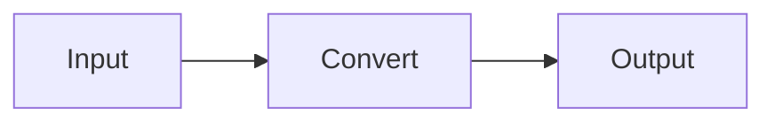
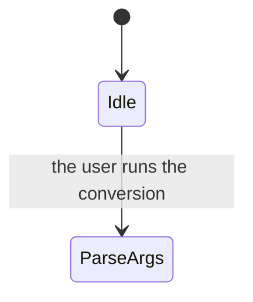

# Markdown StrictDoc specifications - a guide for AI

**UID**: DOC-AI-GUIDE \
**Version**: 1.0

**This guide shows an AI how to write a Markdown StrictDoc specification and how to
pull the information it needs back out of it.** StrictDoc also has an `.sdoc` format,
but this guide does not cover it.

**This one guide is enough.** You do not need to open another explanatory document
or an existing specification. The same holds when you use an existing grammar and
**when you write a whole new grammar from scratch** (section 1.1 carries a grammar
file template in a form you can use as it stands).

**You can define a Claude Code SKILL from the English translation of this guide.**
If you translate the rules and the worked examples separately, you can move the rules
into `SKILL.md` and the queries and worked examples into `references/` as they are.

**★ When you hit an error that this guide does not list, do not stop: log one line
and move on.** Chapter 0 tells you how. **Never chase the cause on the spot.**

The explanations below use `samples/md-basic-en` as their worked example. **The same
rules apply to every Markdown StrictDoc project.**

Here is how the worked example is laid out. **StrictDoc parses every `.md` file as a
document.** This guide is no exception: it becomes one document, `DOC-AI-GUIDE`.

| File | Contents | Document UID |
|---|---|---|
| `00-ai-guide.md` | This guide | `DOC-AI-GUIDE` (no requirements) |
| `01-ai-queries.md` | The detailed version of this guide's queries | `DOC-AI-QUERIES` (no requirements) |
| `02-guide-for-human.md` | The explanatory document for humans. **An AI does not need to read it** | `DOC-GUIDE` (no requirements) |
| `03-upper.md` | 3 system requirements | `DOC-UPPER` |
| `04-lower.md` | 4 software requirements. They link up to the system requirements | `DOC-LOWER` |
| `05-tests.md` | 4 test cases. They link up to the software requirements | `DOC-TESTS` |
| `06-review.md` | How we review. A finding goes on the requirement itself | `DOC-REVIEW` (no requirements) |
| `_assets/note.md` | A terminology table. A link target | `DOC-NOTE` (no requirements) |
| `_assets/fig-state.md` | One large figure. A link target | `DOC-FIG-STATE` (no requirements) |
| `basic.sgra` | The grammar definition. You declare node types, fields and `Role` here | — |
| `strictdoc_config.py` | The project settings | — |

**The numbers give the reading order.** `00` and `01` are for an AI, `02` is for a human,
`03` to `05` are the specification itself, and `06` tells you how the review runs.
The files inside `_assets/` carry no number.

**Example 1, further down, returns 9 documents.** They are every row of the table above
that carries a UID. Six of them - `DOC-AI-GUIDE` / `DOC-AI-QUERIES` / `DOC-GUIDE` /
`DOC-REVIEW` / `DOC-NOTE` / `DOC-FIG-STATE` - hold no requirements, so they never mix
in when you count requirements.

**★ This guide and `01-ai-queries.md` are themselves StrictDoc documents.**
That is why every heading carries `**Type**: SECTION`. Without it StrictDoc reads the
text below the heading as the body of a requirement and stops (this is the rule from
chapter 1, unchanged). **And the contents of this guide land in the JSON too.** A query
that counts figures or code mixes this guide in, so when you count, follow
"Exclude the explanatory documents when you count" in chapter 3.

The command examples assume that you run them in Git Bash.

## ★ What to substitute when you use this guide on another project

**Type**: SECTION

**The rules in this guide apply to every Markdown StrictDoc project.**
On the other hand, **the proper names that appear in this guide belong to this worked
example.** When you use the guide on another project, substitute them as the table
below shows. **You do not need to substitute the rules themselves.**

| Name in this guide | What it stands for | In the other project |
|---|---|---|
| `samples/md-basic-en` | The specification folder | The other project's folder |
| `basic.sgra` | The grammar file | **Any name works.** Only the extension has to be `.sgra` |
| `DOC-UPPER` / `DOC-LOWER` and so on | The document UID | The other project decides it. **Look it up with example 1** |
| `SYS-*` / `SW-*` / `TC-*` | The UIDs of requirements and tests | The other project's numbering. **Look it up with example 3** |
| `DOC-FIG-` | **The prefix for the UID of a figure document** | **You decide it.** Pass it to the audit query with `--arg figprefix` |
| `DOC-AI-GUIDE` / `DOC-AI-QUERIES` / `DOC-GUIDE` / `DOC-REVIEW` | **The UIDs of the explanatory documents** | The other project's explanatory documents. Exclude them with `--arg skip` when you count |
| File names such as `03-upper.md` | The file name of a document | **They never land in the JSON.** Look them up with the `grep` in example 16 |
| `_assets` | The place for attachments | **Fixed. You cannot change it** (2.8) |
| `strictdoc-quirks.tsv` | The quirk log | Create one under the same name (0.1) |

**These two alone are conventions that you decide yourself. They are not part of the
StrictDoc specification.**

- **The prefix for the UID of a figure document** - the audit query needs it to tell
  which figures you already moved out (2.1)
- **Which documents you treat as explanatory** - the queries that count notation need
  it in order to exclude them (chapter 3)

**You pass both of them to the query as an argument.** Never rewrite the body of the query.

---

## 0. When you hit an error that this guide does not cover

**Type**: SECTION

**We measured everything in this guide on strictdoc 0.27.1.** A different version
behaves differently. The other project may also write things in an unusual way.
**When that happens, this guide is certain to be wrong.**

**When it goes wrong, you do exactly three things.**

1. **Work around it and move on.** Your goal is to write the specification, not to fix StrictDoc
2. **Add exactly one line to `strictdoc-quirks.tsv`**
3. **Move on to the next task**

**★ Never chase the cause on the spot.** If you dig in, you never finish the work you
came for. **Read the collected lines together later and use them as the material for
fixing this guide.** Do not fix them one at a time: clear them all at once when the
version goes up or when the lines pile up.

### 0.1 How to write the log

**Type**: SECTION

**Put `strictdoc-quirks.tsv` directly inside the specification folder.** It is tab
separated, 6 columns, one line per entry. **Only append. Never rewrite or delete a
line that is already there.** StrictDoc does not parse `.tsv`, so the file has no
effect at all on your documents (measured).

| Column | Contents |
|---|---|
| `date` | `YYYY-MM-DD` |
| `sd_version` | The output of `strictdoc --version` |
| `step` | What you were doing. `export-html` / `export-json` / `jq` / `server` / `edit` |
| `symptom` | **The first line of the error, as it stands.** Cut it if it runs long |
| `workaround` | How you worked around it. **In one line** |
| `where` | Which file, and where in it |

If the file does not exist yet, create it together with its header line.

```bash
printf 'date\tsd_version\tstep\tsymptom\tworkaround\twhere\n' > <specification folder>/strictdoc-quirks.tsv
```

Add one line. **Append with `>>`. A single `>` erases the log you already have.**

```bash
printf '%s\t%s\t%s\t%s\t%s\t%s\n' "$(date +%F)" "0.27.1" "export-html" "error: string index out of range" "put a character after the closing dollar" "04-lower.md" >> <specification folder>/strictdoc-quirks.tsv
```

**Write it in ASCII English.** You do that so a machine can process it later, and
because the error that lands in `symptom` is English.

### 0.2 What to log and what not to log

**Type**: SECTION

| Log it | Do not log it |
|---|---|
| An error **that this guide does not list** | A trap that this guide lists (a trailing `$`, for one) |
| Behavior that **differs** from what this guide describes | Your own typo |
| A step that failed because the version differs | Something that never comes back once you fix it |

**When you cannot decide, write it down.** One line costs little, and the knowledge
you lose never comes back.

### 0.3 How to use the log you collected

**Type**: SECTION

**Read it only when you clear the whole log at once.** When the same `symptom` shows
up again and again, it is a trap that this guide should describe.

```bash
cut -f2,4 <specification folder>/strictdoc-quirks.tsv | sort | uniq -c | sort -rn
```

Sort the log by version and **you see what changed in which version.**

```bash
sort -t"$(printf '\t')" -k2,2 -k1,1 <specification folder>/strictdoc-quirks.tsv
```

---

## 1. Writing a specification

**Type**: SECTION

Below is a template that we confirmed strictdoc 0.27.1 parses. **This template creates
five kinds of node: `DOCUMENT` / `TEXT` / `SECTION` / `REQUIREMENT` / a custom node type.**

```markdown
# Document title

**Grammar**: basic.sgra \
**UID**: DOC-UPPER \
**Version**: 1.0

Text directly under the H1 becomes free text. It has no UID, so it is not a requirement.

## Chapter name

**Type**: SECTION

Free text inside the chapter. Without `Type`, StrictDoc reads this paragraph as the body of a requirement.

## Requirement name

**UID**: SW-001 \
**STATUS**: Approved \
**REVIEW_STATUS**: NoFinding

**Statement**: The system shall ...

**Rationale**: The reason we decided that.

## Test case name

**Type**: TEST_CASE \
**UID**: TC-001 \
**TEST_RESULT**: NotRun

**GIVEN**: ... is in the ... state.

**WHEN**: ... runs ...

**THEN**: ... has become ...

**Relations**:
- **Type**: `Parent` \
  **ID**: `SW-001` \
  **Role**: `Verifies`
```

StrictDoc does not need the `\` at the end of a line. Other Markdown viewers join
consecutive lines into a single line, and this character stops them.

### Rules that stop the whole export when you break them

**Type**: SECTION

| Rule | Error message you get |
|---|---|
| Start the file with an H1. Put exactly one of them in a file | `the document must start with an H1 heading` |
| **Do not skip a heading level.** Never put `###` right after `#` | `heading level forward jumps are not allowed: L1 -> L3` |
| Do not put two or more empty lines right after a heading | `two or more consecutive empty lines are not allowed` |
| Spell a field name exactly as the grammar declares it | `Invalid requirement field` |
| Write a field named `TYPE` as `**TYPE**:`, in capitals | `**Type**:` is taken as the node-type selector before anything else |
| Do not write a `Role` that the grammar does not declare | `Semantic error: Requirement relation type/role is not registered: Parent / Verifies` |
| **Declare `SECTION` when you write your own grammar** | `Semantic error: Invalid node type: SECTION.` |
| **Give `SECTION` a `PROPERTIES: IS_COMPOSITE: True`** | `The SECTION grammar element must be declared as composite.` (the Hint shows you the fix) |

**You do not have to declare `TEXT`. It is built in** (measured). We exported with a grammar
that declares only `SECTION` and `REQUIREMENT`, and the free text still became a `TEXT` node.
**Only `SECTION` needs a declaration.**

**StrictDoc prints an error on two lines. The first line carries the file name.**

```text
error: could not parse file: C:\...\04-lower.md.
Semantic error: Invalid node type: SECTION.
```

**Exactly one exception exists: an error that names neither the cause nor the file.**

```text
error: A process in the process pool was terminated abruptly while the future was running or pending.
```

**★ When you see this error, run the export again with `--no-parallelization`. StrictDoc then
prints the real error** (measured).

```bash
strictdoc export <specification folder> --formats=json --output-dir <output dir> --no-parallelization
```

```text
error: could not parse file: C:\...\00-ai-guide.md.
Semantic error: Markdown parsing error: heading level forward jumps are not allowed: L1 -> L3.
Location: C:\...\00-ai-guide.md:54:1
```

**It prints the file name and the line number.** Only when it runs in parallel does StrictDoc
fail to carry the real error out of the child process and swallow it (a defect in strictdoc
0.27.1: it fails to construct the exception class). **`--debug` only prints a stack trace and
never prints the location. `--no-parallelization` gets you there faster.**

**Only two errors hide their location from you: this one and the `string index out of range` in 2.3.**
For every other error, the first line tells you where it is.

### Rules that a worked example does not show you

**Type**: SECTION

- **StrictDoc treats a sentence placed directly under a heading as an implicit `Statement`.** The
  heading then becomes a requirement node. Write `**Type**: SECTION` on every chapter that is not
  a requirement. Without it StrictDoc stops and blames the missing `UID`. **Only the text directly
  under the H1 is an exception**; it always becomes free text
- **Case of a field name**: only these eight words ignore case: `Statement` `Title` `Status`
  `Rationale` `Comment` `Level` `Tags` `Prefix`. Spell every other field as the grammar declares it
  (`GIVEN` passes, `Given` stops). **When you cannot decide, write the name in all capitals**
- **Write the link on the lower side.** Put `**Relations**:` on the lower node and point it at the
  parent's UID. Write nothing on the upper side. The parent may live in another file (StrictDoc
  resolves a UID across the whole project)
- **You may write a `Role` only when the grammar declares a `ROLE` on that node type's relation.**
  `basic.sgra` declares the following. **Never put a `Role` on a software requirement** -
  copying the test case pattern verbatim stops the export
  | Node type | Relations you may write |
  |---|---|
  | `REQUIREMENT` | `Parent` / `Child`. **You cannot add a `Role`** |
  | `TEST_CASE` | `Parent` + `Role: Verifies` |
- **Only inside a relation does the key become `**ID**:`.** A node's identifier is `**UID**:`, but
  the key that points at the other node inside a `**Relations**:` block is `**ID**:`. `**UID**:`
  does not pass there
- **`Type` is the reserved word that picks a node type in `.md`.** What is reserved is
  **the spelling `Type` alone** - the reader compares `field_.name == "Type"` exactly
  (`backend/markdown/reader.py`, 0.27.1). **So you may declare a grammar field named `TYPE`**:
  write it as `**TYPE**:` in capitals and it passes through as an ordinary field, even on a node
  that also carries `**Type**: COMPONENT` (measured). It is a single-line custom field, so
  **declare it after `TITLE`**
- **Declare `FIELDS` in `.sgra` in this order** (it is not the order you write them in `.md`).
  `UID → STATUS → TITLE → your own single-line fields → STATEMENT →
  multi-line fields such as RATIONALE`. **Break the order and json, html and sdoc all stop on the
  spot** (measured). The error is
  `Semantic error: Wrong field order for requirement: [...]`, and the `Hint:` line names the field
  that broke it and prints the order the grammar declares, so you fix it where you stand
- **Only five fields written directly under the document's H1 survive into the JSON:
  `**Grammar**:` `**UID**:` `**Version**:` `**Classification**:` `**Prefix**:`**
  (measured). `**Date**:` and `**Root**:` **do not stop the export, but they disappear from the
  JSON.** No machine can query them afterward, so never put information you want to query later
  at the document level
- **StrictDoc parses every `.md` in the folder as a document, wherever it sits.** `_assets/` is no
  exception, so an `.md` you put there needs an H1 as well
- **List an `.md` you do not want StrictDoc to parse by file name under `exclude_doc_paths` in
  `strictdoc_config.py`.** Never list a whole folder such as `_assets/**`. If you do, StrictDoc
  stops copying the images too, and the export reports success while every image in the HTML
  returns 404
- **Chapter 2 collects how to write figures, math, code, tables and images.** They hold many
  traps, so read it before you write any of them
- **Add a node type, a field or a `Role` to the `.sgra`.**
  Never add one to an individual document

**The minimum layout for a new project** (measured):

```text
<project folder>/
  <name>.sgra       ← put it in the same folder as the documents. **Grammar**: <name>.sgra points here
  00-upper.md
  01-lower.md
```

**You may name the grammar file anything you like** (measured; it does not have to be
`basic.sgra`). Only the extension has to be `.sgra`.
**StrictDoc reads the `.sgra` too and logs `Reading SDOC:` for it, but it never becomes a document.**

### 1.1 Writing a grammar file (`.sgra`)

**Type**: SECTION

**When you start a new project, you always end up writing your own `.sgra`.**
Below is the smallest template that you can use as it stands. **This template pairs with the `.md`
template in chapter 1.** We pasted both as they stand and ran `--formats=json` and
`--formats=html`; both passed (measured).

**★ Always use the two templates as a pair.** Leave one field the `.md` template writes out of the
`.sgra` and StrictDoc stops the export. Below is the error we measured after dropping the
`REVIEW_STATUS` declaration (the `Hint:` line prints the fields the grammar does declare).
Once you swap either side for something else, compare the two orders and check them against
each other.

```text
Semantic error: Invalid requirement field: REVIEW_STATUS
```

```text
[GRAMMAR]
ELEMENTS:
- TAG: SECTION
  PROPERTIES:
    IS_COMPOSITE: True
  FIELDS:
  - TITLE: TITLE
    TYPE: String
    REQUIRED: True
- TAG: REQUIREMENT
  FIELDS:
  - TITLE: UID
    TYPE: String
    REQUIRED: True
  - TITLE: STATUS
    TYPE: SingleChoice(Draft, Reviewed, Approved)
    REQUIRED: False
  - TITLE: TITLE
    TYPE: String
    REQUIRED: True
  - TITLE: REVIEW_STATUS
    TYPE: SingleChoice(NotReviewed, NoFinding, Open, Fixed, WontFix)
    REQUIRED: True
  - TITLE: STATEMENT
    TYPE: String
    REQUIRED: True
  - TITLE: RATIONALE
    TYPE: String
    REQUIRED: False
  - TITLE: REVIEW_COMMENT
    TYPE: String
    REQUIRED: False
  - TITLE: REVIEW_ACTION
    TYPE: String
    REQUIRED: False
  RELATIONS:
  - TYPE: Parent
  - TYPE: Child
- TAG: TEST_CASE
  FIELDS:
  - TITLE: UID
    TYPE: String
    REQUIRED: True
  - TITLE: TITLE
    TYPE: String
    REQUIRED: True
  - TITLE: TEST_RESULT
    TYPE: SingleChoice(NotRun, Passed, Failed, Blocked)
    REQUIRED: True
  - TITLE: ISSUE_KEY
    TYPE: String
    REQUIRED: False
  - TITLE: GIVEN
    TYPE: String
    REQUIRED: True
  - TITLE: WHEN
    TYPE: String
    REQUIRED: True
  - TITLE: THEN
    TYPE: String
    REQUIRED: True
  - TITLE: TEST_REMARK
    TYPE: String
    REQUIRED: False
  RELATIONS:
  - TYPE: Parent
    ROLE: Verifies
```

How to read it:

| What you write | What it means |
|---|---|
| `- TAG: <name>` | Declares one node type. `**Type**: <name>` on the `.md` side points at it |
| `PROPERTIES: IS_COMPOSITE: True` | The node can hold other nodes inside it. **`SECTION` requires this** |
| `- TITLE: <name>` | Declares one field. `**<name>**:` on the `.md` side points at it |
| `TYPE: String` | Any string |
| `TYPE: SingleChoice(A, B, C)` | An enumeration. A value that this list omits stops the export |
| `REQUIRED: True` | Omitting the field stops the export |
| `RELATIONS: - TYPE: Parent` | You can now draw a `Parent` link in `**Relations**:` |
| `ROLE: <name>` | You can now write `**Role**:` on that relation. **Without it you cannot use `Role`** |

**Rules:**

- **`SECTION` needs a declaration. `TEXT` does not** (it is built in)
- **Match the names you give `TAG` and `TITLE` to the spelling on the `.md` side exactly.** Once you
  declare `GIVEN`, write `**GIVEN**:` in the `.md` too. `**Given**:` stops the export
- **You may declare a field named `TYPE`.** Only the spelling `Type` is reserved.
  Write it as `**TYPE**:` in the `.md`, and declare it after `TITLE`
- **The order in which you declare the fields constrains the `.md` side.** Declare them in the order
  `UID → STATUS → TITLE → your own single-line fields → STATEMENT →
  multi-line fields such as RATIONALE`. **In any other order json, html and sdoc all stop on the
  spot** (measured). The `Hint:` line names the field that broke it and prints the declared order
- **`--formats=json` already tells you whether the order is right.** "json passes but sdoc fails"
  does not happen. **`--formats=sdoc` is no use as a round-trip check either**: the `.sgra` the
  generated `.sdoc` names does not travel with it, and any document that quotes `[LINK: UID]` as
  an example turns that quotation into a live link, so reading the result back stops with
  `the inline link references an object with an UID that does not exist: UID` (measured)

```bash
strictdoc export <specification folder> --formats=json --output-dir <output dir>
```

**The export passes without a `strictdoc_config.py`.** Put one directly in this folder only when
you need `exclude_doc_paths` or a screen setting (do not put it in the parent folder; StrictDoc does not read it there).

**★ Restart the server after you edit `strictdoc_config.py`** (measured).
**StrictDoc reads this file exactly once, at startup.** When you edit a document's `.md`, the
server picks the change up in under a second, but **it never picks up the project settings again.**

| What you edited | Restart the server |
|---|---|
| A `.md` document | Not needed. The server applies it automatically |
| A `.sgra` grammar | Not needed |
| **`strictdoc_config.py`** | **Needed** |

**This symptom hides itself well.** You fixed the setting, the screen still shows the old state,
so you conclude that you got the setting wrong. **The server also keeps writing HTML from the old
settings, so the output folder stays stale too.** When in doubt, stop the server and run
`strictdoc export` once by hand to check.

---

## 2. Writing figures, math, and code

**Type**: SECTION

**We measured everything below on strictdoc 0.27.1.** "Passes" means the export
succeeded and produced the HTML we intended.

| Notation | Result | HTML it produces |
|---|---|---|
| a ` ```mermaid ` fence | **passes** | `<pre class="mermaid">` |
| `$E = mc^2$` (inline) | **passes** | `<span class="math notranslate nohighlight">\( ... \)</span>` |
| `$$ ... $$` (block) | **passes** | `<div class="math notranslate nohighlight">\[ ... \]</div>` |
| a ` ```python ` fence | passes but **gets no color** | `<code class="language-python">` |
| a pipe table | **passes** | `<table>` |
| `` | **passes** | `` |
| `[LINK: UID]` | **passes** | `<a href="....html#UID">🔗 title</a>` |
| RST's `.. math::` | **does not pass** | `<p>.. math::</p>` - just a paragraph |
| `[DOCUMENT_FROM_FILE]` | **does not pass** | see 2.6 below |

**StrictDoc bundles MathJax and Mermaid into the output folder** (`_static/mathjax/tex-mml-chtml.js` /
`_static/mermaid/mermaid.min.js`). StrictDoc makes no outside connection. You add nothing to the configuration.

### 2.1 Figures - move a figure past 15 lines into its own document

**Type**: SECTION

**This is the only rule.**

| Contents of a ` ```mermaid ` fence | Where it goes |
|---|---|
| **15 lines or fewer** | Write it in the body as it stands |
| **16 lines or more** | Put it in `_assets/fig-*.md` as its own document and send the reader there with `[LINK:]` |

**You count the lines exactly one way.**

- **Do not count** the ` ```mermaid ` line or the closing ` ``` ` line
- **Count the declaration line**, such as `flowchart LR` or `stateDiagram-v2`
- **Do not count blank lines**

The example below is **3 lines** (15 or fewer, so the body is fine).

````markdown

````

**This count matches the query in example 14 of chapter 3 exactly.** The query drops blank
lines as well. You can count by hand, or you can measure with the query after you write the
figure. Both give the same number.

**Even so, do not write toward exactly 15 lines.** A figure always grows later.
**Either keep it clearly small, or move it out without hesitating.**

**We decide by line count because you can judge it without a tool while you write.**
What we really want to control is the burden on the reader, and we measured that as follows.
**Every token count in this guide comes from tiktoken's `o200k_base` encoding.** Use the same
counting method when you measure again.

| Content | tokens |
|---|---:|
| One paragraph of free text | 15-50 |
| A 6-15 line Mermaid figure | 124-179 |
| A 16-24 line Mermaid figure | 110-228 |

**Line count and token count do not track each other cleanly** (one figure runs 114 tokens at
17 lines, another runs 124 tokens at 6 lines). We still take the line count. **When in doubt, move it out.**

We measured what you gain by moving a figure out as well. In this sample:

| What you pull | tokens |
|---|---:|
| The requirement list alone | **74** |
| The large figure alone, named by UID | **233** |
| Every `TEXT` node (figures and math included) | **about 36,000** |

**As long as you pull requirements, the reader pays not one token for a figure you moved into its own document.**
You name it by UID only when you need it. This is why we cut at 16 lines.

**How to build the separate document** - StrictDoc parses a `.md` file as a document wherever it sits,
so a file inside `_assets/` still needs an H1 and a `**UID**:` line.

````markdown
# Large figure - conversion state machine

**UID**: DOC-FIG-STATE


````

**You do not need a `**Grammar**:` line** (measured). Leave it out and StrictDoc applies the default grammar.
The default grammar also passes when you want to put a requirement node in a figure document.

On the body side you put one link line.

```markdown
We moved the large figure, which covers interruption and cleanup, into its own document -> [LINK: DOC-FIG-STATE]
```

**`.md` gives you no way to pull a figure into the body.** The figure appears only on the separate
page the link points to; StrictDoc does not expand it into the body. StrictDoc also builds the text
of `[LINK:]` from the title of the target, so **you cannot choose that text.**

**★ Rule: give a figure document one shared prefix, in its file name and in its UID.**
StrictDoc does not fix the prefix itself; **each project agrees on its own.**

| | Rule | What this worked example agrees on |
|---|---|---|
| File name | Start it with a prefix that marks it as a figure | **`fig-`** - `_assets/fig-state.md` |
| `**UID**:` | Start it with a prefix that marks it as a figure | **`DOC-FIG-`** - `DOC-FIG-STATE` |

**Only the UID works for a machine.** The audit query (example 14b) decides which figures you
already moved out from the prefix you pass with `--arg figprefix`.
**The file name never enters the JSON, so no query can see it** - the file-name prefix is an
agreement that lets a person spot a figure in a file listing.

**A wrong UID prefix breaks the audit. A wrong file name breaks nothing.**

**When you add a figure to a project that already exists, match the prefix that project uses.**
List the documents with example 1 and you see which UIDs the figure documents carry.
**If the project has no prefix, pick one yourself and write it down in the document that
corresponds to `02-guide-for-human.md`, not in the log in 0.1.**

**Side effect**: `_assets/*.md` shows up in the document list. In this worked example, `DOC-NOTE`
and `DOC-FIG-STATE` are the two. **We accept this** (no way to hide them exists; see below).

**When you move a figure out of the body, fix the free text around it too.** A sentence like
"as the figure below shows" or "in the flow above" dangles the moment the figure disappears.
**Replacing the figure with one link line is not enough.**

**Never exclude a figure document with `exclude_doc_paths`.** The target disappears, so the export
of the side that carries the `[LINK:]` stops (measured).

```text
error: DocumentIndex: the inline link references an object with an UID that does not exist: DOC-FIG-STATE.
```

**This error does not belong to the silent kind.** Even when you want to hide a figure from the list,
you cannot use this method.

### 2.2 Math - only `$` and `$$`

**Type**: SECTION

| How you write it | What comes out |
|---|---|
| `$ ... $` | It sits inside the sentence |
| `$$ ... $$` | It becomes a line of its own |

**You cannot use RST's `.. math::`.** Write it and the characters `.. math::` come out as a paragraph.
**The export does not stop, so you notice nothing until you look at the HTML.**

**With `$ ... $` and with `$$ ... $$` alike, the LaTeX inside passes through untouched.** `\bar{T}`,
`\frac{a}{b}`, a `\\` line break, `\begin{aligned}` and `\begin{pmatrix}` all reach MathJax exactly as
you wrote them (measured). **Markdown applies neither escaping nor emphasis inside a formula** -
the `_` in `T_a` never turns into an `<em>`.

**Outside a formula, though, Markdown collapses `\\` into a single `\`** - that is ordinary Markdown
escaping, not a defect.

### 2.3 ★ The `$` trap - the export stops for no apparent reason

**Type**: SECTION

**When `$` becomes the last character of a paragraph or of a table cell, the HTML export stops.**

```text
error: string index out of range
```

**It prints neither a file name nor a line number.** This is a defect on the strictdoc 0.27.1 side
(`_math_inline_rule` in `markdown_to_html_fragment_writer.py` reads past the end of the string).

| How you write it | Result |
|---|---|
| `The time is $T$` (the paragraph ends with math) | **stops** |
| `The time is $T$ here.` | passes |
| `\| symbol \| $T$ \|` (the cell ends with math) | **stops** |
| `\| symbol \| $T$ s \|` | passes |
| `\| symbol \| $$T$$ \|` (the cell uses `$$`) | passes |
| `The cost is 100 $` (it ends with a bare `$`) | **stops** |
| `The cost is 100 \$` | passes |
| `` The cost is `100 $` `` (inside a code span) | passes |
| a `$$ ... $$` block at the end of a section | passes |

**Remember one thing - always put a character after the closing `$`.**
A sentence ends with a period, so you keep this rule naturally in prose. **The table cell is where you cannot.**

**One more. When one line carries two `$` characters, MathJax turns what sits between them into math.** Money is not the only case.

| What you write | What comes out |
|---|---|
| `The cost is $100 to $200` | MathJax turns "100 to " into math |
| `$HOME and $PATH` | MathJax turns "HOME and " into math |
| `The cost is $100 only` (one `$`) | It comes out as written |

**A space after the `$` does not stop it** (`$ 100 to $ 200` turns into math as well).
Escape it as `\$100`, or put it in a code span as `` `$100` ``. **The export does not stop.**

**`--formats=json` passes this trap straight through** (measured). The JSON comes out fine, so
**if you end your work after looking at the JSON alone, the build fails the moment a human builds the HTML.**

**So whenever you touch a figure, a formula or code, run both of these.**

```bash
strictdoc export <specification folder> --formats=json --output-dir <output dir>
strictdoc export <specification folder> --formats=html --output-dir <output dir>
```

Once the JSON exists, you can hunt the dangerous lines by machine before you build the HTML.
**Zero hits is normal.** The query sits in **example 17** of chapter 3 (G33 in the detailed version).

**Do not close a table cell with a lone `$`.** You have two ways out, and **you take the first one.**

| How you write it | HTML it produces | How it looks |
|---|---|---|
| `\| $T$ s \|` (add a unit or a word) | `<span class="math ...">` | **It fits inside the text. Use this one** |
| `\| $$T$$ \|` (make it a block) | `<div class="math ...">` | It becomes a line of its own inside the cell and centers itself |

### 2.4 Code - always write the language name

**Type**: SECTION

````markdown
```python
def convert(src: str, dst: str) -> None:
    os.replace(tmp, dst)
```
````

The output HTML becomes `<code class="language-python">`, but **StrictDoc carries no syntax
highlighting** (we measured zero pygments spans). **You get no color.
We accept this.**

**Write the language name anyway.** The JSON keeps the language name exactly as you wrote it, so it
gives a later reader the only clue for telling what kind of code this is. G31 in
`01-ai-queries.md` cannot pick up a fence that carries no language name.

### 2.5 StrictDoc interprets nothing inside a fence

**Type**: SECTION

**Mermaid and code behave the same way.** A `[LINK: SW-001]` you write inside a fence does not
become a link; it comes out as plain text. Inside a fence, `$`, `|` and `**` all do nothing.

- To point from a figure to a requirement, **put the link outside the fence**
- Put any string that must escape the `$` trap inside a fence or a code span

**When you want to write ` ``` ` in the body, as a query does, open the fence with four backticks.**
Three backticks close the fence partway through. StrictDoc reads a four-backtick fence correctly too (measured).

### 2.6 Never write `[DOCUMENT_FROM_FILE]`

**Type**: SECTION

This is the include notation of `.sdoc`. **It not only fails to work in `.md`, it also breaks
silently depending on how you write it** (measured).

| How you write it | What happens |
|---|---|
| `[DOCUMENT_FROM_FILE]: path` | Markdown reads it as a link reference definition and **drops the whole line** |
| `[DOCUMENT_FROM_FILE]` after you wrote the line above | It resolves to that definition and **becomes a broken link** |
| `[DOCUMENT_FROM_FILE]` on its own | It comes out as plain text |

**The export succeeds in every case.** When you want to split content into its own document, use the `[LINK:]` from 2.1.

### 2.7 Tables

**Type**: SECTION

**A pipe table is the only table you get.** RST grid and simple formats do not pass. **You do not have to align the columns.**

```markdown
| symbol | meaning |
|---|---|
| a | alpha |
```

**A table passes even when you drop the pipes at both ends** (measured), but **always write them.**
Drop them and the table-checking query in chapter 3 cannot find the row.

**Alignment markers (`:---` / `:---:` / `---:`) and empty cells pass.**
**You can use `` `code` ``, `**bold**` and `[link](path)` inside a cell** (measured).

**You can put a table in the `STATEMENT` of a requirement.** The JSON holds it exactly as you wrote it,
so you can pull the table out on its own, rewrite it and write it back (example 19).

#### 2.7.1 Three ways to write a table that breaks silently

**Type**: SECTION

**The export succeeds in every case. Only the HTML comes out broken.**

| How you write it | What happens |
|---|---|
| **The row holds more cells than the header** | **Markdown throws the extras away.** In `\| this \| row \| is \| long \|`, "long" disappears |
| The row holds fewer cells than the header | Markdown pads with empty cells. The harm is small |
| **An unescaped `\|` inside a cell** | The column splits right there |

**★ A code span does not protect `|`.** It differs from `$` here.

| How you write it | Result |
|---|---|
| `a \| b` (escaped) | **Passes.** The cell shows `a \| b` |
| `` `a \| b` `` (escaped inside a code span as well) | **Passes.** This is the correct way to write it |
| `` `a \| b` `` with the `\` removed | **Splits.** A code span does not protect `\|` |

**A code span protects `$`, yet it does not protect `|`.** Do not confuse the two.

**The JSON keeps a broken row exactly as you wrote it** (measured). **So you can detect it with
example 20 before you look at the HTML. Zero hits is normal.**

**Do not end a cell with `$`** (2.3). **This one alone stops the export.**

### 2.8 Attachments

**Type**: SECTION

**StrictDoc copies whatever you put in `_assets/` to the output, whatever its type** (measured).
This mechanism does not serve images alone.

| What you do | How you write it |
|---|---|
| Place an image | `` |
| **Attach something other than an image** | `[description](_assets/x.csv)` - write it as an ordinary link |

We put `.csv`, `.pdf` and `.zip` files in `_assets/` and ran the export: **all three reached the
output, and every link resolved** (measured). **An SVG stays sharp when you zoom in, so make SVG the default for a figure image.**

**★ An attachment breaks silently in two ways. The export reports success.**

| How it breaks | What happens |
|---|---|
| **The file you reference does not exist** | The `` or the `<a>` still comes out. Open it and you get a 404 |
| **You put the file outside `_assets/`** | The file exists, yet StrictDoc **does not copy it**. Open it and you get a 404 |

**The asset folder always carries the name `_assets`.** Create a folder under another name, such as
`attachments/`, and StrictDoc does not scan it (measured; the source writes the name directly as
`find_directories(..., "_assets")`).

**Neither one prints anything in the export log.** So run **example 18** of chapter 3 every time.
**Zero hits is normal.**

- **Never hand `exclude_doc_paths` a folder such as `_assets/**`.**
  StrictDoc passes the same setting to **both** "find the documents" and "find the asset folder",
  so it stops copying the images too. The export reports success, yet the images in the HTML come back as 404

---

## 3. Pull only the part of the specification you need

**Type**: SECTION

**When you need only a part of the specification, do not read the `.md` files.**
Reading the whole specification of this worked example (`03` through `05` and
`_assets/`) costs about 5,200 tokens, and about 12,500 tokens once you include
`02-guide-for-human.md`. Convert it to JSON and pull the list of requirements
with `jq`, and the same answer costs 74 tokens.

**★ This ban covers only "reading in order to learn". You may open a file to rewrite it.**
When your job is to fix an existing specification, the correct procedure is to
open the target `.md` and edit it (3.1 collects the steps).
**You cannot mechanically write back from JSON to `.md`** -
the JSON holds no file paths.

| What you do | Do you open the `.md`? |
|---|---|
| Learn, count or search the content | **No.** Export JSON and query it with `jq` |
| Rewrite the content | **Yes.** Locate the place with example 16 first, then open it |

### Step 1 - Convert to JSON

**Type**: SECTION

```bash
strictdoc export <specification folder> --formats=json --output-dir <output dir>
```

StrictDoc creates `<output dir>/json/index.json`. Below we write `<json>` for this file.

**Put `<output dir>` outside the specification folder.** Use a scratch location such as somewhere under `%TEMP%`.

To be precise, **only `--formats=sdoc` is dangerous** (measured). StrictDoc skips
its own json / html output, so that output breaks nothing even when it sits
inside the folder. But `sdoc` writes out `.sdoc` files that StrictDoc can parse,
so the next run picks them up as input and the whole export stops.

```text
error: TraceabilityIndex: the document "A" imports a grammar from a file that does not exist: "basic.sgra".
```

**Always writing outside is safer than remembering which format is safe.**

**You may write json and html to the same `<output dir>`** (measured). StrictDoc splits them into
`<output dir>/json/` and `<output dir>/html/`, so they do not overwrite each other.

**After you edit a `.md`, run this `strictdoc export` again.**
StrictDoc does not update the JSON on its own.

**Do not read this `index.json` directly** - it holds about 55,000 tokens.
The file exists only for `jq` to read.

**StrictDoc has a query language of its own, but it does not affect the JSON output.**
`--filter-nodes` narrows only the `.sdoc` and the HTML output. Add it to `--formats=json` and
**StrictDoc emits every node with neither an error nor a warning**. Do the narrowing with `jq`.

### Step 2 - Pull the data out with jq

**Type**: SECTION

The structure of the JSON:

```json
{"DOCUMENTS": [
  {"_NODE_TYPE": "DOCUMENT", "UID": "...", "TITLE": "...", "GRAMMAR": {},
   "NODES": [
     {"_NODE_TYPE": "SECTION", "TITLE": "...", "NODES": [
       {"_NODE_TYPE": "TEXT", "_TOC": "2.1.1", "STATEMENT": "Free text. It has no UID"}]},
     {"_NODE_TYPE": "REQUIREMENT", "UID": "...", "TITLE": "...", "STATEMENT": "...",
      "RELATIONS": [{"TYPE": "Parent", "VALUE": "...", "ROLE": "..."}]}]}]}
```

**★ Figures, math and code land almost entirely in free-text nodes with `_NODE_TYPE == "TEXT"`.**
You can write them in the `STATEMENT` of a requirement, but they normally sit in free text.
**A `TEXT` node has no `UID`.** To point at a place, use `_TOC` (a hierarchical number
such as `2.1.1`). When you tell a person where something is, give all three:
**the `UID` of the document, the `_TOC`, and the title of the parent chapter**.

Nodes nest inside each other. **Use the following boilerplate to flatten them.**

```bash
jq -r '.DOCUMENTS[] | recurse(.NODES[]?) | select(._NODE_TYPE=="REQUIREMENT") | .UID + "  " + .TITLE' <json>
```

- The key that tells you the node type is `_NODE_TYPE`. **It starts with an underscore.** So do `_TOC` and `_OPTIONS`
- **The JSON holds no `.md` file paths.** To pull "only the requirements of one file",
  narrow by the `UID` of the document (`DOC-UPPER`, for instance). Example 1 finds the document UIDs
- `_TOC` is a hierarchical number such as `2.1.1`. Use it to narrow by chapter
- **The JSON records no "children".** To pull the children of a requirement, walk every
  node and collect the ones whose parent is that requirement
- `RELATIONS` puts both `Parent` and `File` in the same array. When you need only the parents,
  narrow with `select(.TYPE=="Parent")`
- **Do not add `--included-documents`.** It duplicates the included documents,
  and the same UID shows up in two places
- The JSON contains neither `DATE` nor `METADATA:`. The document-level metadata is only
  `UID` / `VERSION` / `CLASSIFICATION` / `PREFIX` / `ROOT`
- With `-r`, `jq` prints lines a human reads; without it, `jq` prints JSON as it is.
  **Leave it off when a program processes the output**
- StrictDoc converts non-ASCII characters to `\uXXXX` inside `index.json`, but `jq`
  prints the original characters back. You do not have to convert anything yourself

### Examples

**Type**: SECTION

We ran every one of these and checked its output.

```bash
# 1. What is there to begin with - the list of documents
jq -r '.DOCUMENTS[] | (.UID // "-") + "  " + .TITLE' <json>

# 2. Field names usable per node type (read the schema of an existing project from
#    the JSON. When you start a new one there is no JSON yet, so read basic.sgra directly)
jq -c '[.DOCUMENTS[] | recurse(.NODES[]?) | select(._NODE_TYPE) | {t:._NODE_TYPE, k:keys}] | group_by(.t) | map({(.[0].t): (map(.k)|add|unique)}) | add' <json>

# 3. The list of requirements as a table (cheapest of all)
jq -r '.DOCUMENTS[] | recurse(.NODES[]?) | select(._NODE_TYPE=="REQUIREMENT") | [.UID, .STATUS, .TITLE] | @tsv' <json>

# 4. Every field of one requirement
jq -c 'first(.DOCUMENTS[] | recurse(.NODES[]?) | select(.UID? == "SW-002")) | del(.NODES)' <json>

# 5. Narrow to one document (you cannot narrow by file name)
jq -r '.DOCUMENTS[] | select(.UID=="DOC-UPPER") | recurse(.NODES[]?) | select(._NODE_TYPE=="REQUIREMENT") | .UID + "  " + .TITLE' <json>

# 5b. Reverse lookup - which document each node belongs to
jq -r '.DOCUMENTS[] | .UID as $doc | recurse(.NODES[]?) | select(.UID? and ._NODE_TYPE!="DOCUMENT") | $doc + "  " + .UID + "  " + .TITLE' <json>

# 6. Search with a regular expression (the 2nd argument holds flags. "i" ignores
#    case. Non-ASCII characters work too)
jq -r '.DOCUMENTS[] | recurse(.NODES[]?) | select(.TITLE? and (.TITLE | test("convert|check"; "i"))) | (.UID // "-") + "  " + .TITLE' <json>

# 7. and / or / not - put not at the end
jq -r '.DOCUMENTS[] | recurse(.NODES[]?) | select(.REVIEW_STATUS=="Open" and .STATUS=="Reviewed") | .UID' <json>
jq -r '.DOCUMENTS[] | recurse(.NODES[]?) | select(._NODE_TYPE=="TEST_CASE" or .REVIEW_STATUS=="WontFix") | .UID' <json>
jq -r '.DOCUMENTS[] | recurse(.NODES[]?) | select(.UID? and (._NODE_TYPE=="REQUIREMENT" | not)) | ._NODE_TYPE + " " + .UID' <json>

# 8. Direct children (reverse lookup)
jq -r '.DOCUMENTS[] | recurse(.NODES[]?) | select((.RELATIONS? // []) | any(.TYPE=="Parent" and .VALUE=="SYS-001")) | .UID' <json>

# 9. Walk the parents up to the root (transitive). unique sorts the result, so the output
#    order is not the hierarchy order. To tell which one is the root, open each returned
#    UID with example 4 and check that it carries no RELATIONS
jq -r '[.DOCUMENTS[] | recurse(.NODES[]?) | select(._NODE_TYPE and .UID)] as $all
| def anc($u): ($all[] | select(.UID==$u) | .RELATIONS? // [] | .[] | select(.TYPE=="Parent") | .VALUE) as $p | [$p], anc($p);
  [anc("TC-001")] | flatten | unique | .[]' <json>

# 10. Requirements that no test case points at "directly".
#     This is not transitive coverage. This sample returns SYS-001..003, but tests
#     reach all three through software requirements. That is not a defect. For a
#     transitive view, apply the reverse of example 9 (walk the children) to each UID
jq -r '[.DOCUMENTS[] | recurse(.NODES[]?) | select(._NODE_TYPE=="TEST_CASE") | (.RELATIONS // [])[] | select(.TYPE=="Parent") | .VALUE] as $tested
| .DOCUMENTS[] | recurse(.NODES[]?) | select(._NODE_TYPE=="REQUIREMENT")
| select(.UID | IN($tested[]) | not) | .UID + "  " + .TITLE' <json>

# 11. Relations that point at a UID that does not exist (a broken link). Zero is normal
jq -r '[.DOCUMENTS[] | recurse(.NODES[]?) | select(.UID?) | .UID] as $ids
| .DOCUMENTS[] | recurse(.NODES[]?) | select(.UID?) as $n
| ($n.RELATIONS // [])[] | select(.VALUE | IN($ids[]) | not) | $n.UID + " -> " + .VALUE' <json>

# 12. Just the count
jq -c '[.DOCUMENTS[] | recurse(.NODES[]?) | select(._NODE_TYPE=="REQUIREMENT")] | length' <json>
```

### Examples for figures, math, and code

**Type**: SECTION

**These two use a fence of four backticks.** The query body itself contains
` ``` ` (2.5).

**13. Where the figures, math, code, tables, and images are.** The second column
holds the `UID`, or `_TOC` when the node has none.

**Pass the UIDs of the explanatory documents to `--arg skip` as a comma-separated
list.** Without it the output mixes in a large amount of their content (below).

````bash
jq -r --arg skip 'DOC-AI-GUIDE,DOC-AI-QUERIES,DOC-GUIDE,DOC-REVIEW' '($skip | split(",")) as $s
| .DOCUMENTS[] | select(.UID | IN($s[]) | not) | .UID as $doc
| recurse(.NODES[]?) | select(.STATEMENT?) as $n | $n.STATEMENT as $t
| [$t | split("```") | to_entries[] | select(.key % 2 == 1) | .value | split("\n")[0] | rtrimstr("\r")] as $lang
| [ (if ($lang | index("mermaid")) then "figure" else empty end),
    (if ($t | contains("$$")) then "math" else empty end),
    (if ($lang | map(select(. != "mermaid" and . != "")) | length) > 0 then "code" else empty end),
    (if ($t | test("(?m)^[|]")) then "table" else empty end),
    (if ($t | contains("![")) then "image" else empty end) ] as $k
| select(($k | length) > 0) | $doc + "  " + ($n.UID // $n._TOC // "-") + "  " + ($k | join(","))' <json>
````

```text
DOC-UPPER  2.1  table
DOC-UPPER  2.2.1  code,table
DOC-LOWER  6.1  figure,math,code,table
DOC-TESTS  1  code
DOC-TESTS  2.1  code,table
DOC-FIG-STATE  1  figure
DOC-NOTE  1  table
```

**What you pass to `--arg skip` differs from one worked example to the next.** This
worked example has four explanatory documents (`DOC-AI-GUIDE` = this document,
`DOC-AI-QUERIES`, `DOC-GUIDE` and `DOC-REVIEW`). **In the other project, list the documents with
example 1 first, find the ones that double as an explanation of the notation, and
pass those** (chapter 3, "Exclude explanatory documents when you count", tells you
how to find them).

**Without it the query returns 91 rows, and 84 of them come from the explanatory
documents** (measured). A guide carries the notation in bulk in order to explain it,
so nothing is broken. **With it you get 7 rows.**

**Read the language name one fence at a time.** When you cut the text on ` ``` `,
every odd-numbered piece is fence content, so its first line is the language name.
**Never decide by asking whether the whole node contains `mermaid`** - when a figure
and code share one node, that test drops the code.

**14. Measure the line count of a figure.** This form lines up every figure for you
to look at.

````bash
jq -r '.DOCUMENTS[] | .UID as $doc | recurse(.NODES[]?) | (.STATEMENT? // "")
| select(contains("```mermaid")) | split("```")[] | select(startswith("mermaid"))
| ltrimstr("mermaid") | split("\n") | map(rtrimstr("\r")) | map(select(. != "")) | length as $c
| $doc + "  " + ($c | tostring) + " lines  " + (if $c > 15 then "move it out" else "keep it inline" end)' <json>
````

```text
DOC-AI-GUIDE  4 lines  keep it inline    ← these 10 rows are samples this document shows
DOC-AI-GUIDE  6 lines  keep it inline
DOC-AI-GUIDE  1 lines  keep it inline
DOC-AI-GUIDE  3 lines  keep it inline
DOC-AI-GUIDE  3 lines  keep it inline
DOC-AI-GUIDE  1 lines  keep it inline
DOC-AI-GUIDE  8 lines  keep it inline
DOC-AI-GUIDE  1 lines  keep it inline
DOC-AI-GUIDE  1 lines  keep it inline
DOC-AI-GUIDE  1 lines  keep it inline
DOC-AI-QUERIES  1 lines  keep it inline  ← the same
DOC-AI-QUERIES  1 lines  keep it inline
DOC-AI-QUERIES  1 lines  keep it inline
DOC-GUIDE  8 lines  keep it inline
DOC-LOWER  8 lines  keep it inline
DOC-FIG-STATE  19 lines  move it out
```

**The query returns 16 rows, and the list above is all of them.** Only two are real
figures, `DOC-LOWER` and `DOC-FIG-STATE`; the other 14 are samples an explanatory
document carries. **The query counts even those samples.** This document writes, inside
a ```` fence, a ```mermaid example, so each such piece comes out as a "figure" of 1 to
8 lines. **Only the next one, 14b, does real work** - this one is for looking.

**14b. Print only the rule violations. 0 rows is the normal result.** It skips the
figures you already moved out (documents whose UID starts with `DOC-FIG-`), so
**one returned row means you have a fix to make.**

**Pass the UID prefix of the figure documents to `--arg figprefix`.** In this worked
example it is `DOC-FIG-`. **In the other project, pass their prefix. Do not rewrite
the body of the query.**

````bash
jq -r --arg figprefix 'DOC-FIG-' '.DOCUMENTS[] | select(.UID | startswith($figprefix) | not) | .UID as $doc
| recurse(.NODES[]?) | select(.STATEMENT?) as $n | $n.STATEMENT
| select(contains("```mermaid")) | split("```")[] | select(startswith("mermaid"))
| ltrimstr("mermaid") | split("\n") | map(rtrimstr("\r")) | map(select(. != "")) | length as $c
| select($c > 15) | $doc + "  " + ($n.UID // $n._TOC // "-") + "  " + ($c | tostring) + " lines"' <json>
````

**15. Extract a whole figure definition.** You name the document by its UID.

````bash
jq -r '.DOCUMENTS[] | select(.UID == "DOC-FIG-STATE") | recurse(.NODES[]?) | (.STATEMENT? // "")
| select(contains("```mermaid")) | split("```")[] | select(startswith("mermaid")) | ltrimstr("mermaid")' <json>
````

`split("```")` cuts the text at every fence boundary, keeps only the pieces that
start with `mermaid`, and drops the leading 7 characters. **Change the language name
and the same shape pulls out code as well** (`startswith("python")`).

**Two traps wait for you when you write this output back. We measured both.**

**Trap 1 - a blank line appears at the top and at the bottom.**
`ltrimstr("mermaid")` drops only the 7 characters of `mermaid`, and the newline right
after them stays. The output of a 19-line figure comes to 21 lines. **Paste it back
as it is and one blank line piles up per round trip.** Example 14 drops blank lines
before it counts, so **the line count never tells you.** Drop the blank lines at both
ends before you paste. The version that drops them:

````bash
jq -r '.DOCUMENTS[] | select(.UID == "DOC-FIG-STATE") | recurse(.NODES[]?) | (.STATEMENT? // "")
| select(contains("```mermaid")) | split("```")[] | select(startswith("mermaid")) | ltrimstr("mermaid")
| split("\n") | map(rtrimstr("\r")) | map(select(. != "")) | join("\n")' <json>
````

**Trap 2 - `jq` on Windows prints CRLF line endings** (measured. The JSON itself
holds LF. StrictDoc normalizes to LF as it reads). **Pour that into a `.md` through a
redirect and you mix line endings.** Paste with an editing tool, and never write with
a shell redirect.

**16b. Extract a figure that sits in the body text.** Example 15 assumes a document
dedicated to a figure. When you take one out of a body document, point at the
position with `_TOC` (the second column of example 13 holds that number).
**When a document holds two or more figures, nothing else tells them apart.**

````bash
jq -r '.DOCUMENTS[] | select(.UID == "DOC-LOWER") | recurse(.NODES[]?) | select(._TOC? == "6.1")
| (.STATEMENT? // "") | split("```")[] | select(startswith("mermaid")) | ltrimstr("mermaid")
| split("\n") | map(rtrimstr("\r")) | map(select(. != "")) | join("\n")' <json>
````

**16. Track down which file defines a given UID.**
**The JSON carries no file path, so here alone you use `grep`.**

```bash
grep -rlF '**UID**: DOC-FIG-STATE' <specification folder> --include=*.md
```

**Include the `**UID**:` part in what you search for.** Search for the UID alone and
you also get the files that only reference it through `[LINK:]` (we measured 5 of
them). You need `-F` so that `grep` does not read `**` as a regular expression.

**Even so, you may get more than one file.** Run it in this folder and you get 4
files - only `_assets/fig-state.md` holds the real definition, and the remaining 2
come from this document and `01-ai-queries.md`, **because they show this notation as
an example.** **An explanatory document contains the very strings it explains.** Tell
whether a returned file is a specification or a guide from the table at the top of
this document.

**17. Lines that hold the `$` trap (2.3). 0 rows is the normal result.** Run this
every time you add a figure or a formula.

````bash
jq -r '.DOCUMENTS[] | .UID as $doc | recurse(.NODES[]?) | (.STATEMENT? // "")
| split("\n") | map(rtrimstr("\r"))
| reduce .[] as $line ({open: 0, out: []};
    ([$line | scan("^`{3,}")] | (.[0] // "") | length) as $w
    | if $w > 0
      then (if .open == 0 then .open = $w elif $w >= .open then .open = 0 else . end)
      else (if .open == 0 then .out += [$line] else . end)
      end)
| .out[]
| select(test("[^$][$] *$") or test("[^$][$] *[|]"))
| $doc + "  " + .' <json>
````

**The `reduce` part throws away the content of every code fence.** A `$` does no harm
inside a fence, so without that the query fills up with false positives. **It
remembers the length of the marker that opened the fence, and it closes only on a
marker of the same length or longer.** In a document like this one, where a ` ```` `
holds a ` ``` ` inside it, the simple approach of "cut on ``` and take the
even-numbered pieces" falls apart. **Applied to this guide, it exposes 141 lines that
really sit inside a fence** (measured). None of those 141 ends with `$` today, so it
costs 0 false positives right now - and that turns non-zero the moment somebody writes
one.

**★ `map(rtrimstr("\r"))` is not decoration.** StrictDoc keeps the CRLF of the source
file inside `STATEMENT`, so every line arrives ending in CR and the anchored `" *$"`
never matches. Leave it out and this query reports 0 rows on a document whose HTML
export dies on that very line (measured).

**★ 0 rows from this query does not prove you are safe.** It detects only **the trap
that fails the export** (a paragraph or a cell that ends with `$`). **The other trap
in 2.3 - the one where `The cost runs from $100 to $200` turns into math - does not
fail the export, so this query never shows it.** Whenever you write an amount of
money or an environment variable, look at the HTML with your own eyes.

**18. Check that the attachments arrived (2.8). 0 rows is the normal result.**
**This one query catches both a missing target and a file you put outside `_assets/`.**

It judges every reference that `jq` lists by whether the file exists **on the
exported HTML side**. Run `--formats=html` first.

```bash
jq -r '.DOCUMENTS[] | select(.UID | IN("DOC-AI-GUIDE", "DOC-AI-QUERIES", "DOC-GUIDE", "DOC-REVIEW") | not)
| recurse(.NODES[]?) | (.STATEMENT? // "")
| split("](") | .[1:][] | split(")")[0]
| select(startswith("http") or startswith("#") | not)' <json> \
  | tr -d '\r' | sort -u \
  | while read -r p; do [ -f "<output dir>/html/<specification folder name>/$p" ] || echo "NOT PUBLISHED  $p"; done
```

**On this worked example it returns 0 rows** (measured). Run it against a document
whose attachments are broken and you get this:

```text
NOT PUBLISHED  _assets/missing.svg      ← the file does not exist
NOT PUBLISHED  attachments/other.svg    ← it exists, but outside _assets/
```

**Never leave out any of the three.**

- **`tr -d '\r'`** - `jq` on Windows prints CRLF line endings. Leave it out and a
  `\r` hangs off the end of every path, so **the check calls even a file that exists
  "missing"** (we hit this one; measured)
- **the `select` that excludes the explanatory documents** - an explanatory document
  carries **a description of the syntax**, such as ``, in its body text.
  Leave it out and `path` and `_assets/x.svg` come out as "missing" (measured)
- **looking at `<output dir>/html/...`** - looking at the **output** instead of the
  specification folder catches the other case at the same time: "we put it in the
  wrong place, so nothing copied it"

**To find the attachments nobody uses**, turn the direction around. It tells you what
you may delete. **This one does not exclude the explanatory documents** (a reference
from anywhere counts as "used"). **It does exclude `_assets/*.md`** - those are
documents, and `[LINK:]` points at them by UID, so they never show up as a path.

```bash
comm -13 <(jq -r '.DOCUMENTS[] | recurse(.NODES[]?) | (.STATEMENT? // "") | split("](") | .[1:][] | split(")")[0]' <json> | tr -d '\r' | sort -u) \
         <(cd <specification folder> && find _assets -type f -not -name "*.md" | sort)
```

**19. Extract a whole table.** Point at the position with the UID for a requirement
and with `_TOC` for free text (the second column of example 13).

```bash
jq -r --arg doc DOC-LOWER --arg at 6.1 '.DOCUMENTS[] | select(.UID == $doc) | recurse(.NODES[]?)
| select((.UID? // ._TOC? // "") == $at) | (.STATEMENT? // "")
| split("\n")[] | select(startswith("|"))' <json>
```

```text
| Symbol | Unit | Meaning |
|---|---|---|
| $S_{need}$ bytes | bytes | Free space the conversion needs |
| $S_{out}$ bytes | bytes | Size of the output file |
| $S_{tmp}$ bytes | bytes | Size of the temporary file. It equals $S_{out}$ bytes |
| Path | - | The three stages `input \| convert \| output` |
```

**This table is a worked example that obeys every rule in 2.7.** The word "bytes"
follows the math, a `|` inside a cell is escaped as `\|`, and a pipe stands at both
ends of the row.

**Pass the position with `--arg`.** You never rewrite the body of the query, so you
reuse the same one everywhere. **This does not pick up a table that lacks a pipe at
both ends** (2.7).

**20. Find the tables that break (2.7.1). 0 rows is the normal result.** Run this
every time you add a table.

````bash
jq -r '.DOCUMENTS[] | .UID as $doc | recurse(.NODES[]?) | select(.STATEMENT?) as $n
| ($n.UID // $n._TOC // "-") as $at
| $n.STATEMENT | split("\n")
| reduce .[] as $line ({open: 0, want: 0, bad: []};
    ([$line | scan("^`{3,}")] | (.[0] // "") | length) as $w
    | if $w > 0
      then (if .open == 0 then .open = $w elif $w >= .open then .open = 0 else . end)
      elif .open > 0 then .
      elif ($line | startswith("|"))
      then ([$line | scan("[^\\\\][|]")] | length) as $c
           | if .want == 0 then .want = $c elif $c != .want then .bad += [$line] else . end
      else .want = 0
      end)
| .bad[] | $doc + "  " + $at + "  " + .' <json>
````

Point it at a deliberately broken document and it prints this:

```text
DOC-TBL  4.1  | code span | `a | b` |             ← a code span does not protect a |
DOC-TBL  4.1  | not escaped | a | b |             ← nobody escaped it
DOC-TBL  5.1  | too few | cells |                 ← a cell is missing
DOC-TBL  5.1  | too many | cells | here | oops |  ← "oops" disappears in the HTML
```

**It remembers how many separators the header row has, and it reports every row that
differs.** `scan("[^\\\\][|]")` does not count the ones escaped as `\|`, so a row you
escaped correctly never shows up. **This query alone uses a double backslash** - no
other way excludes an escaped `|`. **When it fails, write it into a `.jq` file and
pass it with `-f`** (constraint 2 below).

### Two constraints when you write a query

**Type**: SECTION

**1. Do not use a backslash in a regular expression.** `bash -c` halves a **double**
backslash such as `\\[`, and jq then fails with `Invalid escape` (measured). Write a
character class such as `[$]` or `[|]`, or use `split()` / `contains()`.
**A single backslash such as `split("\n")` survives** (measured). Only the double form halves.

**2. Put the query in a file when it has to get complicated.** Place it in a `.jq` file and
pass it with `-f`. The query never goes through the shell, so no backslash problem appears.

```bash
jq -r -f <query file>.jq <json>
```

### Exclude the explanatory documents when you aggregate

**Type**: SECTION

**A project sometimes mixes in a document that doubles as an explanation of the notation.**
Such a document carries figures, formulas, code and tables to explain them, so it always skews
an aggregate such as "how many figures does this set hold". **This worked example has four
explanatory documents** (`DOC-AI-GUIDE` = this guide, `DOC-AI-QUERIES`, `DOC-GUIDE`,
`DOC-REVIEW`). **These four take up 78 of the 82 lines that example 13 prints** (measured).

**A query finds those documents mechanically, as "a document that holds no node with a UID".**
That means a document that holds nothing but free text and chapters.

```bash
jq -r '.DOCUMENTS[] | select([recurse(.NODES[]?) | select(._NODE_TYPE != "DOCUMENT" and .UID?)] | length == 0) | (.UID // "-") + "  " + .TITLE' <json>
```

```text
DOC-AI-GUIDE  Markdown StrictDoc specifications - a guide for AI
DOC-AI-QUERIES  jq query collection - for AI
DOC-GUIDE  Read this first
DOC-REVIEW  How we review
DOC-FIG-STATE  Large figure - conversion state machine
DOC-NOTE  Terminology map
```

**Do not filter on "a document that holds no requirement".** That also catches a document that
holds nothing but test cases (`DOC-TESTS`), because node types other than the requirement carry
a UID too.

Drop the UIDs you do not need from the result, then aggregate. **What you drop depends on your
goal** - keep the figure document when you want to count figures.

```bash
jq -r '.DOCUMENTS[] | select(.UID | IN("DOC-AI-GUIDE", "DOC-AI-QUERIES", "DOC-GUIDE", "DOC-REVIEW") | not) | .UID' <json>
```

**Add this `select` to examples 13 through 15 as well when you aggregate with them.**
You do not need it when you only use them to locate something.

---

## 3.1 Rewriting an existing specification

**Type**: SECTION

**No tool turns the JSON back into `.md` mechanically.** The JSON holds no file path, so you
open the `.md` and rewrite it there. The procedure is fixed.

**1. Locate the place you have to fix** - example 13 prints where it sits, and examples 15 / 16b
pull out its content.

**2. Locate the file** - the `grep` of example 16. **You open no `.md` up to this point.**

**3. Open that `.md` and rewrite it.** Watch out for the two traps of example 15 when you paste
the text back (the blank lines around it, and the CRLF that jq on Windows emits).

**4. Measure the line count again when you touch a figure** - example 14. **When it reaches 16
lines or more, follow 2.1, move it out into `_assets/fig-*.md`, and leave a `[LINK:]` in its
old place.**

**5. Fix the free text around a figure once you move that figure out of the body.** A sentence
such as "as the figure below shows" or "we put a small figure in the body" then points at
nothing. **No query detects this. Read it with your own eyes.**

**6. You do not have to touch `strictdoc_config.py` when you add a new `_assets/fig-*.md`**
(measured). `exclude_doc_paths` names each file explicitly, so a new file passes straight
through and becomes an ordinary document.

**7. Export again and check.** StrictDoc does not update the JSON on its own. **Run both json and
html, and confirm that example 14b (a rule violation), example 17 (the `$` trap) and example 11
(a broken link) all return zero rows.**

```bash
strictdoc export <specification folder> --formats=json --output-dir <output dir>
strictdoc export <specification folder> --formats=html --output-dir <output dir>
```

**In a project that has a `strictdoc_config.py`, the export creates a `__pycache__/` inside the
input folder** (measured). It is a side effect of loading the configuration. You may delete it.

---

Read `01-ai-queries.md` only when the above does not cover your need. It sorts 34 queries by
purpose and shows the output of each one (about 6,900 tokens). It holds the table of contents,
a filter by chapter, transitive children, a filter by ROLE, the detection of an orphan
requirement, the detection of a duplicate UID, and more.
