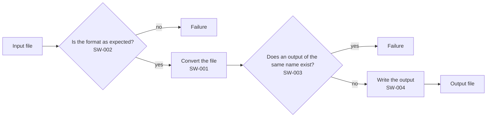
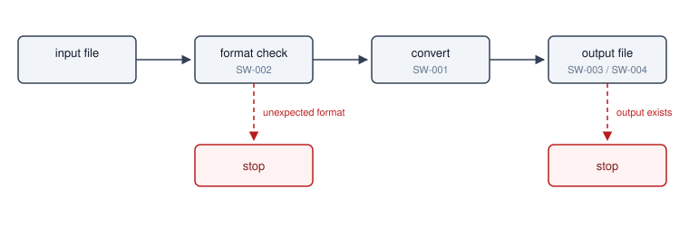

# Read this first

**Grammar**: basic.sgra
**UID**: DOC-GUIDE
**Version**: 1.0

This document tells a beginner and an AI how to write a specification with StrictDoc.
This whole set is written in `.md`.

System requirements, software requirements and test cases live in separate
files, and links join them together. A review result goes on the requirement
itself. You start your own specification by copying this whole set and
replacing what is inside.

This paragraph carries no UID. It is free text, not a requirement. StrictDoc
treats a requirement and free text as two different things. You may mix them.

A set that writes the same requirements in `.sdoc` sits in `samples/sd-basic-en/`.
The grammar file matches to the character, and `SYS-001` through `SW-004` and
`TC-001` through `TC-004` carry the same wording. That set is the smallest pair
for comparing notation, not a copy of this one - it leaves out `00-ai-guide.md`
and `01-ai-queries.md`. The one thing that set carries and this one cannot is
`05-markdown.sdoc`, the document that declares `MARKUP: Markdown`, and the single
requirement `SW-005` inside it. Choose between them like this.

| | `.md` | `.sdoc` |
| --- | --- | --- |
| GitHub and other sites render it as is | ○ | ✗ |
| You write a table without aligning the columns | ○ | only a document that declares `MARKUP: Markdown` |
| Several documents pull in one figure fragment | ✗ | ○ |
| RST math and image directives | ✗ | ○ |
| Traceability, JSON, every screen | ○ | ○ (exactly the same) |

`.md` support first appeared in 0.19.0 (2026-03-15), and the official
documentation still marks it experimental. For a document you maintain for a
long time, `.sdoc` sits on the safer side.

The files line up like this.

The numbers give the reading order. `00` and `01` address an AI, `02`
addresses a human, `03` to `07` hold the specification itself, and `08` to `10`
cover the review, the browser and working alongside an AI. The eleven `.md` files
here and the two under `_assets/` - thirteen in all - become StrictDoc documents.

- `00-ai-guide.md` — the guide you hand to an AI. It compresses this document
  down to the writing rules and the way to query the JSON. A human does not have
  to read it, but you can open it from the list on the left and see what is
  inside (this set does not hide the documents meant for an AI either)
- `01-ai-queries.md` — the detailed version of the above. A jq query collection.
  This one also addresses an AI
- `02-guide-for-human.md` — this document. The reading order and the writing rules
- `03-usecases.md` — 1 use case. How a user uses the tool, in the Cockburn form.
  The system requirements come out of it
- `04-upper.md` — 3 system requirements. What we build
- `05-architecture.md` — the system structure. The map of what we assemble, and how,
  to satisfy the system requirements. It holds no requirement
- `06-lower.md` — 4 software requirements. How we implement it. It links up to
  the system requirements
- `07-tests.md` — 4 test cases. They link to the software requirements
- `08-review.md` — how the review runs. A finding goes on the requirement itself
- `09-browser-guide.md` — how to create, edit and read a specification from the
  browser. A guide to the `strictdoc server` screens, with pictures
- `10-cowork-with-claude.md` — how to make Claude Code write, query and review a
  specification with the bundled `strictdoc-md` skill
- `basic.sgra` — the grammar definition every document shares
- `strictdoc_config.py` — the project configuration. StrictDoc reads it only
  directly under this folder
- `_assets/` — the place for attachments. It holds more than images. You can
  put a linked `.md`, an `.svg` figure, a `.csv` of source data and anything else
  there. StrictDoc copies them into the output as is
- `strictdoc-quirks.tsv` — a log where an AI adds one line for each StrictDoc
  quirk it hits. You read it when a version goes up or when the lines pile up,
  and you use it as material for fixing the guide. StrictDoc does not parse
  `.tsv`, so it does not touch the documents

## Basics

**Type**: SECTION

### Headings and fields

**Type**: SECTION

A `.md` file has only three outward shapes.

- An `#` heading - the document title. Put one in each file, always at the top
- A `##` or `###` heading - a chapter, or one requirement
- A `**Key**:` at the start of a line - a field

This is the smallest form there is.

```text
# Some specification

## Doing something

**UID**: REQ-001

**Statement**: The system shall do something.
```

StrictDoc treats the text you put right below a heading as an implicit `Statement`.
That turns the heading into a requirement node. Give every chapter that is not a
requirement an explicit type - otherwise StrictDoc fails to parse the file, because
the `UID` that the grammar requires is missing. Every chapter in this guide does that.

```text
## Basics

**Type**: SECTION

This becomes free text.
```

If you deepen the headings from `##` to `###`, the chapters nest, and the table of
contents nests with them. Look at the table of contents of this guide.

You write the settings for the whole document together, right below the H1. **StrictDoc
does not need the backslash at the end of a line.** Markdown viewers other than
StrictDoc would render each line as a separate paragraph, and this mark prevents that.

```text
# Read this first

**Grammar**: basic.sgra
**UID**: DOC-GUIDE
**Version**: 1.0
```

We move `Grammar` into an external file so that it stays the same across documents.
`01-ai-queries.md` and the two documents under `_assets/` declare no grammar and run on
StrictDoc's default; the other ten read the same `basic.sgra`. That file declares four
node types.

- `SECTION` - a chapter. You can nest it
- `REQUIREMENT` - a requirement. `UID` / `STATUS` / `TITLE` / `REVIEW_STATUS` /
  `STATEMENT` / `RATIONALE` / `REVIEW_COMMENT` / `REVIEW_ACTION`
- `USE_CASE` - a use case. `UID` / `TITLE` / `UC_LEVEL` / `REVIEW_STATUS` /
  `STATEMENT` / `REVIEW_COMMENT` / `REVIEW_ACTION`
- `TEST_CASE` - a test case. It carries the Gherkin words `GIVEN` / `WHEN` / `THEN`
  plus `TEST_RESULT` / `ISSUE_KEY` / `TEST_REMARK`. It carries no `STATEMENT`

`TEST_CASE` is not a standard StrictDoc concept. We added it in the grammar. The
same goes for the three `REVIEW_*` fields, which the standard `REQUIREMENT` does not
have - `08-review.md` shows you how to use them.
**Never add a field to a single document.** Each document would take a different shape,
and no one could tell where anything is. When you need a new field, add it to
`basic.sgra`.

**The `.md` format has four traps of its own. Each one stops the whole export.**

| Trap | What happens |
| --- | --- |
| The file has no H1 / starts with `##` / is empty | `the document must start with an H1 heading` |
| Two or more empty lines follow a heading | `two or more consecutive empty lines are not allowed` |
| A custom field spells its name differently from the grammar | `Invalid requirement field` |
| You write a `TYPE` field as `**Type**:` | StrictDoc reads it as the node type. Write `**TYPE**:` in capitals instead |

The third trap hides an asymmetry. Only the eight words `Statement` `Title` `Status`
`Rationale` `Comment` `Level` `Tags` `Prefix` ignore case. You spell everything else
exactly as the grammar spells it. `GIVEN` passes, but `Given` fails. You
simply have to remember this. When in doubt, write every custom field in all capitals.

### System requirements and software requirements

**Type**: SECTION

You write the link on the lower node. You put `Relations` on the lower node and
point it at the UID of the parent. You write nothing on the upper node.

```text
**Relations**:
- **Type**: `Parent`
  **ID**: `SYS-001`
```

The parent may live in another file. StrictDoc collects the UIDs of the whole
project into one table and only then resolves the relations, so file boundaries do not
matter. A mix of `.md` and `.sdoc` behaves the same way. This sample set really
does cross files.

```text
03-usecases.md            UC-001 (UserGoal)
                             |
04-upper.md   SYS-001     SYS-002     SYS-003
                 |           |           |
06-lower.md   SW-001      SW-002      SW-003 / SW-004
                 |           |           |
07-tests.md   TC-001      TC-002      TC-003 / TC-004
                 `-----------+-----------'
                             |
                          UC-001 (named again, as the acceptance check)
```

The root is the single `UC-001` and the leaves are the four tests. One thread runs from
the user's goal down to verification. The tests name `UC-001` a second time because the
same four cover the software requirements one for one while also tracing the main success
scenario and the three extensions of the use case.

A `Role` gives the relation a meaning. You can leave the type as `Parent`.

```text
**Relations**:
- **Type**: `Parent`
  **ID**: `SW-001`
  **Role**: `Verifies`
```

`07-tests.md` uses `Verifies`.
Declare a `Role` in the grammar before you use it. StrictDoc fails on any value you
have not declared.

You check the links on screen. Open `TRACEABILITY` or `DEEP TRACEABILITY` from the
VIEWS menu above the document, and StrictDoc lines up parents and children. Open the
traceability matrix from the toolbar on the left, and StrictDoc lists every
requirement that no test covers.

## Attachments

**Type**: SECTION

### Links

**Type**: SECTION

You can link to another `.md`. The destination is `_assets/note.md` →
[LINK: DOC-NOTE]

The destination only has to declare a UID directly under its heading.

```text
# Terminology map

**UID**: DOC-NOTE
```

**You do not write the output path.** StrictDoc resolves it from the UID. StrictDoc
also builds the link text automatically from the destination's title. You cannot
choose that text. The destination can be a requirement too, and you write it the
same way as `[LINK: SW-001]`. If you declare a UID on every heading, you can jump
into the middle of a document.

StrictDoc parses every `.md` in the project as a document, wherever it sits.
`_assets/` is no exception. That is why `_assets/note.md` also starts with a `#`
heading. **A single `.md` without a heading stops the whole export.** When a file
really cannot be a document, you name it in `exclude_doc_paths` in
`strictdoc_config.py` and leave it out.

**You write the exclusion file by file. Never exclude a whole folder.**

```python
exclude_doc_paths=["_assets/notes.md"]   # OK. It drops that one file only
exclude_doc_paths=["_assets/**"]         # Bad. It drops the images too
```

The second line drops the whole folder from the scan, so StrictDoc no longer
treats it as an asset folder and copies no images at all. The export still reports
success, and only the images in the finished HTML return 404. You will not notice
this easily.

### Figures

**Type**: SECTION

In `.md`, a Mermaid code fence becomes a figure as it is. This is the shortest
way to write one, and you do not move it out into a fragment file the way `.sdoc`
does.



You put image files in `_assets/` and embed them with ``. StrictDoc
copies this folder automatically, so you add nothing to the config. **Use SVG by
default, because it does not degrade when you zoom in.**



`.md` gives you no way to pull in a figure fragment. It has no counterpart to
`[DOCUMENT_FROM_FILE]` in `.sdoc`, and if you write one, StrictDoc prints it as plain
text. When you want to show the same figure in two places, send the reader with
`[LINK:]` to the document that holds it. If you really must expand a figure in the
body, make that one document a `.sdoc`
(`samples/sd-basic-en/00-guide-for-human.sdoc` takes that shape).

#### Do not put large figures in the body

**Type**: SECTION

The guideline is only this - once 5 or more things sit side by side in a figure, you
put that figure in `_assets/fig-*.md` as its own document and link to it from the
body with `[LINK:]`.

| Kind of figure | Guideline for moving it out |
| --- | --- |
| Sequence diagram | 5 lifelines or more |
| Class diagram | 5 classes or more |
| Flowchart | no guideline |

This is a guideline, not a gate. The writer makes the final call.

The flowchart above is a flowchart, so it carries no guideline, and the writer chose
to keep it in the body. The state machine that also draws the interruption and the
cleanup went into its own document →  [LINK: DOC-FIG-STATE]

We decide by how many things sit side by side because that is what sets the width of
a figure. Line count does not set it - inside this very sample, an 8-line flowchart
shrinks to 32 % of the body column while a 19-line state machine fits at 47 %
(measured). Every lifeline, and every class, widens a figure by one more column.

**Line count does not predict the cost of reading a figure either** - one figure
takes 17 lines for 114 tokens, and another takes 6 lines for 124 tokens.

Once you move a figure into its own document, it drops out of the "pull the
requirements" job completely. A query that lists the requirements never touches
that separate document, so the figure costs 0. You name the UID and fetch the figure
only when you need it. Moving it out does not make the figure itself any larger,
though: StrictDoc gives it the same column width either way (measured). What you buy
is an unbroken body, and nothing else.

There is one side effect. StrictDoc parses `_assets/*.md` as documents too, so they
line up in the document list. In this sample, `DOC-NOTE` and `DOC-FIG-STATE` are
those documents. The more figures you add, the longer the list grows. We start the
names with `fig-` so that you can spot the figures in the list.

**Never put them in `exclude_doc_paths` to hide them from the list.** The destination
disappears, so StrictDoc stops the export on the side that writes the `[LINK:]`.

```text
error: DocumentIndex: the inline link references an object with an UID that does not exist: DOC-FIG-STATE.
```

This does not break silently, but it gives you no way out either. We accept that
the figures line up in the list.

## Tables

**Type**: SECTION

**In `.md` you get pipe tables only. And a table passes even when you do not align the columns.**

| Table format | `.md` | When the columns get out of line |
| --- | --- | --- |
| Pipe | ○ | It holds |
| RST grid format | ✗ | — |
| RST simple format | ✗ | — |

The table above does not align its column widths, and it still passes. This is the
biggest advantage of `.md`. The grid format of `.sdoc` stops the whole export when
one column is off by one, and it counts columns by display width, not by
character count (one full-width character counts as 2 columns). In a document where
you keep adding rows by hand, that difference turns directly into a difference in
effort.

When you want a pipe table in `.sdoc`, you declare `MARKUP: Markdown`. You find an
example in `samples/sd-basic-en/05-markdown.sdoc`.

## Math

**Type**: SECTION

A `.md` file gives you only two ways to write math: `$` and `$$`. StrictDoc bundles
MathJax and loads it from `_static/mathjax/` in the output folder. **The page never
contacts an outside server**, so it still works on an internal company network.

| Notation | What you get | Where to use it |
| --- | --- | --- |
| `$ ... $` | It sits inside the sentence | One symbol, a short expression |
| `$$ ... $$` | It takes its own line and centers | An expression you want to show |
| RST's `.. math::` | You cannot use it | — |

RST notation does nothing in a `.md` file. If you write it, StrictDoc prints the
characters `.. math::` as a plain paragraph. The export does not stop, so **you cannot
notice the mistake until you look at the HTML.**

$$
S_{need} = S_{out} + S_{tmp} = 2 \times S_{out}
$$

We use the expression above in `06-lower.md`. To embed it in a sentence, you write it as
$S_{need}$ instead.

### Traps you hit with math

**Type**: SECTION

**The export stops when `$` is the last character of a paragraph or a table cell.**
We measured this on strictdoc 0.27.1. StrictDoc prints only this, and it prints
neither the file name nor the line number.

```text
error: string index out of range
```

Notation that stops the export, and notation that does not:

| Notation | Result |
| --- | --- |
| `The time is $T$` (a paragraph ends with math) | Stops |
| `The time is $T$ here.` (a character follows it) | Passes |
| `\| symbol \| $T$ \|` (a cell ends with math) | Stops |
| `\| symbol \| $T$ s \|` (a character follows it) | Passes |
| `\| symbol \| $$T$$ \|` (the cell uses `$$`) | Passes |
| `The cost is 100 $` (it ends with a bare `$`) | Stops |
| `The cost is 100 \$` (you escape it) | Passes |
| `` The cost is `100 $` `` (it sits inside a code span) | Passes |

You only need to remember one workaround — always put some character after the closing `$`.
Japanese sentences end with a period, so a writer follows this rule naturally.
**The one place where you cannot follow it is a table cell.**
When you use math inside a table, use `$$` or add a unit or a word after it.

One more thing. When a line holds two `$` characters, MathJax turns everything between
them into math. This trap is not limited to amounts of money.

| What you write | What you get |
| --- | --- |
| `The cost is $100 to $200` | MathJax turns "100 to " into math |
| `$HOME and $PATH` | MathJax turns "HOME and " into math |
| `The cost is $100 only` (one `$`) | It comes out as written |

You cannot prevent this by putting a space after the `$` (`$ 100 to $ 200` turns
into math too). Escape it as `\$100`, or put it in a code span as `` `$100` ``.
**The export does not stop, so look at the HTML with your own eyes whenever you write an
amount of money or an environment variable.**

LaTeX passes through unchanged inside `$$ ... $$`. StrictDoc hands the `\\` line
break, `aligned` and `pmatrix` to MathJax exactly as you wrote them, so you can build a
multi-line expression normally (measured). Outside math, Markdown collapses `\\` into a
single `\`, but that is just the normal Markdown escape.

## Code

**Type**: SECTION

A code fence passes through as written. You can name the language. But StrictDoc adds
no color.

```python
def convert(src: str, dst: str) -> None:
    tmp = dst + ".part"
    write(tmp, transform(read(src)))
    os.replace(tmp, dst)
```

The output HTML becomes `<code class="language-python">`, but StrictDoc carries no
syntax-highlighting machinery (we measured zero pygments spans).
If you need color, add something like highlight.js yourself alongside
`strictdoc-theme.css`.

Write the language name anyway. StrictDoc keeps the language name in the JSON as you
wrote it, so it stays the only clue that tells a later reader "this is Python".

**StrictDoc never interprets the contents of a fence.** The same holds for a Mermaid
fence: if you write `[LINK: SW-001]` inside it, StrictDoc prints the characters as they
are. Put the other way around, `$`, `|` and `**` do nothing inside a fence. When you
want a string to dodge the `$` trap for certain, put it inside a fence or a code span.

## Querying through JSON

**Type**: SECTION

Export the whole specification to JSON, then pull just the part you want with
`jq`. That is the whole of this chapter. Narrow the result after you export
the JSON.

**StrictDoc carries a query language of its own, but it does not reach the JSON.**
`--filter-nodes` narrows only the `.sdoc` and the HTML output; on `--formats=json`
it emits every node and raises neither an error nor a warning (measured on
0.27.1). So no road exists other than "export everything, then query it."
Narrowing is `jq`'s job.

### Exporting the full JSON

**Type**: SECTION

Three outputs exist. HTML is for a person to read, JSON is for a machine to
query, and the conversion to `.sdoc` is for switching notation.

```bash
strictdoc export --formats=json --output-dir out .
```

StrictDoc writes the JSON to `out/json/index.json`. Export it again every time
you edit a requirement. `--formats=json` takes no narrowing option. It always
emits everything.

You need no export just to read the HTML. Drag this folder onto
`launch-strictdoc.bat` and the server starts; edit a file and save it, and the
screen picks the change up in about 0.6 seconds. The next chapter collects what
you need for switching notation.

`strictdoc_config.py` is the one exception. Restart the server after you edit
it. StrictDoc reads this file only once, at startup.

| What you changed | Restart the server |
| --- | --- |
| A `.md` document | No. The screen changes in about 0.6 seconds |
| The `basic.sgra` grammar | No |
| `strictdoc_config.py` | Yes |

This produces a symptom you barely notice. You fixed the configuration, yet
the screen still shows the old state, so you conclude that you wrote the
configuration wrong. The server keeps writing HTML from the old configuration,
so `output/` stays old too. We hit this ourselves: when we changed the
configuration of this set to show the 2 documents meant for an AI, the 2 documents
stayed out of sight until we stopped the server.

### Querying with jq

**Type**: SECTION

`jq` is a small command that handles JSON and nothing else. It has no
connection to StrictDoc, and `setup-strictdoc.bat` installs it by default. `jq`
reads the JSON and emits only what matches the condition you write.

```bash
jq -r -f q-open-findings.jq out/json/index.json
```

To list the findings that nobody has acted on yet, `q-open-findings.jq` holds this.

```text
.DOCUMENTS[] | recurse(.NODES[]?)
| select(.REVIEW_STATUS == "Open")
| .UID + "  " + .TITLE
```

The leading `.` means "the input itself." From there `.name` descends and `[]`
breaks an array apart. `.DOCUMENTS[]` means "each item of `DOCUMENTS` in the
input." The `.` is not an option but the filter itself, and it sits in the middle
of `jq [options] <filter> [file]`.

`REVIEW_STATUS` is a field the grammar added to `REQUIREMENT`. `08-review.md`
gives the meaning of each state and lists the values. When you want to filter by
node type instead, the key is `_NODE_TYPE`, and the leading underscore makes it
easy to mistype. Run the filter against this set and it prints this.

```text
SYS-003  Protecting an existing file
```

Run the same filter against the JSON from `samples/sd-basic-en/` and not one
character of the output changes. That is the proof of "either form produces the
same JSON."

You write the filter in a file instead of passing it as a string because of
PowerShell. PowerShell drops the double quotes inside a quoted string, which
breaks the form that writes the filter straight into the argument. `-f` behaves
the same in every shell.

Type `chcp 65001` first when you pass Japanese through cmd.exe. Left on the
default cp932, `jq -r --arg kw 変換 -f ...` returns **zero results and no error.**
PowerShell needs none of this.

`docs/03-sdoc-json-queries.md` holds 7 worked examples of queries.

### Taking the answer as JSON

**Type**: SECTION

Leave `-r` off and the answer comes out as JSON. The example above added `-r`
to build lines a person can read. Leave it off when you feed a program.

```bash
jq -f q-findings-json.jq out/json/index.json
```

```text
[ .DOCUMENTS[] | recurse(.NODES[]?)
  | select(.REVIEW_STATUS? and .REVIEW_STATUS != "NoFinding" and .REVIEW_STATUS != "NotReviewed") ]
| map({UID, REVIEW_STATUS, TITLE})
```

```json
[
  {
    "UID": "SYS-002",
    "REVIEW_STATUS": "Fixed",
    "TITLE": "Rejecting unexpected input"
  },
  {
    "UID": "SYS-003",
    "REVIEW_STATUS": "Open",
    "TITLE": "Protecting an existing file"
  },
  {
    "UID": "SW-004",
    "REVIEW_STATUS": "WontFix",
    "TITLE": "Atomic writing"
  }
]
```

The outer `[ ... ]` gathers the results, which arrive one at a time, into a
single array. Without it jq only stacks JSON values one under another and builds
no array. `map({UID, REVIEW_STATUS, TITLE})` keeps just the fields you
want; drop the whole `| map(...)` line when you want every field.

### Non-ASCII characters

**Type**: SECTION

Inside `index.json` StrictDoc turns every non-ASCII character into `\uXXXX`.
A Japanese title reads like this in the file.

```text
"TITLE": "\u307e\u305a\u3053\u308c\u3092\u8aad\u3080",
```

StrictDoc calls `json.dumps(..., indent=4)` as it is, and Python escapes every
non-ASCII character by default. StrictDoc offers no setting and no option that
changes this.

**You never see this while you query with `jq`.** jq restores the original
characters as it reads, so every output example above comes out readable. It
matters only when you hand the JSON file itself to a person or to a machine. One
pass through jq fixes that case.

```bash
jq . out/json/index.json > readable.json
```

`.` narrows nothing, so not one character of the content changes. Only the
notation changes, and the file gets smaller.

| File | vs the `.md` set |
|---|---:|
| `index.json` (as written) | about 1.8 times |
| after `jq .` | about 1.5 times |
| after `jq -c .` | about 1.2 times |

We give ratios because a byte count moves with the line ending, CRLF or LF, so a
reader cannot reproduce it. A ratio barely feels that difference.

A Japanese character such as `検` drops from 6 bytes back to the 3 bytes of UTF-8,
and the indent drops from 4 spaces to 2. `-c` strips the indent and the newlines
themselves.

**Never write this file out from PowerShell.** PowerShell's `>` writes UTF-16, so
you end up with a file that jq cannot read. Type the command in cmd.exe, or use
the form `cmd /c 'jq . out/json/index.json > readable.json'`.

**Never explain JSON as "the lightweight option."** As the table above shows, even
the tightest form runs larger than the original `.md` set. The value lies not in
the size but in pulling out the answer alone without reading the whole text.

## Moving between .md and .sdoc

**Type**: SECTION

StrictDoc converts a `.md` document to `.sdoc` with `--formats=sdoc`. The reverse
direction is `--formats=markdown`.

```bash
strictdoc export --formats=sdoc --output-dir out .
```

**`strictdoc convert` does not do this.** That command handles Excel and ReqIF
only, and it does not accept `.md`.

Create the document as `.md` and you get Markdown notation from the browser
editor alone. No way exists to switch a document you created as `.sdoc` over to
Markdown from the browser, so this is one practical reason to choose `.md`.

You need to know 3 things about the conversion.

1. StrictDoc adds `OPTIONS: MARKUP: Markdown` for you. This keeps StrictDoc
   reading the body as Markdown. If you want RST instead, delete that line
   yourself and then rewrite the body.
2. A `METADATA:` block appears. The `UID` and `Version` you wrote right under
   the H1 show up both in the `[DOCUMENT]` fields and in `METADATA:`. You lose no
   value, but the same thing appears in 2 places, so you may delete one by hand
   after the conversion.
3. Watch out for `Wrong field order`. The fields of a node line up in a fixed
   order, and StrictDoc fails if your grammar does not declare them in that order.

The order runs like this.

```text
UID → STATUS → TITLE → your single-line custom fields → STATEMENT
    → the remaining multi-line fields such as RATIONALE
```

`basic.sgra` declares its fields in this order. Break the order and the export
stops on the spot. Keep this order when you write a grammar of your own.

**This set does not make the round trip to `.sdoc`, though** (measured on
0.27.1). `--formats=sdoc` writes all 9 documents out, but reading that output back
stops for two reasons, and neither one has anything to do with the declaration
order.

- The `.sgra` does not travel with the output. The generated `.sdoc` names
  `basic.sgra`, and nothing copies that file into the output folder. You copy it
  in yourself.
- A document that quotes `[LINK: UID]` as an example turns that quotation into a
  live link. `00-ai-guide.md` shows the syntax that way in a table. In `.md` the
  text stays inert; in the generated `.sdoc` StrictDoc resolves it and stops with
  `the inline link references an object with an UID that does not exist: UID`.
  A real link such as `[LINK: DOC-FIG-STATE]` survives the conversion intact -
  we removed that one quotation, copied the grammar in, and the read-back passed.

Keep the `.md` as the master copy whenever you need a round trip.
