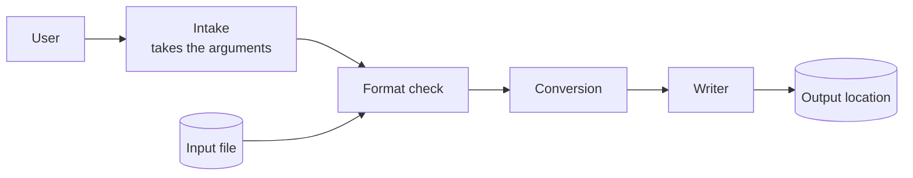
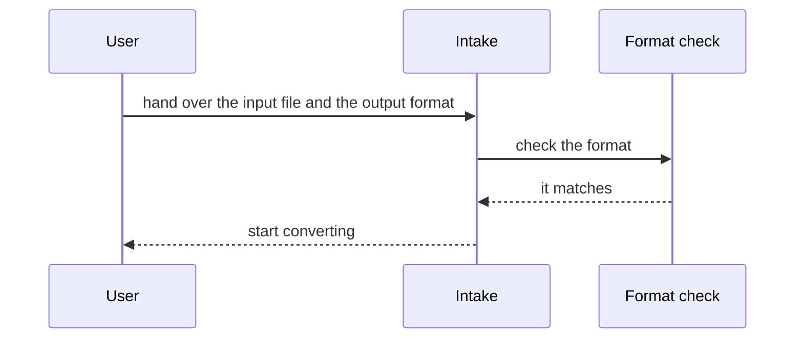

# System structure

**Grammar**: basic.sgra
**UID**: DOC-ARCH
**Version**: 1.0

This document is not a requirement. It shows, in one diagram, what we assemble and
how in order to satisfy the three system requirements that `04-upper.md` just laid
out. **This document adds no requirement of its own.**

The diagram shows structure. It says how many parts there are and which one calls
which. The same set also holds a diagram of the processing flow, and that is a
different thing - how execution moves from top to bottom lives in "The map of the
implementation" in `06-lower.md`. Structure changes rarely, flow changes often.
Settle the structure first and a change to the flow will not break the link back to
the requirements.

## The parts

**Type**: SECTION

The four parts inside the diagram are the tool itself. The user, the input file and
the output location sit outside it. The tool cannot decide anything that sits
outside, which is why every system requirement takes the shape of "how we handle
what is outside".

## How the parts talk to each other

**Type**: SECTION

The figure above says what exists. The figure below says the order of the calls, up
to the point where the conversion starts.

The figure has 3 lifelines, which is under the guideline of 5, so we keep it in the
body ("Figures - a large figure goes into its own document").

## Which part satisfies which requirement

**Type**: SECTION

| Part | What it takes on | System requirement it satisfies |
|---|---|---|
| Intake | Takes the input file and the requested output format | SYS-001 |
| Format check | Confirms the input really is the format the user named | SYS-002 |
| Conversion | Converts into the output format the user named | SYS-001 |
| Writer | Writes to the output location. Breaks nothing that is already there | SYS-001 / SYS-003 |

One part does not map onto one requirement. Intake, Conversion and Writer share
SYS-001 between the three of them, and Writer takes on SYS-003 as well. Format
check, the other way round, takes on SYS-002 alone. **Requirements and structure
are two different axes; neither the counts nor the mapping line up.**

## Why this document carries no UID

**Type**: SECTION

We give the parts no UID. This set exists to show the smallest thing that still
holds together as a requirements specification, and making the design a target of
tracing would add one more layer. **This document is a map for the reader, not
something a machine queries.**

Once you do want to trace the design, add a node type for a part to the grammar and
draw a `Parent` from each part to the requirement it satisfies. You may add as many
node types and fields as you like - the grammar chapter of `02-guide-for-human.md`
tells you how.
