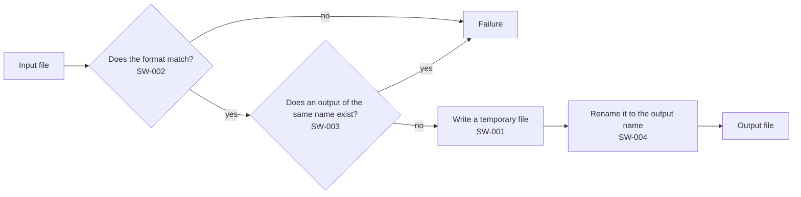

# Software requirements

**Grammar**: basic.sgra \
**UID**: DOC-LOWER \
**Version**: 1.0

This document states how we implement each requirement in `04-upper.md`.

The lower level carries the link. You put `**Relations**:` on the software
requirement and point it at the UID of the parent. You write nothing on the system
requirement. **Never list the children on the parent** - every new software
requirement would force you to touch the parent, and you would maintain the link twice.

The parent may live in another file. StrictDoc collects every UID in the
project into a single table and resolves the relations afterward, so a file
boundary changes nothing. A mix of `.md` and `.sdoc` behaves the same way.

## Running the conversion

**UID**: SW-001 \
**STATUS**: Approved \
**REVIEW_STATUS**: NoFinding

**Statement**: The tool shall read the input file, convert it into the output format the user specifies, and write the result to the output file.

**Relations**:
- **Type**: `Parent` \
  **ID**: `SYS-001`

## Checking the input format

**UID**: SW-002 \
**STATUS**: Approved \
**REVIEW_STATUS**: NoFinding

**Statement**: IF the format of the input file differs from the format the user specifies, THEN the tool shall skip the conversion and exit with an error.

**Relations**:
- **Type**: `Parent` \
  **ID**: `SYS-002`

## Checking the destination

**UID**: SW-003 \
**STATUS**: Approved \
**REVIEW_STATUS**: NotReviewed

**Statement**: IF a file of the same name already sits at the destination, THEN the tool shall skip the write and exit with an error.

**Relations**:
- **Type**: `Parent` \
  **ID**: `SYS-003`

## Atomic writing

**UID**: SW-004 \
**STATUS**: Draft \
**REVIEW_STATUS**: WontFix

**Statement**: IF an interruption stops the write partway, THEN the tool shall not leave an incomplete file at the destination.

**Rationale**: If an incomplete file from an interruption stays on disk, SW-003 counts it as an existing file on the next run and stops the tool. The user then sees an error exit with no visible cause.

**Relations**:
- **Type**: `Parent` \
  **ID**: `SYS-003`

**REVIEW_COMMENT**: Nobody decided where the temporary file goes. A rename stops being atomic once the two paths sit on different drives.

**REVIEW_ACTION**: This set is a worked example of how to write, and it leaves implementation detail out. Decide this point in a real specification.

## How the pieces fit together

**Type**: SECTION

This chapter holds no requirement. A figure, math and code fill in how the four
requirements above join into a single run. A `.md` specification takes all
three directly in the body text.

Material that does not fit in the body goes into `_assets/`, and you link to it
from the body. **It does not have to be an image** - StrictDoc copies everything
under `_assets/` into the output as is, whatever the type. We list the format
combinations the tool supports in [the list of supported formats](_assets/formats.csv).

We keep the figure in the body. A flowchart carries no guideline, so the writer
decides where it goes ("Figures - a large figure goes into its own document").



We moved the large figure, which also covers the interruption and the cleanup, into its own document → [LINK: DOC-FIG-STATE]

You write math directly in the body as well. The tool works through a temporary
file, so the free space a conversion needs, $S_{need}$, is not the size of the
output on its own. It comes out as follows.

$$
S_{need} = S_{out} + S_{tmp} = 2 \times S_{out}
$$

The temporary file and the output file exist side by side until the replacement finishes, so the coefficient comes out to $2$.

The table below gives the meaning of each symbol in the formula. Always put a
character after you close the math in a cell - export stops when a cell ends
with `$`. Escape a `|` inside a cell as `\|`.

| Symbol | Unit | Meaning |
|---|---|---|
| $S_{need}$ bytes | bytes | Free space the conversion needs |
| $S_{out}$ bytes | bytes | Size of the output file |
| $S_{tmp}$ bytes | bytes | Size of the temporary file. It equals $S_{out}$ bytes |
| Path | - | The three stages `input \| convert \| output` |

Only one way of writing satisfies SW-004. You create the temporary file in the
same directory, and you rename it once you finish the write. A rename inside one
directory happens indivisibly.

```python
def convert(src: str, dst: str) -> None:
    tmp = dst + ".part"          # create it in the same directory as dst
    try:
        write(tmp, transform(read(src)))
        os.replace(tmp, dst)     # dst exists only once we reach this line
    except BaseException:
        os.unlink(tmp)           # an interruption leaves no temporary file
        raise
```

**Always write the language name (`python`).** The HTML output shows no color, but
the JSON keeps the language name, and that name gives a later reader the only clue
to what kind of code this is.
