# Driving StrictDoc from the browser

**Grammar**: basic.sgra \
**UID**: DOC-BROWSER \
**Version**: 1.0

This document tells you how to create, edit and read a specification from StrictDoc's
own screens. Every other document assumes you open the `.md` in an editor, but StrictDoc
carries a server of its own and handles the same specification from a browser.

The pink arrows and numbers in the pictures follow the order the text explains. Some
pictures show the order to press things in; others are only labels pointing at a part of
the screen.

Writing itself - the notation for a table or a figure - belongs to
`02-guide-for-human.md`. This document covers only what differs when you type that
notation into a form field in the browser. Write the same thing in two places and fixing
one leaves the other rotten.

How to make an AI write or review for you is in `10-cowork-with-claude.md`.

## Before you read on

**Type**: SECTION

### Editing in the browser needs the server

**Type**: SECTION

The HTML that `strictdoc export` produces carries no edit button. That output is for
reading. The only screens you can edit are the ones `strictdoc server` serves.

The easiest way is to drag the specification folder onto `launch-strictdoc.bat` and drop
it. The launcher starts the server and opens the browser for you.

To type the command yourself:

```text
strictdoc server <specification folder> --output-path <specification folder>/output/strictdoc
```

Once it starts, open `http://127.0.0.1:5111/` in a browser. To stop it, press `Ctrl` +
`C` in the window you started it from.

**Name the first level of the output path `output`.** StrictDoc leaves a folder of that
name out of its document search, which stops a second run from reading its own output
back. That is a rule of the server. Where `strictdoc export` writes is a separate matter,
covered in "Step 1 - Convert to JSON" of `00-ai-guide.md`.

The server reads the files at startup and holds them in memory. Start it with `--watch`
and it watches for changes and refreshes the screen, so what you fix in an editor shows
up as well. `launch-strictdoc.bat` always starts it with `--watch`. **When you type the
command yourself and leave `--watch` off, always restart the server after editing in an
editor** - saving from the browser while the server still holds the old content writes
that old content back to the file.

### Saving rewrites the whole file

**Type**: SECTION

Saving in the browser is not confined to the screen. StrictDoc rewrites the `.md` file
itself. **And it rewrites not just the requirement you edited but the whole document, in
its own standard style.**

Adding one sentence to `SYS-001` in `04-upper.md` produced a diff of 11 added lines and
4 removed ones (measured on strictdoc 0.27.1, twice, with the same result).

| What happened | How far it reached |
| --- | --- |
| StrictDoc added `**Type**: REQUIREMENT \` | Not only the edited `SYS-001` but `SYS-002` and `SYS-003` too |
| StrictDoc changed `**STATUS**:` into `**Status**:` | Every requirement in that document |
| StrictDoc opened `**Statement**: text` out into 3 lines | The edited requirement only |

No other file changes. StrictDoc rewrites only the document that holds the requirement
you edited.

That settles when to use which.

- Edit a specification whose style you keep yourself from the browser and the diff grows.
  A one-sentence fix looks like a 15-line change in review
- The other way round, if you want the style brought into StrictDoc's standard, one save
  from the browser does it
- Split the first save into its own commit. Mix a normalisation-only commit with one that
  changes content and the reviewer cannot tell where to look

## The map of the screen

**Type**: SECTION

Look at where things are first. Each button is explained in the chapter that uses it.

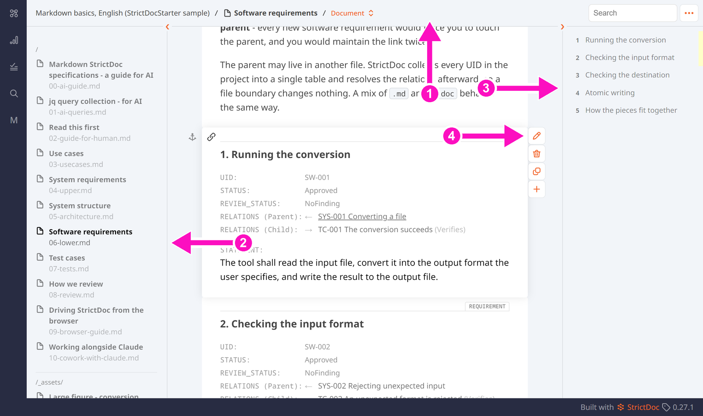

1. The header - breadcrumbs on the left, search and `...` (actions on the whole document)
   on the right
2. The document tree on the left - every document in this project. Grab the edge to
   change its width
3. The table of contents on the right - the headings of the document you have open
4. The buttons beside a requirement - they appear only while the mouse is over it.
   "Editing, deleting and duplicating a requirement" explains them

The narrow strip at the far left is the way into the project-wide screens. From the top:
index, statistics, traceability matrix, search, tree map. "Looking at the whole project"
covers them.

## Creating a document

**Type**: SECTION

**You cannot create the project itself from the browser.** Prepare the folder and
`strictdoc_config.py` first. What the browser can create is a document inside a project
that already exists.

Open the project index and press the `...` at the top right.

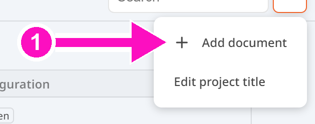

Two fields appear.

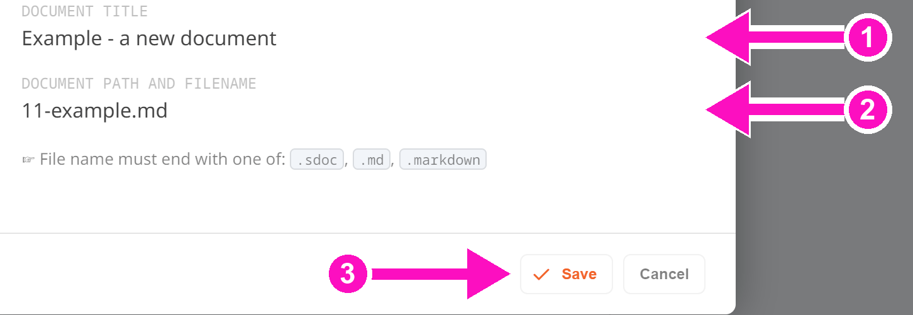

1. Title - it becomes the H1 of the document. This is the text the list shows
2. File name - the path relative to the project folder. Write the extension too, as in
   `11-example.md`. The numbers start at `00` by convention, so to add one at the end,
   use the number after the largest that exists. In this set
   `10-cowork-with-claude.md` is the largest, so the next is `11`
3. Press Save and the file is born on the spot

**The document you get carries no grammar.** The single `**Grammar**: basic.sgra` line
can only be added in an editor - there is no way to name the grammar to import from the
browser ("Editing the document settings and the grammar"). Forget it and neither
`TEST_CASE` nor `REVIEW_STATUS` works.

## Adding a requirement

**Type**: SECTION

A requirement goes above or below a node that already exists. Put the mouse over the node
you want to start from and press the `+` at the bottom. **A document you just created
holds no node to start from.** Write the first one in an editor, or start by adding to a
document that already exists.

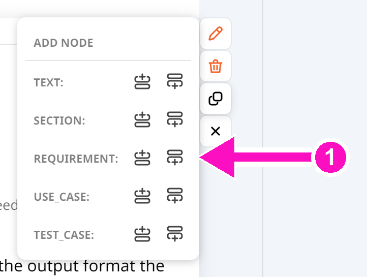

Type runs down the menu, position runs across. The grammar of this set offers five types.

| Type | What it is for |
| --- | --- |
| `TEXT` | Free text, carrying no UID |
| `SECTION` | A chapter heading |
| `REQUIREMENT` | A requirement |
| `USE_CASE` | A use case. A type `basic.sgra` added |
| `TEST_CASE` | A test case. A type `basic.sgra` added |

`TEST_CASE` appears because this set carries `basic.sgra`. A document with no grammar
offers only `TEXT`, `SECTION` and `REQUIREMENT`.

Choosing one opens an empty form.

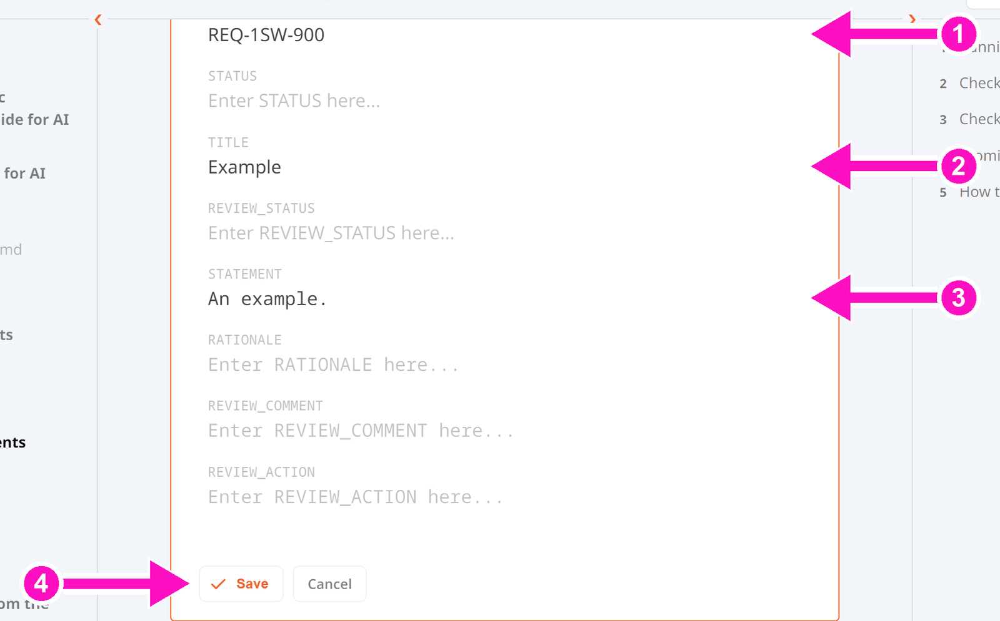

1. UID - give it one if you will look the node up by name later. It must not repeat
   anywhere in the project (a duplicate stops the export itself)
2. TITLE - it becomes the heading
3. STATEMENT - the body
4. Save commits it. `Cancel` beside it throws away what you typed

## Editing, deleting and duplicating a requirement

**Type**: SECTION

### The four buttons

**Type**: SECTION

Put the mouse over a requirement and four buttons appear on its right. They do not appear
until you do, so when you cannot find them, suspect where the mouse is.

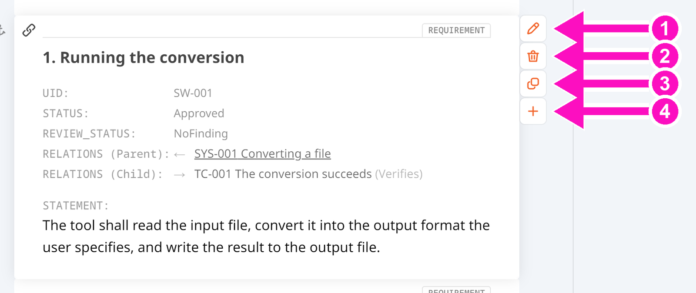

1. Pencil - edit
2. Bin - delete. No confirmation appears
3. Stacked squares - duplicate. It creates a node with the same content right below. The
   UID comes out empty, so set it yourself
4. Plus - add ("Adding a requirement")

### Editing and saving

**Type**: SECTION

Press the pencil and the requirement turns into a form. `UID`, `STATUS`, `TITLE`,
`REVIEW_STATUS`, `STATEMENT`, `RATIONALE`, `REVIEW_COMMENT` and `REVIEW_ACTION` line up
vertically, each one a field you type into directly. `REVIEW_STATUS` is a dropdown, and
it is required (`08-review.md`).

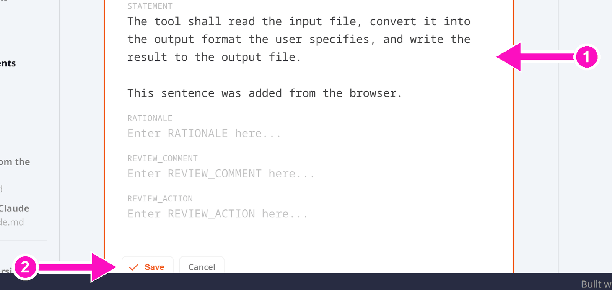

1. Add one line to the end of STATEMENT. Put one empty line in first, then type. The
   empty line is there because Markdown separates paragraphs with one. Break the line
   without it and the text continues the previous sentence
2. Press Save

Saving closes the form and the sentence you added lands in the body.

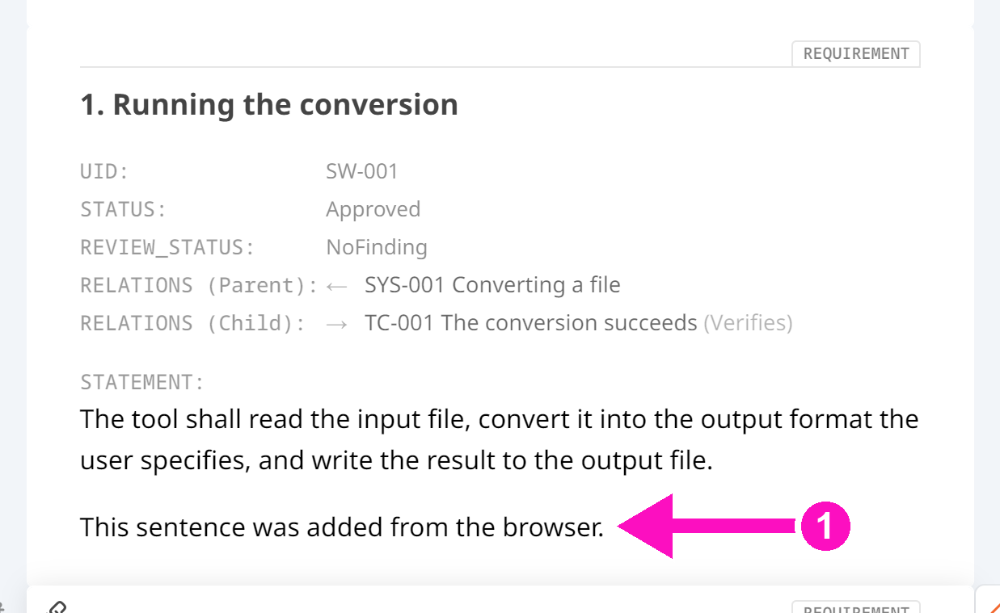

**Do not stop at what the screen shows.** As "Before you read on" said, StrictDoc is
rewriting the whole file at the same time.

## Linking a requirement to its parent

**Type**: SECTION

Relations live behind the `Relations` tab of the form. **You write the parent on the
child.** You write nothing on the parent - otherwise every new child means touching the
parent, and the two drift apart.

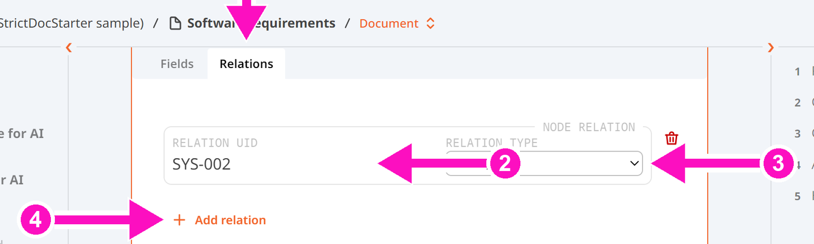

1. Press the `Relations` tab
2. Enter the other UID. Candidates appear as you start typing
3. Choose the type. `Parent` names a parent, `Child` a child
4. `Add relation` adds a row. The button on the right of a row removes it

After saving, the relations line up at the head of the requirement.

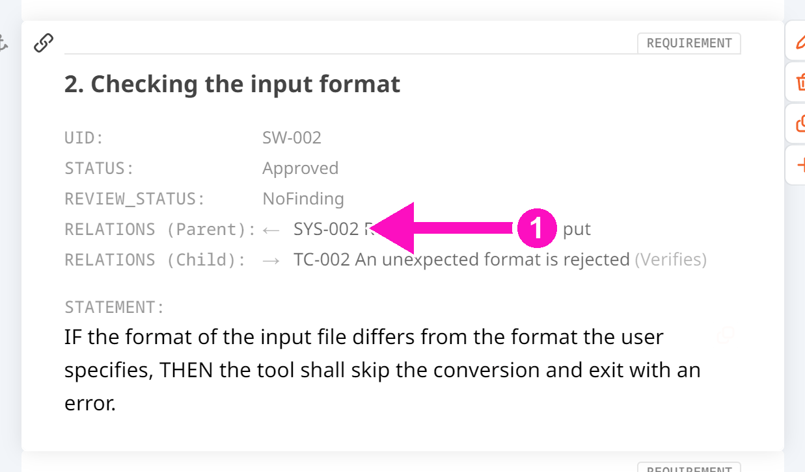

The parent may live in another file. StrictDoc collects the UIDs of the whole project
into one table and only then resolves the relations, so file boundaries do not matter.

**Naming a UID that does not exist stops the export.** A typo tells you nothing at the
time; the next export tells you.

**A `Role` such as `Verifies` is not available in the default grammar.** It needs a
grammar file like `basic.sgra`.

## What the form fields do - tables and Mermaid

**Type**: SECTION

A form field takes Markdown as it stands. There is no button that builds a table and none
that draws a figure. You type the notation `02-guide-for-human.md` teaches, as text.

There is no preview. While you type you see plain Markdown, and the result only appears
after you save.

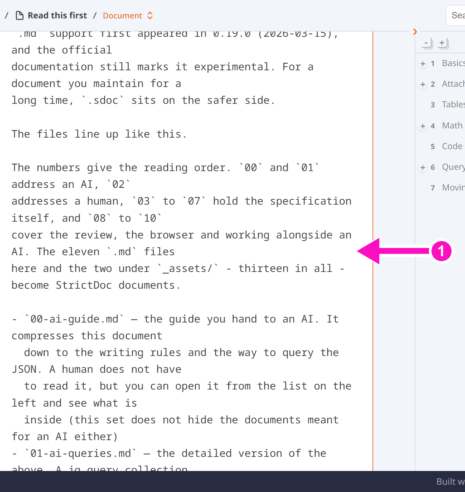

Saving turns it into a table.

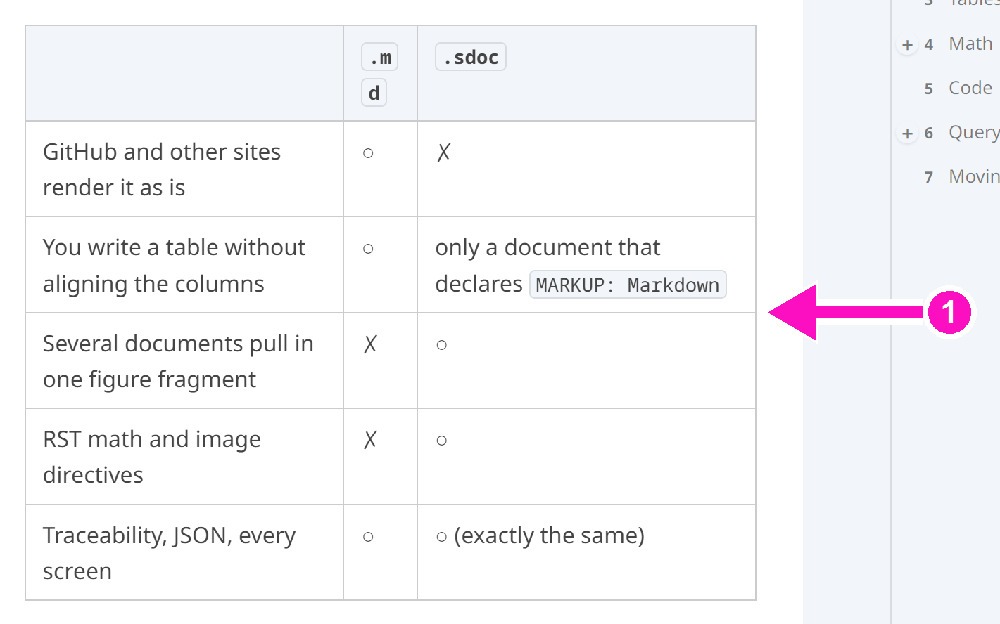

**A code span does not protect a pipe inside a cell.** Escape it as `\|`. This holds
whether you type it in the browser or write it in an editor.

Mermaid works the same way: you type the text wrapped in ```` ```mermaid ````. The
browser draws the figure. StrictDoc only hands the text over.

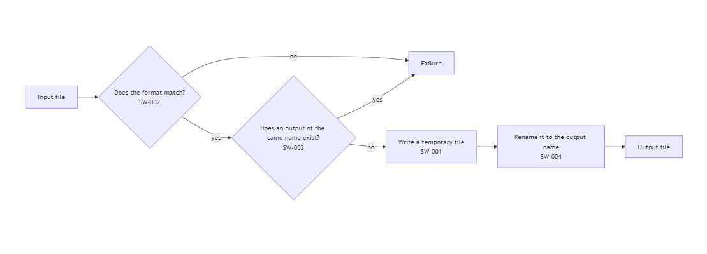

The rule for how large a figure may be before it leaves the body is in
`02-guide-for-human.md`.

## Figures and attachments - the one thing the browser cannot finish

**Type**: SECTION

**StrictDoc's screens carry no way to upload a file.** Neither an image nor an attachment
can be added from the browser (the only file the 0.27.1 web server accepts is a ReqIF
import. Confirmed by reading the source).

So the procedure goes like this.

1. Put the file in `_assets/`. This part happens on disk. Explorer or an editor, either
   is fine
2. Type `` into the form field, as text
3. Save

**StrictDoc copies nothing that sits outside `_assets/`.** It shows on screen, but the
HTML that `strictdoc export` produces returns 404. This is not limited to images; a
`.csv` and a `.md` behave the same way.

The server reads the folder at startup. Without `--watch`, a new file stays invisible
until you restart the server after putting it there.

## Four views onto one document

**Type**: SECTION

Press `Document` in the header breadcrumbs to choose how the same document is shown.

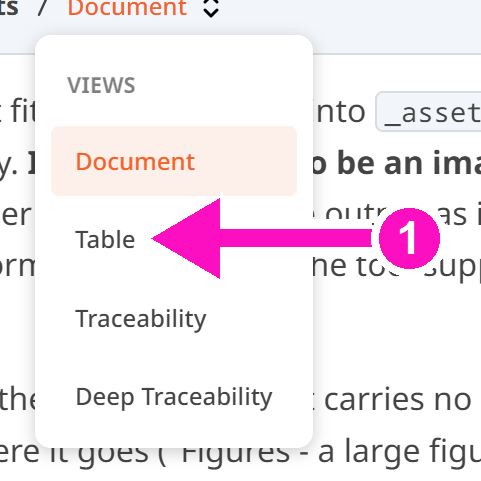

| View | What you see |
| --- | --- |
| Document | The default. The form you read a specification in |
| Table | One requirement per row. Fast for counting and for finding gaps |
| Traceability | Two columns. A requirement, and whatever connects to it |
| Deep Traceability | The same, but it follows the connections through any number of levels |

`Table` is the list of requirements.

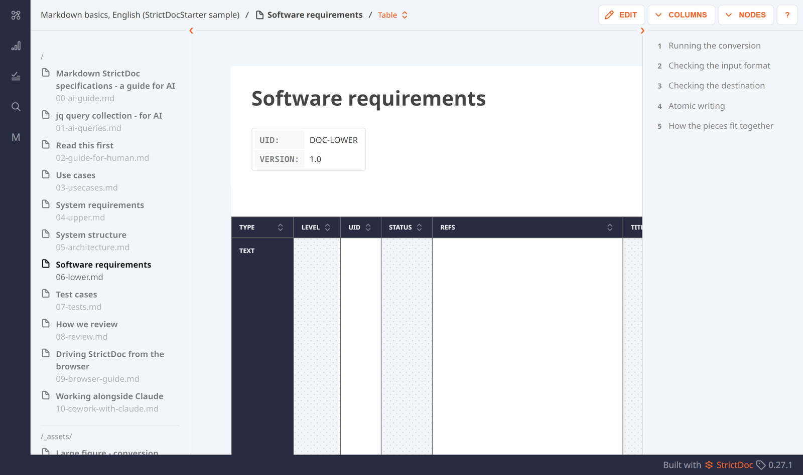

`Traceability` lays out what a requirement connects to, side by side.

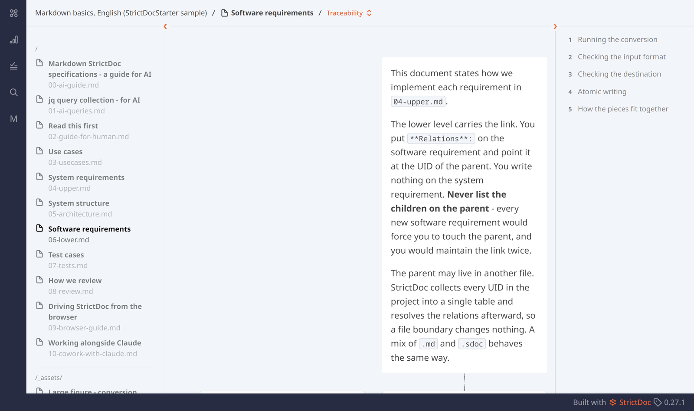

These views only mean something once the relations of "Linking a requirement to its
parent" exist. In a specification with no relation written at all, the right-hand side
just lines up empty.

## Choosing columns in the table view

**Type**: SECTION

The `Table` view grows wider the more fields the grammar adds. With everything shown, the
table was 3078 px wide against a 1280 px window (measured on 0.27.1). `COLUMNS`, at the
right of the header, is the button that keeps only the columns you want.

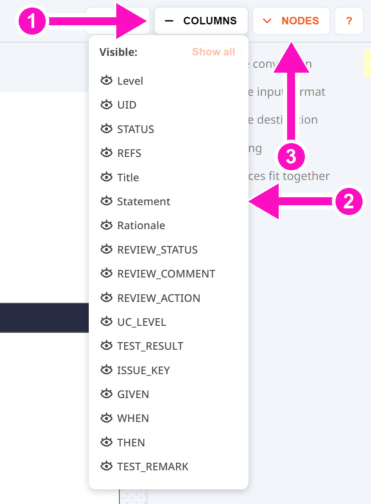

1. `COLUMNS` - press it and StrictDoc opens the list of columns
2. A column name - press it and that column disappears. Press it again and it comes back
3. `NODES` - this one narrows the rows instead. This document offers `TEXT`,
   `REQUIREMENT` and `SECTION`

`Show all`, at the top right of the list, brings every hidden column back. While columns
are hidden, the button reads something like `COLUMNS - 10 hidden`.

The columns in the list come from three places.

| Where it comes from | Column |
| --- | --- |
| Never in the list. Always first | `Type` |
| The built-in fields | `Level` `UID` `STATUS` `REFS` `Title` `Statement` `Rationale` |
| The fields the grammar added | Whatever `basic.sgra` defined, such as `REVIEW_STATUS`, follows |

The `Type` column alone cannot be hidden. It does not appear in the list either.

Press the small up-down mark inside a heading and StrictDoc sorts by that column. The
first press sorts ascending, the second descending. Pressing the text of the heading does
nothing. The mark is what you press.

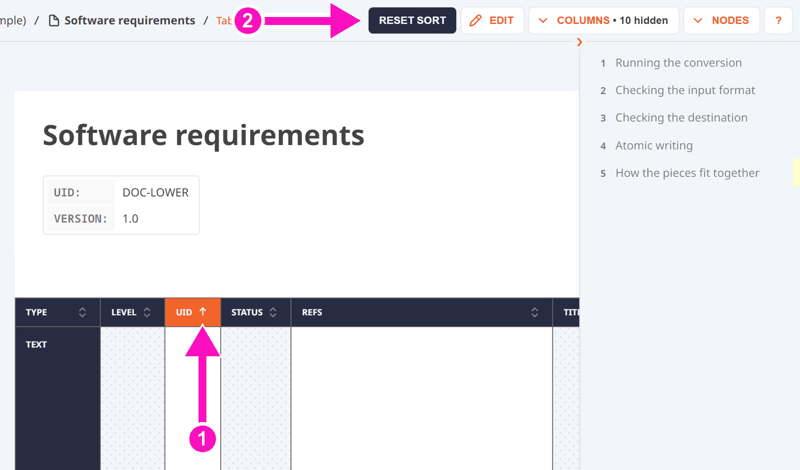

1. The sort mark - the sorted column turns orange and the mark shows the direction
2. `RESET SORT` - back to the original order. The button does not appear until you sort

StrictDoc remembers the hidden columns per document. Go to another document and come
back and they stay hidden; close the browser and they survive. The `.md` file does not
change. This is only about what you see.

## Looking at the whole project

**Type**: SECTION

These sit in the narrow strip at the far left.

The traceability matrix lays out system requirements, software requirements and tests on
one sheet. It is the screen for finding what is not connected.

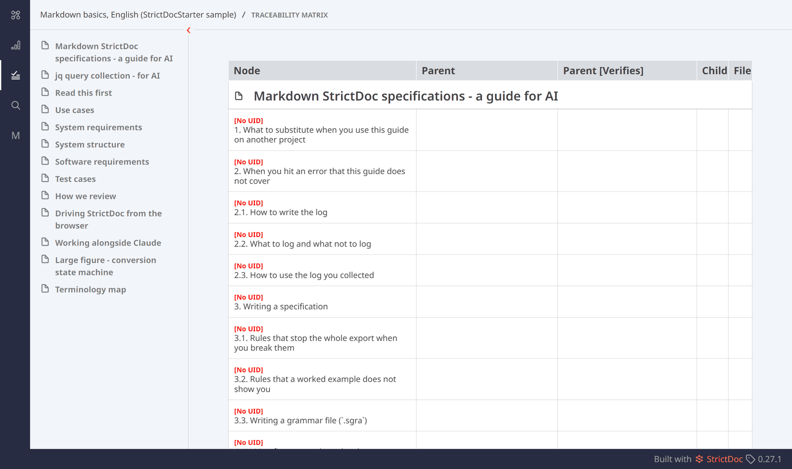

The tree map shows the size of a document as an area. It tells you where you have written
too much.

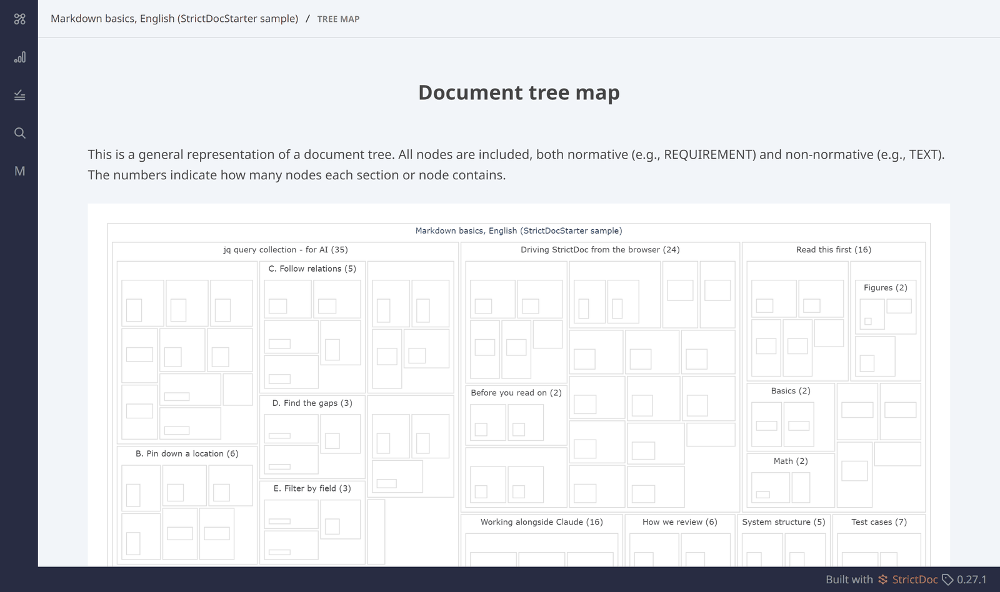

Statistics: the number of requirements, the share that carries a UID, the breakdown of
states.

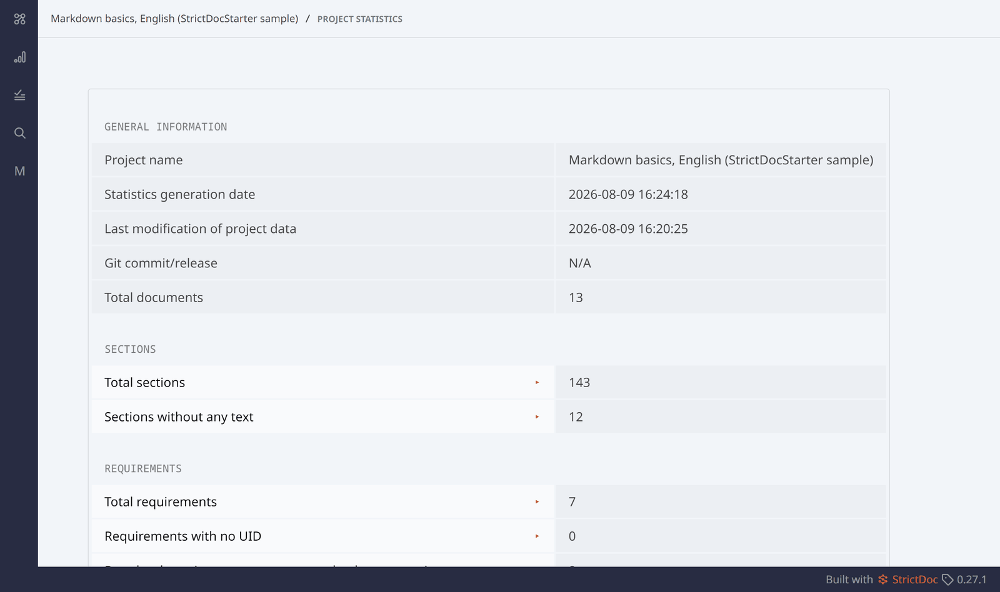

Search looks across the whole project. It uses StrictDoc's own query language.

Pulling the JSON with `jq` is faster and cheaper than counting on this screen.
`01-ai-queries.md` shows how. The screens are for a human to look at; they do not suit
counting or building a list.

## Folding the side panels

**Type**: SECTION

Both the document tree on the left and the table of contents on the right fold away. On a
screen that spreads sideways, such as the table or Deep Traceability, folding alone took
the body from 710 px to 1192 px (measured in a 1280 px window).

The fold button is the small `<` in the corner of the panel.

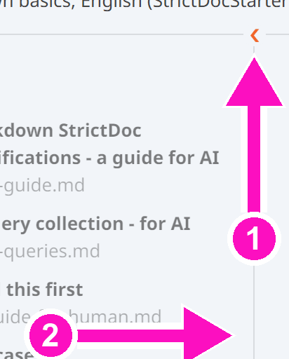

1. The `<` mark - press it and StrictDoc folds the panel. The mark turns into `>` and
   stays at the edge of the screen, so pressing it again opens the panel
2. The edge of the panel - grab it and pull left or right to change the width. Use this
   when you want to narrow a panel without folding it

The table of contents on the right works the same way, with the same two things mirrored.

Fold both and only the narrow strip at the far left remains.

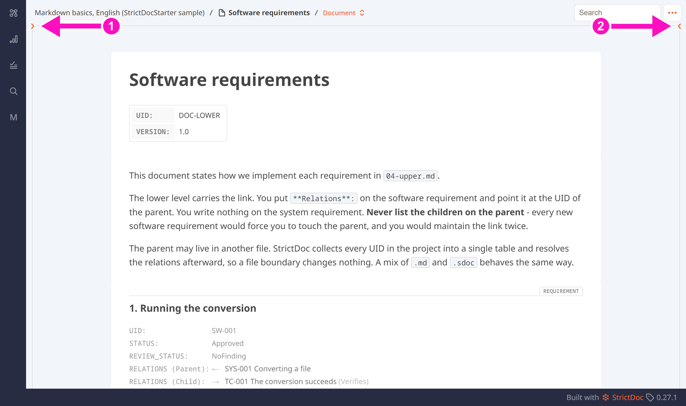

1. The `>` of the folded document tree
2. The `<` of the folded table of contents

StrictDoc remembers the folded state per tab. Move to another document in the same tab
and it stays folded, but a new tab starts open. A width you changed is treated the same
way. The `.md` file does not change.

## Scrolling and zooming

**Type**: SECTION

There is more than one way to make things bigger. The browser's own zoom works
everywhere, Deep Traceability carries a zoom of its own, and the tree map carries
neither. Learn them as one thing and you end up hunting for a button that is not there.

### The browser's own zoom - it works everywhere

**Type**: SECTION

`Ctrl` + `+` and `Ctrl` + `-`, plus the wheel with `Ctrl` held. `Ctrl` + `0` returns to
100 %. StrictDoc adds nothing here. Because it is the browser's own feature, text,
figures and tables all grow together.

Deep Traceability is the exception. That screen uses `Ctrl` + wheel for its own zoom, so
it never reaches the browser's. `Ctrl` + `+` from the keyboard still works.

### Deep Traceability - it carries its own zoom and pan

**Type**: SECTION

This screen alone puts the figure on a board of its own. The page itself does not scroll.
There are four things to remember.

| Gesture | What it does |
| --- | --- |
| Wheel | Scrolls the figure up and down |
| `Shift` + wheel | Scrolls the figure left and right |
| `Ctrl` + wheel | Makes the figure bigger or smaller |
| Drag with `Space` held | Grabs the figure and moves it |

It shrinks to 25 % and grows to 100 %. It never grows past its original size. There is no
button that resets it, so reload the page when you get lost.

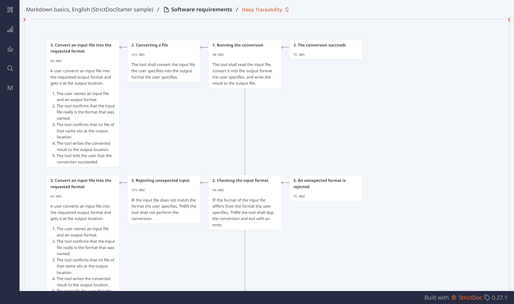

You shrink it to fit one whole chain - use case, system requirement, software requirement,
test - across the screen. Fold the side panels first and the usable width grows further.

### The tree map - no zoom. Press a tile to go in

**Type**: SECTION

The tree map carries no zoom of its own. The wheel only scrolls the page. Put the mouse
over the figure and a button appears at the top right, but it is only
`Download plot as a PNG`; there is no zoom button (measured on 0.27.1). Use the browser's
zoom when you want it bigger.

Instead, pressing a tile goes into it. The tree map redraws only the document you pressed,
so its contents look larger.

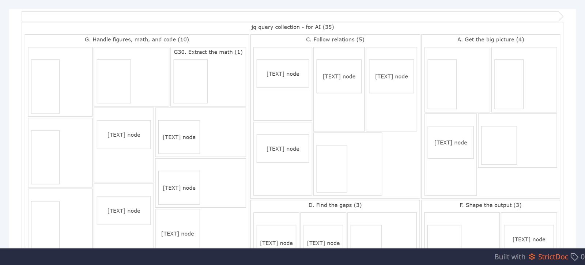

Press the strip at the very top to go back up one level.

### The table and the matrix - drag with Space held

**Type**: SECTION

The `Table` view and the traceability matrix both grow too wide for the window. Drag
either one with `Space` held and you can grab it and move it. The arrow keys work too.

Cutting the columns is faster, though. Drop the columns you do not need with `COLUMNS`
from "Choosing columns in the table view" and the need to drag sideways drops with them.

## Editing the document settings and the grammar

**Type**: SECTION

### The title and the UID

**Type**: SECTION

You edit the title and the `UID` of a document from `Edit title and meta` at the head of
the document body. Not from the `...` in the header.

### The grammar

**Type**: SECTION

That one lives in the `...` in the header. It holds exactly two things.

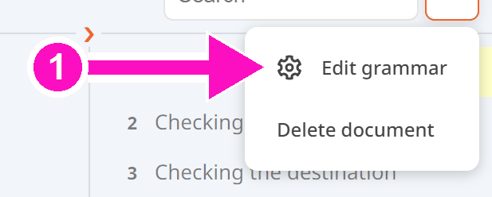

Choose `Edit grammar` and you can edit that document's own grammar in a table, one type
per section. **An imported grammar, however, cannot be edited.** All nine documents in
this set import `basic.sgra`, so choosing it only produces this notice.

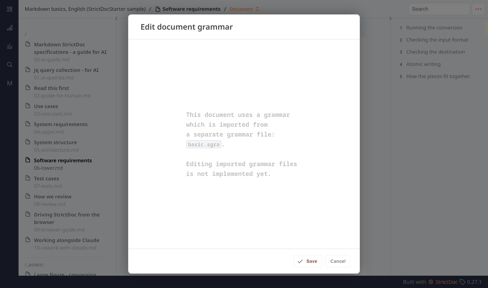

```text
This document uses a grammar which is imported from a separate grammar file: basic.sgra.
Editing imported grammar files is not implemented yet.
```

To use a type or a field of your own, define it either on this screen or in a `.sgra`
file. The default grammar carries you as far as `UID`, `Statement`, `Rationale`, `STATUS`,
`Type: SECTION` and the `Parent` relation. The moment you reach for a `Role` or a
`TEST_CASE`, you need a grammar.

Editing here produces a grammar for that document alone. When several documents share one
grammar, writing it in a file such as `basic.sgra` and referring to it from every document
works better. That is what this set does.

## What the browser cannot do

**Type**: SECTION

| What you want | The browser | Instead |
| --- | --- | --- |
| Upload a file (an image, an attachment) | No | Put it in `_assets/` yourself |
| Create a new project | No | Prepare the folder and `strictdoc_config.py` |
| Rename a file or move a document | No | Move it in Explorer and restart the server |
| Edit while keeping your own style | No | Edit in an editor. The browser always normalises |
| Count things or build a list | Search exists, but it is slow | Pull the JSON with `jq` (`01-ai-queries.md`) |
| Rewrite in bulk | One at a time, yes | Leave it to an editor or an AI (`10-cowork-with-claude.md`) |

**What the browser suits is fixing things one at a time while you look for them.** Once
you know what to fix and there is a lot of it, an editor is faster and the diff is
smaller.

## Appendix - the buttons at a glance

**Type**: SECTION

| Where | What it looks like | What it does |
| --- | --- | --- |
| Top right of the index, `...` | | Add a document / edit the project title |
| Top right of a document, `...` | | Edit the grammar / delete the document |
| Head of the document body | `Edit title and meta` | Edit the title, UID and version |
| First beside a node | Pencil | Edit |
| Second beside a node | Bin | Delete. No confirmation |
| Third beside a node | Stacked squares | Duplicate. The UID comes out empty |
| Fourth beside a node | Plus | Add a node above or below |
| Tabs of the form | `Fields` / `Relations` | Switch between fields and relations |
| Bottom left of the form | `Save` / `Cancel` | Commit / discard |
| `Document` in the breadcrumbs | | Switch between the four views |
| The strip at the far left | | Index / statistics / matrix / search / tree map |
| Corner of a panel | `<` / `>` | Fold or open the document tree and the contents |
| Edge of a panel | | Grab and pull to change the width |
| Header of the table view | `COLUMNS` / `NODES` | Choose columns / narrow rows |
| Heading in the table view | The up-down mark | Sort by that column |
