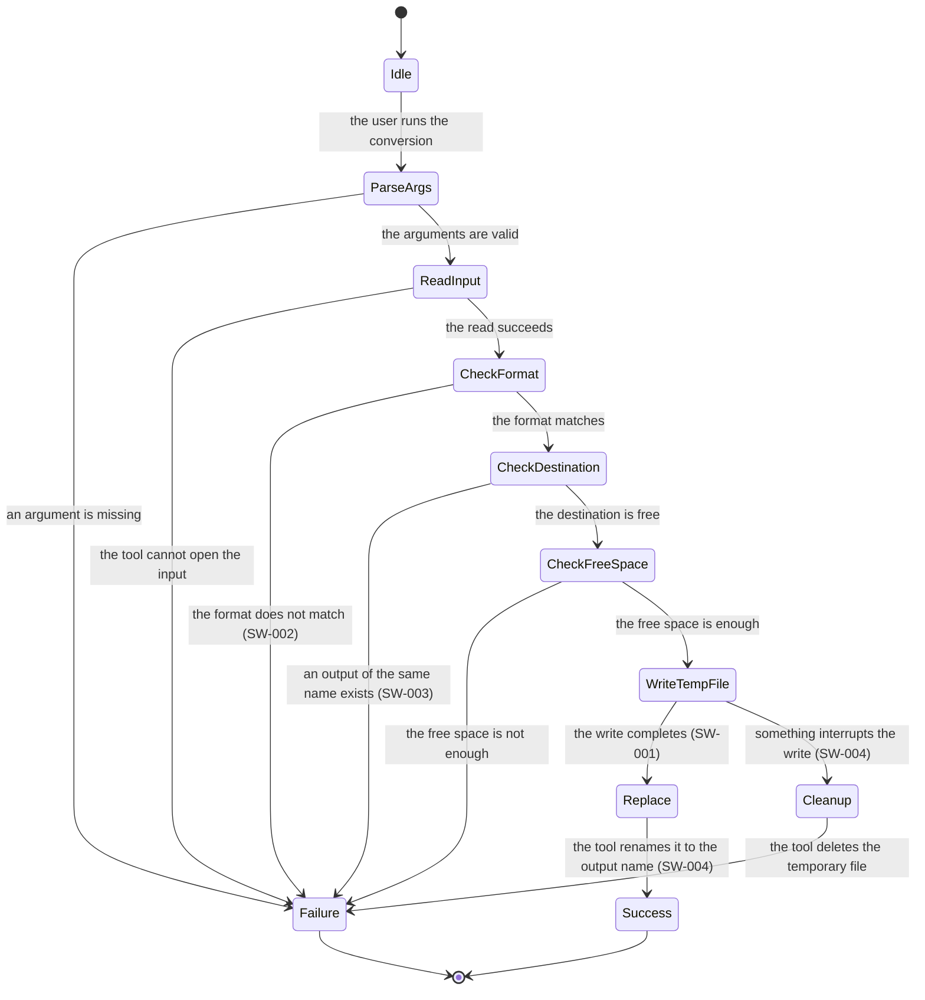

# Large figure - conversion state machine

**UID**: DOC-FIG-STATE

This file is a **worked example of the rule "move a figure of 16 lines or more
into its own document"**.
The body (`04-lower.md`) reaches this page through one `[LINK: DOC-FIG-STATE]` line.

This document holds only the one figure below. You may write an explanation
before or after it, but keep it short.
**Whoever opens this document came to see the figure, not to read prose.**

The `SW-*` names in the figure are the UIDs of the software requirements in
`04-lower.md`. **You can draw a `[LINK:]` from a figure to a requirement, but it
does not work inside a Mermaid code fence.** StrictDoc does not interpret the
contents of a fence; it hands them to Mermaid unchanged.
When you want to send the reader to a requirement, list it outside the figure,
like [LINK: SW-004].
