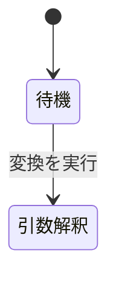

# Markdown 形式の StrictDoc 仕様書 — AI 向け手引き

**UID**: DOC-AI-GUIDE \
**Version**: 1.0

**本書は、AI が Markdown 形式の StrictDoc 仕様書を書き、そこから必要な情報を
取り出すための手引きである。** StrictDoc には `.sdoc` 形式もあるが、本書は扱わない。

**本書 1 つで足りる。** ほかの解説文書も、既存の仕様書も開かなくてよい。
既にある文法を使う場合も、**文法ごと新しく起こす場合も**同じである
(文法ファイルの雛形は 1.1 にそのまま使える形で載せてある)。

**本書の英訳版から Claude Code の SKILL を定義できる。** 規則と実例を分けて訳せば、
`SKILL.md` に規則を、`references/` にクエリと実例を置く形にそのまま移せる。

**★ 本書に載っていないエラーに当たったら、止まらずに 1 行だけ記録して先へ進むこと。**
やり方は 0 章にある。**その場で原因を追ってはならない。**

以下の説明は、実例として `samples/md-basic-ja` を使う。**同じ規則がどの
Markdown 形式の StrictDoc プロジェクトにも当てはまる。**

この実例の構成。**StrictDoc は `.md` をすべて文書として解析する。**
本書も例外ではなく、1 個の文書 `DOC-AI-GUIDE` になる。

| ファイル | 中身 | 文書の UID |
|---|---|---|
| `00-ai-guide.md` | 本書 | `DOC-AI-GUIDE` (要求は無い) |
| `01-ai-queries.md` | 本書のクエリの詳細版 | `DOC-AI-QUERIES` (要求は無い) |
| `02-guide-for-human.md` | 人間向けの解説書。**AI は読まなくてよい** | `DOC-GUIDE` (要求は無い) |
| `03-architecture.md` | システム構成の見取り図。要求は持たない | `DOC-ARCH` (要求は無い) |
| `04-usecases.md` | ユースケース 2 件 (Cockburn 形式)。上位要求へ繋がる | `DOC-USECASES` |
| `05-upper.md` | 上位要求 3 件 | `DOC-UPPER` |
| `06-lower.md` | 下位要求 4 件。上位要求へ繋がる | `DOC-LOWER` |
| `07-tests.md` | テストケース 4 件。下位要求へ繋がる | `DOC-TESTS` |
| `08-review.md` | レビューの進め方。指摘は要求そのものに書く | `DOC-REVIEW` (要求は無い) |
| `09-browser-guide.md` | ブラウザ操作の手引き | `DOC-BROWSER` (要求は無い) |
| `10-cowork-with-claude.md` | AI と組んで書く方法 | `DOC-COWORK` (要求は無い) |
| `_assets/note.md` | 用語表。リンク先 | `DOC-NOTE` (要求は無い) |
| `_assets/fig-state.md` | 大きい図 1 つ。リンク先 | `DOC-FIG-STATE` (要求は無い) |
| `basic.sgra` | 文法定義。ノード型・フィールド・`Role` はここで宣言する | — |
| `strictdoc_config.py` | プロジェクト設定 | — |

**番号は読む順である。** `00` と `01` が AI 向け、`02` が人間向け、`03` から `07` が仕様書本体、`08` から `10` が進め方と道具の手引きである。
`_assets/` の中は番号を持たない。

**後の用例 1 は文書を 13 件返す。** 上表のうち UID を持つもの全部である。
そのうち 8 件 — `DOC-AI-GUIDE` / `DOC-AI-QUERIES` / `DOC-GUIDE` / `DOC-REVIEW` /
`DOC-BROWSER` / `DOC-COWORK` / `DOC-NOTE` / `DOC-FIG-STATE` — は
要求を持たないので、要求を数えるときは混ざらない。

**★ 本書と `01-ai-queries.md` は、自分自身も StrictDoc の文書である。**
だから見出しには全部 `**Type**: SECTION` が付いている。付けないと StrictDoc が
見出しの下の文を要求の本文と見なして停止する (1 章の規則そのままである)。
**そして本書の中身も JSON に入る。** 図やコードを数えるクエリを当てると本書が混ざるので、
集計するときは 3 章の「集計するときは解説文書を除くこと」に従うこと。

コマンド例は Git Bash で実行する前提で書いてある。

## ★ 他のプロジェクトで使うときに置き換えるもの

**Type**: SECTION

**本書の規則はどの Markdown 形式の StrictDoc プロジェクトにも当てはまる。**
一方、**本書に出てくる固有名詞はこの実例のものである。** 他のプロジェクトで使うときは
下の表のとおり読み替える。**規則そのものは読み替えなくてよい。**

| 本書に出る名前 | 何を表すか | 相手のプロジェクトでは |
|---|---|---|
| `samples/md-basic-ja` | 仕様書のフォルダ | 相手のフォルダ |
| `basic.sgra` | 文法ファイル | **名前は自由。** 拡張子だけ `.sgra` |
| `DOC-UPPER` / `DOC-LOWER` など | 文書の UID | 相手が決めている。**用例 1 で調べる** |
| `SYS-*` / `SW-*` / `TC-*` | 要求とテストの UID | 相手の採番。**用例 3 で調べる** |
| `DOC-FIG-` | **図の文書の UID の接頭辞** | **自分で決める。** 監査クエリに `--arg figprefix` で渡す |
| `DOC-AI-GUIDE` / `DOC-AI-QUERIES` / `DOC-GUIDE` / `DOC-REVIEW` / `DOC-BROWSER` / `DOC-COWORK` | **解説文書の UID** | 相手の解説文書。集計時に `--arg skip` で除く |
| `05-upper.md` などのファイル名 | 文書のファイル名 | **JSON には入らない。** 用例 16 の `grep` で調べる |
| `_assets` | 添付ファイル置き場 | **固定。変えられない** (2.8) |
| `strictdoc-quirks.tsv` | 癖の記録 | 同じ名前で作る (0.1) |

**この 2 つだけは自分で決める取り決めであり、StrictDoc の仕様ではない。**

- **図の文書の UID の接頭辞** — 監査クエリが「既に外に出した図」を見分けるために要る (2.1)
- **解説文書をどれと見なすか** — 記法を数えるクエリから除くために要る (3 章)

**どちらもクエリへ引数で渡す。** クエリ本体を書き換えないこと。

---

## 0. 本書に無いエラーに当たったとき

**Type**: SECTION

**本書は strictdoc 0.27.1 で測った内容である。** 版が違えば挙動も違う。相手の
プロジェクトが変わった書き方をしていることもある。**そのとき本書は必ず外れる。**

**外れたときにやることは 3 つだけである。**

1. **回避して先へ進む。** 目的は仕様書を書くことであって、StrictDoc を直すことではない
2. **`strictdoc-quirks.tsv` に 1 行だけ足す**
3. **次の作業へ移る**

**★ その場で原因を追ってはならない。** 深追いすると本来の仕事が終わらない。
**溜まった行は後でまとめて読み、本書を直す材料にする。** 1 件ずつ直すのではなく、
版が上がったときや行が溜まったときに一度に片づける。

### 0.1 記録の書き方

**Type**: SECTION

**仕様書のフォルダの直下に `strictdoc-quirks.tsv` を置く。** タブ区切りで 6 列、
1 件 1 行。**追記だけする。既にある行を書き換えたり消したりしない。**
`.tsv` は StrictDoc が解析しないので、文書には一切影響しない (実測)。

| 列 | 中身 |
|---|---|
| `date` | `YYYY-MM-DD` |
| `sd_version` | `strictdoc --version` の出力 |
| `step` | 何をしていたか。`export-html` / `export-json` / `jq` / `server` / `edit` |
| `symptom` | **エラーの 1 行目をそのまま。** 長ければ切る |
| `workaround` | どう回避したか。**1 行で** |
| `where` | どのファイルのどこか |

無ければ見出し行ごと作る。

```bash
printf 'date\tsd_version\tstep\tsymptom\tworkaround\twhere\n' > <仕様書のフォルダ>/strictdoc-quirks.tsv
```

1 行足す。**`>>` で追記すること。`>` は既存の記録を消す。**

```bash
printf '%s\t%s\t%s\t%s\t%s\t%s\n' "$(date +%F)" "0.27.1" "export-html" "error: string index out of range" "put a character after the closing dollar" "06-lower.md" >> <仕様書のフォルダ>/strictdoc-quirks.tsv
```

**英語 ASCII で書く。** 後で機械にかけるためと、`symptom` に入るエラーが英語だからである。

### 0.2 記録するもの・しないもの

**Type**: SECTION

| 記録する | 記録しない |
|---|---|
| **本書に載っていない**エラー | 本書に載っている罠 (`$` の末尾など) |
| 本書の記述と**違う**挙動 | 自分の打ち間違い |
| 版が違うために効かなかった手順 | 一度直せば再発しないもの |

**判断に迷ったら書く。** 1 行の値段は安く、失われた知見は戻らない。

### 0.3 溜まった記録の使い方

**Type**: SECTION

**まとめて片づけるときだけ読む。** 同じ `symptom` が何度も出ていれば、本書に書くべき罠である。

```bash
cut -f2,4 <仕様書のフォルダ>/strictdoc-quirks.tsv | sort | uniq -c | sort -rn
```

版ごとに並べれば、**どの版で何が変わったか**が出る。

```bash
sort -t"$(printf '\t')" -k2,2 -k1,1 <仕様書のフォルダ>/strictdoc-quirks.tsv
```

---

## 1. 仕様書を書く

**Type**: SECTION

下は strictdoc 0.27.1 で parse 確認済みの雛形である。**この雛形は
`DOCUMENT` / `TEXT` / `SECTION` / `REQUIREMENT` / カスタムノード型の 5 種のノードを作る。**

```markdown
# 文書のタイトル

**Grammar**: basic.sgra \
**UID**: DOC-UPPER \
**Version**: 1.0

H1 の直下は地の文になる。 UID が無いので要求ではない。

## 章の名前

**Type**: SECTION

章の中の地の文。 `Type` を書かないと、 この段落は要求の本文と見なされる。

## 要求の名前

**UID**: SW-001 \
**STATUS**: Approved \
**REVIEW_STATUS**: NoFinding

**Statement**: 本システムは、 〜すること。

**Rationale**: そう決めた理由。

## テストケースの名前

**Type**: TEST_CASE \
**UID**: TC-001 \
**TEST_RESULT**: NotRun

**GIVEN**: 〜の状態である。

**WHEN**: 〜を実行する。

**THEN**: 〜になっている。

**Relations**:
- **Type**: `Parent` \
  **ID**: `SW-001` \
  **Role**: `Verifies`
```

行末の `\` は StrictDoc の解析には不要である。StrictDoc 以外の Markdown ビューアが
連続する行を 1 行に繋げて表示してしまうので、それをこの記号が防ぐ。

### 違反すると export 全体が停止する規則

**Type**: SECTION

| 規則 | 違反時のエラーメッセージ |
|---|---|
| ファイルの先頭を H1 で始める。1 ファイルに 1 つだけ | `the document must start with an H1 heading` |
| **見出しのレベルを飛ばさない。** `#` の次に `###` を置いてはならない | `heading level forward jumps are not allowed: L1 -> L3` |
| 見出しの直後に空行を 2 つ以上置かない | `two or more consecutive empty lines are not allowed` |
| フィールド名は文法どおりの綴りで書く | `Invalid requirement field` |
| `TYPE` という名前のフィールドは `**TYPE**:` と大文字で書く | `**Type**:` はノード型の指定子として先に抜き取られる |
| 宣言されていない `Role` を書かない | `Semantic error: Requirement relation type/role is not registered: Parent / Verifies` |
| **文法を自分で起こすなら `SECTION` を宣言する** | `Semantic error: Invalid node type: SECTION.` |
| **`SECTION` には `PROPERTIES: IS_COMPOSITE: True` を付ける** | `The SECTION grammar element must be declared as composite.` (Hint に修正例が出る) |

**`TEXT` は宣言しなくてよい。組み込みである** (実測)。`SECTION` と `REQUIREMENT` だけを
宣言した文法で export したところ、地の文はちゃんと `TEXT` ノードになった。
**宣言が要るのは `SECTION` のほうだけである。**

**エラーは 2 行で出る。1 行目にファイル名が入る。**

```text
error: could not parse file: C:\...\06-lower.md.
Semantic error: Invalid node type: SECTION.
```

**例外が 1 つだけある。原因もファイル名も出ないエラー。**

```text
error: A process in the process pool was terminated abruptly while the future was running or pending.
```

**★ このエラーが出たら `--no-parallelization` を付けて出し直す。本当のエラーが出る** (実測)。

```bash
strictdoc export <仕様書のフォルダ> --formats=json --output-dir <出力先> --no-parallelization
```

```text
error: could not parse file: C:\...\00-ai-guide.md.
Semantic error: Markdown parsing error: heading level forward jumps are not allowed: L1 -> L3.
Location: C:\...\00-ai-guide.md:54:1
```

**ファイル名も行番号も出る。** 並列で走らせているときだけ、StrictDoc が本当のエラーを
子プロセスから運べずに握り潰している (strictdoc 0.27.1 の不具合。例外クラスの生成に
失敗している)。**`--debug` は stack trace を出すだけで場所は出さない。
`--no-parallelization` のほうが速い。**

**これと 2.3 の `string index out of range` の 2 つだけが「そのままでは場所を教えないエラー」である。**
ほかは 1 行目を読めば場所が分かる。

### 実例を見ても分からない規則

**Type**: SECTION

- **StrictDoc は、見出しの直下に置いた文を暗黙の `Statement` として扱う。** その結果、その見出しは
  要求ノードになる。要求ではない章には `**Type**: SECTION` を明記する。明記しないと
  「`UID` が無い」という理由で停止する。**ただし H1 の直下だけは例外**で、常に地の文になる
- **フィールド名の大文字小文字**: `Statement` `Title` `Status` `Rationale` `Comment` `Level`
  `Tags` `Prefix` の 8 語だけは大文字小文字を問わない。それ以外は文法どおりに書く
  (`GIVEN` は通るが `Given` は停止する)。**判断できないときは全部大文字で書く**
- **繋がりは下位の側に書く。** 下位のノードに `**Relations**:` を置き、親の UID を指す。
  上位の側には何も書かない。親が別のファイルにあってもよい (StrictDoc はプロジェクト全体で
  UID を解決するため)
- **`Role` を書けるのは、文法がその節点型の関係に `ROLE` を宣言している場合だけである。**
  `basic.sgra` の宣言は次のとおり。**下位要求に `Role` を付けてはならない** —
  テストケースの書き方をそのまま真似すると停止する
  | 節点型 | 書ける関係 |
  |---|---|
  | `REQUIREMENT` | `Parent` / `Child`。**`Role` は付けられない** |
  | `USE_CASE` | `Parent`。**`Role` は付けられない** |
  | `TEST_CASE` | `Parent` + `Role: Verifies` |
- **関係の中だけ `**ID**:` である。** ノードの識別子は `**UID**:` だが、`**Relations**:`
  ブロックの中で相手を指すキーは `**ID**:` になる。`**UID**:` と書くと通らない
- **`Type` は `.md` 上でノード型を選ぶための予約語である。** 予約されているのは
  **`Type` という綴りだけ**で、reader は `field_.name == "Type"` と完全一致で比べる
  (0.27.1 の `backend/markdown/reader.py`)。**だから文法に `TYPE` という名前の
  フィールドを作ってよい** — `**TYPE**:` と大文字で書けば通常のフィールドとして通り、
  同じノードに `**Type**: COMPONENT` と併記もできる (実測)。
  ただし単一行のカスタムフィールドなので、**宣言は `TITLE` の後ろに置く**
- **`.sgra` の `FIELDS` は必ずこの順で宣言する** (`.md` に書く順ではない)。
  `MID / UID / LEVEL / STATUS / TAGS の組み込みメタ欄 → TITLE →
  カスタムの単一行フィールド → STATEMENT → RATIONALE などの複数行フィールド`。
  **`TITLE` は `.md` では見出しから来るため、StrictDoc がこの位置に差し込む。**
  組み込みメタ欄より前にも、カスタム欄より後ろにも置けない。
  **違反すると json / html / sdoc のすべてが即座に `Wrong field order` で停止する** (実測)。
  「json は通るが sdoc で落ちる」ということは起きない
- **文書の H1 直下に書いて JSON にも残るのは
  `**Grammar**:` `**UID**:` `**Version**:` `**Classification**:` `**Prefix**:` の 5 つだけ**
  (実測)。`**Date**:` や `**Root**:` は**書いても停止しないが JSON から消える。**
  機械で引けなくなるので、後から引きたい情報を文書レベルに置いてはならない
- **StrictDoc はフォルダ内の `.md` を、置き場所に関係なくすべて文書として解析する。** `_assets/` の中も
  例外ではないため、そこに置く `.md` にも H1 が必要である
- **文書として解析させたくない `.md` は、`strictdoc_config.py` の `exclude_doc_paths` に
  ファイル名で指定する。** `_assets/**` のようにフォルダごと指定してはならない。指定すると
  画像もコピーされなくなり、export は成功と報告するのに HTML の画像だけが 404 になる
- **図・数式・コード・表・画像の書き方は 2 章にまとめてある。** 罠が多いので、
  これらを書く前に必ず読むこと
- **ノード型・フィールド・`Role` を追加するときは `.sgra` に追加する。**
  個別の文書に追加してはならない

**新しくプロジェクトを起こすときの最小構成** (実測):

```text
<プロジェクトフォルダ>/
  <名前>.sgra       ← 文書と同じフォルダに置く。**Grammar**: <名前>.sgra はここを指す
  00-upper.md
  01-lower.md
```

**文法ファイルの名前は自由である** (実測。`basic.sgra` でなくてよい)。拡張子だけ `.sgra`。
**`.sgra` も StrictDoc が読み込んでログに `Reading SDOC:` と出るが、文書にはならない。**

### 1.1 文法ファイル (`.sgra`) の書き方

**Type**: SECTION

**新しくプロジェクトを起こすときは、必ず自分で `.sgra` を書くことになる。**
下がそのまま使える最小の雛形である。**この雛形は 1 章の `.md` の雛形と対になっている。**
両方をそのまま貼って `--formats=json` と `--formats=html` を通したところ、
どちらも成功した (実測)。

**★ 2 つの雛形は必ず対で使うこと。** `.md` の雛形が書くフィールドを `.sgra` が
1 つでも宣言していないと、StrictDoc は export を止める。下は `REVIEW_STATUS` の
宣言を落として実測したときのエラーである (`Hint:` が宣言済みの並びを教える)。
片方だけを別のものに差し替えたときは、両方の並びを見比べて確かめること。

```text
Semantic error: Invalid requirement field: REVIEW_STATUS
```

```text
[GRAMMAR]
ELEMENTS:
- TAG: SECTION
  PROPERTIES:
    IS_COMPOSITE: True
  FIELDS:
  - TITLE: TITLE
    TYPE: String
    REQUIRED: True
- TAG: REQUIREMENT
  FIELDS:
  - TITLE: UID
    TYPE: String
    REQUIRED: True
  - TITLE: STATUS
    TYPE: SingleChoice(Draft, Reviewed, Approved)
    REQUIRED: False
  - TITLE: TITLE
    TYPE: String
    REQUIRED: True
  - TITLE: REVIEW_STATUS
    TYPE: SingleChoice(NotReviewed, NoFinding, Open, Fixed, WontFix)
    REQUIRED: True
  - TITLE: STATEMENT
    TYPE: String
    REQUIRED: True
  - TITLE: RATIONALE
    TYPE: String
    REQUIRED: False
  - TITLE: REVIEW_COMMENT
    TYPE: String
    REQUIRED: False
  - TITLE: REVIEW_ACTION
    TYPE: String
    REQUIRED: False
  RELATIONS:
  - TYPE: Parent
  - TYPE: Child
- TAG: USE_CASE
  FIELDS:
  - TITLE: UID
    TYPE: String
    REQUIRED: True
  - TITLE: TITLE
    TYPE: String
    REQUIRED: True
  - TITLE: UC_LEVEL
    TYPE: SingleChoice(Summary, UserGoal, Subfunction)
    REQUIRED: True
  - TITLE: REVIEW_STATUS
    TYPE: SingleChoice(NotReviewed, NoFinding, Open, Fixed, WontFix)
    REQUIRED: True
  - TITLE: STATEMENT
    TYPE: String
    REQUIRED: True
  - TITLE: REVIEW_COMMENT
    TYPE: String
    REQUIRED: False
  - TITLE: REVIEW_ACTION
    TYPE: String
    REQUIRED: False
  RELATIONS:
  - TYPE: Parent
- TAG: TEST_CASE
  FIELDS:
  - TITLE: UID
    TYPE: String
    REQUIRED: True
  - TITLE: TITLE
    TYPE: String
    REQUIRED: True
  - TITLE: TEST_RESULT
    TYPE: SingleChoice(NotRun, Passed, Failed, Blocked)
    REQUIRED: True
  - TITLE: ISSUE_KEY
    TYPE: String
    REQUIRED: False
  - TITLE: GIVEN
    TYPE: String
    REQUIRED: True
  - TITLE: WHEN
    TYPE: String
    REQUIRED: True
  - TITLE: THEN
    TYPE: String
    REQUIRED: True
  - TITLE: TEST_REMARK
    TYPE: String
    REQUIRED: False
  RELATIONS:
  - TYPE: Parent
    ROLE: Verifies
```

読み方:

| 書くもの | 意味 |
|---|---|
| `- TAG: <名前>` | ノード型を 1 つ宣言する。`.md` 側の `**Type**: <名前>` がこれを指す |
| `PROPERTIES: IS_COMPOSITE: True` | 中に他のノードを入れられる。**`SECTION` には必須** |
| `- TITLE: <名前>` | フィールドを 1 つ宣言する。`.md` 側の `**<名前>**:` がこれを指す |
| `TYPE: String` | 任意の文字列 |
| `TYPE: SingleChoice(A, B, C)` | 列挙。ここに無い値を書くと停止する |
| `REQUIRED: True` | 省略すると停止する |
| `RELATIONS: - TYPE: Parent` | `**Relations**:` で `Parent` を張れるようになる |
| `ROLE: <名前>` | その関係に `**Role**:` を書けるようになる。**書かなければ `Role` は使えない** |

**規則:**

- **`SECTION` は宣言が要る。`TEXT` は要らない** (組み込み)
- **`TAG` と `TITLE` の名前は、`.md` 側の綴りとそのまま一致させる。** `GIVEN` と
  宣言したら `.md` にも `**GIVEN**:` と書く。`**Given**:` は停止する
- **`TYPE` という名前のフィールドは宣言してよい。** 予約語は `Type` という綴りだけである。
  `.md` には `**TYPE**:` と大文字で書き、宣言は `TITLE` の後ろに置く
- **フィールドの宣言順が `.md` 側の制約になる。** `UID → STATUS → TITLE →
  カスタムの単一行フィールド → STATEMENT → RATIONALE などの複数行フィールド` の順に宣言する。
  この順でないと **json / html / sdoc のすべてが即座に停止する** (実測)。
  エラーは `Semantic error: Wrong field order for requirement: [...]` で、
  `Hint:` が宣言済みの順まで教えるので直し方はその場で分かる
- **順が正しいかは `--formats=json` を通せば分かる。** 「json は通るが sdoc で落ちる」
  ということは起きない。 **`--formats=sdoc` も往復の確認には使えない** —
  生成した `.sdoc` が名指しする `.sgra` は一緒に複製されず、 さらに
  `[LINK: UID]` を例として引用している文書があると、 その引用が実際のリンクに変わり、
  読み戻しが `the inline link references an object with an UID that does not exist: UID`
  で止まる (実測)

```bash
strictdoc export <仕様書のフォルダ> --formats=sdoc --output-dir <出力先>
```

**`strictdoc_config.py` は無くても export は通る。** `exclude_doc_paths` や画面の設定が
要るときだけ、このフォルダの直下に置く (親フォルダには置かない。StrictDoc がそこを読まない)。

**★ `strictdoc_config.py` を書き換えたら、サーバを起動し直すこと** (実測)。
**StrictDoc はこのファイルを起動時に 1 回しか読まない。** 文書の `.md` を書き換えたときは
サーバが 1 秒足らずで拾い直すが、**プロジェクト設定だけは拾い直さない。**

| 書き換えたもの | サーバの再起動 |
|---|---|
| `.md` の文書 | 要らない。自動で反映する |
| `.sgra` の文法 | 要らない |
| **`strictdoc_config.py`** | **要る** |

**この症状は気づきにくい。** 設定を直したのに画面が古いままなので、設定を間違えたと
考えてしまう。**しかもサーバは古い設定で HTML を書き続けるため、出力フォルダの中身も
古いままになる。** 迷ったらサーバを止め、`strictdoc export` を手で 1 回通して確かめる。

---

## 2. 図・数式・コードを書く

**Type**: SECTION

**以下はすべて strictdoc 0.27.1 で実測した。** 「通る」は export が成功し、意図した
HTML が出たという意味である。

| 記法 | 結果 | 出る HTML |
|---|---|---|
| ` ```mermaid ` フェンス | **通る** | `<pre class="mermaid">` |
| `$E = mc^2$` (インライン) | **通る** | `<span class="math notranslate nohighlight">\( ... \)</span>` |
| `$$ ... $$` (ブロック) | **通る** | `<div class="math notranslate nohighlight">\[ ... \]</div>` |
| ` ```python ` フェンス | 通るが**色は付かない** | `<code class="language-python">` |
| パイプ表 | **通る** | `<table>` |
| `` | **通る** | `` |
| `[LINK: UID]` | **通る** | `<a href="....html#UID">🔗 タイトル</a>` |
| RST の `.. math::` | **通らない** | `<p>.. math::</p>` — ただの段落 |
| `[DOCUMENT_FROM_FILE]` | **通らない** | 下記 2.6 |

**StrictDoc は MathJax と Mermaid を出力フォルダへ同梱する** (`_static/mathjax/tex-mml-chtml.js` /
`_static/mermaid/mermaid.min.js`)。外部への通信は起きない。設定に足すものは何も無い。

### 2.1 図 — 15 行を超えたら別文書にする

**Type**: SECTION

**規則はこれだけである。**

| ` ```mermaid ` フェンスの中身 | 置き場所 |
|---|---|
| **15 行以下** | 本文にそのまま書く |
| **16 行以上** | `_assets/fig-*.md` に独立した文書として置き、本文からは `[LINK:]` で飛ばす |

**行数の数え方は 1 通りしかない。**

- ` ```mermaid ` と閉じの ` ``` ` の**行は数えない**
- `flowchart LR` や `stateDiagram-v2` の**宣言行は数える**
- **空行は数えない**

下の例は **3 行**である (15 行以下なので本文でよい)。

````markdown

````

**この数え方は 3 章の用例 14 のクエリと完全に一致する。** クエリも空行を落として数える。
自分で数えてもよいし、書き終えてからクエリで測ってもよい。同じ数になる。

**それでも 15 行ちょうどを狙う書き方はしないこと。** 図はあとで必ず育つ。
**明確に小さくするか、迷わず外に出すかのどちらかにする。**

**行数で決めているのは、書いている最中に道具無しで判定できるからである。**
本当に効かせたいのは読む側の負担で、その実測値は次のとおり。**本書が載せる
tokens は tiktoken の `o200k_base` で数えた値である。** 測り直すときも同じ数え方を使うこと。

| 中身 | tokens |
|---|---:|
| 地の文 1 段落 | 15〜50 |
| 6〜15 行の Mermaid 図 | 124〜179 |
| 16〜24 行の Mermaid 図 | 110〜228 |

**行数とトークン数は綺麗には比例しない** (17 行で 114 tokens の図もあれば、6 行で
124 tokens の図もある)。それでも行数を採る。**迷ったら外に出す。**

外に出す利得も実測してある。このサンプルで:

| 引くもの | tokens |
|---|---:|
| 要求の一覧だけ | **91** |
| 大きい図だけを名指しで | **334** |
| 全 `TEXT` ノード (図も数式も込み) | **約 58,000** |

**要求を引いている限り、読む側は別文書にした図の分を 1 トークンも払わない。**
必要なときだけ UID で名指しする。これが 16 行で切る理由である。

**別文書の作り方** — StrictDoc は置き場所に関係なく `.md` を文書として解析するので、
`_assets/` の中でも H1 と `**UID**:` が要る。

````markdown
# 大きい図 - 変換処理の状態遷移

**UID**: DOC-FIG-STATE


````

**`**Grammar**:` の行は要らない** (実測)。書かなければ StrictDoc が既定の文法を当てる。
図の文書に要求ノードを入れたい場合も、既定の文法で通る。

本文の側にはリンクを 1 行置く。

```markdown
中断と後始末まで含めた大きい図は別文書にしてある → [LINK: DOC-FIG-STATE]
```

**`.md` には図を本文へ取り込む手段が無い。** リンク先の独立したページに図が出るだけで、
StrictDoc は図を本文へ展開しない。`[LINK:]` の文字も StrictDoc がリンク先のタイトルから
自動で作るので、**書き手はその文字を指定できない。**

**★ 規則: 図の文書には、ファイル名にも UID にも共通の接頭辞を付ける。**
接頭辞そのものは StrictDoc が決めるものではなく、**プロジェクトごとの取り決めである。**

| | 規則 | この実例での取り決め |
|---|---|---|
| ファイル名 | 図だと分かる接頭辞で始める | **`fig-`** — `_assets/fig-state.md` |
| `**UID**:` | 図だと分かる接頭辞で始める | **`DOC-FIG-`** — `DOC-FIG-STATE` |

**機械で効くのは UID のほうだけである。** 監査クエリ (用例 14b) は
`--arg figprefix` で渡した接頭辞で「既に外に出した図」を判定する。
**ファイル名は JSON に入らないので、どのクエリからも見えない** —
ファイル名の接頭辞は、人がファイル一覧を見たときに図だと分かるための取り決めである。

**UID の接頭辞を間違えると監査が壊れる。ファイル名を間違えても壊れない。**

**既にあるプロジェクトに図を足すときは、相手の接頭辞に合わせる。** 用例 1 で文書を
一覧すれば、図の文書がどんな UID を使っているかが分かる。**接頭辞が無いプロジェクトなら、
自分で決めて 0.1 の記録ではなく `02-guide-for-human.md` に当たる文書へ書き残す。**

**副作用**: `_assets/*.md` は文書一覧に出る。この実例では `DOC-NOTE` と `DOC-FIG-STATE`
が該当する。**これは許容する方針である** (隠す方法は無い。下記)。

**本文から図を外に出すときは、前後の地の文も直すこと。** 「下の図のとおり」「上の流れで」
のような文は、図が消えた瞬間に宙に浮く。**リンクの 1 行に差し替えるだけでは足りない。**

**`exclude_doc_paths` で図の文書を除外してはならない。** 宛先が消えるため、
`[LINK:]` を書いてある側の export が止まる (実測)。

```text
error: DocumentIndex: the inline link references an object with an UID that does not exist: DOC-FIG-STATE.
```

**これは黙って壊れない類のエラーである。** 図を一覧から隠したくなっても、この方法は使えない。

### 2.2 数式 — `$` と `$$` だけ

**Type**: SECTION

| 書き方 | 出る形 |
|---|---|
| `$ ... $` | 文の中に埋まる |
| `$$ ... $$` | 独立した行になる |

**RST の `.. math::` は使えない。** 書くと `.. math::` という文字が段落として出る。
**export は止まらないので、HTML を見るまで気づけない。**

**`$ ... $` と `$$ ... $$` のどちらでも、中の LaTeX はそのまま通る。** `\bar{T}` も
`\frac{a}{b}` も `\\` の改行も `\begin{aligned}` も `\begin{pmatrix}` も、原文のまま
MathJax に渡る (実測)。**数式の中身は Markdown のエスケープも強調も受けない** —
`T_a` の `_` が `<em>` に化けることもない。

**ただし数式の外では `\\` は `\` 1 本に潰れる** — これは Markdown の通常の
エスケープであって不具合ではない。

### 2.3 ★ `$` の罠 — export が原因不明で止まる

**Type**: SECTION

**`$` が段落や表のセルの最後の 1 文字になると、HTML の export が止まる。**

```text
error: string index out of range
```

**ファイル名も行番号も出ない。** これは strictdoc 0.27.1 側の不具合である
(`markdown_to_html_fragment_writer.py` の `_math_inline_rule` が範囲外を読む)。

| 書き方 | 結果 |
|---|---|
| `処理時間は $T$` (段落が数式で終わる) | **止まる** |
| `処理時間は $T$ である。` | 通る |
| `\| 記号 \| $T$ \|` (セルが数式で終わる) | **止まる** |
| `\| 記号 \| $T$ 秒 \|` | 通る |
| `\| 記号 \| $$T$$ \|` (セルで `$$` を使う) | 通る |
| `費用は 100 $` (裸の `$` で終わる) | **止まる** |
| `費用は 100 \$` | 通る |
| `` 費用は `100 $` `` (コード印の中) | 通る |
| `$$ ... $$` のブロックが節の最後 | 通る |

**覚えることは 1 つ — 閉じの `$` の後ろに必ず何か字を置く。**
日本語なら文末が「。」で終わるので、書き手は自然にこの規則を守れる。**守れないのは表のセルである。**

**もう 1 つ。1 行に `$` が 2 つあると、その間が数式に化ける。** 金額に限らない。

| 書いたもの | 出るもの |
|---|---|
| `費用は $100 から $200` | 「100 から」が数式に化ける |
| `$HOME と $PATH` | 「HOME と」が数式に化ける |
| `費用は $100 のみ` (`$` が 1 つ) | そのまま出る |

**`$` の後ろに空白を置いても防げない** (`$ 100 から $ 200` でも化ける)。
`\$100` と逃がすか、`` `$100` `` とコード印に入れる。**export は止まらない。**

**`--formats=json` はこの罠を素通しする** (実測)。JSON は正常に出るので、
**JSON だけ見て仕事を終えると、人間が HTML を作った時点で初めて落ちる。**

**だから図・数式・コードを触ったら、必ず次の 2 つを両方通すこと。**

```bash
strictdoc export <仕様書のフォルダ> --formats=json --output-dir <出力先>
strictdoc export <仕様書のフォルダ> --formats=html --output-dir <出力先>
```

JSON が出ていれば、HTML を作る前に危ない行を機械で探せる。**0 件が正常。**
クエリは 3 章の**用例 17** にある (詳細版では G33)。

**表のセルでは `$` を単独で閉じない。** 逃げ方は 2 つあり、**前者を選ぶこと。**

| 書き方 | 出る HTML | 見え方 |
|---|---|---|
| `\| $T$ 秒 \|` (単位や語を足す) | `<span class="math ...">` | **文中に収まる。こちらを使う** |
| `\| $$T$$ \|` (ブロックにする) | `<div class="math ...">` | セルの中で独立した行になり、中央に寄る |

### 2.4 コード — 言語名は必ず書く

**Type**: SECTION

````markdown
```python
def convert(src: str, dst: str) -> None:
    os.replace(tmp, dst)
```
````

出力の HTML は `<code class="language-python">` になるが、**StrictDoc は構文強調を
積んでいない** (pygments のスパンは 0 個であることを実測した)。**色は付かない。
これは許容する方針である。**

**それでも言語名は必ず書く。** 言語名は JSON にも原文のまま残るため、後から読む側が
これが何のコードかを判別できる唯一の手掛かりになる。言語名の無いフェンスは
`01-ai-queries.md` の G31 で拾えない。

### 2.5 フェンスの中は StrictDoc が一切解釈しない

**Type**: SECTION

**Mermaid でもコードでも同じである。** フェンスの中に書いた `[LINK: SW-001]` は
リンクにならず、文字のまま出る。`$` も `|` も `**` も、フェンスの中では何も起こらない。

- 図から要求へ飛ばしたいなら、**リンクはフェンスの外に置く**
- `$` の罠を確実に避けたい文字列は、フェンスかコード印の中に入れる

**クエリのように本文へ ` ``` ` を書きたいときは、囲みを 4 個のバッククォートにする。**
3 個だと囲みが途中で閉じる。StrictDoc も 4 個の囲みを正しく解釈する (実測)。

### 2.6 `[DOCUMENT_FROM_FILE]` を書いてはならない

**Type**: SECTION

`.sdoc` の取り込み記法である。**`.md` では動かないだけでなく、書き方によっては
黙って壊れる** (実測)。

| 書き方 | 起きること |
|---|---|
| `[DOCUMENT_FROM_FILE]: path` | Markdown のリンク参照定義と解釈され、**行ごと消える** |
| 上を書いた後の `[DOCUMENT_FROM_FILE]` | 上の定義に解決され、**壊れたリンクになる** |
| 単独の `[DOCUMENT_FROM_FILE]` | 文字のまま出る |

**いずれも export は成功する。** 別文書に分けたいときは 2.1 の `[LINK:]` を使う。

### 2.7 表

**Type**: SECTION

**表はパイプ表だけである。** RST の grid / simple 形式は通らない。**桁は揃えなくてよい。**

```markdown
| 記号 | 意味 |
|---|---|
| a | あ |
```

**両端のパイプは省いても通る** (実測) が、**必ず書くこと。**
省くと 3 章の表の検査クエリが行を見つけられない。

**揃え記号 (`:---` / `:---:` / `---:`) と空セルは通る。**
**セルの中で `` `コード` `` / `**太字**` / `[リンク](path)` は使える** (実測)。

**要求の `STATEMENT` に表を置ける。** JSON にも原文のまま入るので、
表だけを取り出して書き換えて戻せる (用例 19)。

#### 2.7.1 表が黙って壊れる 3 つの書き方

**Type**: SECTION

**いずれも export は成功する。HTML だけが崩れる。**

| 書き方 | 起きること |
|---|---|
| **セルの数が見出しより多い** | **超えた分を捨てる。** `\| 多い \| 行 \| です \| よ \|` の「よ」が消える |
| セルの数が見出しより少ない | 空セルで埋める。害は小さい |
| **セルの中に逃がしていない `\|`** | そこで列が割れる |

**★ `|` はコード印では保護されない。** `$` とは違う。

| 書き方 | 結果 |
|---|---|
| `a \| b` (逃がす) | **通る。** セルには `a \| b` と出る |
| `` `a \| b` `` (コード印の中でも逃がす) | **通る。** これが正しい書き方 |
| `` `a \| b` `` の `\` を外したもの | **割れる。** コード印は `\|` を守らない |

**`$` はコード印で守られるのに、`|` は守られない。** 混同しないこと。

**JSON には壊れた行も原文のまま残る** (実測)。**だから HTML を見る前に
用例 20 で検出できる。0 件が正常。**

**セルを `$` で終わらせない** (2.3)。**これだけは export が止まる。**

### 2.8 添付ファイル

**Type**: SECTION

**`_assets/` に置いたものを、StrictDoc は種類を問わず出力へ複製する** (実測)。
画像だけの仕組みではない。

| やること | 書き方 |
|---|---|
| 画像を貼る | `` |
| **画像以外を添付する** | `[説明](_assets/x.csv)` — 普通のリンクで書く |

`.csv` / `.pdf` / `.zip` を `_assets/` に置いて export したところ、**3 つとも出力へ
複製され、リンクも解決した** (実測)。**拡大しても崩れないので、図の画像は SVG を既定にする。**

**★ 添付は 2 通りの壊れ方を黙ってする。export は成功と報告する。**

| 壊れ方 | 起きること |
|---|---|
| **参照先のファイルが無い** | `` や `<a>` は出る。開くと 404 |
| **`_assets/` 以外に置いた** | ファイルは実在するのに**複製されない**。開くと 404 |

**アセット置き場の名前は `_assets` に固定である。** `attachments/` のような別名の
フォルダを作っても、StrictDoc はそこを走査しない (実測。ソースでも
`find_directories(..., "_assets")` と名前が直に書いてある)。

**どちらも export のログに何も出ない。** だから 3 章の**用例 18** を毎回通すこと。
**0 件が正常。**

- **`exclude_doc_paths` に `_assets/**` のようにフォルダを指定してはならない。**
  StrictDoc は同じ設定を「文書を探す」と「アセット置き場を探す」の**両方**に渡すため、
  画像も複製されなくなる。export は成功と報告するのに HTML の画像だけが 404 になる

---

## 3. 仕様書から必要な部分だけを取り出す

**Type**: SECTION

**仕様書の一部だけが必要なとき、`.md` ファイルを読んではならない。**
この実例の仕様書 (`03` 〜 `05` と `_assets/`) を全部読むと約 5,300 tokens、
`02-guide-for-human.md` まで含めると約 14,200 tokens を消費する。
JSON に変換して `jq` で取り出せば、要求の一覧は 91 tokens で済む。

**★ この禁止は「知るために読む」ことだけを指す。書き換えるなら開いてよい。**
既にある仕様書を直す仕事では、対象の `.md` を開いて編集するのが正しい手順である
(3.1 に手順をまとめてある)。**JSON から `.md` へ機械的に書き戻すことはできない** —
JSON にファイルパスが入っていないためである。

| やること | `.md` を開くか |
|---|---|
| 内容を知る・数える・探す | **開かない。** JSON を出して `jq` で引く |
| 内容を書き換える | **開く。** 場所は用例 16 で特定してから開く |

### 手順 1 — JSON に変換する

**Type**: SECTION

```bash
strictdoc export <仕様書のフォルダ> --formats=json --output-dir <出力先>
```

StrictDoc は `<出力先>/json/index.json` を作る。以下ではこのファイルを `<json>` と表記する。

**`<出力先>` は仕様書のフォルダの外にすること。** `%TEMP%` 配下など、作業用の場所を使う。

正確には、**危ないのは `--formats=sdoc` のときだけである** (実測)。json / html の出力は
StrictDoc が自分で読み飛ばすので、中に置いても壊れない。しかし `sdoc` は解析できる
`.sdoc` を書き出すため、それが次回の入力として拾われ、export 全体が止まる。

```text
error: TraceabilityIndex: the document "A" imports a grammar from a file that does not exist: "basic.sgra".
```

**形式ごとに覚え分けるより、常に外に出すほうが安全である。**

**json と html は同じ `<出力先>` に出してよい** (実測)。`<出力先>/json/` と
`<出力先>/html/` に分かれるので、上書きし合わない。

**`.md` を修正したら、再度この `strictdoc export` を実行すること。**
StrictDoc は JSON を自動では更新しない。

**この `index.json` を直接読んではならない** — 約 194,000 tokens ある。
`jq` に読ませるためだけのファイルである。

**StrictDoc 自身にも問い合わせ言語があるが、JSON 出力には効かない。**
`--filter-nodes` は `.sdoc` と HTML の出力しか絞り込まない。`--formats=json` に付けても
**StrictDoc はエラーも警告も出さないまま全件を出力する**。絞り込みは `jq` で行う。

### 手順 2 — jq で取り出す

**Type**: SECTION

JSON の構造:

```json
{"DOCUMENTS": [
  {"_NODE_TYPE": "DOCUMENT", "UID": "...", "TITLE": "...", "GRAMMAR": {},
   "NODES": [
     {"_NODE_TYPE": "SECTION", "TITLE": "...", "NODES": [
       {"_NODE_TYPE": "TEXT", "_TOC": "2.1.1", "STATEMENT": "地の文。UID は無い"}]},
     {"_NODE_TYPE": "REQUIREMENT", "UID": "...", "TITLE": "...", "STATEMENT": "...",
      "RELATIONS": [{"TYPE": "Parent", "VALUE": "...", "ROLE": "..."}]}]}]}
```

**★ 図・数式・コードは、ほぼ全部 `_NODE_TYPE == "TEXT"` の地の文ノードに入る。**
要求の `STATEMENT` に書くこともできるが、普通は地の文である。
**`TEXT` ノードは `UID` を持たない。** 場所を指すには `_TOC` (`2.1.1` のような階層番号) を
使う。人に伝えるときは**文書の `UID` + `_TOC` + 親の章タイトル**の 3 つで示す。

ノードは入れ子になっている。**平坦化には次の定型を使う。**

```bash
jq -r '.DOCUMENTS[] | recurse(.NODES[]?) | select(._NODE_TYPE=="REQUIREMENT") | .UID + "  " + .TITLE' <json>
```

- ノード型を判定するキーは `_NODE_TYPE` である。**先頭に下線が付く。** `_TOC` `_OPTIONS` も同様
- **`.md` のファイルパスは JSON に入っていない。** 「特定のファイルの要求だけ」を取り出すには、
  文書の `UID` (`DOC-UPPER` など) で絞る。文書の UID は用例 1 で調べる
- `_TOC` は `2.1.1` のような階層番号である。章単位で絞るときに使う
- **JSON に「子」は記録されていない。** ある要求の子を取り出すには、全ノードを走査して
  「親がその要求であるもの」を集める
- `RELATIONS` には `Parent` も `File` も同じ配列に入る。親だけが必要なら
  `select(.TYPE=="Parent")` で絞り込む
- **`--included-documents` を付けてはならない。** 取り込んだ文書が重複し、
  同じ UID が 2 か所に現れる
- `DATE` と `METADATA:` は JSON に含まれない。文書レベルのメタ情報は
  `UID` / `VERSION` / `CLASSIFICATION` / `PREFIX` / `ROOT` のみ
- `-r` を付けると `jq` は人が読む行を出力し、付けなければ JSON のまま出力する。
  **プログラムで処理するなら付けない**
- StrictDoc は `index.json` の中で日本語を `\uXXXX` に変換して書くが、`jq` は
  元の文字に戻して出力する。書き手が変換する必要は無い

### 用例

**Type**: SECTION

以下はすべて実行して出力を確認したものである。

```bash
# 1. まず何があるか — 文書の一覧
jq -r '.DOCUMENTS[] | (.UID // "-") + "  " + .TITLE' <json>

# 2. 型ごとに使えるフィールド名 (既存プロジェクトのスキーマを JSON から知る。
#    新規に書き起こすときは JSON がまだ無いので、basic.sgra を直接読むこと)
jq -c '[.DOCUMENTS[] | recurse(.NODES[]?) | select(._NODE_TYPE) | {t:._NODE_TYPE, k:keys}] | group_by(.t) | map({(.[0].t): (map(.k)|add|unique)}) | add' <json>

# 3. 要求の一覧を表で (最も安い)
jq -r '.DOCUMENTS[] | recurse(.NODES[]?) | select(._NODE_TYPE=="REQUIREMENT") | [.UID, .STATUS, .TITLE] | @tsv' <json>

# 4. 特定の要求の全フィールド
jq -c 'first(.DOCUMENTS[] | recurse(.NODES[]?) | select(.UID? == "SW-002")) | del(.NODES)' <json>

# 5. 特定の文書だけに絞る (ファイル名では絞れない)
jq -r '.DOCUMENTS[] | select(.UID=="DOC-UPPER") | recurse(.NODES[]?) | select(._NODE_TYPE=="REQUIREMENT") | .UID + "  " + .TITLE' <json>

# 5b. 逆引き — 各ノードがどの文書に属するか
jq -r '.DOCUMENTS[] | .UID as $doc | recurse(.NODES[]?) | select(.UID? and ._NODE_TYPE!="DOCUMENT") | $doc + "  " + .UID + "  " + .TITLE' <json>

# 6. 正規表現で探す (第 2 引数はフラグ。"i" で大小無視。日本語も使える)
jq -r '.DOCUMENTS[] | recurse(.NODES[]?) | select(.TITLE? and (.TITLE | test("変換|検査"; "i"))) | (.UID // "-") + "  " + .TITLE' <json>

# 7. and / or / not — not は後ろに置く
jq -r '.DOCUMENTS[] | recurse(.NODES[]?) | select(.REVIEW_STATUS=="Open" and .STATUS=="Reviewed") | .UID' <json>
jq -r '.DOCUMENTS[] | recurse(.NODES[]?) | select(._NODE_TYPE=="TEST_CASE" or .REVIEW_STATUS=="WontFix") | .UID' <json>
jq -r '.DOCUMENTS[] | recurse(.NODES[]?) | select(.UID? and (._NODE_TYPE=="REQUIREMENT" | not)) | ._NODE_TYPE + " " + .UID' <json>

# 8. 直接の子 (逆引き)
jq -r '.DOCUMENTS[] | recurse(.NODES[]?) | select((.RELATIONS? // []) | any(.TYPE=="Parent" and .VALUE=="SYS-001")) | .UID' <json>

# 9. 親を根までたどる (推移的)。unique でソートされるので出力の順は階層順ではない。
#    どれが根かは、返った UID を用例 4 で開いて RELATIONS が無いことで判定する
jq -r '[.DOCUMENTS[] | recurse(.NODES[]?) | select(._NODE_TYPE and .UID)] as $all
| def anc($u): ($all[] | select(.UID==$u) | .RELATIONS? // [] | .[] | select(.TYPE=="Parent") | .VALUE) as $p | [$p], anc($p);
  [anc("TC-001")] | flatten | unique | .[]' <json>

# 10. テストケースから「直接」指されていない要求。
#     これは推移的なカバレッジではない。このサンプルでは SYS-001..003 が返るが、
#     3 件とも下位要求を経由してテストされている。欠陥ではない。
#     推移的に見るには、返った UID それぞれに用例 9 の逆 (子をたどる) を当てる
jq -r '[.DOCUMENTS[] | recurse(.NODES[]?) | select(._NODE_TYPE=="TEST_CASE") | (.RELATIONS // [])[] | select(.TYPE=="Parent") | .VALUE] as $tested
| .DOCUMENTS[] | recurse(.NODES[]?) | select(._NODE_TYPE=="REQUIREMENT")
| select(.UID | IN($tested[]) | not) | .UID + "  " + .TITLE' <json>

# 11. 存在しない UID を指す関係 (リンク切れ)。0 件が正常
jq -r '[.DOCUMENTS[] | recurse(.NODES[]?) | select(.UID?) | .UID] as $ids
| .DOCUMENTS[] | recurse(.NODES[]?) | select(.UID?) as $n
| ($n.RELATIONS // [])[] | select(.VALUE | IN($ids[]) | not) | $n.UID + " -> " + .VALUE' <json>

# 12. 件数だけ
jq -c '[.DOCUMENTS[] | recurse(.NODES[]?) | select(._NODE_TYPE=="REQUIREMENT")] | length' <json>
```

### 図・数式・コードの用例

**Type**: SECTION

**この 2 本は囲みが 4 個のバッククォートになっている。** クエリ本文に ` ``` ` が
出るためである (2.5)。

**13. どこに図・数式・コード・表・画像があるか。** 2 列目は `UID`、無ければ `_TOC`。

**`--arg skip` に解説文書の UID をコンマ区切りで渡す。** 渡さないと解説文書の中身が
大量に混ざる (下記)。

````bash
jq -r --arg skip 'DOC-AI-GUIDE,DOC-AI-QUERIES,DOC-GUIDE,DOC-REVIEW,DOC-BROWSER,DOC-COWORK' '($skip | split(",")) as $s
| .DOCUMENTS[] | select(.UID | IN($s[]) | not) | .UID as $doc
| recurse(.NODES[]?) | select(.STATEMENT?) as $n | $n.STATEMENT as $t
| [$t | split("```") | to_entries[] | select(.key % 2 == 1) | .value | split("\n")[0] | rtrimstr("\r")] as $lang
| [ (if ($lang | index("mermaid")) then "図" else empty end),
    (if ($t | contains("$$")) then "数式" else empty end),
    (if ($lang | map(select(. != "mermaid" and . != "")) | length) > 0 then "コード" else empty end),
    (if ($t | test("(?m)^[|]")) then "表" else empty end),
    (if ($t | contains("![")) then "画像" else empty end) ] as $k
| select(($k | length) > 0) | $doc + "  " + ($n.UID // $n._TOC // "-") + "  " + ($k | join(","))' <json>
````

```text
DOC-UPPER  2.1  表
DOC-UPPER  2.2.1  コード,表
DOC-LOWER  6.1  図,数式,コード,表
DOC-TESTS  1  コード
DOC-TESTS  2.1  コード,表
DOC-FIG-STATE  1  図
DOC-NOTE  1  表
```

**`--arg skip` に何を渡すかは実例ごとに違う。** この実例の解説文書は 6 つ
(`DOC-AI-GUIDE` = 本書、`DOC-AI-QUERIES`、`DOC-GUIDE`、`DOC-REVIEW`、
`DOC-BROWSER`、`DOC-COWORK`) である。**相手のプロジェクトでは
まず用例 1 で文書を一覧し、記法の解説を兼ねた文書を見つけて渡す** (探し方は 3 章の
「集計するときは解説文書を除くこと」)。

**渡さないと 122 行返り、そのうち 115 行が解説文書になる** (実測)。解説書は説明のために
記法を大量に抱えるためで、壊れてはいない。**渡せば 7 行になる。**

**言語名はフェンス 1 個ずつ見ること。** ` ``` ` で切ると奇数番目が必ずフェンスの中身に
なるので、その 1 行目が言語名である。**ノード全体に対して「`mermaid` を含むか」で
判定してはならない** — 図とコードが同じノードに同居すると、コードを取りこぼす。

**14. 図の行数を測る。** 全部の図を並べて見る形。

````bash
jq -r '.DOCUMENTS[] | .UID as $doc | recurse(.NODES[]?) | (.STATEMENT? // "")
| select(contains("```mermaid")) | split("```")[] | select(startswith("mermaid"))
| ltrimstr("mermaid") | split("\n") | map(rtrimstr("\r")) | map(select(. != "")) | length as $c
| $doc + "  " + ($c | tostring) + " 行  " + (if $c > 15 then "外に出す" else "本文でよい" end)' <json>
````

```text
DOC-AI-GUIDE  4 行  本文でよい      ← ここから 10 行は本書が載せている書き方の見本
DOC-AI-GUIDE  6 行  本文でよい
DOC-AI-GUIDE  1 行  本文でよい
DOC-AI-GUIDE  3 行  本文でよい
DOC-AI-GUIDE  3 行  本文でよい
DOC-AI-GUIDE  1 行  本文でよい
DOC-AI-GUIDE  7 行  本文でよい
DOC-AI-GUIDE  1 行  本文でよい
DOC-AI-GUIDE  1 行  本文でよい
DOC-AI-GUIDE  1 行  本文でよい
DOC-AI-QUERIES  1 行  本文でよい    ← 同上
DOC-AI-QUERIES  1 行  本文でよい
DOC-AI-QUERIES  1 行  本文でよい
DOC-GUIDE  8 行  本文でよい
DOC-LOWER  8 行  本文でよい
DOC-BROWSER  1 行  本文でよい
DOC-FIG-STATE  19 行  外に出す
```

**このクエリは 17 行返す。上は全部である。** 本物の図は `DOC-LOWER` と
`DOC-FIG-STATE` の 2 つだけで、残る 15 行は解説文書が載せている見本である。

**解説文書が載せている見本まで数える。** 本書は ```` の中に ```mermaid の例を
書いているので、その断片が 1〜7 行の「図」として 10 行出る。**仕事に効くのは次の 14b だけ**で、
こちらは眺めるためのものである。

**14b. 規則違反だけを出す。0 件が正常。** 既に外に出した図 (`DOC-FIG-` で始まる文書) を
除くので、**これが 1 行でも返ったら直す仕事がある**という意味になる。

**`--arg figprefix` に図の文書の UID の接頭辞を渡す。** この実例では `DOC-FIG-` である。
**相手のプロジェクトでは相手の接頭辞を渡す。クエリ本体は書き換えない。**

````bash
jq -r --arg figprefix 'DOC-FIG-' '.DOCUMENTS[] | select(.UID | startswith($figprefix) | not) | .UID as $doc
| recurse(.NODES[]?) | select(.STATEMENT?) as $n | $n.STATEMENT
| select(contains("```mermaid")) | split("```")[] | select(startswith("mermaid"))
| ltrimstr("mermaid") | split("\n") | map(rtrimstr("\r")) | map(select(. != "")) | length as $c
| select($c > 15) | $doc + "  " + ($n.UID // $n._TOC // "-") + "  " + ($c | tostring) + " 行"' <json>
````

**15. 図の定義を丸ごと取り出す。** 文書の UID で名指しする。

````bash
jq -r '.DOCUMENTS[] | select(.UID == "DOC-FIG-STATE") | recurse(.NODES[]?) | (.STATEMENT? // "")
| select(contains("```mermaid")) | split("```")[] | select(startswith("mermaid")) | ltrimstr("mermaid")' <json>
````

`split("```")` でフェンスを境に切り、`mermaid` で始まる断片だけを拾い、先頭の 7 文字を
落としている。**言語名を変えれば同じ形でコードも取れる** (`startswith("python")`)。

**この出力を書き戻すときの罠が 2 つある。どちらも実測。**

**罠 1 — 先頭と末尾に空行が付く。** `ltrimstr("mermaid")` は `mermaid` の 7 文字しか
落とさず、その直後の改行が残る。19 行の図の出力が 21 行になる。**そのまま貼り戻すと
往復のたびに空行が 1 本ずつ溜まる。** 用例 14 は空行を落として数えるので**行数では
気づけない。** 貼る前に前後の空行を落とすこと。落とした版:

````bash
jq -r '.DOCUMENTS[] | select(.UID == "DOC-FIG-STATE") | recurse(.NODES[]?) | (.STATEMENT? // "")
| select(contains("```mermaid")) | split("```")[] | select(startswith("mermaid")) | ltrimstr("mermaid")
| split("\n") | map(rtrimstr("\r")) | map(select(. != "")) | join("\n")' <json>
````

**罠 2 — Windows の jq は改行を CRLF で出す** (実測。JSON の中身は LF である。
StrictDoc が読み込み時に LF へ正規化している)。**リダイレクトで `.md` に流し込むと
改行が混ざる。** 貼り付けは編集ツールで行い、シェルのリダイレクトで書き込まないこと。

**16b. 本文の中にある図を取り出す。** 用例 15 は図だけの専用文書を想定している。
本文の文書から取るときは `_TOC` で場所を指す (用例 13 の 2 列目がその番号である)。
**同じ文書に図が 2 つ以上あるときは、これでないと区別できない。**

````bash
jq -r '.DOCUMENTS[] | select(.UID == "DOC-LOWER") | recurse(.NODES[]?) | select(._TOC? == "6.1")
| (.STATEMENT? // "") | split("```")[] | select(startswith("mermaid")) | ltrimstr("mermaid")
| split("\n") | map(rtrimstr("\r")) | map(select(. != "")) | join("\n")' <json>
````

**16. どのファイルがその UID を定義しているかを突き止める。**
**JSON にファイルパスは入っていないので、ここだけは `grep` を使う。**

```bash
grep -rlF '**UID**: DOC-FIG-STATE' <仕様書のフォルダ> --include=*.md
```

**`**UID**:` まで含めて探すこと。** UID だけで探すと `[LINK:]` で参照しているだけの
ファイルも一緒に出る (実測で 5 件出た)。`-F` は `**` を正規表現と解釈させないために要る。

**それでも複数出ることがある。** このフォルダで実行すると 3 件出る — 本当の定義は
`_assets/fig-state.md` だけで、残る 2 件は本書と `01-ai-queries.md` が**この書き方を
例として載せているから**である。**解説文書は自分が説明している文字列を含む。**
返ってきたファイルが仕様書なのか手引きなのかは、冒頭の対応表で見分ける。

**17. `$` の罠を含む行 (2.3)。0 件が正常。** 図や数式を書き足したら毎回これを通す。

````bash
jq -r '.DOCUMENTS[] | .UID as $doc | recurse(.NODES[]?) | (.STATEMENT? // "")
| split("\n") | map(rtrimstr("\r"))
| reduce .[] as $line ({open: 0, out: []};
    ([$line | scan("^`{3,}")] | (.[0] // "") | length) as $w
    | if $w > 0
      then (if .open == 0 then .open = $w elif $w >= .open then .open = 0 else . end)
      else (if .open == 0 then .out += [$line] else . end)
      end)
| .out[]
| select(test("[^$][$] *$") or test("[^$][$] *[|]"))
| $doc + "  " + .' <json>
````

**`reduce` の部分はコードフェンスの中身を捨てている。** `$` はフェンスの中では
無害なので、捨てないと誤検出だらけになる。**開いたフェンスの記号の長さを覚えておき、
同じ長さ以上の記号でだけ閉じる。** ` ```` ` の中に ` ``` ` が入っている本書のような文書では、
単純に「``` で切って偶数番目を取る」やり方が破綻する。**本書に当てると、フェンスの中の
140 行を「外」と数える** (実測)。今はその 140 行に `$` で終わる行が無いので偽陽性は 0 件だが、
`$` で終わる行を 1 本書き足した瞬間に出る。

**★ `map(rtrimstr("\r"))` は飾りではない。** StrictDoc は元のファイルの CRLF を
`STATEMENT` の中に残すので、各行は CR で終わって届き、末尾を見る `" *$"` は
決して一致しない。 これを外すと、**HTML の export がまさにその行で落ちる文書に対して、
このクエリは 0 件を返す** (実測)。

**★ このクエリが 0 件でも安全とは限らない。** 検出できるのは**落ちる方の罠**
(段落やセルが `$` で終わる) だけである。**2.3 のもう 1 つの罠 —
`費用は $100 から $200` が数式に化ける方 — は落ちないので、このクエリには出ない。**
金額や環境変数を書いたときは、HTML を目で見て確かめること。

**18. 添付ファイルが届いているかを確かめる (2.8)。0 件が正常。**
**参照先が無い場合と、`_assets/` の外に置いた場合の両方をこれ 1 本で捕まえる。**

`jq` が挙げた参照を、**export した HTML の側**に実在するかで判定する。
`--formats=html` を先に通しておくこと。

```bash
jq -r '.DOCUMENTS[] | select(.UID | IN("DOC-AI-GUIDE", "DOC-AI-QUERIES", "DOC-GUIDE", "DOC-REVIEW", "DOC-BROWSER", "DOC-COWORK") | not)
| recurse(.NODES[]?) | (.STATEMENT? // "")
| split("](") | .[1:][] | split(")")[0]
| select(startswith("http") or startswith("#") | not)' <json> \
  | tr -d '\r' | sort -u \
  | while read -r p; do [ -f "<出力先>/html/<仕様書のフォルダ名>/$p" ] || echo "NOT PUBLISHED  $p"; done
```

**この実例に当てると 0 件である** (実測)。添付を壊した文書に当てると、こう出る:

```text
NOT PUBLISHED  _assets/missing.svg      ← ファイルが無い
NOT PUBLISHED  attachments/other.svg    ← 実在するが _assets/ の外にある
```

**3 つとも省いてはならない。**

- **`tr -d '\r'`** — Windows の `jq` は改行を CRLF で出す。省くとパスの末尾に `\r` が
  付き、**実在するファイルまで「無い」と判定される** (実測で踏んだ)
- **解説文書を除く `select`** — 解説文書は `` のような**書式の説明**を
  本文に持つ。省くと `path` や `_assets/x.svg` が「無い」として出る (実測)
- **`<出力先>/html/...` を見る** — 仕様書のフォルダではなく**出力**を見ることで、
  「置き場所が違って複製されなかった」ほうも同時に捕まる

**使われていない添付を探す**ときは向きを逆にする。消してよいものが分かる。
**こちらは解説文書を除かない** (どこから参照されていても「使われている」ため)。
**`_assets/*.md` は除く** — あれは文書であり、`[LINK:]` が UID で指すのでパスに出てこない。

```bash
comm -13 <(jq -r '.DOCUMENTS[] | recurse(.NODES[]?) | (.STATEMENT? // "") | split("](") | .[1:][] | split(")")[0]' <json> | tr -d '\r' | sort -u) \
         <(cd <仕様書のフォルダ> && find _assets -type f -not -name "*.md" | sort)
```

**19. 表を丸ごと取り出す。** 要求なら UID、地の文なら `_TOC` で場所を指す (用例 13 の 2 列目)。

```bash
jq -r --arg doc DOC-LOWER --arg at 6.1 '.DOCUMENTS[] | select(.UID == $doc) | recurse(.NODES[]?)
| select((.UID? // ._TOC? // "") == $at) | (.STATEMENT? // "")
| split("\n")[] | select(startswith("|"))' <json>
```

```text
| 記号 | 単位 | 意味 |
|---|---|---|
| $S_{need}$ バイト | バイト | 変換に必要な空き容量 |
| $S_{out}$ バイト | バイト | 出力ファイルの大きさ |
| $S_{tmp}$ バイト | バイト | 一時ファイルの大きさ。 $S_{out}$ と等しい |
| 経路 | — | `入力 \| 変換 \| 出力` の 3 段 |
```

**この表は 2.7 の規則を全部守っている実例である。** 数式のあとに「バイト」と字が続き、
セル内の `|` を `\|` と逃がし、両端にパイプがある。

**`--arg` で場所を渡す。** クエリの本体を書き換えずに済むので、同じ 1 本を使い回せる。
**両端にパイプを書いていない表はこれで拾えない** (2.7)。

**20. 崩れる表を探す (2.7.1)。0 件が正常。** 表を書き足したら毎回これを通す。

````bash
jq -r '.DOCUMENTS[] | .UID as $doc | recurse(.NODES[]?) | select(.STATEMENT?) as $n
| ($n.UID // $n._TOC // "-") as $at
| $n.STATEMENT | split("\n")
| reduce .[] as $line ({open: 0, want: 0, bad: []};
    ([$line | scan("^`{3,}")] | (.[0] // "") | length) as $w
    | if $w > 0
      then (if .open == 0 then .open = $w elif $w >= .open then .open = 0 else . end)
      elif .open > 0 then .
      elif ($line | startswith("|"))
      then ([$line | scan("[^\\\\][|]")] | length) as $c
           | if .want == 0 then .want = $c elif $c != .want then .bad += [$line] else . end
      else .want = 0
      end)
| .bad[] | $doc + "  " + $at + "  " + .' <json>
````

わざと壊した文書に当てると、こう出る:

```text
DOC-TBL  4.1  | コード印 | `a | b` |        ← コード印は | を守らない
DOC-TBL  4.1  | 逃がさない | a | b |        ← 逃がしていない
DOC-TBL  5.1  | 少ない | 行 |               ← セルが足りない
DOC-TBL  5.1  | 多い | 行 | です | よ |     ← 「よ」が HTML で消える
```

**見出し行の区切りの数を覚えておき、違う行を報告する。** `scan("[^\\\\][|]")` が
`\|` と逃がしたものを数えないので、正しく逃がした行は出ない。
**このクエリだけは二重バックスラッシュを使う** — 逃がした `|` を除く方法がほかに無い。
**落ちるなら `.jq` ファイルに書いて `-f` で渡すこと** (下の制約 2)。

### クエリを書くときの 2 つの制約

**Type**: SECTION

**1. 正規表現にバックスラッシュを使わない。** `\\[` のような**二重**バックスラッシュは
`bash -c` に渡すと半分に減り、`Invalid escape` で落ちる (実測)。`[$]` `[|]` のような
文字クラスか `split()` / `contains()` で書く。
**`split("\n")` のような単独のバックスラッシュは無事である** (実測)。減るのは二重のときだけ。

**2. どうしても複雑になるならファイルに書く。** `.jq` ファイルに置いて `-f` で渡せば、
シェルを通らないのでバックスラッシュ問題は起きない。

```bash
jq -r -f <クエリを書いたファイル>.jq <json>
```

### 集計するときは解説文書を除くこと

**Type**: SECTION

**記法の解説を兼ねた文書がプロジェクトに混ざっていることがある。** その手の文書は
図・数式・コード・表を説明のために抱えているので、「この一式に図はいくつか」のような
集計が必ず狂う。**この実例では解説文書が 6 つある** (`DOC-AI-GUIDE` = 本書、
`DOC-AI-QUERIES`、`DOC-GUIDE`、`DOC-REVIEW`、`DOC-BROWSER`、`DOC-COWORK`)。
**用例 13 の出力 122 行のうち 115 行をこの 6 つが占める** (実測)。

**該当する文書は「UID を持つノードが 1 つも無い文書」として機械で見つかる。**
地の文と章しか入っていない文書、という意味である。

```bash
jq -r '.DOCUMENTS[] | select([recurse(.NODES[]?) | select(._NODE_TYPE != "DOCUMENT" and .UID?)] | length == 0) | (.UID // "-") + "  " + .TITLE' <json>
```

```text
DOC-AI-GUIDE  Markdown 形式の StrictDoc 仕様書 — AI 向け手引き
DOC-AI-QUERIES  jq クエリ集 — AI 向け
DOC-GUIDE  まずこれを読む
DOC-REVIEW  レビューの進め方
DOC-BROWSER  ブラウザ操作の手引き
DOC-COWORK  Claude と組んで書く
DOC-FIG-STATE  大きい図 - 変換処理の状態遷移
DOC-NOTE  用語の対応表
```

**「要求を持たない文書」で絞ってはならない。** テストケースだけを収めた
文書 (`DOC-TESTS`) まで引っ掛かる。要求以外にも UID を持つノード型があるためである。

返った UID のうち不要なものを除いて集計する。**何を除くかは目的次第である** —
図を数えたいなら図の文書は残す。

```bash
jq -r '.DOCUMENTS[] | select(.UID | IN("DOC-AI-GUIDE", "DOC-AI-QUERIES", "DOC-GUIDE", "DOC-REVIEW", "DOC-BROWSER", "DOC-COWORK") | not) | .UID' <json>
```

**用例 13 から 15 も、集計に使うならこの `select` を足すこと。**
場所を突き止めるために使うだけなら、足さなくてよい。

---

## 3.1 既にある仕様書を書き換える

**Type**: SECTION

**JSON から `.md` へ機械的に戻すことはできない。** JSON にファイルパスが入っていないため、
書き換えは `.md` を開いて行う。手順は決まっている。

**1. 直す場所を突き止める** — 用例 13 で在処を出し、用例 15 / 16b で中身を取り出す。

**2. どのファイルかを突き止める** — 用例 16 の `grep`。**ここまでは `.md` を開かない。**

**3. その `.md` を開いて書き換える。** 貼り戻すときは用例 15 の罠 2 つに注意すること
(前後の空行・Windows の jq が出す CRLF)。

**4. 図を触ったなら行数を測り直す** — 用例 14。**16 行以上になったら 2.1 に従って
`_assets/fig-*.md` へ出し、元の場所には `[LINK:]` を残す。**

**5. 図を本文から外したら、前後の地の文も直す。** 「下の図のとおり」「小さい図は本文に置く」
のような文が宙に浮く。**これは機械では検出できない。必ず目で読むこと。**

**6. 新しく `_assets/fig-*.md` を足すとき、`strictdoc_config.py` は触らなくてよい**
(実測)。`exclude_doc_paths` はファイル名を名指しする仕組みなので、新しいファイルは
素通りして普通に文書になる。

**7. 再 export して確かめる。** StrictDoc は JSON を自動では更新しない。**json と html を両方通し、
用例 14b (規則違反) と用例 17 (`$` の罠) と用例 11 (リンク切れ) が全部 0 件であることを見る。**

```bash
strictdoc export <仕様書のフォルダ> --formats=json --output-dir <出力先>
strictdoc export <仕様書のフォルダ> --formats=html --output-dir <出力先>
```

**`strictdoc_config.py` があるプロジェクトでは、export が入力フォルダの中に
`__pycache__/` を作る** (実測)。設定を読み込む副作用である。消してよい。

---

上で足りないときだけ `01-ai-queries.md` を読む。34 本を用途別に分類し、出力例を付けてある
(約 9,200 tokens)。目次・章単位の絞り込み・推移的な子・ROLE での絞り込み・孤立要求の検出・
UID の重複検出などが載っている。
