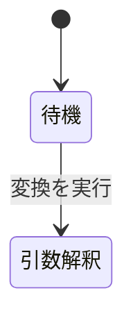

# StrictDoc の `.md` 仕様書 — AI 向け手引き

**本書は、AI がこのフォルダの形式で仕様書を書き、そこから必要な情報を取り出すための手引きである。**

**既にある文法 (`.sgra`) を使って仕様書を書く・読むだけなら、本書 1 つで足りる。**
ほかの解説文書を読む必要はない。

**例外は 1 つだけ** — **文法そのものを新しく起こすときは `basic.sgra` を開いて真似すること。**
`.sgra` の書式は本書には載っていない。ノード型・フィールド・`Role` を足すときも同じである。

このフォルダの構成。**`.md` はすべて文書として解析される** — `exclude_doc_paths` で外したものを除く。

| ファイル | 中身 | 文書になるか |
|---|---|---|
| `basic.sgra` | 文法定義。ノード型・フィールド・`Role` はここで宣言する | — |
| `02-upper.md` | 上位要求 3 件 | `DOC-UPPER` |
| `03-lower.md` | 下位要求 4 件。上位要求へ繋がる | `DOC-LOWER` |
| `04-tests.md` | テストケース 4 件。下位要求へ繋がる | `DOC-TESTS` |
| `05-review.md` | レビュー指摘 2 件。対象の要求へ繋がる | `DOC-REVIEW` |
| `01-guide-for-human.md` | 人間向けの解説書。**AI は読まなくてよい** | `DOC-GUIDE` (要求は無い) |
| `_assets/note.md` | 用語表。リンク先 | `DOC-NOTE` (要求は無い) |
| `_assets/fig-state.md` | 大きい図 1 つ。リンク先 | `DOC-FIG-STATE` (要求は無い) |
| `00-guide-for-AI.md` / `00-queries-for-AI.md` | 本書と詳細版 | **ならない** (`exclude_doc_paths`) |
| `strictdoc_config.py` | プロジェクト設定。`exclude_doc_paths` などを書く | — |

**後の用例 1 は文書を 7 件返す。** 上表のうち「文書になる」もの全部である。
`DOC-GUIDE` / `DOC-NOTE` / `DOC-FIG-STATE` は要求を持たないので、要求を数えるときは混ざらない。

コマンド例は Git Bash で実行する前提で書いてある。

---

## 1. 仕様書を書く

以下は strictdoc 0.27.1 で parse 確認済みの雛形である。`DOCUMENT` / `TEXT` / `SECTION` /
`REQUIREMENT` / カスタムノード型の 5 種が生成される。

```markdown
# 文書のタイトル

**Grammar**: basic.sgra \
**UID**: DOC-UPPER \
**Version**: 1.0

H1 の直下は地の文になる。 UID が無いので要求ではない。

## 章の名前

**Type**: SECTION

章の中の地の文。 `Type` を書かないと、 この段落は要求の本文と見なされる。

## 要求の名前

**UID**: SW-001 \
**STATUS**: Approved

**Statement**: 本システムは、 〜すること。

**Rationale**: そう決めた理由。

## テストケースの名前

**Type**: TEST_CASE \
**UID**: TC-001

**Statement**: 〜の条件で実行する。

**EXPECTED**: 〜になっている。

**Relations**:
- **Type**: `Parent` \
  **ID**: `SW-001` \
  **Role**: `Verifies`
```

行末の `\` は StrictDoc の解析には不要である。StrictDoc 以外の Markdown ビューアで、
連続する行が 1 行に繋がって表示されるのを防ぐために付けている。

### 違反すると export 全体が停止する規則

| 規則 | 違反時のエラーメッセージ |
|---|---|
| ファイルの先頭を H1 で始める。1 ファイルに 1 つだけ | `the document must start with an H1 heading` |
| 見出しの直後に空行を 2 つ以上置かない | `two or more consecutive empty lines are not allowed` |
| フィールド名は文法どおりの綴りで書く | `Invalid requirement field` |
| 文法に `TYPE` という名前のフィールドを作らない | 型の指定に使う名前なので `.md` から書けなくなる |
| 宣言されていない `Role` を書かない | `Semantic error: Requirement relation type/role is not registered: Parent / Verifies` |
| **文法を自分で起こすなら `TEXT` と `SECTION` も宣言する。** 組み込みではない | `Semantic error: Invalid node type: SECTION.` |
| **`SECTION` には `PROPERTIES: IS_COMPOSITE: True` を付ける** | `The SECTION grammar element must be declared as composite.` (Hint に修正例が出る) |

**原因が書かれていないエラーが 1 つある。**

```text
error: A process in the process pool was terminated abruptly while the future was running or pending.
```

**ファイル名も行番号も出ない。** 行継続の `\` が壊れているときなどに出る。
`strictdoc --debug export ...` を付け直すと stack trace が出るので、そこから当たる。

### 実例を見ても分からない規則

- **見出しの直下に置いた文は、暗黙の `Statement` として扱われる。** その結果、その見出しは
  要求ノードになる。要求ではない章には `**Type**: SECTION` を明記する。明記しないと
  「`UID` が無い」という理由で停止する。**ただし H1 の直下だけは例外**で、常に地の文になる
- **フィールド名の大文字小文字**: `Statement` `Title` `Status` `Rationale` `Comment` `Level`
  `Tags` `Prefix` の 8 語だけは大文字小文字を問わない。それ以外は文法どおりに書く
  (`EXPECTED` は通るが `Expected` は停止する)。**判断できないときは全部大文字で書く**
- **繋がりは下位の側に書く。** 下位のノードに `**Relations**:` を置き、親の UID を指す。
  上位の側には何も書かない。親が別のファイルにあってもよい (StrictDoc はプロジェクト全体で
  UID を解決するため)
- **`Role` を書けるのは、その節点型の関係に `ROLE` が宣言されている場合だけである。**
  `basic.sgra` の宣言は次のとおり。**下位要求に `Role` を付けてはならない** —
  テストケースの書き方をそのまま真似すると停止する
  | 節点型 | 書ける関係 |
  |---|---|
  | `REQUIREMENT` | `Parent` / `Child`。**`Role` は付けられない** |
  | `TEST_CASE` | `Parent` + `Role: Verifies` |
  | `FINDING` | `Parent` + `Role: Reviews` |
- **関係の中だけ `**ID**:` である。** ノードの識別子は `**UID**:` だが、`**Relations**:`
  ブロックの中で相手を指すキーは `**ID**:` になる。`**UID**:` と書くと通らない
- **`Type` は `.md` 上でノード型を選ぶための予約語であり、文法のフィールドではない。**
  だから `**Type**: TEST_CASE` は書けるのに、文法に `TYPE` という名前のフィールドは作れない
- **`.sgra` の `FIELDS` は必ずこの順で宣言する** (`.md` に書く順ではない)。
  `UID → STATUS → TITLE → カスタムの単一行フィールド → STATEMENT →
  RATIONALE などの複数行フィールド`。違反しても json / html の export は通ってしまうが、
  `--formats=sdoc` で `.sdoc` に変換して読み戻すと `Wrong field order` で停止する。
  **後から気づけないので、最初からこの順で書くこと**
- **文書の H1 直下に書いて JSON にも残るのは
  `**Grammar**:` `**UID**:` `**Version**:` `**Classification**:` `**Prefix**:` の 5 つだけ**
  (実測)。`**Date**:` や `**Root**:` は**書いても停止しないが JSON から消える。**
  機械で引けなくなるので、後から引きたい情報を文書レベルに置いてはならない
- **フォルダ内の `.md` は、置き場所に関係なくすべて文書として解析される。** `_assets/` の中も
  例外ではないため、そこに置く `.md` にも H1 が必要である
- **文書として解析させたくない `.md` は、`strictdoc_config.py` の `exclude_doc_paths` に
  ファイル名で指定する。** `_assets/**` のようにフォルダごと指定してはならない。指定すると
  画像もコピーされなくなり、export は成功と報告するのに HTML の画像だけが 404 になる
- **図・数式・コード・表・画像の書き方は 2 章にまとめてある。** 罠が多いので、
  これらを書く前に必ず読むこと
- **ノード型・フィールド・`Role` を追加するときは `basic.sgra` に追加する。**
  個別の文書に追加してはならない

**新しくプロジェクトを起こすときの最小構成** (実測):

```text
<プロジェクトフォルダ>/
  basic.sgra        ← 文書と同じフォルダに置く。**Grammar**: basic.sgra はここを指す
  02-upper.md
  03-lower.md
```

**`strictdoc_config.py` は無くても export は通る。** `exclude_doc_paths` や画面の設定が
要るときだけ、このフォルダの直下に置く (親フォルダには置かない。読まれない)。

---

## 2. 図・数式・コードを書く

**以下はすべて strictdoc 0.27.1 で実測した。** 「通る」は export が成功し、意図した
HTML が出たという意味である。

| 記法 | 結果 | 出る HTML |
|---|---|---|
| ` ```mermaid ` フェンス | **通る** | `<pre class="mermaid">` |
| `$E = mc^2$` (インライン) | **通る** | `<span class="math notranslate nohighlight">\( ... \)</span>` |
| `$$ ... $$` (ブロック) | **通る** | `<div class="math notranslate nohighlight">\[ ... \]</div>` |
| ` ```python ` フェンス | 通るが**色は付かない** | `<code class="language-python">` |
| パイプ表 | **通る** | `<table>` |
| `` | **通る** | `` |
| `[LINK: UID]` | **通る** | `<a href="....html#UID">🔗 タイトル</a>` |
| RST の `.. math::` | **通らない** | `<p>.. math::</p>` — ただの段落 |
| `[DOCUMENT_FROM_FILE]` | **通らない** | 下記 2.6 |

**MathJax と Mermaid は出力フォルダに同梱される** (`_static/mathjax/tex-mml-chtml.js` /
`_static/mermaid/mermaid.min.js`)。外部への通信は起きない。設定に足すものは何も無い。

### 2.1 図 — 15 行を超えたら別文書にする

**規則はこれだけである。**

| ` ```mermaid ` フェンスの中身 | 置き場所 |
|---|---|
| **15 行以下** | 本文にそのまま書く |
| **16 行以上** | `_assets/fig-*.md` に独立した文書として置き、本文からは `[LINK:]` で飛ばす |

**行数の数え方は 1 通りしかない。**

- ` ```mermaid ` と閉じの ` ``` ` の**行は数えない**
- `flowchart LR` や `stateDiagram-v2` の**宣言行は数える**
- **空行は数えない**

下の例は **3 行**である (15 行以下なので本文でよい)。

````markdown

````

自分で数えなくてよい。書き終えたら 3 章の**用例 14** のクエリで測れる。

**境界を狙ってはならない。** クエリは空行を落として数えるので、目で数えた行数とずれる。
14 行や 16 行のつもりで書いたものが逆側に落ちる。**明確に小さくするか、迷わず外に出すか
のどちらかにすること。**

**行数で決めているのは、書いている最中に道具無しで判定できるからである。**
本当に効かせたいのは読む側の負担で、その実測値は次のとおり。

| 中身 | tokens |
|---|---:|
| 地の文 1 段落 | 15〜50 |
| 6〜15 行の Mermaid 図 | 124〜179 |
| 16〜24 行の Mermaid 図 | 110〜228 |

**行数とトークン数は綺麗には比例しない** (17 行で 114 tokens の図もあれば、6 行で
124 tokens の図もある)。それでも行数を採る。**迷ったら外に出す。**

外に出す利得も実測してある。このサンプルで:

| 引くもの | tokens |
|---|---:|
| 要求の一覧だけ | **91** |
| 大きい図だけを名指しで | **334** |
| 全 `TEXT` ノード (図も数式も込み) | **10,120** |

**要求を引いている限り、別文書にした図は 1 トークンも課金されない。**
必要なときだけ UID で名指しする。これが 16 行で切る理由である。

**別文書の作り方** — `.md` は置き場所に関係なく文書として解析されるので、
`_assets/` の中でも H1 と `**UID**:` が要る。

````markdown
# 大きい図 - 変換処理の状態遷移

**UID**: DOC-FIG-STATE


````

**`**Grammar**:` の行は要らない** (実測)。書かなければ既定の文法が使われる。
図の文書に要求ノードを入れたい場合も、既定の文法で通る。

本文の側にはリンクを 1 行置く。

```markdown
中断と後始末まで含めた大きい図は別文書にしてある → [LINK: DOC-FIG-STATE]
```

**`.md` には図を本文へ取り込む手段が無い。** リンク先の独立したページに図が出るだけで、
本文には展開されない。`[LINK:]` の文字はリンク先のタイトルから自動で作られ、
**自分では指定できない。**

**★ 名前の規則を 2 つとも守ること。監査クエリ (用例 14) が UID で判定するためである。**

| | 規則 | 例 |
|---|---|---|
| ファイル名 | **`fig-` で始める** | `_assets/fig-state.md` |
| `**UID**:` | **`DOC-FIG-` で始める** | `DOC-FIG-STATE` |

**副作用**: `_assets/*.md` も文書一覧に出る。このサンプルでは `DOC-NOTE` と
`DOC-FIG-STATE` が該当する。**これは許容する方針である。**

**本文から図を外に出すときは、前後の地の文も直すこと。** 「下の図のとおり」「上の流れで」
のような文は、図が消えた瞬間に宙に浮く。**リンクの 1 行に差し替えるだけでは足りない。**

**`exclude_doc_paths` で図の文書を除外してはならない。** 宛先が消えるため、
`[LINK:]` を書いてある側の export が止まる (実測)。

```text
error: DocumentIndex: the inline link references an object with an UID that does not exist: DOC-FIG-STATE.
```

**これは黙って壊れない類のエラーである。** 図を一覧から隠したくなっても、この方法は使えない。

### 2.2 数式 — `$` と `$$` だけ

| 書き方 | 出る形 |
|---|---|
| `$ ... $` | 文の中に埋まる |
| `$$ ... $$` | 独立した行になる |

**RST の `.. math::` は使えない。** 書くと `.. math::` という文字が段落として出る。
**export は止まらないので、HTML を見るまで気づけない。**

**`$$ ... $$` の中で LaTeX の改行 `\\` は使えない。** 1 本に潰れるため、`aligned` や
`pmatrix` で複数行の式を組むと崩れる。export は止まらない。複数行が要るなら
`$$` のブロックを 2 つ並べる。

### 2.3 ★ `$` の罠 — export が原因不明で止まる

**`$` が段落や表のセルの最後の 1 文字になると、HTML の export が止まる。**

```text
error: string index out of range
```

**ファイル名も行番号も出ない。** これは strictdoc 0.27.1 側の不具合である
(`markdown_to_html_fragment_writer.py` の `_math_inline_rule` が範囲外を読む)。

| 書き方 | 結果 |
|---|---|
| `処理時間は $T$` (段落が数式で終わる) | **止まる** |
| `処理時間は $T$ である。` | 通る |
| `\| 記号 \| $T$ \|` (セルが数式で終わる) | **止まる** |
| `\| 記号 \| $T$ 秒 \|` | 通る |
| `\| 記号 \| $$T$$ \|` (セルで `$$` を使う) | 通る |
| `費用は 100 $` (裸の `$` で終わる) | **止まる** |
| `費用は 100 \$` | 通る |
| `` 費用は `100 $` `` (コード印の中) | 通る |
| `$$ ... $$` のブロックが節の最後 | 通る |

**覚えることは 1 つ — 閉じの `$` の後ろに必ず何か字を置く。**
日本語なら文末が「。」で終わるので自然に守られる。**守られないのは表のセルである。**

**もう 1 つ。金額を並べると数式になる。** `費用は $100 から $200` と書くと、2 つの `$`
が数式の区切りと見なされ「100 から」が数式に化ける。export は止まらない。
`\$100` と逃がすか、`` `$100` `` とコード印に入れる。

**`--formats=json` はこの罠を素通しする** (実測)。JSON は正常に出るので、
**JSON だけ見て仕事を終えると、人間が HTML を作った時点で初めて落ちる。**

**だから図・数式・コードを触ったら、必ず次の 2 つを両方通すこと。**

```bash
strictdoc export <仕様書のフォルダ> --formats=json --output-dir <出力先>
strictdoc export <仕様書のフォルダ> --formats=html --output-dir <出力先>
```

JSON が出ていれば、HTML を作る前に危ない行を機械で探せる。**0 件が正常。**
クエリは 3 章の**用例 15** にある (詳細版では G33)。

**表のセルでは `$` を単独で閉じない。** 逃げ方は 2 つあり、**前者を選ぶこと。**

| 書き方 | 出る HTML | 見え方 |
|---|---|---|
| `\| $T$ 秒 \|` (単位や語を足す) | `<span class="math ...">` | **文中に収まる。こちらを使う** |
| `\| $$T$$ \|` (ブロックにする) | `<div class="math ...">` | セルの中で独立した行になり、中央に寄る |

### 2.4 コード — 言語名は必ず書く

````markdown
```python
def convert(src: str, dst: str) -> None:
    os.replace(tmp, dst)
```
````

出力の HTML は `<code class="language-python">` になるが、**StrictDoc は構文強調を
積んでいない** (pygments のスパンは 0 個であることを実測した)。**色は付かない。
これは許容する方針である。**

**それでも言語名は必ず書く。** 言語名は JSON にも原文のまま残るため、後から読む側が
これが何のコードかを判別できる唯一の手掛かりになる。言語名の無いフェンスは
`00-queries-for-AI.md` の G31 で拾えない。

### 2.5 フェンスの中は StrictDoc が一切解釈しない

**Mermaid でもコードでも同じである。** フェンスの中に書いた `[LINK: SW-001]` は
リンクにならず、文字のまま出る。`$` も `|` も `**` も、フェンスの中では何も起こらない。

- 図から要求へ飛ばしたいなら、**リンクはフェンスの外に置く**
- `$` の罠を確実に避けたい文字列は、フェンスかコード印の中に入れる

**クエリのように本文へ ` ``` ` を書きたいときは、囲みを 4 個のバッククォートにする。**
3 個だと囲みが途中で閉じる。4 個は StrictDoc でも正しく解釈される (実測)。

### 2.6 `[DOCUMENT_FROM_FILE]` を書いてはならない

`.sdoc` の取り込み記法である。**`.md` では動かないだけでなく、書き方によっては
黙って壊れる** (実測)。

| 書き方 | 起きること |
|---|---|
| `[DOCUMENT_FROM_FILE]: path` | Markdown のリンク参照定義と解釈され、**行ごと消える** |
| 上を書いた後の `[DOCUMENT_FROM_FILE]` | 上の定義に解決され、**壊れたリンクになる** |
| 単独の `[DOCUMENT_FROM_FILE]` | 文字のまま出る |

**いずれも export は成功する。** 別文書に分けたいときは 2.1 の `[LINK:]` を使う。

### 2.7 表と画像

- 表は**パイプ表だけ**。桁は揃えなくてよい。RST の grid / simple 形式は通らない
- 画像は `_assets/` に置いて `` で参照する。このフォルダは
  StrictDoc が自動でコピーする。**拡大しても崩れない SVG を既定にする**
- **`exclude_doc_paths` に `_assets/**` のようにフォルダを指定してはならない。**
  画像もコピーされなくなり、export は成功と報告するのに HTML の画像だけが 404 になる

---

## 3. 仕様書から必要な部分だけを取り出す

**仕様書の一部だけが必要なとき、`.md` ファイルを読んではならない。**
このフォルダの仕様書 (`02` 〜 `05` と `_assets/`) を全部読むと約 4,100 tokens、
`01-guide-for-human.md` まで含めると約 11,900 tokens を消費する。
JSON に変換して `jq` で取り出せば、要求の一覧は 91 tokens で済む。

### 手順 1 — JSON に変換する

```bash
strictdoc export <仕様書のフォルダ> --formats=json --output-dir <出力先>
```

`<出力先>/json/index.json` が生成される。以下ではこのファイルを `<json>` と表記する。

**`<出力先>` は仕様書のフォルダの外にすること。** `%TEMP%` 配下など、作業用の場所を使う。

正確には、**危ないのは `--formats=sdoc` のときだけである** (実測)。json / html の出力は
StrictDoc が自分で読み飛ばすので、中に置いても壊れない。しかし `sdoc` は解析できる
`.sdoc` を書き出すため、それが次回の入力として拾われ、export 全体が止まる。

```text
error: TraceabilityIndex: the document "A" imports a grammar from a file that does not exist: "basic.sgra".
```

**形式ごとに覚え分けるより、常に外に出すほうが安全である。**

**json と html は同じ `<出力先>` に出してよい** (実測)。`<出力先>/json/` と
`<出力先>/html/` に分かれるので、上書きし合わない。

**`.md` を修正したら、再度この `strictdoc export` を実行すること。**
JSON は自動では更新されない。

**この `index.json` を直接読んではならない** — 約 41,000 tokens ある。
`jq` に読ませるためだけのファイルである。

**StrictDoc 自身にも問い合わせ言語があるが、JSON 出力には効かない。**
`--filter-nodes` は `.sdoc` と HTML の出力しか絞り込まない。`--formats=json` に付けても
**エラーも警告も出さないまま全件が出力される**。絞り込みは `jq` で行う。

### 手順 2 — jq で取り出す

JSON の構造:

```json
{"DOCUMENTS": [
  {"_NODE_TYPE": "DOCUMENT", "UID": "...", "TITLE": "...", "GRAMMAR": {},
   "NODES": [
     {"_NODE_TYPE": "SECTION", "TITLE": "...", "NODES": [
       {"_NODE_TYPE": "TEXT", "_TOC": "2.1.1", "STATEMENT": "地の文。UID は無い"}]},
     {"_NODE_TYPE": "REQUIREMENT", "UID": "...", "TITLE": "...", "STATEMENT": "...",
      "RELATIONS": [{"TYPE": "Parent", "VALUE": "...", "ROLE": "..."}]}]}]}
```

**★ 図・数式・コードは、ほぼ全部 `_NODE_TYPE == "TEXT"` の地の文ノードに入る。**
要求の `STATEMENT` に書くこともできるが、普通は地の文である。
**`TEXT` ノードは `UID` を持たない。** 場所を指すには `_TOC` (`2.1.1` のような階層番号) を
使う。人に伝えるときは**文書の `UID` + `_TOC` + 親の章タイトル**の 3 つで示す。

ノードは入れ子になっている。**平坦化には次の定型を使う。**

```bash
jq -r '.DOCUMENTS[] | recurse(.NODES[]?) | select(._NODE_TYPE=="REQUIREMENT") | .UID + "  " + .TITLE' <json>
```

- ノード型を判定するキーは `_NODE_TYPE` である。**先頭に下線が付く。** `_TOC` `_OPTIONS` も同様
- **`.md` のファイルパスは JSON に入っていない。** 「特定のファイルの要求だけ」を取り出すには、
  文書の `UID` (`DOC-UPPER` など) で絞る。文書の UID は用例 1 で調べる
- `_TOC` は `2.1.1` のような階層番号である。章単位で絞るときに使う
- **JSON に「子」は記録されていない。** ある要求の子を取り出すには、全ノードを走査して
  「親がその要求であるもの」を集める
- `RELATIONS` には `Parent` も `File` も同じ配列に入る。親だけが必要なら
  `select(.TYPE=="Parent")` で絞り込む
- **`--included-documents` を付けてはならない。** 取り込んだ文書が重複し、
  同じ UID が 2 か所に現れる
- `DATE` と `METADATA:` は JSON に含まれない。文書レベルのメタ情報は
  `UID` / `VERSION` / `CLASSIFICATION` / `PREFIX` / `ROOT` のみ
- `-r` を付けると人が読む行として出力され、付けなければ JSON のまま出力される。
  **プログラムで処理するなら付けない**
- 日本語は `index.json` の中では `\uXXXX` に変換されているが、`jq` の出力では
  元の文字に戻る。変換作業は不要である

### 用例

以下はすべて実行して出力を確認したものである。

```bash
# 1. まず何があるか — 文書の一覧
jq -r '.DOCUMENTS[] | (.UID // "-") + "  " + .TITLE' <json>

# 2. 型ごとに使えるフィールド名 (既存プロジェクトのスキーマを JSON から知る。
#    新規に書き起こすときは JSON がまだ無いので、basic.sgra を直接読むこと)
jq -c '[.DOCUMENTS[] | recurse(.NODES[]?) | select(._NODE_TYPE) | {t:._NODE_TYPE, k:keys}] | group_by(.t) | map({(.[0].t): (map(.k)|add|unique)}) | add' <json>

# 3. 要求の一覧を表で (最も安い)
jq -r '.DOCUMENTS[] | recurse(.NODES[]?) | select(._NODE_TYPE=="REQUIREMENT") | [.UID, .STATUS, .TITLE] | @tsv' <json>

# 4. 特定の要求の全フィールド
jq -c 'first(.DOCUMENTS[] | recurse(.NODES[]?) | select(.UID? == "SW-002")) | del(.NODES)' <json>

# 5. 特定の文書だけに絞る (ファイル名では絞れない)
jq -r '.DOCUMENTS[] | select(.UID=="DOC-UPPER") | recurse(.NODES[]?) | select(._NODE_TYPE=="REQUIREMENT") | .UID + "  " + .TITLE' <json>

# 5b. 逆引き — 各ノードがどの文書に属するか
jq -r '.DOCUMENTS[] | .UID as $doc | recurse(.NODES[]?) | select(.UID? and ._NODE_TYPE!="DOCUMENT") | $doc + "  " + .UID + "  " + .TITLE' <json>

# 6. 正規表現で探す (第 2 引数はフラグ。"i" で大小無視。日本語も使える)
jq -r '.DOCUMENTS[] | recurse(.NODES[]?) | select(.TITLE? and (.TITLE | test("変換|検査"; "i"))) | (.UID // "-") + "  " + .TITLE' <json>

# 7. and / or / not — not は後ろに置く
jq -r '.DOCUMENTS[] | recurse(.NODES[]?) | select(._NODE_TYPE=="FINDING" and .SEVERITY=="Major" and .RESOLUTION=="Open") | .UID' <json>
jq -r '.DOCUMENTS[] | recurse(.NODES[]?) | select(._NODE_TYPE=="TEST_CASE" or ._NODE_TYPE=="FINDING") | .UID' <json>
jq -r '.DOCUMENTS[] | recurse(.NODES[]?) | select(.UID? and (._NODE_TYPE=="REQUIREMENT" | not)) | ._NODE_TYPE + " " + .UID' <json>

# 8. 直接の子 (逆引き)
jq -r '.DOCUMENTS[] | recurse(.NODES[]?) | select((.RELATIONS? // []) | any(.TYPE=="Parent" and .VALUE=="SYS-001")) | .UID' <json>

# 9. 親を根までたどる (推移的)。unique でソートされるので出力の順は階層順ではない。
#    どれが根かは、返った UID を用例 4 で開いて RELATIONS が無いことで判定する
jq -r '[.DOCUMENTS[] | recurse(.NODES[]?) | select(._NODE_TYPE and .UID)] as $all
| def anc($u): ($all[] | select(.UID==$u) | .RELATIONS? // [] | .[] | select(.TYPE=="Parent") | .VALUE) as $p | [$p], anc($p);
  [anc("TC-001")] | flatten | unique | .[]' <json>

# 10. テストケースから「直接」指されていない要求。
#     これは推移的なカバレッジではない。このサンプルでは SYS-001..003 が返るが、
#     3 件とも下位要求を経由してテストされている。欠陥ではない。
#     推移的に見るには、返った UID それぞれに用例 9 の逆 (子をたどる) を当てる
jq -r '[.DOCUMENTS[] | recurse(.NODES[]?) | select(._NODE_TYPE=="TEST_CASE") | (.RELATIONS // [])[] | select(.TYPE=="Parent") | .VALUE] as $tested
| .DOCUMENTS[] | recurse(.NODES[]?) | select(._NODE_TYPE=="REQUIREMENT")
| select(.UID | IN($tested[]) | not) | .UID + "  " + .TITLE' <json>

# 11. 存在しない UID を指す関係 (リンク切れ)。0 件が正常
jq -r '[.DOCUMENTS[] | recurse(.NODES[]?) | select(.UID?) | .UID] as $ids
| .DOCUMENTS[] | recurse(.NODES[]?) | select(.UID?) as $n
| ($n.RELATIONS // [])[] | select(.VALUE | IN($ids[]) | not) | $n.UID + " -> " + .VALUE' <json>

# 12. 件数だけ
jq -c '[.DOCUMENTS[] | recurse(.NODES[]?) | select(._NODE_TYPE=="REQUIREMENT")] | length' <json>
```

### 図・数式・コードの用例

**この 2 本は囲みが 4 個のバッククォートになっている。** クエリ本文に ` ``` ` が
出るためである (2.5)。

**13. どこに図・数式・コード・表・画像があるか。** 2 列目は `UID`、無ければ `_TOC`。

````bash
jq -r '.DOCUMENTS[] | .UID as $doc | recurse(.NODES[]?) | select(.STATEMENT?) as $n | $n.STATEMENT as $s
| [$s | split("```") | to_entries[] | select(.key % 2 == 1) | .value | split("\n")[0]] as $lang
| [ (if ($lang | index("mermaid")) then "図" else empty end),
    (if ($s | contains("$$")) then "数式" else empty end),
    (if ($lang | map(select(. != "mermaid" and . != "")) | length) > 0 then "コード" else empty end),
    (if ($s | test("(?m)^[|]")) then "表" else empty end),
    (if ($s | contains("![")) then "画像" else empty end) ] as $k
| select(($k | length) > 0) | $doc + "  " + ($n.UID // $n._TOC // "-") + "  " + ($k | join(","))' <json>
````

```text
DOC-GUIDE  3.2.1  図,画像
DOC-LOWER  6.1  図,数式,コード
DOC-FIG-STATE  1  図
```

**言語名はフェンス 1 個ずつ見ること。** ` ``` ` で切ると奇数番目が必ずフェンスの中身に
なるので、その 1 行目が言語名である。**ノード全体に対して「`mermaid` を含むか」で
判定してはならない** — 図とコードが同じノードに同居すると、コードを取りこぼす。

**14. 図の行数を測る。** 全部の図を並べて見る形。

````bash
jq -r '.DOCUMENTS[] | .UID as $doc | recurse(.NODES[]?) | (.STATEMENT? // "")
| select(contains("```mermaid")) | split("```")[] | select(startswith("mermaid"))
| ltrimstr("mermaid") | split("\n") | map(select(. != "")) | length as $c
| $doc + "  " + ($c | tostring) + " 行  " + (if $c > 15 then "外に出す" else "本文でよい" end)' <json>
````

```text
DOC-GUIDE  8 行  本文でよい
DOC-LOWER  8 行  本文でよい
DOC-FIG-STATE  19 行  外に出す
```

**14b. 規則違反だけを出す。0 件が正常。** 既に外に出した図 (`DOC-FIG-` で始まる文書) を
除くので、**これが 1 行でも返ったら直す仕事がある**という意味になる。

````bash
jq -r '.DOCUMENTS[] | select(.UID | startswith("DOC-FIG-") | not) | .UID as $doc
| recurse(.NODES[]?) | select(.STATEMENT?) as $n | $n.STATEMENT
| select(contains("```mermaid")) | split("```")[] | select(startswith("mermaid"))
| ltrimstr("mermaid") | split("\n") | map(select(. != "")) | length as $c
| select($c > 15) | $doc + "  " + ($n.UID // $n._TOC // "-") + "  " + ($c | tostring) + " 行"' <json>
````

**15. 図の定義を丸ごと取り出す。** 文書の UID で名指しする。

````bash
jq -r '.DOCUMENTS[] | select(.UID == "DOC-FIG-STATE") | recurse(.NODES[]?) | (.STATEMENT? // "")
| select(contains("```mermaid")) | split("```")[] | select(startswith("mermaid")) | ltrimstr("mermaid")' <json>
````

`split("```")` でフェンスを境に切り、`mermaid` で始まる断片だけを拾い、先頭の 7 文字を
落としている。**言語名を変えれば同じ形でコードも取れる** (`startswith("python")`)。

**16. その UID がどのファイルで定義されているかを突き止める。**
**JSON にファイルパスは入っていないので、ここだけは `grep` を使う。**

```bash
grep -rlF '**UID**: DOC-FIG-STATE' <仕様書のフォルダ> --include=*.md
```

**`**UID**:` まで含めて探すこと。** UID だけで探すと `[LINK:]` で参照しているだけの
ファイルも一緒に出る (実測で 5 件出た)。`-F` は `**` を正規表現と解釈させないために要る。

**それでも複数出ることがある。** このフォルダで実行すると 3 件出る — 本当の定義は
`_assets/fig-state.md` だけで、残る 2 件は本書と `00-queries-for-AI.md` が**この書き方を
例として載せているから**である。**解説文書は自分が説明している文字列を含む。**
返ってきたファイルが仕様書なのか手引きなのかは、冒頭の対応表で見分ける。

**17. `$` の罠を含む行 (2.3)。0 件が正常。** 図や数式を書き足したら毎回これを通す。

````bash
jq -r '.DOCUMENTS[] | .UID as $doc | recurse(.NODES[]?) | (.STATEMENT? // "")
| split("```") | to_entries | map(select(.key % 2 == 0) | .value) | .[]
| split("\n")[] | select(test("[^$][$] *$") or test("[^$][$] *[|]"))
| $doc + "  " + .' <json>
````

**★ このクエリが 0 件でも安全とは限らない。** 検出できるのは**落ちる方の罠**
(段落やセルが `$` で終わる) だけである。**2.3 のもう 1 つの罠 —
`費用は $100 から $200` が数式に化ける方 — は落ちないので、このクエリには出ない。**
金額や環境変数を書いたときは、HTML を目で見て確かめること。

### クエリを書くときの 2 つの制約

**1. 正規表現にバックスラッシュを使わない。** `\\[` のような**二重**バックスラッシュは
`bash -c` に渡すと半分に減り、`Invalid escape` で落ちる (実測)。`[$]` `[|]` のような
文字クラスか `split()` / `contains()` で書く。
**`split("\n")` のような単独のバックスラッシュは無事である** (実測)。減るのは二重のときだけ。

**2. どうしても複雑になるならファイルに書く。** `.jq` ファイルに置いて `-f` で渡せば、
シェルを通らないのでバックスラッシュ問題は起きない。

```bash
jq -r -f <クエリを書いたファイル>.jq <json>
```

### 集計するときは `DOC-GUIDE` を除くこと

**`01-guide-for-human.md` は「読まなくてよい」が、JSON には全部入る。**
記法の解説書なので、図・数式・コード・表がどっさり入っている。**用例 13 の出力は
20 行のうち 15 行が `DOC-GUIDE` になる** (実測)。「この一式に図はいくつか」のような
集計は必ず狂うので、仕様書だけを数えるなら先頭に 1 段挟んで除外する。

```bash
jq -r '.DOCUMENTS[] | select(.UID != "DOC-GUIDE") | .UID' <json>
```

**用例 13 から 15 も、集計に使うならこの `select` を足すこと。**
場所を突き止めるために使うだけなら、足さなくてよい。

上で足りないときだけ `00-queries-for-AI.md` を読む。34 本を用途別に分類し、出力例を付けてある
(約 6,800 tokens)。目次・章単位の絞り込み・推移的な子・ROLE での絞り込み・孤立要求の検出・
UID の重複検出のほか、**図の定義の取り出し・15 行規則の監査・数式やコードの抽出・
図を書き換えて `.md` に戻す手順** (G 節) が載っている。
