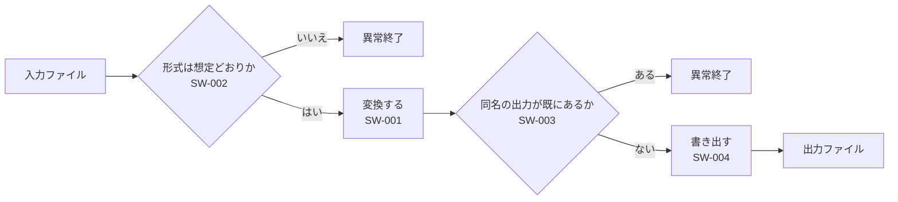

# 基本 - まずこれを読む

**Grammar**: basic.sgra \
**UID**: DOC-GUIDE \
**Version**: 1.0

**本書の目的は、 要求仕様書を初心者と AI がすぐ書けるようにすることである。**
この一式は全部 `.md` で書いてある。

上位要求から下位要求、 テストケース、 レビュー指摘までが**別のファイルに分かれ、
その間が繋がっている。** 自分の仕様書は**この一式を丸ごと写して、 中身を差し替える
ところから始める。**

この段落には UID が無い。 要求ではない地の文である。 StrictDoc は要求と地の文を
別のものとして扱う。 混ぜてよい。

同じ内容を `.sdoc` で書いた一式が `samples/sd-basic-ja/` にある。
**どちらで書いてもトレーサビリティと JSON の中身は同じになる。** 違うのは本文の
書き方だけである。 迷ったときの選び方は次のとおり。

| | `.md` | `.sdoc` |
| --- | --- | --- |
| GitHub などでそのまま読める | **○** | ✗ |
| 表を桁揃えせずに書ける | **○** | `MARKUP: Markdown` を宣言した文書だけ |
| 図の断片を複数の文書から取り込む | ✗ | **○** |
| RST の数式・画像ディレクティブ | ✗ | **○** |
| トレーサビリティ・JSON・全画面 | ○ | ○ (**完全に同じ**) |

`.md` 対応は 0.19.0 (2026-03-15) が初出で、 **公式は今も experimental と表記して
いる。** 長く保守する文書なら `.sdoc` のほうが安全側である。

ファイルの並びは次のとおり。

- `00-guide-for-AI.md` — **AI に渡す手引き。** 本書の内容を、書き方の規則と JSON の
  引き方だけに絞って圧縮したもの。人間が読む必要は無い (`strictdoc_config.py` の
  `exclude_doc_paths` で文書としては除外してある)
- `01-guide-for-human.md` — 本書。 読む順と書き方
- `02-upper.md` — 上位要求 3 件。 何を作るか
- `03-lower.md` — 下位要求 4 件。 どう実現するか。 上位へ結ぶ
- `04-tests.md` — テストケース 4 件。 下位へ結ぶ
- `05-review.md` — レビュー指摘 2 件。 対象の要求へ結ぶ
- `basic.sgra` — 全文書が共有する文法定義
- `strictdoc_config.py` — プロジェクト設定。 **このフォルダ直下に無いと読まれない**
- `_assets/` — 画像とリンク先の `.md`

## 基本

**Type**: SECTION

### 文とタグ

**Type**: SECTION

`.md` の外形は 3 つしかない。

- `#` の見出し — 文書のタイトル。 **1 ファイルに 1 つ、 必ず先頭に置く**
- `##` `###` の見出し — 章、 または要求 1 件
- 行頭の `**キー**:` — フィールド

最小の形はこれだけである。

```text
# 何かの仕様書

## 何かをすること

**UID**: REQ-001

**Statement**: 本システムは、 何かをすること。
```

**見出しの直下に置いた文は、 暗黙の `Statement` として扱われる。** つまり
その見出しは要求ノードになる。 **要求ではない章には型を明示する** — でなければ
文法が要求する `UID` が無いという理由で解析が落ちる。 本書の各章がそうしている。

```text
## 基本

**Type**: SECTION

ここは地の文になる。
```

見出しを `##` `###` と深くすれば章が入れ子になり、 目次も入れ子で出る。
本書の目次を見ること。

文書全体の設定は H1 の直下にまとめて書く。 行末のバックスラッシュは
**StrictDoc の解析には不要**で、 StrictDoc 以外の Markdown ビューアで各行が
離れて表示されるのを防ぐためのものである。

```text
# 基本 - まずこれを読む

**Grammar**: basic.sgra \
**UID**: DOC-GUIDE \
**Version**: 1.0
```

**`Grammar` を外部ファイルに出す理由は、 文書をまたいで揃えるためである。**
この一式では 5 つの文書が同じ `basic.sgra` を読む。 宣言しているのは 4 つの
ノード型である。

- `SECTION` — 章。 入れ子にできる
- `REQUIREMENT` — 要求。 `UID` / `STATUS` / `TITLE` / `STATEMENT` / `RATIONALE`
- `TEST_CASE` — テストケース。 `EXPECTED` を持つ
- `FINDING` — レビュー指摘。 `SEVERITY` と `RESOLUTION` を持つ

後ろの 2 つは **StrictDoc の標準概念ではない。** 文法で足したものである。
**個別の文書にフィールドを足してはならない。** 文書ごとに違う形になり、 どこに
何があるか誰も分からなくなる。 足すときは `basic.sgra` に足す。

**`.md` 固有の落とし穴が 4 つある。 いずれも export 全体を止める。**

| 落とし穴 | 起きること |
| --- | --- |
| H1 が無い / `##` から始まる / 空 | `the document must start with an H1 heading` |
| 見出しの直後に空行が 2 つ以上 | `two or more consecutive empty lines are not allowed` |
| カスタムフィールドの綴りが文法と違う | `Invalid requirement field` |
| 文法に `TYPE` という名前のフィールドを作る | 型の指定に使われる名前なので書けなくなる |

3 つめには**非対称がある。** `Statement` `Title` `Status` `Rationale` `Comment`
`Level` `Tags` `Prefix` の 8 語だけは大文字小文字を問わない。 それ以外は
**文法に書いたとおりの綴りで書く。** `EXPECTED` は通るが `Expected` は落ちる。
**覚えるしかない。** 迷ったらカスタムフィールドは全部大文字で書けばよい。

### 上位要求と下位要求

**Type**: SECTION

**繋がりは下位の側に書く。** 下位のノードに `Relations` を置き、 親の UID を
指す。 上位の側には何も書かない。

```text
**Relations**:
- **Type**: `Parent` \
  **ID**: `SYS-001`
```

**親は別のファイルにいてよい。** StrictDoc はプロジェクト全体の UID を 1 つの表に
集めてから関係を解決するので、 ファイルの境目は関係しない。 **`.md` と `.sdoc` が
混ざっていても同じである。** この一式が実際にファイルをまたいでいる。

```text
02-upper.md   SYS-001   SYS-002   SYS-003
                 |         |         |
03-lower.md   SW-001    SW-002    SW-003 / SW-004
                 |         |         |
04-tests.md   TC-001    TC-002    TC-003 / TC-004
```

**`Role` を足すと関係に意味が付く。** 種類は `Parent` のままでよい。

```text
**Relations**:
- **Type**: `Parent` \
  **ID**: `SW-001` \
  **Role**: `Verifies`
```

`04-tests.md` は `Verifies`、 `05-review.md` は `Reviews` を使っている。
**`Role` は使う前に文法側で宣言しておく。** 宣言していない値を書くと落ちる。

繋がりの確認は画面で行う。 文書の上の **VIEWS** から
`TRACEABILITY` / `DEEP TRACEABILITY` を開くと親子が並び、 左のツールバーの
**トレーサビリティマトリクス**を開くと、 どの要求がテストで覆えていないかが
一覧で出る。

## 添付

**Type**: SECTION

### リンク

**Type**: SECTION

他の `.md` へリンクを張れる。 宛先は `_assets/note.md` である →
[LINK: DOC-NOTE]

**必要なのは、 宛先の側が見出しの直下で UID を宣言していることだけである。**

```text
# 用語の対応表

**UID**: DOC-NOTE
```

**出力先のパスは書かない。** StrictDoc が UID から解決する。 リンクに出る文字は
宛先のタイトルから自動で作られ、 **自分では指定できない。** 宛先は要求でもよく、
`[LINK: SW-001]` と同じ書き方で書ける。 **見出しごとに UID を宣言すれば、
文書の途中へも飛べる。**

**プロジェクト内の `.md` は、 置き場所に関係なく全部が文書として解析される。**
`_assets/` の中も例外ではない。 だから `_assets/note.md` も `#` の見出しで
始まっている。 **見出しの無い `.md` が 1 つあると export 全体が止まる。**
どうしても文書にできないものは `strictdoc_config.py` の `exclude_doc_paths` で
名指しして外す。

**除外はファイル単位で書く。 フォルダごと除外してはならない。**

```python
exclude_doc_paths=["_assets/notes.md"]   # OK。 その 1 ファイルだけ外れる
exclude_doc_paths=["_assets/**"]         # 駄目。 画像も一緒に消える
```

後者はフォルダを走査から外すため、 **アセット置き場としても認識されず画像が
コピーされない。** それでも export は成功と報告し、 出来上がった HTML の画像だけが
404 になる。 気づきにくい。

### 図

**Type**: SECTION

**`.md` では Mermaid のコードフェンスがそのまま図になる。** これが最短の書き方で
あり、 `.sdoc` のように断片ファイルへ外に出す必要が無い。



画像ファイルは `_assets/` に置いて `` で埋め込む。 このフォルダは
StrictDoc が自動でコピーするので、 設定に何も足さなくてよい。 **拡大しても
崩れないので SVG を既定にする。**


**`.md` には図の断片を取り込む手段が無い。** `.sdoc` の
`[DOCUMENT_FROM_FILE]` に相当するものが無く、 書いてもただの文字として表示される。
**同じ図を 2 か所で見せたいなら、 図を持つ文書へ `[LINK:]` で飛ばす。**
どうしても本文へ展開したいなら、 その文書だけ `.sdoc` にする
(`samples/sd-basic-ja/01-guide-for-human.sdoc` がその形)。

## 表

**Type**: SECTION

**`.md` の表はパイプ表だけである。 そして桁を揃えなくても通る。**

| 表の形式 | `.md` | 桁がずれたとき |
| --- | --- | --- |
| パイプ | **○** | 耐える |
| RST の grid 形式 | ✗ | — |
| RST の simple 形式 | ✗ | — |

上の表は列幅を揃えていないが、 そのまま通っている。 **これが `.md` の最大の
利点である。** `.sdoc` の grid 形式は 1 桁ずれると export 全体が止まり、
桁は文字数ではなく**表示幅**で数える (全角 1 文字が 2 桁)。 手で表を書き足して
いく文書では、 この差がそのまま作業量の差になる。

`.sdoc` でパイプ表を使いたい場合は `MARKUP: Markdown` を宣言する。 例は
`samples/sd-basic-ja/06-markdown.sdoc` にある。

## JSON で引く

**Type**: SECTION

**仕様書の全量を JSON に出し、 そこから `jq` で欲しい部分だけを引く。**
これが本章のすべてである。 絞り込みは JSON を出した**後**に行う。

**StrictDoc 自身にも問い合わせ言語があるが、 JSON には効かない。** `--filter-nodes`
は `.sdoc` と HTML の出力しか絞らず、 `--formats=json` に付けても**エラーも警告も
出さないまま全件が出る** (0.27.1 で実測)。 **だから「全量を出してから引く」以外の
道は無い。** 絞るのは `jq` の仕事である。

### 全量 JSON を出す

**Type**: SECTION

**出力は 3 種類ある。 HTML は人が読むため、 JSON は機械が引くため、
`.sdoc` への変換は書式を乗り換えるためのものである。**

```bash
strictdoc export --formats=json --output-dir out .
```

JSON は `out/json/index.json` に出る。 **要求を直したら毎回出し直す。**
`--formats=json` に絞り込みの指定は無い。 **常に全量が出る。**

**HTML を読むだけなら export は要らない。** このフォルダを
`launch-strictdoc.bat` にドラッグすればサーバが立ち上がり、 編集して保存すれば
約 0.6 秒で画面に反映される。 書式の乗り換えは次の章にまとめてある。

### jq で引く

**Type**: SECTION

**`jq` は JSON 専用の小さなコマンドである。** StrictDoc とは無関係の道具で、
`setup-strictdoc.bat` が既定で入れている。 JSON を読み込み、 書いた条件に合うものだけを
出す。

```bash
jq -r -f q-open-findings.jq out/json/index.json
```

`q-open-findings.jq` の中身は、 例えば未対処の指摘を出すならこうなる。

```text
.DOCUMENTS[] | recurse(.NODES[]?)
| select(._NODE_TYPE == "FINDING" and .RESOLUTION == "Open")
| .UID + "  " + .SEVERITY + "  " + .TITLE
```

**先頭の `.` は「入力そのもの」を指す。** そこから `.名前` で下へ降り、 `[]` で配列を
バラす。 `.DOCUMENTS[]` は「入力の `DOCUMENTS` を 1 個ずつ」の意味である。
`.` はオプションではなくフィルタ本体で、 `jq [オプション] <フィルタ> [ファイル]`
の真ん中に来る。

**ノード型を引くキーは `_NODE_TYPE` である。** 文法に書いた `FINDING` という名前が
そこに入る。 先頭に下線が付くので**書き間違えやすい。** この一式に当てた実際の
出力はこうなる。

```text
RV-001  Major  SW-002 の検査方法が決まっていない
RV-002  Question  SYS-003 に上書きを許す手段が無い
```

**同じフィルタを `samples/sd-basic-ja/` の JSON に当てても出力は 1 文字も
変わらない。** これが「どちらで書いても JSON は同じ」の実物である。

**フィルタを文字列で渡さずファイルに書くのは PowerShell のためである。**
PowerShell はクォートの中の二重引用符を落とすので、 フィルタを直接引数に書く形が
壊れる。 `-f` ならどの shell でも同じに動く。

**cmd.exe で日本語を渡すときは、 先に `chcp 65001` を打つ。** 既定の cp932 のままだと
`jq -r --arg kw 変換 -f ...` は**エラーも出さずに 0 件**を返す。 PowerShell では要らない。

クエリの実例は `docs/03-sdoc-json-queries.md` に 7 本ある。

### 答えを JSON のまま受け取る

**Type**: SECTION

**`-r` を付けなければ、 答えは JSON のまま出る。** 上の例は `-r` を付けて人が読む行を
作っていた。 プログラムに渡すなら付けない。

```bash
jq -f q-findings-json.jq out/json/index.json
```

```text
[ .DOCUMENTS[] | recurse(.NODES[]?) | select(._NODE_TYPE == "FINDING") ]
| map({UID, SEVERITY, RESOLUTION, TITLE})
```

```json
[
  {
    "UID": "RV-001",
    "SEVERITY": "Major",
    "RESOLUTION": "Open",
    "TITLE": "SW-002 の検査方法が決まっていない"
  },
  {
    "UID": "RV-002",
    "SEVERITY": "Question",
    "RESOLUTION": "Open",
    "TITLE": "SYS-003 に上書きを許す手段が無い"
  }
]
```

**外側の `[ ... ]` は、 1 個ずつ出てくる結果を 1 つの配列にまとめるためのものである。**
これが無いと JSON の値が縦に並ぶだけで、 配列にはならない。
`map({UID, SEVERITY, RESOLUTION, TITLE})` は欲しい欄だけを残す書き方で、 全部の欄が
要るなら `| map(...)` の行ごと外す。

### 日本語について

**Type**: SECTION

**`index.json` の中で日本語は `\uXXXX` に化けている。** この文書のタイトルは、
ファイルの中ではこう書かれている。

```text
"TITLE": "\u57fa\u672c - \u307e\u305a\u3053\u308c\u3092\u8aad\u3080",
```

StrictDoc が `json.dumps(..., indent=4)` をそのまま呼んでおり、 Python の既定で
非 ASCII がすべてエスケープされるためである。 **これを変える設定もオプションも
StrictDoc 側に無い。**

**`jq` で引いている限り、 これは目に入らない。** jq が読み込むときに元の文字へ戻すので、
上の出力例はどれも読める形で出ている。 **効くのは JSON ファイルそのものを人や機械へ
渡す場面だけである。** その場合は jq を 1 回通せば直る。

```bash
jq . out/json/index.json > readable.json
```

**`.` は何も絞り込まないので中身は 1 文字も変わらない。** 変わるのは表記だけで、
**しかも小さくなる。**

| ファイル | バイト | `.md` 一式 (26,273 バイト) 比 |
|---|---:|---:|
| `index.json` (そのまま) | 84,932 | 3.23 |
| `jq .` を通したもの | 53,242 | 2.03 |
| `jq -c .` を通したもの | 35,035 | 1.33 |

日本語 1 文字が `検` の 6 バイトから UTF-8 の 3 バイトに戻り、 字下げも
4 スペースから 2 スペースになる。 `-c` は字下げと改行そのものを外す。

**この書き出しを PowerShell でやってはならない。** PowerShell の `>` は UTF-16 で
書くため、 jq が読めないファイルができる。 cmd.exe で打つか、
`cmd /c 'jq . out/json/index.json > readable.json'` の形にする。

**JSON を「軽いから」と説明してはならない。** 上表のとおり、 一番縮めても元の文書より
大きい。 値打ちは小ささではなく、 **全文を読まずに答えだけを引けること**の側にある。

## .md と .sdoc を行き来する

**Type**: SECTION

`--formats=sdoc` で `.md` を `.sdoc` に変換できる。 逆向きは
`--formats=markdown` である。 **どちらも往復できる。**

```bash
strictdoc export --formats=sdoc --output-dir out .
```

**`strictdoc convert` はこれには使えない。** あちらは Excel と ReqIF 専用で、
`.md` を受け付けない。

**`.md` で新規作成すれば、 ブラウザの編集画面だけで Markdown 記法が使える。**
`.sdoc` で作った文書をブラウザから Markdown に切り替える手段は無いので、
これは `.md` を選ぶ実際的な理由の 1 つである。

変換のときに知っておくことが 3 つある。

1. **`OPTIONS: MARKUP: Markdown` が自動で付く。** 本文が Markdown のまま解釈され
   続けるためである。 RST に直したいなら、 その行を自分で消してから本文を
   書き換える。
2. **`METADATA:` ブロックが増える。** H1 直下に書いた `UID` と `Version` が
   `[DOCUMENT]` の欄と `METADATA:` の両方に現れる。 値は失われないが、
   同じものが 2 か所に出るので、 変換後に手で消してよい。
3. **`Wrong field order` に注意する。** 変換した `.sdoc` を StrictDoc が読み戻す
   とき、 フィールドは決まった順序で並ぶ。 文法がその順に宣言されていないと
   落ちる。

順序は次のとおりである。

```text
UID → STATUS → TITLE → カスタムの単一行フィールド → STATEMENT
    → RATIONALE などの残りの複数行フィールド
```

**`basic.sgra` はこの順に宣言してある。** だからこの一式は往復できる —
`--formats=sdoc` で変換した 5 文書をそのまま export し直せることを 0.27.1 で
確認済みである。 自分の文法を作るときは、 この順序を崩さないこと。
