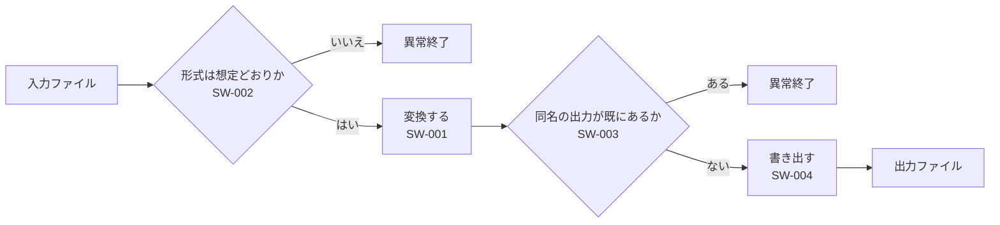

# まずこれを読む

**Grammar**: basic.sgra \
**UID**: DOC-GUIDE \
**Version**: 1.0

本書は、 初心者と AI に StrictDoc による仕様書の書き方を伝える。
この一式は全部 `.md` で書いてある。

StrictDoc は、 要求仕様書をテキストファイルで書き、 要求どうしの繋がりを機械に
管理させる道具である。 書き手は `.md` を書き、 StrictDoc は人が読む HTML と、
機械が引く JSON を出す。 導入とサーバの起動は、 この一式ではなくリポジトリ直下の
`setup-strictdoc.bat` と `launch-strictdoc.bat` が行う。 このフォルダを
`launch-strictdoc.bat` にドラッグすれば、 ブラウザでこの一式が開く。

上位要求から下位要求、 テストケースまでが別のファイルに分かれ、
その間が繋がっている。 レビューの結果は要求そのものに書く。 自分の仕様書は
この一式を丸ごと写して、 中身を差し替えるところから始める。

この段落には UID が無い。 要求ではない地の文である。 StrictDoc は要求と地の文を
別のものとして扱う。 混ぜてよい。

同じ内容を `.sdoc` で書いた一式が `samples/sd-basic-ja/` にある。
文法ファイルは 1 文字も違わず、 要求の UID と文面も同じである。
違いは 2 つある。 あちらは `MARKUP: Markdown` を宣言した `05-markdown.sdoc` と
その中の要求 `SW-005` を持ち、 こちらは `04-usecases.md` のユースケース層を持つ
(あちらにはまだ無い)。 迷ったときの選び方は次のとおり。

| | `.md` | `.sdoc` |
| --- | --- | --- |
| GitHub などでそのまま読める | ○ | ✗ |
| 表を桁揃えせずに書ける | ○ | `MARKUP: Markdown` を宣言した文書だけ |
| 図の断片を複数の文書から取り込む | ✗ | ○ |
| RST の数式・画像ディレクティブ | ✗ | ○ |
| トレーサビリティ・JSON・全画面 | ○ | ○ (完全に同じ) |

`.md` 対応は 0.19.0 (2026-03-15) が初出で、 公式は今も experimental と表記して
いる。 長く保守する文書なら `.sdoc` のほうが安全側である。

ファイルの並びは次のとおり。

**番号はファイルの並び順であって、 読む順ではない。** 読む順は読み手によって違う。

- 人間 — 本書 (`02`) から始め、 `03` から `07` の仕様書を順に読む。 レビューの
  進め方は `08`、 道具の使い方が要るときに `09` と `10` を開く。 `00` と `01` は
  AI 向けなので飛ばしてよい
- AI — `00` から始め、 クエリが要るときだけ `01` を開く

`.md` の 11 個と `_assets/` の 2 つ、 合わせて 13 個が StrictDoc の文書になる。

- `00-ai-guide.md` — AI に渡す手引き。 本書の内容を、 書き方の規則と JSON の
  引き方だけに絞って圧縮したもの。 人間が読む必要は無いが、 左の一覧から開いて
  中身を確かめられる（この一式は AI 向けの文書も隠さない方針である）
- `01-ai-queries.md` — 上の詳細版。 jq のクエリ集。 これも AI 向け
- `02-guide-for-human.md` — 本書。 読む順と書き方
- `03-architecture.md` — システム構成。 何をどう組んで上位要求を満たすかの見取り図。
  要求は持たない
- `04-usecases.md` — ユースケース 1 件。 利用者がどう使うかを Cockburn の形式で書く。
  上位要求はここから出てくる
- `05-upper.md` — 上位要求 3 件。 何を作るか
- `06-lower.md` — 下位要求 4 件。 どう実現するか。 上位へ結ぶ
- `07-tests.md` — テストケース 4 件。 下位へ結ぶ
- `08-review.md` — レビューの進め方。 指摘は要求そのものに書く。
  仕様書の本体ではなく、 進め方の説明である
- `09-browser-guide.md` — ブラウザから仕様書を作り、 直し、 見る方法。
  `strictdoc server` の画面の手引きで、 画面の写真が入っている
- `10-cowork-with-claude.md` — 同梱の `strictdoc-md` スキルで、 Claude Code に
  仕様書を書かせ、 調べさせ、 レビューさせる方法
- `basic.sgra` — 全文書が共有する文法定義
- `strictdoc_config.py` — プロジェクト設定。 StrictDoc はこのフォルダの直下しか見ない
- `_assets/` — 添付ファイル置き場。 画像に限らない。 リンク先の `.md`、 図の `.svg`、
  資料の `.csv` などを種類を問わず置ける。 StrictDoc がそのまま出力へ複製する
- `strictdoc-quirks.tsv` — AI が踏んだ StrictDoc の癖を 1 行ずつ書き足す記録。
  版が上がったときや行が溜まったときに読み、 手引きを直す材料にする。
  StrictDoc は `.tsv` を解析しないので、 文書には影響しない

## 基本

**Type**: SECTION

### 文とタグ

**Type**: SECTION

`.md` の外形は 3 つしかない。

- `#` の見出し — 文書のタイトル。 1 ファイルに 1 つ、 必ず先頭に置く
- `##` `###` の見出し — 章、 または要求 1 件
- 行頭の `**キー**:` — フィールド

最小の形はこれだけである。

```text
# 何かの仕様書

## 何かをすること

**UID**: REQ-001

**Statement**: 本システムは、 何かをすること。
```

**StrictDoc は、 見出しの直下に置いた文を暗黙の `Statement` として扱う。** つまり
その見出しは要求ノードになる。 要求ではない章には型を明示する — でなければ
文法が要求する `UID` が無いという理由で解析が落ちる。 本書の各章がそうしている。

```text
## 基本

**Type**: SECTION

ここは地の文になる。
```

見出しを `##` `###` と深くすれば章が入れ子になり、 目次も入れ子で出る。
本書の目次を見ること。

文書全体の設定は H1 の直下にまとめて書く。 行末のバックスラッシュは
StrictDoc の解析には不要である。 StrictDoc 以外の Markdown ビューアが各行を
離して表示してしまうので、 それをこの記号が防ぐ。

```text
# まずこれを読む

**Grammar**: basic.sgra \
**UID**: DOC-GUIDE \
**Version**: 1.0
```

`Grammar` を外部ファイルに出す理由は、 文書をまたいで揃えるためである。
この一式では 10 の文書が同じ `basic.sgra` を読む。 宣言しているのは 4 つの
ノード型である。

- `SECTION` — 章。 入れ子にできる
- `REQUIREMENT` — 要求。 `UID` / `STATUS` / `TITLE` / `REVIEW_STATUS` /
  `STATEMENT` / `RATIONALE` / `REVIEW_COMMENT` / `REVIEW_ACTION`
- `USE_CASE` — ユースケース。 `UID` / `TITLE` / `UC_LEVEL` / `REVIEW_STATUS` /
  `STATEMENT` / `REVIEW_COMMENT` / `REVIEW_ACTION`
- `TEST_CASE` — テストケース。 Gherkin の `GIVEN` / `WHEN` / `THEN` と、
  `TEST_RESULT` / `ISSUE_KEY` / `TEST_REMARK` を持つ。 `STATEMENT` は持たない

### ノード型もフィールドも好きなだけ足してよい

**Type**: SECTION

StrictDoc が最初から持っているノード型は `SECTION` と `TEXT` と `REQUIREMENT` の
3 つだけである。 上の一覧のうち `USE_CASE` と `TEST_CASE` は、 この一式が
`basic.sgra` で作ったものである。 `REQUIREMENT` に付いている `REVIEW_STATUS` /
`REVIEW_COMMENT` / `REVIEW_ACTION` と、 `USE_CASE` の `UC_LEVEL` も同じで、
標準には無い。

つまり、 自分の仕事に要る型と欄は自分で足す。 部品・リスク・変更要求・
安全目標 — 何を作ってもよい。 StrictDoc 側に許可を求める必要は無く、 上限も無い。
書き方は `.sgra` に 1 ブロック足すだけである。

```text
- TAG: RISK                       <- 型の名前。 `.md` では **Type**: RISK と書く
  FIELDS:
  - TITLE: UID
    TYPE: String
    REQUIRED: True
  - TITLE: TITLE
    TYPE: String
    REQUIRED: True
  - TITLE: SEVERITY               <- 値を 3 つに閉じる。 綴り間違いを StrictDoc が拒む
    TYPE: SingleChoice(Low, Middle, High)
    REQUIRED: True
  - TITLE: STATEMENT
    TYPE: String
    REQUIRED: True
  RELATIONS:
  - TYPE: Parent
```

**足すかどうかの基準は UID と同じである — 後から名前で引きたいなら欄にする。**
引かないものは本文に書けばよい。 `04-usecases.md` はこの基準で `UC_LEVEL` だけを
欄にし、 Cockburn の残りの項目は全部本文に書いている。 欄を増やすほど良いのではない。
増えた欄は、 本文と食い違ったときにどちらを信じるのかという問いを連れてくる。

守るべき規則は 4 つだけである。

| 規則 | 理由 |
|---|---|
| 足すのは `.sgra` であって個別の文書ではない | 文書ごとに違う形になり、 どこに何があるか誰も分からなくなる |
| `TITLE` は `MID` / `UID` / `LEVEL` / `STATUS` / `TAGS` の後ろ、 独自の欄すべての前に置く | `.md` の `TITLE` は見出しから来るため、 StrictDoc がこの位置に差し込む。 崩すと `Wrong field order` で止まる (実測) |
| 本文欄の名前は `STATEMENT` にする | StrictDoc は本文に当たる欄の名前を決め打ちで探す |
| `LEVEL` という名前は使わない | 組み込みの `Level` (目次の水準) と衝突する。 export は成功したまま目次の番号が壊れる (実測)。 `UC_LEVEL` のように前置きを付ける |

使い方は `08-review.md` にある (`REVIEW_*` の 3 項目)。

**`.md` 固有の落とし穴が 4 つある。 いずれも export 全体を止める。**

| 落とし穴 | 起きること |
| --- | --- |
| H1 が無い / `##` から始まる / 空 | `the document must start with an H1 heading` |
| 見出しの直後に空行が 2 つ以上 | `two or more consecutive empty lines are not allowed` |
| カスタムフィールドの綴りが文法と違う | `Invalid requirement field` |
| `TYPE` というフィールドを `**Type**:` と書く | StrictDoc がノード型の指定と解釈する。 `**TYPE**:` と大文字で書けば通る |

3 つめには非対称がある。 `Statement` `Title` `Status` `Rationale` `Comment`
`Level` `Tags` `Prefix` の 8 語だけは大文字小文字を問わない。 それ以外は
**文法に書いたとおりの綴りで書く。** `GIVEN` は通るが `Given` は落ちる。
覚えるしかない。 迷ったらカスタムフィールドは全部大文字で書けばよい。

### 上位要求と下位要求

**Type**: SECTION

**繋がりは常に子の側に書く。** 子のノードに `Relations` を置き、 親の UID を指す。
親の側には何も書かない。

```text
**Relations**:
- **Type**: `Parent` \
  **ID**: `SYS-001`
```

「下位要求だから書く」のではなく「子だから書く」ことに注意する。
`05-upper.md` の上位要求も `Relations` を持っているが、 あれは上位要求が
ユースケースの子だからである。 **上位・下位は文書の役割の呼び名であって、
親子の向きとは別物である。**

親は別のファイルにいてよい。 StrictDoc はプロジェクト全体の UID を 1 つの表に
集めてから関係を解決するので、 ファイルの境目は関係しない。 `.md` と `.sdoc` が
混ざっていても同じである。 この一式が実際にファイルをまたいでいる。

```text
04-usecases.md            UC-001 (UserGoal)
                             |
05-upper.md   SYS-001     SYS-002     SYS-003
                 |           |           |
06-lower.md   SW-001      SW-002      SW-003 / SW-004
                 |           |           |
07-tests.md   TC-001      TC-002      TC-003 / TC-004
                 `-----------+-----------'
                             |
                          UC-001 (受入の判定として再び指す)
```

根は `UC-001` の 1 つ、 葉はテスト 4 件だけである。 利用者の目的から検証までが
1 本に繋がっている。 テストが `UC-001` を 2 度目に指しているのは、 同じ 4 件が
下位要求を 1 つずつ覆うと同時に、 ユースケースの 4 本の筋道をそのままなぞっている
ためである。

`Role` を足すと関係に意味が付く。 種類は `Parent` のままでよい。

```text
**Relations**:
- **Type**: `Parent` \
  **ID**: `SW-001` \
  **Role**: `Verifies`
```

`07-tests.md` が `Verifies` を使っている。
`Role` は使う前に文法側で宣言しておく。 宣言していない値を書くと落ちる。

繋がりの確認は画面で行う。 文書の上の VIEWS から
`TRACEABILITY` / `DEEP TRACEABILITY` を開くと親子が並び、 左のツールバーの
トレーサビリティマトリクスを開くと、 どの要求がテストで覆えていないかが
一覧で出る。

## 添付

**Type**: SECTION

### リンク

**Type**: SECTION

他の `.md` へリンクを張れる。 宛先は `_assets/note.md` である →
[LINK: DOC-NOTE]

必要なのは、 宛先の側が見出しの直下で UID を宣言していることだけである。

```text
# 用語の対応表

**UID**: DOC-NOTE
```

出力先のパスは書かない。 StrictDoc が UID から解決する。 リンクに出る文字は
StrictDoc が宛先のタイトルから自動で作る。 書き手はその文字を指定できない。 宛先は要求でもよく、
`[LINK: SW-001]` と同じ書き方で書ける。 見出しごとに UID を宣言すれば、
文書の途中へも飛べる。

StrictDoc はプロジェクト内の `.md` を、 置き場所に関係なく全部文書として解析する。
`_assets/` の中も例外ではない。 だから `_assets/note.md` も `#` の見出しで
始まっている。 **見出しの無い `.md` が 1 つあると export 全体が止まる。**
どうしても文書にできないものは `strictdoc_config.py` の `exclude_doc_paths` で
名指しして外す。

**除外はファイル単位で書く。 フォルダごと除外してはならない。**

```python
exclude_doc_paths=["_assets/draft.md"]   # OK。 その 1 ファイルだけ外れる
exclude_doc_paths=["_assets/**"]         # 駄目。 画像も一緒に消える
```

後者はフォルダごと走査から外すので、 StrictDoc はそこをアセット置き場とも見なさず、
画像を 1 つもコピーしない。 それでも export は成功と報告し、 出来上がった HTML の画像だけが
404 になる。 気づきにくい。

### 図

**Type**: SECTION

`.md` では Mermaid のコードフェンスがそのまま図になる。 これが最短の書き方で
あり、 `.sdoc` のように断片ファイルへ外に出す必要が無い。



画像ファイルは `_assets/` に置いて `` で埋め込む。 このフォルダは
StrictDoc が自動でコピーするので、 設定に何も足さなくてよい。 拡大しても
崩れないので SVG を既定にする。


`.md` には図の断片を取り込む手段が無い。 `.sdoc` の
`[DOCUMENT_FROM_FILE]` に相当するものが無く、 書いても StrictDoc はただの文字として出す。
同じ図を 2 か所で見せたいなら、 図を持つ文書へ `[LINK:]` で飛ばす。
どうしても本文へ展開したいなら、 その文書だけ `.sdoc` にする
(`samples/sd-basic-ja/00-guide-for-human.sdoc` がその形)。

#### 大きい図は本文に置かない

**Type**: SECTION

**規則はこれだけである — コードフェンスの中身が 15 行以下なら本文、
16 行以上なら `_assets/fig-*.md` に独立した文書として置き、 本文からは
`[LINK:]` で飛ばす。**

| フェンスの中身 | 置き場所 | 本文からの見え方 |
| --- | --- | --- |
| 15 行以下 | 本文にそのまま | 図がその場に出る |
| 16 行以上 | `_assets/fig-*.md` | リンクが 1 行出る。 図は飛んだ先 |

上の流れ図は 8 行なので本文に置いてある。 中断と後始末まで描き足した版は 15 行を
超えたので別文書にした →  [LINK: DOC-FIG-STATE]

行数で決めているのは、 数えるのに道具が要らないからである。 本当に効かせたいのは
読む側の負担で、 その実測値は次のとおり (このリポジトリの Mermaid 図を全部測った)。

| フェンスの中身 | 読むのにかかる量 |
| --- | --- |
| 地の文 1 段落 | 15〜50 tokens |
| 6〜15 行の図 | 124〜179 tokens |
| 16〜24 行の図 | 110〜228 tokens |

行数とトークン数は綺麗には比例しない — 17 行で 114 tokens の図もあれば、 6 行で
124 tokens の図もある。 それでも行数を採る。 書き手が書いている最中に迷わず判定できる
基準でなければ、 誰もその規則を守らないからである。 迷ったら外に出す。

別文書にすると、 その図は「要求を引く」作業から完全に外れる。 要求の一覧を
取り出すクエリは別文書に一切触れないため、 図の分の負担が 0 になる。 図が要るときだけ
UID で名指しして取りに行く。 これが 16 行で切る理由である。

副作用が 1 つある。 StrictDoc は `_assets/*.md` も文書として解析するので、 文書の一覧に並ぶ。
このサンプルでは `DOC-NOTE` と `DOC-FIG-STATE` がそれである。 図を増やすほど一覧が
伸びる。 `fig-` で始める命名にしてあるのは、 一覧の中で図だと見分けるためである。

**一覧から隠そうとして `exclude_doc_paths` に入れてはならない。** 宛先が消えるので、
`[LINK:]` を書いてある側の export が止まる。

```text
error: DocumentIndex: the inline link references an object with an UID that does not exist: DOC-FIG-STATE.
```

黙って壊れはしないが、 逃げ道も無い。 一覧に図が並ぶことは受け入れる。

## 表

**Type**: SECTION

**`.md` の表はパイプ表だけである。 そして桁を揃えなくても通る。**

| 表の形式 | `.md` | 桁がずれたとき |
| --- | --- | --- |
| パイプ | ○ | 耐える |
| RST の grid 形式 | ✗ | — |
| RST の simple 形式 | ✗ | — |

上の表は列幅を揃えていないが、 そのまま通っている。 これが `.md` の最大の
利点である。 `.sdoc` の grid 形式は 1 桁ずれると export 全体が止まり、
桁は文字数ではなく表示幅で数える (全角 1 文字が 2 桁)。 手で表を書き足して
いく文書では、 この差がそのまま作業量の差になる。

`.sdoc` でパイプ表を使いたい場合は `MARKUP: Markdown` を宣言する。 例は
`samples/sd-basic-ja/05-markdown.sdoc` にある。

## 数式

**Type**: SECTION

`.md` の数式は `$` と `$$` の 2 つだけである。 MathJax が同梱されており、
出力フォルダの `_static/mathjax/` から読み込まれる。 外部への通信は起きないので、
社内ネットワークでも切れない。

| 書き方 | 出る形 | 使いどころ |
| --- | --- | --- |
| `$ ... $` | 文の中に埋まる | 記号 1 つ、 短い式 |
| `$$ ... $$` | 独立した行になり中央に寄る | 見せたい式 |
| RST の `.. math::` | 使えない | — |

RST の書き方は `.md` では効かない。 書くと `.. math::` という文字がそのまま段落として
出る。 export は止まらないので、 **HTML を見るまで気づけない。**

$$
S_{need} = S_{out} + S_{tmp} = 2 \times S_{out}
$$

上は `06-lower.md` で使っている式で、 文の中に埋めるなら $S_{need}$ のように書く。

### 数式で踏む罠

**Type**: SECTION

**`$` が段落や表のセルの最後の 1 文字になると export が止まる。**
strictdoc 0.27.1 で実測した。 出るのはこれだけで、 ファイル名も行番号も出ない。

```text
error: string index out of range
```

止まる書き方と、 止まらない書き方:

| 書き方 | 結果 |
| --- | --- |
| `処理時間は $T$` (段落が数式で終わる) | 止まる |
| `処理時間は $T$ である。` (後ろに字がある) | 通る |
| `\| 記号 \| $T$ \|` (セルが数式で終わる) | 止まる |
| `\| 記号 \| $T$ 秒 \|` (後ろに字がある) | 通る |
| `\| 記号 \| $$T$$ \|` (セルで `$$` を使う) | 通る |
| `費用は 100 $` (裸の `$` で終わる) | 止まる |
| `費用は 100 \$` (逃がす) | 通る |
| `` 費用は `100 $` `` (コード印の中) | 通る |

回避策は 1 つ覚えればよい — 閉じの `$` の後ろに必ず何か字を置く。
日本語なら文末が「。」で終わるので、 書き手は自然にこの規則を守れる。 守れないのは表のセルである。
表の中で数式を使うときは `$$` を使うか、 単位や語を足す。

もう 1 つ。 **1 行に `$` が 2 つあると、 その間が数式になる。** 金額に限らない。

| 書いたもの | 出るもの |
| --- | --- |
| `費用は $100 から $200` | 「100 から」が数式に化ける |
| `$HOME と $PATH` | 「HOME と」が数式に化ける |
| `費用は $100 のみ` (`$` が 1 つ) | そのまま出る |

`$` の後ろに空白を置いても防げない (`$ 100 から $ 200` でも化ける)。
`\$100` と逃がすか、 `` `$100` `` とコード印に入れる。 export は止まらないので、
金額や環境変数を書いたら HTML を目で見て確かめること。

`$$ ... $$` の中では LaTeX がそのまま通る。 `\\` の改行も `aligned` も `pmatrix` も
原文のまま MathJax に渡るので、 複数行の式は普通に組める (実測)。
数式の外の `\\` は `\` 1 本に潰れるが、 これは Markdown の通常のエスケープである。

## コード

**Type**: SECTION

コードフェンスはそのまま通る。 言語名も書ける。 ただし色は付かない。

```python
def convert(src: str, dst: str) -> None:
    tmp = dst + ".part"
    write(tmp, transform(read(src)))
    os.replace(tmp, dst)
```

出力の HTML は `<code class="language-python">` になるが、 StrictDoc は構文強調の
仕組みを積んでいない (pygments のスパンは 0 個であることを実測した)。
色が要るなら `strictdoc-theme.css` と一緒に highlight.js などを自分で足す。

**それでも言語名は必ず書く。** 言語名は JSON にも原文のまま残るため、 後から
読む側が「これは Python だ」と判別できる唯一の手掛かりになる。

フェンスの中身は StrictDoc が一切解釈しない。 これは Mermaid のフェンスでも
同じで、 中に `[LINK: SW-001]` と書いても文字のまま出る。 逆に言えば、
`$` も `|` も `**` も、 フェンスの中では何も起こらない。 `$` の罠を確実に避けたい
文字列は、 フェンスかコード印の中に入れておけばよい。

## JSON で引く

**Type**: SECTION

仕様書の全量を JSON に出し、 そこから `jq` で欲しい部分だけを引く。
これが本章のすべてである。 絞り込みは JSON を出した後に行う。

StrictDoc 自身にも問い合わせ言語があるが、 JSON には効かない。 `--filter-nodes`
は `.sdoc` と HTML の出力しか絞らず、 `--formats=json` に付けても**エラーも警告も
出さないまま全件が出る** (0.27.1 で実測)。 だから「全量を出してから引く」以外の
道は無い。 絞るのは `jq` の仕事である。

### 全量 JSON を出す

**Type**: SECTION

出力は 3 種類ある。 HTML は人が読むため、 JSON は機械が引くため、
`.sdoc` への変換は書式を乗り換えるためのものである。

```bash
strictdoc export --formats=json --output-dir out .
```

JSON は `out/json/index.json` に出る。 要求を直したら毎回出し直す。
`--formats=json` に絞り込みの指定は無い。 常に全量が出る。

HTML を読むだけなら export は要らない。 このフォルダを
`launch-strictdoc.bat` にドラッグすればサーバが立ち上がり、 編集して保存すれば
約 0.6 秒で画面が変わる。 書式の乗り換えは次の章にまとめてある。

**ただし `strictdoc_config.py` だけは別である。 書き換えたらサーバを起動し直すこと。**
StrictDoc はこのファイルを起動時に 1 回しか読まない。

| 書き換えたもの | サーバの再起動 |
| --- | --- |
| `.md` の文書 | 要らない。 約 0.6 秒で画面が変わる |
| `basic.sgra` の文法 | 要らない |
| `strictdoc_config.py` | 要る |

気づきにくい症状が出る。 設定を直したのに画面が古いままなので、 設定の書き方を
間違えたと考えてしまう。 サーバは古い設定のまま HTML を書き続けるので、
`output/` の中身も古いままになる。 実際、 この一式で AI 向けの 2 文書を
表示するように設定を変えたとき、 サーバを止めるまで 2 文書が出てこなかった。

### jq で引く

**Type**: SECTION

`jq` は JSON 専用の小さなコマンドである。 StrictDoc とは無関係の道具で、
`setup-strictdoc.bat` が既定で入れている。 JSON を読み込み、 書いた条件に合うものだけを
出す。

```bash
jq -r -f q-open-findings.jq out/json/index.json
```

`q-open-findings.jq` の中身は、 例えば未対応の指摘を出すならこうなる。

```text
.DOCUMENTS[] | recurse(.NODES[]?)
| select(.REVIEW_STATUS == "Open")
| .UID + "  " + .TITLE
```

先頭の `.` は「入力そのもの」を指す。 そこから `.名前` で下へ降り、 `[]` で配列を
バラす。 `.DOCUMENTS[]` は「入力の `DOCUMENTS` を 1 個ずつ」の意味である。
`.` はオプションではなくフィルタ本体で、 `jq [オプション] <フィルタ> [ファイル]`
の真ん中に来る。

`REVIEW_STATUS` は文法が `REQUIREMENT` に足した項目である。 状態の意味と値は
`08-review.md` にある。 ノード型で絞りたいときのキーは `_NODE_TYPE` で、
先頭に下線が付くので書き間違えやすい。 この一式に当てた実際の出力はこうなる。

```text
UC-001  入力ファイルを指定形式へ変換する
SYS-003  既存ファイルの保護
```

同じフィルタを `samples/sd-basic-ja/` の JSON に当てると `SYS-003` の 1 行だけが
出る。 あちらにユースケース層がまだ無いためである。 要求だけを見れば、
どちらで書いても JSON は同じになる。

フィルタを文字列で渡さずファイルに書くのは PowerShell のためである。
PowerShell はクォートの中の二重引用符を落とすので、 フィルタを直接引数に書く形が
壊れる。 `-f` ならどの shell でも同じに動く。

**cmd.exe で日本語を渡すときは、 先に `chcp 65001` を打つ。** 既定の cp932 のままだと
`jq -r --arg kw 変換 -f ...` はエラーも出さずに 0 件を返す。 PowerShell では要らない。

クエリの実例は同じフォルダの `01-ai-queries.md` に 37 本ある。 用途別に分けてあり、
出力も貼ってある。

### 答えを JSON のまま受け取る

**Type**: SECTION

`-r` を付けなければ、 答えは JSON のまま出る。 上の例は `-r` を付けて人が読む行を
作っていた。 プログラムに渡すなら付けない。

```bash
jq -f q-findings-json.jq out/json/index.json
```

```text
[ .DOCUMENTS[] | recurse(.NODES[]?)
  | select(.REVIEW_STATUS? and .REVIEW_STATUS != "NoFinding" and .REVIEW_STATUS != "NotReviewed") ]
| map({UID, REVIEW_STATUS, TITLE})
```

```json
[
  {
    "UID": "UC-001",
    "REVIEW_STATUS": "Open",
    "TITLE": "入力ファイルを指定形式へ変換する"
  },
  {
    "UID": "SYS-002",
    "REVIEW_STATUS": "Fixed",
    "TITLE": "想定外の入力の拒否"
  },
  {
    "UID": "SYS-003",
    "REVIEW_STATUS": "Open",
    "TITLE": "既存ファイルの保護"
  },
  {
    "UID": "SW-004",
    "REVIEW_STATUS": "WontFix",
    "TITLE": "書き込みの原子性"
  }
]
```

外側の `[ ... ]` は、 1 個ずつ出てくる結果を 1 つの配列にまとめるためのものである。
これが無いと JSON の値が縦に並ぶだけで、 配列にはならない。
`map({UID, REVIEW_STATUS, TITLE})` は欲しい欄だけを残す書き方で、 全部の欄が
要るなら `| map(...)` の行ごと外す。

### 日本語について

**Type**: SECTION

StrictDoc は `index.json` の中で日本語を `\uXXXX` に化けさせる。 この文書のタイトルを、
StrictDoc はこう書く。

```text
"TITLE": "\u307e\u305a\u3053\u308c\u3092\u8aad\u3080",
```

StrictDoc が `json.dumps(..., indent=4)` をそのまま呼び、 Python が既定で
非 ASCII を全部エスケープするためである。 これを変える設定もオプションも
StrictDoc 側に無い。

`jq` で引いている限り、 これは目に入らない。 jq が読み込むときに元の文字へ戻すので、
上の出力例はどれも読める形で出ている。 効くのは JSON ファイルそのものを人や機械へ
渡す場面だけである。 その場合は jq を 1 回通せば直る。

```bash
jq . out/json/index.json > readable.json
```

`.` は何も絞り込まないので中身は 1 文字も変わらない。 変わるのは表記だけで、
しかも小さくなる。

| ファイル | バイト | `.md` 一式 (212,679 バイト) 比 |
|---|---:|---:|
| `index.json` (そのまま) | 512,777 | 2.41 |
| `jq .` を通したもの | 317,273 | 1.49 |
| `jq -c .` を通したもの | 254,049 | 1.19 |

日本語 1 文字が `検` の 6 バイトから UTF-8 の 3 バイトに戻り、 字下げも
4 スペースから 2 スペースになる。 `-c` は字下げと改行そのものを外す。

**この書き出しを PowerShell でやってはならない。** PowerShell の `>` は UTF-16 で
書くため、 jq が読めないファイルができる。 cmd.exe で打つか、
`cmd /c 'jq . out/json/index.json > readable.json'` の形にする。

JSON を「軽いから」と説明してはならない。 上表のとおり、 一番縮めても元の文書より
大きい。 値打ちは小ささではなく、 全文を読まずに答えだけを引けることの側にある。

## .md と .sdoc を行き来する

**Type**: SECTION

`--formats=sdoc` で `.md` を `.sdoc` に変換できる。 逆向きは
`--formats=markdown` である。

```bash
strictdoc export --formats=sdoc --output-dir out .
```

`strictdoc convert` はこれには使えない。 あちらは Excel と ReqIF 専用で、
`.md` を受け付けない。

`.md` で新規作成すれば、 ブラウザの編集画面だけで Markdown 記法が使える。
`.sdoc` で作った文書をブラウザから Markdown に切り替える手段は無いので、
これは `.md` を選ぶ実際的な理由の 1 つである。

変換のときに知っておくことが 3 つある。

1. `OPTIONS: MARKUP: Markdown` が自動で付く。 本文が Markdown のまま解釈され
   続けるためである。 RST に直したいなら、 その行を自分で消してから本文を
   書き換える。
2. `METADATA:` ブロックが増える。 H1 直下に書いた `UID` と `Version` が
   `[DOCUMENT]` の欄と `METADATA:` の両方に現れる。 値は失われないが、
   同じものが 2 か所に出るので、 変換後に手で消してよい。
3. `Wrong field order` に注意する。 変換した `.sdoc` を StrictDoc が読み戻す
   とき、 フィールドは決まった順序で並ぶ。 文法がその順に宣言されていないと
   落ちる。

順序は次のとおりである。

```text
UID → STATUS → TITLE → カスタムの単一行フィールド → STATEMENT
    → RATIONALE などの残りの複数行フィールド
```

`basic.sgra` はこの順に宣言してある。 崩すと export が即座に止まる。
自分の文法を作るときは、 この順序を崩さないこと。

**ただし、 この一式は `.sdoc` へ往復できない** (0.27.1 で実測)。
`--formats=sdoc` は 13 文書とも書き出すが、 その出力の読み戻しは 2 つの理由で
止まる。 どちらも宣言順とは関係が無い。

- `.sgra` が一緒に複製されない。 生成した `.sdoc` は `basic.sgra` を名指しするが、
  出力先へその複製を作る仕組みが無い。 自分で複製すること
- `[LINK: UID]` を例として引用している文書が、 その引用を実際のリンクに変える。
  `00-ai-guide.md` は表の中でこの書き方を見せている。 `.md` ではただの文字のままだが、
  生成した `.sdoc` では StrictDoc がリンクとして解決しようとし、
  `the inline link references an object with an UID that does not exist: UID` で止まる。
  `[LINK: DOC-FIG-STATE]` のような本物のリンクは変換で保たれる — この引用 1 箇所を
  外し、 文法を複製したところ、 読み戻しは通った (実測)

往復が要る用途では、 `.md` を正本として保つこと。
