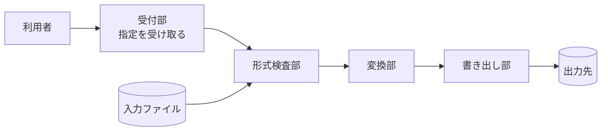
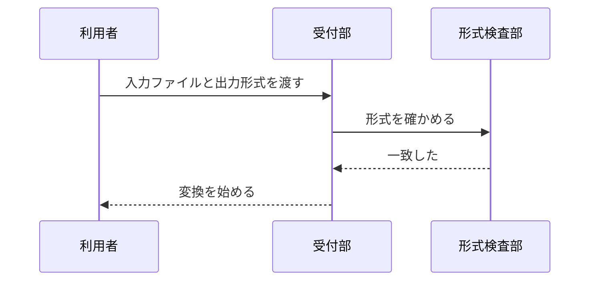

# システム構成

**Grammar**: basic.sgra
**UID**: DOC-ARCH
**Version**: 1.0

本書は要求ではない。 本書は、 直前の `04-upper.md` が並べた上位要求 3 件を、
何をどう組んで満たすのかを 1 枚の図で示す。 **本書は要求を 1 件も足さない。**

この図は構造である。 部品が何個あり、 どれがどれを呼ぶかを示す。 同じ一式に
処理の流れの図もあるが、 あれとは別物である — 実行が上から下へどう進むかは
`06-lower.md` の「実現の見取り図」にある。 構造は変わりにくく、 流れは変わりやすい。
先に構造を決めておくと、 流れを直しても要求との対応が崩れない。

## 登場するもの

**Type**: SECTION

図の中の 4 つの部が本ツールの中身である。 利用者・入力ファイル・出力先は
本ツールの外側にある。 外側にあるものは本ツールが決められないので、 上位要求は
どれも「外側をどう扱うか」の形をしている。

## 部品どうしのやりとり

**Type**: SECTION

上の図は何があるかを示す。 下の図は、 利用者が変換を始めるまでの呼ぶ順を示す。

この図のライフラインは 3 本であり、 目安の 5 本を下回る。 だから本書はこの図を
本文に置いている (「図 — 大きい図は別文書にする」)。

## 構成要素と上位要求の対応

**Type**: SECTION

| 構成要素   | 担うこと                               | 満たす上位要求    |
| ---------- | -------------------------------------- | ----------------- |
| 受付部     | 入力ファイルと出力形式の指定を受け取る | SYS-001           |
| 形式検査部 | 入力が指定された形式かを確かめる       | SYS-002           |
| 変換部     | 指定された出力形式へ変換する           | SYS-001           |
| 書き出し部 | 出力先へ書く。 既にあるものは壊さない  | SYS-001 / SYS-003 |

1 つの部が 1 つの要求に対応するとは限らない。 受付部と変換部と書き出し部の 3 つが
SYS-001 を分担しており、 書き出し部はそのうえ SYS-003 も担う。 逆に形式検査部は
SYS-002 だけを担う。 **要求と構造は別の軸であり、 数も対応も一致しない。**

## この文書が UID を持たない理由

**Type**: SECTION

構成要素に UID を振っていない。 この一式は「要求仕様書として最低限成り立つもの」を
示すためにあり、 設計をトレースの対象にすると層が 1 つ増える。 **本書は読む側のための
見取り図であって、 機械が引く対象ではない。**

設計もトレースしたくなったら、 文法に部品用のノード型を足し、 各部品から要求へ
`Parent` を張る。 ノード型もフィールドも好きなだけ足してよい —
足し方は `02-guide-for-human.md` の文法の節にある。
