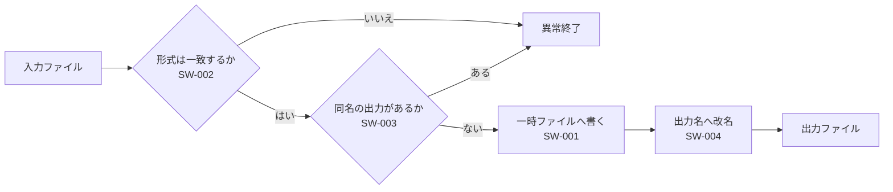

# 下位要求

**Grammar**: basic.sgra \
**UID**: DOC-LOWER \
**Version**: 1.0

本書は `05-upper.md` の各要求を**どう実現するか**を書く。

**上下の関係は、 常に下の側が書く。** 子のノードに `**Relations**:` を置き、 親の UID を
指す。 **親の側に子を並べてはならない** — 子が増えるたびに親を触ることになり、
二重管理になる。

**「下位要求だから書く」のではなく「子だから書く」ことに注意する。**
`05-upper.md` の上位要求も `**Relations**:` を持っているが、 あれは上位要求が
`04-usecases.md` の `UC-002` の子だからである。 **上位・下位という呼び名は文書の
役割であって、 親子の向きとは別物である。**

親は**別のファイルにいてよい。** StrictDoc はプロジェクト全体で UID を 1 つの表に
集めてから関係を解決するため、 ファイルの境目は関係しない。 `.md` と `.sdoc` が
混ざっていても同じである。

## 変換の実行

**UID**: SW-001 \
**STATUS**: Approved \
**REVIEW_STATUS**: NoFinding

**Statement**: 本ツールは、 入力ファイルを読み、 利用者が指定した出力形式へ変換した結果を出力ファイルへ書き出すこと。

**Relations**:
- **Type**: `Parent` \
  **ID**: `SYS-001`

## 入力形式の検査

**UID**: SW-002 \
**STATUS**: Approved \
**REVIEW_STATUS**: NoFinding

**Statement**: もし入力ファイルの形式が利用者の指定した形式と異なるならば、 本ツールは、 変換を行わず異常終了すること。

**Relations**:
- **Type**: `Parent` \
  **ID**: `SYS-002`

## 出力先の確認

**UID**: SW-003 \
**STATUS**: Approved \
**REVIEW_STATUS**: NotReviewed

**Statement**: もし出力先に同名のファイルが既にあるならば、 本ツールは、 書き出しを行わず異常終了すること。

**Relations**:
- **Type**: `Parent` \
  **ID**: `SYS-003`

## 書き込みの原子性

**UID**: SW-004 \
**STATUS**: Draft \
**REVIEW_STATUS**: WontFix

**Statement**: もし書き出しが途中で中断したならば、 本ツールは、 出力先に不完全なファイルを残さないこと。

**Rationale**: 中断で生まれた不完全なファイルが残ると、 次回の実行では SW-003 がそれを「既存ファイル」と見なして止まる。 利用者は原因の分からない異常終了を見ることになる。

**Relations**:
- **Type**: `Parent` \
  **ID**: `SYS-003`

**REVIEW_COMMENT**: 一時ファイルの置き場所が決まっていない。 同じドライブでないと改名が原子的にならない場合がある。

**REVIEW_ACTION**: この一式は書き方の実例であり、 実装の詳細は扱わない。 実際の仕様書ではここを決めること。

## 実現の見取り図

**Type**: SECTION

本章は要求ではない。 上の 4 件が**どう繋がって 1 回の実行になるか**を、 図・数式・
コードで補う。 **`.md` の仕様書では、 この 3 つを本文にそのまま書ける。**

本文に収まらない資料は `_assets/` へ置き、 そこへリンクする。 **画像でなくてもよい** —
StrictDoc は `_assets/` の中身を種類を問わずそのまま出力へ複製する。
対応している形式の組み合わせは [対応形式の一覧](_assets/formats.csv) に置いてある。

小さい図は本文に置く。 **判断の基準は、 コードフェンスの中身が 15 行以下かどうかである。**



中断と後始末まで含めた**大きい図は別文書にしてある** → [LINK: DOC-FIG-STATE]

数式も本文にそのまま書ける。 一時ファイルを経由するため、 変換に必要な空き容量
$S_{need}$ は出力の大きさそのものではない。 次のとおりになる。

$$
S_{need} = S_{out} + S_{tmp} = 2 \times S_{out}
$$

差し替えが済むまで一時ファイルと出力ファイルが同時に存在するので、 係数は $2$ になる。

式に出てくる記号の意味を表にする。 **セルの中で数式を閉じたあとは必ず字を続ける** —
セルが `$` で終わると export が止まる。 セル内の `|` は `\|` と逃がす。

| 記号 | 単位 | 意味 |
|---|---|---|
| $S_{need}$ バイト | バイト | 変換に必要な空き容量 |
| $S_{out}$ バイト | バイト | 出力ファイルの大きさ |
| $S_{tmp}$ バイト | バイト | 一時ファイルの大きさ。 $S_{out}$ と等しい |
| 経路 | — | `入力 \| 変換 \| 出力` の 3 段 |

SW-004 を満たす書き方は 1 つに決まっている。 **同じディレクトリに一時ファイルを
作り、 書き終えてから改名する。** 改名は同一ディレクトリ内なら不可分に行われる。

```python
def convert(src: str, dst: str) -> None:
    tmp = dst + ".part"          # dst と同じディレクトリに作る
    try:
        write(tmp, transform(read(src)))
        os.replace(tmp, dst)     # ここまで来て初めて dst ができる
    except BaseException:
        os.unlink(tmp)           # 中断したら一時ファイルを残さない
        raise
```

**言語名 (`python`) は必ず書く。** 出力の HTML に色は付かないが、 言語名は JSON にも
残るため、 後から読む側がこれが何のコードかを判別する唯一の手掛かりになる。
