# ブラウザ操作の手引き

**Grammar**: basic.sgra \
**UID**: DOC-BROWSER \
**Version**: 1.0

本書は、 StrictDoc の画面から仕様書を作り、 直し、 見る方法を伝える。
ほかの文書はすべて `.md` をエディタで開いて書く前提だが、 StrictDoc は自分で
サーバを持っていて、 ブラウザからも同じ仕様書を扱える。

**写真のピンクの矢印と番号は、 押す場所と押す順である。**

書き方そのもの (表や図の記法) は `02-guide-for-human.md` が伝える。
本書は「その記法をブラウザの入力欄に打つとき何が違うか」だけを扱う。
同じことを二か所に書くと、 片方を直したときにもう片方が腐る。

AI に書かせたりレビューさせたりする方法は `10-cowork-with-claude.md` にある。

## 読む前に知っておくこと

**Type**: SECTION

### ブラウザで編集するにはサーバが要る

**Type**: SECTION

`strictdoc export` が作った HTML には編集ボタンが出ない。 あれは読むための
出力である。 編集できるのは `strictdoc server` が配信している画面だけである。

いちばん簡単なのは、 仕様書のフォルダを `launch-strictdoc.bat` にドラッグして
落とすやり方である。 ランチャがサーバを起こし、 ブラウザを開くところまでやる。

自分でコマンドを打つなら次のとおり。

```text
strictdoc server <仕様書のフォルダ> --output-path <仕様書のフォルダ>/output/strictdoc
```

**出力先の 1 階層目は `output` という名前にすること。** StrictDoc はこの名前の
フォルダを文書探索から外すので、 2 回目の起動が自分の出力を読み直す事故を防げる。

サーバは起動時にファイルを読み、 その内容をメモリに持つ。 エディタで `.md` を
直してもブラウザの表示は古いままである。 `--watch` を付けて起動すると、 ファイルの
変更を見張って画面を更新する。 付けていないなら、 サーバを立て直す。

### 保存はファイル全体を書き直す

**Type**: SECTION

ブラウザでの保存は、 画面の中だけの出来事ではない。 StrictDoc は `.md`
ファイルそのものを書き換える。 **しかも、 直した要求だけでなく、 その文書の
全体を自分の標準の書き方で出力し直す。**

`05-upper.md` の `SYS-001` に 1 文を足しただけで、 差分は 11 行の追加と
4 行の削除になった (strictdoc 0.27.1 で実測。 2 回試して同じ結果)。

| 起きたこと | 範囲 |
| --- | --- |
| StrictDoc が `**Type**: REQUIREMENT \` を足した | 直した `SYS-001` だけでなく `SYS-002` と `SYS-003` にも |
| StrictDoc が `**STATUS**:` を `**Status**:` に変えた | その文書の全要求 |
| StrictDoc が `**Statement**: 本文` を 3 行に開いた | 直した要求だけ |

他のファイルは変わらない。 StrictDoc が書き直すのは、 編集した要求が入っている文書だけである。

ここから使い分けが決まる。

- 書き方を自分で揃えてある仕様書をブラウザから直すと、 差分が大きくなる。
  1 文の修正がレビューでは 15 行の変更に見える
- 逆に、 書き方を StrictDoc の標準へ揃えたいなら、 ブラウザで 1 回保存すれば済む
- 最初の 1 回はコミットを分けること。 正規化だけのコミットと中身を変えた
  コミットを混ぜると、 レビューする人がどこを見ればよいか分からなくなる

## 画面の地図

**Type**: SECTION

どこに何があるかだけ先に見る。 個々のボタンは使う章で説明する。

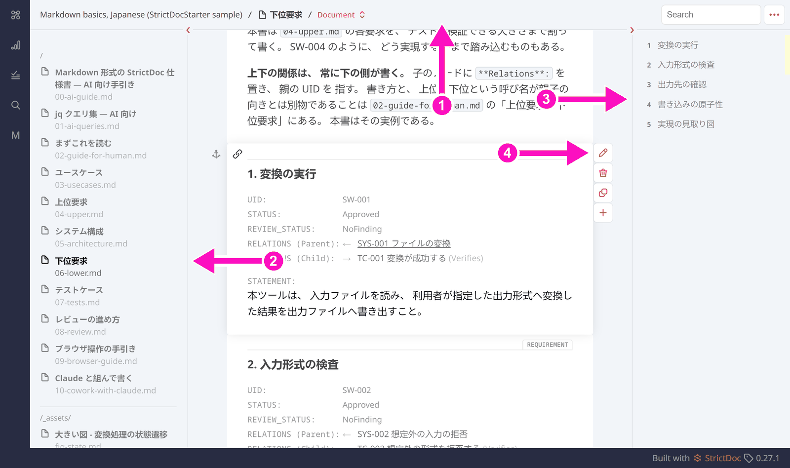

1. ヘッダ — 左にパンくず、 右に検索と `...` (文書全体への操作)
2. 左の文書ツリー — このプロジェクトの文書一覧。 境目を掴むと幅を変えられる
3. 右の目次 — いま開いている文書の見出し
4. 要求の脇のボタン — マウスを乗せたときだけ出る。 「要求を直す・消す・複製する」の章で説明する

いちばん左の細い帯はプロジェクト全体の画面への入口である。 上から順に
索引、 統計、 トレーサビリティ行列、 検索、 ツリーマップ。 「プロジェクト全体を見る」の章で扱う。

## 文書を作る

**Type**: SECTION

**プロジェクトそのものはブラウザで作れない。** フォルダと `strictdoc_config.py`
は先に用意しておくこと。 ブラウザで作れるのは、 既にあるプロジェクトへ文書を
足すことである。

プロジェクト索引を開き、 右上の `...` を押す。

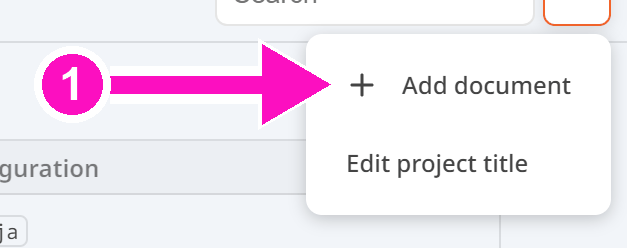

入力欄が 2 つ出る。

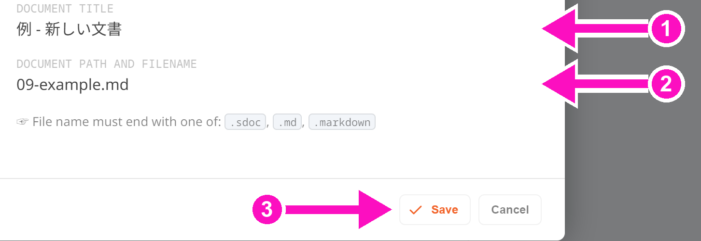

1. 題名 — 文書の H1 になる。 一覧に出るのはこの文字である
2. ファイル名 — プロジェクトフォルダからの相対パス。 `09-example.md` のように
   拡張子まで書く。 番号は `00` から始める規則にしてあるので、 末尾に足すなら
   既にある最大の番号の次を使う
3. Save を押すと、 その場でファイルが生まれる

**できた文書は文法を持たない。** `**Grammar**: basic.sgra` の 1 行は後から
自分で書き足すか、 「文書の設定と文法を直す」の章の文法編集で足す。 これを忘れると `TEST_CASE` も
`REVIEW_STATUS` も使えない。

## 要求を足す

**Type**: SECTION

要求は既にあるノードの上か下に入れる。 起点にするノードへマウスを乗せ、
いちばん下の `+` を押す。

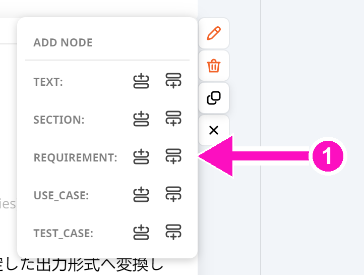

縦が型、 横が位置である。 この一式の文法では型が 5 つ出る。

| 型 | 何に使うか |
| --- | --- |
| `TEXT` | UID を持たない地の文 |
| `SECTION` | 章の見出し |
| `REQUIREMENT` | 要求 |
| `USE_CASE` | ユースケース。 `basic.sgra` が足した型 |
| `TEST_CASE` | テストケース。 `basic.sgra` が足した型 |

この節の写真は `USE_CASE` を足す前に撮ったものなので、 4 つしか写っていない。

`TEST_CASE` が出るのは、 この一式が `basic.sgra` を持っているためである。
文法を持たない文書では `TEXT` と `SECTION` と `REQUIREMENT` しか出ない。

選ぶと空のフォームが開く。

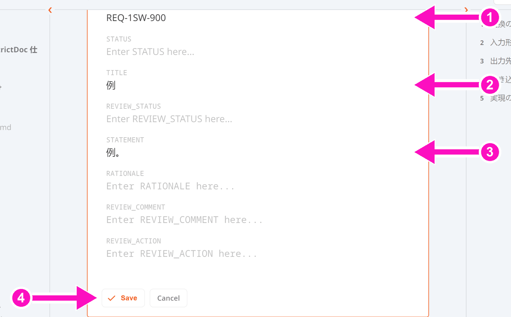

1. UID — 後から名前で引きたいなら付ける。 プロジェクト全体で重複してはならない
   (重複させると export そのものが止まる)
2. TITLE — 見出しになる
3. STATEMENT — 本文
4. Save で確定する。 隣の `Cancel` は打った内容を捨てる

## 要求を直す・消す・複製する

**Type**: SECTION

### 4 つのボタン

**Type**: SECTION

要求にマウスを乗せると、 右側にボタンが 4 つ出る。 乗せるまで出ないので、
見当たらないときはマウスの位置を疑うこと。

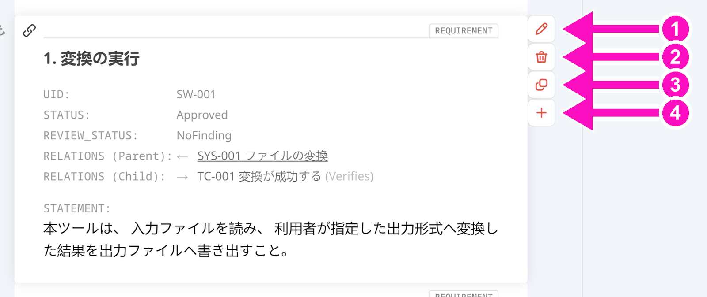

1. 鉛筆 — 編集
2. ごみ箱 — 削除。 確認は出ない
3. 重なった四角 — 複製。 同じ内容のノードをすぐ下に作る。 UID は空になるので、
   自分で付け直すこと
4. プラス — 追加 (「要求を足す」の章)

### 直して保存する

**Type**: SECTION

鉛筆を押すと、 その要求がフォームに変わる。 `UID` `STATUS` `TITLE`
`REVIEW_STATUS` `STATEMENT` `RATIONALE` `REVIEW_COMMENT` `REVIEW_ACTION` が
縦に並び、 それぞれが直接打ち込める欄になる。 `REVIEW_STATUS` は選択式で、
必須である (`08-review.md`)。

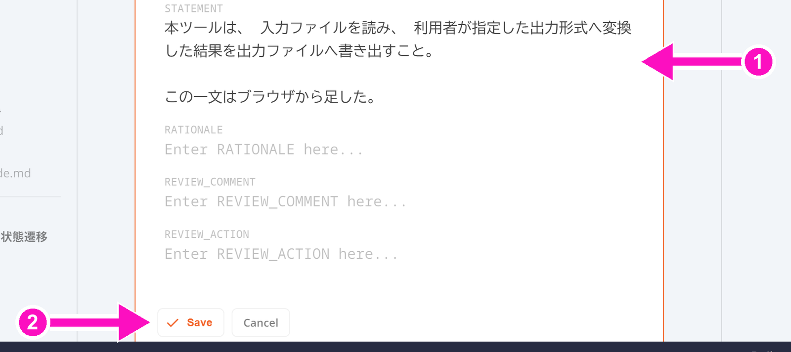

1. STATEMENT の末尾に 1 行足す。 空行を 1 つ入れてから打つ。
   空行を入れるのは Markdown が段落を空行で区切るためである。 空行なしで
   改行すると前の文の続きになる
2. Save を押す

保存するとフォームが閉じ、 足した一文が本文に入る。

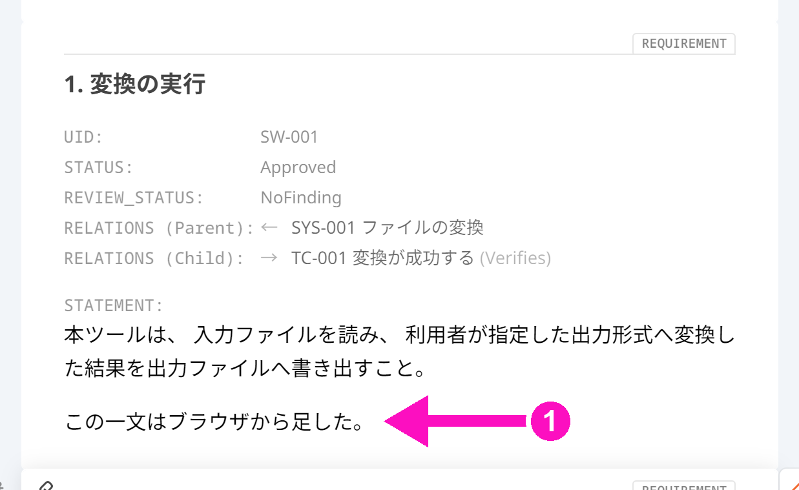

**ここで画面を見て終わりにしてはならない。** 「読む前に知っておくこと」の章のとおり、
同時に StrictDoc がファイル全体を書き直している。

## 上位と下位を紐づける

**Type**: SECTION

関係はフォームの `Relations` の札にある。 **下位の側に親を書く。** 上位の側には
何も書かない — 下位が増えるたびに上位を触ることになり、 二重管理になるためである。

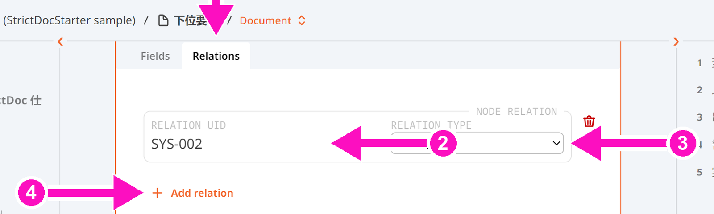

1. `Relations` の札 を押す
2. 相手の UID を入れる。 打ち始めると候補が出る
3. 種類 を選ぶ。 `Parent` が親、 `Child` が子である
4. `Add relation` で行を増やす。 行の右のボタンでその行を消せる

保存すると、 要求の頭に関係が並ぶ。

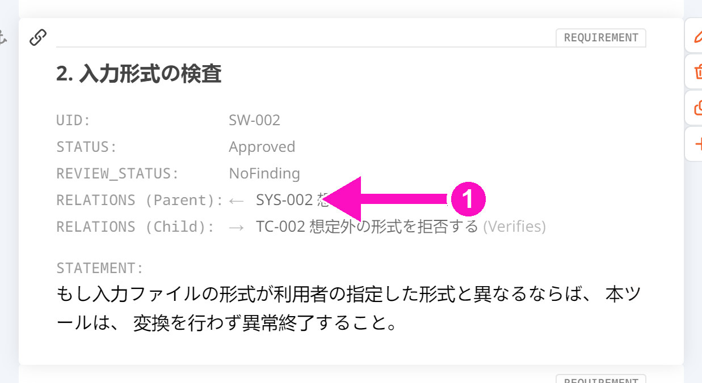

親は別のファイルにいてよい。 StrictDoc はプロジェクト全体で UID を 1 つの表に
集めてから関係を解決するので、 ファイルの境目は関係しない。

**存在しない UID を指すと export が止まる。** 打ち間違いはその場では分からず、
次の export で分かる。

**`Role` (`Verifies` のような役割) は既定の文法では使えない。** `basic.sgra` の
ような文法ファイルが要る。

## 入力欄の癖 — 表と Mermaid

**Type**: SECTION

入力欄は Markdown をそのまま受け取る。 表を作るボタンも、 図を描くボタンも無い。
`02-guide-for-human.md` が伝える記法を、 文字として打ち込むだけである。

プレビューは無い。 打っている間は素の Markdown が見えるだけで、 結果は保存
してから分かる。

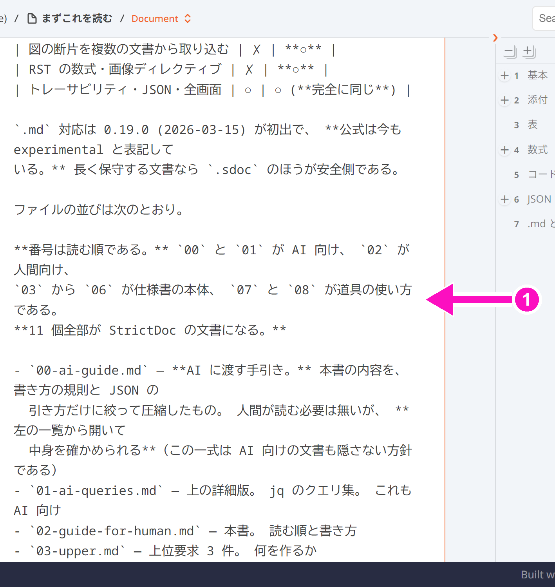

保存すると表になる。

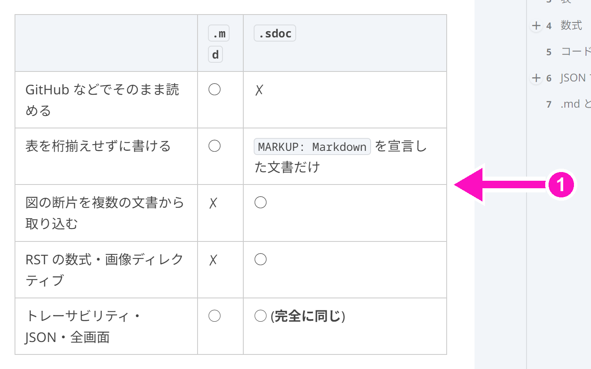

**セルの中の縦棒はコード印で守れない。** `\|` と逃がすこと。 これは
ブラウザで打っても、 エディタで書いても同じである。

Mermaid も同じで、 ```` ```mermaid ```` で囲んだ文字を打つだけである。
図はブラウザが描く。 StrictDoc は文字を渡しているだけである。

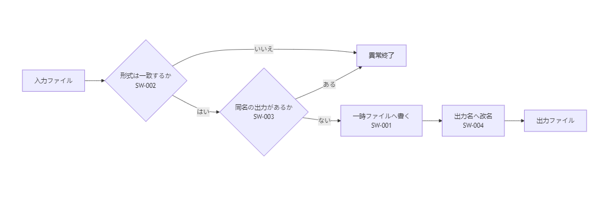

図の行数が 15 行を超えたら、 `_assets/` の別ファイルへ出すこと。
1 つの図が 124 から 228 tokens になるので、 本文に埋めたままだと AI に渡す量が膨らむ。

## 図と添付 — ここだけブラウザで終わらない

**Type**: SECTION

**StrictDoc の画面にはファイルを上げる口が無い。** 画像も、 添付も、
ブラウザからは追加できない (0.27.1 の Web サーバが受け取るファイルは
ReqIF の取り込みだけである。 ソースを読んで確認した)。

したがって手順はこうなる。

1. ファイルを `_assets/` に置く。 ここはディスク側の作業である。
   エクスプローラでもエディタでも構わない
2. ブラウザの入力欄に `` と文字で書く
3. 保存する

**StrictDoc は `_assets/` 以外の場所に置いたものを複製しない。** 画面では見えても、
`strictdoc export` した HTML では 404 になる。 これは画像に限らず、
`.csv` でも `.md` でも同じである。

サーバは起動時にフォルダを読む。 `--watch` を付けていないなら、 ファイルを
置いてからサーバを立て直さないと、 新しいファイルは見えない。

## 4 つのビューで 1 つの文書を見る

**Type**: SECTION

ヘッダのパンくずにある `Document` を押すと、 同じ文書の見せ方を選べる。

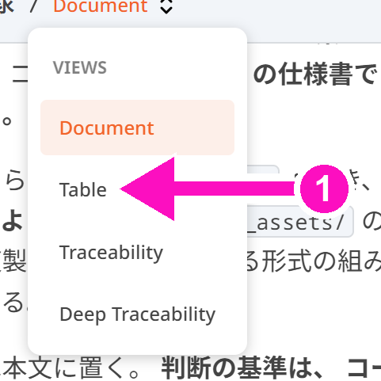

| ビュー | 何が見えるか |
| --- | --- |
| Document | 既定。 仕様書として読む形 |
| Table | 1 要求 1 行の表。 数を数えるとき、 抜けを探すときに速い |
| Traceability | 左右 2 段組。 要求と、 それに繋がる相手が並ぶ |
| Deep Traceability | 上と同じだが、 繋がりを何段でも辿る |

`Table` は要求の一覧である。

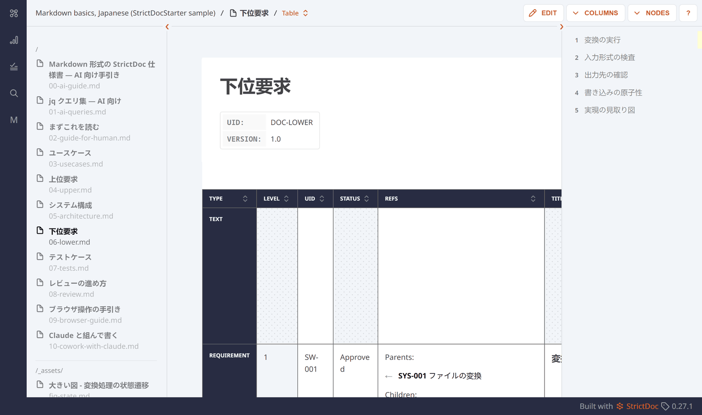

`Traceability` は、 その要求が何に繋がっているかを横に並べる。

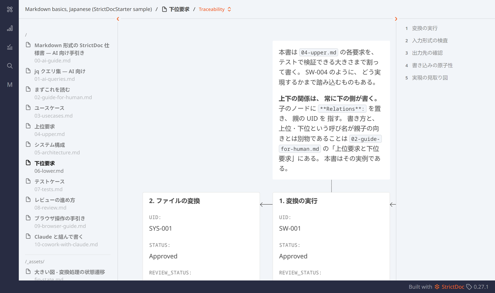

これらのビューは「上位と下位を紐づける」の章の関係があって初めて意味を持つ。 関係を 1 本も書いて
いない仕様書では、 右側が空のまま並ぶだけである。

## 表ビューで列を選ぶ

**Type**: SECTION

`Table` ビューは文法が項目を足すほど横に長くなる。 全部出したままだと、
1280 px の窓に対して表の幅は 3078 px あった (0.27.1 で実測)。 ヘッダの右にある
`COLUMNS` が、 見たい列だけを残すボタンである。

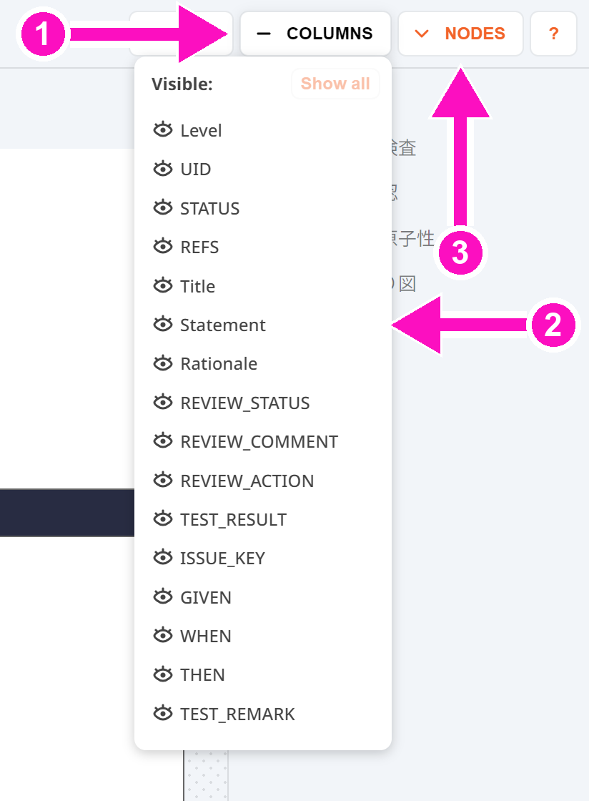

1. `COLUMNS` — 押すと StrictDoc が列の一覧を開く
2. 列の名前 — 押すとその列が消える。 もう一度押すと列が戻る
3. `NODES` — こちらは行を絞る。 この文書では `TEXT` `REQUIREMENT` `SECTION` の
   3 つが出る

一覧の右上の `Show all` が、 消した列を全部戻すボタンである。 列を消している間、
ボタンの文字は `COLUMNS • 10 hidden` のように変わる。

一覧に出る列の出どころは 3 つある。

| 出どころ | 列 |
| --- | --- |
| 一覧に出ない。 常に先頭に出る | `Type` |
| 既定の項目 | `Level` `UID` `STATUS` `REFS` `Title` `Statement` `Rationale` |
| 文法が足した項目 | `basic.sgra` が定義した `REVIEW_STATUS` などが続く |

`Type` の列だけは消せない。 一覧にも出てこない。

見出しの中の小さな上下の印を押すと、 StrictDoc がその列で並べ替える。 1 回目が
昇順、 2 回目が降順である。 見出しの文字を押しても何も起きない。 押すのは印である。

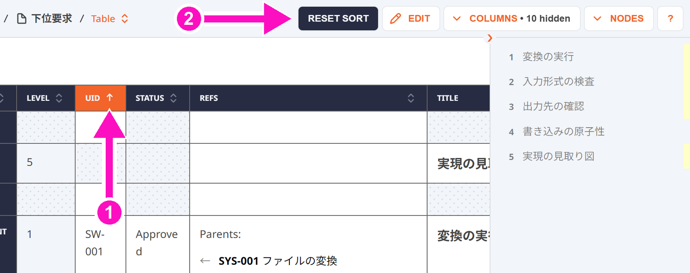

1. 並べ替えの印 — 並べ替えた列は橙色になり、 印が向きを示す
2. `RESET SORT` — 元の順に戻す。 並べ替えるまでこのボタンは出ない

StrictDoc は消した列を文書ごとに覚える。 別の文書へ行って戻っても消したままで、
ブラウザを閉じても残る。 `.md` ファイルは変わらない。 見え方だけの話である。

## プロジェクト全体を見る

**Type**: SECTION

いちばん左の細い帯にある。

トレーサビリティ行列 — 上位から下位、 テストまでを 1 枚に並べる。
どこが繋がっていないかを探す画面である。

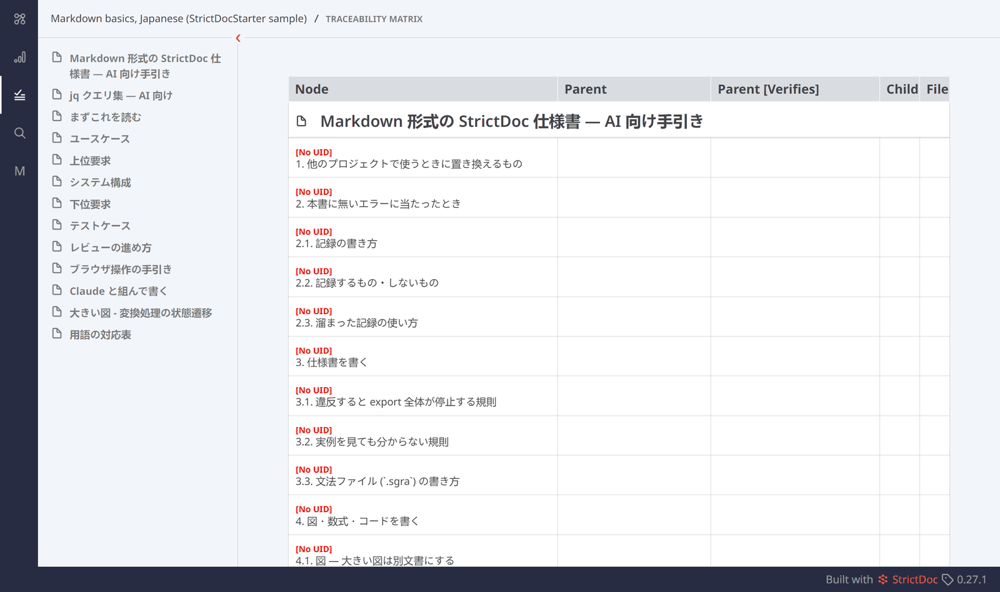

ツリーマップ — 文書の大きさを面積で見せる。 どこに書きすぎているかが分かる。

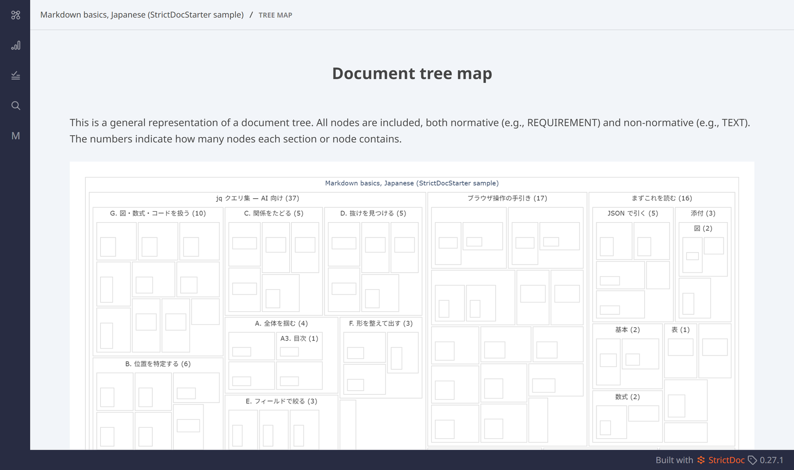

統計 — 要求の数、 UID を持つ割合、 状態の内訳。

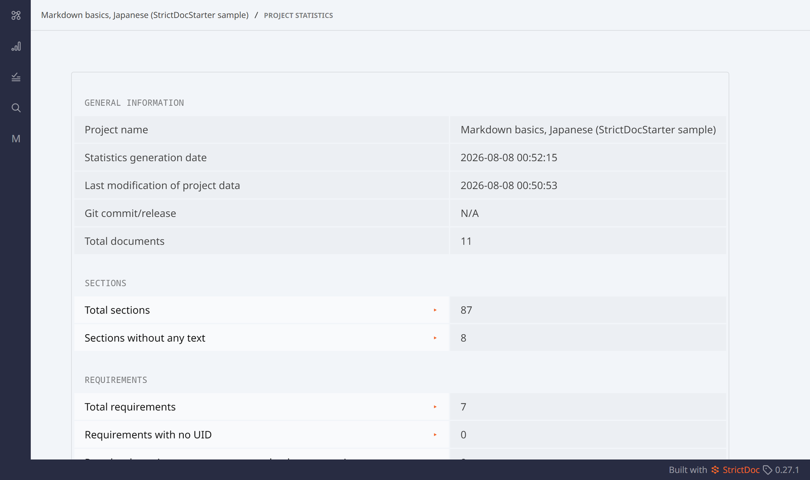

検索 — プロジェクト全体から探す。 StrictDoc 独自のクエリ言語を使う。

この画面で数えるより、 JSON を `jq` で引くほうが速くて安い。
やり方は `01-ai-queries.md` にある。 画面は人が眺めるためのもので、
数を数えたり一覧を作ったりする用途には向かない。

## 左右のパネルを畳む

**Type**: SECTION

左の文書ツリーも右の目次も畳める。 表や Deep Traceability のように横へ広がる
画面では、 畳むだけで本文の幅が 710 px から 1192 px に増えた (1280 px の窓で実測)。

畳むボタンはパネルの角にある小さな `<` である。

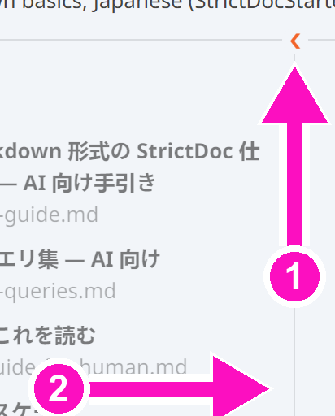

1. `<` の印 — 押すと StrictDoc がパネルを畳む。 印は `>` に変わって画面の端に
   残るので、 もう一度押せば開く
2. パネルの境目 — 掴んで左右へ引くと、 パネルの幅が変わる。 畳まずに幅だけ
   詰めたいときはこちらを使う

右の目次も同じで、 左右を裏返した位置に同じ 2 つがある。

両方畳むと、 いちばん左の細い帯だけが残る。

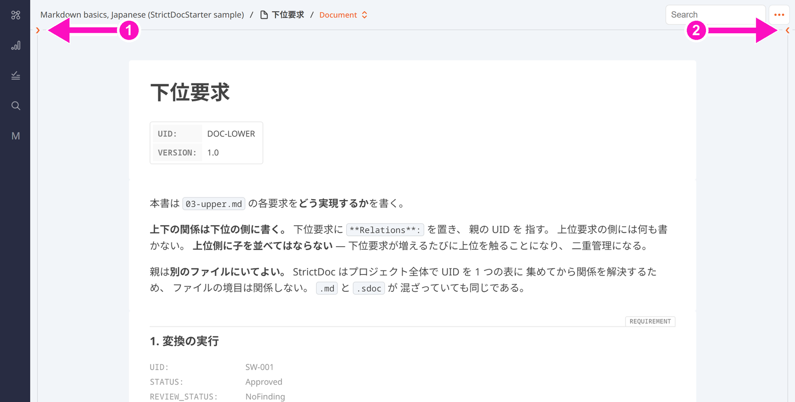

1. 畳んだ文書ツリーの `>`
2. 畳んだ目次の `<`

StrictDoc は畳んだ状態をタブごとに覚える。 同じタブで別の文書へ移っても畳んだ
ままだが、 新しいタブでは開いた状態から始まる。 幅を変えた結果も同じ扱いである。
`.md` ファイルは変わらない。

## 画面を送る・大きくする

**Type**: SECTION

大きくする仕組みは 1 つではない。 どの画面でも効くブラウザ自身の拡大と、
Deep Traceability だけが持つ独自の拡大があり、 ツリーマップはどちらも持たない。
混ぜて覚えると、 出ないボタンを探すことになる。

### ブラウザ自身の拡大 — どの画面でも効く

**Type**: SECTION

`Ctrl` + `+` と `Ctrl` + `-`、 それに `Ctrl` を押しながらのホイールである。
`Ctrl` + `0` が 100 % に戻す。 StrictDoc はここに何も足していない。 ブラウザの
機能なので、 文字も図も表も一緒に大きくなる。

例外が Deep Traceability である。 この画面は `Ctrl` + ホイールを自分の
拡大・縮小に使うので、 ブラウザの拡大にはならない。 キーボードの `Ctrl` + `+` は効く。

### Deep Traceability — 独自の拡大と移動を持つ

**Type**: SECTION

この画面だけが専用の板の上に図を置いている。 ページそのものはスクロールしない。
覚えることは 4 つである。

| 操作 | すること |
| --- | --- |
| ホイール | 図を上下に送る |
| `Shift` + ホイール | 図を左右に送る |
| `Ctrl` + ホイール | 図を大きく・小さくする |
| `Space` を押しながらドラッグ | 図を掴んで動かす |

小さくできるのは 25 % まで、 大きくできるのは 100 % までである。 元の大きさより
大きくはできない。 元に戻すボタンは無いので、 迷子になったらページを読み直す。

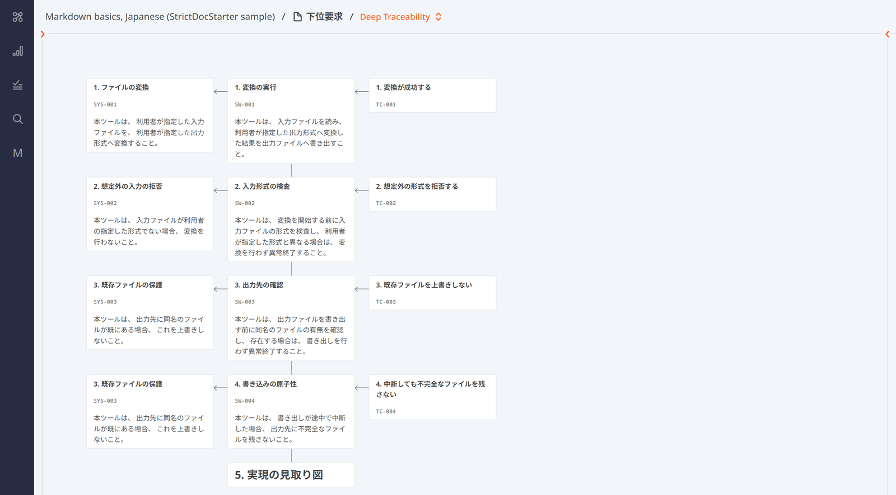

縮めるのは、 上位から下位、 テストまでの繋がりを 1 画面に入れるためである。
先に左右のパネルを畳んでおくと、 使える幅がさらに増える。

### ツリーマップ — 拡大は無い。 タイルを押して潜る

**Type**: SECTION

ツリーマップに独自の拡大は無い。 ホイールはページを送るだけである。 図の上に
マウスを乗せると右上にボタンが出るが、 `Download plot as a PNG` の 1 つだけで、
拡大のボタンは無い (0.27.1 で実測)。 大きく見たいならブラウザの拡大を使う。

代わりに、 タイルを押すとその中へ潜る。 ツリーマップは押した文書だけを描き直すので、
中身が大きく見える。

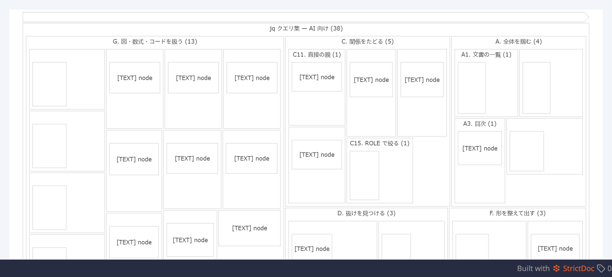

いちばん上の帯を押すと 1 つ上へ戻る。

### 表と行列 — Space を押しながら引くと動く

**Type**: SECTION

`Table` ビューとトレーサビリティ行列は、 横に長くなって窓に収まらない。 この 2 つは
`Space` を押しながらドラッグすると、 掴んで動かせる。 矢印キーでも動く。

ただし列を減らすほうが速い。 「表ビューで列を選ぶ」の章の `COLUMNS` で要らない
列を落とせば、 横へ引く必要そのものが減る。

## 文書の設定と文法を直す

**Type**: SECTION

### 題名と UID

**Type**: SECTION

文書の題名と `UID` は、 文書の本文の頭にある `Edit title and meta` から直す。
ヘッダの `...` ではない。

### 文法

**Type**: SECTION

ヘッダの `...` に入っている。 中身は 2 つだけである。

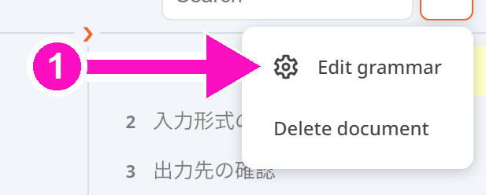

`Edit grammar` を選ぶと、 型ごとの項目を並べた表になる。

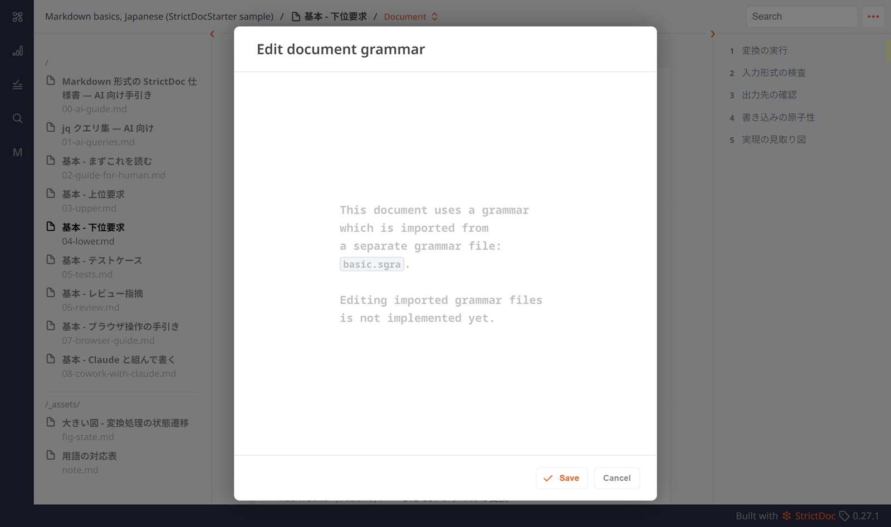

独自の型や項目を使うなら、 ここか `.sgra` ファイルのどちらかで定義する。
既定の文法で通るのは `UID` `Statement` `Rationale` `STATUS` `Type: SECTION` と
関係の `Parent` までである。 `Role` や `TEST_CASE` を使う瞬間に文法が要る。

**この画面で直すと、 その文書だけの文法になる。** 複数の文書で同じ文法を共有する
なら、 `basic.sgra` のようなファイルに書いて全文書から参照するほうがよい。
この一式はそうしている。

## ブラウザでできないこと

**Type**: SECTION

| やりたいこと | ブラウザ | 代わりに |
| --- | --- | --- |
| ファイルを上げる (画像・添付) | できない | `_assets/` に自分で置く |
| プロジェクトを新しく作る | できない | フォルダと `strictdoc_config.py` を用意する |
| ファイル名を変える・文書を移す | できない | エクスプローラで動かしてサーバを立て直す |
| 書き方を保ったまま直す | できない | エディタで直す。 ブラウザは必ず正規化する |
| 数を数える・一覧を作る | 検索はあるが遅い | JSON を `jq` で引く (`01-ai-queries.md`) |
| 大きな書き換え | 1 つずつなら可 | エディタか AI に任せる (`10-cowork-with-claude.md`) |

**ブラウザが向いているのは、 場所を探しながら 1 つずつ直す作業である。**
どこを直すか決まっていて量が多いなら、 エディタのほうが速いし差分も小さい。

## 付録 - ボタン早見表

**Type**: SECTION

| 場所 | 見た目 | すること |
| --- | --- | --- |
| 索引の右上 `...` | | 文書を足す / プロジェクトの題名を直す |
| 文書の右上 `...` | | 文法を直す / 文書を消す |
| 文書の本文の頭 | `Edit title and meta` | 題名・UID・版を直す |
| ノードの脇 1 番目 | 鉛筆 | 編集 |
| ノードの脇 2 番目 | ごみ箱 | 削除。 確認は出ない |
| ノードの脇 3 番目 | 重なった四角 | 複製。 UID は空になる |
| ノードの脇 4 番目 | プラス | 上か下にノードを足す |
| フォームの札 | `Fields` / `Relations` | 項目と関係の切り替え |
| フォームの左下 | `Save` / `Cancel` | 確定 / 破棄 |
| パンくずの `Document` | | 4 つのビューの切り替え |
| いちばん左の帯 | | 索引 / 統計 / 行列 / 検索 / ツリーマップ |
| パネルの角 | `<` / `>` | 文書ツリー・目次を畳む / 開く |
| パネルの境目 | | 掴んで引くと幅が変わる |
| 表ビューのヘッダ | `COLUMNS` / `NODES` | 列を選ぶ / 行を絞る |
| 表ビューの見出し | 上下の印 | その列で並べ替える |
