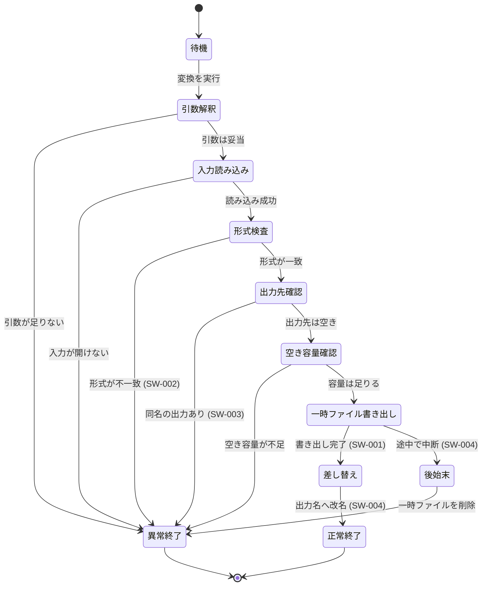

# 大きい図 - 変換処理の状態遷移

**UID**: DOC-FIG-STATE

このファイルは**「16 行以上の図は別文書にする」規則の実例**である。
本文 (`04-lower.md`) からは `[LINK: DOC-FIG-STATE]` の 1 行で飛んでくる。

図は下の 1 つだけを置く。 説明はこの前後に書いてよいが、 短くする。
**この文書を開いた者は図を見に来ているのであって、 読み物を読みに来ていない。**

図の中の `SW-*` は `04-lower.md` の下位要求の UID である。 **図から要求へ
`[LINK:]` を張ることもできるが、 Mermaid のコードフェンスの中では効かない。**
StrictDoc はフェンスの中身を解釈せず、 そのまま Mermaid へ渡すためである。
要求へ飛ばしたいときは、 図の外に [LINK: SW-004] のように並べる。
