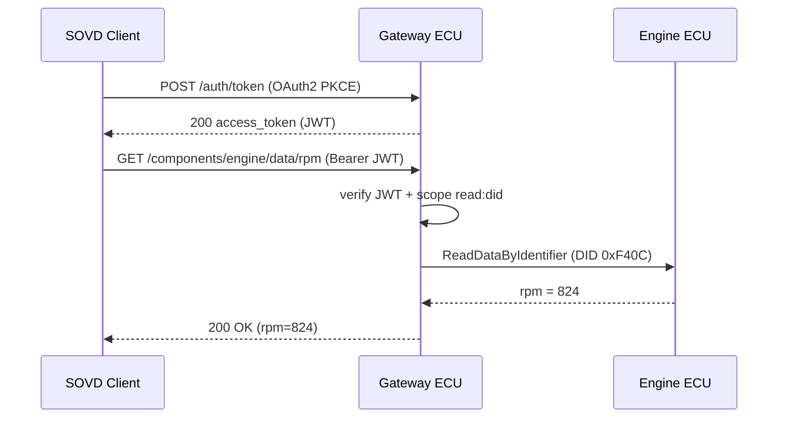

# SOVD Authentication & Authorization Requirements

**Grammar**: sovd-grammar.sgra
**UID**: DOC-SOVD-AUTH
**Version**: 1.0

This document defines the SOVD **authentication and authorization** requirements
from L1 (system) down to L3 (unit). For the stakeholder requirements (L0) and use
cases, see `01-stakeholder-requirements.md`; for the shared front matter
(purpose, terminology, notation, the ASIL/CAL split, referenced standards), see
`00-overview.md`.

Domain-specific referenced standards: OAuth 2.0 (RFC 6749) / PKCE (RFC 7636) /
JWT (RFC 7519) / TLS 1.3 (RFC 8446) / ISO/SAE 21434 (CAL). Because authentication
and authorization are **cybersecurity** functions, the requirements in this
document are, as a rule, **ASIL=QM**, with the assurance level expressed via
**CAL** (see 00-overview Section 6.3).

## L1 - System Requirements

**Type**: SECTION

**L1 representative sequence: authenticated data read**

The typical SOVD flow proceeds in the order: (1) OAuth2 PKCE authentication ->
(2) access token (JWT) issuance -> (3) resource request with a Bearer token ->
(4) scope verification -> (5) translation to UDS and response. Vehicle data must
not be returned before scope verification (AUTH-L1-011).

### OAuth 2.0 PKCE authentication flow

**Type**: REQUIREMENT
**UID**: AUTH-L1-001
**TYPE**: Functional
**ASIL**: QM
**CAL**: CAL3
**LAYER**: L1_System

**Statement**: When a client requests authentication, the vehicle shall perform client
authentication using the OAuth 2.0 Authorization Code Flow with PKCE.

**VERIFICATION**: An access token can be obtained via the authorization code flow with PKCE, and
authentication is rejected when the code_verifier does not match.

**Relations**:

- **Type**: `Parent`
  **ID**: `AUTH-L0-001`

### Access token issuance

**Type**: REQUIREMENT
**UID**: AUTH-L1-002
**TYPE**: Functional
**ASIL**: QM
**CAL**: CAL3
**LAYER**: L1_System

**Statement**: When authentication succeeds, the vehicle shall issue an access token in JWT
(RFC 7519) format.

**VERIFICATION**: The successful-authentication response contains an access_token in JWT format.

**Relations**:

- **Type**: `Parent`
  **ID**: `AUTH-L1-001`

### Access token contents

**Type**: REQUIREMENT
**UID**: AUTH-L1-003
**TYPE**: Non-Functional
**ASIL**: QM
**CAL**: CAL2
**LAYER**: L1_System

**Statement**: The access token issued by the vehicle shall include the expiry (exp), the scope
(scope), and the subject ID (sub).

**Rationale**: Guarantees the minimum claims required for revocation and authorization decisions.

**Relations**:

- **Type**: `Parent`
  **ID**: `AUTH-L1-002`

### Role-based access control (RBAC)

**Type**: REQUIREMENT
**UID**: AUTH-L1-004
**TYPE**: Functional
**ASIL**: QM
**CAL**: CAL3
**LAYER**: L1_System

**Statement**: The vehicle shall allow scopes (read:did / read:dtc / write:dtc / write:swupdate,
etc.) to be assigned per role (Mechanic / OEMEngineer / FleetOperator).

**Relations**:

- **Type**: `Parent`
  **ID**: `AUTH-L0-002`

### TLS 1.3 encryption of the communication channel

**Type**: REQUIREMENT
**UID**: AUTH-L1-005
**TYPE**: Non-Functional
**ASIL**: QM
**CAL**: CAL3
**LAYER**: L1_System

**Statement**: The vehicle shall encrypt all communication between the SOVD client and the
gateway with TLS 1.3 or higher.

**VERIFICATION**: The handshake is established with TLS 1.3 or higher, and plaintext HTTP
connections are rejected.

**Relations**:

- **Type**: `Parent`
  **ID**: `AUTH-L0-003`

### Prohibition of TLS downgrade

**Type**: REQUIREMENT
**UID**: AUTH-L1-006
**TYPE**: Restriction
**ASIL**: QM
**CAL**: CAL3
**LAYER**: L1_System

**Statement**: If a client requests a downgrade to TLS 1.2 or lower, then the vehicle shall
reject the connection.

**Rationale**: Prevents the weakening of cryptographic strength caused by downgrade attacks.

**Relations**:

- **Type**: `Parent`
  **ID**: `AUTH-L1-005`

### Mutual TLS (mTLS) authentication

**Type**: REQUIREMENT
**UID**: AUTH-L1-007
**TYPE**: Functional
**ASIL**: QM
**CAL**: CAL3
**LAYER**: L1_System

**Statement**: In configurations that use an OEM-internal connection, the vehicle shall
additionally support mutual TLS authentication using a client certificate (X.509).

**Relations**:

- **Type**: `Parent`
  **ID**: `AUTH-L0-003`

### Access token expiry

**Type**: REQUIREMENT
**UID**: AUTH-L1-008
**TYPE**: Non-Functional
**ASIL**: QM
**CAL**: CAL2
**LAYER**: L1_System

**Statement**: The expiry of the access token issued by the vehicle shall default to 30 minutes
and shall not exceed 60 minutes.

**VERIFICATION**: The exp of a default-issued token is 30 minutes from issuance, and even at the
configurable upper bound it does not exceed 60 minutes.

**Relations**:

- **Type**: `Parent`
  **ID**: `AUTH-L1-002`

### Token revocation API

**Type**: REQUIREMENT
**UID**: AUTH-L1-009
**TYPE**: Functional
**ASIL**: QM
**CAL**: CAL3
**LAYER**: L1_System

**Statement**: The vehicle shall provide an API to revoke an already-issued access token.

**Relations**:

- **Type**: `Parent`
  **ID**: `AUTH-L0-001`

### Rejection of revoked tokens

**Type**: REQUIREMENT
**UID**: AUTH-L1-010
**TYPE**: Restriction
**ASIL**: QM
**CAL**: CAL3
**LAYER**: L1_System

**Statement**: If access is attempted with a revoked access token, then the vehicle shall
immediately reject that request.

**VERIFICATION**: After the revocation API is executed, access with the same token results in
HTTP 401.

**Relations**:

- **Type**: `Parent`
  **ID**: `AUTH-L1-009`

### Prohibition of returning data before scope verification

**Type**: REQUIREMENT
**UID**: AUTH-L1-011
**TYPE**: Restriction
**ASIL**: QM
**CAL**: CAL3
**LAYER**: L1_System

**Statement**: The vehicle shall not return vehicle data before verification of the requested
scope succeeds.

**Rationale**: Structurally prevents data leakage prior to authentication and authorization by
guaranteeing message ordering.

**VERIFICATION**: A request with insufficient scope returns HTTP 403 without including any vehicle
data.

**Relations**:

- **Type**: `Parent`
  **ID**: `AUTH-L0-004`
- **Type**: `Parent`
  **ID**: `AUTH-L0-002`

### Audit log recording

**Type**: REQUIREMENT
**UID**: AUTH-L1-012
**TYPE**: Functional
**ASIL**: QM
**CAL**: CAL2
**LAYER**: L1_System

**Statement**: The vehicle shall be able to record authentication and authorization events
(token issuance, verification, revocation, access-decision outcomes) as an audit log.

**Relations**:

- **Type**: `Parent`
  **ID**: `AUTH-L0-006`

## L2 - ECU Software Requirements

**Type**: SECTION

**L2 formulas: signature verification and latency budget**

For RSA signature verification of the JWT, the hash recovered by the following
formula from the signature $s$, the public exponent $e$, and the
modulus $n$ is compared with the hash of the received message:

$$
m \equiv s^{e} \pmod{n}
$$

The latency budget for authentication processing (token verification + scope
decision) satisfies the following (AUTH-L2-006):

$$
t_{\mathrm{auth}} = t_{\mathrm{verify}} + t_{\mathrm{scope}} \le 50\,\mathrm{ms}
$$

### Authentication endpoint

**Type**: REQUIREMENT
**UID**: AUTH-L2-001
**TYPE**: Functional
**ASIL**: QM
**CAL**: CAL3
**LAYER**: L2_ECU_SW

**Statement**: When a client sends an OAuth 2.0 Token Request, the gateway ECU shall accept it
at the HTTPS POST /auth/token endpoint.

**Relations**:

- **Type**: `Parent`
  **ID**: `AUTH-L1-001`

### JWT verification

**Type**: REQUIREMENT
**UID**: AUTH-L2-002
**TYPE**: Functional
**ASIL**: QM
**CAL**: CAL3
**LAYER**: L2_ECU_SW

**Statement**: When an access token is received, the gateway ECU shall verify the signature,
expiry, and scope using RFC 7519-compliant verification.

**Relations**:

- **Type**: `Parent`
  **ID**: `AUTH-L1-002`

### Scope checkpoint

**Type**: REQUIREMENT
**UID**: AUTH-L2-003
**TYPE**: Functional
**ASIL**: QM
**CAL**: CAL3
**LAYER**: L2_ECU_SW

**Statement**: If a request does not include the required scope, then the gateway ECU shall
return HTTP 403 before the diagnostic API handler processes it.

**VERIFICATION**: A request lacking the required scope results in 403 without reaching the target ECU.

**Relations**:

- **Type**: `Parent`
  **ID**: `AUTH-L1-004`
- **Type**: `Parent`
  **ID**: `AUTH-L1-011`

### TLS termination and attachment of authentication context

**Type**: REQUIREMENT
**UID**: AUTH-L2-004
**TYPE**: Functional
**ASIL**: QM
**CAL**: CAL3
**LAYER**: L2_ECU_SW

**Statement**: The gateway ECU shall terminate TLS 1.3 at the external interface. WHEN the
gateway ECU forwards a message to the internal in-vehicle network, it shall
attach the authentication context to that message.

**Relations**:

- **Type**: `Parent`
  **ID**: `AUTH-L1-005`

### Integrity verification of the client certificate store

**Type**: REQUIREMENT
**UID**: AUTH-L2-005
**TYPE**: Functional
**ASIL**: QM
**CAL**: CAL3
**LAYER**: L2_ECU_SW

**Statement**: When it starts up, the gateway ECU shall verify the integrity of the
non-volatile area that stores the certificate chain of the trusted client CA.

**Relations**:

- **Type**: `Parent`
  **ID**: `AUTH-L1-007`

### Authentication processing latency

**Type**: REQUIREMENT
**UID**: AUTH-L2-006
**TYPE**: Non-Functional
**ASIL**: QM
**CAL**: CAL2
**LAYER**: L2_ECU_SW

**Statement**: The combined latency of token verification and scope checking on the gateway ECU
shall be within 50 ms (satisfying t_auth in the formula above).

**VERIFICATION**: Under representative load, the 95th percentile of token verification + scope
decision is within 50 ms.

**Relations**:

- **Type**: `Parent`
  **ID**: `AUTH-L2-002`

### Revocation list synchronization

**Type**: REQUIREMENT
**UID**: AUTH-L2-007
**TYPE**: Functional
**ASIL**: QM
**CAL**: CAL3
**LAYER**: L2_ECU_SW

**Statement**: At vehicle startup and every hour thereafter, the gateway ECU shall fetch the
revoked-token list from the OEM authentication server and update its local cache.

**Relations**:

- **Type**: `Parent`
  **ID**: `AUTH-L1-009`

### Retention of authentication logs

**Type**: REQUIREMENT
**UID**: AUTH-L2-008
**TYPE**: Constraint
**ASIL**: QM
**CAL**: CAL2
**LAYER**: L2_ECU_SW

**Statement**: The gateway ECU shall retain all authentication attempts (success and failure) in
the non-volatile area for at least 30 days.

**Rationale**: Required for tracing unauthorized access (forensics).

**Relations**:

- **Type**: `Parent`
  **ID**: `AUTH-L1-012`

## L3 - Unit / Software Component Requirements

**Type**: SECTION

### TokenVerifier unit

**Type**: REQUIREMENT
**UID**: AUTH-L3-001
**TYPE**: Functional
**ASIL**: QM
**CAL**: CAL3
**LAYER**: L3_Unit

**Statement**: The TokenVerifier unit shall be implemented as a pure function that takes a JWT
string as input and returns the results of signature verification, expiry
checking, and claim parsing.

**VERIFICATION**: For test vectors of known valid/invalid tokens, it returns the expected outcome
and reason code.

**Relations**:

- **Type**: `Parent`
  **ID**: `AUTH-L2-002`

### TokenCache unit capacity

**Type**: REQUIREMENT
**UID**: AUTH-L3-002
**TYPE**: Non-Functional
**ASIL**: QM
**CAL**: CAL2
**LAYER**: L3_Unit

**Statement**: The TokenCache unit shall hold up to 1,024 verified tokens using LRU and keep
memory usage within 256 KB.

**Rationale**: Curbs authentication latency (AUTH-L2-006) by reusing verified tokens.

**Relations**:

- **Type**: `Parent`
  **ID**: `AUTH-L2-006`

### Restriction on implementation language and dependencies

**Type**: REQUIREMENT
**UID**: AUTH-L3-003
**TYPE**: Constraint
**ASIL**: QM
**CAL**: CAL2
**LAYER**: L3_Unit

**Statement**: The authentication-related units shall be implemented in MISRA C:2012-compliant C,
with external dependencies limited to OpenSSL / cJSON only.

**Relations**:

- **Type**: `Parent`
  **ID**: `AUTH-L2-002`
- **Type**: `Parent`
  **ID**: `AUTH-L2-006`
