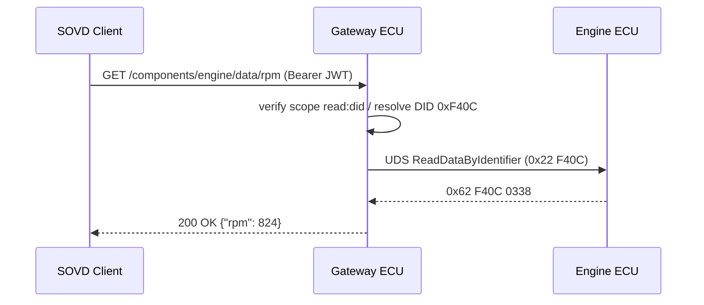

# SOVD Vehicle Data Access Requirements Specification (Vehicle Data Access)

**Grammar**: sovd-grammar.sgra
**UID**: DOC-SOVD-DATA
**Version**: 1.0

This document defines the requirements for SOVD **vehicle data access** (DID read,
periodic data, snapshots, bulk transfer) at L1 through L3. For stakeholder
requirements (L0) and use cases see `01-stakeholder-requirements.md`; for the
shared front matter (background story, terms, notation, and the ASIL/CAL usage
policy) see `00-overview.md`. Authentication and authorization assume `03-auth.md`.

Data read is not a safety function, so it is **ASIL=QM** as a rule. However, since
**access control over "who may read which data" is a security matter**, the relevant
requirements are assigned a **CAL**.

## L1 - System Requirements

**Type**: SECTION

**L1 representative sequence: SOVD-to-UDS conversion for a DID read**

The gateway verifies the scope of the client's SOVD (HTTP) request, converts it to
a UDS ReadDataByIdentifier, and returns the result as JSON.

### DID-based data identification

**Type**: REQUIREMENT
**UID**: DATA-L1-001
**TYPE**: Functional
**ASIL**: QM
**LAYER**: L1_System

**Statement**: The vehicle shall identify all vehicle data by a 16-bit DID (Data Identifier) and
make it retrievable through the SOVD API (GET /components/{ecu}/data/{did}).

**Relations**:

- **Type**: `Parent`
  **ID**: `DATA-L0-001`

### Periodic data stream

**Type**: REQUIREMENT
**UID**: DATA-L1-002
**TYPE**: Functional
**ASIL**: QM
**LAYER**: L1_System

**Statement**: When a client subscribes to multiple DIDs, the vehicle shall push the data
periodically over Server-Sent Events or WebSocket.

**Relations**:

- **Type**: `Parent`
  **ID**: `DATA-L0-002`

### Bulk download API

**Type**: REQUIREMENT
**UID**: DATA-L1-003
**TYPE**: Functional
**ASIL**: QM
**LAYER**: L1_System

**Statement**: The vehicle shall provide a resumable bulk download API using the HTTP Range
header.

**Relations**:

- **Type**: `Parent`
  **ID**: `DATA-L0-004`

### JSON payload format

**Type**: REQUIREMENT
**UID**: DATA-L1-004
**TYPE**: Constraint
**ASIL**: QM
**LAYER**: L1_System

**Statement**: The DID value responses returned by the vehicle's data access API shall be in JSON format, and the schema and data identifier model shall conform to ASAM SOVD v1.0 Part 2 (Data Model).

**Relations**:

- **Type**: `Parent`
  **ID**: `DATA-L0-001`

### Read latency

**Type**: REQUIREMENT
**UID**: DATA-L1-005
**TYPE**: Non-Functional
**ASIL**: QM
**LAYER**: L1_System

**Statement**: The vehicle's response time for a single DID read shall be within 500 ms at the
95th percentile.

**VERIFICATION**: Under representative load, the p95 of a single-DID GET response shall be within
500 ms.

**Relations**:

- **Type**: `Parent`
  **ID**: `DATA-L1-001`

### Scope-based data masking

**Type**: REQUIREMENT
**UID**: DATA-L1-006
**TYPE**: Functional
**ASIL**: QM
**CAL**: CAL3
**LAYER**: L1_System

**Statement**: If a Mechanic role accesses a DID containing personal information (such as the
owner's name), then the vehicle shall return HTTP 403 (only the OEMEngineer role
may access it).

**Rationale**: Protection of personal information. Enforce least privilege according to role.

**Relations**:

- **Type**: `Parent`
  **ID**: `AUTH-L0-002`

## L2 - ECU Software Requirements

**Type**: SECTION

### DID resolver

**Type**: REQUIREMENT
**UID**: DATA-L2-001
**TYPE**: Functional
**ASIL**: QM
**LAYER**: L2_ECU_SW

**Statement**: The gateway ECU shall maintain a mapping table from DID to physical ECU (CAN node)
and route a received DID to the responsible ECU.

**Relations**:

- **Type**: `Parent`
  **ID**: `DATA-L1-001`

### UDS ReadDataByIdentifier bridge

**Type**: REQUIREMENT
**UID**: DATA-L2-002
**TYPE**: Functional
**ASIL**: QM
**LAYER**: L2_ECU_SW

**Statement**: When a SOVD GET request is received, the gateway ECU shall send a UDS
ReadDataByIdentifier (0x22) to the responsible ECU and return the response
converted to JSON.

**Relations**:

- **Type**: `Parent`
  **ID**: `DATA-L1-001`

### Periodic data cache

**Type**: REQUIREMENT
**UID**: DATA-L2-003
**TYPE**: Non-Functional
**ASIL**: QM
**LAYER**: L2_ECU_SW

**Statement**: The gateway ECU shall hold frequently accessed DID values in an LRU cache with a
100 ms TTL to reduce the number of ECU communications.

**Relations**:

- **Type**: `Parent`
  **ID**: `DATA-L1-005`

### WebSocket subscription

**Type**: REQUIREMENT
**UID**: DATA-L2-004
**TYPE**: Functional
**ASIL**: QM
**LAYER**: L2_ECU_SW

**Statement**: The gateway ECU shall provide a WebSocket endpoint and allow concurrent
subscription to up to 32 DIDs per client.

**Relations**:

- **Type**: `Parent`
  **ID**: `DATA-L1-002`

### Bulk data compression

**Type**: REQUIREMENT
**UID**: DATA-L2-005
**TYPE**: Functional
**ASIL**: QM
**LAYER**: L2_ECU_SW

**Statement**: During bulk download, the gateway ECU shall support compressed transfer via
Content-Encoding: gzip.

**Relations**:

- **Type**: `Parent`
  **ID**: `DATA-L1-003`

### Scope evaluation middleware

**Type**: REQUIREMENT
**UID**: DATA-L2-006
**TYPE**: Functional
**ASIL**: QM
**CAL**: CAL3
**LAYER**: L2_ECU_SW

**Statement**: The gateway ECU shall attach accessible-scope metadata to each DID and check it
with the ScopeAuthorizer (PLAT-L3-002) during request processing.

**Relations**:

- **Type**: `Parent`
  **ID**: `DATA-L1-006`

### Memory usage ceiling

**Type**: REQUIREMENT
**UID**: DATA-L2-007
**TYPE**: Non-Functional
**ASIL**: QM
**LAYER**: L2_ECU_SW

**Statement**: The total heap usage of the gateway ECU's data access functionality shall be
within 4 MB.

**Relations**:

- **Type**: `Parent`
  **ID**: `DATA-L2-002`

### Non-blocking I/O thread model

**Type**: REQUIREMENT
**UID**: DATA-L2-008
**TYPE**: Constraint
**ASIL**: QM
**LAYER**: L2_ECU_SW

**Statement**: The gateway ECU's data retrieval shall be implemented with non-blocking I/O (epoll
family) and be capable of handling 100 concurrent connections on a single thread.

**Relations**:

- **Type**: `Parent`
  **ID**: `DATA-L1-005`

## L3 - Unit / Software Component Requirements

**Type**: SECTION

### DidResolver unit

**Type**: REQUIREMENT
**UID**: DATA-L3-001
**TYPE**: Functional
**ASIL**: QM
**LAYER**: L3_Unit

**Statement**: The DidResolver unit shall perform the (did_number) -> (ecu_address,
parameter_layout) mapping lookup in an O(1) hash table.

**Relations**:

- **Type**: `Parent`
  **ID**: `DATA-L2-001`

### DataCache unit

**Type**: REQUIREMENT
**UID**: DATA-L3-002
**TYPE**: Functional
**ASIL**: QM
**LAYER**: L3_Unit

**Statement**: The DataCache unit shall provide an LRU + TTL based cache, with capacity and TTL
configurable via constructor arguments.

**Relations**:

- **Type**: `Parent`
  **ID**: `DATA-L2-003`

### Floating-point representation

**Type**: REQUIREMENT
**UID**: DATA-L3-003
**TYPE**: Constraint
**ASIL**: QM
**LAYER**: L3_Unit

**Statement**: The JsonSerializer floating-point output shall be IEEE 754 double, and NaN /
Infinity shall be represented as null (conforming to RFC 8259).

**Relations**:

- **Type**: `Parent`
  **ID**: `PLAT-L3-004`
