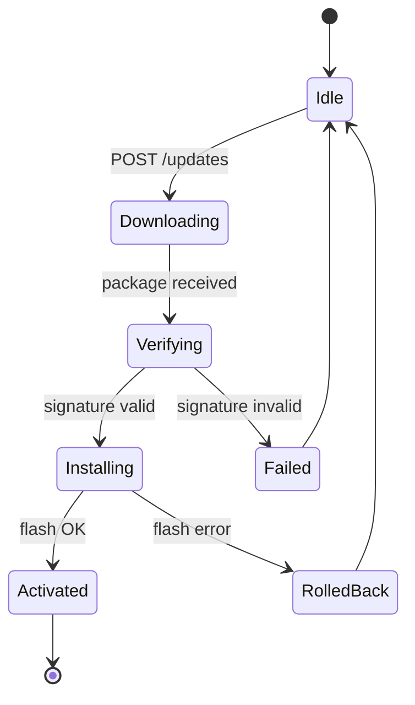

# SOVD Software Update (OTA) Requirements (Software Update)

**Grammar**: sovd-grammar.sgra
**UID**: DOC-SOVD-UPDATE
**Version**: 1.0

This document defines the requirements for **OTA (Over-The-Air) software update** via SOVD,
from L1 (system) down to L3 (unit). It covers the four phases of download, signature
verification, installation, and rollback, as well as update-time protection for functional
safety (ISO 26262) related ECUs. Stakeholder requirements (L0) and use cases are assumed
from `01-stakeholder-requirements.md`, the shared front matter from
`00-overview.md`, and authentication and authorization from `03-auth.md`.

This document is a domain where **safety (ASIL) and security (CAL) intersect**. The ban on
flash writing while the vehicle is moving is **safety (ASIL D)**, and signature verification
**prevents the installation of tampered firmware**, having both safety and security aspects,
so it is assigned **ASIL D and CAL4** (00-overview §6.3).

## L1 - System Requirements (System Requirements)

**Type**: SECTION

**L1 state machine: OTA update phases**

The OTA update follows the state machine below. If signature verification (Verifying) fails,
it does not transition to Installing but becomes Failed, and if writing (Installing) fails,
it returns to the previous version via RolledBack. This structurally prohibits "installation
of an unverified package" (SWU-L1-008).

### Update package download

**Type**: REQUIREMENT
**UID**: SWU-L1-001
**TYPE**: Functional
**ASIL**: QM
**CAL**: CAL3
**LAYER**: L1_System

**Statement**: The vehicle shall provide the POST /updates endpoint and retrieve the update package
(binary + manifest + signature) from the OEM server.

**Relations**:

- **Type**: `Parent`
  **ID**: `SWU-L0-001`
- **Type**: `Parent`
  **ID**: `SWU-L0-007`

### Package signature verification

**Type**: REQUIREMENT
**UID**: SWU-L1-002
**TYPE**: Functional
**ASIL**: D
**CAL**: CAL4
**LAYER**: L1_System

**Statement**: When a package has been downloaded, the vehicle shall verify an RSA-PSS signature of 2048-bit or stronger against the OEM root certificate chain.

**VERIFICATION**: Signature verification of a tampered package shall be determined as failed (invalid).

**Relations**:

- **Type**: `Parent`
  **ID**: `SWU-L0-002`

### A/B partition switchover

**Type**: REQUIREMENT
**UID**: SWU-L1-003
**TYPE**: Functional
**ASIL**: D
**LAYER**: L1_System

**Statement**: The vehicle's ECU shall have an A/B partition configuration, write the new firmware to the
inactive partition, and switch over via the bootloader. If the switchover fails, it shall
retain the previous partition.

**Relations**:

- **Type**: `Parent`
  **ID**: `SWU-L0-003`

### Driving-state guard

**Type**: REQUIREMENT
**UID**: SWU-L1-004
**TYPE**: Functional
**ASIL**: D
**LAYER**: L1_System

**Statement**: Before starting a flash write, the vehicle shall confirm that all of the following conditions
are met: (a) vehicle speed == 0, (b) parking brake ON, (c) shift in Park, (d) IG-OFF or ACC state.

**VERIFICATION**: With any one of the four conditions broken, a flash write shall not be started.

**Relations**:

- **Type**: `Parent`
  **ID**: `SWU-L0-004`

### Rollback API

**Type**: REQUIREMENT
**UID**: SWU-L1-005
**TYPE**: Functional
**ASIL**: C
**LAYER**: L1_System

**Statement**: The vehicle shall be able to perform an immediate rollback to the previous version via
POST /updates/rollback. While a rollback is in progress, the system shall not accept new
update, flash-write, or diagnostic-write operation requests.

**Relations**:

- **Type**: `Parent`
  **ID**: `SWU-L0-003`

### Update progress stream

**Type**: REQUIREMENT
**UID**: SWU-L1-006
**TYPE**: Functional
**ASIL**: QM
**LAYER**: L1_System

**Statement**: The vehicle shall push the update progress (0..100%) and current phase of each ECU to the
SOVD client via GET /updates/progress (Server-Sent Events).

**Relations**:

- **Type**: `Parent`
  **ID**: `SWU-L0-008`

### Interruption tolerance

**Type**: REQUIREMENT
**UID**: SWU-L1-007
**TYPE**: Functional
**ASIL**: QM
**LAYER**: L1_System

**Statement**: If a power loss or communication disconnection occurs during an update, then on resumption
the vehicle shall resume if it was downloading, retry from the beginning if it was writing,
and skip if it was already complete.

**Relations**:

- **Type**: `Parent`
  **ID**: `SWU-L0-003`

### Compliance with the OTA state machine

**Type**: REQUIREMENT
**UID**: SWU-L1-008
**TYPE**: Functional
**ASIL**: D
**CAL**: CAL4
**LAYER**: L1_System

**Statement**: The vehicle's OTA update shall follow the state machine shown above. If signature
verification (Verifying) fails, it shall not transition to Installing but become Failed, and
on a flash failure it shall return to the previous version via RolledBack.

**Rationale**: Installation of a package that failed signature verification is structurally prohibited through state transitions. Because the same state machine also handles the RolledBack transition on a flash failure, it is an example of convergence (N->1) that satisfies both tampering detection (SWU-L0-002) and automatic rollback on a write failure with a single state machine (anomaly detection and manual rollback are handled by SWU-L1-005).

**Relations**:

- **Type**: `Parent`
  **ID**: `SWU-L0-006`
- **Type**: `Parent`
  **ID**: `SWU-L0-003`

## L2 - ECU Software Requirements (ECU Software Requirements)

**Type**: SECTION

### Download manager

**Type**: REQUIREMENT
**UID**: SWU-L2-001
**TYPE**: Functional
**ASIL**: QM
**CAL**: CAL3
**LAYER**: L2_ECU_SW

**Statement**: The gateway ECU shall implement the DownloadManager and perform segmented downloading via
HTTPS Range requests, progress reporting, and integrity checking (SHA-256).

**Relations**:

- **Type**: `Parent`
  **ID**: `SWU-L1-001`

### Signature verification engine

**Type**: REQUIREMENT
**UID**: SWU-L2-002
**TYPE**: Functional
**ASIL**: D
**CAL**: CAL4
**LAYER**: L2_ECU_SW

**Statement**: The SignatureVerifier shall support both ECDSA P-256 and RSA-PSS 2048, and verify the
signature chain against the OEM root CA.

**Relations**:

- **Type**: `Parent`
  **ID**: `SWU-L1-002`

### Flash write driver

**Type**: REQUIREMENT
**UID**: SWU-L2-003
**TYPE**: Functional
**ASIL**: D
**LAYER**: L2_ECU_SW

**Statement**: The FlashWriter shall handle writing to the ECU's internal NOR flash and shall make a CRC32
verification mandatory after writing.

**Relations**:

- **Type**: `Parent`
  **ID**: `SWU-L1-003`

### VehicleStateGuard

**Type**: REQUIREMENT
**UID**: SWU-L2-004
**TYPE**: Functional
**ASIL**: D
**LAYER**: L2_ECU_SW

**Statement**: From before the update starts, the VehicleStateGuard shall monitor the four conditions of
SWU-L1-004 at a 50 ms cycle. IF even one of them breaks, THEN the VehicleStateGuard shall
emergency-abort the write.

**Relations**:

- **Type**: `Parent`
  **ID**: `SWU-L1-004`

### Rollback manager

**Type**: REQUIREMENT
**UID**: SWU-L2-005
**TYPE**: Functional
**ASIL**: C
**LAYER**: L2_ECU_SW

**Statement**: The RollbackManager shall retain the previous version's partition information and, on a
rollback request, rewrite the bootloader parameters and request a restart.

**Relations**:

- **Type**: `Parent`
  **ID**: `SWU-L1-005`

### Progress event bus

**Type**: REQUIREMENT
**UID**: SWU-L2-006
**TYPE**: Functional
**ASIL**: QM
**LAYER**: L2_ECU_SW

**Statement**: Each update phase (download / verify / write / finalize) shall publish an event to the
ProgressEventBus, and the SSE endpoint shall subscribe and deliver it.

**Relations**:

- **Type**: `Parent`
  **ID**: `SWU-L1-006`

### Resumable state machine

**Type**: REQUIREMENT
**UID**: SWU-L2-007
**TYPE**: Functional
**ASIL**: QM
**LAYER**: L2_ECU_SW

**Statement**: The state of the update state machine shall be saved in non-volatile memory and be able to
resume from the last safe state on a restart after a power loss.

**Relations**:

- **Type**: `Parent`
  **ID**: `SWU-L1-007`

### ASIL D development process

**Type**: REQUIREMENT
**UID**: SWU-L2-008
**TYPE**: Constraint
**ASIL**: D
**LAYER**: L2_ECU_SW

**Statement**: The SignatureVerifier / FlashWriter / VehicleStateGuard shall be built with an ISO 26262
ASIL D compliant development process and achieve 100% unit test coverage.

**Relations**:

- **Type**: `Parent`
  **ID**: `SWU-L1-002`

## L3 - Unit Requirements (Unit / Software Component Requirements)

**Type**: SECTION

### PackageDownloader unit

**Type**: REQUIREMENT
**UID**: SWU-L3-001
**TYPE**: Functional
**ASIL**: QM
**CAL**: CAL3
**LAYER**: L3_Unit

**Statement**: The PackageDownloader unit shall implement HTTPS Range downloading in 1 MB chunks and provide
retry on failure (exponential backoff 1s..30s).

**Relations**:

- **Type**: `Parent`
  **ID**: `SWU-L2-001`

### SignatureVerifier unit

**Type**: REQUIREMENT
**UID**: SWU-L3-002
**TYPE**: Functional
**ASIL**: D
**CAL**: CAL4
**LAYER**: L3_Unit

**Statement**: The SignatureVerifier unit shall be implemented as a stateless pure function that verifies
ECDSA P-256 and RSA-PSS 2048 signatures using OpenSSL.

**Relations**:

- **Type**: `Parent`
  **ID**: `SWU-L2-002`

### FlashSectorWriter unit

**Type**: REQUIREMENT
**UID**: SWU-L3-003
**TYPE**: Functional
**ASIL**: D
**LAYER**: L3_Unit

**Statement**: The FlashSectorWriter unit shall provide erase, write and CRC32 computation for 64 KB
sectors. The write operation shall require a prior sector erasure. IF the erase or the write
fails, THEN the FlashSectorWriter unit shall return ERROR_FLASH_VERIFY.

**Relations**:

- **Type**: `Parent`
  **ID**: `SWU-L2-003`

### VehicleStateMonitor unit

**Type**: REQUIREMENT
**UID**: SWU-L3-004
**TYPE**: Functional
**ASIL**: D
**LAYER**: L3_Unit

**Statement**: The VehicleStateMonitor unit shall read the vehicle speed, parking brake, shift and IG
signals from the CAN bus. IF all four conditions hold, THEN the VehicleStateMonitor unit shall
return TRUE. Otherwise it shall return FALSE.

**Relations**:

- **Type**: `Parent`
  **ID**: `SWU-L2-004`

### Development language restriction

**Type**: REQUIREMENT
**UID**: SWU-L3-005
**TYPE**: Constraint
**ASIL**: D
**LAYER**: L3_Unit

**Statement**: ASIL D certified units shall be implemented only in MISRA C:2012 compliant C, with dynamic
memory allocation prohibited, recursive calls prohibited, and the cyclomatic complexity of
every function <= 10.

**Relations**:

- **Type**: `Parent`
  **ID**: `SWU-L2-008`
