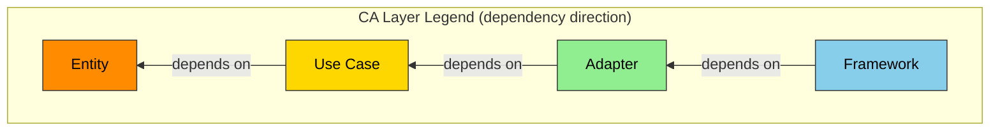

# SOVD Architecture Specification (System Architecture)

**Grammar**: sovd-grammar.sgra \
**UID**: DOC-SOVD-ARCH \
**Version**: 1.0

This document defines the **architecture (design / HOW)** of the SOVD vehicle diagnostics
system from a whole-system perspective. It captures the structure that realizes the
requirements (01, 03-07, WHAT) - the approach, components, modules, domain model, behavior,
and design decisions.

**Design granularity rule:** Each component expresses its **single responsibility (SRP) in one
sentence** and is given a name that denotes that responsibility. Interfaces/structure are shown
in the **class diagrams** (3.4), and each individual **behavior (the specification of a
responsibility)** is expressed by a **test (10) scenario** (1 behavior = 1 scenario = 1
verdict). Each component traces to the requirement it realizes via an ``Implements`` relation.

The shared front matter is in `00-overview.md`, the API contract in `09-api.md`, and the
tests in `10-test-spec.md`.

## 3.1 Architecture Concept (Architecture Concept)

**Type**: SECTION

**Approach:** Layered + separation of platform/feature. The vehicle gateway ECU terminates
SOVD (HTTP/TLS) and bridges internally to UDS (00-overview §3.1). The feature domains are built
on top of the common platform (07), and the dependency direction is one-way: feature ->
platform. Component diagrams and class diagrams are color-coded by Clean Architecture (CA)
layer. Legend:



Entity=orange / Use Case=gold / Adapter=green / Framework=blue.

## 3.2 Components (Components)

**Type**: SECTION

**Representative slice: authenticated DID read (color-coded by CA layer)**

**This figure runs past 15 lines, so it lives in its own document** -> [LINK: DOC-FIG-ARCH-CONTEXT]

Below, the main components of all domains are defined by their **single responsibility (one
sentence)** and traced to requirements. For individual behaviors (acceptance/unit verdicts),
refer to the scenarios in 10.

### Platform components (Common Platform)

**Type**: SECTION

#### TlsTerminator

**Type**: COMPONENT \
**UID**: ARCH-C-001 \
**CA_LAYER**: Framework
**Relations**:
- **Type**: `Parent` \
  **ID**: `PLAT-L3-003` \
  **Role**: `Implements`

**Statement**: Terminates TLS 1.3 for external communication.

**MODULE**: src/platform/tls_terminator.c

#### ScopeAuthorizer

**Type**: COMPONENT \
**UID**: ARCH-C-002 \
**CA_LAYER**: UseCase
**Relations**:
- **Type**: `Parent` \
  **ID**: `PLAT-L3-002` \
  **Role**: `Implements`

**Statement**: Determines whether a diagnostic operation is authorized based on the requested scope.

**MODULE**: src/platform/scope_authorizer.c

#### UdsClient

**Type**: COMPONENT \
**UID**: ARCH-C-003 \
**CA_LAYER**: Adapter
**Relations**:
- **Type**: `Parent` \
  **ID**: `PLAT-L3-001` \
  **Role**: `Implements`

**Statement**: Sends and receives UDS frames to and from the in-vehicle ECUs (with reliability control including timeouts, retries, and NRC).

**MODULE**: src/platform/uds_client.c

#### JsonSerializer

**Type**: COMPONENT \
**UID**: ARCH-C-004 \
**CA_LAYER**: Adapter
**Relations**:
- **Type**: `Parent` \
  **ID**: `PLAT-L3-004` \
  **Role**: `Implements`

**Statement**: Converts diagnostic data into the ASAM SOVD JSON format.

**MODULE**: src/platform/json_serializer.c

### Authentication domain (03-auth)

**Type**: SECTION

#### TokenVerifier

**Type**: COMPONENT \
**UID**: ARCH-C-005 \
**CA_LAYER**: UseCase
**Relations**:
- **Type**: `Parent` \
  **ID**: `AUTH-L3-001` \
  **Role**: `Implements`

**Statement**: Verifies the validity (signature, expiry, claims) of an access token (JWT).

**MODULE**: src/auth/token_verifier.c

#### TokenCache

**Type**: COMPONENT \
**UID**: ARCH-C-006 \
**CA_LAYER**: Adapter
**Relations**:
- **Type**: `Parent` \
  **ID**: `AUTH-L3-002` \
  **Role**: `Implements`

**Statement**: Caches verified tokens using LRU.

**MODULE**: src/auth/token_cache.c

### Data access domain (04-data-access)

**Type**: SECTION

#### DataReadUseCase

**Type**: COMPONENT \
**UID**: ARCH-C-007 \
**CA_LAYER**: UseCase
**Relations**:
- **Type**: `Parent` \
  **ID**: `DATA-L2-002` \
  **Role**: `Implements`

**Statement**: Orchestrates DID read requests, coordinating the platform parts for authorization, resolution, UDS read, and JSON conversion.

**MODULE**: src/data/data_read_usecase.c

#### DidResolver

**Type**: COMPONENT \
**UID**: ARCH-C-008 \
**CA_LAYER**: Adapter
**Relations**:
- **Type**: `Parent` \
  **ID**: `DATA-L3-001` \
  **Role**: `Implements`

**Statement**: Resolves a DID number to the address of the responsible ECU.

**MODULE**: src/data/did_resolver.c

#### DataCache

**Type**: COMPONENT \
**UID**: ARCH-C-009 \
**CA_LAYER**: Adapter
**Relations**:
- **Type**: `Parent` \
  **ID**: `DATA-L3-002` \
  **Role**: `Implements`

**Statement**: Caches DID values with a TTL.

**MODULE**: src/data/data_cache.c

### DTC domain (05-dtc-diagnostics)

**Type**: SECTION

#### DtcParser

**Type**: COMPONENT \
**UID**: ARCH-C-010 \
**CA_LAYER**: Adapter
**Relations**:
- **Type**: `Parent` \
  **ID**: `DTC-L3-001` \
  **Role**: `Implements`

**Statement**: Parses the binary response of UDS 0x19 into a DTC list.

**MODULE**: src/dtc/dtc_parser.c

#### FreezeFrameDecoder

**Type**: COMPONENT \
**UID**: ARCH-C-011 \
**CA_LAYER**: Adapter
**Relations**:
- **Type**: `Parent` \
  **ID**: `DTC-L3-002` \
  **Role**: `Implements`

**Statement**: Decodes a freeze frame payload into a list of (DID, value).

**MODULE**: src/dtc/freeze_frame_decoder.c

#### SpeedReader

**Type**: COMPONENT \
**UID**: ARCH-C-012 \
**CA_LAYER**: Adapter
**Relations**:
- **Type**: `Parent` \
  **ID**: `DTC-L3-003` \
  **Role**: `Implements`

**Statement**: Acquires the vehicle speed periodically and provides the latest value (ASIL C certified task).

**MODULE**: src/dtc/speed_reader.c

#### DtcHistoryStore

**Type**: COMPONENT \
**UID**: ARCH-C-013 \
**CA_LAYER**: Entity
**Relations**:
- **Type**: `Parent` \
  **ID**: `DTC-L3-004` \
  **Role**: `Implements`

**Statement**: Holds the DTC occurrence history in a ring buffer.

**MODULE**: src/dtc/dtc_history_store.c

### OTA domain (06-sw-update)

**Type**: SECTION

#### PackageDownloader

**Type**: COMPONENT \
**UID**: ARCH-C-014 \
**CA_LAYER**: Adapter
**Relations**:
- **Type**: `Parent` \
  **ID**: `SWU-L3-001` \
  **Role**: `Implements`

**Statement**: Downloads the update package in a resumable manner.

**MODULE**: src/swupdate/package_downloader.c

#### SignatureVerifier

**Type**: COMPONENT \
**UID**: ARCH-C-015 \
**CA_LAYER**: UseCase
**Relations**:
- **Type**: `Parent` \
  **ID**: `SWU-L3-002` \
  **Role**: `Implements`

**Statement**: Verifies the signature (ECDSA P-256 / RSA-PSS 2048) of the update package.

**MODULE**: src/swupdate/signature_verifier.c

#### FlashSectorWriter

**Type**: COMPONENT \
**UID**: ARCH-C-016 \
**CA_LAYER**: Adapter
**Relations**:
- **Type**: `Parent` \
  **ID**: `SWU-L3-003` \
  **Role**: `Implements`

**Statement**: Erases and writes flash sectors and verifies the write result with a CRC.

**MODULE**: src/swupdate/flash_sector_writer.c

#### VehicleStateMonitor

**Type**: COMPONENT \
**UID**: ARCH-C-017 \
**CA_LAYER**: Adapter
**Relations**:
- **Type**: `Parent` \
  **ID**: `SWU-L3-004` \
  **Role**: `Implements`

**Statement**: Determines the driving state (vehicle speed, PKB, shift, IG) that is a precondition for a flash write (ASIL D certified).

**MODULE**: src/swupdate/vehicle_state_monitor.c

## 3.3 Module / File Structure (Module / File Structure)

**Type**: SECTION

```text
src/
|-- platform/                  # 07-common-platform (shared)
|   |-- tls_terminator.c       # ARCH-C-001
|   |-- scope_authorizer.c     # ARCH-C-002
|   |-- uds_client.c           # ARCH-C-003
|   `-- json_serializer.c      # ARCH-C-004
|-- auth/                      # 03-auth
|   |-- token_verifier.c       # ARCH-C-005
|   `-- token_cache.c          # ARCH-C-006
|-- data/                      # 04-data-access
|   |-- data_read_usecase.c    # ARCH-C-007
|   |-- did_resolver.c         # ARCH-C-008
|   `-- data_cache.c           # ARCH-C-009
|-- dtc/                       # 05-dtc-diagnostics
|   |-- dtc_parser.c           # ARCH-C-010
|   |-- freeze_frame_decoder.c # ARCH-C-011
|   |-- speed_reader.c         # ARCH-C-012 (ASIL C)
|   `-- dtc_history_store.c    # ARCH-C-013
`-- swupdate/                  # 06-sw-update
    |-- package_downloader.c   # ARCH-C-014
    |-- signature_verifier.c   # ARCH-C-015
    |-- flash_sector_writer.c  # ARCH-C-016 (ASIL D)
    `-- vehicle_state_monitor.c# ARCH-C-017 (ASIL D)
```

## 3.4 Domain Model (Domain Model)

**Type**: SECTION

**Class diagram 1: authenticated DID read** (each class's methods = the component's interface)

**This figure runs past 15 lines, so it lives in its own document** -> [LINK: DOC-FIG-ARCH-CLASS-CORE]

**Class diagram 2: DTC read / clear**

**This figure runs past 15 lines, so it lives in its own document** -> [LINK: DOC-FIG-ARCH-CLASS-ADAPTER]

**Class diagram 3: OTA update**

**This figure runs past 15 lines, so it lives in its own document** -> [LINK: DOC-FIG-ARCH-CLASS-FRAMEWORK]

## 3.5 Behavior (Behavior)

**Type**: SECTION

**System sequence (representative slice: authenticated DID read, end to end)**

**This figure runs past 15 lines, so it lives in its own document** -> [LINK: DOC-FIG-ARCH-AUTH-SEQUENCE]

The representative sequences of the other domains (authentication flow, DTC guard, OTA state
machine) are placed in their respective requirement documents (03/05/06).

## 3.6 Architecture Decision Records (Architecture Decision Records)

**Type**: SECTION

**ADR-001: Terminate SOVD at the gateway and bridge to UDS**

- Status: Accepted
- Context: Outside the vehicle is HTTP/REST (SOVD); inside is the existing UDS (ISO 14229).
- Decision: Terminate SOVD at the gateway ECU and relay to the internal ECUs over UDS.
- Consequences: Existing ECUs can be made SOVD-capable without changing them. The conversion layer is concentrated in the gateway.

**ADR-002: Separation of platform / feature (common platform)**

- Status: Accepted
- Context: UDS transport, authorization, TLS, and JSON are used by multiple features.
- Decision: Factor out the shared components into 07-common-platform, and have the features depend on it.
- Consequences: The dependency direction is unified to feature -> platform. Coupling between sibling features is eliminated. Convergence (N->1) appears in the traceability.

**ADR-003: Separate safety (ASIL) and security (CAL)**

- Status: Accepted
- Context: Attaching ASIL to security requirements such as authentication mixes up safety and security.
- Decision: Manage ASIL=ISO 26262 (safety) and CAL=ISO/SAE 21434 (security) in separate fields.
- Consequences: Pure security requirements carry ASIL=QM+CAL, safety-related ones carry ASIL, and ones that intersect both carry both.

**ADR-004: OTA uses A/B partitions + a state machine**

- Status: Accepted
- Context: Risks of writing while moving, tampering, and write failure.
- Decision: Write to the inactive side, switch over only on successful signature verification, and retain the previous version on failure. The state machine (06 §L1) structurally prohibits installation of unverified packages.
- Consequences: Rollback is easy. Update-time protection of safety-related ECUs is ensured at the requirement level (ASIL D).

**ADR-005: Components have a single responsibility (SRP); behavior is specified by tests**

- Status: Accepted
- Context: Loading responsibility and specification (behavior) into a single node makes individual verification and pass/fail untraceable.
- Decision: Limit components to a single responsibility (one sentence) plus responsibility-based naming, and express individual behaviors with test (10) scenarios (1 behavior = 1 scenario = 1 verdict).
- Consequences: Each behavior has an independent pass/fail and can be tracked down to gaps in a matrix. Implementation details (Table/Buffer, etc.) are excluded from naming.
