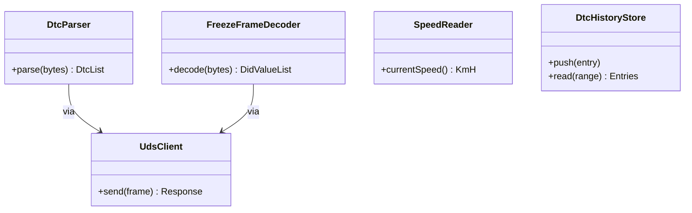

# Figure - classes of the adapter layer

**UID**: DOC-FIG-ARCH-CLASS-ADAPTER

```mermaid
classDiagram
    class DtcParser {
        +parse(bytes) DtcList
    }
    class FreezeFrameDecoder {
        +decode(bytes) DidValueList
    }
    class SpeedReader {
        +currentSpeed() KmH
    }
    class DtcHistoryStore {
        +push(entry)
        +read(range) Entries
    }
    class UdsClient {
        +send(frame) Response
    }
    DtcParser --> UdsClient : via
    FreezeFrameDecoder --> UdsClient : via
```
