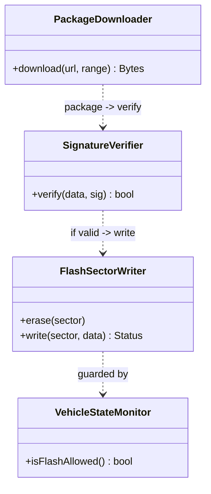

# Figure - classes of the framework layer

**UID**: DOC-FIG-ARCH-CLASS-FRAMEWORK

```mermaid
classDiagram
    class PackageDownloader {
        +download(url, range) Bytes
    }
    class SignatureVerifier {
        +verify(data, sig) bool
    }
    class FlashSectorWriter {
        +erase(sector)
        +write(sector, data) Status
    }
    class VehicleStateMonitor {
        +isFlashAllowed() bool
    }
    PackageDownloader ..> SignatureVerifier : package -> verify
    SignatureVerifier ..> FlashSectorWriter : if valid -> write
    FlashSectorWriter ..> VehicleStateMonitor : guarded by
```
