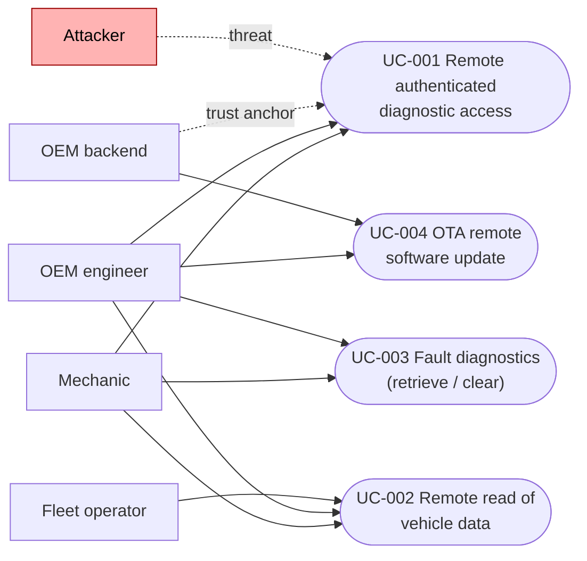

# Figure - use case map

**UID**: DOC-FIG-USECASE-MAP

```mermaid
flowchart LR
    M["Mechanic"]
    O["OEM engineer"]
    F["Fleet operator"]
    B["OEM backend"]
    X["Attacker"]:::threat
    UC1(["UC-001 Remote authenticated<br/>diagnostic access"])
    UC2(["UC-002 Remote read of<br/>vehicle data"])
    UC3(["UC-003 Fault diagnostics<br/>(retrieve / clear)"])
    UC4(["UC-004 OTA remote<br/>software update"])
    M --> UC1
    M --> UC2
    M --> UC3
    O --> UC1
    O --> UC2
    O --> UC3
    O --> UC4
    F --> UC2
    B --> UC4
    B -.->|trust anchor| UC1
    X -.->|threat| UC1
    classDef threat fill:#FFB3B3,stroke:#990000,color:#000
```
