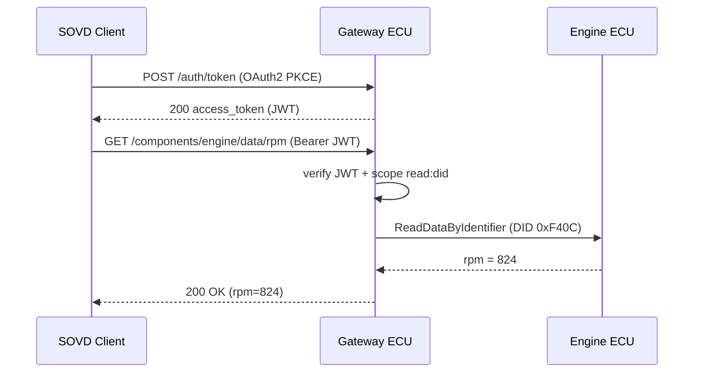

# SOVD 認証・認可 要求仕様 (Authentication & Authorization)

**Grammar**: sovd-grammar.sgra \
**UID**: DOC-SOVD-AUTH \
**Version**: 1.0

本書は SOVD の **認証・認可** 要求を L1 (システム) → L3 (ユニット) で定義する。
ステークホルダ要求 (L0)・ユースケースは `01-stakeholder-requirements.md`、 共有の前付け
(目的・用語・表記規約・ASIL/CAL の使い分け・参照規格) は `00-overview.md` を参照のこと。

本ドメイン固有の参照規格: OAuth 2.0 (RFC 6749) / PKCE (RFC 7636) / JWT (RFC 7519) /
TLS 1.3 (RFC 8446) / ISO/SAE 21434 (CAL)。 認証・認可は **サイバーセキュリティ**
機能であるため、 本書の要求は原則 **ASIL=QM** とし、 保証レベルは **CAL** で表す
(00-overview §6.3 参照)。

## L1 — システム要求 (System Requirements)

**Type**: SECTION

**L1 代表シーケンス: 認証付きデータ読み出し**

SOVD の典型フローは、 (1) OAuth2 PKCE 認証 → (2) アクセストークン (JWT) 発行 →
(3) Bearer トークンでのリソース要求 → (4) スコープ検証 → (5) UDS への変換と応答、
の順に進む。 スコープ検証より前に車両データを返してはならない (AUTH-L1-011)。

### OAuth 2.0 PKCE 認証フロー

**Type**: REQUIREMENT \
**UID**: AUTH-L1-001 \
**TYPE**: Functional \
**ASIL**: QM \
**CAL**: CAL3 \
**LAYER**: L1_System
**Relations**:
- **Type**: `Parent` \
  **ID**: `AUTH-L0-001`

**Statement**: クライアントが認証を要求したとき、 車両は OAuth 2.0 Authorization Code Flow with
PKCE によるクライアント認証を実行すること。

**VERIFICATION**: PKCE 付き認可コードフローでアクセストークンが取得でき、 code_verifier 不一致時は
認証が拒否されること。

### アクセストークンの発行

**Type**: REQUIREMENT \
**UID**: AUTH-L1-002 \
**TYPE**: Functional \
**ASIL**: QM \
**CAL**: CAL3 \
**LAYER**: L1_System
**Relations**:
- **Type**: `Parent` \
  **ID**: `AUTH-L1-001`

**Statement**: 認証に成功したとき、 車両は JWT (RFC 7519) 形式のアクセストークンを発行すること。

**VERIFICATION**: 認証成功応答に JWT 形式の access_token が含まれること。

### アクセストークンの内容

**Type**: REQUIREMENT \
**UID**: AUTH-L1-003 \
**TYPE**: Non-Functional \
**ASIL**: QM \
**CAL**: CAL2 \
**LAYER**: L1_System
**Relations**:
- **Type**: `Parent` \
  **ID**: `AUTH-L1-002`

**Statement**: 車両が発行するアクセストークンは、 有効期限 (exp) ・スコープ (scope) ・
サブジェクト ID (sub) を含むこと。

**Rationale**: 失効判断と認可判断に必要な最小クレームを保証する。

### ロールベースアクセス制御 (RBAC)

**Type**: REQUIREMENT \
**UID**: AUTH-L1-004 \
**TYPE**: Functional \
**ASIL**: QM \
**CAL**: CAL3 \
**LAYER**: L1_System
**Relations**:
- **Type**: `Parent` \
  **ID**: `AUTH-L0-002`

**Statement**: 車両は、 スコープ (read:did / read:dtc / write:dtc / write:swupdate 等) を
役割 (Mechanic / OEMEngineer / FleetOperator) ごとに割り当て可能とすること。

### 通信路の TLS 1.3 暗号化

**Type**: REQUIREMENT \
**UID**: AUTH-L1-005 \
**TYPE**: Non-Functional \
**ASIL**: QM \
**CAL**: CAL3 \
**LAYER**: L1_System
**Relations**:
- **Type**: `Parent` \
  **ID**: `AUTH-L0-003`

**Statement**: 車両は、 SOVD クライアントとゲートウェイ間の全通信を TLS 1.3 以上で
暗号化すること。

**VERIFICATION**: ハンドシェイクが TLS 1.3 以上で確立し、 平文 HTTP 接続が拒否されること。

### TLS ダウングレードの禁止

**Type**: REQUIREMENT \
**UID**: AUTH-L1-006 \
**TYPE**: Restriction \
**ASIL**: QM \
**CAL**: CAL3 \
**LAYER**: L1_System
**Relations**:
- **Type**: `Parent` \
  **ID**: `AUTH-L1-005`

**Statement**: もしクライアントが TLS 1.2 以下へのダウングレードを要求した場合、 車両は
接続を拒否すること。

**Rationale**: ダウングレード攻撃による暗号強度の低下を防ぐ。

### 相互 TLS (mTLS) 認証

**Type**: REQUIREMENT \
**UID**: AUTH-L1-007 \
**TYPE**: Functional \
**ASIL**: QM \
**CAL**: CAL3 \
**LAYER**: L1_System
**Relations**:
- **Type**: `Parent` \
  **ID**: `AUTH-L0-003`

**Statement**: OEM 内部接続を行う構成では、 車両はクライアント証明書 (X.509) による
相互 TLS 認証を追加でサポートすること。

### アクセストークンの有効期限

**Type**: REQUIREMENT \
**UID**: AUTH-L1-008 \
**TYPE**: Non-Functional \
**ASIL**: QM \
**CAL**: CAL2 \
**LAYER**: L1_System
**Relations**:
- **Type**: `Parent` \
  **ID**: `AUTH-L1-002`

**Statement**: 車両が発行するアクセストークンの有効期限は、 既定 30 分とし、 60 分を
超えないこと。

**VERIFICATION**: 既定発行トークンの exp が発行から 30 分であり、 設定可能上限でも 60 分を
超えないこと。

### トークン失効 API

**Type**: REQUIREMENT \
**UID**: AUTH-L1-009 \
**TYPE**: Functional \
**ASIL**: QM \
**CAL**: CAL3 \
**LAYER**: L1_System
**Relations**:
- **Type**: `Parent` \
  **ID**: `AUTH-L0-001`

**Statement**: 車両は、 発行済みアクセストークンを失効させる API を提供すること。

### 失効済みトークンの拒否

**Type**: REQUIREMENT \
**UID**: AUTH-L1-010 \
**TYPE**: Restriction \
**ASIL**: QM \
**CAL**: CAL3 \
**LAYER**: L1_System
**Relations**:
- **Type**: `Parent` \
  **ID**: `AUTH-L1-009`

**Statement**: もし失効済みのアクセストークンでアクセスした場合、 車両は当該要求を
即座に拒否すること。

**VERIFICATION**: 失効 API 実行後、 同一トークンでのアクセスが HTTP 401 となること。

### スコープ検証前のデータ返却の禁止

**Type**: REQUIREMENT \
**UID**: AUTH-L1-011 \
**TYPE**: Restriction \
**ASIL**: QM \
**CAL**: CAL3 \
**LAYER**: L1_System
**Relations**:
- **Type**: `Parent` \
  **ID**: `AUTH-L0-004`
- **Type**: `Parent` \
  **ID**: `AUTH-L0-002`

**Statement**: 車両は、 要求されたスコープの検証が成功する前に、 車両データを返さないこと。

**Rationale**: 認証・認可前のデータ漏洩を、 メッセージ順序の保証で構造的に防ぐ。

**VERIFICATION**: スコープ不足の要求が、 車両データを一切含まずに HTTP 403 を返すこと。

### 監査ログの記録

**Type**: REQUIREMENT \
**UID**: AUTH-L1-012 \
**TYPE**: Functional \
**ASIL**: QM \
**CAL**: CAL2 \
**LAYER**: L1_System
**Relations**:
- **Type**: `Parent` \
  **ID**: `AUTH-L0-006`

**Statement**: 車両は、 認証・認可イベント (トークン発行・検証・失効・アクセス可否判定) を監査ログとして記録できること。

## L2 — ECU ソフトウェア要求 (ECU Software Requirements)

**Type**: SECTION

**L2 の数式: 署名検証とレイテンシ予算**

JWT の RSA 署名検証は、 署名 $s$ ・公開指数 $e$ ・法 $n$ から
次式で復元したハッシュを、 受信メッセージのハッシュと比較する:

$$
m \equiv s^{e} \pmod{n}
$$

認証処理 (トークン検証 + スコープ判定) のレイテンシ予算は次を満たす (AUTH-L2-006):

$$
t_{\mathrm{auth}} = t_{\mathrm{verify}} + t_{\mathrm{scope}} \le 50\,\mathrm{ms}
$$

### 認証エンドポイント

**Type**: REQUIREMENT \
**UID**: AUTH-L2-001 \
**TYPE**: Functional \
**ASIL**: QM \
**CAL**: CAL3 \
**LAYER**: L2_ECU_SW
**Relations**:
- **Type**: `Parent` \
  **ID**: `AUTH-L1-001`

**Statement**: クライアントが OAuth 2.0 Token Request を送信したとき、 ゲートウェイ ECU は
HTTPS POST /auth/token エンドポイントでこれを受け付けること。

### JWT の検証

**Type**: REQUIREMENT \
**UID**: AUTH-L2-002 \
**TYPE**: Functional \
**ASIL**: QM \
**CAL**: CAL3 \
**LAYER**: L2_ECU_SW
**Relations**:
- **Type**: `Parent` \
  **ID**: `AUTH-L1-002`

**Statement**: アクセストークンを受信したとき、 ゲートウェイ ECU は RFC 7519 準拠の検証により
署名・有効期限・スコープを検証すること。

### スコープのチェックポイント

**Type**: REQUIREMENT \
**UID**: AUTH-L2-003 \
**TYPE**: Functional \
**ASIL**: QM \
**CAL**: CAL3 \
**LAYER**: L2_ECU_SW
**Relations**:
- **Type**: `Parent` \
  **ID**: `AUTH-L1-004`
- **Type**: `Parent` \
  **ID**: `AUTH-L1-011`

**Statement**: もし要求が必要スコープを含まない場合、 ゲートウェイ ECU は診断 API ハンドラの
処理前に HTTP 403 を返すこと。

**VERIFICATION**: 必要スコープを欠く要求が、 対象 ECU へ到達せずに 403 となること。

### TLS 終端と認証コンテキストの付与

**Type**: REQUIREMENT \
**UID**: AUTH-L2-004 \
**TYPE**: Functional \
**ASIL**: QM \
**CAL**: CAL3 \
**LAYER**: L2_ECU_SW
**Relations**:
- **Type**: `Parent` \
  **ID**: `AUTH-L1-005`

**Statement**: ゲートウェイ ECU は外部 IF で TLS 1.3 を終端し、 内部車載ネットワークへ
転送する際は認証コンテキストを内部メッセージに付与すること。

### クライアント証明書ストアの整合性検証

**Type**: REQUIREMENT \
**UID**: AUTH-L2-005 \
**TYPE**: Functional \
**ASIL**: QM \
**CAL**: CAL3 \
**LAYER**: L2_ECU_SW
**Relations**:
- **Type**: `Parent` \
  **ID**: `AUTH-L1-007`

**Statement**: 起動したとき、 ゲートウェイ ECU は信頼するクライアント CA の証明書チェーンを
保管する不揮発領域の整合性を検証すること。

### 認証処理レイテンシ

**Type**: REQUIREMENT \
**UID**: AUTH-L2-006 \
**TYPE**: Non-Functional \
**ASIL**: QM \
**CAL**: CAL2 \
**LAYER**: L2_ECU_SW
**Relations**:
- **Type**: `Parent` \
  **ID**: `AUTH-L2-002`

**Statement**: ゲートウェイ ECU は、 トークン検証とスコープチェックの合計レイテンシを、
上式 t_auth が示す 50 ms 以内に収めること。

**VERIFICATION**: 代表負荷下で、 トークン検証 + スコープ判定の 95 パーセンタイルが 50 ms 以内で
あること。

### 失効リストの同期

**Type**: REQUIREMENT \
**UID**: AUTH-L2-007 \
**TYPE**: Functional \
**ASIL**: QM \
**CAL**: CAL3 \
**LAYER**: L2_ECU_SW
**Relations**:
- **Type**: `Parent` \
  **ID**: `AUTH-L1-009`

**Statement**: 車両起動時および 1 時間ごとに、 ゲートウェイ ECU は OEM 認証サーバから
失効トークンリストを取得し、 ローカルキャッシュを更新すること。

### 認証ログの保管

**Type**: REQUIREMENT \
**UID**: AUTH-L2-008 \
**TYPE**: Constraint \
**ASIL**: QM \
**CAL**: CAL2 \
**LAYER**: L2_ECU_SW
**Relations**:
- **Type**: `Parent` \
  **ID**: `AUTH-L1-012`

**Statement**: ゲートウェイ ECU は、 全ての認証試行 (成功・失敗) を不揮発領域に
最低 30 日間保管すること。

**Rationale**: 不正アクセスの追跡 (フォレンジック) に必要。

## L3 — ユニット要求 (Unit / Software Component Requirements)

**Type**: SECTION

### TokenVerifier ユニット

**Type**: REQUIREMENT \
**UID**: AUTH-L3-001 \
**TYPE**: Functional \
**ASIL**: QM \
**CAL**: CAL3 \
**LAYER**: L3_Unit
**Relations**:
- **Type**: `Parent` \
  **ID**: `AUTH-L2-002`

**Statement**: TokenVerifier ユニットは、 JWT 文字列を入力として受け取り、 署名検証・
有効期限チェック・claim 解析の結果を返す純粋関数として実装すること。

**VERIFICATION**: 既知の有効/無効トークンのテストベクタに対し、 期待どおりの可否と理由コードを
返すこと。

### TokenCache ユニットの容量

**Type**: REQUIREMENT \
**UID**: AUTH-L3-002 \
**TYPE**: Non-Functional \
**ASIL**: QM \
**CAL**: CAL2 \
**LAYER**: L3_Unit
**Relations**:
- **Type**: `Parent` \
  **ID**: `AUTH-L2-006`

**Statement**: TokenCache ユニットは、 最大 1024 件の検証済みトークンを LRU で保持し、
メモリ使用量を 256 KB 以内とすること。

**Rationale**: 検証済みトークンの再利用で認証レイテンシ (AUTH-L2-006) を抑える。

### 実装言語・依存の制限

**Type**: REQUIREMENT \
**UID**: AUTH-L3-003 \
**TYPE**: Constraint \
**ASIL**: QM \
**CAL**: CAL2 \
**LAYER**: L3_Unit

**Statement**: 認証関連ユニットは、 MISRA C:2012 準拠の C 言語で実装し、 外部依存を
OpenSSL / cJSON のみとすること。
