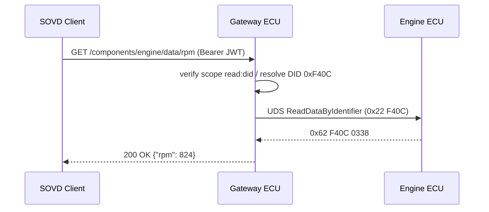

# SOVD 車両データアクセス 要求仕様 (Vehicle Data Access)

**Grammar**: sovd-grammar.sgra \
**UID**: DOC-SOVD-DATA \
**Version**: 1.0

本書は SOVD の **車両データアクセス** (DID 読み出し・周期データ・スナップショット・
バルク転送) の要求を L1→L3 で定義する。 ステークホルダ要求 (L0)・ユースケースは
`01-stakeholder-requirements.md`、 共有の前付け (背景ストーリー・用語・表記規約・
ASIL/CAL の使い分け) は `00-overview.md` を参照。 認証・認可は `03-auth.md` を前提とする。

データ読み出しは安全機能ではないため原則 **ASIL=QM**。 ただし「誰がどのデータを読めるか」
の **アクセス制御はセキュリティ事項** なので、 該当要求には **CAL** を付与する。

## L1 — システム要求 (System Requirements)

**Type**: SECTION

**L1 代表シーケンス: DID 読み出しの SOVD↔UDS 変換**

クライアントの SOVD (HTTP) 要求を、 ゲートウェイがスコープ検証のうえ UDS
ReadDataByIdentifier に変換し、 結果を JSON で返す。

### DID ベースのデータ識別

**Type**: REQUIREMENT \
**UID**: DATA-L1-001 \
**TYPE**: Functional \
**ASIL**: QM \
**LAYER**: L1_System
**Relations**:
- **Type**: `Parent` \
  **ID**: `DATA-L0-001`

**Statement**: 車両は、 全車両データを 16-bit DID (Data Identifier) で識別し、 SOVD API
(GET /components/{ecu}/data/{did}) で取得できるようにすること。

### 周期データストリーム

**Type**: REQUIREMENT \
**UID**: DATA-L1-002 \
**TYPE**: Functional \
**ASIL**: QM \
**LAYER**: L1_System
**Relations**:
- **Type**: `Parent` \
  **ID**: `DATA-L0-002`

**Statement**: クライアントが複数 DID を購読したとき、 車両は Server-Sent Events または WebSocket で
周期的にプッシュ配信すること。

### バルクダウンロード API

**Type**: REQUIREMENT \
**UID**: DATA-L1-003 \
**TYPE**: Functional \
**ASIL**: QM \
**LAYER**: L1_System
**Relations**:
- **Type**: `Parent` \
  **ID**: `DATA-L0-004`

**Statement**: 車両は、 HTTP Range ヘッダによるレジューム可能なバルクダウンロード API を
提供すること。

### JSON ペイロード形式

**Type**: REQUIREMENT \
**UID**: DATA-L1-004 \
**TYPE**: Constraint \
**ASIL**: QM \
**LAYER**: L1_System
**Relations**:
- **Type**: `Parent` \
  **ID**: `DATA-L0-001`

**Statement**: 車両のデータアクセス API が返す DID 値応答は JSON 形式とし、 スキーマおよびデータ識別子モデルは ASAM SOVD v1.0 Part 2 (Data Model) に準拠すること。

### 読み出しレイテンシ

**Type**: REQUIREMENT \
**UID**: DATA-L1-005 \
**TYPE**: Non-Functional \
**ASIL**: QM \
**LAYER**: L1_System
**Relations**:
- **Type**: `Parent` \
  **ID**: `DATA-L1-001`

**Statement**: 車両の単一 DID 読み出しの応答時間は、 95 パーセンタイルで 500 ms 以内であること。

**VERIFICATION**: 代表負荷下で、 単一 DID の GET 応答の p95 が 500 ms 以内であること。

### スコープによるデータマスキング

**Type**: REQUIREMENT \
**UID**: DATA-L1-006 \
**TYPE**: Functional \
**ASIL**: QM \
**CAL**: CAL3 \
**LAYER**: L1_System
**Relations**:
- **Type**: `Parent` \
  **ID**: `AUTH-L0-002`

**Statement**: もし個人情報を含む DID (オーナー氏名等) へ Mechanic ロールがアクセスしたならば、
車両は、 HTTP 403 を返すこと。 この DID へアクセスできるのは OEMEngineer ロール
だけであること。

**Rationale**: 個人情報の保護。 役割に応じた最小権限を徹底する。

## L2 — ECU ソフトウェア要求 (ECU Software Requirements)

**Type**: SECTION

### DID リゾルバ

**Type**: REQUIREMENT \
**UID**: DATA-L2-001 \
**TYPE**: Functional \
**ASIL**: QM \
**LAYER**: L2_ECU_SW
**Relations**:
- **Type**: `Parent` \
  **ID**: `DATA-L1-001`

**Statement**: ゲートウェイ ECU は、 DID から物理 ECU (CAN node) へのマッピングテーブルを保持し、
受信した DID を担当 ECU へルーティングすること。

### UDS ReadDataByIdentifier ブリッジ

**Type**: REQUIREMENT \
**UID**: DATA-L2-002 \
**TYPE**: Functional \
**ASIL**: QM \
**LAYER**: L2_ECU_SW
**Relations**:
- **Type**: `Parent` \
  **ID**: `DATA-L1-001`

**Statement**: SOVD GET 要求を受信したとき、 ゲートウェイ ECU は担当 ECU へ UDS
ReadDataByIdentifier (0x22) を送信し、 応答を JSON に変換して返すこと。

### 周期データキャッシュ

**Type**: REQUIREMENT \
**UID**: DATA-L2-003 \
**TYPE**: Non-Functional \
**ASIL**: QM \
**LAYER**: L2_ECU_SW
**Relations**:
- **Type**: `Parent` \
  **ID**: `DATA-L1-005`

**Statement**: ゲートウェイ ECU は、 頻繁にアクセスされる DID 値を 100 ms TTL の LRU キャッシュに
保持し、 ECU 通信回数を削減すること。

### WebSocket サブスクリプション

**Type**: REQUIREMENT \
**UID**: DATA-L2-004 \
**TYPE**: Functional \
**ASIL**: QM \
**LAYER**: L2_ECU_SW
**Relations**:
- **Type**: `Parent` \
  **ID**: `DATA-L1-002`

**Statement**: ゲートウェイ ECU は WebSocket エンドポイントを提供し、 クライアント当たり最大
32 DID の同時購読を許容すること。

### バルクデータ圧縮

**Type**: REQUIREMENT \
**UID**: DATA-L2-005 \
**TYPE**: Functional \
**ASIL**: QM \
**LAYER**: L2_ECU_SW
**Relations**:
- **Type**: `Parent` \
  **ID**: `DATA-L1-003`

**Statement**: バルクダウンロード時、 ゲートウェイ ECU は Content-Encoding: gzip による圧縮転送を
サポートすること。

### スコープ評価ミドルウェア

**Type**: REQUIREMENT \
**UID**: DATA-L2-006 \
**TYPE**: Functional \
**ASIL**: QM \
**CAL**: CAL3 \
**LAYER**: L2_ECU_SW
**Relations**:
- **Type**: `Parent` \
  **ID**: `DATA-L1-006`

**Statement**: ゲートウェイ ECU は、 各 DID にアクセス可能スコープのメタデータを付随させること。
リクエストを処理したとき、 ゲートウェイ ECU は、 そのメタデータを
ScopeAuthorizer (PLAT-L3-002) でチェックすること。

### メモリ使用上限

**Type**: REQUIREMENT \
**UID**: DATA-L2-007 \
**TYPE**: Non-Functional \
**ASIL**: QM \
**LAYER**: L2_ECU_SW
**Relations**:
- **Type**: `Parent` \
  **ID**: `DATA-L2-002`

**Statement**: ゲートウェイ ECU のデータアクセス機能全体のヒープ使用量は、 4 MB 以内とすること。

### ノンブロッキング I/O スレッドモデル

**Type**: REQUIREMENT \
**UID**: DATA-L2-008 \
**TYPE**: Constraint \
**ASIL**: QM \
**LAYER**: L2_ECU_SW
**Relations**:
- **Type**: `Parent` \
  **ID**: `DATA-L1-005`

**Statement**: ゲートウェイ ECU のデータ取得はノンブロッキング I/O (epoll 系) で実装し、 同時
100 接続をシングルスレッドで処理可能とすること。

## L3 — ユニット要求 (Unit / Software Component Requirements)

**Type**: SECTION

### DidResolver ユニット

**Type**: REQUIREMENT \
**UID**: DATA-L3-001 \
**TYPE**: Functional \
**ASIL**: QM \
**LAYER**: L3_Unit
**Relations**:
- **Type**: `Parent` \
  **ID**: `DATA-L2-001`

**Statement**: DidResolver ユニットは、 (did_number) → (ecu_address, parameter_layout) の
マッピング検索を O(1) のハッシュテーブルで行うこと。

### DataCache ユニット

**Type**: REQUIREMENT \
**UID**: DATA-L3-002 \
**TYPE**: Functional \
**ASIL**: QM \
**LAYER**: L3_Unit
**Relations**:
- **Type**: `Parent` \
  **ID**: `DATA-L2-003`

**Statement**: DataCache ユニットは、 LRU + TTL ベースのキャッシュを提供し、 容量・TTL を
コンストラクタ引数で設定可能とすること。

### 浮動小数点の表現

**Type**: REQUIREMENT \
**UID**: DATA-L3-003 \
**TYPE**: Constraint \
**ASIL**: QM \
**LAYER**: L3_Unit
**Relations**:
- **Type**: `Parent` \
  **ID**: `PLAT-L3-004`

**Statement**: JsonSerializer は、 浮動小数点を RFC 8259 に従う IEEE 754 double として出力し、
NaN と Infinity を null として表現すること。
