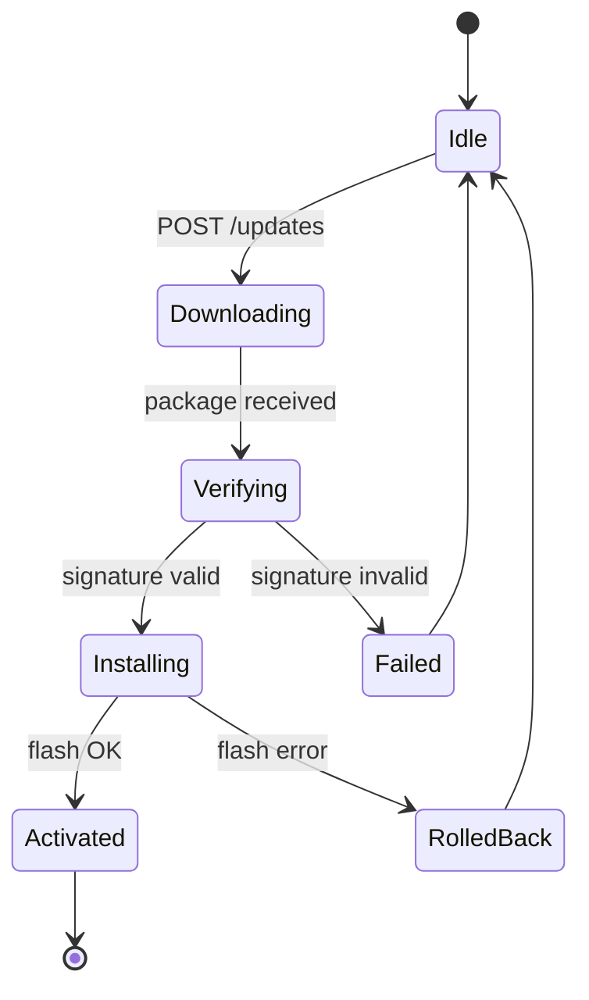

# SOVD ソフトウェア更新 (OTA) 要求仕様 (Software Update)

**Grammar**: sovd-grammar.sgra \
**UID**: DOC-SOVD-UPDATE \
**Version**: 1.0

本書は SOVD 経由の **OTA (Over-The-Air) ソフトウェア更新** の要求を L1 (システム) から
L3 (ユニット) で定義する。 ダウンロード・署名検証・インストール・ロールバックの 4
フェーズと、 機能安全 (ISO 26262) 関連 ECU の更新時保護を含む。 ステークホルダ要求
(L0)・ユースケースは `01-stakeholder-requirements.md` を、 共有の前付けは
`00-overview.md` を、 認証・認可は `03-auth.md` を前提とする。

本書は **安全 (ASIL) とセキュリティ (CAL) が交差する** ドメインである。 走行中の
フラッシュ書込禁止は **安全 (ASIL D)**、 署名検証は **改ざん FW の適用阻止** であり
安全とセキュリティの両面を持つため **ASIL D かつ CAL4** を付与する (00-overview §6.3)。

## L1 — システム要求 (System Requirements)

**Type**: SECTION

**L1 の状態機械: OTA 更新フェーズ**

OTA 更新は次の状態機械に従う。 署名検証 (Verifying) に失敗したら Installing へ
遷移せず Failed とし、 書込 (Installing) に失敗したら RolledBack で旧バージョンへ戻す。
これにより「未検証パッケージの適用」 を構造的に禁止する (SWU-L1-008)。

### 更新パッケージのダウンロード

**Type**: REQUIREMENT \
**UID**: SWU-L1-001 \
**TYPE**: Functional \
**ASIL**: QM \
**CAL**: CAL3 \
**LAYER**: L1_System
**Relations**:
- **Type**: `Parent` \
  **ID**: `SWU-L0-001`
- **Type**: `Parent` \
  **ID**: `SWU-L0-007`

**Statement**: 車両は POST /updates エンドポイントを提供し、 OEM サーバから更新パッケージ
(バイナリ + マニフェスト + 署名) を取得すること。

### パッケージ署名検証

**Type**: REQUIREMENT \
**UID**: SWU-L1-002 \
**TYPE**: Functional \
**ASIL**: D \
**CAL**: CAL4 \
**LAYER**: L1_System
**Relations**:
- **Type**: `Parent` \
  **ID**: `SWU-L0-002`

**Statement**: パッケージをダウンロードしたとき、 車両は OEM ルート証明書チェーンで RSA-PSS 2048-bit 以上の署名を検証すること。

**VERIFICATION**: 改ざんされたパッケージの署名検証が失敗 (invalid) と判定されること。

### A/B パーティション切替

**Type**: REQUIREMENT \
**UID**: SWU-L1-003 \
**TYPE**: Functional \
**ASIL**: D \
**LAYER**: L1_System
**Relations**:
- **Type**: `Parent` \
  **ID**: `SWU-L0-003`

**Statement**: 車両の ECU は A/B パーティション構成を持ち、 新ファームウェアを非アクティブ
パーティションに書込み、 ブートローダ経由で切替えること。 もし切替えに失敗した場合は
前パーティションを維持すること。

### 走行状態ガード

**Type**: REQUIREMENT \
**UID**: SWU-L1-004 \
**TYPE**: Functional \
**ASIL**: D \
**LAYER**: L1_System
**Relations**:
- **Type**: `Parent` \
  **ID**: `SWU-L0-004`

**Statement**: フラッシュ書込を開始する前に、 車両は、 (a) 車速 0、 (b) パーキングブレーキ ON、
(c) シフト P、 (d) IG-OFF または ACC 状態、 の 4 条件をすべて満たすことを
確認すること。

**VERIFICATION**: 4 条件のいずれかが崩れている状態で、 フラッシュ書込が開始されないこと。

### ロールバック API

**Type**: REQUIREMENT \
**UID**: SWU-L1-005 \
**TYPE**: Functional \
**ASIL**: C \
**LAYER**: L1_System
**Relations**:
- **Type**: `Parent` \
  **ID**: `SWU-L0-003`

**Statement**: 車両は POST /updates/rollback で前バージョンへの即時ロールバックを実行できるように
すること。 ロールバック実行中は、 本システムは新規の更新・フラッシュ書込・診断書込系の操作要求を受け付けないこと。

### 更新進捗ストリーム

**Type**: REQUIREMENT \
**UID**: SWU-L1-006 \
**TYPE**: Functional \
**ASIL**: QM \
**LAYER**: L1_System
**Relations**:
- **Type**: `Parent` \
  **ID**: `SWU-L0-008`

**Statement**: 車両は GET /updates/progress (Server-Sent Events) で、 各 ECU の更新進捗 (0..100%) と
現フェーズを SOVD クライアントへプッシュ通知すること。

### 中断耐性

**Type**: REQUIREMENT \
**UID**: SWU-L1-007 \
**TYPE**: Functional \
**ASIL**: QM \
**LAYER**: L1_System
**Relations**:
- **Type**: `Parent` \
  **ID**: `SWU-L0-003`

**Statement**: もし更新中に電源断・通信切断が発生した場合、 再開時に車両は、 ダウンロード中であれば
再開、 書込中であれば最初からリトライ、 完了済であればスキップとすること。

### OTA 状態機械の遵守

**Type**: REQUIREMENT \
**UID**: SWU-L1-008 \
**TYPE**: Functional \
**ASIL**: D \
**CAL**: CAL4 \
**LAYER**: L1_System
**Relations**:
- **Type**: `Parent` \
  **ID**: `SWU-L0-006`
- **Type**: `Parent` \
  **ID**: `SWU-L0-003`

**Statement**: 車両の OTA 更新は、 上図の状態機械に従うこと。 もし署名検証 (Verifying) に
失敗したならば、 車両は、 Installing に遷移せず Failed とすること。 もしフラッシュに
失敗したならば、 車両は、 RolledBack で旧版に戻すこと。

**Rationale**: 署名検証に失敗したパッケージの適用を、 状態遷移によって構造的に禁止する。 同じ状態機械がフラッシュ失敗時の RolledBack 遷移も扱うため、 改ざん検知 (SWU-L0-002) と書込失敗時の自動ロールバックを 1 状態機械で満たす収束 (N→1) の例 (異常検出・手動ロールバックは SWU-L1-005 が担う)。

## L2 — ECU ソフトウェア要求 (ECU Software Requirements)

**Type**: SECTION

### ダウンロードマネージャ

**Type**: REQUIREMENT \
**UID**: SWU-L2-001 \
**TYPE**: Functional \
**ASIL**: QM \
**CAL**: CAL3 \
**LAYER**: L2_ECU_SW
**Relations**:
- **Type**: `Parent` \
  **ID**: `SWU-L1-001`

**Statement**: ゲートウェイ ECU は DownloadManager を実装し、 HTTPS Range リクエストによる分割
ダウンロード・進捗報告・整合性チェック (SHA-256) を行うこと。

### 署名検証エンジン

**Type**: REQUIREMENT \
**UID**: SWU-L2-002 \
**TYPE**: Functional \
**ASIL**: D \
**CAL**: CAL4 \
**LAYER**: L2_ECU_SW
**Relations**:
- **Type**: `Parent` \
  **ID**: `SWU-L1-002`

**Statement**: SignatureVerifier は ECDSA P-256 と RSA-PSS 2048 の両方をサポートし、 OEM ルート CA で
署名チェーンを検証すること。

### フラッシュ書込ドライバ

**Type**: REQUIREMENT \
**UID**: SWU-L2-003 \
**TYPE**: Functional \
**ASIL**: D \
**LAYER**: L2_ECU_SW
**Relations**:
- **Type**: `Parent` \
  **ID**: `SWU-L1-003`

**Statement**: FlashWriter は ECU 内 NOR フラッシュへの書込を担い、 書込後に CRC32 ベリファイを
必須とすること。

### VehicleStateGuard

**Type**: REQUIREMENT \
**UID**: SWU-L2-004 \
**TYPE**: Functional \
**ASIL**: D \
**LAYER**: L2_ECU_SW
**Relations**:
- **Type**: `Parent` \
  **ID**: `SWU-L1-004`

**Statement**: 更新を開始する前から、 VehicleStateGuard は、 SWU-L1-004 の 4 条件を 50 ms 周期で
監視すること。 もし 1 つでも崩れたならば、 VehicleStateGuard は、 書込を緊急中断
すること。

### ロールバックマネージャ

**Type**: REQUIREMENT \
**UID**: SWU-L2-005 \
**TYPE**: Functional \
**ASIL**: C \
**LAYER**: L2_ECU_SW
**Relations**:
- **Type**: `Parent` \
  **ID**: `SWU-L1-005`

**Statement**: RollbackManager は、 前バージョンのパーティション情報を保持すること。
ロールバックを要求されたとき、 RollbackManager は、 ブートローダパラメータを
書き換えて再起動を要求すること。

### 進捗イベントバス

**Type**: REQUIREMENT \
**UID**: SWU-L2-006 \
**TYPE**: Functional \
**ASIL**: QM \
**LAYER**: L2_ECU_SW
**Relations**:
- **Type**: `Parent` \
  **ID**: `SWU-L1-006`

**Statement**: 各更新フェーズ (download / verify / write / finalize) は ProgressEventBus にイベントを
publish し、 SSE エンドポイントが subscribe して配信すること。

### 再開可能ステートマシン

**Type**: REQUIREMENT \
**UID**: SWU-L2-007 \
**TYPE**: Functional \
**ASIL**: QM \
**LAYER**: L2_ECU_SW
**Relations**:
- **Type**: `Parent` \
  **ID**: `SWU-L1-007`

**Statement**: 更新ステートマシンの状態は不揮発領域に保存され、 電源断後の再起動で最後の安全状態から
再開できること。

### ASIL D 開発プロセス

**Type**: REQUIREMENT \
**UID**: SWU-L2-008 \
**TYPE**: Constraint \
**ASIL**: D \
**LAYER**: L2_ECU_SW
**Relations**:
- **Type**: `Parent` \
  **ID**: `SWU-L1-002`

**Statement**: SignatureVerifier / FlashWriter / VehicleStateGuard は ISO 26262 ASIL D 準拠の開発
プロセスで構築し、 ユニットテストカバレッジ 100% を達成すること。

## L3 — ユニット要求 (Unit / Software Component Requirements)

**Type**: SECTION

### PackageDownloader ユニット

**Type**: REQUIREMENT \
**UID**: SWU-L3-001 \
**TYPE**: Functional \
**ASIL**: QM \
**CAL**: CAL3 \
**LAYER**: L3_Unit
**Relations**:
- **Type**: `Parent` \
  **ID**: `SWU-L2-001`

**Statement**: PackageDownloader ユニットは、 1 MB チャンク単位の HTTPS Range ダウンロードを実装し、
失敗時のリトライ (指数バックオフ 1s..30s) を提供すること。

### SignatureVerifier ユニット

**Type**: REQUIREMENT \
**UID**: SWU-L3-002 \
**TYPE**: Functional \
**ASIL**: D \
**CAL**: CAL4 \
**LAYER**: L3_Unit
**Relations**:
- **Type**: `Parent` \
  **ID**: `SWU-L2-002`

**Statement**: SignatureVerifier ユニットは、 OpenSSL を用いて ECDSA P-256 および RSA-PSS 2048 の
署名を検証する、 内部状態を持たない純粋関数として実装すること。

### FlashSectorWriter ユニット

**Type**: REQUIREMENT \
**UID**: SWU-L3-003 \
**TYPE**: Functional \
**ASIL**: D \
**LAYER**: L3_Unit
**Relations**:
- **Type**: `Parent` \
  **ID**: `SWU-L2-003`

**Statement**: FlashSectorWriter ユニットは、 64 KB セクタの消去・書込・CRC32 計算を提供すること。
write 操作は、 事前のセクタ消去を必須とすること。 もし消去または書込に失敗したならば、
FlashSectorWriter ユニットは、 ERROR_FLASH_VERIFY を返すこと。

### VehicleStateMonitor ユニット

**Type**: REQUIREMENT \
**UID**: SWU-L3-004 \
**TYPE**: Functional \
**ASIL**: D \
**LAYER**: L3_Unit
**Relations**:
- **Type**: `Parent` \
  **ID**: `SWU-L2-004`

**Statement**: VehicleStateMonitor ユニットは、 車速・パーキングブレーキ・シフト・IG 信号を CAN
から読み出すこと。 もし全条件を満たすならば、 VehicleStateMonitor ユニットは、
TRUE を返すこと。 満たさないならば、 FALSE を返すこと。

### 開発言語制限

**Type**: REQUIREMENT \
**UID**: SWU-L3-005 \
**TYPE**: Constraint \
**ASIL**: D \
**LAYER**: L3_Unit
**Relations**:
- **Type**: `Parent` \
  **ID**: `SWU-L2-008`

**Statement**: ASIL D 認定ユニットは、 MISRA C:2012 準拠の C 言語のみで実装し、 動的メモリ確保禁止・
再帰呼出禁止・全関数の循環的複雑度 <= 10 とすること。
