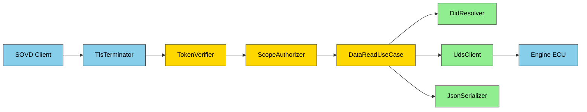

# 図 - システム構成のコンテキスト

**UID**: DOC-FIG-ARCH-CONTEXT

```mermaid
flowchart LR
    Client["SOVD Client"]:::framework
    TLS["TlsTerminator"]:::framework
    TV["TokenVerifier"]:::usecase
    SA["ScopeAuthorizer"]:::usecase
    DRU["DataReadUseCase"]:::usecase
    DID["DidResolver"]:::adapter
    UDS["UdsClient"]:::adapter
    JSON["JsonSerializer"]:::adapter
    ECU["Engine ECU"]:::framework
    Client --> TLS --> TV --> SA --> DRU
    DRU --> DID
    DRU --> UDS --> ECU
    DRU --> JSON
    classDef entity fill:#FF8C00,stroke:#333,color:#000
    classDef usecase fill:#FFD700,stroke:#333,color:#000
    classDef adapter fill:#90EE90,stroke:#333,color:#000
    classDef framework fill:#87CEEB,stroke:#333,color:#000
```
