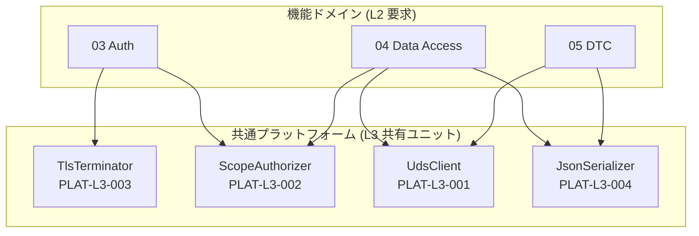

# 図 - 共通プラットフォームの共有部品

**UID**: DOC-FIG-PLATFORM-SHARED

```mermaid
flowchart TB
    subgraph FEAT["機能ドメイン (L2 要求)"]
        A["03 Auth"]
        D["04 Data Access"]
        T["05 DTC"]
    end
    subgraph PLAT["共通プラットフォーム (L3 共有ユニット)"]
        TLS["TlsTerminator<br/>PLAT-L3-003"]
        SCOPE["ScopeAuthorizer<br/>PLAT-L3-002"]
        UDS["UdsClient<br/>PLAT-L3-001"]
        JSON["JsonSerializer<br/>PLAT-L3-004"]
    end
    A --> TLS
    A --> SCOPE
    D --> SCOPE
    D --> UDS
    D --> JSON
    T --> UDS
    T --> JSON
```
