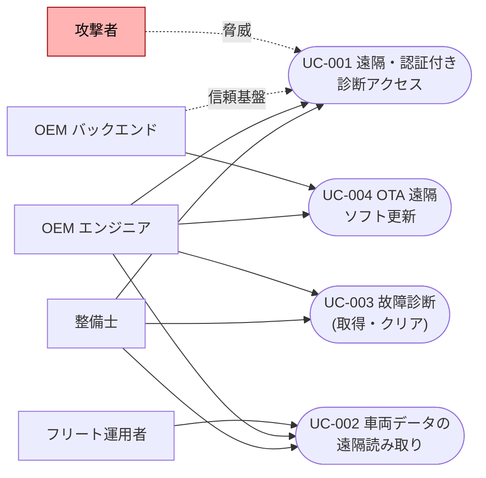

# 図 - ユースケース全体図

**UID**: DOC-FIG-USECASE-MAP

```mermaid
flowchart LR
    M["整備士"]
    O["OEM エンジニア"]
    F["フリート運用者"]
    B["OEM バックエンド"]
    X["攻撃者"]:::threat
    UC1(["UC-001 遠隔・認証付き<br/>診断アクセス"])
    UC2(["UC-002 車両データの<br/>遠隔読み取り"])
    UC3(["UC-003 故障診断<br/>(取得・クリア)"])
    UC4(["UC-004 OTA 遠隔<br/>ソフト更新"])
    M --> UC1
    M --> UC2
    M --> UC3
    O --> UC1
    O --> UC2
    O --> UC3
    O --> UC4
    F --> UC2
    B --> UC4
    B -.->|信頼基盤| UC1
    X -.->|脅威| UC1
    classDef threat fill:#FFB3B3,stroke:#990000,color:#000
```
