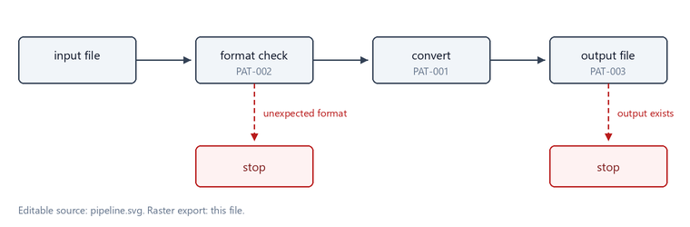

# 書き方の型 - Markdown 版

**Grammar**: patterns.sgra \
**UID**: DOC-PATTERNS-MD \
**Version**: 1.0

同じ要求を Markdown で書くとこうなる。 `.sdoc` 版とは別の UID を使っている
(同じ UID を 2 つの文書に置くことはできない)。

`# ` が文書タイトル、 `## ` が要求のタイトル、 メタは行末のバックスラッシュで
1 ブロックにまとめる。 バックスラッシュは StrictDoc 以外の Markdown ビューアで
メタ行が離れて表示されるのを防ぐためのもので、 StrictDoc の解析には不要である。

## 入力ファイルの変換

**UID**: MD-001 \
**STATUS**: Approved

**Statement**: 本ツールは、 利用者が指定した入力ファイルを出力形式へ変換すること。

## 入力形式の検査

**UID**: MD-002 \
**STATUS**: Approved

**Statement**: 本ツールは、 変換を開始する前に入力ファイルが想定した形式かを検査し、 形式が異なる場合は変換を行わずに終了すること。

**Relations**:
- **Type**: `Parent` \
  **ID**: `MD-001`

## 図の書き方が .sdoc と違う

**UID**: MD-003 \
**STATUS**: Approved

**Statement**: 本ツールの説明文書は、 図を Markdown 版に置く場合、 コードフェンスで書くこと。

**Rationale**: `.md` では ` ```mermaid ` のフェンスで書く。 `.sdoc` 側の
`.. raw:: html` + `<pre class="mermaid">` は RST の記法であり、 `.md` に書くと
そのまま文字として表示される (実測)。 どちらも最終的には `<pre class="mermaid">`
になる。


画像は `` で埋め込む。 `.sdoc` 側の `.. image::` と同じファイルを指せる。


