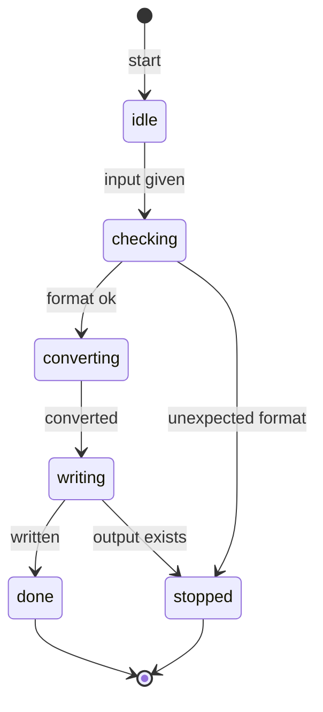

# 変換処理の状態遷移 — SSOT

**UID**: FIG-FLOW-CONVERT

`01-requirements.sdoc` の PAT-001 / PAT-002 / PAT-003 が定める振る舞いを、
状態機械として 1 枚にしたもの。 **図の正本はこのファイルである。**

図をこちらへ外に出したのは、 要求本体を短く保つためである。 要求の文言を直したら
この図も直す。 逆に、 この図だけを直して要求を放置してはならない。

- `checking` で形式が違えば変換に入らず終わる (PAT-002)
- `writing` で出力先に既存ファイルがあれば上書きせず終わる (PAT-003)
- どちらの停止も異常終了ではなく、 仕様どおりの終了である

各要求の判断の根拠は、 要求そのものの `RATIONALE` に書いてある。 **設計判断を
アセットへ外に出す必要はない** — `.sdoc` は StrictDoc の Web UI でそのまま編集でき、
要求の隣にあるほうが直し忘れが起きない。 外に出す価値があるのは、 図のように
**それ自体が独立した成果物**である場合に限る。
