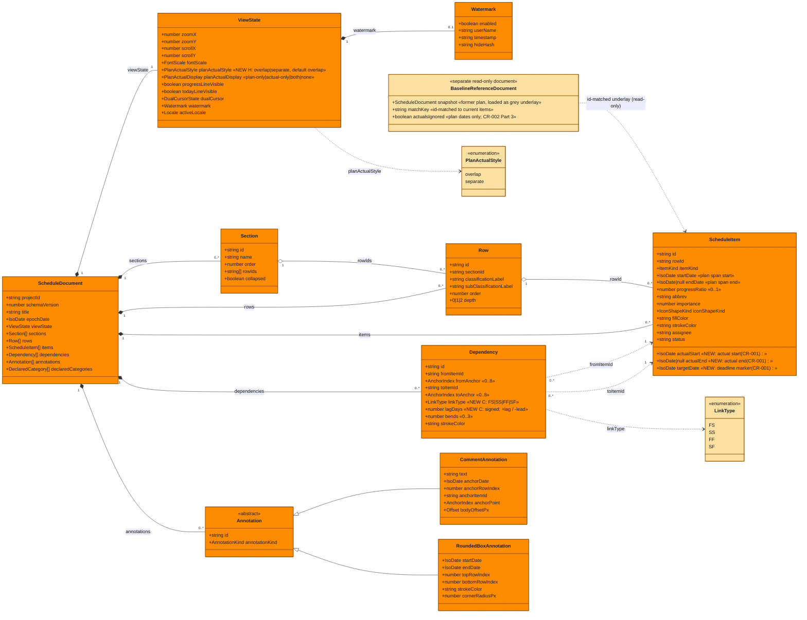

# まーくだんを

**UID**: HOGE-DOC

読ませてみる

表も

| 今日の気分 | 明日の気分 |
| ---------- | ---------- |
| 良い       | 良い       |
| 悪い       | 良い       |

図も

```mermaid
classDiagram
    direction LR

    class ScheduleDocument {
        +string projectId
        +number schemaVersion
        +string title
        +IsoDate epochDate
        +ViewState viewState
        +Section[] sections
        +Row[] rows
        +ScheduleItem[] items
        +Dependency[] dependencies
        +Annotation[] annotations
        +DeclaredCategory[] declaredCategories
    }

    class Section {
        +string id
        +string name
        +number order
        +string[] rowIds
        +boolean collapsed
    }

    class Row {
        +string id
        +string sectionId
        +string classificationLabel
        +string subClassificationLabel
        +number order
        +0|1|2 depth
    }

    class ScheduleItem {
        +string id
        +string rowId
        +ItemKind itemKind
        +IsoDate startDate  «plan span start»
        +IsoDate|null endDate  «plan span end»
        +IsoDate actualStart  «NEW: actual start (CR-001)»
        +IsoDate|null actualEnd  «NEW: actual end (CR-001)»
        +IsoDate targetDate  «NEW: deadline marker (CR-001)»
        +number progressRatio  «0..1»
        +string abbrev
        +number importance
        +IconShapeKind iconShapeKind
        +string fillColor
        +string strokeColor
        +string assignee
        +string status
    }

    class BaselineReferenceDocument {
        <<separate read-only document>>
        +ScheduleDocument snapshot  «former plan, loaded as grey underlay»
        +string matchKey  «id-matched to current items»
        +boolean actualsIgnored  «plan dates only; CR-002 Part 3»
    }

    class Dependency {
        +string id
        +string fromItemId
        +AnchorIndex fromAnchor  «0..8»
        +string toItemId
        +AnchorIndex toAnchor  «0..8»
        +LinkType linkType  «NEW C: FS|SS|FF|SF»
        +number lagDays  «NEW C: signed; +lag / -lead»
        +number bends  «0..3»
        +string strokeColor
    }

    class ViewState {
        +number zoomX
        +number zoomY
        +number scrollX
        +number scrollY
        +FontScale fontScale
        +PlanActualStyle planActualStyle  «NEW H: overlap|separate, default overlap»
        +PlanActualDisplay planActualDisplay  «plan-only|actual-only|both|none»
        +boolean progressLineVisible
        +boolean todayLineVisible
        +DualCursorState dualCursor
        +Watermark watermark
        +Locale activeLocale
    }

    class Watermark {
        +boolean enabled
        +string userName
        +string timestamp
        +string hideHash
    }

    class Annotation {
        <<abstract>>
        +string id
        +AnnotationKind annotationKind
    }
    class CommentAnnotation {
        +string text
        +IsoDate anchorDate
        +number anchorRowIndex
        +string anchorItemId
        +AnchorIndex anchorPoint
        +Offset bodyOffsetPx
    }
    class RoundedBoxAnnotation {
        +IsoDate startDate
        +IsoDate endDate
        +number topRowIndex
        +number bottomRowIndex
        +string strokeColor
        +number cornerRadiusPx
    }

    class LinkType {
        <<enumeration>>
        FS
        SS
        FF
        SF
    }
    class PlanActualStyle {
        <<enumeration>>
        overlap
        separate
    }

    ScheduleDocument "1" *-- "1" ViewState : viewState
    ScheduleDocument "1" *-- "0..*" Section : sections
    ScheduleDocument "1" *-- "0..*" Row : rows
    ScheduleDocument "1" *-- "0..*" ScheduleItem : items
    ScheduleDocument "1" *-- "0..*" Dependency : dependencies
    ScheduleDocument "1" *-- "0..*" Annotation : annotations
    ViewState "1" *-- "0..1" Watermark : watermark
    Section "1" o-- "0..*" Row : rowIds
    Row "1" o-- "0..*" ScheduleItem : rowId
    BaselineReferenceDocument ..> ScheduleItem : id-matched underlay (read-only)
    Dependency "0..*" ..> "1" ScheduleItem : fromItemId
    Dependency "0..*" ..> "1" ScheduleItem : toItemId
    Dependency ..> LinkType : linkType
    ViewState ..> PlanActualStyle : planActualStyle
    Annotation <|-- CommentAnnotation
    Annotation <|-- RoundedBoxAnnotation

    style ScheduleDocument fill:#FF8C00,stroke:#8a4b00,color:#1a1a1a
    style Section fill:#FF8C00,stroke:#8a4b00,color:#1a1a1a
    style Row fill:#FF8C00,stroke:#8a4b00,color:#1a1a1a
    style ScheduleItem fill:#FF8C00,stroke:#8a4b00,color:#1a1a1a
    style BaselineReferenceDocument fill:#FFE0A3,stroke:#8a4b00,color:#1a1a1a
    style Dependency fill:#FF8C00,stroke:#8a4b00,color:#1a1a1a
    style ViewState fill:#FF8C00,stroke:#8a4b00,color:#1a1a1a
    style Watermark fill:#FF8C00,stroke:#8a4b00,color:#1a1a1a
    style Annotation fill:#FF8C00,stroke:#8a4b00,color:#1a1a1a
    style CommentAnnotation fill:#FF8C00,stroke:#8a4b00,color:#1a1a1a
    style RoundedBoxAnnotation fill:#FF8C00,stroke:#8a4b00,color:#1a1a1a
    style LinkType fill:#FFE0A3,stroke:#8a4b00,color:#1a1a1a
    style PlanActualStyle fill:#FFE0A3,stroke:#8a4b00,color:#1a1a1a
```
