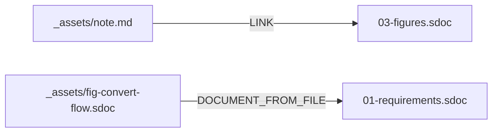

# 覚書 - _assets/ に置いた .md は 1 個の文書になる

**UID**: PATTERNS-NOTE

**このファイルは `.md` である。** それでも StrictDoc は左の文書一覧に並べる。
`_assets/` は「アセット置き場」だが、**文書の走査から外れるわけではない**
(`03-figures.sdoc` に測った結果を書いた)。

**リンクの宛先になるために要るのは 2 つだけである。**

1. `#` の見出しで始めること (無いと export 全体が止まる)
2. その直下で `**UID**:` を宣言すること

出力先のパスは書かない。StrictDoc が UID から解決し、リンクの文言は見出しから
自動で付く。`03-figures.sdoc` からはこう飛んでくる。

```text
[LINK: PATTERNS-NOTE]
```

## 取り込みとの違い

**Type**: SECTION

| | リンク `[LINK:]` | 取り込み `[DOCUMENT_FROM_FILE]` |
|---|---|---|
| 相手の拡張子 | `.md` でも `.sdoc` でもよい | **`.sdoc` だけ** |
| 相手の見え方 | 独立した文書のまま | 取り込み先の画面に展開される |
| 何個から指せるか | 何個からでも | **1 個の文書から 1 回だけ** |

**本サンプルは両方を 1 つずつ持っている。** 取り込みの実例は
`_assets/fig-convert-flow.sdoc` で、`01-requirements.sdoc` が取り込んでいる。

## 本文は普通の Markdown でよい

**Type**: SECTION

見出しの下は自由に書ける。表もフェンスもそのまま通る。



**要求ノードは 1 件も生まれない。** `**Type**: REQUIREMENT` を書かない限り、
`.md` の中身は見出しが章に、段落が地の文になるだけである。書き方は
`04-markdown-form.md` にある。
