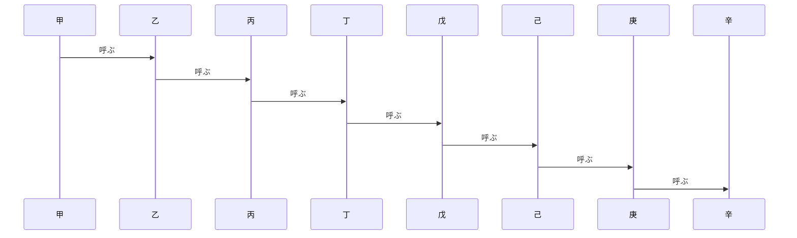
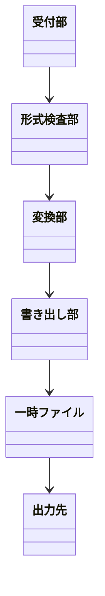

# 欠陥の見本

**Grammar**: basic.sgra \
**UID**: DOC-DEFECTS \
**Version**: 1.0

この文書は、 検出系のクエリを発火させるために置いた見本である。

## 親を持たない下位要求

**UID**: SW-009 \
**STATUS**: Draft \
**REVIEW_STATUS**: NotReviewed

**Statement**: もし親を持たないならば、 本ツールは、 D17 と D18 に出ること。

## 目安を超えたシーケンス図

**Type**: SECTION

ライフラインを 8 本置いてある。 G29 の 2 本目 (目安超えだけを出す形) を発火させる。

## 目安を超えたクラス図

**Type**: SECTION

クラスを 6 個置いてある。 G29 のクラス数の欄を発火させる。

## 崩れた表

**Type**: SECTION

| 記号 | 意味 |
|---|---|
| a | 正しい行 |
| b | 余った行 | 余分なセル |

## 数式で終わる段落

**Type**: SECTION

変換にかかる処理時間は $T$

## 届いていない添付

**Type**: SECTION

